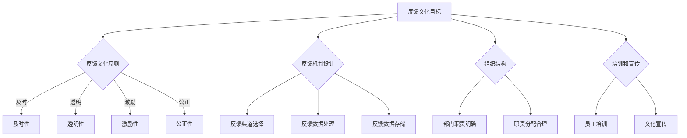

                 

# 《建立反馈文化：促进持续改进的方法》

## 关键词

- **反馈文化**
- **持续改进**
- **组织发展**
- **数据分析**
- **信息技术**

## 摘要

本文旨在探讨如何建立一个有效的反馈文化，以推动组织的持续改进。我们将深入分析反馈文化的核心概念、收集与处理反馈的方法，以及如何利用反馈来优化流程和产品。通过具体案例分析和最佳实践分享，本文将展示反馈文化在不同组织中的应用成效，并提出未来发展展望。文章结构包括引言与背景、反馈文化的核心概念与联系、收集和分析反馈、使用反馈进行持续改进、实施反馈文化、案例分析以及总结与展望七个部分。

## 引言与背景

### 反馈文化与持续改进的重要性

在信息技术飞速发展的今天，竞争日益激烈，企业需要不断提升自身竞争力以应对市场变化。而建立反馈文化，作为一种促进持续改进的重要手段，已经越来越受到企业的重视。反馈文化不仅有助于提升组织的创新能力，还能增强员工的参与感和归属感，从而推动组织的整体发展。

反馈文化，顾名思义，是一种以反馈为核心的组织文化。它强调通过及时、有效的反馈机制，不断收集和分析内外部信息，以优化流程、改进产品和服务。这种文化不仅关注结果，更注重过程，鼓励员工主动发现问题、解决问题，从而实现持续改进。

持续改进是企业永恒的主题。无论是在产品质量、客户服务，还是运营效率等方面，持续改进都能为企业带来显著的竞争优势。而反馈文化则是实现持续改进的关键，它为企业提供了一个反馈的闭环，使得企业能够不断调整和优化自身的策略和流程。

### 反馈文化的核心概念与联系

反馈文化包含多个核心概念，它们之间紧密联系，共同构成了一个完整的体系。

1. **反馈机制**：反馈机制是反馈文化的核心，它包括反馈的收集、处理、反馈的传递等多个环节。一个有效的反馈机制能够确保反馈的及时性、准确性和完整性，从而为持续改进提供有力支持。

2. **反馈渠道**：反馈渠道是反馈机制的载体，包括内部反馈渠道（如员工满意度调查、内部评审会议等）和外部反馈渠道（如客户反馈、市场调研等）。多样化的反馈渠道能够帮助企业全面了解内外部环境，从而做出更加科学的决策。

3. **反馈文化架构**：反馈文化架构是企业反馈文化的顶层设计，它明确了反馈文化的目标、原则和实施策略。一个良好的反馈文化架构能够为企业提供明确的方向，确保反馈文化的顺利实施。

4. **反馈处理与分析**：反馈处理与分析是反馈文化的关键环节，它通过对反馈数据的整理、分析和解读，为企业提供决策依据。有效的反馈处理与分析能够帮助企业快速识别问题，制定并实施改进措施。

5. **持续改进**：持续改进是反馈文化的终极目标，它通过不断收集、处理和分析反馈，推动组织的持续优化和发展。持续改进不仅体现在产品质量和客户满意度上，还体现在企业的创新能力和竞争力提升上。

### 持续改进的概念与价值

持续改进是一种以持续、逐步的方式优化流程、产品和服务的理念。它强调通过不断的尝试和调整，实现最优的运营效果。持续改进的核心是“小步快跑”，即通过一系列小规模的改进，逐步积累成果，最终实现质的飞跃。

持续改进的价值在于：

1. **提高效率**：通过持续改进，企业能够优化流程，消除浪费，提高工作效率。

2. **提升质量**：持续改进有助于发现和解决潜在问题，从而提升产品和服务的质量。

3. **增强竞争力**：持续改进能够帮助企业适应市场变化，提升客户满意度，增强竞争力。

4. **培养创新文化**：持续改进鼓励员工主动思考、解决问题，从而培养创新文化。

5. **提高员工满意度**：持续改进关注员工的成长和发展，能够提高员工的工作满意度和忠诚度。

### 反馈文化与持续改进的关系

反馈文化与持续改进密切相关。反馈文化为持续改进提供了反馈的闭环，使得企业能够不断收集、处理和分析反馈，实现持续优化。具体来说，反馈文化通过以下几个方面推动持续改进：

1. **促进问题识别**：反馈文化鼓励员工主动反馈问题，从而帮助企业快速识别潜在问题。

2. **提供决策依据**：反馈数据为管理层提供了科学的决策依据，使得改进措施更加精准和有效。

3. **加强团队合作**：反馈文化强调团队合作，通过共同解决问题，提升团队凝聚力。

4. **激发创新思维**：反馈文化鼓励员工创新思维，通过不断尝试新的方法和策略，推动企业持续改进。

### 反馈文化的核心概念与联系

反馈文化的核心概念包括反馈机制、反馈渠道、反馈文化架构、反馈处理与分析以及持续改进。这些概念之间相互联系，共同构成了一个完整的反馈文化体系。

1. **反馈机制**：反馈机制是反馈文化的核心，它包括反馈的收集、处理、反馈的传递等多个环节。一个有效的反馈机制能够确保反馈的及时性、准确性和完整性，从而为持续改进提供有力支持。

2. **反馈渠道**：反馈渠道是反馈机制的载体，包括内部反馈渠道（如员工满意度调查、内部评审会议等）和外部反馈渠道（如客户反馈、市场调研等）。多样化的反馈渠道能够帮助企业全面了解内外部环境，从而做出更加科学的决策。

3. **反馈文化架构**：反馈文化架构是企业反馈文化的顶层设计，它明确了反馈文化的目标、原则和实施策略。一个良好的反馈文化架构能够为企业提供明确的方向，确保反馈文化的顺利实施。

4. **反馈处理与分析**：反馈处理与分析是反馈文化的关键环节，它通过对反馈数据的整理、分析和解读，为企业提供决策依据。有效的反馈处理与分析能够帮助企业快速识别问题，制定并实施改进措施。

5. **持续改进**：持续改进是反馈文化的终极目标，它通过不断收集、处理和分析反馈，推动组织的持续优化和发展。持续改进不仅体现在产品质量和客户满意度上，还体现在企业的创新能力和竞争力提升上。

### 分析反馈机制

反馈机制是反馈文化的核心组成部分，它决定了反馈文化能否真正发挥作用。一个有效的反馈机制需要具备以下特点：

1. **及时性**：反馈的及时性是确保反馈文化有效性的关键。及时反馈能够帮助企业快速识别问题，及时调整策略，避免问题扩大。

2. **准确性**：反馈的准确性直接关系到反馈的质量。准确的反馈能够帮助企业准确了解实际情况，为决策提供可靠依据。

3. **完整性**：反馈的完整性要求反馈机制能够收集到全面、详实的反馈信息。完整的反馈信息能够帮助企业全面了解问题，制定更科学的改进措施。

4. **多样性**：反馈机制应具备多样性，能够从不同角度、不同层面收集反馈。多样化的反馈渠道能够确保企业能够全面了解内外部环境。

5. **透明性**：反馈机制应具备透明性，确保反馈的公开、公正和公平。透明性能够增强员工对反馈文化的信任，提高反馈的积极性。

6. **易用性**：反馈机制应简单易用，降低员工的参与门槛。易用的反馈机制能够鼓励更多员工参与反馈，提高反馈的广泛性和有效性。

### 反馈渠道的多样性与有效性

反馈渠道的多样性和有效性是反馈文化成功实施的重要保障。一个有效的反馈渠道应具备以下特点：

1. **内部反馈渠道**：

   - **员工满意度调查**：通过定期开展员工满意度调查，了解员工对工作环境、工作内容和工作关系的满意度，从而发现潜在问题。

   - **内部评审会议**：通过定期组织内部评审会议，让员工有机会提出建议和意见，共同探讨改进方案。

   - **员工反馈系统**：建立专门的员工反馈系统，提供匿名反馈通道，确保员工的意见和建议能够被听取和重视。

2. **外部反馈渠道**：

   - **客户反馈**：通过客户满意度调查、客户访谈等方式，了解客户对产品和服务的评价，识别客户需求和期望。

   - **市场调研**：通过市场调研，了解市场动态和竞争对手情况，为企业制定发展战略提供依据。

   - **社交媒体**：通过社交媒体平台，与客户、合作伙伴、行业专家等建立联系，获取实时反馈和市场信息。

### 反馈文化的架构与Mermaid流程图

反馈文化的架构是企业实施反馈文化的顶层设计，它决定了反馈文化的方向、原则和策略。一个良好的反馈文化架构应包括以下方面：

1. **目标**：明确反馈文化的目标，如提高员工满意度、提升产品质量、增强创新能力等。

2. **原则**：确立反馈文化的原则，如公正、透明、及时、激励等。

3. **实施策略**：制定具体的实施策略，如反馈机制的设计、反馈渠道的选择、反馈数据的处理和分析等。

4. **组织结构**：确保反馈文化在企业内部得到有效实施，明确各部门的职责和角色。

5. **培训和宣传**：加强对员工的培训和宣传，提高员工对反馈文化的认识和参与度。

为了更好地展示反馈文化的架构，我们可以使用Mermaid流程图进行可视化描述。以下是反馈文化架构的Mermaid流程图：

通过Mermaid流程图，我们可以清晰地看到反馈文化的各个组成部分及其相互关系，有助于企业更好地实施反馈文化。

## 收集和分析反馈

### 数据来源与收集方法

收集反馈是建立反馈文化的重要环节，数据来源的多样性和准确性直接影响反馈的有效性。以下是一些常见的数据来源和收集方法：

1. **客户反馈**：

   - **客户满意度调查**：通过电话、电子邮件或在线问卷等形式，定期对客户进行满意度调查，收集他们对产品和服务的评价。
   - **客户访谈**：通过面对面的访谈或视频通话，深入了解客户的真实需求和反馈，获取更深层次的信息。

2. **员工反馈**：

   - **员工满意度调查**：使用标准化的调查问卷，评估员工对工作环境、工作内容和工作关系的满意度。
   - **员工反馈会议**：定期组织员工反馈会议，鼓励员工提出意见和建议，共同探讨改进方案。
   - **匿名反馈系统**：建立匿名反馈系统，提供安全、便捷的反馈通道，确保员工的意见和建议能够被听取和重视。

3. **市场反馈**：

   - **市场调研**：通过问卷调查、访谈、焦点小组等方式，了解市场动态、竞争对手情况以及行业趋势。
   - **社交媒体监测**：通过社交媒体平台，监测客户、合作伙伴和行业专家对产品和服务的评价和反馈。

4. **内部反馈**：

   - **内部评审会议**：定期组织内部评审会议，让各部门和管理层共同探讨工作成效和改进方向。
   - **KPI数据**：通过关键绩效指标（KPI）数据，分析各部门和员工的工作表现，识别潜在问题。

### 数据质量与清洗

数据质量是反馈分析的基础，高质量的反馈数据能够为企业提供准确的决策依据。以下是一些确保数据质量的方法：

1. **数据完整性**：确保收集到的数据完整、无缺失，避免因数据缺失导致分析结果偏差。

2. **数据准确性**：通过数据校验、交叉验证等方法，确保数据的准确性，避免因数据错误导致决策失误。

3. **数据一致性**：确保数据格式和计量单位的一致性，便于数据整合和分析。

4. **数据清洗**：对收集到的数据进行清洗，去除重复、异常和错误数据，提高数据的可用性。

数据清洗的方法包括：

- **重复数据去除**：通过比对数据项，去除重复的数据记录。
- **异常数据检测**：使用统计学方法，检测并处理异常数据，如异常值、错误输入等。
- **数据格式转换**：统一数据格式，如日期格式、数字格式等。

### 数据存储与管理

有效的数据存储与管理是反馈文化的重要保障，以下是一些常见的数据存储与管理方法：

1. **数据库**：使用关系型数据库（如MySQL、Oracle）或NoSQL数据库（如MongoDB、Cassandra），存储和管理反馈数据。

2. **数据仓库**：构建数据仓库，整合来自不同来源的数据，提供统一的数据视图。

3. **数据湖**：将结构化和非结构化数据存储在数据湖中，便于大规模数据分析和挖掘。

4. **数据安全**：确保数据的安全性，采用数据加密、访问控制等技术，防止数据泄露和滥用。

5. **数据备份与恢复**：定期备份数据，确保数据不丢失，并在发生故障时能够快速恢复。

6. **数据访问权限**：根据用户角色和权限，设置数据访问权限，确保数据的安全性和合规性。

### 数据处理与分析工具与技术

数据处理与分析工具的选择直接影响反馈分析的效率和效果。以下是一些常用的数据处理与分析工具和技术：

1. **数据清洗工具**：

   - **OpenRefine**：一款开源的数据清洗工具，支持数据去重、格式转换等功能。
   - **DataWrangler**：一款可视化数据清洗工具，支持数据清洗、转换和分析。

2. **数据分析工具**：

   - **Excel**：一款通用的数据分析工具，适用于简单的数据分析和可视化。
   - **Power BI**：一款商业智能工具，支持数据可视化、报告生成等功能。
   - **Tableau**：一款数据可视化工具，支持多种数据源连接和分析。

3. **数据挖掘工具**：

   - **R**：一款统计编程语言，适用于数据分析和挖掘。
   - **Python**：一款通用编程语言，拥有丰富的数据分析和挖掘库（如pandas、scikit-learn等）。
   - **Hadoop**：一款分布式数据处理框架，适用于大规模数据分析和挖掘。

4. **机器学习与人工智能**：

   - **TensorFlow**：一款开源机器学习框架，适用于数据分析和预测。
   - **Keras**：一款基于TensorFlow的深度学习库，适用于神经网络建模。
   - **PyTorch**：一款开源深度学习框架，适用于数据分析和模型训练。

### 数据可视化与解读

数据可视化是反馈分析的重要环节，通过直观的图表和图形，能够更好地展示数据特征和趋势。以下是一些常见的数据可视化工具和技术：

1. **条形图**：用于展示不同类别之间的数量或比例关系。
2. **折线图**：用于展示数据随时间的变化趋势。
3. **饼图**：用于展示各部分占整体的比例。
4. **散点图**：用于展示两个变量之间的关系。
5. **热力图**：用于展示数据分布的热点区域。
6. **地图**：用于展示地理位置数据。

数据可视化工具包括：

- **Power BI**：支持多种数据可视化图表，提供自定义可视化功能。
- **Tableau**：提供丰富的数据可视化图表和交互功能。
- **D3.js**：一款基于JavaScript的数据可视化库，适用于自定义数据可视化。

数据解读应关注以下几个方面：

1. **数据趋势**：分析数据随时间的变化趋势，识别数据增长或下降的趋势。
2. **数据分布**：分析数据的分布特征，识别数据的集中或分散程度。
3. **数据关联**：分析不同变量之间的关系，识别数据之间的相关性。
4. **异常值**：识别数据中的异常值，分析其产生的原因。

通过有效的数据解读，能够为企业提供有针对性的改进建议和决策依据。

### 数据分析与反馈循环

数据分析与反馈循环是反馈文化的核心环节，通过不断收集、处理和分析反馈数据，企业能够实现持续改进。以下是如何建立有效的数据分析与反馈循环的步骤：

1. **数据收集**：通过多种渠道收集反馈数据，包括客户满意度调查、员工满意度调查、市场调研等。

2. **数据清洗**：对收集到的数据进行清洗，去除重复、异常和错误数据，确保数据质量。

3. **数据分析**：使用数据分析工具和技术，对清洗后的数据进行详细分析，识别数据中的趋势、分布和关联。

4. **数据可视化**：通过图表和图形，直观展示数据分析结果，帮助管理层更好地理解数据。

5. **反馈解读**：对数据可视化结果进行解读，识别问题、趋势和机会。

6. **决策制定**：根据数据分析结果和解读，制定相应的改进措施和决策。

7. **实施改进**：实施改进措施，并在实施过程中持续收集反馈，形成闭环。

8. **持续优化**：通过不断循环的数据分析和反馈，持续优化流程和产品，实现持续改进。

### 概括与总结

收集和分析反馈是建立反馈文化的关键步骤。通过有效的数据收集、清洗、分析和可视化，企业能够全面了解内外部环境，识别问题和机会，制定并实施改进措施。数据分析与反馈循环不仅是持续改进的基础，也是企业实现长期发展的关键。有效的反馈文化能够推动企业不断创新，提高竞争力，实现可持续发展。

## 使用反馈进行持续改进

### 反馈驱动的改进策略

在建立反馈文化的基础上，使用反馈进行持续改进是组织的核心目标。反馈驱动的改进策略包括以下关键步骤：

1. **问题识别**：首先，需要从收集到的反馈数据中识别出存在的问题。这些问题可能来自客户反馈、员工建议、市场调研或内部审计等多个渠道。识别问题的方式可以是定量的数据分析，也可以是定性的内容分析。

2. **优先级排序**：一旦问题被识别出来，就需要对其进行优先级排序。这可以通过分析问题的严重性、影响范围和改进的难易程度来确定。通常，那些影响大、紧急且容易改进的问题会被优先考虑。

3. **制定改进计划**：针对优先级最高的问题，制定具体的改进计划。改进计划应该明确改进的目标、时间表、责任人以及所需的资源和工具。

4. **执行改进**：按照制定的计划执行改进措施。在执行过程中，需要监控改进的进展，确保按照既定时间表进行。

5. **效果评估**：改进措施实施后，需要对其进行效果评估。这可以通过再次收集反馈数据、定量数据分析和定性的用户反馈来进行。评估的目的是确定改进是否达到了预期的效果，以及是否存在新的问题。

6. **持续反馈**：将评估结果作为新一轮反馈的输入，继续循环上述过程。这种持续反馈和改进的循环能够确保组织不断优化，适应不断变化的环境。

### 改进计划与执行

改进计划的制定和执行是反馈驱动改进策略的核心。以下是制定和执行改进计划的步骤：

1. **明确目标**：首先，需要明确改进的目标。这个目标应该具体、可衡量，并且与组织的整体战略目标相一致。例如，如果目标是提高客户满意度，那么具体的指标可能是减少投诉率或提高客户满意度得分。

2. **资源分配**：确定实现改进目标所需的资源，包括人力、时间、技术和资金。资源分配应该基于改进计划的具体需求，并确保资源得到合理利用。

3. **时间表**：制定详细的改进时间表，明确每个阶段的时间节点和里程碑。时间表应该考虑到各种可能的风险和延迟，并留有一定的缓冲时间。

4. **责任分配**：明确每个团队成员的责任和任务，确保每个任务都有明确的责任人。这样可以确保改进计划能够有条不紊地执行，避免责任不清或推诿现象。

5. **执行监控**：在改进计划执行过程中，需要定期监控进展，确保各项任务按时完成。监控可以通过周会、月报等形式进行，及时发现问题并采取纠正措施。

6. **沟通与协作**：保持团队成员之间的沟通和协作，确保信息共享和资源互补。有效的沟通和协作可以减少误解和冲突，提高团队的执行力。

7. **文档记录**：记录改进计划的每个步骤和结果，包括问题识别、改进措施、执行情况和效果评估等。这些文档记录不仅是改进过程的见证，也是未来参考和改进的基础。

### 改进效果的评估与反馈

改进效果的评估与反馈是反馈文化的重要组成部分，也是确保持续改进的关键步骤。以下是评估改进效果和反馈的方法：

1. **定量评估**：使用量化的指标来评估改进效果。例如，如果目标是减少生产线的故障率，可以通过故障次数、维修时间等指标来衡量改进效果。

2. **定性反馈**：除了定量评估，还需要收集定性的反馈，如用户满意度调查、员工访谈和观察等。定性的反馈可以提供更多关于改进效果的细节和上下文。

3. **对比分析**：将改进前后的数据进行对比分析，识别改进带来的变化。例如，如果目标是提高产品的质量，可以通过对比改进前后的缺陷率、退货率等指标来评估效果。

4. **用户反馈**：直接从用户那里收集反馈，了解他们对改进的满意度和感受。用户的反馈可以直接反映出改进措施的实际效果。

5. **效果会议**：定期召开效果评估会议，让团队成员共同讨论和评估改进的效果。这种会议不仅能够提供反馈，还能够促进团队成员之间的沟通和协作。

6. **持续改进**：将评估结果作为新一轮反馈的输入，继续循环改进过程。通过持续改进，组织能够不断提升自身的能力和绩效。

### 反馈文化在持续改进中的重要性

反馈文化在持续改进中起着至关重要的作用。它不仅为企业提供了一个持续改进的机制，还能够促进以下方面的提升：

1. **创新能力**：反馈文化鼓励员工提出新想法和建议，从而激发创新能力。通过不断尝试和优化，组织能够持续创新，保持竞争优势。

2. **团队协作**：反馈文化强调团队合作，通过共同解决问题，增强团队成员之间的信任和协作。这种协作能够提高团队的整体绩效。

3. **员工参与度**：反馈文化使员工感到自己的意见和建议被重视，从而提高工作满意度和参与度。这种参与感能够激发员工的工作热情和创造力。

4. **组织学习**：反馈文化促使组织不断学习和适应，通过收集和分析反馈，组织能够不断优化自身，提升整体能力。

5. **持续改进**：反馈文化确保组织能够持续改进，通过不断收集、处理和分析反馈，组织能够不断优化流程、产品和策略。

### 实施反馈文化的策略与技巧

实施反馈文化需要系统的规划和有效的策略。以下是一些策略和技巧，帮助企业成功实施反馈文化：

1. **高层支持**：高层管理者的支持是反馈文化成功实施的关键。领导层的参与和承诺能够为整个组织树立榜样，激励员工积极参与反馈。

2. **明确目标**：明确反馈文化的目标，确保所有团队成员都理解反馈文化的重要性。目标应该具体、可衡量，并与组织的整体战略目标相一致。

3. **建立反馈机制**：设计并实施有效的反馈机制，包括反馈的收集、处理和传递。确保反馈渠道多样、畅通，并提供匿名反馈通道，确保员工的意见和反馈能够被听取。

4. **培训与教育**：加强对员工的培训和指导，提高他们对反馈文化的认识和参与度。培训内容应包括反馈的技巧、如何提出建设性的反馈等。

5. **文化宣传**：通过内部宣传和沟通，提高员工对反馈文化的认识和接受度。可以采用内部邮件、公告板、会议等形式，宣传反馈文化的重要性和成功案例。

6. **激励措施**：建立激励机制，鼓励员工积极参与反馈。例如，对提出有效改进建议的员工给予奖励或认可，提高员工的参与积极性。

7. **持续优化**：反馈文化是一个持续优化的过程。通过定期评估和调整反馈机制，确保反馈文化的实施效果不断提升。

### 实施反馈文化中面临的挑战与解决方案

尽管反馈文化在持续改进中具有重要作用，但其实施过程中也面临着一系列挑战。以下是一些常见挑战及其解决方案：

1. **员工抵触情绪**：一些员工可能对反馈持怀疑态度，担心反馈会导致个人利益受损或增加工作压力。解决方法是进行有效的沟通，解释反馈文化的目的和好处，并建立信任关系。

2. **反馈质量不高**：收集到的反馈可能质量不高，无法提供有效的改进建议。解决方法是提供反馈技巧培训，提高员工的反馈能力，同时优化反馈收集机制，确保反馈的准确性和完整性。

3. **资源限制**：实施反馈文化可能需要额外的资源投入，如培训、技术支持和时间。解决方法是合理规划资源，确保在预算范围内有效实施反馈文化。

4. **反馈延迟**：反馈数据的收集和分析可能存在延迟，影响改进的及时性。解决方法是优化反馈流程，提高数据收集和分析的效率。

5. **文化适应**：在组织文化中引入反馈文化可能需要一定时间来适应。解决方法是逐步推进，从小范围试点开始，逐步扩大反馈文化的实施范围。

6. **隐私保护**：匿名反馈的隐私保护是实施反馈文化的重要问题。解决方法是确保反馈系统的安全性，采用加密技术和访问控制，保护员工隐私。

### 成功案例研究

以下是一些成功实施反馈文化的案例研究，展示反馈文化在不同组织中的应用成效：

1. **案例一：科技公司A**

   公司A是一家高科技企业，通过实施反馈文化，成功提升了产品质量和客户满意度。公司建立了多渠道的反馈机制，包括客户满意度调查、员工反馈会议和在线反馈平台。通过定期的反馈数据分析，公司能够快速识别问题并制定改进措施。例如，通过客户反馈，公司发现某一产品在性能上存在不足，及时调整了产品设计，最终大幅提升了客户满意度。

2. **案例二：制造企业B**

   制造企业B通过实施反馈文化，实现了生产效率的提升和产品质量的优化。公司建立了反馈机制，鼓励员工提出改进建议，并设立了专门的反馈奖励制度。通过员工的积极参与，公司不断优化生产流程，减少了生产故障率，提高了生产效率。此外，通过分析员工反馈，公司发现了一些影响工作效率的问题，并采取了针对性的改进措施。

3. **案例三：金融服务公司C**

   金融服务公司C通过实施反馈文化，提高了客户服务质量和员工满意度。公司建立了客户反馈机制，定期收集客户对服务质量的评价，并通过数据分析识别出客户关注的问题。公司根据反馈数据，不断改进服务流程，提升了客户满意度。同时，公司也建立了员工反馈机制，鼓励员工提出意见和建议。通过分析员工反馈，公司发现了一些影响员工工作满意度的因素，并采取了改进措施，如优化工作环境、提供培训机会等。

### 总结与展望

通过成功案例可以看出，反馈文化在促进持续改进方面具有重要作用。它不仅帮助企业识别问题和机会，还提升了创新能力和团队协作，推动了组织的整体发展。未来，随着技术的进步和市场竞争的加剧，反馈文化将在组织中扮演更加重要的角色。以下是对未来反馈文化发展的展望：

1. **数据驱动的反馈**：随着大数据和人工智能技术的发展，反馈将更加数据化、智能化。数据驱动的反馈将能够更准确地识别问题，提供更科学的改进建议。

2. **全员参与**：反馈文化将更加普及，从高层管理者到普通员工，全员参与反馈将提升反馈的质量和广泛性。

3. **实时反馈**：实时反馈技术的应用将缩短反馈周期，使组织能够更快速地响应市场和客户需求。

4. **跨组织反馈**：企业间的反馈合作将变得更加普遍，通过共享反馈数据，组织能够更好地了解行业趋势和市场动态。

5. **反馈文化的自动化**：随着自动化工具和人工智能技术的发展，反馈文化的实施将更加自动化，提高反馈效率和准确性。

总之，反馈文化是组织持续改进的重要保障，未来它将在组织中发挥更加重要的作用，推动组织不断进步和发展。

## 总结与展望

### 全文回顾

本文从多个角度探讨了建立反馈文化的重要性以及如何通过反馈文化推动组织的持续改进。我们首先介绍了反馈文化和持续改进的核心概念，分析了反馈文化的核心组成部分和架构，阐述了收集与处理反馈的方法，并讨论了如何利用反馈进行持续改进。通过具体的案例分析，我们展示了反馈文化在不同组织中的应用成效，提出了实施反馈文化的策略与技巧，并展望了未来反馈文化的发展趋势。

### 反馈文化的核心意义

反馈文化在组织发展中具有至关重要的意义。它不仅有助于提高产品质量、客户满意度和员工参与度，还能促进组织的创新能力和竞争力。通过建立反馈文化，组织能够形成一种持续学习和优化的氛围，使员工更加积极主动地发现问题、解决问题，从而推动组织的持续改进。

### 持续改进的价值

持续改进是组织发展的永恒主题。它不仅能够提高运营效率，减少浪费，还能提升产品和服务的质量，增强组织的竞争力。在快速变化的市场环境中，持续改进能够帮助组织快速适应变化，抓住机遇，实现长期发展。

### 反馈文化与持续改进的相互关系

反馈文化与持续改进密切相关。反馈文化为持续改进提供了持续的反馈机制，使得组织能够不断收集、处理和分析反馈，及时调整和优化流程、产品和策略。通过反馈文化，组织能够形成一种持续改进的闭环，不断提升自身的能力和绩效。

### 实施反馈文化的挑战与解决方案

在实施反馈文化过程中，组织可能会面临员工抵触、反馈质量不高、资源限制等挑战。为了克服这些挑战，组织可以采取以下措施：

- **高层支持**：确保领导层的参与和承诺，树立榜样，激励员工积极参与反馈。
- **明确目标**：设定具体、可衡量的反馈目标，确保所有员工都理解反馈文化的重要性。
- **培训与教育**：提供反馈技巧培训，提高员工的反馈能力和参与度。
- **激励措施**：建立激励机制，鼓励员工提出有效改进建议。
- **文化宣传**：通过内部宣传和沟通，提高员工对反馈文化的认识和接受度。

### 总结与展望

通过本文的探讨，我们可以看到反馈文化在组织发展中的核心地位和重要作用。反馈文化不仅是促进持续改进的关键，也是组织实现长期发展的基础。在未来，随着技术的进步和市场竞争的加剧，反馈文化将在组织中发挥更加重要的作用。我们期待组织能够积极拥抱反馈文化，不断优化和提升自身的能力，实现可持续发展。

### 最佳实践 Tips

1. **建立明确的反馈目标**：确保反馈目标与组织的整体战略目标一致，具体、可衡量，以便员工能够清晰了解反馈的价值和方向。

2. **多样化反馈渠道**：提供多种渠道供员工和客户反馈意见，如在线调查、面对面访谈、匿名反馈系统等，确保反馈的广泛性和多样性。

3. **定期反馈与评估**：建立定期的反馈机制，确保反馈的及时性和持续性。同时，定期对反馈结果进行评估，及时调整反馈策略。

4. **激励机制**：建立激励机制，鼓励员工积极参与反馈，并对提出有效改进建议的员工给予奖励和认可。

5. **全员参与**：鼓励全员参与反馈，从高层管理者到普通员工，共同推动组织的持续改进。

6. **培训与指导**：提供反馈技巧培训，提高员工的反馈能力和参与度，确保反馈的质量和有效性。

7. **透明与公正**：确保反馈过程的透明性和公正性，建立信任机制，使员工感到自己的意见和建议被重视。

### 注意事项

1. **保护隐私**：确保匿名反馈的安全性和隐私保护，建立信任机制，鼓励员工勇于提出真实的反馈。

2. **避免负面反馈**：积极处理负面反馈，将其视为改进的机会，而非批评和指责。

3. **持续改进**：将反馈文化作为持续改进的一部分，不断优化和调整反馈机制，确保其适应组织的发展需求。

4. **数据安全**：确保反馈数据的存储和管理安全，防止数据泄露和滥用。

5. **反馈闭环**：建立反馈闭环，确保反馈得到及时处理和回应，形成有效的持续改进循环。

### 拓展阅读

- **《精益思想：精益管理实践指南》**：作者詹姆斯·P·沃麦克，介绍了精益管理的核心思想和实践方法，对建立反馈文化和推动持续改进具有借鉴意义。
- **《敏捷开发实践指南》**：作者杰夫·萨瑟兰，介绍了敏捷开发的方法和原则，强调反馈在敏捷开发中的重要性，有助于理解如何在实际项目中实施反馈文化。
- **《数据分析：原理、方法与应用》**：作者刘鹏，系统介绍了数据分析的基本原理、方法和应用，有助于深入理解如何收集、处理和分析反馈数据。
- **《用户思维：如何构建以用户为中心的产品》**：作者唐纳德·诺曼，探讨了用户思维在产品设计和开发中的应用，强调用户反馈在产品设计中的重要性。

### 作者信息

作者：AI天才研究院/AI Genius Institute & 禅与计算机程序设计艺术 /Zen And The Art of Computer Programming

通过以上内容的详细阐述，我们不仅理解了反馈文化的核心概念和实施方法，还认识到其在组织持续改进中的关键作用。希望本文能够为读者提供有价值的参考和启发，助力组织建立和优化反馈文化，实现持续改进和长期发展。

