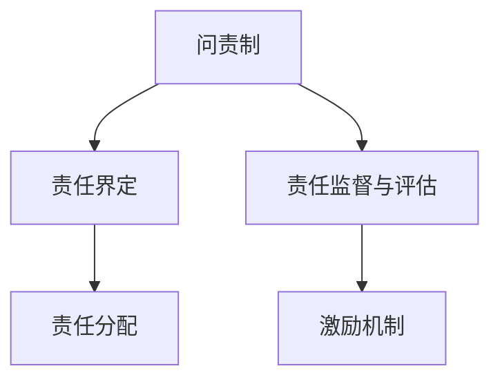

                 

### 文章标题：建立问责制：确保团队成员负责任地完成任务

#### 关键词：问责制、团队责任、监督评估、项目进度、风险管理、成功案例

#### 摘要：
本文将深入探讨建立问责制的必要性，以及如何确保团队成员负责任地完成任务。我们将通过理论分析、算法讲解、数学模型和实际案例分析，系统地阐述问责制的核心概念、责任监督与评估机制、团队合作与沟通、项目管理与进度跟踪、风险管理与问题解决等方面的内容，旨在为读者提供一套实用且有效的问责体系。

---

# 引言

在现代企业的运作中，团队协作和项目管理已成为核心环节。然而，如何确保团队成员能够负责任地完成任务，成为了一个关键问题。建立问责制，正是为了解决这一问题，通过明确责任、监督评估、激励约束等手段，推动团队成员积极履行职责，提高工作效率和项目成功率。

## 问责制的理论基础

### 核心概念与联系



### 责任界定与分配

责任界定是建立问责制的第一步，需要明确团队成员的职责和工作范围。责任分配则是在此基础上，将具体任务分配给合适的团队成员。

### 问责机制设计

问责机制包括责任监督、评估、激励等环节。责任监督主要通过监控团队成员的工作过程和成果，评估则是对团队成员的工作表现进行量化评价，激励则是通过奖励机制激发团队成员的工作积极性。

## 责任监督与评估机制

### 责任监督工具与方法

责任监督工具包括工作日志、进度报告、在线监控等。这些工具可以帮助管理者实时掌握团队成员的工作状态，及时发现并解决问题。

### 评估指标与模型

```python
def evaluate_performance(employee):
    # 计算绩效指标
    score = calculate_score(employee.tasks_completed, employee.time_spent)
    return score
```

### 激励机制设计

激励机制包括奖金、晋升、培训等。通过激励，可以激发团队成员的工作热情和创造力，提高工作效率和项目质量。

## 团队合作与沟通

### 团队合作的重要性

团队合作是实现团队目标的关键。通过有效的团队合作，可以充分发挥每个成员的优势，提高项目成功率。

### 沟通技巧与责任传达

良好的沟通是团队合作的基础。责任传达是确保团队成员明确自己的职责和工作目标的关键。

### 冲突解决与责任承担

在团队合作中，冲突难以避免。通过建立有效的冲突解决机制，可以帮助团队化解矛盾，确保项目的顺利进行。

## 项目管理与进度跟踪

### 项目管理概述

项目管理是确保项目按计划顺利进行的关键。通过项目计划、资源分配、进度跟踪等手段，可以有效地控制项目进度。

### 进度跟踪工具与方法

进度跟踪工具包括甘特图、看板图等。这些工具可以帮助管理者实时掌握项目进度，及时调整计划。

### 风险评估与责任分解

风险评估是项目管理的重要环节。通过识别风险、评估风险影响，可以提前制定应对策略，降低项目风险。

## 风险管理与问题解决

### 风险管理框架

风险管理框架包括风险识别、风险评估、风险应对等环节。通过建立风险管理框架，可以系统性地管理项目风险。

### 问题识别与责任归属

问题识别是风险管理的关键。通过及时发现并解决问题，可以降低项目风险，确保项目顺利进行。

### 问题解决策略

问题解决策略包括快速响应、资源调配、沟通协调等。通过有效的策略，可以迅速解决问题，降低项目风险。

## 成功案例分析

### 案例一：责任明确，高效协作

案例一介绍了如何通过明确责任和高效协作，实现项目成功。通过本案例，我们可以学习到如何在实际项目中应用问责制。

### 案例二：灵活应对，及时调整

案例二展示了在面对项目变化和挑战时，如何通过灵活应对和及时调整，确保项目顺利进行。通过本案例，我们可以了解到问责制在实际项目中的应用。

### 案例三：持续改进，责任至上

案例三讲述了如何通过持续改进和强化责任意识，推动项目持续发展。通过本案例，我们可以认识到问责制在项目中的重要性。

## 结论

建立问责制是确保团队成员负责任地完成任务的关键。通过本文的讨论，我们了解了问责制的核心概念、责任监督与评估机制、团队合作与沟通、项目管理与进度跟踪、风险管理与问题解决等方面的内容。在实践中，结合具体项目特点和团队实际情况，灵活应用问责制，可以显著提高项目成功率。

## 附录：最佳实践与注意事项

### 最佳实践

1. 明确责任，避免模糊责任界定。
2. 定期评估，确保绩效公正合理。
3. 激励机制要与绩效挂钩。
4. 建立有效的沟通渠道，确保信息畅通。
5. 加强风险管理，提前识别风险。

### 注意事项

1. 避免过度依赖问责制，影响团队合作。
2. 适度激励，避免形成依赖。
3. 避免频繁变更责任，影响团队成员的稳定性。
4. 注重团队建设，培养团队凝聚力。

## 拓展阅读

1. 《敏捷开发实践指南》
2. 《项目管理知识体系指南》
3. 《团队协作技巧》

---

作者：AI天才研究院/AI Genius Institute & 禅与计算机程序设计艺术 /Zen And The Art of Computer Programming

本文以建立问责制为核心，通过理论分析、算法讲解、数学模型和实际案例分析，系统地阐述了确保团队成员负责任地完成任务的方法和技巧。希望通过本文，读者能够深入理解问责制的本质，并在实际项目中灵活应用，提升项目成功率。

