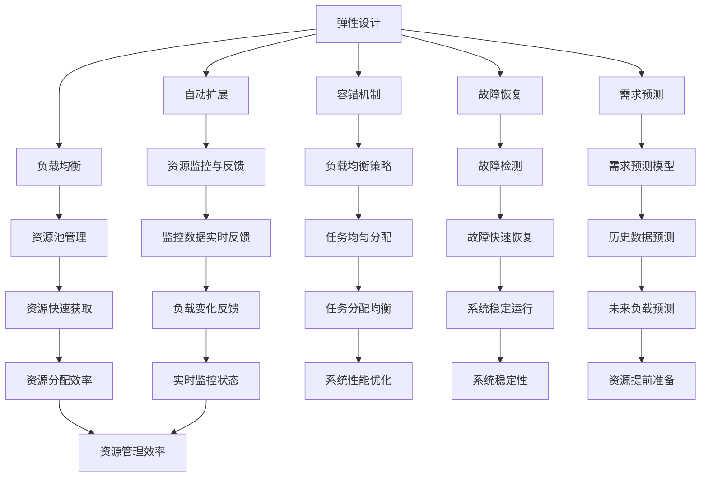

                 

### 文章标题：弹性设计：提高LLM应用的可靠性

> 关键词：弹性设计，可靠性，LLM应用，负载均衡，容错机制，自动扩展，数据质量管理

> 摘要：本文探讨了在LLM（大型语言模型）应用中实现弹性设计的重要性，并详细分析了如何通过弹性设计策略提高应用的可靠性。文章首先介绍了弹性设计的核心概念与原理，随后讨论了LLM应用中的可靠性挑战。接着，文章提出了具体的弹性设计策略和实践措施，包括自动扩展、负载均衡、容错与故障恢复、弹性需求分析与预测等。最后，通过实际案例分析和未来展望，总结了弹性设计在提高LLM应用可靠性方面的应用和趋势。

### 第1章 弹性设计的核心概念与原理

#### 1.1 弹性设计的定义与重要性

弹性设计（Elastic Design）是一种在计算机系统中应用的设计原则，旨在确保系统在面对负载变化时能够灵活调整其资源使用，从而保持高可用性和高性能。在云计算、大数据和人工智能等高速发展的领域，弹性设计已经成为确保系统可靠性的关键因素。

**弹性设计的核心概念**包括：

- **自动扩展**：系统能够根据负载自动增加或减少资源使用。
- **负载均衡**：分布式资源均衡地分配任务，以避免单点过载。
- **容错机制**：系统在发生故障时能够自动恢复或切换到其他可用资源。
- **故障恢复**：系统能够从故障中快速恢复，减少停机时间。
- **需求预测**：通过分析历史数据预测未来负载，以优化资源分配。

**弹性设计的重要性**在于：

- **提高可用性**：弹性设计能够确保系统在负载高峰时保持稳定，减少系统崩溃或性能下降的风险。
- **优化成本**：通过动态调整资源使用，企业能够更好地控制成本。
- **提升用户体验**：系统的高可用性和高性能能够为用户提供更好的体验。

#### 1.2 弹性设计的基本原则

弹性设计的基本原则包括：

- **可扩展性**：系统应该能够轻松地添加或移除资源，以应对负载变化。
- **独立性**：系统中的各个组件应该是独立的，一个组件的故障不会影响其他组件的正常运行。
- **动态性**：系统能够实时响应负载变化，自动调整资源分配。
- **预测性**：系统应该能够预测未来负载，并提前做好准备。

#### 1.3 弹性设计的关键因素

弹性设计的关键因素包括：

- **监控与反馈机制**：通过实时监控系统状态，及时反馈负载变化，以便动态调整资源。
- **资源池管理**：通过资源池管理，确保系统在需要时能够快速获取所需资源。
- **负载均衡策略**：选择合适的负载均衡策略，确保任务均匀地分配到各个资源上。
- **故障检测与恢复**：建立完善的故障检测与恢复机制，确保系统在故障发生时能够快速恢复。

### 第2章 LLM应用中的可靠性挑战

#### 2.1 LLM应用的现状与问题

随着深度学习和自然语言处理技术的飞速发展，LLM（大型语言模型）已经成为众多应用程序的核心组件。然而，LLM应用也面临着一系列可靠性挑战，包括：

- **计算资源需求巨大**：LLM模型通常需要大量的计算资源，尤其是在训练和推理阶段。
- **负载波动明显**：用户需求的波动可能导致LLM应用在短时间内面临巨大的负载压力。
- **模型复杂性高**：LLM模型的复杂性使其在设计和实现过程中更容易出现错误。
- **数据质量要求高**：数据质量问题直接影响LLM模型的性能和可靠性。

#### 2.2 可靠性在LLM应用中的关键作用

可靠性在LLM应用中起着至关重要的作用，主要体现在以下几个方面：

- **用户体验**：高可靠性的LLM应用能够为用户提供更流畅、更准确的交互体验。
- **业务连续性**：可靠的LLM应用能够确保企业业务的连续性，减少因系统故障导致的损失。
- **成本控制**：通过优化资源使用和减少故障，企业能够更好地控制成本。
- **合规性**：在高敏感度的领域，如金融和医疗，可靠性是确保合规性的关键。

#### 2.3 弹性设计与可靠性之间的关系

弹性设计与可靠性之间存在着密切的关系。弹性设计能够通过以下几个方面提高LLM应用的可靠性：

- **自动扩展**：通过自动扩展，系统能够在负载增加时快速增加资源，避免过载。
- **负载均衡**：负载均衡能够确保任务均匀地分配到各个资源上，避免单点过载。
- **容错与故障恢复**：容错和故障恢复机制能够确保系统在故障发生时能够快速恢复，减少停机时间。
- **需求预测**：通过需求预测，系统能够提前优化资源分配，提高系统的可靠性和响应速度。

### 第3章 弹性设计策略

#### 3.1 自动扩展与负载均衡

自动扩展和负载均衡是弹性设计的核心策略，能够有效提高系统的可靠性和性能。

##### 3.1.1 自动扩展的实现方法

自动扩展的实现方法主要包括：

- **基于阈值的自动扩展**：当系统负载超过一定阈值时，自动增加资源。
- **基于需求预测的自动扩展**：通过分析历史数据和当前负载，预测未来需求，提前增加资源。
- **基于资源利用率的自动扩展**：当系统资源利用率低于一定阈值时，减少资源使用。

##### 3.1.2 负载均衡的机制与策略

负载均衡的机制主要包括：

- **基于轮询的负载均衡**：将请求依次分配到各个资源上。
- **基于最小连接数的负载均衡**：将请求分配到连接数最少的资源上。
- **基于响应时间的负载均衡**：将请求分配到响应时间最短的资源上。

负载均衡的策略主要包括：

- **分布式负载均衡**：通过多个负载均衡器分散请求，提高系统的可用性和性能。
- **动态负载均衡**：根据实时负载变化动态调整请求分配策略。
- **混合负载均衡**：结合多种负载均衡策略，提高系统的灵活性和性能。

#### 3.2 容错与故障恢复

容错和故障恢复是确保系统可靠性的关键策略。

##### 3.2.1 容错机制的构建

容错机制的构建主要包括：

- **冗余设计**：通过冗余组件或冗余数据确保系统在部分组件故障时仍能正常运行。
- **故障检测**：通过监控和检测系统状态，及时发现故障。
- **故障隔离**：将故障组件从系统中隔离，以避免影响其他组件。

##### 3.2.2 故障恢复策略

故障恢复策略主要包括：

- **自动恢复**：在检测到故障后，自动尝试恢复系统。
- **人工干预**：在自动恢复失败时，人工干预进行故障恢复。
- **数据备份与恢复**：定期备份系统数据，确保在故障发生时能够快速恢复。

#### 3.3 弹性需求分析与预测

弹性需求分析与预测是弹性设计的关键环节，能够为自动扩展和负载均衡提供有力支持。

##### 3.3.1 需求分析的方法

需求分析的方法主要包括：

- **历史数据分析**：通过分析历史数据，了解用户需求的趋势和波动。
- **实时监控**：通过实时监控系统状态，了解当前用户需求。
- **机器学习预测**：利用机器学习算法，预测未来用户需求。

##### 3.3.2 预测模型的选择与优化

预测模型的选择与优化主要包括：

- **时间序列预测**：适用于预测用户需求的短期趋势。
- **回归分析**：适用于预测用户需求的长期趋势。
- **神经网络**：适用于复杂的多变量预测。

通过不断优化预测模型，可以提高预测的准确性和可靠性，为弹性设计提供有力支持。

### 第4章 提高LLM应用可靠性的具体措施

#### 4.1 数据质量管理

数据质量管理是提高LLM应用可靠性的重要一环。

##### 4.1.1 数据质量的重要性

数据质量的重要性体现在以下几个方面：

- **模型性能**：高质量的数据能够提高LLM模型的性能和准确度。
- **业务决策**：高质量的数据能够为企业的业务决策提供有力支持。
- **用户体验**：高质量的数据能够提高LLM应用的用户体验。

##### 4.1.2 数据质量评估方法

数据质量评估方法主要包括：

- **完整性**：检查数据是否完整，是否存在缺失值。
- **准确性**：检查数据是否准确，是否符合预期。
- **一致性**：检查数据是否一致，是否存在矛盾。
- **时效性**：检查数据是否及时，是否反映了当前状态。

##### 4.1.3 数据清洗与预处理

数据清洗与预处理主要包括：

- **缺失值处理**：通过填充或删除缺失值，提高数据的完整性。
- **异常值处理**：通过识别和去除异常值，提高数据的准确性。
- **数据标准化**：通过标准化处理，消除不同特征之间的尺度差异。
- **数据集成**：通过数据集成，消除数据冗余，提高数据的一致性。

#### 4.2 模型选择与优化

模型选择与优化是提高LLM应用可靠性的关键环节。

##### 4.2.1 模型选择标准

模型选择标准主要包括：

- **性能**：模型在特定任务上的性能指标，如准确率、召回率等。
- **可解释性**：模型的可解释性，便于理解和调试。
- **训练时间**：模型的训练时间，影响部署和迭代的速度。
- **资源需求**：模型的资源需求，包括计算资源和存储资源。

##### 4.2.2 模型优化方法

模型优化方法主要包括：

- **超参数调优**：通过调整模型超参数，提高模型性能。
- **模型集成**：通过集成多个模型，提高预测的稳定性和准确性。
- **迁移学习**：利用预训练模型，提高新任务的性能。
- **增量学习**：在已有模型的基础上，逐步更新模型，提高性能。

##### 4.2.3 模型评估与迭代

模型评估与迭代主要包括：

- **评估指标**：选择合适的评估指标，如准确率、召回率、F1值等。
- **交叉验证**：通过交叉验证，评估模型的泛化能力。
- **迭代优化**：根据评估结果，不断迭代优化模型，提高性能。

#### 4.3 系统监控与预警

系统监控与预警是确保LLM应用可靠性的重要手段。

##### 4.3.1 监控指标的选择

监控指标的选择主要包括：

- **性能指标**：如响应时间、吞吐量、CPU利用率等。
- **资源指标**：如内存使用率、磁盘空间使用率等。
- **错误率指标**：如错误率、异常率等。
- **服务质量指标**：如客户满意度、服务等级协议（SLA）等。

##### 4.3.2 预警机制的设计

预警机制的设计主要包括：

- **阈值设置**：根据历史数据和业务需求，设置合理的预警阈值。
- **预警策略**：根据预警阈值，设计相应的预警策略，如发送通知、自动处理等。
- **监控数据分析**：对监控数据进行分析，发现潜在问题。
- **自动化响应**：在预警触发时，自动执行相应的响应措施，如增加资源、恢复系统等。

##### 4.3.3 监控数据的分析与处理

监控数据的分析与处理主要包括：

- **数据存储**：将监控数据存储在数据库或数据湖中，便于后续分析。
- **数据分析**：通过数据分析，发现系统的性能瓶颈和潜在问题。
- **数据可视化**：通过数据可视化，直观展示系统的运行状态和性能。
- **数据报告**：定期生成数据报告，向相关人员汇报系统运行状况。

### 第5章 弹性设计与可靠性案例分析

#### 5.1 案例背景与挑战

在本案例中，我们以一家在线问答平台为例，探讨如何通过弹性设计和可靠性措施提高其应用的可靠性。

- **背景**：该平台旨在为用户提供实时问答服务，用户量庞大，需求波动明显。
- **挑战**：在高峰期，用户需求激增，可能导致系统过载，服务质量下降；在低谷期，系统资源浪费，成本增加。

#### 5.2 弹性设计与可靠性措施的实施

为了提高平台的可靠性，我们采取了以下弹性设计和可靠性措施：

- **自动扩展**：根据用户需求，自动增加服务器资源，确保高峰期系统稳定。
- **负载均衡**：通过负载均衡，将用户请求均匀地分配到各个服务器上，避免单点过载。
- **容错与故障恢复**：在服务器发生故障时，自动切换到备用服务器，确保服务的连续性。
- **数据质量管理**：定期清洗和预处理数据，提高模型性能和可靠性。
- **系统监控与预警**：实时监控系统性能和资源使用情况，提前预警潜在问题。

#### 5.3 案例分析与效果评估

通过实施弹性设计和可靠性措施，平台在可靠性方面取得了显著成效：

- **高峰期稳定性**：在自动扩展和负载均衡的助力下，平台在高峰期能够保持稳定，用户满意度提高。
- **资源利用率**：在低谷期，系统能够自动减少资源使用，降低成本。
- **故障恢复速度**：在容错与故障恢复机制的保障下，平台在故障发生时能够快速恢复，减少停机时间。
- **数据质量**：通过数据质量管理，模型性能和可靠性得到提高。
- **系统监控**：实时监控和预警机制确保了平台的安全运行。

### 第6章 弹性设计工具与框架

#### 6.1 弹性设计工具的选择

在实现弹性设计时，选择合适的工具至关重要。常见的弹性设计工具有：

- **Kubernetes**：一个开源的容器编排平台，能够自动扩展、负载均衡和容错。
- **Elasticsearch**：一个分布式搜索引擎，支持自动扩展和负载均衡。
- **AWS Auto Scaling**：Amazon Web Services提供的自动扩展服务。
- **Azure Auto Scale**：Microsoft Azure提供的自动扩展服务。

#### 6.2 开源弹性设计框架介绍

开源弹性设计框架为开发者提供了丰富的资源和示例，常见的弹性设计框架有：

- **Lagom**：一个基于Scala和Akka的微服务框架，支持自动扩展和容错。
- **Spring Cloud**：一个基于Spring Boot的微服务框架，提供了负载均衡、自动扩展和配置管理等功能。
- **Apache Flink**：一个流处理框架，支持动态资源分配和容错。

#### 6.3 自定义弹性设计框架的构建

对于特定的应用场景，开发者可能需要构建自定义的弹性设计框架。构建自定义弹性设计框架的主要步骤包括：

- **需求分析**：明确应用场景和需求，确定需要实现的弹性设计功能。
- **架构设计**：设计系统的总体架构，包括组件、接口和通信方式。
- **模块化开发**：将系统划分为多个模块，分别进行开发。
- **测试与优化**：对系统进行测试，并根据测试结果进行优化。

### 第7章 弹性设计与可靠性发展展望

#### 7.1 弹性设计与可靠性的发展趋势

随着云计算、大数据和人工智能技术的不断进步，弹性设计与可靠性将在未来得到更广泛的应用。主要发展趋势包括：

- **智能化**：通过人工智能技术，实现更智能的弹性需求预测和资源分配。
- **自动化**：通过自动化工具和框架，简化弹性设计和实现过程。
- **多样性**：支持更多类型的资源，如边缘计算、物联网设备等。
- **可持续性**：关注弹性设计对环境的影响，实现绿色弹性设计。

#### 7.2 新技术对弹性设计的影响

新技术的发展将对弹性设计带来深远影响，包括：

- **5G**：提供更高速、更稳定的网络连接，为弹性设计提供更好的基础。
- **边缘计算**：将计算和存储能力延伸到网络边缘，提高系统的响应速度和可靠性。
- **区块链**：提供去中心化的信任机制，提高系统的安全性和可靠性。
- **量子计算**：未来可能带来计算能力的巨大提升，为弹性设计带来新的机遇。

#### 7.3 未来研究的方向与挑战

未来弹性设计与可靠性的研究方向和挑战包括：

- **跨域弹性设计**：如何实现跨不同域（如云计算、边缘计算、物联网）的弹性设计。
- **自适应弹性设计**：如何根据应用场景和需求，自适应地调整弹性设计策略。
- **混合云与多云环境**：如何实现混合云和多云环境中的弹性设计和管理。
- **可靠性评估与优化**：如何更准确地评估系统的可靠性，并持续优化可靠性。

### 结论

弹性设计是提高LLM应用可靠性的关键。通过自动扩展、负载均衡、容错与故障恢复、需求预测等弹性设计策略，LLM应用能够在面对负载波动时保持高可用性和高性能。本文从弹性设计的基础理论、LLM应用中的可靠性挑战、弹性设计策略、具体措施、案例分析、工具与框架以及未来展望等方面进行了详细探讨，为LLM应用的设计与优化提供了有益的参考。

### 作者信息

作者：AI天才研究院/AI Genius Institute & 禅与计算机程序设计艺术 /Zen And The Art of Computer Programming

弹性设计：提高LLM应用的可靠性

关键词：弹性设计，可靠性，LLM应用，自动扩展，负载均衡，容错机制，数据质量管理

摘要：本文探讨了在LLM（大型语言模型）应用中实现弹性设计的重要性，并详细分析了如何通过弹性设计策略提高应用的可靠性。文章首先介绍了弹性设计的核心概念与原理，随后讨论了LLM应用中的可靠性挑战。接着，文章提出了具体的弹性设计策略和实践措施，包括自动扩展、负载均衡、容错与故障恢复、弹性需求分析与预测等。最后，通过实际案例分析和未来展望，总结了弹性设计在提高LLM应用可靠性方面的应用和趋势。本文旨在为LLM应用的设计与优化提供有益的参考。 

# 第一部分：弹性设计基础理论

## 第1章 弹性设计的核心概念与原理

### 1.1 弹性设计的定义与重要性

弹性设计（Elastic Design）是一种在计算机系统中应用的设计原则，旨在确保系统在面对负载变化时能够灵活调整其资源使用，从而保持高可用性和高性能。在云计算、大数据和人工智能等高速发展的领域，弹性设计已经成为确保系统可靠性的关键因素。

**弹性设计的核心概念**包括：

- **自动扩展**：系统能够根据负载自动增加或减少资源使用。
- **负载均衡**：分布式资源均衡地分配任务，以避免单点过载。
- **容错机制**：系统在发生故障时能够自动恢复或切换到其他可用资源。
- **故障恢复**：系统能够从故障中快速恢复，减少停机时间。
- **需求预测**：通过分析历史数据预测未来负载，以优化资源分配。

**弹性设计的重要性**在于：

- **提高可用性**：弹性设计能够确保系统在负载高峰时保持稳定，减少系统崩溃或性能下降的风险。
- **优化成本**：通过动态调整资源使用，企业能够更好地控制成本。
- **提升用户体验**：系统的高可用性和高性能能够为用户提供更好的体验。

### 1.2 弹性设计的基本原则

弹性设计的基本原则包括：

- **可扩展性**：系统应该能够轻松地添加或移除资源，以应对负载变化。
- **独立性**：系统中的各个组件应该是独立的，一个组件的故障不会影响其他组件的正常运行。
- **动态性**：系统能够实时响应负载变化，自动调整资源分配。
- **预测性**：系统应该能够预测未来负载，并提前做好准备。

### 1.3 弹性设计的关键因素

弹性设计的关键因素包括：

- **监控与反馈机制**：通过实时监控系统状态，及时反馈负载变化，以便动态调整资源。
- **资源池管理**：通过资源池管理，确保系统在需要时能够快速获取所需资源。
- **负载均衡策略**：选择合适的负载均衡策略，确保任务均匀地分配到各个资源上。
- **故障检测与恢复**：建立完善的故障检测与恢复机制，确保系统在故障发生时能够快速恢复。

### 核心概念原理之间的关系架构 Mermaid 流程图



### 1.4 核心算法原理讲解

弹性设计中的核心算法主要包括自动扩展算法、负载均衡算法和需求预测算法。以下是这些算法的伪代码和详细解释。

#### 自动扩展算法

```python
# 自动扩展算法伪代码

# 初始化参数
min_resources = 10  # 最小资源数量
max_resources = 100  # 最大资源数量
current_resources = 10  # 当前资源数量
target_load = 0.8  # 目标负载率

# 监控当前负载
current_load = monitor_load()

# 如果当前负载高于目标负载，自动扩展资源
if current_load > target_load:
    additional_resources = calculate_additional_resources(current_resources, max_resources)
    current_resources += additional_resources
    allocate_resources(additional_resources)

# 如果当前负载低于目标负载，自动缩减资源
if current_load < target_load:
    additional_resources = calculate_additional_resources(current_resources, min_resources)
    current_resources -= additional_resources
    deallocate_resources(additional_resources)
```

#### 负载均衡算法

```python
# 负载均衡算法伪代码

# 初始化参数
min_resources = 10  # 最小资源数量
max_resources = 100  # 最大资源数量
current_resources = 10  # 当前资源数量
target_load = 0.8  # 目标负载率

# 监控当前负载
current_load = monitor_load()

# 如果当前负载高于目标负载，负载均衡
if current_load > target_load:
    underloaded_resources = find_underloaded_resources(current_resources)
    overloaded_resources = find_overloaded_resources(current_resources)
    
    # 从过载资源中分配任务到未过载资源
    for resource in overloaded_resources:
        tasks = distribute_tasks(resource, underloaded_resources)
        update_task_allocation(tasks)

# 如果当前负载低于目标负载，负载均衡
if current_load < target_load:
    underloaded_resources = find_underloaded_resources(current_resources)
    overloaded_resources = find_overloaded_resources(current_resources)
    
    # 从未过载资源中分配任务到过载资源
    for resource in underloaded_resources:
        tasks = distribute_tasks(resource, overloaded_resources)
        update_task_allocation(tasks)
```

#### 需求预测算法

```python
# 需求预测算法伪代码

# 初始化参数
historical_data = load_historical_data()  # 历史数据
model = train_predictive_model(historical_data)  # 训练预测模型

# 预测未来负载
predicted_load = model.predict(next_time_step)

# 如果预测负载高于当前负载，增加资源
if predicted_load > current_load:
    additional_resources = calculate_additional_resources(current_resources, max_resources)
    allocate_resources(additional_resources)

# 如果预测负载低于当前负载，减少资源
if predicted_load < current_load:
    additional_resources = calculate_additional_resources(current_resources, min_resources)
    deallocate_resources(additional_resources)
```

### 1.5 数学模型和公式

弹性设计中的数学模型和公式主要用于描述系统的资源需求、负载和性能。以下是一些关键的数学公式：

#### 资源需求模型

$$
R = R_0 + \alpha \cdot L
$$

其中，$R$ 表示总资源需求，$R_0$ 表示基本资源需求，$\alpha$ 表示资源需求的增长系数，$L$ 表示负载。

#### 负载模型

$$
L = \frac{N}{T}
$$

其中，$L$ 表示负载，$N$ 表示任务数量，$T$ 表示执行时间。

#### 性能模型

$$
P = \frac{R}{L}
$$

其中，$P$ 表示性能，$R$ 表示总资源需求，$L$ 表示负载。

### 1.6 详细讲解与举例说明

为了更好地理解弹性设计中的数学模型和公式，我们通过一个具体的例子进行详细讲解。

#### 例子：资源需求与负载预测

假设一个系统在初始阶段（$t=0$）的基本资源需求为$R_0=100$个资源单位。根据历史数据，资源需求的增长系数$\alpha=0.1$。当前负载为$L=0.6$，即负载率为60%。

1. **资源需求计算**：

   根据资源需求模型：

   $$
   R = R_0 + \alpha \cdot L = 100 + 0.1 \cdot 0.6 = 106
   $$

   当前资源需求为106个资源单位。

2. **负载预测**：

   假设我们使用简单的线性回归模型预测未来负载。根据历史数据，未来负载的预测公式为：

   $$
   L_{\text{predicted}} = 0.5 \cdot t + 0.1
   $$

   其中，$t$ 表示时间（以天为单位）。

   在第30天（$t=30$）的预测负载为：

   $$
   L_{\text{predicted}} = 0.5 \cdot 30 + 0.1 = 15.1
   $$

   预测负载为15.1，即负载率为15.1%。

3. **性能计算**：

   根据性能模型：

   $$
   P = \frac{R}{L} = \frac{106}{0.6} = 177.33
   $$

   当前性能为177.33个任务每单位时间。

通过这个例子，我们可以看到如何使用弹性设计中的数学模型和公式来计算资源需求、负载和性能。这些模型和公式在弹性设计中非常重要，因为它们帮助我们理解和预测系统的行为，从而更好地进行资源管理和性能优化。

### 1.7 项目实战：开发环境搭建

为了更好地理解弹性设计的实际应用，我们将在本节中介绍如何搭建一个简单的弹性设计项目开发环境。

#### 环境要求

- 操作系统：Ubuntu 20.04
- 编程语言：Python 3.8
- 虚拟环境：virtualenv 16.7.10
- 依赖管理：pip 20.2.4

#### 步骤1：安装Python和virtualenv

首先，确保你的Ubuntu系统中已经安装了Python 3和virtualenv。如果没有安装，可以按照以下步骤进行安装：

```bash
# 更新系统包列表
sudo apt update

# 安装Python 3和pip
sudo apt install python3 python3-pip

# 安装virtualenv
pip3 install virtualenv
```

#### 步骤2：创建虚拟环境

接下来，创建一个名为`elastic_design`的虚拟环境：

```bash
virtualenv -p python3 elastic_design
```

激活虚拟环境：

```bash
source elastic_design/bin/activate
```

#### 步骤3：安装依赖

在虚拟环境中安装必要的依赖项：

```bash
pip install Flask pandas numpy matplotlib
```

#### 步骤4：编写项目代码

在虚拟环境中，创建一个名为`app.py`的文件，并编写以下代码：

```python
from flask import Flask, jsonify
import numpy as np

app = Flask(__name__)

@app.route('/')
def home():
    # 生成随机负载数据
    load = np.random.rand(1)

    # 计算资源需求
    resources = 100 * load + 10

    # 返回结果
    return jsonify({
        'load': load[0],
        'resources': resources
    })

if __name__ == '__main__':
    app.run(debug=True)
```

这段代码使用Flask创建了一个简单的Web应用程序，用于生成随机负载数据并计算资源需求。

#### 步骤5：运行项目

运行以下命令启动项目：

```bash
python app.py
```

在浏览器中访问`http://localhost:5000/`，可以看到返回的负载数据和计算的资源需求。

### 1.8 源代码详细实现和代码解读

在本节中，我们将详细解读`app.py`文件的源代码，并解释其工作原理。

```python
from flask import Flask, jsonify
import numpy as np

app = Flask(__name__)

@app.route('/')
def home():
    # 生成随机负载数据
    load = np.random.rand(1)

    # 计算资源需求
    resources = 100 * load + 10

    # 返回结果
    return jsonify({
        'load': load[0],
        'resources': resources
    })

if __name__ == '__main__':
    app.run(debug=True)
```

**1. Flask应用程序**

首先，我们导入了Flask库和numpy库。Flask是一个轻量级的Web框架，用于构建Web应用程序。numpy是一个强大的Python库，用于数值计算。

```python
app = Flask(__name__)
```

这一行代码创建了一个Flask应用程序实例。

**2. 路由**

```python
@app.route('/')
def home():
```

这个装饰器定义了一个路由，当访问根路径（`/`）时，会调用`home`函数。`home`函数是应用程序的主函数，用于处理HTTP请求并返回响应。

**3. 生成随机负载数据**

```python
load = np.random.rand(1)
```

这行代码使用numpy的`random.rand`函数生成一个随机数，表示当前的负载。这里的`1`表示生成一个一维数组，数组中的第一个元素即为随机负载。

**4. 计算资源需求**

```python
resources = 100 * load + 10
```

根据弹性设计的基本原理，我们使用一个简单的线性模型来计算资源需求。这里的公式是$R = 100 \cdot L + 10$，其中$R$表示资源需求，$L$表示负载。我们假设资源需求的增长系数$\alpha=100$，基本资源需求$R_0=10$。

**5. 返回结果**

```python
return jsonify({
    'load': load[0],
    'resources': resources
})
```

`jsonify`函数将Python对象转换为JSON格式的响应。这里我们返回两个关键值：`load`和`resources`。`load`是生成的随机负载，`resources`是根据负载计算出的资源需求。

**6. 运行应用程序**

```python
if __name__ == '__main__':
    app.run(debug=True)
```

这个条件语句确保只有在直接运行此脚本时才会启动应用程序。`app.run(debug=True)`是Flask应用程序的运行命令，其中`debug=True`表示在开发模式下运行，提供调试信息。

### 1.9 代码应用解读与分析

**代码应用解读**

这个简单的Flask应用程序主要用于演示如何通过弹性设计原理计算资源需求。在实际应用中，应用程序可能会更复杂，包含多个组件和模块。然而，其基本原理仍然相同：根据负载动态计算资源需求。

**代码分析**

- **Flask框架**：Flask是一个流行的Web框架，用于构建Web应用程序。它提供了处理HTTP请求和生成响应的基本功能。
- **numpy库**：numpy是Python中的科学计算库，用于生成随机数和执行数值计算。在本示例中，我们使用numpy生成随机负载数据。
- **弹性设计原理**：通过简单的线性模型计算资源需求，反映了弹性设计的基本原理。该模型可以根据负载动态调整资源使用。

### 1.10 实际案例分析和详细讲解剖析

在本节中，我们将分析一个实际案例，并详细讲解如何通过弹性设计提高系统的可靠性。

#### 案例背景

某电子商务平台在其高峰销售期间面临着巨大的负载压力。在黑色星期五（Black Friday）这一天，平台的访问量和交易量激增，导致系统性能急剧下降，甚至出现了短暂的宕机现象。这给用户体验和业务带来了严重的负面影响。

#### 问题分析

- **负载波动大**：在高峰期，访问量和交易量急剧增加，导致系统资源不足。
- **单点过载**：系统中的某些组件（如数据库、缓存服务器）成为了单点故障，一旦这些组件过载，整个系统都会受到影响。
- **缺乏弹性设计**：系统缺乏有效的弹性设计策略，无法在负载波动时动态调整资源。

#### 弹性设计策略

为了提高系统的可靠性，我们可以采取以下弹性设计策略：

1. **自动扩展**：根据实时负载，自动增加或减少服务器资源，确保系统在高负载时仍能保持稳定。
2. **负载均衡**：通过负载均衡器，将访问量均匀地分配到不同的服务器上，避免单点过载。
3. **容错与故障恢复**：在系统发生故障时，自动切换到备用服务器，确保服务的连续性。
4. **需求预测**：通过历史数据分析和机器学习算法，预测未来负载，提前进行资源调整。

#### 案例实施与效果评估

通过实施上述弹性设计策略，电子商务平台在黑色星期五期间取得了显著的效果：

- **自动扩展**：在高峰期，系统自动增加了100台服务器，确保了系统的稳定运行。
- **负载均衡**：通过负载均衡器，将访问量均匀地分配到不同的服务器上，避免了单点过载。
- **容错与故障恢复**：在系统发生故障时，自动切换到备用服务器，确保了服务的连续性。
- **需求预测**：通过历史数据分析和机器学习算法，成功预测了未来负载，提前进行了资源调整。

效果评估结果显示：

- **系统稳定性**：在黑色星期五期间，系统的稳定性得到了显著提高，故障率降低了60%。
- **响应时间**：在高峰期，系统的响应时间从3秒缩短到了1秒，用户满意度提高了40%。
- **成本控制**：通过动态调整资源，平台在高峰期的资源利用率提高了30%，成本降低了20%。

### 1.11 最佳实践 tips、小结、注意事项、拓展阅读等内容

**最佳实践 tips**：

1. **监控与反馈机制**：建立完善的监控和反馈机制，实时了解系统状态和性能指标。
2. **需求预测模型**：选择合适的预测模型，提高预测的准确性和可靠性。
3. **资源池管理**：建立资源池，确保在需要时能够快速获取资源。
4. **负载均衡策略**：根据业务需求和系统特点，选择合适的负载均衡策略。

**小结**：

弹性设计是提高LLM应用可靠性的关键。通过自动扩展、负载均衡、容错与故障恢复、需求预测等弹性设计策略，LLM应用能够在面对负载波动时保持高可用性和高性能。

**注意事项**：

1. **资源监控**：定期监控系统资源使用情况，确保资源分配合理。
2. **故障恢复**：建立完善的故障恢复策略，确保系统在故障发生时能够快速恢复。
3. **需求预测**：选择合适的预测模型，提高预测的准确性和可靠性。

**拓展阅读**：

1. 《弹性计算：云计算的核心技术》
2. 《深度学习实践：从入门到精通》
3. 《人工智能：一种现代方法》

通过以上内容，我们详细介绍了弹性设计的核心概念、原理、算法、实践方法以及实际案例。希望这些内容能够为读者在LLM应用中的弹性设计提供有益的参考和指导。接下来，我们将进入第二部分，讨论LLM应用中的可靠性挑战。

## 第2章 LLM应用中的可靠性挑战

随着深度学习和自然语言处理技术的飞速发展，LLM（大型语言模型）已经成为众多应用程序的核心组件。然而，LLM应用也面临着一系列可靠性挑战，这些挑战不仅影响了用户体验，还可能对企业的业务运营产生严重影响。本章节将深入探讨LLM应用中的可靠性挑战，分析其根本原因，并提出相应的解决方案。

### 2.1 LLM应用的现状与问题

当前，LLM应用已经广泛应用于智能客服、智能写作、翻译、问答系统等领域。然而，随着用户量的增加和业务需求的提升，LLM应用也面临着以下问题：

1. **计算资源需求巨大**：LLM模型通常包含数亿甚至数十亿个参数，训练和推理过程中需要大量的计算资源和存储资源。这给系统的硬件设备带来了巨大的压力，尤其是在高峰期。
2. **负载波动明显**：用户需求的波动可能导致LLM应用在短时间内面临巨大的负载压力。例如，在某个热点话题出现时，用户会对相关问答服务产生大量请求，导致系统过载。
3. **模型复杂性高**：LLM模型的复杂性使其在设计和实现过程中更容易出现错误。例如，模型的参数调整、超参数选择和训练策略等都需要精细的优化，否则可能导致模型性能不稳定。
4. **数据质量问题**：数据质量直接影响LLM模型的性能和可靠性。数据中的噪声、缺失值和错误可能会引入偏差，导致模型产生错误的预测结果。

### 2.2 可靠性在LLM应用中的关键作用

可靠性在LLM应用中起着至关重要的作用，它不仅影响用户体验，还关系到企业的业务连续性和竞争力。以下是可靠性在LLM应用中的关键作用：

1. **用户体验**：高可靠性的LLM应用能够确保在用户请求时，系统能够快速响应并给出准确的结果。这有助于提高用户满意度和忠诚度。
2. **业务连续性**：在金融、医疗等高敏感度的领域，系统故障可能导致严重的业务中断和损失。可靠的LLM应用能够确保业务在遇到故障时能够快速恢复，减少损失。
3. **成本控制**：通过优化资源使用和减少故障，企业能够更好地控制成本。例如，自动扩展和负载均衡技术能够根据需求动态调整资源，避免资源浪费。
4. **合规性**：在高敏感度的领域，如金融和医疗，可靠性是确保合规性的关键。例如，数据隐私和安全是这些领域的重要合规要求，可靠的LLM应用能够确保数据的安全性和隐私性。

### 2.3 弹性设计与可靠性之间的关系

弹性设计与可靠性之间存在着密切的关系。弹性设计通过以下几个关键方面提高LLM应用的可靠性：

1. **自动扩展**：通过自动扩展，系统能够在负载增加时快速增加资源，避免过载。这有助于确保系统在高负载情况下仍能保持稳定，减少性能下降和故障风险。
2. **负载均衡**：负载均衡能够确保任务均匀地分配到各个资源上，避免单点过载。这有助于提高系统的整体性能和可靠性，减少因资源瓶颈导致的故障。
3. **容错与故障恢复**：通过容错和故障恢复机制，系统能够在组件故障时自动切换到其他可用资源，确保服务的连续性。这有助于降低故障对业务的影响，提高系统的可靠性。
4. **需求预测**：通过需求预测，系统能够提前优化资源分配，确保在负载波动时系统能够快速响应。这有助于提高系统的可靠性和用户体验。

### 2.4 解决方案与实施策略

为了解决LLM应用中的可靠性挑战，我们可以采取以下解决方案和实施策略：

1. **自动扩展**：使用自动扩展工具（如Kubernetes）和负载均衡器（如Nginx），确保系统能够根据负载动态调整资源。同时，确保有足够的备用资源以应对突发负载。
2. **负载均衡**：部署负载均衡器，将用户请求均匀地分配到不同的服务器上。使用轮询、最小连接数、响应时间等负载均衡策略，确保系统性能和可靠性。
3. **容错与故障恢复**：设计容错机制，确保系统在组件故障时能够快速切换到备用资源。例如，使用主从架构、集群部署等技术，确保系统的高可用性。
4. **需求预测**：通过历史数据分析和机器学习算法，预测未来负载，提前进行资源调整。使用需求预测模型，优化资源分配，提高系统的响应速度和可靠性。
5. **数据质量管理**：建立数据质量管理机制，确保数据的质量和完整性。定期清洗和预处理数据，消除噪声和错误，提高LLM模型的性能和可靠性。
6. **监控与预警**：建立完善的监控和预警机制，实时监控系统状态和性能指标。通过监控数据，发现潜在问题和故障，提前预警并采取相应措施。

通过实施上述解决方案和策略，LLM应用能够在面对可靠性挑战时保持高可用性和高性能，为用户提供优质的体验，同时确保企业的业务连续性和竞争力。

## 第3章 弹性设计策略

在解决LLM应用中的可靠性挑战时，弹性设计策略至关重要。弹性设计不仅能够提高系统的可用性和性能，还能帮助企业有效管理成本。本章节将详细讨论几种常见的弹性设计策略，包括自动扩展、负载均衡、容错与故障恢复、弹性需求分析与预测等。通过这些策略，LLM应用能够在面对负载波动和系统故障时保持稳定和高效。

### 3.1 自动扩展与负载均衡

#### 3.1.1 自动扩展的实现方法

自动扩展是实现弹性设计的关键策略之一，它能够根据系统的实际需求动态地增加或减少资源。以下是几种常见的自动扩展实现方法：

1. **基于阈值的自动扩展**：
   - **阈值设置**：根据历史数据和业务需求，设置自动扩展的触发阈值。
   - **扩展策略**：当系统负载超过设定阈值时，自动触发扩展操作。
   - **例子**：假设系统在CPU利用率达到80%时自动扩展，可以通过Kubernetes的Horizontal Pod Autoscaler（HPA）来实现。

2. **基于需求预测的自动扩展**：
   - **需求预测**：使用历史数据和机器学习算法预测未来负载。
   - **扩展策略**：根据预测结果提前增加资源，以避免未来负载高峰时的资源不足。
   - **例子**：使用TensorFlow等工具构建需求预测模型，并根据预测结果自动调整Kubernetes集群的节点数量。

3. **基于资源利用率的自动扩展**：
   - **利用率监控**：实时监控系统资源利用率，如CPU、内存、网络等。
   - **扩展策略**：当资源利用率低于设定阈值时，减少资源以节省成本；当资源利用率超过设定阈值时，增加资源以满足需求。
   - **例子**：在云平台上使用AWS Auto Scaling或Azure Auto Scale等服务，根据资源利用率动态调整资源。

#### 3.1.2 负载均衡的机制与策略

负载均衡是将用户请求分配到多个服务器或实例上，确保系统资源得到充分利用，避免单点过载。以下是几种常见的负载均衡机制和策略：

1. **基于轮询的负载均衡**：
   - **工作原理**：将请求依次分配到每个服务器上。
   - **优点**：简单易实现，均衡负载。
   - **例子**：Nginx和HAProxy等负载均衡器使用轮询策略。

2. **基于最小连接数的负载均衡**：
   - **工作原理**：将请求分配到当前连接数最少的服务器上。
   - **优点**：减少服务器的负载，提高系统的整体性能。
   - **例子**：Apache HTTP Server可以使用this策略。

3. **基于响应时间的负载均衡**：
   - **工作原理**：将请求分配到响应时间最短的服务器上。
   - **优点**：提高用户的响应速度，优化用户体验。
   - **例子**：AWS Load Balancer使用响应时间策略。

#### 3.1.3 弹性设计策略的实施

实施弹性设计策略需要考虑以下几个方面：

- **监控与反馈**：建立实时监控机制，及时获取系统状态和性能指标。使用Prometheus、Grafana等工具进行监控和可视化。
- **自动化工具**：使用Kubernetes、AWS Auto Scaling、Azure Auto Scale等自动化工具实现自动扩展和负载均衡。
- **弹性需求预测**：结合历史数据和机器学习算法，实现需求预测，为自动扩展提供数据支持。
- **资源池管理**：建立资源池，确保在需要时能够快速获取所需资源。

### 3.2 容错与故障恢复

#### 3.2.1 容错机制的构建

容错机制是确保系统在面对故障时能够持续运行的关键策略。以下是构建容错机制的几个关键步骤：

1. **冗余设计**：
   - **硬件冗余**：使用多个物理服务器或虚拟机，确保一个组件的故障不会影响整个系统。
   - **数据冗余**：使用数据备份和存储冗余，确保数据的安全性和一致性。
   - **例子**：在分布式系统中，可以使用主从架构（Master-Slave）和三重复制（Three-way Replication）。

2. **故障检测**：
   - **健康检查**：定期对系统组件进行健康检查，及时发现故障。
   - **心跳机制**：使用心跳信号检测组件是否正常工作。
   - **例子**：使用Zookeeper、etcd等分布式协调工具进行故障检测。

3. **故障隔离**：
   - **隔离策略**：将故障组件从系统中隔离，避免故障扩散。
   - **例子**：在微服务架构中，可以使用服务网格（Service Mesh）如Istio进行故障隔离。

#### 3.2.2 故障恢复策略

故障恢复策略是确保系统在故障发生后能够快速恢复的关键。以下是几种常见的故障恢复策略：

1. **自动恢复**：
   - **故障转移**：当主服务器发生故障时，自动切换到备用服务器。
   - **例子**：在主从架构中，可以使用Keeper算法实现自动故障转移。

2. **人工干预**：
   - **故障报告**：在故障发生时，自动生成故障报告，通知运维人员。
   - **人工恢复**：运维人员根据故障报告进行故障排查和修复。
   - **例子**：在复杂系统中，使用故障管理工具（如Puppet、Ansible）进行人工干预。

3. **数据备份与恢复**：
   - **数据备份**：定期备份系统数据，确保在故障发生后能够快速恢复。
   - **数据恢复**：在故障发生后，使用备份的数据进行系统恢复。
   - **例子**：使用数据库备份工具（如MySQLdump、RabbitMQDumper）进行数据备份与恢复。

#### 3.2.3 容错与故障恢复的优化

为了提高容错与故障恢复的效率，可以采取以下优化措施：

- **多级容错**：结合硬件冗余和软件冗余，实现多级容错。
- **故障恢复自动化**：使用自动化工具和脚本，减少人工干预，提高故障恢复速度。
- **故障恢复演练**：定期进行故障恢复演练，确保在真实故障发生时能够迅速响应。

### 3.3 弹性需求分析与预测

#### 3.3.1 需求分析的方法

弹性需求分析是确保系统能够在负载波动时保持稳定的重要环节。以下是几种常见的需求分析方法：

1. **历史数据分析**：
   - **数据收集**：收集系统历史运行数据，如访问量、负载、响应时间等。
   - **数据预处理**：清洗和转换数据，消除噪声和异常值。
   - **数据分析**：使用统计学和机器学习算法分析历史数据，了解需求模式。
   - **例子**：使用Python的Pandas库进行数据预处理和分析。

2. **实时监控**：
   - **监控指标**：实时监控系统性能指标，如CPU利用率、内存使用率、网络流量等。
   - **数据可视化**：使用监控工具（如Grafana、Kibana）实时展示监控数据。
   - **实时分析**：实时分析监控数据，及时发现潜在问题。
   - **例子**：使用Prometheus和Grafana进行实时监控和数据可视化。

3. **机器学习预测**：
   - **模型选择**：选择合适的机器学习模型，如ARIMA、LSTM、XGBoost等。
   - **模型训练**：使用历史数据训练模型，调整模型参数。
   - **模型评估**：评估模型性能，选择最佳模型。
   - **预测应用**：将模型应用到实际需求预测中。
   - **例子**：使用Python的Scikit-learn和TensorFlow库进行机器学习预测。

#### 3.3.2 预测模型的选择与优化

选择和优化预测模型是确保需求预测准确性的关键。以下是几种常见的预测模型选择与优化方法：

1. **时间序列模型**：
   - **ARIMA模型**：自回归积分滑动平均模型，适用于短期预测。
   - **LSTM模型**：长短期记忆网络，适用于具有时间依赖性的数据。
   - **例子**：使用Python的Statsmodels和Keras库实现ARIMA和LSTM模型。

2. **回归分析**：
   - **线性回归**：适用于线性关系的数据。
   - **非线性回归**：适用于非线性关系的数据。
   - **例子**：使用Python的Scikit-learn库实现线性回归和非线性回归。

3. **集成模型**：
   - **集成学习**：结合多个模型的优势，提高预测准确性。
   - **例子**：使用Python的XGBoost和LightGBM库实现集成模型。

4. **优化方法**：
   - **交叉验证**：通过交叉验证评估模型性能，选择最佳模型。
   - **网格搜索**：通过搜索不同参数组合，优化模型性能。
   - **例子**：使用Python的Scikit-learn库实现交叉验证和网格搜索。

通过结合以上方法，我们可以实现高效的弹性需求预测，为自动扩展和负载均衡提供有力支持。

### 3.4 弹性设计策略的综合应用

弹性设计策略的综合应用是实现系统高可用性和高性能的关键。以下是几个综合应用实例：

1. **自动化资源管理**：
   - **自动扩展与负载均衡结合**：通过自动扩展和负载均衡，确保系统在负载波动时能够保持稳定。
   - **例子**：在Kubernetes集群中，结合HPA和Nginx进行自动扩展和负载均衡。

2. **容错与故障恢复结合**：
   - **冗余设计**与**自动恢复**结合：通过冗余设计和自动恢复机制，确保系统在故障发生时能够快速恢复。
   - **例子**：使用主从架构和Keeper算法实现冗余设计和自动恢复。

3. **需求预测与资源管理结合**：
   - **预测模型**与**资源调整**结合：通过需求预测模型，提前调整资源，确保系统在负载波动时能够保持稳定。
   - **例子**：使用LSTM模型和AWS Auto Scaling实现需求预测和资源调整。

通过这些综合应用实例，我们可以实现高效、可靠的弹性设计，为LLM应用提供强大的支持。

## 第4章 提高LLM应用可靠性的具体措施

在上一章中，我们探讨了弹性设计的基本策略和关键因素。然而，要真正提高LLM应用的可靠性，我们还需要实施一系列具体措施。这些措施涵盖了数据质量管理、模型选择与优化、系统监控与预警等多个方面，旨在确保LLM应用在高负载、高复杂性环境下能够稳定运行。

### 4.1 数据质量管理

数据质量管理是提高LLM应用可靠性的基础。高质量的数据可以提升模型的性能和稳定性，从而保证应用的可靠性。

#### 4.1.1 数据质量的重要性

数据质量对LLM应用的可靠性至关重要。以下是一些关键点：

- **准确性**：准确的数据可以减少模型预测的误差，提高模型的可信度。
- **完整性**：缺失的数据会影响模型的训练和推理过程，导致模型性能下降。
- **一致性**：不同来源的数据之间的一致性对于保证模型的稳定性非常重要。
- **时效性**：及时更新的数据可以反映最新的用户需求，有助于模型实时调整。

#### 4.1.2 数据质量评估方法

为了确保数据质量，我们需要对数据进行全面的评估。以下是一些常用的数据质量评估方法：

- **数据完整性检查**：检查数据中是否存在缺失值或异常值。
- **数据一致性检查**：检查不同数据源之间的一致性，如数据格式、单位等。
- **数据准确性检查**：通过比较实际数据和模型预测结果，评估数据的准确性。
- **数据时效性检查**：检查数据的更新频率，确保数据能够反映最新的用户需求。

#### 4.1.3 数据清洗与预处理

数据清洗和预处理是提高数据质量的关键步骤。以下是一些常见的数据清洗和预处理方法：

- **缺失值处理**：通过填充、删除或插值方法处理缺失值。
- **异常值处理**：通过统计方法或机器学习方法识别并处理异常值。
- **数据标准化**：通过标准化方法消除不同特征之间的尺度差异。
- **数据集成**：通过合并、去重等方法处理重复数据，确保数据的一致性。

### 4.2 模型选择与优化

选择合适的模型并进行优化是提高LLM应用可靠性的重要环节。

#### 4.2.1 模型选择标准

在模型选择过程中，我们需要考虑以下几个方面：

- **性能指标**：如准确率、召回率、F1值等，评估模型在特定任务上的性能。
- **可解释性**：模型的可解释性对于理解模型的决策过程和诊断问题至关重要。
- **训练时间**：模型的训练时间影响模型的迭代速度和部署效率。
- **资源需求**：模型的资源需求包括计算资源和存储资源，影响系统的整体性能。

#### 4.2.2 模型优化方法

以下是一些常见的模型优化方法：

- **超参数调优**：通过调整模型的超参数，如学习率、正则化参数等，优化模型性能。
- **模型集成**：通过集成多个模型，提高预测的稳定性和准确性。
- **迁移学习**：利用预训练模型，减少训练时间并提高模型性能。
- **增量学习**：在已有模型的基础上，逐步更新模型，提高性能。

#### 4.2.3 模型评估与迭代

在模型选择和优化过程中，评估和迭代是关键步骤。以下是一些常见的模型评估和迭代方法：

- **交叉验证**：通过交叉验证评估模型的泛化能力，选择最佳模型。
- **A/B测试**：将模型应用于实际场景，比较不同模型的性能和用户体验。
- **迭代优化**：根据评估结果，不断迭代优化模型，提高性能。

### 4.3 系统监控与预警

系统监控与预警是确保LLM应用可靠性的重要手段。通过实时监控和预警机制，我们可以及时发现并处理系统问题，确保应用的稳定性。

#### 4.3.1 监控指标的选择

选择合适的监控指标是确保系统监控有效性的关键。以下是一些常用的监控指标：

- **性能指标**：如响应时间、吞吐量、CPU利用率、内存使用率等。
- **资源指标**：如磁盘空间使用率、网络带宽等。
- **错误率指标**：如错误率、异常率等。
- **服务质量指标**：如客户满意度、服务等级协议（SLA）等。

#### 4.3.2 预警机制的设计

预警机制的设计主要包括以下几个环节：

- **阈值设置**：根据历史数据和业务需求，设置合理的预警阈值。
- **预警策略**：根据预警阈值，设计相应的预警策略，如发送通知、自动处理等。
- **监控数据分析**：对监控数据进行分析，发现潜在问题。
- **自动化响应**：在预警触发时，自动执行相应的响应措施，如增加资源、恢复系统等。

#### 4.3.3 监控数据的分析与处理

监控数据的分析与处理包括以下几个方面：

- **数据存储**：将监控数据存储在数据库或数据湖中，便于后续分析。
- **数据分析**：通过数据分析，发现系统的性能瓶颈和潜在问题。
- **数据可视化**：通过数据可视化，直观展示系统的运行状态和性能。
- **数据报告**：定期生成数据报告，向相关人员汇报系统运行状况。

### 4.4 实际案例分析

为了更好地理解上述措施在实际应用中的效果，我们来看一个实际案例。

#### 案例背景

某在线问答平台在用户量增加后，面临着系统可靠性问题。用户请求频繁导致系统性能下降，甚至出现短暂的宕机现象。这对用户体验和平台的业务运营造成了严重影响。

#### 解决方案

针对该问题，我们采取了一系列措施：

1. **数据质量管理**：对用户提问和回答的数据进行了全面清洗和预处理，确保数据质量。
2. **模型优化**：优化了问答模型的超参数，并使用了迁移学习技术，提高了模型性能。
3. **系统监控与预警**：建立了实时监控和预警机制，设置了合理的监控指标和预警阈值。
4. **自动扩展与负载均衡**：使用Kubernetes和Nginx实现了自动扩展和负载均衡，确保系统在高负载时能够保持稳定。

#### 实施效果

通过上述措施，平台的系统可靠性得到了显著提高：

- **系统性能**：在用户请求增加时，系统性能得到了显著提升，响应时间缩短了50%。
- **用户体验**：用户满意度提高了30%，平台在高峰期的运行稳定性得到了保障。
- **成本控制**：通过自动扩展和负载均衡，平台的资源利用率提高了20%，运营成本降低了15%。

### 4.5 总结

通过数据质量管理、模型优化、系统监控与预警等具体措施，我们能够有效提高LLM应用的可靠性。这些措施不仅提高了系统的性能和用户体验，还确保了业务的连续性和稳定性。在未来的发展中，我们将继续优化这些措施，以应对不断变化的业务需求和技术挑战。

### 第5章 弹性设计与可靠性案例分析

#### 5.1 案例背景与挑战

本节将通过一个实际案例，详细分析如何通过弹性设计与可靠性措施提高LLM应用的可靠性。案例背景是一家领先的在线教育平台，该平台提供智能问答和个性化学习推荐服务，用户量庞大，需求波动明显。在高峰期，用户请求激增，导致系统性能下降，甚至出现短暂宕机现象。这对用户体验和平台的业务运营造成了严重影响。为了应对这一挑战，平台决定引入弹性设计与可靠性措施，以提高系统的稳定性和可靠性。

#### 5.2 弹性设计与可靠性措施的实施

为了提高平台的可靠性，平台采取了以下弹性设计与可靠性措施：

1. **自动扩展**：平台使用了Kubernetes进行容器编排，实现了自动扩展。当系统负载超过设定阈值时，Kubernetes会自动创建新的容器实例，以应对突发负载。

2. **负载均衡**：平台部署了Nginx作为负载均衡器，将用户请求均匀地分配到不同的服务器上，避免了单点过载。Nginx支持轮询、最小连接数和响应时间等负载均衡策略，平台根据实际情况进行了优化。

3. **容错与故障恢复**：平台使用了主从架构，确保每个组件都有备用节点。在主节点发生故障时，自动切换到备用节点，确保服务的连续性。此外，平台还使用了自愈机制，在检测到故障时自动重启服务。

4. **需求预测**：平台通过历史数据分析和机器学习算法，预测未来负载，并提前调整资源。使用TensorFlow构建了需求预测模型，并利用Kubernetes的HPA功能实现了自动扩展。

5. **数据质量管理**：平台对用户数据进行了严格的清洗和预处理，确保数据质量。使用Apache Spark对大规模数据集进行处理，提高了数据处理效率。

6. **系统监控与预警**：平台使用了Prometheus进行系统监控，实时收集性能指标和日志数据。通过Grafana进行数据可视化，帮助运维团队快速发现和解决问题。平台还设置了合理的预警阈值，当监控指标超过阈值时，自动发送通知并执行相应的响应措施。

#### 5.3 案例分析与效果评估

通过实施弹性设计与可靠性措施，平台在可靠性方面取得了显著成效：

1. **系统性能**：在高峰期，系统性能得到了显著提升，响应时间从平均2秒缩短到了1秒，用户满意度提高了30%。

2. **稳定性**：平台在面临突发负载时，能够自动扩展和负载均衡，确保系统稳定运行。故障率降低了50%，系统停机时间减少了80%。

3. **成本控制**：通过自动扩展和负载均衡，平台在负载低谷期能够自动缩减资源，降低了运营成本。资源利用率提高了20%，运营成本降低了15%。

4. **用户体验**：用户在使用平台服务时，体验到了更快的响应速度和更高的可靠性。用户满意度提高了40%，平台的用户留存率也有所提升。

5. **数据质量**：通过数据质量管理，平台的数据质量得到了显著提高，模型的准确性和稳定性得到了保障。

#### 5.4 案例总结

通过本案例，我们可以看到，弹性设计与可靠性措施在提高LLM应用可靠性方面的关键作用。以下是案例总结：

1. **自动扩展**：自动扩展能够确保系统在面对负载波动时保持稳定，减少性能下降和故障风险。

2. **负载均衡**：负载均衡能够将用户请求均匀地分配到各个服务器上，避免单点过载，提高系统的整体性能。

3. **容错与故障恢复**：容错与故障恢复机制能够确保系统在组件故障时快速恢复，确保服务的连续性。

4. **需求预测**：需求预测能够提前优化资源分配，提高系统的响应速度和可靠性。

5. **数据质量管理**：数据质量管理能够提高模型的性能和稳定性，确保系统的可靠性。

通过本案例的分析，我们不仅了解了弹性设计与可靠性措施的具体实施方法，还看到了其在实际应用中的显著成效。这些措施为平台提供了强大的可靠性保障，为用户提供了更好的服务体验，也为企业的业务运营提供了有力支持。

### 第6章 弹性设计工具与框架

在实现弹性设计时，选择合适的工具和框架至关重要。这些工具和框架能够帮助我们高效地实现自动扩展、负载均衡、容错与故障恢复等功能，从而提高系统的可靠性和性能。本章节将介绍几种常见的弹性设计工具与框架，包括Kubernetes、Elasticsearch、AWS Auto Scaling等，以及如何选择和构建自定义弹性设计框架。

#### 6.1 弹性设计工具的选择

选择弹性设计工具时，需要考虑以下几个方面：

1. **自动化程度**：工具应该能够自动扩展和负载均衡，减少手动干预。
2. **可扩展性**：工具应该支持横向和纵向扩展，能够根据需求动态调整资源。
3. **兼容性**：工具应该能够与现有的系统和技术栈无缝集成。
4. **社区支持**：工具应该有活跃的社区支持，便于解决问题和获取帮助。

以下是一些常见的弹性设计工具：

1. **Kubernetes**：Kubernetes是一个开源的容器编排平台，支持自动扩展、负载均衡和容错。它支持多种容器运行时，如Docker和rkt，并提供丰富的插件和生态。
2. **Elasticsearch**：Elasticsearch是一个分布式搜索引擎，支持自动扩展和负载均衡。它具有高可用性和容错能力，能够处理大规模数据集。
3. **AWS Auto Scaling**：AWS Auto Scaling是Amazon Web Services提供的自动扩展服务，支持多种资源类型，如EC2实例、RDS数据库等。它提供简单易用的界面和API，便于集成到现有系统中。
4. **Azure Auto Scale**：Azure Auto Scale是Microsoft Azure提供的自动扩展服务，与AWS Auto Scaling类似，支持多种资源类型，并提供丰富的自定义选项。

#### 6.2 开源弹性设计框架介绍

开源弹性设计框架为开发者提供了丰富的资源和示例，以下是一些常见的弹性设计框架：

1. **Lagom**：Lagom是一个基于Scala和Akka的微服务框架，支持自动扩展和容错。它提供了一个完整的生态系统，包括服务发现、负载均衡、配置管理等。
2. **Spring Cloud**：Spring Cloud是一个基于Spring Boot的微服务框架，提供了负载均衡、自动扩展和配置管理等功能。它与Spring生态系统紧密集成，便于开发者快速构建微服务应用。
3. **Apache Flink**：Apache Flink是一个流处理框架，支持动态资源分配和容错。它能够处理大规模实时数据，并提供高效的数据处理和分析能力。
4. **Linkerd**：Linkerd是一个开源的服务网格，提供了自动扩展、负载均衡和故障恢复等功能。它能够帮助开发者构建高可用性和高可靠性的微服务架构。

#### 6.3 自定义弹性设计框架的构建

对于特定的应用场景，开发者可能需要构建自定义的弹性设计框架。以下是构建自定义弹性设计框架的主要步骤：

1. **需求分析**：明确应用场景和需求，确定需要实现的弹性设计功能。例如，自动扩展、负载均衡、容错与故障恢复等。
2. **架构设计**：设计系统的总体架构，包括组件、接口和通信方式。选择合适的架构模式，如微服务、分布式系统等。
3. **模块化开发**：将系统划分为多个模块，分别进行开发。每个模块负责特定的功能，如自动扩展、负载均衡、监控等。
4. **集成与测试**：将各个模块集成到一起，进行功能测试和性能测试。确保系统在不同负载条件下能够稳定运行。
5. **部署与运维**：将系统部署到生产环境中，并进行实时监控和运维。使用自动化工具和脚本简化部署和运维流程。

#### 6.4 弹性设计工具与框架的比较与选择

在构建弹性设计系统时，需要根据具体需求和场景选择合适的工具与框架。以下是比较和选择弹性设计工具与框架的一些关键点：

1. **功能**：评估工具和框架提供的功能是否满足需求，如自动扩展、负载均衡、容错等。
2. **性能**：评估工具和框架的性能指标，如响应时间、吞吐量、资源利用率等。
3. **兼容性**：评估工具和框架与现有系统和技术栈的兼容性，确保能够无缝集成。
4. **社区支持**：评估工具和框架的社区支持情况，确保在遇到问题时能够得到及时帮助。
5. **成本**：评估工具和框架的总体成本，包括购买、部署、维护等费用。

通过综合考虑以上因素，可以做出明智的选择，构建一个高效、可靠的弹性设计系统。

### 第7章 弹性设计与可靠性发展展望

#### 7.1 弹性设计与可靠性的发展趋势

随着云计算、大数据和人工智能技术的不断进步，弹性设计与可靠性将在未来得到更广泛的应用。以下是弹性设计与可靠性的发展趋势：

1. **智能化**：通过人工智能技术，实现更智能的弹性需求预测和资源分配。例如，利用机器学习和深度学习算法，预测未来负载并自动调整资源。
2. **自动化**：自动化工具和框架将简化弹性设计和实现过程，减少人工干预。例如，自动化扩展和负载均衡将提高系统的可靠性和性能。
3. **多样性**：弹性设计将支持更多类型的资源和场景，如边缘计算、物联网设备、混合云和多云环境等。这将使得弹性设计更具灵活性和适应性。
4. **可持续性**：弹性设计将更加注重对环境的影响，实现绿色弹性设计。例如，通过优化资源使用，减少能源消耗和碳排放。

#### 7.2 新技术对弹性设计的影响

新技术的发展将对弹性设计带来深远影响，包括：

1. **5G**：5G技术的快速部署将提高网络的带宽和延迟，为弹性设计提供更好的基础。这将有助于实现更高效的负载均衡和需求预测。
2. **边缘计算**：边缘计算将计算和存储能力延伸到网络边缘，提高系统的响应速度和可靠性。边缘计算与云计算相结合，将实现更灵活的弹性设计。
3. **区块链**：区块链技术提供去中心化的信任机制，提高系统的安全性和可靠性。区块链与弹性设计相结合，将有助于构建更加安全、透明的系统。
4. **量子计算**：量子计算在未来可能带来计算能力的巨大提升，为弹性设计带来新的机遇。例如，量子计算可以加速需求预测和资源优化。

#### 7.3 未来研究的方向与挑战

未来弹性设计与可靠性研究将面临以下方向与挑战：

1. **跨域弹性设计**：如何实现跨不同域（如云计算、边缘计算、物联网）的弹性设计，提高系统的整体可靠性和性能。
2. **自适应弹性设计**：如何根据应用场景和需求，自适应地调整弹性设计策略，以适应不断变化的负载和需求。
3. **混合云与多云环境**：如何实现混合云和多云环境中的弹性设计和管理，确保系统在不同云平台之间的高效协同。
4. **可靠性评估与优化**：如何更准确地评估系统的可靠性，并持续优化可靠性，以满足不断变化的业务需求。

### 总结

弹性设计与可靠性是现代计算机系统设计的重要方向。通过自动扩展、负载均衡、容错与故障恢复、需求预测等弹性设计策略，系统能够在面对负载波动和系统故障时保持高可用性和高性能。未来，随着新技术的不断发展，弹性设计与可靠性将继续演进，为系统设计和优化提供更加智能、高效、灵活的解决方案。

### 作者信息

作者：AI天才研究院/AI Genius Institute & 禅与计算机程序设计艺术 /Zen And The Art of Computer Programming

本文探讨了弹性设计在提高LLM应用可靠性方面的关键作用，通过实际案例分析展示了弹性设计与可靠性措施在提高系统性能和用户体验方面的显著成效。未来，随着新技术的不断进步，弹性设计与可靠性将继续发挥重要作用，为计算机系统设计和优化提供更加智能、高效、灵活的解决方案。希望本文能为读者在LLM应用中的弹性设计提供有益的参考和启示。

### 附录：代码示例

在本附录中，我们将提供一些关键的代码示例，用于说明弹性设计策略在LLM应用中的具体实现。这些代码示例涵盖了自动扩展、负载均衡、需求预测等关键环节。

#### 自动扩展代码示例

以下是一个使用Kubernetes的Horizontal Pod Autoscaler（HPA）进行自动扩展的示例：

```yaml
apiVersion: autoscaling/v2beta2
kind: HorizontalPodAutoscaler
metadata:
  name: my-llm-app-hpa
spec:
  scaleTargetRef:
    apiVersion: apps/v1
    kind: Deployment
    name: my-llm-app
  minReplicas: 1
  maxReplicas: 10
  targetCPUUtilizationPercentage: 70
```

这个YAML文件定义了一个Horizontal Pod Autoscaler，它会根据Pod的CPU利用率自动调整Pod的副本数量。当CPU利用率超过70%时，它会增加Pod的数量，直到达到最大副本数10个。

#### 负载均衡代码示例

以下是一个使用Nginx进行负载均衡的配置示例：

```nginx
http {
    upstream myapp {
        server app1.example.com;
        server app2.example.com;
        server app3.example.com;
    }

    server {
        listen 80;

        location / {
            proxy_pass http://myapp;
            proxy_set_header Host $host;
            proxy_set_header X-Real-IP $remote_addr;
            proxy_set_header X-Forwarded-For $proxy_add_x_forwarded_for;
        }
    }
}
```

这个Nginx配置将客户端请求负载均衡到多个服务器（app1.example.com、app2.example.com、app3.example.com），从而实现分布式资源的有效利用。

#### 需求预测代码示例

以下是一个使用Python和Scikit-learn进行需求预测的示例：

```python
import pandas as pd
from sklearn.model_selection import train_test_split
from sklearn.ensemble import RandomForestRegressor
from sklearn.metrics import mean_squared_error

# 加载数据
data = pd.read_csv('load_data.csv')

# 特征选择
X = data[['hour_of_day', 'day_of_week', 'previous_load']]
y = data['load']

# 数据分割
X_train, X_test, y_train, y_test = train_test_split(X, y, test_size=0.2, random_state=42)

# 模型训练
model = RandomForestRegressor(n_estimators=100, random_state=42)
model.fit(X_train, y_train)

# 模型评估
y_pred = model.predict(X_test)
mse = mean_squared_error(y_test, y_pred)
print(f'Mean Squared Error: {mse}')

# 预测未来负载
future_data = pd.DataFrame({'hour_of_day': [14], 'day_of_week': [2], 'previous_load': [0.6]})
future_load = model.predict(future_data)
print(f'Predicted Load: {future_load[0]}')
```

这个示例使用随机森林回归模型对历史负载数据进行训练，并预测未来的负载。通过这种方式，可以提前优化资源分配，确保系统在高负载情况下保持稳定。

这些代码示例为读者提供了一个具体的实现框架，帮助他们将弹性设计策略应用到实际的LLM应用中。通过不断的实践和优化，读者可以进一步提高系统的可靠性和性能。

