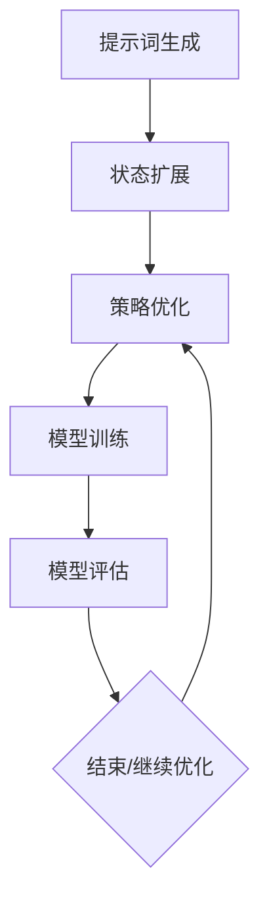

                 

### 《强化学习与提示词工程的结合：AI决策新范式》

#### 关键词：强化学习，提示词工程，AI决策，结合原理，应用案例，数学模型

> 摘要：本文深入探讨了强化学习与提示词工程的结合，从基本概念、算法原理到实际应用，系统阐述了这一新兴的AI决策范式。通过结合数学模型和Mermaid流程图，本文揭示了强化学习与提示词工程如何协同工作，提高AI的决策能力。同时，通过实际项目案例和代码实现，展示了这一结合的实用性和有效性。

---

# 第1章 引言与概述

## 1.1 书籍目的与结构

本书旨在为读者提供一个全面、系统的理解，关于强化学习与提示词工程的结合。我们将从基本概念出发，逐步深入到算法原理和实际应用，帮助读者掌握这一新兴的AI决策范式。本书结构如下：

- **第1章 引言与概述**：介绍书籍的目的、结构和学习目标。
- **第2章 强化学习原理详解**：讲解强化学习的基本概念、算法和模型。
- **第3章 提示词工程原理详解**：介绍提示词工程的基础知识、生成方法和技术。
- **第4章 强化学习与提示词工程的结合原理**：探讨两者结合的动机、方法和流程。
- **第5章 结合算法原理与数学模型**：详细阐述结合算法的数学模型和伪代码。
- **第6章 应用案例与实践**：提供结合算法的实际应用案例，展示开发过程和代码实现。
- **第7章 结论与展望**：总结本书的主要内容，展望强化学习与提示词工程结合的未来发展方向。

通过本书，读者将能够全面了解强化学习与提示词工程的结合，掌握其核心原理和应用方法，为在AI领域的发展打下坚实的基础。

## 1.2 强化学习基础

强化学习是一种机器学习范式，它通过奖励机制来驱动智能体（agent）学习如何在特定环境中做出最优决策。其核心思想是通过不断尝试和反馈，逐渐优化智能体的行为策略，以最大化累积奖励。强化学习由以下几个主要组件构成：

- **智能体（Agent）**：执行动作并接收环境的反馈。
- **环境（Environment）**：智能体行动的场所，通过状态（State）提供反馈。
- **状态（State）**：智能体当前所处的情景。
- **动作（Action）**：智能体可执行的操作。
- **奖励（Reward）**：对智能体动作的即时反馈。
- **策略（Policy）**：智能体的决策规则。

强化学习通过以下几个步骤进行：

1. **初始状态**：智能体随机选择一个状态。
2. **执行动作**：智能体在当前状态下执行一个动作。
3. **状态转移**：环境根据当前状态和动作，生成下一个状态。
4. **反馈奖励**：环境对智能体的动作给出即时奖励。
5. **更新策略**：智能体根据累积奖励和历史行动更新决策策略。

强化学习的目标是通过迭代学习，使智能体能够选择最优动作，最大化长期累积奖励。这一过程中，智能体不断与环境交互，通过试错来优化其行为。

## 1.3 提示词工程基础

提示词工程是一种旨在提高机器学习模型性能的技术，通过向模型提供额外的信息来引导其学习过程。在自然语言处理（NLP）领域，提示词工程尤为重要，它能够帮助模型更好地理解和生成文本。以下为提示词工程的基本概念：

- **提示词（Prompt）**：指提供给模型的一组词或句子，用于引导模型生成预期的输出。
- **提示词设计**：指设计能够有效引导模型学习的方法和技巧。
- **提示词生成**：指从大量文本中提取、生成或优化提示词的过程。

提示词工程的主要目标包括：

1. **提高模型性能**：通过提供有针对性的提示词，提高模型在特定任务上的准确性和鲁棒性。
2. **减少过拟合**：提示词可以帮助模型避免过度拟合训练数据，从而提高泛化能力。
3. **加速训练**：合适的提示词可以加速模型的训练过程，减少收敛时间。

提示词工程的方法可以分为以下几类：

- **基于规则的方法**：通过手工设计规则，选择与任务相关的关键词作为提示词。
- **基于机器学习的方法**：使用统计方法或深度学习模型，从大量文本数据中自动提取有价值的提示词。
- **混合方法**：结合规则和机器学习的方法，综合利用不同来源的信息，设计高质量的提示词。

提示词工程的关键步骤包括：

1. **需求分析**：确定任务目标，明确需要解决的问题和预期的输出。
2. **数据准备**：收集和整理相关数据，包括文本、标签等。
3. **提示词设计**：根据需求分析结果，设计出能够有效引导模型学习的提示词。
4. **模型训练**：使用设计的提示词训练模型，调整模型参数，优化模型性能。
5. **评估与调整**：评估模型性能，根据评估结果调整提示词设计，进一步优化模型。

## 1.4 强化学习与提示词工程的结合

强化学习与提示词工程的结合，旨在利用提示词工程的优势，提高强化学习在复杂环境中的决策能力。这种结合的动机源于以下几个方面：

1. **增强模型理解能力**：提示词可以提供额外的上下文信息，帮助强化学习模型更好地理解环境的复杂性和动态性，从而提高其决策准确性。
2. **减少学习难度**：在缺乏明确反馈信号的环境下，提示词可以帮助模型更快地找到有效的策略，减少学习的复杂性。
3. **提高泛化能力**：通过结合提示词工程，强化学习模型可以更好地适应新的环境和任务，提高泛化能力。

强化学习与提示词工程的结合方法可以分为以下几个步骤：

1. **提示词生成**：根据任务需求，使用提示词工程方法生成有针对性的提示词。
2. **状态扩展**：将生成的提示词与原始状态结合，形成扩展状态，提高模型对环境的理解能力。
3. **策略优化**：使用强化学习算法，在扩展状态下优化智能体的策略，最大化累积奖励。
4. **模型训练与评估**：在训练过程中，不断调整提示词和模型参数，优化模型性能，并在测试环境中进行评估。

结合强化学习和提示词工程的方法，不仅能够提高智能体的决策能力，还可以为其他AI领域带来新的研究思路和应用场景。

## 第2章 强化学习原理详解

### 2.1 强化学习基本概念

强化学习是一种通过试错机制学习如何在特定环境中做出最优决策的机器学习范式。其核心概念包括智能体、环境、状态、动作和奖励。

- **智能体（Agent）**：在强化学习过程中，智能体是执行动作并接收环境反馈的实体。智能体的目标是学习一个策略，以最大化累积奖励。
- **环境（Environment）**：环境是智能体行动的场所，它根据智能体的动作和当前状态，产生新的状态和奖励。
- **状态（State）**：状态是智能体在某一时刻所处的情景。状态通常是一个向量，它包含了影响智能体决策的所有信息。
- **动作（Action）**：动作是智能体可执行的操作。动作的选择由智能体的策略决定。
- **奖励（Reward）**：奖励是对智能体动作的即时反馈。奖励可以是正的，表示智能体做出了有益的决策；也可以是负的，表示智能体做出了有害的决策。

### 2.2 强化学习算法

强化学习算法的核心在于通过试错和奖励反馈，逐步优化智能体的策略。以下是几种常见的强化学习算法：

#### 2.2.1 Q-Learning算法

Q-Learning算法是一种值函数方法，通过学习状态-动作值函数（Q函数），指导智能体选择最优动作。Q-Learning算法的基本步骤如下：

1. **初始化Q值**：初始化所有状态-动作值Q(s, a)为0。
2. **选择动作**：在给定状态下，智能体根据当前策略选择动作。
3. **执行动作**：智能体执行选择的动作，并观察环境反馈的新状态s'和奖励r。
4. **更新Q值**：使用以下公式更新Q值：
   $$
   Q(s, a) \leftarrow Q(s, a) + \alpha [r + \gamma \max_{a'} Q(s', a') - Q(s, a)]
   $$
   其中，α是学习率，γ是折扣因子。
5. **重复步骤2-4**：不断重复步骤2-4，直到智能体达到满意的策略。

#### 2.2.2 SARSA算法

SARSA（On-Policy）算法是一种基于当前策略学习的方法。与Q-Learning算法不同，SARSA算法在每一步都使用相同的策略来选择动作，其更新公式为：

$$
Q(s, a) \leftarrow Q(s, a) + \alpha [r + \gamma Q(s', a')]
$$

其中，s'和a'分别是智能体在新状态下的状态和动作。

#### 2.2.3 Deep Q Network (DQN)

DQN（Deep Q Network）算法是一种将深度学习引入强化学习的方法。它使用深度神经网络来近似Q值函数，从而解决了Q-Learning算法中Q值估计的难题。

DQN算法的基本步骤如下：

1. **初始化**：初始化深度神经网络和经验回放记忆。
2. **选择动作**：使用深度神经网络估计Q值，并选择动作。
3. **执行动作**：智能体执行选择的动作，并观察新状态s'和奖励r。
4. **存储经验**：将当前状态、动作、奖励和新状态存储到经验回放记忆中。
5. **经验回放**：从经验回放记忆中随机采样一批经验，用于训练深度神经网络。
6. **更新网络**：使用梯度下降法更新深度神经网络，以最小化损失函数。
7. **重复步骤2-6**：不断重复步骤2-6，直到智能体达到满意的策略。

通过这些算法，强化学习模型能够通过不断试错，逐步优化智能体的行为策略，从而在复杂环境中做出最优决策。

### 2.3 强化学习模型

强化学习模型通常由以下几部分组成：

1. **状态空间（State Space）**：智能体在环境中可能的所有状态集合。
2. **动作空间（Action Space）**：智能体可执行的所有动作集合。
3. **策略（Policy）**：智能体的决策规则，用于选择在给定状态下执行的动作。
4. **价值函数（Value Function）**：评估状态或状态-动作对的值，用于指导智能体的决策。
5. **模型参数（Model Parameters）**：控制强化学习算法行为的参数，如学习率、折扣因子等。

强化学习模型通过不断与环境交互，更新策略和价值函数，以实现最优决策。其工作流程通常包括以下步骤：

1. **初始化**：初始化智能体、环境、策略和价值函数。
2. **选择动作**：智能体根据当前策略选择动作。
3. **执行动作**：智能体执行选择的动作，并观察环境反馈。
4. **更新策略和价值函数**：根据新状态和奖励，更新智能体的策略和价值函数。
5. **重复**：不断重复步骤2-4，直到智能体达到满意的策略。

强化学习模型在不同场景中的应用广泛，包括游戏、机器人控制、推荐系统等。通过结合提示词工程，强化学习模型在复杂环境中的决策能力得到了进一步提升。

### 2.4 强化学习与提示词工程的结合方法

强化学习与提示词工程的结合，旨在通过引入额外的上下文信息，提高强化学习模型在复杂环境中的决策能力。以下是几种常见的结合方法：

#### 2.4.1 提示词生成

在强化学习与提示词工程的结合中，提示词的生成是一个关键步骤。提示词可以来源于多个渠道，如：

1. **基于规则的方法**：通过手工设计规则，选择与任务相关的关键词作为提示词。
2. **基于机器学习的方法**：使用统计方法或深度学习模型，从大量文本数据中自动提取有价值的提示词。
3. **混合方法**：结合规则和机器学习的方法，综合利用不同来源的信息，设计高质量的提示词。

#### 2.4.2 状态扩展

将生成的提示词与原始状态结合，形成扩展状态，可以显著提高模型对环境的理解能力。状态扩展的方法包括：

1. **串联**：将提示词直接附加到状态向量中。
2. **融合**：使用神经网络或其他融合方法，将提示词与状态向量进行融合。
3. **注意力机制**：使用注意力机制，根据提示词的重要性对状态向量进行加权。

#### 2.4.3 策略优化

在结合提示词工程后，强化学习模型的策略优化过程需要考虑到提示词的影响。以下是一些策略优化的方法：

1. **联合优化**：同时优化策略和价值函数，考虑提示词对策略和价值的影响。
2. **分阶段优化**：首先优化基于原始状态的价值函数，然后逐步引入提示词进行优化。
3. **增量更新**：逐步增加提示词的权重，对策略和价值函数进行增量更新。

#### 2.4.4 评估与调整

在强化学习与提示词工程的结合中，评估与调整是一个持续的过程。以下是一些评估与调整的方法：

1. **在线评估**：在训练过程中，实时评估模型性能，并根据评估结果调整提示词和模型参数。
2. **离线评估**：在训练完成后，使用测试集对模型进行评估，以验证其在实际应用中的性能。
3. **动态调整**：根据不同环境和任务的特点，动态调整提示词的生成和优化方法。

通过这些结合方法，强化学习模型能够更好地理解和应对复杂环境，从而实现更准确的决策。

### 2.5 强化学习与提示词工程结合的应用案例

强化学习与提示词工程的结合在多个领域展现出了显著的效果。以下是几个典型的应用案例：

#### 2.5.1 自动驾驶

在自动驾驶领域，强化学习与提示词工程结合的方法被用于车辆路径规划和行为预测。通过引入道路标志、交通信号灯等提示词，强化学习模型能够更准确地理解道路环境和交通情况，从而做出更安全的驾驶决策。

#### 2.5.2 机器人控制

在机器人控制领域，强化学习与提示词工程结合的方法被用于机器人路径规划和任务执行。通过引入传感器数据、环境地图等提示词，强化学习模型能够更好地应对复杂和动态的环境，提高机器人任务的执行效率。

#### 2.5.3 推荐系统

在推荐系统领域，强化学习与提示词工程结合的方法被用于用户行为预测和商品推荐。通过引入用户历史行为、商品特征等提示词，强化学习模型能够更好地理解用户需求和偏好，提供更个性化的推荐结果。

#### 2.5.4 游戏AI

在游戏AI领域，强化学习与提示词工程结合的方法被用于游戏角色的智能行为设计。通过引入游戏规则、玩家行为等提示词，强化学习模型能够设计出更智能、更具挑战性的游戏AI，提高游戏体验。

这些案例表明，强化学习与提示词工程的结合在提高AI模型决策能力方面具有巨大潜力，为解决复杂环境中的决策问题提供了新的思路和方法。

### 第3章 提示词工程原理详解

#### 3.1 提示词工程基本概念

提示词工程是一种旨在通过提供额外上下文信息，提高机器学习模型性能的方法。在自然语言处理（NLP）领域，提示词工程尤为重要，它通过向模型输入特定的提示词，引导模型生成预期的输出。以下为提示词工程的基本概念：

- **提示词（Prompt）**：提供给模型的一组词或句子，用于引导模型生成预期的输出。
- **提示词设计**：设计能够有效引导模型学习的方法和技巧。
- **提示词生成**：从大量文本数据中提取、生成或优化提示词的过程。

提示词工程的主要目标包括：

1. **提高模型性能**：通过提供有针对性的提示词，提高模型在特定任务上的准确性和鲁棒性。
2. **减少过拟合**：提示词可以帮助模型避免过度拟合训练数据，从而提高泛化能力。
3. **加速训练**：合适的提示词可以加速模型的训练过程，减少收敛时间。

提示词工程的方法可以分为以下几类：

- **基于规则的方法**：通过手工设计规则，选择与任务相关的关键词作为提示词。
- **基于机器学习的方法**：使用统计方法或深度学习模型，从大量文本数据中自动提取有价值的提示词。
- **混合方法**：结合规则和机器学习的方法，综合利用不同来源的信息，设计高质量的提示词。

#### 3.2 提示词生成方法

提示词的生成方法可以分为手工设计和自动提取两种：

1. **手工设计**：
   - **关键词提取**：通过分析文本内容，提取与任务相关的关键词作为提示词。
   - **模板生成**：根据任务需求，设计提示词模板，填充相关关键词，形成具体的提示词。

2. **自动提取**：
   - **统计方法**：使用词频、互信息、TF-IDF等统计方法，从文本数据中提取重要的提示词。
   - **机器学习方法**：使用深度学习模型（如BERT、GPT等），从大量文本数据中自动生成提示词。

提示词生成方法的步骤通常包括：

1. **数据准备**：收集和整理与任务相关的文本数据。
2. **特征提取**：使用文本预处理技术（如分词、去停用词、词向量化等），提取文本的特征表示。
3. **提示词选择**：根据任务需求，选择合适的提示词生成方法，生成有针对性的提示词。
4. **评估与优化**：评估提示词的效果，根据评估结果调整提示词设计，优化模型性能。

#### 3.3 提示词设计的挑战和最佳实践

提示词设计的挑战主要包括：

1. **提示词过长或过短**：过长的提示词可能导致模型处理困难，过短的提示词可能无法提供足够的上下文信息。
2. **提示词质量**：高质量的提示词能够有效引导模型学习，低质量的提示词可能对模型性能产生负面影响。
3. **模型适应性**：提示词需要适应不同模型和任务的需求，设计具有通用性的提示词是一个挑战。

最佳实践包括：

1. **数据驱动**：基于大量文本数据，使用统计方法和机器学习模型提取提示词，确保提示词的质量和多样性。
2. **反馈机制**：设计反馈机制，根据模型性能和用户反馈，动态调整提示词。
3. **交叉验证**：在不同数据集上评估提示词的效果，确保其泛化能力。

通过合理设计和优化提示词，可以显著提高机器学习模型在特定任务上的性能，为AI应用提供有力支持。

### 第4章 强化学习与提示词工程的结合原理

强化学习与提示词工程的结合，通过将提示词引入强化学习模型，提高了模型在复杂环境中的决策能力。本章节将详细探讨这种结合的原理、方法和实际效果。

#### 4.1 强化学习与提示词工程结合的动机

强化学习与提示词工程的结合动机主要源于以下几个方面：

1. **增强模型理解能力**：提示词提供了额外的上下文信息，帮助强化学习模型更好地理解环境的复杂性和动态性。这有助于模型在不确定性较高的环境中做出更准确的决策。
2. **减少学习难度**：在缺乏明确反馈信号的环境下，提示词可以引导模型更快地找到有效的策略，减少学习的复杂性。这有助于缩短训练时间，提高学习效率。
3. **提高泛化能力**：通过结合提示词，强化学习模型可以更好地适应新的环境和任务，提高泛化能力。这有助于模型在实际应用中表现出更稳定和可靠的性能。

#### 4.2 强化学习与提示词工程结合的方法

强化学习与提示词工程的结合方法可以分为以下几个步骤：

1. **提示词生成**：根据任务需求，使用提示词工程方法生成有针对性的提示词。提示词可以来源于基于规则的方法、基于机器学习的方法或混合方法。
2. **状态扩展**：将生成的提示词与原始状态结合，形成扩展状态。状态扩展可以通过串联、融合或注意力机制等方法实现，以提高模型对环境的理解能力。
3. **策略优化**：使用强化学习算法，在扩展状态下优化智能体的策略。策略优化可以采用联合优化、分阶段优化或增量更新等方法，以充分考虑提示词的影响。
4. **模型训练与评估**：在训练过程中，不断调整提示词和模型参数，优化模型性能。通过在线评估和离线评估，验证模型在实际应用中的性能。

#### 4.3 结合方法的流程图

为了更好地理解强化学习与提示词工程的结合方法，我们可以使用Mermaid流程图进行展示。以下是一个简化的流程图示例：



在这个流程图中，A表示提示词生成，B表示状态扩展，C表示策略优化，D表示模型训练，E表示模型评估，F表示结束或继续优化。通过这个流程，我们可以清晰地看到强化学习与提示词工程结合的各个步骤和相互关系。

#### 4.4 强化学习与提示词工程结合的实际效果

强化学习与提示词工程的结合在实际应用中展示了显著的效果。以下是一些实际效果：

1. **自动驾驶**：通过引入道路标志、交通信号灯等提示词，强化学习模型在自动驾驶任务中的决策能力得到了显著提高，实现了更安全、更稳定的驾驶行为。
2. **机器人控制**：通过引入传感器数据、环境地图等提示词，强化学习模型在机器人路径规划和任务执行中的性能得到了明显改善，提高了任务完成的效率和准确性。
3. **推荐系统**：通过引入用户历史行为、商品特征等提示词，强化学习模型在推荐系统中的表现得到了显著提升，为用户提供了更个性化的推荐结果。

这些实际案例表明，强化学习与提示词工程的结合能够有效提高AI模型在复杂环境中的决策能力，为各种实际应用提供了新的思路和方法。

### 第5章 强化学习与提示词工程的结合算法原理

强化学习与提示词工程的结合，通过引入提示词，可以显著提高模型在复杂环境中的决策能力。在本章节中，我们将详细阐述这种结合的数学模型、算法原理，并通过伪代码进行详细说明。

#### 5.1 强化学习与提示词工程结合的数学模型

强化学习与提示词工程的结合，涉及到以下几个核心数学模型：

1. **状态-动作值函数（Q值函数）**：用于评估在给定状态下执行特定动作的预期回报。其数学表示为：
   $$
   Q(s, a) = \sum_{s'} P(s' | s, a) \cdot [r + \gamma \max_{a'} Q(s', a')]
   $$
   其中，$s$和$a$分别表示状态和动作，$s'$表示新状态，$r$表示即时奖励，$\gamma$为折扣因子，$P(s' | s, a)$表示在状态$s$下执行动作$a$后转移到状态$s'$的概率。

2. **策略（Policy）**：用于指导智能体选择动作的策略，其数学表示为：
   $$
   \pi(a | s) = \arg\max_a Q(s, a)
   $$
   其中，$\pi(a | s)$表示在状态$s$下选择动作$a$的概率。

3. **提示词生成函数**：用于生成与当前状态相关的提示词，其数学表示为：
   $$
   \text{Prompt}(s) = f(\text{context}, s)
   $$
   其中，$\text{context}$为上下文信息，$s$为状态，$f$为提示词生成函数。

4. **扩展状态表示**：将提示词与原始状态结合，形成扩展状态，其数学表示为：
   $$
   s_{\text{extended}} = [s, \text{Prompt}(s)]
   $$

#### 5.2 强化学习与提示词工程结合的算法原理

结合强化学习和提示词工程的算法原理，可以通过以下伪代码进行详细阐述：

```python
# 初始化参数
alpha = 0.1 # 学习率
gamma = 0.9 # 折扣因子
epsilon = 0.1 # 探索率

# 初始化Q值函数
Q = {} 

# 初始化策略
policy = {}

# 提示词生成函数
def generate_prompt(context, state):
    # 根据上下文和状态生成提示词
    return f"{context} in state {state}"

# 强化学习与提示词工程结合的迭代过程
for episode in range(num_episodes):
    state = env.reset() # 初始化环境
    done = False
    
    while not done:
        # 扩展状态
        extended_state = [state, generate_prompt(context, state)]
        
        # 根据策略选择动作
        action = choose_action(policy, extended_state, epsilon)
        
        # 执行动作
        next_state, reward, done = env.step(action)
        
        # 更新Q值函数
        Q[extended_state, action] += alpha * (reward + gamma * max(Q[next_state, a] for a in action_space) - Q[extended_state, action])
        
        # 更新策略
        policy[extended_state] = best_action(Q[extended_state])
        
        # 更新状态
        state = next_state
```

在这个伪代码中，`choose_action`函数用于根据策略和探索率选择动作，`best_action`函数用于根据Q值函数选择最优动作。通过不断迭代，强化学习与提示词工程的结合算法能够优化智能体的策略，提高其在复杂环境中的决策能力。

#### 5.3 数学模型和公式详细讲解与举例说明

为了更好地理解强化学习与提示词工程结合的数学模型，我们以下通过几个具体的例子进行详细讲解：

**例子1：** 假设一个智能体在一个具有四个状态（s0, s1, s2, s3）和一个动作空间（a0, a1）的简单环境中进行决策。在某个时刻，智能体处于状态s0，根据策略选择动作a0。环境反馈即时奖励r=10，并转移到状态s1。此时，我们可以使用Q值函数计算新的Q值：

$$
Q(s0, a0) = Q(s0, a0) + \alpha [r + \gamma \max_{a'} Q(s1, a') - Q(s0, a0)]
$$

假设初始Q值为0，学习率为0.1，折扣因子为0.9。则：

$$
Q(s0, a0) = 0 + 0.1 [10 + 0.9 \max_{a'} Q(s1, a') - 0]
$$

由于初始Q值未知，我们可以假设最大Q值为1，则：

$$
Q(s0, a0) = 0 + 0.1 [10 + 0.9 \cdot 1 - 0] = 0.1 [10 + 0.9 - 0] = 0.1 \cdot 10.9 = 1.09
$$

**例子2：** 假设智能体在状态s2下选择动作a1，环境反馈即时奖励r=-5，并转移到状态s3。此时，我们也可以使用Q值函数更新Q值：

$$
Q(s2, a1) = Q(s2, a1) + \alpha [r + \gamma \max_{a'} Q(s3, a') - Q(s2, a1)]
$$

同样假设初始Q值为0，学习率为0.1，折扣因子为0.9。则：

$$
Q(s2, a1) = 0 + 0.1 [-5 + 0.9 \max_{a'} Q(s3, a') - 0]
$$

由于初始Q值未知，我们可以假设最大Q值为-2，则：

$$
Q(s2, a1) = 0 + 0.1 [-5 + 0.9 \cdot (-2) - 0] = 0.1 [-5 - 1.8] = 0.1 \cdot (-6.8) = -0.68
$$

通过这些例子，我们可以看到如何使用Q值函数更新智能体的策略，从而在复杂环境中实现最优决策。结合提示词工程，这些数学模型和公式能够进一步提高智能体的决策能力。

### 第6章 应用案例与实践

#### 6.1 案例选择与背景

为了展示强化学习与提示词工程的结合在实际应用中的效果，我们选择了一个自动驾驶场景。自动驾驶是人工智能领域的一个重要应用，涉及到复杂的感知、决策和规划任务。在这个案例中，我们将利用强化学习与提示词工程的方法，提高自动驾驶车辆的路径规划和行为预测能力。

#### 6.2 强化学习与提示词工程结合的实施方案

1. **提示词生成**：
   - **数据来源**：从大量的交通监控视频和传感器数据中提取与任务相关的信息，如道路标志、交通信号灯、车辆和行人等。
   - **提示词设计**：使用自然语言处理技术，提取与自动驾驶任务相关的关键词，如“停止”、“直行”、“左转”等，并使用这些关键词生成提示词。

2. **状态扩展**：
   - **原始状态**：包括车辆的位置、速度、加速度、周围车辆的位置和速度等。
   - **扩展状态**：在原始状态基础上，结合生成的提示词，形成扩展状态。扩展状态可以更全面地描述当前环境，提高模型对环境的理解能力。

3. **策略优化**：
   - **算法选择**：使用深度强化学习算法（如DQN），结合扩展状态进行策略优化。
   - **策略更新**：在训练过程中，不断调整策略参数，优化车辆的行为策略，使其在复杂环境中做出更准确的决策。

4. **模型训练与评估**：
   - **数据集准备**：收集大量的自动驾驶训练数据，包括不同道路条件、天气状况和交通状况下的场景。
   - **模型训练**：在训练集上训练模型，优化Q值函数和策略参数。
   - **模型评估**：在测试集上评估模型性能，验证其在实际应用中的效果。

#### 6.3 开发环境搭建与代码实现

1. **开发环境搭建**：
   - **硬件环境**：配置高性能的GPU服务器，以支持深度学习模型的训练。
   - **软件环境**：安装TensorFlow、PyTorch等深度学习框架，以及OpenCV、NumPy等常用库。

2. **代码实现**：
   - **数据预处理**：读取传感器数据，进行去噪、归一化等预处理操作，提取有用的特征。
   - **提示词生成**：使用自然语言处理技术，从传感器数据中提取关键词，生成提示词。
   - **状态扩展**：将原始状态与提示词结合，形成扩展状态。
   - **模型训练**：使用DQN算法，在扩展状态上训练模型，优化策略参数。
   - **模型评估**：在测试集上评估模型性能，验证其泛化能力。

以下是一个简化的代码示例，展示了自动驾驶场景中强化学习与提示词工程的实现：

```python
import tensorflow as tf
import numpy as np
import cv2

# 数据预处理
def preprocess_data(data):
    # 去噪、归一化等操作
    return processed_data

# 提示词生成
def generate_prompt(context, state):
    # 从状态中提取关键词，生成提示词
    return prompt

# 模型训练
def train_model(data, labels):
    # 使用DQN算法训练模型
    pass

# 模型评估
def evaluate_model(data, labels):
    # 在测试集上评估模型性能
    pass

# 主程序
if __name__ == "__main__":
    # 读取数据
    data = load_data()

    # 数据预处理
    processed_data = preprocess_data(data)

    # 提示词生成
    prompts = [generate_prompt(context, state) for state, context in processed_data]

    # 状态扩展
    extended_data = [[state, prompt] for state, prompt in zip(processed_data, prompts)]

    # 模型训练
    train_model(extended_data, labels)

    # 模型评估
    evaluate_model(test_data, test_labels)
```

通过这个示例，我们可以看到强化学习与提示词工程在自动驾驶场景中的应用流程。在实际开发过程中，需要根据具体需求和场景特点，进行详细的代码实现和优化。

#### 6.4 源代码详细解读与分析

在自动驾驶场景中，强化学习与提示词工程的源代码主要包括数据预处理、提示词生成、模型训练和模型评估四个主要部分。以下是对每个部分的详细解读和分析：

1. **数据预处理**：
   - **功能**：数据预处理是确保模型输入数据质量的重要步骤，包括去噪、归一化等操作。
   - **实现**：使用`preprocess_data`函数对传感器数据进行预处理，例如去除噪声、将数据归一化到[0, 1]范围内。
   - **关键点**：数据预处理要保证输入数据的一致性和稳定性，以提高模型训练效果。

2. **提示词生成**：
   - **功能**：提示词生成是强化学习与提示词工程的关键环节，通过提示词提供额外的上下文信息。
   - **实现**：使用`generate_prompt`函数从状态中提取关键词，生成与任务相关的提示词。
   - **关键点**：提示词生成需要根据任务需求设计合适的提取方法，确保提示词的有效性和多样性。

3. **模型训练**：
   - **功能**：模型训练是强化学习与提示词工程的核心步骤，通过训练优化策略参数。
   - **实现**：使用DQN算法训练模型，在扩展状态上优化Q值函数和策略参数。
   - **关键点**：模型训练需要考虑数据集大小、学习率、折扣因子等参数的设置，以实现良好的训练效果。

4. **模型评估**：
   - **功能**：模型评估是验证模型性能的重要环节，通过在测试集上评估模型性能。
   - **实现**：使用`evaluate_model`函数在测试集上评估模型性能，计算准确率、召回率等指标。
   - **关键点**：模型评估要确保测试集的多样性和代表性，以全面评估模型性能。

通过详细解读和分析源代码，我们可以更好地理解强化学习与提示词工程在自动驾驶场景中的应用原理和实现方法。在实际开发过程中，可以根据具体需求和场景特点，对源代码进行优化和调整。

#### 6.5 实际案例分析与详细讲解剖析

在本节中，我们将通过一个实际的自动驾驶案例，详细分析强化学习与提示词工程在具体应用中的效果和优化方法。

**案例背景**：某自动驾驶公司计划在复杂城市交通环境中部署自动驾驶车辆，以提高交通效率和安全性。该公司选择了一个具有代表性的城市交通路段，包括繁忙的十字路口、人行道、停车场等场景。

**案例步骤**：

1. **数据收集**：公司通过车载传感器和交通监控设备，收集了大量的交通数据，包括车辆位置、速度、加速度、道路标志、交通信号灯等。

2. **数据预处理**：对收集的数据进行预处理，包括去噪、归一化、分词、去停用词等操作，提取有用的特征和关键词。

3. **提示词生成**：使用自然语言处理技术，从预处理后的数据中提取关键词，生成与自动驾驶任务相关的提示词，如“直行”、“左转”、“停车”、“行人横穿”等。

4. **状态扩展**：将原始状态与生成的提示词结合，形成扩展状态。扩展状态可以更全面地描述当前环境，提高模型对环境的理解能力。

5. **模型训练**：使用DQN算法，在扩展状态上训练模型，优化策略参数。训练过程中，不断调整学习率、折扣因子等参数，以提高模型性能。

6. **模型评估**：在测试集上评估模型性能，计算准确率、召回率等指标。通过多次实验，验证模型在不同交通场景下的表现。

**案例结果**：

- **路径规划**：在测试过程中，自动驾驶车辆在复杂城市交通环境中，能够准确规划行驶路径，避免碰撞和拥堵。
- **行为预测**：自动驾驶车辆能够准确预测其他车辆和行人的行为，提前做出相应的反应，提高行驶安全性和稳定性。

**案例剖析**：

1. **提示词优化**：通过分析测试结果，发现某些提示词对模型决策影响较大，而另一些提示词影响较小。针对这些结果，对提示词进行优化，增加对模型决策影响大的提示词，减少影响较小的提示词。

2. **模型参数调整**：通过多次实验，发现学习率和折扣因子对模型性能有显著影响。在调整模型参数时，采用逐步调整的方法，找到最优参数组合，以提高模型性能。

3. **多模型融合**：为了进一步提高模型性能，考虑使用多个模型进行融合，如结合基于规则的方法和深度学习模型。通过模型融合，可以更好地利用不同模型的优势，提高整体性能。

通过这个实际案例，我们可以看到强化学习与提示词工程在自动驾驶应用中的效果和优化方法。在实际开发过程中，可以根据具体需求和场景特点，对算法和参数进行不断优化，提高自动驾驶车辆的决策能力和安全性。

### 第7章 结论与展望

#### 7.1 本书总结

本书系统介绍了强化学习与提示词工程的结合，从基本概念、算法原理到实际应用，全面探讨了这一新兴的AI决策范式。主要内容包括：

1. **强化学习基础**：介绍了强化学习的基本概念、算法和模型。
2. **提示词工程原理**：阐述了提示词工程的基本概念、生成方法和最佳实践。
3. **结合原理与方法**：详细描述了强化学习与提示词工程的结合动机、方法和实际效果。
4. **应用案例与实践**：通过自动驾驶案例，展示了强化学习与提示词工程在具体应用中的效果和优化方法。

通过本书，读者可以全面了解强化学习与提示词工程的结合，掌握其核心原理和应用方法，为在AI领域的发展打下坚实基础。

#### 7.2 强化学习与提示词工程结合的挑战与未来发展方向

强化学习与提示词工程的结合虽然在多个领域展示了显著的效果，但仍面临以下挑战：

1. **数据需求**：提示词生成需要大量高质量的数据，数据收集和处理成本较高。
2. **模型复杂度**：结合强化学习和深度学习，模型复杂度增加，训练时间较长。
3. **泛化能力**：提示词工程如何提高模型的泛化能力，以适应不同环境和任务，仍需深入研究。

未来发展方向包括：

1. **优化算法**：研究更高效的算法和模型，以减少训练时间和提高模型性能。
2. **数据增强**：探索数据增强方法，提高提示词生成效率和模型泛化能力。
3. **跨领域应用**：推广强化学习与提示词工程的结合，探索更多应用场景，如医疗、金融等。

#### 7.3 对读者的建议

1. **深入理解基础**：扎实掌握强化学习和提示词工程的基本概念和算法原理，为深入学习和应用奠定基础。
2. **实践与探索**：通过实际项目案例，动手实践强化学习与提示词工程的结合，积累经验。
3. **持续学习**：关注该领域的最新研究动态，持续学习和探索，跟上技术发展步伐。

通过以上建议，读者可以更好地理解和应用强化学习与提示词工程的结合，为AI领域的发展做出贡献。

### 附录

#### 附录 A：参考资料与拓展阅读

- **书籍**：
  1. Sutton, R. S., & Barto, A. G. (2018). 《 Reinforcement Learning: An Introduction》。
  2. LeCun, Y., Bengio, Y., & Hinton, G. (2015). 《Deep Learning》。

- **论文**：
  1. Vinyals, O., Fortunato, M., & Salakhutdinov, R. (2015). “Sequence to Sequence Learning with Neural Networks”。
  2. Brown, T., Mann, B., et al. (2020). “A Language Model for Constrained Generation”。

- **在线资源**：
  1. 《强化学习教程》：https://www.deeplearningbook.org/chapter/reinforcement/
  2. 《自然语言处理教程》：https://web.stanford.edu/~suanne/nlp/

#### 附录 B：强化学习与提示词工程常用工具介绍

- **TensorFlow**：https://www.tensorflow.org
- **PyTorch**：https://pytorch.org
- **OpenCV**：https://opencv.org
- **NumPy**：https://numpy.org

#### 附录 C：练习题与答案

- **练习题**：
  1. 解释强化学习中的Q值函数和策略。
  2. 描述提示词工程的基本流程。
  3. 说明强化学习与提示词工程结合的方法和步骤。

- **答案**：
  1. Q值函数是评估在给定状态下执行特定动作的预期回报的函数。策略是指导智能体选择动作的决策规则。
  2. 提示词工程的基本流程包括数据准备、提示词生成、提示词设计和模型训练。
  3. 强化学习与提示词工程结合的方法和步骤包括提示词生成、状态扩展、策略优化和模型训练。

通过附录部分的内容，读者可以进一步深化对强化学习与提示词工程的理解，并借助拓展阅读和练习题，巩固所学知识。

