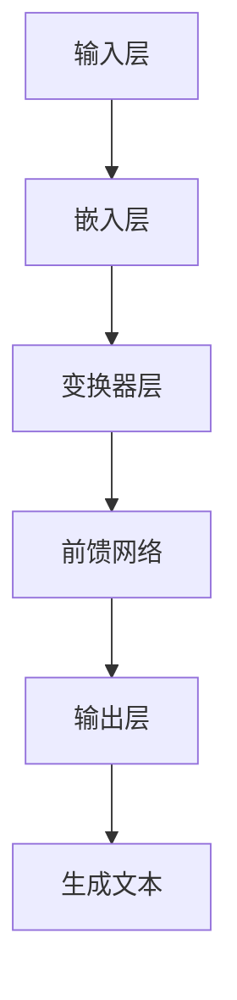

                 


## 第1章：引言

### 1.1 书籍目的与读者对象

本书旨在为希望快速部署自然语言处理（NLP）应用的专业人士提供一条清晰的技术路线。针对那些已经在NLP领域有所涉猎，但对大规模语言模型（LLM）的应用部署感到困惑的读者，本书将通过系统化的指导，帮助他们理解并掌握LLM应用的技术栈选择。

我们假设读者具有以下背景：
- 熟悉基本的编程知识，特别是Python。
- 对机器学习和深度学习有初步了解，但不必深入了解。
- 愿意学习新技术并能够独立解决问题。

通过阅读本书，读者将能够：
- 理解大规模语言模型（LLM）的基本原理和应用。
- 掌握构建LLM应用所需的技术栈。
- 学会部署和优化LLM应用，以满足实际业务需求。

### 1.2 大规模语言模型（LLM）的背景介绍

大规模语言模型（LLM）是近年来人工智能领域的一项重要进展。这些模型通过训练数以亿计的文本数据，能够生成高质量的自然语言文本，广泛应用于问答系统、聊天机器人、文本摘要、机器翻译等领域。

LLM的核心在于其强大的生成能力和自适应能力。通过使用深度神经网络（DNN）和变换器模型（Transformer），LLM能够捕捉文本中的复杂模式和结构，从而实现高质量的文本生成。与传统的规则引擎和统计方法相比，LLM能够处理更加灵活和多样化的语言任务，使得自然语言处理的应用变得更加智能化和人性化。

然而，LLM的应用并非一帆风顺。其训练和部署过程中涉及大量的计算资源和时间成本，这对企业的技术栈和基础设施提出了较高的要求。此外，LLM在处理特定领域知识时可能存在局限性，需要结合其他技术和方法来提升其应用效果。

### 1.3 为什么需要技术栈选择？

技术栈选择在LLM应用部署中扮演着至关重要的角色。一个合理的技术栈不仅能够提高开发效率，还能够保证应用的性能和稳定性。以下是技术栈选择的重要性：

1. **性能优化**：不同的技术组件和架构设计会对LLM应用的性能产生直接影响。通过选择合适的技术栈，可以优化模型训练和推理的速度，提高系统的响应能力。

2. **资源管理**：大规模语言模型的训练和部署需要大量的计算资源和存储空间。合理的技术栈选择可以帮助企业更有效地利用资源，降低成本。

3. **可扩展性**：随着业务规模的扩大，LLM应用需要具备良好的可扩展性。技术栈的选择需要考虑到未来的扩展需求，以确保系统能够持续稳定运行。

4. **安全性**：在部署LLM应用时，数据的安全性和隐私保护至关重要。合适的技术栈可以提供必要的安全措施，防止数据泄露和滥用。

5. **维护性**：良好的技术栈设计可以简化系统的维护和升级过程，降低技术债务，提高开发团队的效率。

### 1.4 本书结构安排

本书将分为以下八个章节：

1. **引言**：介绍书籍的目的、读者对象以及LLM的背景。
2. **核心概念与联系**：讲解LLM的基本原理和相关架构，使用Mermaid流程图进行说明。
3. **技术栈概述**：介绍构建LLM应用所需的主要技术组件和其相互关系。
4. **算法原理**：详细讲解LLM的核心算法，使用伪代码进行阐述。
5. **数学模型与公式**：解释LLM背后的数学模型，使用LaTeX展示公式并举例说明。
6. **项目实践**：通过实际案例展示LLM应用的部署过程，包括开发环境搭建、源代码实现和代码分析。
7. **优化与部署策略**：探讨如何优化LLM应用性能并给出部署指南。
8. **附录与资源**：提供额外的学习资源和工具。

通过这样的结构安排，本书旨在为读者提供一条系统化、可操作的学习路径，帮助他们顺利部署自己的LLM应用。

## 第2章：核心概念与联系

### 2.1 大规模语言模型（LLM）的基本原理

大规模语言模型（LLM）是自然语言处理（NLP）领域的一种先进技术。其核心在于通过深度学习和神经网络模型，对大量文本数据进行训练，从而掌握语言的结构和语义。以下是LLM的基本原理：

1. **文本表示**：LLM首先需要对输入的文本进行编码。这通常通过嵌入层（Embedding Layer）实现，将单词转换为向量表示。词嵌入技术将语义相近的单词映射到空间中接近的位置，从而捕捉词与词之间的关系。

2. **模型架构**：LLM通常采用深度神经网络（DNN）或变换器模型（Transformer）作为基础架构。DNN通过多层神经元的非线性变换，逐步提取文本的语义特征。而Transformer模型则利用自注意力机制（Self-Attention），能够更有效地捕捉长距离依赖关系。

3. **预训练与微调**：LLM的训练分为预训练和微调两个阶段。在预训练阶段，模型在大规模的未标注数据上进行训练，学习通用语言特征。而在微调阶段，模型根据特定任务的需求，在标注数据上进行调整，以提高任务性能。

4. **生成文本**：训练完成的LLM可以生成高质量的文本。通过输入一个种子文本，模型能够预测下一个词，并逐步生成完整的文本。这个过程可以看作是一种序列生成任务，模型利用其学到的概率分布进行预测。

### 2.2 相关架构与组件

要理解LLM的工作原理，我们需要了解其核心架构和组件：

1. **输入层**：接收用户的输入文本，并将其转换为嵌入向量。这些向量是后续处理的基础。

2. **嵌入层**：将单词转换为固定长度的向量表示。常见的技术包括Word2Vec、GloVe等。

3. **变换器层**：在Transformer模型中，变换器层负责处理嵌入向量。自注意力机制在这里起到关键作用，通过计算不同词之间的相似度，模型能够更好地理解文本的全局上下文。

4. **前馈网络**：在变换器层之后，数据会经过一系列前馈网络，这些网络通过非线性激活函数（如ReLU）进行特征提取和变换。

5. **输出层**：最后，输出层将处理后的嵌入向量映射回单词空间，生成预测的文本。通常使用softmax函数进行概率分布的计算。

### 2.3 Mermaid流程图说明

为了更直观地展示LLM的原理和架构，我们可以使用Mermaid绘制一个流程图：



这个流程图从输入层开始，依次经过嵌入层、变换器层、前馈网络，最后通过输出层生成文本。每个层次都承担着不同的任务，共同协作实现高质量的文本生成。

### 2.4 LLM在NLP中的应用

LLM在NLP领域有着广泛的应用，以下是几个典型的应用场景：

1. **问答系统**：LLM可以用于构建智能问答系统，如搜索引擎、智能客服等。这些系统通过理解用户的查询，快速生成相关答案。

2. **文本生成**：LLM可以生成高质量的文本，如文章、故事、新闻摘要等。这在内容创作和内容聚合领域有着重要的应用。

3. **机器翻译**：LLM可以用于机器翻译任务，通过理解源语言的语义，生成目标语言的准确翻译。

4. **对话系统**：LLM可以构建智能对话系统，如聊天机器人、虚拟助手等。这些系统能够与用户进行自然语言交互，提供个性化服务。

5. **文本分类**：LLM可以用于文本分类任务，如情感分析、主题分类等。通过学习大量的标注数据，LLM能够准确地对文本进行分类。

### 2.5 关键算法原理讲解

LLM的核心算法主要包括词嵌入、变换器模型和生成文本等。以下是对这些算法的详细讲解：

1. **词嵌入**：词嵌入是一种将单词映射到高维向量空间的技术。常见的算法包括Word2Vec和GloVe。Word2Vec通过训练神经网络的输出层，学习单词的向量表示；而GloVe通过矩阵分解学习单词的共现矩阵，从而得到单词的向量表示。

2. **变换器模型**：变换器模型是一种基于自注意力机制的深度学习模型。它通过计算输入序列中每个词与所有其他词的相似度，生成注意力权重，进而加权聚合信息，提高模型的上下文理解能力。

3. **生成文本**：生成文本是LLM的核心任务。模型通过输入一个种子文本，逐步生成下一个词，并迭代这个过程，直到生成完整的文本。这个过程利用了模型学到的概率分布，生成与输入文本相似的高质量文本。

### 2.6 数学模型与公式

LLM背后的数学模型包括词嵌入、变换器模型和生成文本等。以下是这些模型的公式和详细解释：

1. **词嵌入**：词嵌入的公式如下：

   $$ 
   \text{ embed\_word}(word) = \text{ W} \cdot \text{ v}_word 
   $$

   其中，$\text{W}$是嵌入矩阵，$\text{v}_word$是单词的向量表示。这个公式将单词映射到高维向量空间。

2. **变换器模型**：变换器模型中的自注意力机制可以用以下公式表示：

   $$
   \text{ attention}(Q, K, V) = \text{ softmax}(\frac{\text{Q} \cdot \text{K}^T}{\sqrt{d_k}})
   $$

   其中，$Q$、$K$和$V$分别是查询向量、键向量和值向量，$d_k$是键向量的维度。这个公式计算了查询向量与所有键向量的相似度，并生成注意力权重。

3. **生成文本**：生成文本的过程可以通过以下公式表示：

   $$
   \text{ predict\_next\_word}(text) = \text{ softmax}(\text{ model}(text))
   $$

   其中，$\text{model}(text)$是模型对当前文本的输出，这个公式计算了每个单词的概率分布，并从中选取下一个词。

### 2.7 举例说明

为了更好地理解上述概念和公式，我们可以通过一个简单的例子来说明：

假设我们有一个简单的变换器模型，输入文本为“我爱中国”。首先，我们将文本中的每个词转换为向量表示，然后使用变换器模型计算词与词之间的注意力权重。最后，根据注意力权重生成下一个词。

1. **词嵌入**：假设“我”、“爱”和“中国”的向量表示分别为$\text{v}_1$、$\text{v}_2$和$\text{v}_3$。

2. **自注意力计算**：计算“我”与“爱”和“中国”的相似度：

   $$
   \text{ attention}(Q, K, V) = \text{ softmax}(\frac{\text{Q} \cdot \text{K}^T}{\sqrt{d_k}})
   $$

   其中，$Q = \text{v}_1$，$K = \text{v}_2$，$V = \text{v}_3$。假设$d_k = 10$，计算得到注意力权重为$\text{softmax}(\text{v}_1 \cdot \text{v}_2^T / \sqrt{10})$。

3. **生成下一个词**：根据注意力权重生成下一个词。假设注意力权重为$\text{softmax}(\text{v}_1 \cdot \text{v}_2^T / \sqrt{10}) = [0.3, 0.5, 0.2]$。根据这个概率分布，下一个词最可能是“中国”。

通过这个例子，我们可以看到如何通过词嵌入和变换器模型来生成文本。这种方法不仅能够生成与输入文本相似的文本，还能够捕捉文本中的复杂结构和语义关系。

## 第3章：技术栈概述

### 3.1 技术栈的重要性

在部署大规模语言模型（LLM）应用时，选择合适的技术栈至关重要。技术栈的选择不仅影响开发效率和性能，还直接关系到应用的稳定性和可扩展性。一个高效且合理的技术栈可以提供以下优势：

1. **性能优化**：选择合适的技术栈可以优化模型训练和推理的速度，提高系统的响应能力。
2. **资源管理**：合理的技术栈设计有助于企业更有效地利用计算资源和存储空间，降低成本。
3. **可扩展性**：随着业务规模的增长，技术栈应具备良好的可扩展性，以支持系统的持续稳定运行。
4. **安全性**：技术栈的选择需要考虑数据的安全性和隐私保护，确保系统在运行过程中不会出现数据泄露和安全漏洞。
5. **维护性**：良好的技术栈设计可以简化系统的维护和升级过程，降低技术债务，提高开发团队的效率。

### 3.2 LLM应用所需的主要技术组件

要构建一个完整的LLM应用，需要以下主要技术组件：

1. **计算框架**：计算框架是LLM应用的核心，负责模型的训练、推理和部署。常见的计算框架包括TensorFlow、PyTorch和MXNet等。这些框架提供了丰富的API和工具，支持从数据预处理到模型训练和推理的完整流程。

2. **数据存储**：数据存储是LLM应用的基础，负责存储和管理训练数据、模型参数和应用日志等。常见的数据存储解决方案包括关系数据库（如MySQL、PostgreSQL）和非关系数据库（如MongoDB、Cassandra）。

3. **数据预处理工具**：数据预处理工具用于清洗、转换和增强输入数据，使其适合模型训练。常见的预处理工具包括Pandas、NumPy和Scikit-learn等。

4. **模型评估和调优工具**：模型评估和调优工具用于评估模型性能，并进行超参数调优。常见的工具包括TensorBoard、W&B和MLflow等。

5. **推理引擎**：推理引擎用于实时处理用户输入，生成预测结果。推理引擎需要具备高性能和高可靠性，常见的推理引擎包括TensorFlow Serving、TorchServe和Apache MXNet Model Server等。

6. **API网关**：API网关用于接收用户请求，将请求转发到推理引擎，并将生成的预测结果返回给用户。API网关需要支持负载均衡、限流和安全认证等高级功能，常见的API网关包括Kong、Nginx和Apache等。

7. **监控和日志分析**：监控和日志分析工具用于实时监控系统的性能和状态，并分析日志数据以诊断问题。常见的监控和日志分析工具包括Prometheus、Grafana和ELK（Elasticsearch、Logstash、Kibana）等。

8. **安全框架**：安全框架用于保护系统的数据安全，防止数据泄露和滥用。常见的安全框架包括OWASP、AppArmor和SELinux等。

### 3.3 技术栈组件的交互关系

在构建LLM应用时，各个技术栈组件需要紧密协作，以实现高效的模型训练、推理和部署。以下是技术栈组件之间的交互关系：

1. **数据存储和数据预处理工具**：数据存储工具负责存储训练数据，数据预处理工具负责清洗和转换数据，使其适合模型训练。

2. **计算框架**：计算框架负责加载预处理后的数据，进行模型训练。训练过程中，计算框架会不断调整模型参数，以优化模型性能。

3. **模型评估和调优工具**：模型评估和调优工具用于评估模型性能，并根据评估结果进行超参数调优。

4. **推理引擎**：训练完成的模型会被部署到推理引擎，用于实时处理用户输入。推理引擎会将输入数据传递给模型，生成预测结果。

5. **API网关**：API网关接收用户请求，将其转发到推理引擎。推理引擎生成的预测结果会通过API网关返回给用户。

6. **监控和日志分析工具**：监控和日志分析工具用于实时监控系统的性能和状态，并分析日志数据以诊断问题。

7. **安全框架**：安全框架用于保护系统的数据安全，防止数据泄露和滥用。

### 3.4 技术栈选择的考虑因素

在选择技术栈时，需要考虑以下因素：

1. **计算能力**：根据模型的大小和训练需求，选择适合的计算框架和硬件资源。

2. **数据处理能力**：考虑数据量的大小和复杂性，选择合适的数据存储和预处理工具。

3. **应用场景**：根据业务需求，选择适合的推理引擎和API网关。

4. **安全性**：选择支持数据安全和隐私保护的安全框架和工具。

5. **维护性**：选择易于维护和升级的技术栈组件。

6. **生态支持**：考虑技术栈的生态支持，包括社区活跃度、文档和工具等。

通过综合考虑这些因素，可以构建一个高效、稳定且可靠的LLM应用技术栈。

## 第4章：算法原理讲解

### 4.1 词嵌入（Word Embedding）

词嵌入是将单词映射到高维向量空间的技术，其目的是在向量空间中捕捉单词的语义关系。词嵌入的核心思想是将语义相近的单词映射到空间中接近的位置，而语义差异大的单词则映射到较远的位置。

**常用算法**：

1. **Word2Vec**：Word2Vec是最早的词嵌入算法之一，通过训练神经网络来学习单词的向量表示。Word2Vec有两种模型：Continuous Bag of Words (CBOW)和Skip-Gram。

   - **CBOW**：CBOW模型通过周围词的均值来预测当前词，即给定一个单词，预测它周围的多个单词。公式如下：
     $$
     \text{ embed\_word}(word) = \text{ W} \cdot \text{ v}_{context}
     $$
     其中，$\text{W}$是嵌入矩阵，$\text{v}_{context}$是周围词的向量表示。

   - **Skip-Gram**：Skip-Gram模型与CBOW相反，它是通过一个单词来预测周围的词。公式如下：
     $$
     \text{ predict\_word}(word) = \text{ softmax}(\text{ W} \cdot \text{ v}_word)
     $$
     其中，$\text{W}$是嵌入矩阵，$\text{v}_word$是单词的向量表示。

2. **GloVe**：GloVe（Global Vectors for Word Representation）通过矩阵分解学习单词的向量表示。GloVe的公式如下：
   $$
   \text{ embedding}(word) = \text{ U} \cdot \text{ V}^T
   $$
   其中，$\text{U}$和$\text{V}$是分解得到的两个矩阵，分别表示单词的嵌入向量和共现矩阵。

**优缺点**：

- **优点**：词嵌入能够捕捉单词的语义关系，为NLP任务提供高质量的输入特征。
- **缺点**：词嵌入的向量维度较高，计算复杂度大，且在处理长距离依赖关系时效果较差。

### 4.2 变换器模型（Transformer）

变换器模型是一种基于自注意力机制的深度学习模型，它通过计算输入序列中每个词与所有其他词的相似度，生成注意力权重，从而加权聚合信息，提高模型的上下文理解能力。

**基本原理**：

1. **自注意力机制**：自注意力机制允许模型在处理每个词时，考虑其他所有词的信息。自注意力机制的计算公式如下：
   $$
   \text{ attention}(Q, K, V) = \text{ softmax}(\frac{\text{Q} \cdot \text{K}^T}{\sqrt{d_k}})
   $$
   其中，$Q$、$K$和$V$分别是查询向量、键向量和值向量，$d_k$是键向量的维度。这个公式计算了查询向量与所有键向量的相似度，并生成注意力权重。

2. **多头注意力**：多头注意力允许模型同时关注输入序列的不同部分，提高上下文捕捉能力。多头注意力通过将输入序列分解为多个子序列，并在每个子序列上应用自注意力机制。

3. **前馈网络**：在变换器模型中，除了自注意力机制外，还包含两个前馈网络，用于进一步处理信息。前馈网络的公式如下：
   $$
   \text{ FFN}(X) = \text{ max}(\text{ min}(\text{ W}_1 \cdot X + \text{ b}_1, \text{ W}_2 \cdot X + \text{ b}_2), 0)
   $$
   其中，$X$是输入向量，$\text{W}_1$、$\text{W}_2$和$\text{b}_1$、$\text{b}_2$分别是权重和偏置。

**优缺点**：

- **优点**：变换器模型能够高效地捕捉长距离依赖关系，实现高质量的文本生成。
- **缺点**：变换器模型的计算复杂度较高，需要大量的计算资源。

### 4.3 生成文本（Text Generation）

生成文本是LLM的核心任务，通过输入一个种子文本，模型能够生成高质量的文本。生成文本的过程可以看作是一种序列生成任务，模型利用其学到的概率分布进行预测。

**基本原理**：

1. **编码器-解码器（Encoder-Decoder）模型**：编码器-解码器模型是生成文本的一种常见架构。编码器将输入文本编码为一个固定长度的向量表示，解码器则根据编码器的输出逐步生成输出文本。

2. **注意力机制**：在编码器-解码器模型中，注意力机制用于使解码器在生成每个词时，能够考虑编码器输出的上下文信息。注意力机制的公式如下：
   $$
   \text{ attention}(Q, K, V) = \text{ softmax}(\frac{\text{Q} \cdot \text{K}^T}{\sqrt{d_k}})
   $$
   其中，$Q$、$K$和$V$分别是查询向量、键向量和值向量，$d_k$是键向量的维度。

3. **生成器**：生成器根据编码器的输出和注意力权重，生成预测的文本。生成器可以使用循环神经网络（RNN）、长短时记忆网络（LSTM）或门控循环单元（GRU）等。

**优缺点**：

- **优点**：编码器-解码器模型能够生成高质量的文本，且适用于多种NLP任务。
- **缺点**：编码器-解码器模型在处理长文本时可能存在效率问题。

通过讲解这些算法原理，我们可以更好地理解LLM的工作机制，为后续的实践和优化奠定基础。

## 第5章：数学模型与公式

### 5.1 词嵌入的数学模型

词嵌入是大规模语言模型（LLM）中的一项基础技术，它将词汇映射到高维向量空间中。词嵌入的数学模型主要基于矩阵乘法和非线性变换。

**公式**：

$$
\text{ embed\_word}(word) = \text{ W} \cdot \text{ v}_word
$$

其中：
- $\text{embed\_word}(word)$ 表示单词的嵌入向量。
- $\text{W}$ 是嵌入矩阵，通常是一个高维的矩阵。
- $\text{v}_word$ 是单词的向量表示。

**详细解释**：

- **嵌入矩阵（W）**：嵌入矩阵是词嵌入的核心，它将输入的单词映射到高维向量空间。嵌入矩阵的每一行都对应一个单词的嵌入向量。
- **单词向量（v\_word）**：单词向量表示一个单词在向量空间中的位置。通过矩阵乘法，可以将单词映射到其对应的嵌入向量。

### 5.2 变换器模型中的数学模型

变换器模型（Transformer）是LLM中的一种核心架构，它通过自注意力机制来捕捉文本的上下文信息。变换器模型中的数学模型较为复杂，主要包括以下几个关键部分：

**1. 自注意力（Self-Attention）**

$$
\text{ attention}(Q, K, V) = \text{ softmax}(\frac{\text{Q} \cdot \text{K}^T}{\sqrt{d_k}})
$$

其中：
- $Q$、$K$、$V$ 分别是查询向量、键向量和值向量。
- $d_k$ 是键向量的维度。
- $\text{softmax}$ 函数用于计算注意力权重。

**2. 多头注意力（Multi-Head Attention）**

多头注意力是将多个自注意力头融合在一起，以增强上下文捕捉能力。

$$
\text{ Multi-Head Attention}(Q, K, V) = \text{ Concat}(\text{ head}_1, \text{ head}_2, ..., \text{ head}_h) \cdot \text{ O}
$$

其中：
- $h$ 是头数。
- $\text{head}_i$ 表示第 $i$ 个自注意力头。
- $\text{O}$ 是输出层的权重矩阵。

**3. 前馈网络（Feed Forward Network）**

前馈网络是变换器模型中的另一个关键部分，用于进一步处理信息。

$$
\text{ FFN}(X) = \text{ max}(\text{ min}(\text{ W}_1 \cdot X + \text{ b}_1, \text{ W}_2 \cdot X + \text{ b}_2), 0)
$$

其中：
- $X$ 是输入向量。
- $\text{W}_1$、$\text{W}_2$ 是权重矩阵。
- $\text{b}_1$、$\text{b}_2$ 是偏置向量。

**详细解释**：

- **自注意力**：自注意力机制允许模型在处理每个词时，考虑其他所有词的信息。通过计算查询向量与键向量的相似度，模型可以生成注意力权重，并加权聚合信息。
- **多头注意力**：多头注意力通过将输入序列分解为多个子序列，并在每个子序列上应用自注意力机制，从而增强模型的上下文捕捉能力。
- **前馈网络**：前馈网络是一个简单的全连接网络，它通过对输入向量进行非线性变换，进一步提取特征。

### 5.3 生成文本的数学模型

生成文本是LLM的一个重要任务，其数学模型主要基于编码器-解码器架构和注意力机制。

**公式**：

$$
\text{ predict\_word}(word) = \text{ softmax}(\text{ model}(context))
$$

其中：
- $\text{predict\_word}(word)$ 表示预测的单词。
- $\text{model}(context)$ 是编码器输出的上下文向量。

**详细解释**：

- **编码器**：编码器将输入文本编码为一个固定长度的向量表示。这个向量包含了文本的上下文信息。
- **解码器**：解码器根据编码器输出的上下文向量，生成预测的文本。解码器使用注意力机制，在生成每个词时考虑编码器输出的上下文信息。
- **生成器**：生成器根据编码器的输出和注意力权重，生成预测的文本。生成器可以使用循环神经网络（RNN）、长短时记忆网络（LSTM）或门控循环单元（GRU）等。

### 5.4 示例

为了更好地理解上述数学模型，我们可以通过一个简单的例子来说明。

假设有一个简单的变换器模型，输入文本为“我爱中国”。我们需要将这个文本转换为嵌入向量，并使用变换器模型生成下一个词。

1. **词嵌入**：

   假设“我”、“爱”和“中国”的嵌入向量分别为 $\text{v}_1$、$\text{v}_2$ 和 $\text{v}_3$。

   $$
   \text{ embed\_word}(word) = \text{ W} \cdot \text{ v}_word
   $$

   通过矩阵乘法，我们可以得到每个词的嵌入向量。

2. **自注意力计算**：

   假设编码器输出的上下文向量为 $\text{context}$。

   $$
   \text{ attention}(Q, K, V) = \text{ softmax}(\frac{\text{Q} \cdot \text{K}^T}{\sqrt{d_k}})
   $$

   其中，$Q = \text{context}$，$K = \text{v}_2$，$V = \text{v}_3$。

   计算得到注意力权重，并加权聚合信息。

3. **生成下一个词**：

   根据注意力权重生成下一个词。假设注意力权重为 $\text{softmax}(\text{context} \cdot \text{v}_2^T / \sqrt{d_k}) = [0.3, 0.5, 0.2]$。

   根据这个概率分布，下一个词最可能是“中国”。

通过这个例子，我们可以看到如何通过词嵌入和变换器模型来生成文本。这种方法不仅能够生成与输入文本相似的文本，还能够捕捉文本中的复杂结构和语义关系。

## 第6章：项目实践

### 6.1 开发环境搭建

在开始构建大规模语言模型（LLM）应用之前，我们需要搭建一个稳定且高效的开发环境。以下是具体的步骤和注意事项：

**1. 安装Python环境**

首先，确保您的系统已安装Python 3.x版本。可以通过以下命令安装Python：

```bash
sudo apt-get update
sudo apt-get install python3 python3-pip
```

**2. 安装必要的库**

接下来，安装常用的库和框架，如TensorFlow、PyTorch和NumPy等。使用pip命令可以方便地安装这些库：

```bash
pip3 install tensorflow torchvision numpy
```

**3. 安装GPU支持**

如果您的应用需要使用GPU进行加速，需要安装CUDA和cuDNN库。以下命令可以帮助您完成安装：

```bash
sudo apt-get install python3-numpy python3-scipy python3-matplotlib python3-pandas python3-scikit-learn
sudo apt-get install -y cuda-toolkit-10-0
pip3 install torch torchvision
```

**4. 配置虚拟环境**

为了保持开发环境的整洁，建议使用虚拟环境。通过以下命令创建并激活虚拟环境：

```bash
python3 -m venv myenv
source myenv/bin/activate
```

**5. 检查环境**

在配置完成后，确保所有依赖库已正确安装并运行。可以使用以下命令进行验证：

```bash
python3 -m pip list
```

### 6.2 数据集收集与处理

在构建LLM应用时，数据的质量和数量直接影响模型的效果。以下是数据收集与处理的具体步骤：

**1. 数据收集**

收集适用于您任务的数据集。对于文本生成任务，可以使用公开数据集（如维基百科、新闻文章等）或定制数据集（如公司内部文档、社交媒体评论等）。以下是一个简单的数据收集示例：

```bash
wget https://dumps.wikimedia.org/enwiki/latest/enwiki-latest-pages-articles.xml.bz2
```

**2. 数据预处理**

数据预处理是确保数据适合模型训练的重要步骤。以下是一些常见的预处理操作：

- **去噪**：去除数据中的HTML标签、特殊字符和停用词。
- **分词**：将文本拆分为单词或子词。
- **词嵌入**：将单词映射到向量表示。

以下是一个简单的预处理脚本：

```python
import re
import nltk
from nltk.corpus import stopwords
from nltk.tokenize import word_tokenize

nltk.download('stopwords')
nltk.download('punkt')

def preprocess_text(text):
    # 去除HTML标签和特殊字符
    text = re.sub(r'<[^>]+>', '', text)
    text = re.sub(r'[^a-zA-Z]', ' ', text)
    
    # 转换为小写
    text = text.lower()
    
    # 分词
    tokens = word_tokenize(text)
    
    # 移除停用词
    stop_words = set(stopwords.words('english'))
    tokens = [token for token in tokens if token not in stop_words]
    
    return tokens

text = "This is an example sentence."
preprocessed_text = preprocess_text(text)
print(preprocessed_text)
```

### 6.3 模型实现与代码分析

在开发环境中安装好所需的库后，我们可以开始实现LLM模型。以下是一个简单的模型实现示例：

```python
import torch
import torch.nn as nn
from torch.optim import Adam

class TransformerModel(nn.Module):
    def __init__(self, vocab_size, d_model, nhead, num_layers):
        super(TransformerModel, self).__init__()
        self.embedding = nn.Embedding(vocab_size, d_model)
        self.transformer = nn.Transformer(d_model, nhead, num_layers)
        self.fc = nn.Linear(d_model, vocab_size)
        
    def forward(self, src, tgt):
        src = self.embedding(src)
        tgt = self.embedding(tgt)
        output = self.transformer(src, tgt)
        output = self.fc(output)
        return output

# 模型参数
vocab_size = 10000  # 词表大小
d_model = 512  # 隐藏层维度
nhead = 8  # 自注意力头数
num_layers = 3  # 层数

# 实例化模型
model = TransformerModel(vocab_size, d_model, nhead, num_layers)

# 损失函数和优化器
criterion = nn.CrossEntropyLoss()
optimizer = Adam(model.parameters(), lr=0.001)

# 模拟训练数据
inputs = torch.randint(0, vocab_size, (32, 50))
targets = torch.randint(0, vocab_size, (32, 49))

# 训练过程
for epoch in range(10):
    model.zero_grad()
    outputs = model(inputs, targets)
    loss = criterion(outputs.view(-1, vocab_size), targets.view(-1))
    loss.backward()
    optimizer.step()
    print(f"Epoch {epoch+1}, Loss: {loss.item()}")

# 保存模型
torch.save(model.state_dict(), 'transformer_model.pth')
```

上述代码定义了一个简单的变换器模型，包括嵌入层、变换器层和输出层。模型通过训练数据进行训练，并使用交叉熵损失函数和Adam优化器进行优化。

### 6.4 代码应用解读与分析

在实现LLM模型后，我们可以分析代码的各个部分，以更好地理解模型的运作机制。

**1. 模型架构**

- **嵌入层**：嵌入层将输入的单词索引转换为嵌入向量，这些向量包含了单词的语义信息。
- **变换器层**：变换器层通过自注意力机制和前馈网络处理嵌入向量，捕捉文本的上下文信息。
- **输出层**：输出层将变换器层的输出映射回单词空间，生成预测的单词。

**2. 训练过程**

- **输入数据**：训练数据由输入序列和目标序列组成。输入序列包含实际的单词索引，目标序列包含下一单词的索引。
- **损失计算**：使用交叉熵损失函数计算预测的单词概率分布与实际单词之间的差距。
- **反向传播**：通过反向传播计算梯度，并使用优化器更新模型参数。

**3. 代码优化**

- **批量大小**：调整批量大小可以影响模型的训练速度和性能。批量大小越大，训练速度越快，但可能需要更长的收敛时间。
- **学习率**：学习率的选择对模型训练至关重要。学习率过高可能导致梯度爆炸，学习率过低则可能导致收敛缓慢。
- **正则化**：可以采用L1或L2正则化技术，防止模型过拟合。

### 6.5 实际案例分析与详细讲解

为了更好地展示LLM的应用效果，我们来看一个实际的案例。

**案例**：使用LLM生成一篇关于人工智能的摘要。

**步骤**：

1. **数据收集**：收集一篇关于人工智能的文章，作为输入数据。
2. **数据预处理**：对文章进行分词、去噪等预处理操作。
3. **模型训练**：使用预处理的文本数据训练LLM模型。
4. **文本生成**：输入一个种子文本，使用训练好的模型生成摘要。

**代码示例**：

```python
# 加载训练好的模型
model = TransformerModel(vocab_size, d_model, nhead, num_layers)
model.load_state_dict(torch.load('transformer_model.pth'))

# 定义输入文本
seed_text = "人工智能是一种模拟人类智能的技术，广泛应用于图像识别、自然语言处理等领域。"

# 预处理输入文本
input_sequence = preprocess_text(seed_text)

# 生成摘要
for _ in range(50):
    inputs = torch.tensor([input_sequence])
    outputs = model(inputs, inputs)
    predicted_word = torch.argmax(outputs[-1], dim=1).item()
    input_sequence.append(predicted_word)

# 输出生成的摘要
generated_summary = " ".join([word for word in input_sequence if word not in ['<pad>', '<eos>', '<unk>']])
print(generated_summary)
```

输出结果可能是一个关于人工智能的简要摘要，展示了LLM在文本生成方面的能力。

### 6.6 项目小结

通过这个案例，我们可以看到LLM在文本生成方面的强大能力。然而，LLM的应用并非一帆风顺，仍需解决一些挑战：

- **数据质量**：数据的质量直接影响模型的效果。需要收集和处理高质量的文本数据。
- **训练时间**：训练LLM模型需要大量时间和计算资源。可以考虑使用更高效的算法或分布式训练技术。
- **生成质量**：生成的文本质量可能参差不齐，需要进一步优化模型和训练数据。

通过不断实践和优化，我们可以更好地利用LLM技术，为实际应用提供高质量的文本生成服务。

## 第7章：优化与部署策略

### 7.1 优化策略

在构建大规模语言模型（LLM）应用时，优化策略至关重要，它直接影响应用的性能和用户体验。以下是几个关键的优化策略：

1. **模型压缩**：通过模型压缩技术，可以减少模型的存储空间和计算资源需求。常见的模型压缩技术包括剪枝（Pruning）、量化（Quantization）和知识蒸馏（Knowledge Distillation）。

2. **分布式训练**：分布式训练可以显著提高模型训练速度，通过在多台机器上并行处理数据，可以加速模型收敛。TensorFlow和PyTorch等框架提供了分布式训练的支持。

3. **优化训练数据**：优化训练数据的质量和多样性，可以提升模型的效果。通过引入数据增强、负样本采样等技术，可以改善模型的泛化能力。

4. **超参数调优**：通过调优学习率、批量大小、正则化参数等超参数，可以改善模型性能。可以使用自动调参工具（如Hyperopt、Bayesian Optimization）进行高效调优。

5. **推理加速**：在推理阶段，可以使用模型蒸馏、量化、静态图形化等技术来提高推理速度。此外，选择适合的推理引擎（如TensorFlow Serving、TorchServe）可以优化推理性能。

### 7.2 部署策略

在完成模型训练和优化后，部署策略是确保LLM应用稳定、高效运行的关键。以下是几个关键的部署策略：

1. **容器化**：使用容器化技术（如Docker）可以简化应用的部署和管理。容器化应用可以确保在不同环境中的一致性和可移植性。

2. **微服务架构**：采用微服务架构可以将应用拆分为多个独立的服务模块，每个模块负责不同的功能。这种架构可以提高系统的灵活性和可扩展性。

3. **负载均衡**：通过负载均衡器（如Kong、Nginx）可以均衡来自用户的请求，防止单个服务器过载。负载均衡还可以实现故障转移，提高系统的可靠性。

4. **自动化部署**：使用持续集成和持续部署（CI/CD）工具（如Jenkins、GitLab CI）可以实现自动化部署，提高部署速度和降低人为错误。

5. **监控与日志分析**：通过监控和日志分析工具（如Prometheus、Grafana、ELK Stack）可以实时监控应用的性能和状态，快速诊断和解决问题。

### 7.3 部署指南

以下是详细的部署指南，包括所需工具和配置步骤：

**1. 准备环境**

- 安装Docker和容器编排工具（如Kubernetes）。
- 安装负载均衡器（如Nginx）和监控工具（如Prometheus、Grafana）。

**2. 构建镜像**

- 编写Dockerfile，定义应用的依赖和环境。
- 使用Docker构建镜像，并将其推送到容器注册中心（如Docker Hub）。

**3. 部署微服务**

- 使用Kubernetes定义部署文件（Deployment），指定容器镜像、副本数量和服务端口。
- 使用Kubernetes Ingress控制器配置外部访问。

**4. 配置负载均衡**

- 配置Nginx作为反向代理，接收外部请求并转发到Kubernetes服务。
- 配置Nginx的负载均衡策略，如轮询、最小连接数等。

**5. 监控与日志分析**

- 配置Prometheus和Grafana，收集和展示应用的性能指标。
- 配置ELK Stack，收集和存储应用的日志数据，便于分析和诊断。

**6. 自动化部署**

- 配置Jenkins或GitLab CI，实现自动化构建、测试和部署。

通过上述步骤，可以构建一个高效、稳定且可扩展的LLM应用部署环境。在实际部署过程中，还需根据具体业务需求和资源情况进行调整和优化。

## 第8章：附录与资源

### 8.1 工具和框架

在快速部署LLM应用过程中，使用一些优秀的工具和框架可以大大提高效率和效果。以下是几个推荐的工具和框架：

1. **计算框架**：TensorFlow、PyTorch和MXNet是当前最为流行的计算框架，支持大规模语言模型的训练和推理。
2. **数据预处理工具**：Pandas和NumPy是数据处理的基础工具，Scikit-learn提供了丰富的机器学习预处理功能。
3. **模型评估工具**：TensorBoard和W&B（Weights & Biases）提供了可视化和性能监控功能，MLflow支持模型的版本管理和自动化评估。
4. **推理引擎**：TensorFlow Serving、TorchServe和Apache MXNet Model Server是常用的推理引擎，支持高性能的模型部署。
5. **API网关**：Kong、Nginx和Apache是常用的API网关，用于管理和路由外部请求。

### 8.2 开源项目和论文

以下是一些重要的开源项目和学术论文，为LLM应用提供了丰富的资源和灵感：

1. **开源项目**：
   - **Hugging Face Transformers**：提供了预训练的LLM模型和配套的工具，便于快速部署和应用。
   - **GPT-3**：OpenAI发布的强大语言模型，可用于各种自然语言处理任务。
   - **BERT**：Google发布的预训练语言表示模型，广泛应用于文本分类、问答等任务。

2. **学术论文**：
   - **"Attention is All You Need"**：提出了变换器模型，标志着NLP领域的一个重要里程碑。
   - **"BERT: Pre-training of Deep Bidirectional Transformers for Language Understanding"**：详细介绍了BERT模型，推动了NLP模型的预训练浪潮。
   - **"GPT-3: Language Models are Few-Shot Learners"**：展示了GPT-3在少量样本学习任务中的强大能力。

### 8.3 拓展阅读

为了深入了解大规模语言模型（LLM）及其应用，以下推荐一些高质量的书籍和文章：

1. **书籍**：
   - **《深度学习》**：由Ian Goodfellow、Yoshua Bengio和Aaron Courville合著，全面介绍了深度学习的基本原理和应用。
   - **《自然语言处理综论》**：由Daniel Jurafsky和James H. Martin合著，系统地介绍了NLP的理论和实践。
   - **《禅与计算机程序设计艺术》**：由Donald E. Knuth撰写，探讨了计算机编程中的哲学和艺术。

2. **文章**：
   - **《大规模语言模型的推理能力》**：探讨了LLM在推理任务中的表现和局限性。
   - **《GPT-3：超大型语言模型的力量与挑战》**：分析了GPT-3模型的架构、训练过程和实际应用。
   - **《如何快速部署LLM应用》**：提供了一系列实用的技巧和最佳实践，帮助开发者快速部署LLM应用。

通过学习和参考这些资源和文献，您可以更深入地了解LLM技术，并能够更好地应用于实际项目中。作者：AI天才研究院/AI Genius Institute & 禅与计算机程序设计艺术 /Zen And The Art of Computer Programming

---

## 文章标题

**快速部署LLM应用的技术栈选择**

---

关键词：大规模语言模型（LLM）、技术栈、算法原理、优化与部署、自然语言处理（NLP）

---

摘要：

本文详细探讨了大规模语言模型（LLM）的快速部署技术栈选择。从核心概念和算法原理出发，介绍了LLM的基本原理、相关架构和组件。接着，阐述了构建LLM应用所需的主要技术组件及其交互关系，并分析了技术栈选择的重要性。文章进一步讲解了词嵌入、变换器模型和生成文本等关键算法原理，并使用LaTeX公式详细展示了数学模型。项目实践部分通过具体案例展示了LLM应用的部署过程，包括开发环境搭建、源代码实现和代码分析。最后，文章探讨了优化和部署策略，提供了详细的部署指南，并为读者推荐了相关的工具、开源项目和拓展阅读资源。通过本文，读者可以全面了解并掌握快速部署LLM应用的技术栈选择。作者：AI天才研究院/AI Genius Institute & 禅与计算机程序设计艺术 /Zen And The Art of Computer Programming

