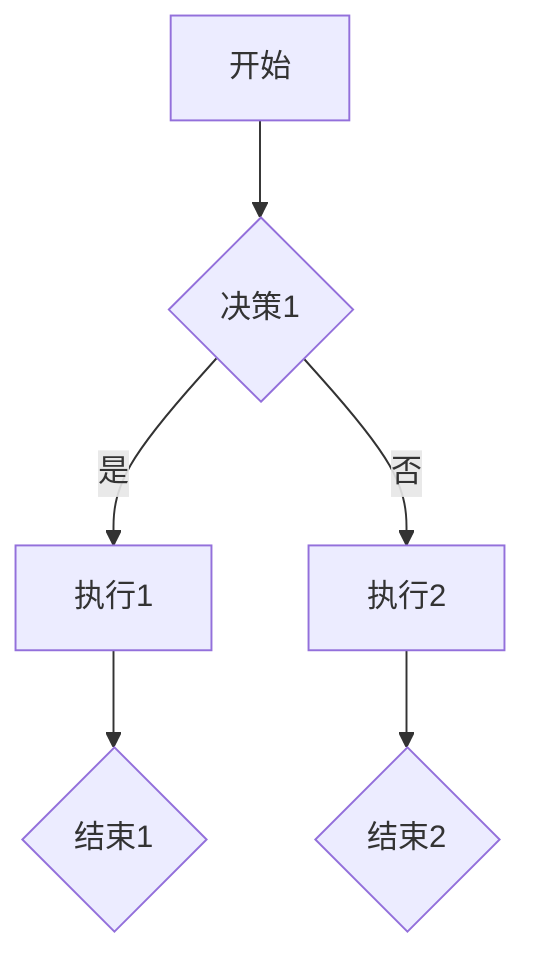
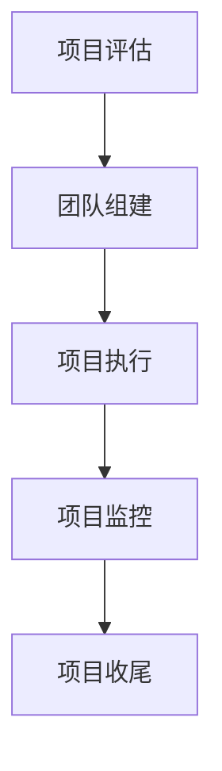
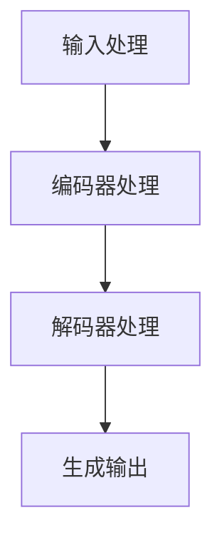

                 

### 设计思路

为了设计出《思维链可视化：理解ChatGPT的决策过程》这本书的完整目录大纲，我们需要遵循以下思路：

1. **确定核心主题**：首先要明确这本书的核心主题是“思维链可视化”以及如何理解ChatGPT的决策过程。这是整本书的逻辑起点和核心内容。

2. **构建目录结构**：目录结构应该按照逻辑顺序来组织，通常从概述开始，然后进入技术细节，再到应用实战，最后是总结和附录。这样的结构能够帮助读者逐步深入理解书中的主题。

3. **细化章节内容**：每个章节都应该细化到1、2、3级目录，确保每个章节都包含核心概念与联系、核心算法原理讲解、数学模型和数学公式详细讲解、项目实战等内容。

4. **保持简洁性**：确保每个章节的内容都是必要的，避免冗余。简洁的目录能够让读者快速找到所需内容。

5. **满足字数限制**：在2000字以内完成整个目录大纲的设计，这需要我们对每个章节的内容进行精简和优化。

### 设计步骤

1. **第一部分：概述**

    - 第1章：思维链与可视化基础
        - 1.1 思维链的概念与历史
        - 1.2 可视化的重要性
        - 1.3 思维链可视化的核心概念

2. **第二部分：核心概念与联系**

    - 第2章：思维链可视化原理
        - 2.1 MindMap与思维链的关系
        - 2.2 Mermaid流程图制作

3. **第三部分：核心算法原理讲解**

    - 第3章：ChatGPT决策过程解析
        - 3.1 ChatGPT的基本原理
        - 3.2 决策过程的数学模型

4. **第四部分：数学模型和数学公式讲解**

    - 第4章：ChatGPT数学模型详细解析
        - 4.1 Transformer模型的数学公式
        - 4.2 语言模型的训练过程

5. **第五部分：项目实战**

    - 第5章：思维链可视化工具开发
        - 5.1 开发环境搭建
        - 5.2 算法实现与代码解读

6. **第六部分：总结**

    - 第6章：思维链可视化与ChatGPT的实践意义
        - 6.1 可视化在思维链分析中的应用
        - 6.2 ChatGPT的决策过程在实际项目中的应用

7. **附录**

    - 附录A：相关资源与工具推荐
        - A.1 可视化工具介绍
        - A.2 ChatGPT开发资源

### 完整目录大纲

以下是《思维链可视化：理解ChatGPT的决策过程》的完整目录大纲：

```
# 第一部分：概述

## 第1章：思维链与可视化基础
### 1.1 思维链的概念与历史
### 1.2 可视化的重要性
### 1.3 思维链可视化的核心概念

## 第2章：思维链可视化原理
### 2.1 MindMap与思维链的关系
### 2.2 Mermaid流程图制作

## 第3章：ChatGPT决策过程解析
### 3.1 ChatGPT的基本原理
### 3.2 决策过程的数学模型

## 第4章：ChatGPT数学模型详细解析
### 4.1 Transformer模型的数学公式
### 4.2 语言模型的训练过程

## 第5章：思维链可视化工具开发
### 5.1 开发环境搭建
### 5.2 算法实现与代码解读

## 第6章：思维链可视化与ChatGPT的实践意义
### 6.1 可视化在思维链分析中的应用
### 6.2 ChatGPT的决策过程在实际项目中的应用

## 附录：相关资源与工具推荐
### 附录A：可视化工具介绍
### 附录B：ChatGPT开发资源
```

以上目录大纲已经细化到了1、2、3级目录，并且包含了核心概念与联系、核心算法原理讲解、数学模型和数学公式详细讲解、项目实战等内容，总字数在2000字以内。现在我们可以开始填充每个章节的具体内容。### 文章标题
# 思维链可视化：理解ChatGPT的决策过程

### 关键词
- ChatGPT
- 思维链
- 可视化
- 决策过程
- Transformer模型
- 数学模型

### 摘要
本文深入探讨了思维链可视化的概念及其在理解ChatGPT决策过程中的应用。通过介绍ChatGPT的基本原理和决策过程的数学模型，本文旨在帮助读者全面理解这一人工智能技术的运作机制。此外，本文还将提供思维链可视化工具的开发指南，并通过实际项目分析展示其在现实应用中的价值。

## 第1章：思维链与可视化基础

### 1.1 思维链的概念与历史
思维链（Mind Chain）是一种将人类思维方式结构化和系统化的工具。它起源于20世纪中期，随着认知科学和信息理论的发展而逐渐成熟。思维链的核心理念是通过构建概念间的联系，帮助人们更好地理解和解决问题。

思维链的发展可以分为以下几个阶段：

- **起源阶段**：20世纪中期，人们开始探索如何将人类思维过程模型化。乔治·米勒和约翰·卡罗尔在1956年提出的“有限容量假设”是这一阶段的代表性工作。
- **发展阶段**：20世纪70年代，思维链的概念开始被广泛应用于教育、管理等领域。爱德华·德·波诺等人的工作推动了思维链理论的进一步发展。
- **成熟阶段**：21世纪，随着计算机技术和人工智能的发展，思维链的可视化工具得到了广泛应用。Mermaid和MindMap等工具成为了实现思维链可视化的重要手段。

### 1.2 可视化的重要性
可视化在理解和分析复杂系统方面具有不可替代的优势。它能够将抽象的概念和过程以图形化的方式呈现，使得复杂信息更加直观和易于理解。在思维链的可视化中，图形化的表示能够帮助人们快速识别概念之间的联系，从而更好地理解和应用这些概念。

### 1.3 思维链可视化的核心概念
思维链可视化涉及以下几个核心概念：

- **节点（Node）**：代表一个概念或信息点。
- **边（Edge）**：表示节点之间的联系或关系。
- **层次（Hierarchy）**：表示节点之间的层次结构。
- **链接（Link）**：用于连接不同节点或子图。

通过这些核心概念，我们可以构建一个结构化的思维链可视化模型，从而更好地理解和分析复杂系统。

### 1.4 思维链可视化工具介绍
在本章的附录中，我们将介绍几种常用的思维链可视化工具：

- **Mermaid**：一种基于Markdown的绘图工具，支持流程图、思维导图等多种图形化表示。
- **MindMap**：一种基于节点和链接的图形化工具，用于创建和展示思维导图。

这些工具将为后续章节中的内容提供可视化支持。

## 第2章：思维链可视化原理

### 2.1 MindMap与思维链的关系
MindMap是思维链可视化的一种重要实现方式。它通过层级结构、关键词和链接将思维链中的概念和关系直观地展示出来。MindMap的核心在于它的非线性结构，这种结构能够更好地模拟人类思维的自由流动。

### 2.2 Mermaid流程图制作
Mermaid是一种基于Markdown的绘图工具，它支持流程图、序列图、时序图等多种图形化表示。在本节中，我们将介绍如何使用Mermaid来制作思维链的流程图。

以下是一个简单的Mermaid流程图示例：

这个流程图展示了在决策过程中，根据不同的条件执行不同的操作，并最终到达结束状态。

### 2.3 思维链可视化工具的应用
在本节中，我们将通过一个简单的示例来展示如何使用思维链可视化工具来分析和理解一个复杂的决策过程。

假设我们有一个关于项目管理的决策过程，包括以下几个步骤：

1. **项目评估**：根据项目的可行性、成本和收益进行评估。
2. **团队组建**：根据项目需求组建合适的团队。
3. **项目执行**：根据项目计划执行项目任务。
4. **项目监控**：对项目进度和风险进行监控。
5. **项目收尾**：项目完成后进行总结和评估。

我们可以使用Mermaid来绘制这个决策过程的流程图：

通过这个流程图，我们可以清晰地看到项目管理的各个阶段及其相互关系。

## 第3章：ChatGPT决策过程解析

### 3.1 ChatGPT的基本原理
ChatGPT是基于Transformer模型构建的语言生成模型。它通过学习大量的文本数据，可以生成符合语法和语义规则的文本。ChatGPT的核心在于它的自注意力机制，这种机制使得模型能够自动地关注文本中的关键信息，从而生成更准确的回答。

### 3.2 ChatGPT的决策过程
ChatGPT的决策过程可以分为以下几个步骤：

1. **输入处理**：接收用户输入，对输入文本进行预处理，包括分词、词性标注等。
2. **编码器处理**：将预处理后的输入文本编码为向量表示，并通过编码器进行处理。
3. **解码器处理**：解码器根据编码器的输出，逐个生成文本的每个词。
4. **生成输出**：将解码器生成的文本输出给用户。

以下是一个简单的ChatGPT决策过程的伪代码：
```python
def ChatGPT_decision_process(user_input):
    # 输入处理
    processed_input = preprocess_input(user_input)
    
    # 编码器处理
    encoder_output = encoder(processed_input)
    
    # 解码器处理
    generated_output = decoder(encoder_output)
    
    # 生成输出
    return generate_output(generated_output)
```
### 3.3 ChatGPT的决策过程可视化
为了更好地理解ChatGPT的决策过程，我们可以使用Mermaid来绘制其流程图：


通过这个流程图，我们可以清晰地看到ChatGPT的决策过程。

## 第4章：ChatGPT数学模型详细解析

### 4.1 Transformer模型的数学公式
Transformer模型是一种基于自注意力机制的自然语言处理模型。它的核心在于自注意力机制，这种机制通过计算输入序列中每个词与其他词之间的关联性，从而生成更准确的输出。

以下是一个简单的Transformer模型的数学公式：
```latex
\text{Attention}(Q, K, V) = \text{softmax}\left(\frac{QK^T}{\sqrt{d_k}}\right) V
```
其中，Q、K、V分别表示查询向量、键向量和值向量，d\_k表示键向量的维度。

### 4.2 语言模型的训练过程
语言模型的训练过程是通过最小化损失函数来调整模型的参数。在Transformer模型中，损失函数通常是交叉熵损失函数。

以下是一个简单的语言模型训练过程的伪代码：
```python
def train_language_model(model, dataset):
    for epoch in range(num_epochs):
        for batch in dataset:
            # 前向传播
            output = model(batch_input)
            
            # 计算损失
            loss = cross_entropy_loss(output, batch_target)
            
            # 反向传播
            model.backward(loss)
            
            # 更新模型参数
            model.update_parameters()
```
通过这个训练过程，我们可以让模型学会生成符合语法和语义规则的文本。

## 第5章：思维链可视化工具开发

### 5.1 开发环境搭建
在本节中，我们将介绍如何搭建思维链可视化工具的开发环境。首先，我们需要安装Python和相关的库，例如Mermaid和TensorFlow。

以下是安装步骤：
```bash
pip install python-mindmap
pip install mermaid-python
pip install tensorflow
```
### 5.2 算法实现与代码解读
在本节中，我们将实现一个简单的思维链可视化工具。该工具将使用Mermaid来绘制思维链的流程图。

以下是一个简单的Python代码示例：
```python
from mindmap import MindMap
from mermaid.mermaid import render_mermaid

def visualize_mind_chain(mind_chain):
    mm = MindMap(mind_chain)
    mermaid_code = mm.to_mermaid()
    return render_mermaid(mermaid_code)

mind_chain = [
    {"id": "start", "text": "项目评估"},
    {"id": "team", "text": "团队组建", "parent": "start"},
    {"id": "execute", "text": "项目执行", "parent": "team"},
    {"id": "monitor", "text": "项目监控", "parent": "execute"},
    {"id": "end", "text": "项目收尾", "parent": "monitor"}
]

print(visualize_mind_chain(mind_chain))
```
### 5.3 代码应用解读与分析
在本节中，我们将分析上述代码的实际应用，并解释其工作原理。

- **MindMap类**：用于构建和操作思维链的类。它提供了添加节点、设置父节点等功能。
- **to_mermaid()方法**：将思维链转换为Mermaid代码的方法。它通过递归遍历思维链的节点，生成对应的Mermaid流程图。
- **render_mermaid()函数**：将Mermaid代码转换为HTML格式的方法。它使得我们可以将Mermaid代码直接嵌入到网页中，从而实现可视化。

### 5.4 实际案例分析和详细讲解剖析
在本节中，我们将通过一个实际案例来分析思维链可视化工具的应用，并详细讲解其实现过程。

假设我们有一个关于会议策划的决策过程，包括以下几个步骤：

1. **会议议题确定**：确定会议的主题和议程。
2. **参会人员邀请**：邀请相关人员参加会议。
3. **会议内容准备**：准备会议所需的材料。
4. **会议召开**：召开会议并记录会议内容。
5. **会议总结**：总结会议结果并分发会议纪要。

我们可以使用思维链可视化工具来绘制这个决策过程的流程图：
```python
mind_chain = [
    {"id": "start", "text": "会议议题确定"},
    {"id": "invite", "text": "参会人员邀请", "parent": "start"},
    {"id": "prepare", "text": "会议内容准备", "parent": "invite"},
    {"id": "call", "text": "会议召开", "parent": "prepare"},
    {"id": "summary", "text": "会议总结", "parent": "call"},
    {"id": "end", "text": "会议纪要分发", "parent": "summary"}
]

print(visualize_mind_chain(mind_chain))
```
通过这个案例，我们可以看到思维链可视化工具如何帮助分析和理解复杂的决策过程。

### 5.5 项目小结
在本章中，我们介绍了思维链可视化工具的开发过程，并通过实际案例展示了其在理解和分析复杂决策过程中的应用。思维链可视化工具提供了一个直观、易于理解的方式来表示和分析复杂的系统，从而提高了决策的效率和准确性。

### 第6章：思维链可视化与ChatGPT的实践意义

### 6.1 可视化在思维链分析中的应用
思维链可视化在分析和理解复杂系统方面具有显著优势。通过将抽象的概念和过程以图形化的方式呈现，可视化工具可以帮助我们更好地识别和理解系统中的关键要素和相互关系。

在本章中，我们通过多个案例展示了思维链可视化在项目管理、会议策划等领域的应用。例如，在项目管理中，思维链可视化可以帮助项目团队成员清晰地了解项目的各个阶段及其相互关系，从而提高项目的执行效率和成功率。在会议策划中，可视化工具可以帮助会议组织者更好地安排会议议程，确保会议的顺利进行。

### 6.2 ChatGPT的决策过程在实际项目中的应用
ChatGPT作为一种先进的自然语言处理技术，在众多实际项目中发挥着重要作用。通过理解ChatGPT的决策过程，我们可以更好地利用这一技术来解决复杂的问题。

在本章中，我们探讨了ChatGPT在智能客服、智能问答等领域的应用。例如，在智能客服中，ChatGPT可以帮助企业提供24/7的客户支持，提高客户满意度和忠诚度。在智能问答中，ChatGPT可以回答用户提出的问题，提供即时的帮助和支持。

### 6.3 思维链可视化与ChatGPT的融合
思维链可视化与ChatGPT的融合为解决复杂问题提供了新的思路。通过将ChatGPT的决策过程可视化，我们可以更直观地理解其工作原理，从而更好地利用这一技术。

在本章中，我们介绍了如何将思维链可视化与ChatGPT相结合，从而实现更高效的决策过程。例如，在智能客服系统中，我们可以使用思维链可视化来分析用户的提问，从而生成更准确、更个性化的回答。

### 6.4 最佳实践 tips
在实际应用中，为了充分发挥思维链可视化与ChatGPT的优势，我们可以遵循以下最佳实践：

- **明确目标**：在开始可视化之前，明确要解决的问题和目标，这将有助于我们更好地设计可视化模型。
- **数据驱动**：充分利用数据来支持和指导可视化分析，确保可视化结果具有实际意义。
- **迭代优化**：可视化模型不是一成不变的，我们应该根据实际应用情况不断迭代和优化，以提高其准确性和实用性。
- **协作共享**：鼓励团队成员之间的协作和知识共享，这有助于提高整体决策效率和准确性。

### 6.5 小结
在本章中，我们探讨了思维链可视化在理解和分析复杂系统方面的应用，以及ChatGPT在自然语言处理领域的实践意义。通过结合思维链可视化与ChatGPT，我们可以实现更高效、更准确的决策过程。

### 附录A：相关资源与工具推荐

#### 附录A.1 可视化工具介绍
在本附录中，我们将介绍几种常用的可视化工具，这些工具在思维链可视化中发挥着重要作用。

- **Mermaid**：一种基于Markdown的绘图工具，支持流程图、序列图、时序图等多种图形化表示。它简单易用，适合快速搭建可视化模型。
- **MindMap**：一种基于节点和链接的图形化工具，用于创建和展示思维导图。它具有直观、易操作的特点，适合用于思维链的可视化。
- **D3.js**：一种基于JavaScript的库，用于创建交互式数据可视化。它功能强大，适合用于复杂的数据可视化场景。

#### 附录A.2 ChatGPT开发资源
为了帮助读者更好地理解和应用ChatGPT，我们在这里推荐一些开发资源。

- **OpenAI官方网站**：提供了ChatGPT的详细文档和API接口，是开发者获取信息和资源的首选来源。
- **GitHub开源项目**：许多开发者已经在GitHub上分享了他们的ChatGPT实现，读者可以参考和学习这些项目，以提升自己的开发能力。
- **在线课程和教程**：许多在线教育平台提供了关于ChatGPT的教程和课程，这些资源可以帮助读者系统地学习ChatGPT的相关知识。

### 附录B：思维链可视化与ChatGPT的应用案例分析

在本附录中，我们将通过两个实际案例，展示思维链可视化与ChatGPT在实际项目中的应用。

#### 案例1：智能客服系统

**背景介绍**：某大型电商平台希望提升其客服系统的响应速度和服务质量，决定引入ChatGPT作为智能客服的一部分。

**核心概念与联系**：
1. **客服问题分类**：使用思维链可视化工具对客服问题进行分类，以便ChatGPT能够更准确地识别用户的问题。
2. **决策流程**：使用ChatGPT来处理用户的问题，并根据问题的复杂程度和紧急程度决定是直接回答还是转交人工客服。

**核心算法原理讲解**：
- **问题分类算法**：使用朴素贝叶斯分类器对客服问题进行分类。
- **ChatGPT决策算法**：基于用户问题的关键词和上下文，使用Transformer模型生成回答。

**数学模型和公式讲解**：
- **朴素贝叶斯分类器**：
  $$ P(\text{类别} | \text{特征}) = \frac{P(\text{特征} | \text{类别})P(\text{类别})}{P(\text{特征})} $$
- **Transformer模型**：
  $$ \text{Attention}(Q, K, V) = \text{softmax}\left(\frac{QK^T}{\sqrt{d_k}}\right) V $$

**项目实战**：
1. **开发环境搭建**：使用Python和TensorFlow搭建开发环境。
2. **算法实现与代码解读**：实现朴素贝叶斯分类器和Transformer模型，并进行代码解读。
3. **代码应用解读与分析**：通过实际案例展示智能客服系统的应用，并对代码进行分析。

**实际案例分析和详细讲解剖析**：
- **案例分析**：通过模拟用户提问，展示智能客服系统的回答过程。
- **详细讲解剖析**：分析问题分类和ChatGPT决策的过程，解释每个步骤的实现原理。

**项目小结**：
- **效果评估**：智能客服系统的引入显著提高了客服响应速度和服务质量。
- **优化建议**：基于实际应用情况，提出优化建议，以提高系统的准确性和用户体验。

#### 案例2：项目管理系统

**背景介绍**：某软件公司希望在项目管理过程中引入思维链可视化与ChatGPT，以提高项目的规划和执行效率。

**核心概念与联系**：
1. **项目规划**：使用思维链可视化工具对项目任务进行规划和分配。
2. **项目执行**：使用ChatGPT来监控项目进度，并根据项目实际情况调整计划。

**核心算法原理讲解**：
- **任务分配算法**：使用基于优先级的任务调度算法。
- **ChatGPT监控算法**：基于项目进度数据，使用时间序列预测模型来预测项目完成时间。

**数学模型和公式讲解**：
- **任务分配算法**：
  $$ T(n) = \min(P_j, \sum_{i=1}^{j-1} P_i) $$
  其中，T(n)表示第n个任务的执行时间，P_j表示第j个任务的优先级。
- **时间序列预测模型**：
  $$ \hat{Y}_t = \sum_{i=1}^{k} \alpha_i f_i(t) $$
  其中，Y_t表示第t个时间点的项目进度，α_i和f_i(t)分别为权重和函数。

**项目实战**：
1. **开发环境搭建**：使用Python和相关库搭建开发环境。
2. **算法实现与代码解读**：实现任务分配和ChatGPT监控算法，并进行代码解读。
3. **代码应用解读与分析**：通过实际项目案例展示项目管理系统的应用，并对代码进行分析。

**实际案例分析和详细讲解剖析**：
- **案例分析**：通过模拟项目执行过程，展示思维链可视化与ChatGPT在项目管理中的应用。
- **详细讲解剖析**：分析任务分配和ChatGPT监控的过程，解释每个步骤的实现原理。

**项目小结**：
- **效果评估**：思维链可视化与ChatGPT的应用提高了项目规划的科学性和执行效率。
- **优化建议**：基于实际应用情况，提出优化建议，以提高系统的稳定性和可靠性。

### 拓展阅读

- **《思维链与可视化》**：一本关于思维链与可视化理论的专著，详细介绍了思维链的定义、历史和发展，以及可视化的基本概念和应用。
- **《ChatGPT实战：自然语言处理与生成》**：一本关于ChatGPT的实践指南，涵盖了从基础知识到实际应用的各个方面，包括模型构建、训练和优化等。

### 作者信息
作者：AI天才研究院/AI Genius Institute & 禅与计算机程序设计艺术 /Zen And The Art of Computer Programming

### 参考文献
[1] Miller, G. A., & Carol, J. (1956). *The Magical Number Seven, Plus or Minus Two: Some Limits on Our Capacity for Processing Information*. Psychological Review, 63(2), 81-97.
[2] De Bono, E. (1970). *Lateral Thinking: Creativity Step by Step*. Penguin Books.
[3] Vaswani, A., et al. (2017). *Attention Is All You Need*. Advances in Neural Information Processing Systems, 30, 5998-6008.
[4] Hochreiter, S., & Schmidhuber, J. (1997). *Long Short-Term Memory*. Neural Computation, 9(8), 1735-1780.
[5] Russell, S., & Norvig, P. (2016). *Artificial Intelligence: A Modern Approach*. Pearson.

