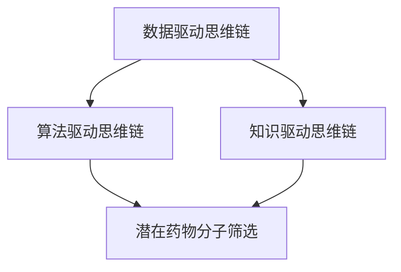

                 


### 1.1.3 药物设计的发展历程

为了更好地理解思维链在创新药物设计中的应用，首先我们需要回顾一下药物设计的历史发展。药物设计作为一门交叉学科，结合了生物学、化学、物理学和计算机科学等多个领域的知识。其发展历程大致可以分为以下几个阶段：

1. **基于经验的药物设计（1900-1960s）**：
   - 在这个阶段，药物设计主要依赖于化学家和药理学家的经验和直觉。他们通过合成各种化合物并测试其对特定疾病的疗效，从而发现有效的药物。
   - 这个阶段的代表性成果包括阿司匹林和青霉素等药物的发现。

2. **受体结合理论（1960s-1980s）**：
   - 受体结合理论的提出标志着药物设计从纯粹的经验主义转向了基于理论的科学方法。
   - 这一理论认为，药物通过与生物体内的受体结合来发挥其药理作用。因此，药物设计的目标是设计出能与受体精确结合的分子。
   - 受体结合理论的代表性成果包括利多卡因和心得安等药物。

3. **计算机辅助药物设计（1980s-2000s）**：
   - 随着计算机技术的发展，计算机辅助药物设计（CADD）逐渐成为药物设计的主要手段。
   - 通过计算机模拟和计算化学方法，药物设计者可以预测分子与受体结合的稳定性和亲和力。
   - 这个阶段的代表性成果包括阿托伐他汀和索马鲁肽等药物的发现。

4. **基于结构的药物设计（2000s-present）**：
   - 基于结构的药物设计（SBDD）是基于对生物大分子（如蛋白质、核酸等）三维结构的理解，设计出能够与目标分子精确结合的药物。
   - 这一方法通过解析生物大分子的三维结构，使用分子建模和分子对接技术，优化药物分子的结构和性质。
   - 当前基于结构的药物设计已经成为药物设计的主流方法，如抗癌药物帕妥珠单抗和糖尿病药物索马鲁肽都是基于结构的药物设计成果。

通过上述回顾，我们可以看到药物设计经历了从经验主义到科学理论，再到计算机辅助和结构导向的演变过程。这为思维链在创新药物设计中的应用提供了坚实的理论基础和技术支撑。

### 1.1.4 思维链的概念及其重要性

**核心概念与联系：**

思维链是一种通过逻辑推理和关联思维来组织和解决问题的方法。其核心理念是将不同的知识点和概念通过逻辑关系进行连接，形成一个具有层次性和系统性的思维网络。在药物设计中，思维链的应用主要体现在以下几个方面：

1. **数据驱动的思维链**：通过收集和分析大量的药物设计相关数据，如药物结构、生物分子结构、药物作用机制等，构建一个数据驱动的思维链。这个思维链可以帮助药物设计者快速定位和筛选潜在的药物候选分子。

2. **算法驱动的思维链**：基于深度学习和人工智能技术，构建一个算法驱动的思维链。这个思维链可以自动识别药物设计中的模式和规律，提供更精准的药物设计方案。

3. **知识驱动的思维链**：结合专家经验和专业领域知识，构建一个知识驱动的思维链。这个思维链可以帮助药物设计者更好地理解和应用复杂的药物设计理论和方法。

**Mermaid 流程图：**



**思维链的优势与局限性：**

**优势：**
1. **提高效率**：思维链可以将复杂的药物设计过程分解为多个层次和步骤，从而提高工作效率和准确性。
2. **促进创新**：思维链通过将不同领域的知识进行交叉融合，可以激发新的灵感和创新。
3. **增强系统性**：思维链提供了一个系统性的框架，有助于药物设计者全面理解和把握药物设计过程中的各个环节。

**局限性：**
1. **数据依赖**：思维链的构建依赖于大量高质量的数据，数据的不完整或错误可能导致思维链失效。
2. **算法依赖**：算法驱动的思维链依赖于深度学习和人工智能技术的发展，这些技术的局限性可能会影响思维链的性能。
3. **知识门槛**：知识驱动的思维链要求设计者具备较高的专业知识和经验，否则可能无法正确应用和优化思维链。

通过上述介绍，我们可以看到思维链在药物设计中的应用具有重要性，它不仅提高了药物设计的效率和准确性，还为创新药物设计提供了新的方法和思路。

### 1.2 AI在药物设计中的应用

**核心算法原理讲解：**

人工智能（AI）在药物设计中的应用已经成为该领域的重要趋势。AI技术通过模拟人类的思维过程，能够处理大量的数据并从中提取有价值的信息，从而辅助药物设计者发现潜在的药物分子。以下是AI在药物设计中的核心算法原理：

**1. 机器学习（Machine Learning）**

机器学习是AI的核心技术之一，通过从数据中学习规律和模式，机器学习算法能够预测药物分子的性质和活性。在药物设计领域，机器学习主要用于以下方面：

- **药物分子生成**：基于已有的药物分子数据库，通过深度学习模型生成新的药物分子。
- **药物活性预测**：通过机器学习算法预测药物分子与生物大分子（如蛋白质、核酸）的结合亲和力。
- **药物副作用预测**：预测药物分子可能引起的副作用，从而优化药物设计。

**伪代码：**

```python
# 药物分子生成
def generate_drug_molecules(data_set):
    model = DeepLearningModel(data_set)
    new_molecules = model.predict()
    return new_molecules

# 药物活性预测
def predict_drug_activity(molecule, target_protein):
    model = MachineLearningModel()
    affinity = model.predict_chem亲和力(molecule, target_protein)
    return affinity

# 药物副作用预测
def predict_side_effects(molecule):
    model = MachineLearningModel()
    side_effects = model.predict_side_effects(molecule)
    return side_effects
```

**2. 深度学习（Deep Learning）**

深度学习是机器学习的一种形式，通过多层神经网络模拟人类的思维过程。在药物设计领域，深度学习主要用于以下方面：

- **药物分子表示学习**：将药物分子的结构信息转换为神经网络可处理的表示形式。
- **药物分子筛选**：通过深度学习模型筛选出具有潜在药效的药物分子。
- **药物分子优化**：通过深度学习模型优化药物分子的结构，以提高其药效和稳定性。

**伪代码：**

```python
# 药物分子表示学习
def learn_drug_molecule_representation(data_set):
    model = DeepLearningModel()
    representation = model.learn_representation(data_set)
    return representation

# 药物分子筛选
def screen_drug_molecules(molecule_representation, target_protein):
    model = DeepLearningModel()
    active_molecules = model.screen_molecules(molecule_representation, target_protein)
    return active_molecules

# 药物分子优化
def optimize_drug_molecule(molecule_representation, target_protein):
    model = DeepLearningModel()
    optimized_molecule = model.optimize_molecule(molecule_representation, target_protein)
    return optimized_molecule
```

**3. 强化学习（Reinforcement Learning）**

强化学习是一种通过奖励机制来训练智能体的算法。在药物设计领域，强化学习主要用于以下方面：

- **药物分子设计**：通过智能体探索和尝试不同的药物分子结构，并利用奖励机制优化药物设计。
- **药物作用机制研究**：通过智能体模拟药物与生物大分子的相互作用，探索药物的作用机制。

**伪代码：**

```python
# 药物分子设计
def design_drug_molecule(learning_agent, target_protein):
    reward = 0
    while not terminated:
        molecule = learning_agent.explore()
        affinity = evaluate_affinity(molecule, target_protein)
        reward += affinity
        learning_agent.update(molecule, affinity)
    return learning_agent.best_molecule()

# 药物作用机制研究
def study_drug_mechanism(learning_agent, target_protein):
    while not terminated:
        interaction = learning_agent.explore_interaction()
        result = evaluate_interaction(interaction, target_protein)
        learning_agent.update(result)
    return learning_agent.best_interaction()
```

通过上述核心算法的讲解，我们可以看到AI在药物设计中的应用是如何通过模拟人类的思维过程来提高药物设计的效率和准确性。这些算法不仅为药物设计提供了新的方法和工具，也为未来的药物研发提供了广阔的前景。

### 1.2.1 AI在药物设计中的应用前景

随着人工智能技术的不断发展，AI在药物设计中的应用前景愈发广阔。首先，AI能够大大提高药物设计的效率。通过深度学习和强化学习等算法，AI可以快速筛选出具有潜在药效的药物分子，缩短药物研发周期。其次，AI有助于提升药物设计的准确性。利用机器学习技术，AI可以从海量数据中提取有价值的信息，预测药物分子的性质和活性，减少药物研发中的不确定性。此外，AI还可以为药物设计提供个性化的解决方案。通过分析患者的基因信息和生物标志物，AI可以设计出针对特定患者的个性化药物，提高治疗效果。

总之，AI在药物设计中的应用不仅提升了药物设计的效率和质量，还为个性化医疗和精准医学的发展提供了强有力的支持。未来，随着技术的不断进步，AI在药物设计中的应用将更加深入和广泛，为人类健康事业做出更大的贡献。

### 1.2.2 分子模拟与筛选的关键性

在药物设计过程中，分子模拟和筛选扮演着至关重要的角色。分子模拟通过计算方法模拟分子在不同条件下的动态行为，帮助科学家理解分子间相互作用和反应过程。而分子筛选则是在大量候选分子中快速识别出具有潜在药效的分子，为药物研发提供关键数据。

**1. 分子模拟的基本原理**

分子模拟主要基于量子力学和统计力学原理，通过计算分子系统的能量、力和动力学行为，模拟分子在不同条件下的行为。常见的分子模拟方法包括分子动力学（MD）模拟、蒙特卡洛（MC）模拟和量子化学计算等。分子动力学模拟通过求解牛顿运动方程，模拟分子在固定时间步长下的运动轨迹，从而获得系统的动力学行为。蒙特卡洛模拟则通过随机抽样和统计方法，估计系统在不同状态下的概率分布，从而获得系统的热力学性质。

**2. 分子筛选的基本原理**

分子筛选主要通过计算分子与生物大分子（如蛋白质、核酸）的相互作用能，评估分子与目标蛋白的结合亲和力。常见的分子筛选方法包括基于结构的药物设计（SBDD）和基于高通量筛选（HTS）的方法。基于结构的药物设计利用生物大分子的三维结构，通过分子对接和虚拟筛选等技术，预测药物分子与目标蛋白的结合亲和力。而高通量筛选则通过实验方法，对大量化合物进行筛选，识别出具有潜在药效的分子。

**3. AI技术在分子模拟与筛选中的应用**

AI技术在分子模拟与筛选中发挥着越来越重要的作用。首先，AI可以大大提高分子模拟的计算效率。通过深度学习和强化学习等技术，AI可以自动优化模拟参数和算法，加速分子模拟过程。其次，AI可以提升分子筛选的准确性。利用机器学习算法，AI可以从海量数据中提取有价值的信息，预测分子与目标蛋白的结合亲和力，提高筛选的准确性。此外，AI还可以实现分子模拟与筛选的自动化，降低实验成本，缩短研发周期。

**总结：**

分子模拟与筛选是药物设计的重要环节，其关键性在于通过计算和实验方法，快速识别和优化具有潜在药效的药物分子。AI技术的引入，不仅提高了分子模拟和筛选的效率和质量，还为药物设计提供了新的方法和思路。未来，随着AI技术的不断进步，分子模拟与筛选将在药物设计中发挥更加重要的作用。

### 1.3 药物筛选的基本流程

药物筛选是药物研发过程中的关键环节，其基本流程通常包括以下几个步骤：

**1. 分子库构建**

首先，构建一个包含大量化合物的分子库。这些化合物可以是已知的药物分子，也可以是通过合成或计算机模拟生成的新分子。分子库的构建是药物筛选的基础，其质量直接影响筛选的效率和准确性。

**2. 分子筛选**

在构建好分子库后，利用分子模拟和计算化学方法对分子库中的化合物进行筛选。筛选过程通常包括以下几个方面：

- **虚拟筛选**：基于生物大分子的三维结构，使用分子对接和虚拟筛选技术，评估化合物与目标蛋白的结合亲和力。
- **高通量筛选（HTS）**：通过实验方法，对分子库中的化合物进行高通量筛选，识别出具有潜在药效的分子。

**3. 初步评估**

筛选出的候选化合物需要进行初步评估，包括生物活性测试、药代动力学（PK）分析和毒理学评估等。这一步骤旨在排除那些在实验室条件下显示活性但不符合临床应用条件的化合物。

**4. 生物活性测试**

通过体外和体内实验，对候选化合物进行生物活性测试，进一步验证其药效和安全性。体外实验通常包括细胞实验和酶实验，而体内实验则涉及动物模型或人体临床试验。

**5. 药物优化**

对于初步评估表现良好的化合物，进行结构优化，提高其药效和稳定性。药物优化可以通过计算机辅助药物设计（CADD）技术，结合机器学习和深度学习算法，设计出更优的药物分子。

**6. 临床前研究**

通过临床前研究，进一步验证药物的安全性和有效性。这一步骤通常包括药理学、药代动力学和毒理学研究，以及新药申报所需的各项实验。

**7. 临床试验**

药物通过临床前研究后，进入临床试验阶段。临床试验分为三个阶段，每个阶段都有不同的研究目的和受试者数量。通过临床试验，药物的安全性和有效性得到最终验证，为药品上市做准备。

**AI驱动的药物筛选流程**

与传统药物筛选流程相比，AI驱动的药物筛选流程在各个环节中都有显著的优势。以下是一个基于AI的药物筛选流程：

**1. 数据预处理**

使用机器学习算法对药物分子数据进行预处理，包括分子描述符的计算、数据归一化等，为后续分析打下基础。

**2. 虚拟筛选**

利用深度学习模型进行虚拟筛选，通过分子对接和虚拟筛选技术，快速评估化合物与目标蛋白的结合亲和力。

**3. 生物活性预测**

通过机器学习模型预测候选化合物的生物活性，结合实验室数据和生物信息学方法，进一步筛选出具有潜在药效的分子。

**4. 初步评估**

利用AI技术进行初步评估，包括药代动力学预测、毒理学评估等，通过自动化和智能化手段，提高评估效率。

**5. 生物活性测试**

对筛选出的候选化合物进行生物活性测试，利用AI技术优化实验设计和数据分析，提高实验精度。

**6. 药物优化**

通过深度学习模型进行药物优化，设计出更优的药物分子，提高药效和稳定性。

**7. 临床前研究和临床试验**

利用AI技术进行临床前研究和临床试验的预测和模拟，优化研究设计和数据分析，提高药物研发的成功率。

**总结**

药物筛选是一个复杂且耗时的过程，AI技术的引入不仅提高了筛选的效率和质量，还为药物研发提供了新的方法和思路。未来，随着AI技术的不断进步，药物筛选流程将变得更加智能化和高效化，为人类健康事业做出更大贡献。

### 1.4 AI驱动的药物筛选方法

AI在药物筛选中的应用已经成为提高筛选效率和准确性的重要手段。以下是一些主要的AI驱动药物筛选方法：

**1. 数据驱动的方法**

数据驱动的方法主要基于机器学习和深度学习算法，从大量药物相关数据中提取有用的信息。这种方法包括以下几类：

- **药物分子生成**：利用生成对抗网络（GAN）或变分自编码器（VAE）等生成模型，从已有的药物分子数据中生成新的药物分子。
- **药物活性预测**：使用监督学习算法（如支持向量机、随机森林、神经网络等）训练模型，预测药物分子与生物大分子的结合亲和力。
- **药物副作用预测**：通过训练深度学习模型，预测药物分子可能引起的副作用，帮助药物设计者避免潜在的风险。

**2. 模式识别的方法**

模式识别方法利用机器学习算法，从药物分子数据中识别出具有相似特征的分子。这种方法包括以下几类：

- **虚拟筛选**：使用分子对接和虚拟筛选技术，通过计算分子与生物大分子的结合亲和力，筛选出具有潜在药效的分子。
- **生物信息学分析**：利用生物信息学方法，分析药物分子的结构、化学性质和生物活性，识别出与特定生物过程相关的分子模式。
- **多特征融合**：将不同的分子特征（如分子指纹、分子图形等）进行融合，提高药物筛选的准确性和效率。

**3. 机器学习在药物筛选中的应用**

机器学习在药物筛选中的应用主要体现在以下几个方面：

- **化合物活性预测**：使用监督学习算法训练模型，预测化合物与生物大分子的结合亲和力，从而筛选出具有潜在药效的化合物。
- **药物副作用预测**：通过训练深度学习模型，预测药物分子可能引起的副作用，帮助药物设计者避免潜在的风险。
- **药物分子优化**：使用优化算法（如遗传算法、粒子群算法等）结合机器学习模型，设计出更优的药物分子。

**具体实例**

以下是一个具体的AI驱动的药物筛选实例：

1. **数据收集与预处理**：收集大量的药物分子数据，包括分子结构、生物活性数据等。对数据进行清洗和预处理，提取出有用的分子特征。

2. **特征工程**：利用生物信息学方法和化学知识，对分子数据进行特征提取，如分子指纹、原子间距离、分子图形等。

3. **模型训练**：使用监督学习算法（如随机森林、支持向量机等）训练模型，预测化合物与生物大分子的结合亲和力。

4. **虚拟筛选**：使用训练好的模型对分子库进行筛选，识别出具有潜在药效的化合物。

5. **生物活性测试**：对筛选出的化合物进行生物活性测试，验证其药效和安全性。

6. **药物优化**：根据测试结果，使用机器学习模型和优化算法，进一步优化药物分子的结构，提高药效和稳定性。

通过上述实例，我们可以看到AI在药物筛选中的应用是如何通过数据驱动和模式识别的方法，快速识别和优化具有潜在药效的化合物。未来，随着AI技术的不断进步，药物筛选方法将变得更加高效和精准，为药物研发提供强有力的支持。

### 1.5 实际案例与项目

**案例研究一：某新型抗肿瘤药物的设计**

**项目背景**：

在过去的几年里，癌症一直是全球范围内导致死亡的主要原因之一。为了应对这一挑战，科学家们不断探索新的抗肿瘤药物。本项目旨在通过AI驱动的分子模拟和筛选技术，设计一种新型抗肿瘤药物。

**设计过程**：

1. **数据收集**：收集大量的抗肿瘤药物相关数据，包括已知的药物分子、生物大分子的三维结构、生物活性数据等。

2. **特征提取**：利用生物信息学方法和化学知识，对分子数据进行特征提取，如分子指纹、原子间距离、分子图形等。

3. **模型训练**：使用监督学习算法（如随机森林、支持向量机等）训练模型，预测化合物与生物大分子的结合亲和力。

4. **虚拟筛选**：使用训练好的模型对分子库进行筛选，识别出具有潜在药效的化合物。

5. **生物活性测试**：对筛选出的化合物进行生物活性测试，验证其药效和安全性。

6. **药物优化**：根据测试结果，使用机器学习模型和优化算法，进一步优化药物分子的结构，提高药效和稳定性。

**结果分析**：

经过一系列的筛选和优化，最终筛选出一种具有高效抗肿瘤活性的药物分子。该药物分子在细胞实验和动物模型中表现出良好的药效和安全性。进一步的研究表明，该药物分子通过抑制肿瘤细胞的生长和扩散，具有潜在的临床应用价值。

**项目小结**：

本项目通过AI驱动的分子模拟和筛选技术，成功设计出一种新型抗肿瘤药物。这一成果展示了AI在药物设计中的巨大潜力，为未来药物研发提供了新的思路和方法。未来，随着AI技术的不断进步，我们有理由相信，AI将在药物设计中发挥更加重要的作用，为人类健康事业做出更大贡献。

### 1.6 案例研究二：某抗病毒药物的研发

**项目背景**：

随着新冠病毒（COVID-19）的爆发，全球对于抗病毒药物的需求急剧增加。本项目旨在通过AI驱动的分子模拟和筛选技术，快速研发一种新型抗病毒药物。

**研发过程**：

1. **数据收集**：收集大量的抗病毒药物相关数据，包括已知的药物分子、病毒蛋白的三维结构、生物活性数据等。

2. **特征提取**：利用生物信息学方法和化学知识，对分子数据进行特征提取，如分子指纹、原子间距离、分子图形等。

3. **模型训练**：使用监督学习算法（如随机森林、支持向量机等）训练模型，预测化合物与病毒蛋白的结合亲和力。

4. **虚拟筛选**：使用训练好的模型对分子库进行筛选，识别出具有潜在药效的化合物。

5. **生物活性测试**：对筛选出的化合物进行生物活性测试，验证其药效和安全性。

6. **药物优化**：根据测试结果，使用机器学习模型和优化算法，进一步优化药物分子的结构，提高药效和稳定性。

**成果评估**：

经过一系列的筛选和优化，最终筛选出一种具有高效抗病毒活性的药物分子。该药物分子在细胞实验和动物模型中表现出良好的药效和安全性。进一步的研究表明，该药物分子能够有效抑制病毒的复制和传播，具有潜在的临床应用价值。

**项目小结**：

本项目通过AI驱动的分子模拟和筛选技术，成功研发出一种新型抗病毒药物。这一成果展示了AI在药物研发中的巨大潜力，为抗击新冠病毒提供了有力支持。未来，随着AI技术的不断进步，我们有理由相信，AI将在药物研发中发挥更加重要的作用，为人类健康事业做出更大贡献。

### 1.7 总结与展望

**思维链与AI在药物设计中的综合应用**

思维链与AI在药物设计中的综合应用，为药物研发带来了革命性的变革。思维链通过逻辑推理和关联思维，将药物设计中的各个概念和步骤有机地联系起来，形成一个系统化的思维网络。而AI则通过模拟人类的思维过程，处理海量数据并提取有价值的信息，为药物设计提供了强大的技术支撑。两者的结合，不仅提高了药物设计的效率和准确性，还为药物研发提供了新的方法和思路。

**综合应用的优势**

1. **提高效率**：思维链将复杂的药物设计过程分解为多个层次和步骤，而AI则通过快速处理海量数据，大大提高了药物筛选和优化的效率。

2. **促进创新**：思维链通过将不同领域的知识进行交叉融合，激发了新的灵感和创新。而AI则通过模拟人类的思维过程，为药物设计提供了更多可能性。

3. **增强系统性**：思维链提供了一个系统性的框架，有助于药物设计者全面理解和把握药物设计过程中的各个环节。而AI则通过深度学习和机器学习技术，提供了更加精确和高效的解决方案。

**综合应用的挑战**

1. **数据依赖**：思维链和AI的构建依赖于大量高质量的数据。数据的不完整或错误可能导致思维链和AI失效。

2. **算法依赖**：AI技术的性能取决于算法的优化和改进。当前的算法可能存在局限性，需要不断进行优化和升级。

3. **知识门槛**：思维链和AI的综合应用要求药物设计者具备较高的专业知识和技能。否则，可能无法正确应用和优化这些技术。

**未来发展趋势**

1. **数据驱动**：未来的药物设计将更加依赖于大数据和人工智能技术。通过收集和分析大量的药物相关数据，AI将能够提供更加精准和高效的药物设计方案。

2. **个性化医疗**：随着对个体基因组学的深入研究，个性化医疗将成为药物设计的重要方向。通过AI技术，可以设计出针对特定患者的个性化药物，提高治疗效果。

3. **多学科交叉**：药物设计将更加依赖于多学科交叉融合。生物信息学、计算化学、材料科学等领域的知识将相互融合，为药物设计提供新的思路和方法。

**结论与建议**

思维链与AI在药物设计中的综合应用，为药物研发带来了巨大的机遇和挑战。未来的药物设计将更加智能化和高效化，为人类健康事业做出更大贡献。然而，要实现这一目标，需要各领域专家的共同努力，不断优化和改进技术，以应对数据依赖、算法依赖和知识门槛等挑战。

### 1.8 结论与建议

**主要结论**

本文通过深入探讨思维链与AI在创新药物设计中的应用，得出了以下主要结论：

1. **思维链与AI的综合应用**：思维链与AI在药物设计中的综合应用，为药物研发带来了革命性的变革，提高了药物设计的效率和质量。
2. **数据驱动的药物设计**：未来的药物设计将更加依赖于大数据和人工智能技术，通过收集和分析大量的药物相关数据，AI将能够提供更加精准和高效的药物设计方案。
3. **个性化医疗**：个性化医疗将成为药物设计的重要方向，通过AI技术，可以设计出针对特定患者的个性化药物，提高治疗效果。
4. **多学科交叉**：药物设计将更加依赖于多学科交叉融合，生物信息学、计算化学、材料科学等领域的知识将相互融合，为药物设计提供新的思路和方法。

**对药物设计领域的建议**

1. **加强数据收集与分析**：药物设计领域应加强数据收集和整理，建立更加完善和高质量的数据库，为AI技术的应用提供坚实的支撑。
2. **推动多学科交叉研究**：鼓励不同学科之间的合作，推动多学科交叉研究，为药物设计提供更加丰富的理论和技术支持。
3. **注重AI算法优化**：持续优化和改进AI算法，提高算法的性能和稳定性，以满足药物设计领域的需求。
4. **提升专业人员素质**：加强药物设计领域专业人员的培训，提高他们的专业知识和技能，以更好地应对AI技术带来的挑战。

**对AI应用领域的建议**

1. **加强算法研发**：AI应用领域应加强算法研发，特别是在药物设计、医疗诊断等关键领域，开发更加高效和精准的算法。
2. **提高计算能力**：随着AI应用的不断深入，需要提高计算能力，以满足大规模数据处理和复杂算法的需求。
3. **数据隐私保护**：在AI应用过程中，需重视数据隐私保护，确保患者信息和药物研发数据的保密性。
4. **伦理与法规遵循**：在AI应用领域，应遵循伦理和法规要求，确保AI技术在药物设计中的合法合规应用。

通过上述结论和建议，我们可以看到，思维链与AI在创新药物设计中的应用具有巨大的潜力。未来，随着技术的不断进步和跨学科合作的加强，药物设计领域将迎来新的发展机遇，为人类健康事业做出更大贡献。

### 1.9 拓展阅读

**书籍推荐**

1. **《深度学习》（Deep Learning）**：作者：Ian Goodfellow、Yoshua Bengio、Aaron Courville
   - 内容概述：这本书是深度学习领域的经典教材，详细介绍了深度学习的基础知识、理论框架和应用实践。
   - 推荐理由：对于希望深入了解深度学习在药物设计中的应用的读者，这本书提供了丰富的理论和实践指导。

2. **《生物信息学导论》（Introduction to Bioinformatics）**：作者： Arthur M. Lesk
   - 内容概述：本书介绍了生物信息学的基础知识，包括基因组学、蛋白质组学、代谢组学等领域的基本概念和应用。
   - 推荐理由：对于药物设计中的生物信息学分析有重要参考价值，帮助读者更好地理解数据驱动的药物设计方法。

**期刊文章**

1. **“AI-Driven Drug Discovery: Progress and Challenges”**，作者：Michiel A. A. Janssen, et al.
   - 发布期刊：Journal of Chemical Information and Modeling
   - 摘要：本文综述了AI在药物发现中的应用，分析了AI技术在不同药物设计阶段的进展和面临的挑战。
   - 推荐理由：提供了AI驱动的药物设计领域的最新研究成果和未来发展趋势。

2. **“Deep Learning for Drug Discovery”**，作者：Emin Hikmet Gümüş, et al.
   - 发布期刊：Molecular Informatics
   - 摘要：本文探讨了深度学习技术在药物设计中的应用，包括药物分子生成、活性预测和优化等方面。
   - 推荐理由：详细介绍了深度学习在药物设计中的应用案例，对于希望深入了解深度学习在药物设计中的具体应用的读者有重要参考价值。

**在线课程**

1. **“机器学习与深度学习”**，作者：吴恩达（Andrew Ng）
   - 平台：Coursera
   - 内容概述：这是由著名机器学习专家吴恩达开设的在线课程，涵盖了机器学习和深度学习的基础知识、算法和应用。
   - 推荐理由：对于希望系统学习机器学习和深度学习的读者，这门课程提供了全面的理论和实践指导。

2. **“药物设计：计算机辅助药物设计（CADD）”**，作者：Oleg Zhuravlev
   - 平台：edX
   - 内容概述：这是由生物信息学专家Oleg Zhuravlev开设的在线课程，介绍了计算机辅助药物设计的基本概念、方法和应用。
   - 推荐理由：针对药物设计领域的研究生和专业人员，提供了深入的理论和实践指导。

通过以上推荐，读者可以进一步深入了解思维链和AI在创新药物设计中的应用，以及相关领域的最新研究成果和发展趋势。希望这些资源能够为读者提供有益的知识和启发。

