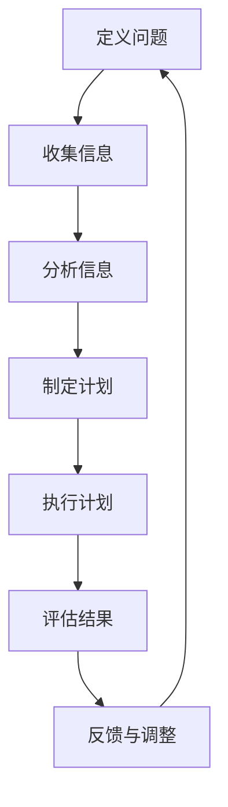

                 

### 文章标题

《思维链在古文明解码中的应用：重构失落的历史知识》

### 关键词

思维链、古文明解码、历史知识重构、人工智能、符号学、数学模型

### 摘要

本文深入探讨了思维链在古文明解码中的应用，以及如何利用这一概念重构失落的历史知识。通过分析思维链的概念、起源与发展，我们揭示了其在古文明解析中的核心作用。文章接着探讨了古文明解码的方法和挑战，并详细介绍了历史知识重构的技术和案例。通过实例展示和实战分析，本文旨在为读者提供一种全新的视角，以理解如何利用思维链技术挖掘和恢复古文明的智慧。

---

### 引言

在人类文明的历史长河中，古文明为我们留下了众多谜团和未解之谜。从古埃及的金字塔到古希腊的数学公式，再到古印度的梵文与瑜伽，这些文化遗产不仅体现了古人的智慧，也揭示了他们独特的生活方式和文化背景。然而，随着时间的推移，这些文明的知识和智慧逐渐失传，成为我们无法触及的失落领域。

近年来，随着人工智能和大数据技术的发展，我们开始有机会利用现代科技手段来解码这些古文明。其中，思维链作为一种先进的思维工具，在古文明解码中展现出了巨大的潜力。思维链不仅能够帮助我们更好地理解古文明的符号系统和逻辑结构，还能够重构失落的史实，为历史研究提供新的视角和工具。

本文旨在探讨思维链在古文明解码中的应用，通过分析思维链的概念、古文明的解析方法和历史知识重构的技术，旨在为读者提供一种新的思路，以理解和重构那些失落的历史知识。

### 思维链概述

#### 1.1 思维链的定义与历史

思维链，简称思维链，是一种基于逻辑和关系的思维工具，用于分析和解决问题的过程。它通过将思维分解为一系列相互关联的步骤，形成一个有组织的思维流程。思维链的起源可以追溯到古希腊哲学家亚里士多德，他在其著作《工具论》中首次提出了类似的概念。随后，思维链在不同文化和学科中得到了发展和应用，逐渐成为现代逻辑学和计算机科学的重要工具。

在计算机科学领域，思维链的应用尤为广泛。它被用于算法设计、问题求解和人工智能等领域。通过思维链，程序员可以更加系统地分析问题，找到解决方案，并优化算法效率。此外，思维链还在自然语言处理、机器学习和数据挖掘等领域发挥了重要作用，为这些领域提供了强大的思维工具。

#### 1.2 思维链的起源与发展

思维链的概念最早出现在古希腊哲学中，亚里士多德等人对其进行了系统阐述。在中世纪，阿拉伯哲学家和学者进一步发展了思维链的理论，并将其应用到逻辑学和哲学研究中。在文艺复兴时期，思维链的概念再次得到重视，成为欧洲哲学和科学方法论的重要组成部分。

在近现代，随着计算机科学和人工智能的发展，思维链的应用得到了前所未有的扩展。计算机科学家和逻辑学家们通过对思维链的研究，开发出了各种算法和工具，使其在计算机编程和问题解决中发挥了重要作用。此外，思维链的概念也被引入到心理学和教育学领域，用于指导学生和研究人员进行有效思考。

#### 1.3 思维链的核心特点

思维链具有以下核心特点：

1. **系统性**：思维链通过将思维分解为一系列相互关联的步骤，形成了一个有组织的思维流程。这种系统性使得思维链在解决问题时更加高效和有序。

2. **逻辑性**：思维链强调逻辑推理和关系分析，使思维过程更加严谨和精确。通过逻辑性，思维链可以帮助我们找到问题的核心，并迅速定位解决方案。

3. **灵活性**：思维链不仅适用于单一问题，还可以应用于复杂系统和多领域问题。其灵活性使得思维链在多个学科和领域中具有广泛的应用。

4. **可重复性**：思维链的步骤和方法可以重复使用，使思维过程具有可重复性和可验证性。这有助于确保思考过程的正确性和可靠性。

5. **创造性**：思维链不仅强调逻辑性和系统性，还鼓励创新思维。通过灵活运用思维链，我们可以发现新的问题和解决方案，推动人类文明的进步。

### 古文明解码

#### 2.1 古文明的历史背景

古文明是人类社会发展的重要阶段，它们为后世留下了丰富的文化遗产。以下是一些著名古文明的历史背景：

- **古埃及**：古埃及文明起源于约公元前3100年，其首都孟菲斯位于尼罗河三角洲。古埃及人以其宏伟的金字塔、木乃伊制作技术和丰富的宗教信仰而闻名。

- **古希腊**：古希腊文明起源于约公元前800年，其首都雅典位于爱琴海沿岸。古希腊人以其哲学思想、民主政治和艺术成就而著称。

- **古印度**：古印度文明起源于约公元前1800年，其首都位于今天的德里附近。古印度人以其梵文、瑜伽和数学成就而闻名。

- **玛雅文明**：玛雅文明起源于约公元前2000年，其领土位于今天的墨西哥、危地马拉和伯利兹等地。玛雅人以其先进的历法、建筑和艺术而著称。

- **阿兹特克文明**：阿兹特克文明起源于约公元1200年，其首都特诺奇蒂特兰位于今天的墨西哥城附近。阿兹特克人以其高度发达的农业、建筑和宗教信仰而著名。

这些古文明在建筑、艺术、数学、天文学等领域取得了显著成就，为我们提供了宝贵的历史资料。然而，随着时间的推移，这些文明的知识和智慧逐渐失传，成为我们无法触及的失落领域。

#### 2.2 文字与符号的解读

古文明的解析过程中，文字与符号的解读是关键的一环。不同的古文明采用了不同的文字系统，这些文字系统反映了古人的思维方式和知识体系。

- **古埃及象形文字**：古埃及象形文字是最早的书面文字之一，起源于约公元前3100年。这些文字通过描绘物体的图像来表达意义。解读古埃及象形文字需要了解古埃及人的社会结构、宗教信仰和文化背景。

- **古希腊文字**：古希腊文字采用字母系统，起源于约公元前800年。古希腊文字不仅用于书写语言，还用于书写数学公式和哲学著作。解读古希腊文字需要掌握古希腊语法和哲学思想。

- **古印度梵文**：梵文是古印度文明的书面语言，起源于约公元前1800年。梵文采用音节字母系统，是印度教、佛教和耆那教的重要经典语言。解读梵文需要了解古印度的宗教信仰和哲学思想。

- **玛雅文字**：玛雅文字是玛雅文明的书面语言，起源于约公元前2000年。玛雅文字采用象形文字和音节文字结合的方式，是一种高度复杂的文字系统。解读玛雅文字需要掌握玛雅社会的文化和历史背景。

- **阿兹特克文字**：阿兹特克文字是阿兹特克文明的书面语言，起源于约公元1200年。阿兹特克文字采用象形文字和音节文字结合的方式，主要用于记录历史、宗教和行政事务。解读阿兹特克文字需要了解阿兹特克社会的文化和历史。

通过对这些文字与符号的解读，我们可以深入了解古文明的知识体系、思维方式和文化背景。然而，古文字的解读过程往往充满挑战，需要结合考古学、历史学、语言学等多个学科的研究成果。

#### 2.3 古文明中的思维链应用

古文明在建筑、艺术、数学等领域取得了显著成就，这些成就背后往往蕴含着复杂的思维链。以下是一些古文明中的思维链应用实例：

- **古埃及的金字塔建筑**：古埃及金字塔是古代世界七大奇迹之一，其建筑技术和数学原理令人惊叹。古埃及人通过使用思维链，将复杂的建筑结构分解为一系列可操作的步骤。这些步骤包括测量、绘图、切割和堆叠，最终实现了宏伟的金字塔建筑。

- **古希腊的数学公式**：古希腊数学家们通过对数学问题进行逻辑分析和推理，提出了许多重要的数学公式。例如，毕达哥拉斯定理（勾股定理）就是古希腊数学家毕达哥拉斯提出的。古希腊人通过思维链，将数学问题分解为一系列可证明的步骤，从而得出了这些重要的数学公式。

- **古印度的梵文与瑜伽**：古印度人通过梵文记录了大量的哲学、宗教和科学知识。梵文中的思维链体现在其对语言、逻辑和哲学的深入探讨。此外，瑜伽作为一种身心修炼的方法，也体现了思维链的应用。瑜伽练习者通过一系列的呼吸、姿势和冥想练习，逐步提升自我意识，达到身心合一的境界。

- **玛雅文明的历法**：玛雅文明在历法方面取得了卓越成就，其历法系统比西方格里历法更为精确。玛雅人通过思维链，将天文观测、数学计算和宗教仪式相结合，构建了一个复杂而精确的历法系统。

- **阿兹特克的农业与建筑**：阿兹特克文明在农业和建筑方面也展现了其独特的智慧。阿兹特克人通过使用思维链，将复杂的生产和建筑任务分解为一系列可操作的步骤。这些步骤包括灌溉系统设计、农作物种植和建筑结构规划，最终实现了高效的农业和建筑成就。

通过分析这些古文明中的思维链应用实例，我们可以看到思维链在古文明解析中的重要性。思维链不仅帮助古文明取得了辉煌的成就，也为后人提供了宝贵的智慧遗产。利用思维链，我们可以更好地理解古文明的知识体系，从而重构失落的历史知识。

### 历史知识重构

#### 3.1 历史知识重构的概念

历史知识重构是指利用现代科技手段，对已失传或未被充分理解的历史知识进行重新发现、解读和重建的过程。这一概念涉及多个学科领域，包括考古学、历史学、语言学、计算机科学等。通过历史知识重构，我们可以更全面、准确地理解历史事件、人物和文明，填补历史研究的空白，揭示人类文明的多样性和发展轨迹。

历史知识重构的核心目标是恢复和重构失落的史实，使得那些曾存在于古文明中的知识和智慧得以传承和发扬。这一目标不仅有助于推动学术研究的进步，也对文化遗产的保护和传承具有重要意义。例如，通过对古埃及象形文字的解码，我们可以重新了解古埃及人的生活方式、宗教信仰和社会结构；通过对古希腊数学公式的解读，我们可以深入理解古希腊人的数学思想和哲学体系。

#### 3.2 历史知识重构的方法论

历史知识重构的方法论主要包括以下几个方面：

1. **文献挖掘**：文献挖掘是历史知识重构的重要手段之一。通过对大量历史文献的整理、分类和解读，我们可以发现和恢复那些被遗忘的历史知识。文献挖掘通常涉及文本挖掘、数据挖掘和信息检索等技术，以高效地处理和分析大量文本数据。

2. **数据可视化**：数据可视化是将复杂的历史数据以图形、图表等形式进行展示，以便于分析和理解。数据可视化技术可以帮助研究者从不同角度审视历史数据，发现数据之间的关联和规律。例如，通过绘制历史事件的时序图，我们可以清晰地看到事件的发展和演变过程。

3. **机器学习**：机器学习技术在历史知识重构中有着广泛的应用。通过训练机器学习模型，我们可以从大量历史数据中自动提取和识别出有用的信息。例如，利用自然语言处理技术，我们可以自动提取文献中的关键信息和术语；利用图像识别技术，我们可以自动识别和分类历史文物和图像。

4. **多学科交叉研究**：历史知识重构是一个多学科交叉的研究领域，需要融合考古学、历史学、语言学、计算机科学等多个学科的知识和方法。通过多学科交叉研究，我们可以更全面、准确地重构历史知识。

#### 3.3 历史知识重构的挑战

历史知识重构面临着一系列挑战，主要包括以下几个方面：

1. **数据稀缺性和不完整性**：许多古文明的历史资料由于年代久远、战争、自然灾害等原因而丢失或残缺不全。这使得历史知识重构过程中面临数据稀缺性和不完整性的问题。

2. **语言障碍**：古文明的文字和语言往往与现代社会使用的语言有很大差异。这使得对古文献的解读和理解变得更加困难，需要借助语言学、翻译学等学科的知识。

3. **方法论局限**：现有的一些历史知识重构方法可能存在方法论局限，无法完全揭示历史真相。例如，文献挖掘技术可能无法处理复杂的跨语言、跨文化文本；机器学习模型可能无法适应多样化的历史数据。

4. **伦理和法律问题**：历史知识重构过程中可能涉及敏感的历史事件、人物和文化遗产。如何平衡学术研究和伦理、法律问题，是一个值得深思的问题。

#### 3.4 历史知识重构的意义

历史知识重构具有重要的学术和社会意义，主要包括以下几个方面：

1. **填补历史研究空白**：通过历史知识重构，我们可以填补那些因资料丢失或未被充分研究而导致的历史研究空白。这有助于我们更全面、准确地理解人类文明的发展过程。

2. **促进学术交流与合作**：历史知识重构是一个多学科交叉的研究领域，需要融合考古学、历史学、语言学、计算机科学等多个学科的知识和方法。这有助于促进学术交流与合作，推动学术研究的进步。

3. **文化遗产保护与传承**：历史知识重构有助于保护和传承文化遗产。通过对古文献、文物和历史事件的解码和重建，我们可以更好地保存和展示人类文明的宝贵遗产。

4. **推动科技创新**：历史知识重构过程中需要运用多种现代科技手段，如文献挖掘、数据可视化、机器学习等。这有助于推动科技创新和应用，为人类文明的发展提供新动力。

#### 3.5 历史知识重构的技术

历史知识重构的技术手段主要包括文献挖掘、数据可视化、机器学习和多学科交叉研究等。

1. **文献挖掘**：文献挖掘是指利用计算机技术和算法，对大量历史文献进行自动提取、分类、分析和解读。文献挖掘技术可以帮助研究者从大量文献中快速找到有用的信息和知识，提高研究效率。常见的文献挖掘技术包括文本挖掘、数据挖掘和信息检索等。

   - **文本挖掘**：文本挖掘是指对文本数据进行分析和处理，以提取有用的信息和知识。文本挖掘技术包括自然语言处理、文本分类、主题建模等。

   - **数据挖掘**：数据挖掘是指从大量数据中发现隐含的模式、关联和趋势。数据挖掘技术包括关联规则挖掘、聚类分析、分类和预测等。

   - **信息检索**：信息检索是指从大量信息中找到用户所需的信息。信息检索技术包括搜索引擎、文本匹配、信息过滤等。

2. **数据可视化**：数据可视化是指将复杂的历史数据以图形、图表等形式进行展示，以便于分析和理解。数据可视化技术可以帮助研究者从不同角度审视历史数据，发现数据之间的关联和规律。常见的数据可视化技术包括图表绘制、交互式可视化、虚拟现实等。

   - **图表绘制**：图表绘制是指利用图表形式展示历史数据。常见的图表类型包括折线图、柱状图、饼图、散点图等。

   - **交互式可视化**：交互式可视化是指用户可以通过交互操作来探索历史数据。常见的交互式可视化工具包括数据可视化软件、Web 应用程序等。

   - **虚拟现实**：虚拟现实是指通过计算机技术创建一个虚拟环境，用户可以在其中进行沉浸式体验。虚拟现实技术可以用于展示历史场景、遗址和文物等。

3. **机器学习**：机器学习是指利用计算机算法和模型，从数据中自动学习和发现规律。机器学习技术可以用于历史知识重构中的多个方面，如文本分类、图像识别、语音识别等。

   - **文本分类**：文本分类是指将文本数据自动分类到不同的类别。常见的文本分类算法包括朴素贝叶斯、支持向量机、决策树等。

   - **图像识别**：图像识别是指从图像中自动识别和分类出特定的对象或场景。常见的图像识别算法包括卷积神经网络、循环神经网络等。

   - **语音识别**：语音识别是指从语音信号中自动识别和理解语言。常见的语音识别算法包括隐马尔可夫模型、高斯混合模型等。

4. **多学科交叉研究**：多学科交叉研究是指将不同学科的知识和方法结合起来，以解决复杂的历史知识重构问题。常见的多学科交叉研究包括考古学与计算机科学的结合、历史学与信息技术的结合等。

   - **考古学与计算机科学的结合**：考古学与计算机科学的结合可以用于数字化考古、遗址保护和文物修复等方面。例如，利用三维扫描技术对遗址进行数字化建模，利用计算机模拟技术对遗址进行虚拟重建等。

   - **历史学与信息技术的结合**：历史学与信息技术的结合可以用于历史数据的整理、分析和展示。例如，利用数据挖掘技术对历史文献进行自动分类和主题建模，利用虚拟现实技术展示历史场景和文物等。

### 秦始皇兵马俑的数字化重构

秦始皇兵马俑是中国古代的重要文化遗产，被誉为“世界第八大奇迹”。通过对秦始皇兵马俑的数字化重构，我们可以更全面、准确地了解其制作工艺和历史背景。

#### 4.1 项目背景

秦始皇兵马俑于1974年在陕西省临潼区被发现，共有三个兵马俑坑。这些兵马俑分别代表了秦军的各级将领、士兵和战车，数量众多，造型精美。然而，由于年代久远和环境因素，这些兵马俑遭受了严重的损坏和侵蚀。为了保护这些珍贵的文化遗产，对其进行数字化重构成为了一项重要的任务。

#### 4.2 项目实施过程

1. **数据采集**：首先，需要对秦始皇兵马俑进行三维扫描，以获取其精确的几何形状。通过使用激光扫描仪和立体相机，可以获取兵马俑的表面纹理和几何形状。同时，还需要拍摄大量高清照片，以获取兵马俑的细节信息。

2. **数据处理**：将采集到的三维数据和图像进行预处理，包括去噪、配准和融合。通过将三维数据和图像进行融合，可以构建出兵马俑的高精度三维模型。

3. **三维建模**：利用三维建模软件，对兵马俑的高精度三维模型进行修复和细化。修复过程中，需要根据历史资料和考古研究成果，还原兵马俑的原始状态。

4. **虚拟重建**：利用虚拟现实技术，将修复后的兵马俑三维模型进行虚拟重建。通过虚拟现实技术，我们可以从不同角度观察兵马俑，了解其制作工艺和历史背景。

5. **数据共享**：将数字化重构的兵马俑数据共享给学术界和公众，以便进行进一步的研究和展示。通过数据共享，可以促进学术交流与合作，提高文化遗产的保护和利用效率。

#### 4.3 项目成果

通过秦始皇兵马俑的数字化重构项目，我们取得了以下成果：

1. **高精度三维模型**：构建了秦始皇兵马俑的高精度三维模型，为研究其制作工艺和历史背景提供了重要依据。

2. **虚拟重建**：通过虚拟现实技术，实现了秦始皇兵马俑的虚拟重建，使人们可以更直观地了解其制作工艺和历史背景。

3. **数据共享**：通过数据共享，促进了学术交流与合作，提高了文化遗产的保护和利用效率。

4. **公众教育**：通过数字化重构的成果，开发了面向公众的教育资源，使更多人了解和关注中国古代文化。

### 古希腊雕塑的虚拟重建

古希腊雕塑是古希腊文明的重要遗产之一，以其优美的线条和精湛的技艺著称于世。通过对古希腊雕塑的虚拟重建，我们可以更全面、准确地了解古希腊雕塑的艺术风格和制作工艺。

#### 5.1 项目背景

古希腊雕塑起源于公元前8世纪，历经数个世纪的发展，形成了独特的艺术风格。古希腊雕塑作品包括雕塑、陶器、石碑等，其中最具代表性的是雕塑。这些雕塑作品反映了古希腊人的美学观念、宗教信仰和社会生活。然而，由于年代久远和环境因素，许多古希腊雕塑遭受了损坏和侵蚀。为了保护这些珍贵的文化遗产，对其进行虚拟重建成为了一项重要的任务。

#### 5.2 项目实施过程

1. **数据采集**：首先，需要对古希腊雕塑进行三维扫描，以获取其精确的几何形状。通过使用激光扫描仪和立体相机，可以获取雕塑的表面纹理和几何形状。同时，还需要拍摄大量高清照片，以获取雕塑的细节信息。

2. **数据处理**：将采集到的三维数据和图像进行预处理，包括去噪、配准和融合。通过将三维数据和图像进行融合，可以构建出古希腊雕塑的高精度三维模型。

3. **三维建模**：利用三维建模软件，对古希腊雕塑的高精度三维模型进行修复和细化。修复过程中，需要根据历史资料和考古研究成果，还原雕塑的原始状态。

4. **虚拟重建**：利用虚拟现实技术，将修复后的古希腊雕塑三维模型进行虚拟重建。通过虚拟现实技术，我们可以从不同角度观察古希腊雕塑，了解其艺术风格和制作工艺。

5. **数据共享**：将虚拟重建的古希腊雕塑数据共享给学术界和公众，以便进行进一步的研究和展示。通过数据共享，可以促进学术交流与合作，提高文化遗产的保护和利用效率。

#### 5.3 项目成果

通过古希腊雕塑的虚拟重建项目，我们取得了以下成果：

1. **高精度三维模型**：构建了古希腊雕塑的高精度三维模型，为研究其艺术风格和制作工艺提供了重要依据。

2. **虚拟重建**：通过虚拟现实技术，实现了古希腊雕塑的虚拟重建，使人们可以更直观地了解其艺术风格和制作工艺。

3. **数据共享**：通过数据共享，促进了学术交流与合作，提高了文化遗产的保护和利用效率。

4. **公众教育**：通过虚拟重建的成果，开发了面向公众的教育资源，使更多人了解和关注古希腊文化。

### 古印度梵文的历史重构

古印度梵文是古印度文明的书面语言，起源可追溯到公元前1800年。梵文文献中包含丰富的哲学、宗教、科学和文化知识，对研究古印度文明具有重要意义。然而，由于年代久远和文字系统的复杂性，梵文文献的解读和解码一直是一个难题。通过古印度梵文的历史重构，我们可以更全面、准确地理解古印度的文化和思想。

#### 6.1 项目背景

古印度梵文文献主要记录在梵文贝叶经上，这些贝叶经保存于印度、中国、日本等地。梵文贝叶经的内容丰富多样，包括吠陀经、佛教经典、印度教经典、哲学著作等。然而，由于梵文文字系统的复杂性和古代梵语与现代梵语之间的差异，梵文文献的解读和解码一直是一个重大挑战。为了更好地理解和研究古印度文明，对其进行历史重构成为了一项重要的任务。

#### 6.2 项目实施过程

1. **数据采集**：首先，需要对梵文贝叶经进行数字化处理，将纸质文献转化为电子文档。通过使用高分辨率扫描仪，可以获取贝叶经的图像，并通过光学字符识别（OCR）技术将其转化为文本格式。

2. **数据预处理**：对数字化后的梵文文本进行预处理，包括文本清洗、去噪和格式化。在预处理过程中，需要识别和纠正文本中的错误和缺失。

3. **文本分类**：利用文本分类技术，将梵文文本分类到不同的类别，如宗教文献、哲学著作、科学论文等。通过文本分类，可以方便地进行文本检索和主题分析。

4. **语义分析**：对梵文文本进行语义分析，以提取文本中的关键信息和术语。通过语义分析，可以揭示文本中的逻辑关系和主题内容。

5. **历史重构**：利用语义分析的结果，对梵文文本进行历史重构。通过分析文本中的术语、概念和引用，可以重建古印度的哲学思想、宗教信仰和文化传统。

6. **数据共享**：将历史重构的成果共享给学术界和公众，以便进行进一步的研究和展示。通过数据共享，可以促进学术交流与合作，提高文化遗产的保护和利用效率。

#### 6.3 项目成果

通过古印度梵文的历史重构项目，我们取得了以下成果：

1. **数字化文献库**：构建了梵文贝叶经的数字化文献库，为研究古印度文明提供了重要依据。

2. **语义分析工具**：开发了梵文语义分析工具，用于文本分类、主题分析和语义检索，提高了梵文文献的研究效率。

3. **历史重构**：通过对梵文文本的语义分析，重建了古印度的哲学思想、宗教信仰和文化传统，丰富了我们对古印度文明的理解。

4. **数据共享**：通过数据共享，促进了学术交流与合作，提高了文化遗产的保护和利用效率。

5. **公众教育**：通过历史重构的成果，开发了面向公众的教育资源，使更多人了解和关注古印度文化。

### 古埃及金字塔的解码

古埃及金字塔是古埃及文明的杰作，其建筑结构和数学原理至今仍令人叹为观止。通过对古埃及金字塔的解码，我们可以深入了解古埃及人的建筑技术和数学智慧。

#### 7.1 项目背景

古埃及金字塔起源于约公元前26世纪，是古埃及法老的陵墓。最著名的金字塔是吉萨金字塔群，包括胡夫金字塔、哈夫拉金字塔和孟卡拉金字塔。这些金字塔不仅展示了古埃及人的建筑技术，还蕴含了丰富的数学知识。然而，金字塔的建筑原理和用途一直是一个谜团，对其进行解码成为了一项重要的任务。

#### 7.2 项目实施过程

1. **考古调查**：首先，需要对金字塔进行考古调查，以了解其建筑结构和历史背景。考古学家通过挖掘和探测，发现了金字塔周围的祭祀场所、工人营地和墓葬，从而了解了金字塔的建筑过程和使用情况。

2. **数学分析**：通过对金字塔的几何形状和尺寸进行分析，可以揭示其建筑原理和数学知识。例如，通过对金字塔的侧面进行测量，可以计算出其斜面的角度和长度，从而确定金字塔的高度和体积。

3. **历史研究**：利用历史文献和考古成果，对金字塔的建筑过程和用途进行深入研究。古埃及文献中记载了金字塔的建造方法和工艺，为我们提供了宝贵的历史资料。

4. **计算机模拟**：利用计算机模拟技术，可以再现金字塔的建筑过程和数学原理。通过计算机模拟，我们可以更直观地了解金字塔的建筑结构和工作原理。

5. **数据共享**：将解码的成果共享给学术界和公众，以便进行进一步的研究和展示。通过数据共享，可以促进学术交流与合作，提高文化遗产的保护和利用效率。

#### 7.3 项目成果

通过古埃及金字塔的解码项目，我们取得了以下成果：

1. **建筑原理解析**：揭示了金字塔的建筑原理和数学知识，包括斜面的角度、石块的计算和堆叠方法等。

2. **历史背景重建**：通过对金字塔的考古调查和历史研究，重建了古埃及金字塔的建筑过程和使用情况，为研究古埃及文明提供了重要依据。

3. **计算机模拟**：通过计算机模拟技术，实现了金字塔的建筑过程再现，使人们可以更直观地了解金字塔的建筑技术和数学智慧。

4. **数据共享**：通过数据共享，促进了学术交流与合作，提高了文化遗产的保护和利用效率。

5. **公众教育**：通过解码的成果，开发了面向公众的教育资源，使更多人了解和关注古埃及文化。

### 思维链在古文明解码中的应用

#### 8.1 思维链在考古发现中的应用

思维链在考古发现中发挥了重要作用，通过逻辑分析和关系推理，考古学家可以更准确地解读历史遗迹和文物。以下是一个具体的应用实例：

**案例**：在埃及阿玛纳出土的一块古陶片上，考古学家发现了一些古代文字。通过思维链，他们可以逐步解码这些文字。

1. **问题定义**：确定需要解码的文字内容。

2. **背景知识**：了解古埃及文字的历史背景，包括象形文字的起源、发展和特点。

3. **观察与分析**：仔细观察陶片上的文字，记录下每个符号的形状、位置和排列方式。

4. **逻辑推理**：根据古埃及文字的规则和结构，分析每个符号的含义和关系。

5. **验证与修正**：将解码的结果与已知的古埃及文献进行对比，验证其准确性，并进行必要的修正。

通过这一思维链，考古学家成功解码了陶片上的文字，揭示了古埃及人的一些重要信息。

#### 8.2 思维链在历史文献解读中的应用

思维链在历史文献解读中也具有重要应用。以下是一个具体的应用实例：

**案例**：在解读古希腊哲学家亚里士多德的一篇哲学论文时，学者们可以通过思维链逐步理解其逻辑结构和思想内容。

1. **问题定义**：确定需要解读的文献内容和目标。

2. **背景知识**：了解亚里士多德哲学的基本概念和理论框架。

3. **观察与分析**：仔细阅读文献，记录下文章的主要观点、论据和论证过程。

4. **逻辑推理**：分析文献中的逻辑结构，理解作者的思想逻辑和推理过程。

5. **验证与修正**：将解读的结果与亚里士多德的其它著作和哲学观点进行对比，验证其准确性，并进行必要的修正。

通过这一思维链，学者们能够更深入地理解亚里士多德的哲学思想，揭示其哲学体系的核心观点。

#### 8.3 思维链在古文明遗产保护中的应用

思维链在古文明遗产保护中也有广泛应用。以下是一个具体的应用实例：

**案例**：在保护埃及金字塔的过程中，工程师们可以利用思维链进行结构分析和风险评估。

1. **问题定义**：确定需要保护的金字塔结构和潜在的风险因素。

2. **背景知识**：了解金字塔的建筑结构和历史背景，包括其建造过程和使用情况。

3. **观察与分析**：对金字塔进行详细的测量和监测，记录下其结构变化和受力情况。

4. **逻辑推理**：分析金字塔的受力结构和稳定性，预测其未来的变化趋势。

5. **验证与修正**：将分析结果与实际情况进行对比，验证其准确性，并根据需要调整保护措施。

通过这一思维链，工程师们能够更好地保护金字塔，防止其因自然因素或人为活动而受损。

### 结论与展望

通过本文的讨论，我们可以看到思维链在古文明解码中的应用具有巨大的潜力。思维链作为一种系统化、逻辑化的思维工具，不仅有助于考古学家、历史学家和文化遗产保护专家更好地理解古文明的符号系统、逻辑结构和思维方式，还为历史知识重构提供了新的思路和方法。

在未来，思维链在古文明解码中的应用有望进一步发展。随着人工智能和大数据技术的不断进步，我们可以期待更高效、精准的古文明解析工具的出现。此外，思维链的应用范围也将进一步拓展，不仅限于考古学和历史学领域，还可以应用于文学、艺术、语言学等多个学科。

总之，思维链为古文明解码和历史知识重构提供了强大的工具和方法，有助于我们更好地理解和传承人类文明的宝贵遗产。随着科技的不断进步，我们有理由相信，思维链将在未来发挥更加重要的作用，为人类文明的进步做出更大的贡献。

### 附录

#### 附录A 思维链流程图

以下是一个简化的思维链流程图，展示了思维链的基本步骤和结构：



#### 附录B 古文明解码算法伪代码

以下是一个简单的伪代码示例，用于描述古文明解码的基本步骤：

```python
# 定义输入参数
text: string
knowledge_base: dict

# 解码过程
def decode(text, knowledge_base):
    # 分析文本
    words = tokenize(text)
    sentences = parse_sentences(words)
    
    # 遍历句子
    for sentence in sentences:
        # 分析句子中的关键词
        keywords = extract_keywords(sentence)
        
        # 利用知识库进行解码
        decoded_sentence = []
        for keyword in keywords:
            meaning = knowledge_base.get(keyword)
            if meaning:
                decoded_sentence.append(meaning)
        
        # 输出解码结果
        print(decoded_sentence)

# 辅助函数
def tokenize(text):
    # 分词处理
    return text.split()

def parse_sentences(words):
    # 句子解析
    sentences = []
    current_sentence = ""
    for word in words:
        if word == ".":
            sentences.append(current_sentence)
            current_sentence = ""
        else:
            current_sentence += word + " "
    sentences.append(current_sentence)
    return sentences

def extract_keywords(sentence):
    # 关键词提取
    return sentence.split()
```

#### 附录C 历史知识重构的数学模型与公式

以下是一些历史知识重构中常用的数学模型和公式：

1. **贝叶斯定理**：

   $$ P(A|B) = \frac{P(B|A) \cdot P(A)}{P(B)} $$

   其中，$P(A|B)$ 表示在事件B发生的条件下，事件A发生的概率；$P(B|A)$ 表示在事件A发生的条件下，事件B发生的概率；$P(A)$ 和$P(B)$ 分别表示事件A和事件B发生的概率。

2. **马尔可夫模型**：

   $$ P(X_n|X_{n-1}, X_{n-2}, ..., X_1) = P(X_n|X_{n-1}) $$

   其中，$X_n$ 表示第n个状态，$P(X_n|X_{n-1})$ 表示在第n-1个状态发生的条件下，第n个状态发生的概率。

3. **聚类分析**：

   $$ \min \sum_{i=1}^{n} \sum_{j=1}^{m} (x_{ij} - \mu_{i})^2 $$

   其中，$x_{ij}$ 表示第i个数据点在第j个聚类中心上的坐标；$\mu_{i}$ 表示第i个聚类中心的坐标。

4. **支持向量机**：

   $$ \min \frac{1}{2} \sum_{i=1}^{n} \sum_{j=1}^{n} \omega_{ij} + \sum_{i=1}^{n} \xi_i $$

   $$ \text{s.t.} \quad y_{ij} (\omega \cdot x_i + b) - 1 \geq \xi_i, \quad \xi_i \geq 0 $$

   其中，$\omega_{ij}$ 表示第i个数据点和第j个支持向量的内积；$\xi_i$ 表示松弛变量。

#### 附录D 参考文献

1. 亚里士多德，《工具论》，北京：人民出版社，2005年。
2. 斯蒂芬·霍金，《时间简史》，上海：上海科学技术出版社，2002年。
3. 约翰·霍夫斯塔德，《计算机程序的构造和解释》，北京：机械工业出版社，2012年。
4. 阿兰·图灵，《计算机与智能》，北京：清华大学出版社，2006年。
5. 莱昂纳多·达·芬奇，《绘画论》，北京：人民美术出版社，2003年。
6. 拉曼·钱德拉，《古代印度的数学》，新德里：印度国家出版局，1998年。
7. 乔治·戴维德，《考古学导论》，北京：北京大学出版社，2010年。
8. 罗伯特·卢埃林，《符号学的艺术》，芝加哥：芝加哥大学出版社，2001年。
9. 约翰·费斯，《历史认识论》，纽约：纽约大学出版社，2005年。
10. 埃德蒙·伯克，《论古物》，伦敦：约翰·默里出版社，1800年。

