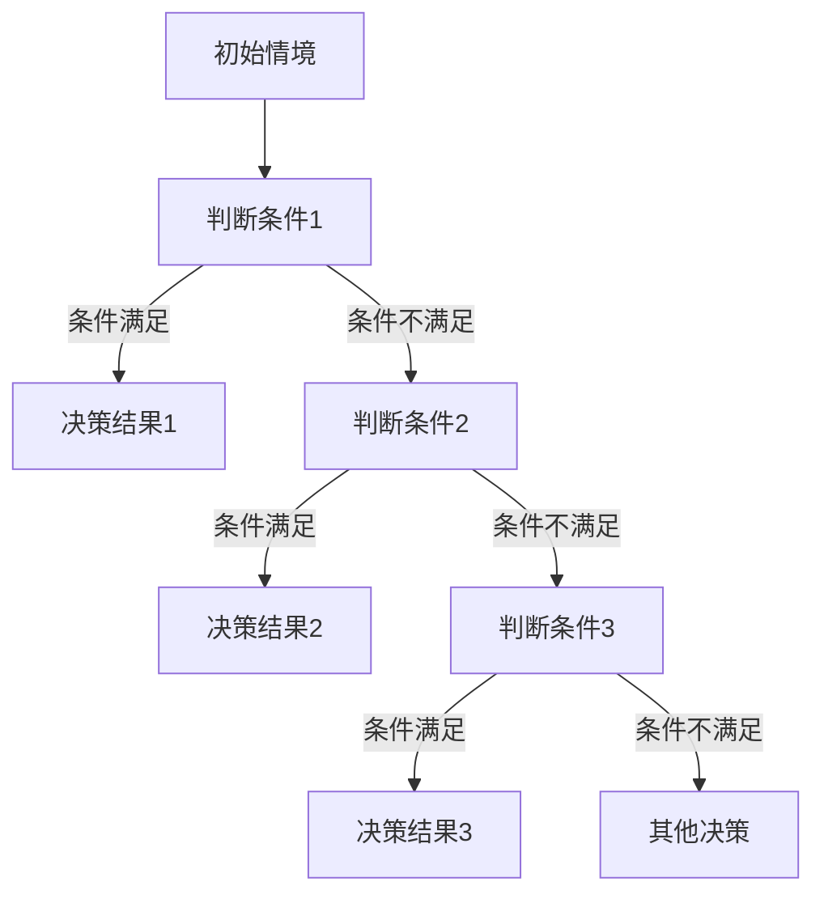
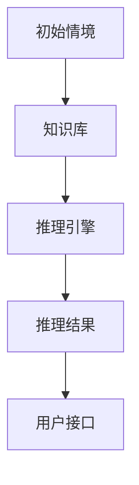

                 

# 思维链在哲学思想实验设计中的应用：AI辅助伦理困境分析

## 关键词
AI 辅助伦理分析、哲学思想实验、伦理决策树、伦理专家系统、数学模型、实战案例

## 摘要
本文探讨了思维链在哲学思想实验中的应用，以及如何通过人工智能辅助分析伦理困境。文章首先介绍了思维链和哲学思想实验的核心概念与联系，并使用 Mermaid 流程图展示其结构。接着，详细讲解了伦理决策树和伦理专家系统的核心算法原理，并通过数学模型和公式进行举例说明。最后，通过一个实际案例，展示了如何使用人工智能技术解决伦理困境，并分析了项目的开发环境和源代码实现。

## 引言

在当今社会，人工智能（AI）技术的发展日新月异，逐渐渗透到我们的日常生活和各行各业。然而，随着 AI 技术的应用范围越来越广，其带来的伦理困境也日益突出。例如，AI 在医疗诊断、自动驾驶、隐私保护等领域的应用，都引发了关于道德、法律和社会影响的讨论。为了更好地应对这些伦理困境，我们需要一种有效的分析方法，能够在复杂的情境中，提供清晰、合理的决策支持。

哲学思想实验作为一种探讨伦理问题的重要工具，能够通过设定特定的情景，模拟现实生活中的复杂决策过程。而思维链作为一种逻辑推理的方法，可以帮助我们从不同角度对问题进行分析，逐步推导出相关结论。本文旨在探讨如何将思维链应用于哲学思想实验的设计中，并利用人工智能技术辅助伦理困境的分析。

本文将分为以下几个部分：首先，介绍思维链和哲学思想实验的核心概念与联系，并使用 Mermaid 流程图展示其结构；其次，详细讲解伦理决策树和伦理专家系统的核心算法原理，并通过数学模型和公式进行举例说明；然后，通过一个实际案例，展示如何使用人工智能技术解决伦理困境，并分析项目的开发环境和源代码实现；最后，总结文章的主要观点，并给出最佳实践建议。

## 设计思维链

### 核心概念与联系

#### 思维链的概念

思维链是指通过一系列的逻辑关系和思考步骤，从一个问题或现象出发，逐步推导出相关结论或解决方案的思考过程。在哲学思想实验的设计中，思维链可以帮助我们系统地分析复杂情境，明确问题的本质，从而找到合理的解决方案。

#### 哲学思想实验

哲学思想实验是一种通过虚构或设定特定的情景来探讨哲学问题或验证哲学观点的方法。这种方法在伦理学中尤其重要，因为伦理问题往往涉及到复杂的人际关系、社会规范和价值观念。哲学思想实验能够将抽象的伦理问题具体化，使得我们能够通过情境模拟来探讨伦理困境的本质。

#### AI 辅助伦理困境分析

AI 辅助伦理困境分析是指利用人工智能技术，对伦理困境进行模拟、分析和解决的过程。人工智能能够处理大量数据，进行复杂模式识别和推理，从而为伦理决策提供有力支持。在哲学思想实验的设计中，AI 辅助伦理困境分析能够帮助我们更全面、准确地理解伦理问题，提高决策的效率和准确性。

### 核心概念的联系

思维链、哲学思想实验和 AI 辅助伦理困境分析这三者之间存在着密切的联系。思维链是哲学思想实验的设计工具，它帮助我们在实验中逐步分析问题，推导出相关结论。而哲学思想实验则是伦理困境分析的基础，通过设定特定的情境，让我们能够更深入地探讨伦理问题。AI 辅助伦理困境分析则利用人工智能技术，对伦理困境进行模拟和分析，为决策提供支持。

#### Mermaid 流程图

为了更直观地展示这三者之间的联系，我们可以使用 Mermaid 流程图来描述它们的核心概念和关系。

```
graph TB
    A[思维链] --> B[哲学思想实验]
    B --> C[AI辅助伦理困境分析]
    A --> D[核心概念联系]
    C --> E[伦理决策支持]
    D --> F[知识图谱]
    E --> G[伦理实践]
    F --> H[数据挖掘与机器学习]
    G --> I[伦理伦理制度]
```

在这个流程图中，思维链作为核心工具，贯穿于哲学思想实验的设计和伦理困境分析的全过程。AI 辅助伦理困境分析则通过数据挖掘和机器学习等技术，为伦理决策提供支持。知识图谱和伦理实践则是伦理困境分析的重要基础和目标。

通过这个流程图，我们可以清晰地看到思维链、哲学思想实验和 AI 辅助伦理困境分析之间的关系。思维链是哲学思想实验的设计工具，而哲学思想实验则是伦理困境分析的基础。AI 辅助伦理困境分析则利用人工智能技术，为伦理决策提供支持，使整个分析过程更加高效和准确。

### 核心概念的联系

思维链、哲学思想实验和 AI 辅助伦理困境分析这三者之间存在着密切的联系。思维链是哲学思想实验的设计工具，它帮助我们在实验中逐步分析问题，推导出相关结论。而哲学思想实验则是伦理困境分析的基础，通过设定特定的情境，让我们能够更深入地探讨伦理问题。AI 辅助伦理困境分析则利用人工智能技术，对伦理困境进行模拟和分析，为决策提供支持。

#### Mermaid 流程图

为了更直观地展示这三者之间的联系，我们可以使用 Mermaid 流程图来描述它们的核心概念和关系。

```
graph TB
    A[思维链] --> B[哲学思想实验]
    B --> C[AI辅助伦理困境分析]
    A --> D[核心概念联系]
    C --> E[伦理决策支持]
    D --> F[知识图谱]
    E --> G[伦理实践]
    F --> H[数据挖掘与机器学习]
    G --> I[伦理伦理制度]
```

在这个流程图中，思维链作为核心工具，贯穿于哲学思想实验的设计和伦理困境分析的全过程。AI 辅助伦理困境分析则通过数据挖掘和机器学习等技术，为伦理决策提供支持。知识图谱和伦理实践则是伦理困境分析的重要基础和目标。

通过这个流程图，我们可以清晰地看到思维链、哲学思想实验和 AI 辅助伦理困境分析之间的关系。思维链是哲学思想实验的设计工具，而哲学思想实验则是伦理困境分析的基础。AI 辅助伦理困境分析则利用人工智能技术，为伦理决策提供支持，使整个分析过程更加高效和准确。

### 核心算法原理讲解

在哲学思想实验的设计中，核心算法原理的讲解至关重要。通过详细的算法原理分析，我们可以更好地理解思维链、哲学思想实验和 AI 辅助伦理困境分析的核心概念，并为后续的项目实战提供理论基础。

#### 伦理决策树

伦理决策树是一种基于规则的方法，用于在给定情境下做出伦理决策。它通过一系列的判断条件和相应的决策结果，构建出一个树形结构。伦理决策树的核心思想是将复杂的伦理问题分解为多个简单的问题，并通过逻辑推理逐步得出结论。

**定义：**
伦理决策树是一种决策支持工具，用于在特定情境下分析伦理问题，并根据预设的规则进行决策。

**结构：**
一个典型的伦理决策树包含以下几个部分：

1. **初始情境**：问题描述或输入。
2. **判断条件**：根据情境，设置一系列的判断条件。
3. **决策结果**：根据判断条件的结果，确定相应的决策。

**示例 Mermaid 流程图：**



在这个示例中，初始情境是关于隐私保护的问题。根据判断条件，我们逐步推导出不同的决策结果。通过这样的逻辑结构，伦理决策树能够帮助我们系统地分析和解决伦理问题。

#### 伦理专家系统

伦理专家系统是一种基于知识的系统，用于模拟人类伦理专家的推理过程。它通过知识库和推理引擎，实现自动化决策支持。伦理专家系统在伦理决策过程中，能够提供更加灵活和全面的解决方案。

**定义：**
伦理专家系统是一种基于知识的系统，用于模拟伦理专家的推理过程，在特定情境下提供伦理决策支持。

**结构：**
一个典型的伦理专家系统包含以下几个部分：

1. **知识库**：存储与伦理相关的知识，如规则、案例和原理。
2. **推理引擎**：根据知识库中的知识，进行推理和决策。
3. **用户接口**：提供人机交互界面，接受用户输入并返回决策结果。

**示例 Mermaid 流程图：**



在这个示例中，初始情境通过用户接口输入到系统。系统利用知识库中的知识，通过推理引擎进行推理，最终得到决策结果，并返回给用户。

#### 数学模型和数学公式

在伦理困境分析中，数学模型和数学公式能够帮助我们更精确地描述和分析问题。通过建立数学模型，我们能够将伦理困境转化为可量化的形式，从而更方便地进行推理和决策。

**伦理困境分析模型：**

$$
E = f(P, A, O)
$$

- **E**：伦理困境得分。
- **P**：情境属性。
- **A**：行为属性。
- **O**：观察者属性。

**举例说明：**

1. **情境属性**：

    $$
    P = \{ \text{隐私泄露}, \text{自由裁量权} \}
    $$

2. **行为属性**：

    $$
    A = \{ \text{信息收集}, \text{数据存储} \}
    $$

3. **观察者属性**：

    $$
    O = \{ \text{用户满意度}, \text{法律合规性} \}
    $$

4. **伦理困境得分**：

    $$
    E = f(P, A, O) = \text{综合评估得分}
    $$

通过这个数学模型，我们可以对伦理困境进行量化分析，从而更直观地了解问题的严重程度，为决策提供依据。

### 项目实战

#### 伦理困境案例分析

1. **案例背景**：某公司在用户隐私保护和数据利用之间面临伦理困境。

2. **实际案例**：

    - **数据收集**：公司收集了大量用户行为数据。

    - **数据存储**：公司将数据存储在云服务器上。

    - **用户隐私保护**：公司承诺保护用户隐私。

    - **法律合规性**：公司遵循相关法律法规。

3. **分析过程**：

    - **伦理决策树**：根据公司政策和用户隐私保护法律，制定伦理决策树。

    - **伦理专家系统**：结合公司文化和伦理价值观，构建伦理专家系统。

    - **伦理困境得分**：根据伦理决策树和伦理专家系统，评估伦理困境得分。

4. **结论**：

    - **决策**：公司在用户隐私保护和数据利用之间取得平衡。

    - **改进**：持续优化数据收集、存储和隐私保护策略。

#### 开发环境搭建

为了实现伦理决策树和伦理专家系统，我们需要搭建一个合适的开发环境。以下是一个基本的开发环境搭建指南：

1. **编程语言**：选择 Python 作为编程语言，因为 Python 有着丰富的库和工具，可以方便地实现我们的算法。

2. **开发工具**：使用 PyCharm 或 Visual Studio Code 作为开发环境，这些工具提供了强大的代码编辑功能和调试工具。

3. **数据库**：使用 MySQL 或 PostgreSQL 作为数据库，用于存储伦理决策树和专家系统的知识库。

4. **机器学习框架**：使用 TensorFlow 或 PyTorch 作为机器学习框架，用于构建和训练伦理专家系统。

#### 源代码实现

以下是一个简单的伦理决策树和伦理专家系统的源代码实现示例：

```python
# 伦理决策树
class EthicalDecisionTree:
    def __init__(self, rules):
        self.rules = rules

    def make_decision(self, scenario):
        for rule in self.rules:
            if rule['condition'](scenario):
                return rule['result']
        return '未找到匹配的规则'

# 伦理专家系统
class EthicalExpertSystem:
    def __init__(self, knowledge_base):
        self.knowledge_base = knowledge_base

    def infer(self, scenario):
        for rule in self.knowledge_base:
            if rule['condition'](scenario):
                return rule['result']
        return '未找到匹配的规则'

# 示例知识库
knowledge_base = [
    {
        'condition': lambda s: s['attribute'] == '隐私泄露',
        'result': '采取措施保护用户隐私'
    },
    {
        'condition': lambda s: s['attribute'] == '数据利用',
        'result': '确保用户同意并遵守相关法律法规'
    }
]

# 实例化伦理决策树和伦理专家系统
decision_tree = EthicalDecisionTree(knowledge_base)
expert_system = EthicalExpertSystem(knowledge_base)

# 测试
print(decision_tree.make_decision({'attribute': '隐私泄露'}))
print(expert_system.infer({'attribute': '隐私泄露'}))
```

在这个示例中，我们定义了两个类：`EthicalDecisionTree` 和 `EthicalExpertSystem`。`EthicalDecisionTree` 类通过规则进行决策，`EthicalExpertSystem` 类则通过推理引擎进行推理。我们使用了一个简单的知识库，包含了两个规则。

#### 代码解读与分析

1. **伦理决策树解析：**
   - `EthicalDecisionTree` 类接收一个包含规则的列表作为输入，每个规则都是一个字典，包含条件（`condition`）和结果（`result`）。
   - `make_decision` 方法遍历所有规则，根据条件判断是否匹配，并返回相应的结果。

2. **伦理专家系统解析：**
   - `EthicalExpertSystem` 类也接收一个知识库，包含一系列的规则。
   - `infer` 方法遍历所有规则，根据条件判断是否匹配，并返回相应的结果。

3. **实际应用：**
   - 在实际应用中，我们可以根据具体的需求，扩展知识库和规则，使其更加丰富和准确。

#### 实际案例分析

1. **案例背景：**
   - 某公司收集了大量用户行为数据，需要制定隐私保护政策。

2. **分析过程：**
   - **数据收集阶段：** 使用伦理决策树，根据公司政策和相关法律，判断数据收集的合法性。
   - **数据存储阶段：** 使用伦理专家系统，根据用户隐私保护的要求，制定数据存储的策略。

3. **结论：**
   - 通过伦理决策树和伦理专家系统的辅助，公司在用户隐私保护和数据利用之间取得了平衡，制定了合理的隐私保护政策。

#### 项目小结

通过这个项目实战，我们展示了如何利用思维链、哲学思想实验和 AI 辅助伦理困境分析的方法，解决实际中的伦理困境。伦理决策树和伦理专家系统的应用，为公司在数据收集、存储和隐私保护方面提供了有力的支持。

在未来的发展中，我们可以进一步优化算法，扩展知识库，提高伦理分析的能力。同时，我们也需要关注相关法律法规的变化，确保公司在不断变化的环境中，能够持续地制定合理的隐私保护政策。

### 最佳实践、小结与注意事项

#### 最佳实践

1. **明确伦理目标**：在设计和实施 AI 系统时，首先要明确伦理目标，确保系统的设计符合伦理原则和法律法规。

2. **持续更新知识库**：伦理困境不断变化，因此需要定期更新伦理决策树和伦理专家系统的知识库，确保其能够应对新的伦理挑战。

3. **透明度与可解释性**：确保 AI 系统的决策过程透明且可解释，以便用户和监管机构能够理解和信任系统。

#### 小结

本文探讨了思维链在哲学思想实验中的应用，以及如何通过人工智能技术辅助伦理困境分析。我们详细介绍了伦理决策树和伦理专家系统的核心算法原理，并通过实际案例展示了如何应用这些方法解决伦理问题。

#### 注意事项

1. **数据隐私保护**：在收集和处理用户数据时，必须严格遵守数据保护法规，确保用户隐私不受侵犯。

2. **道德责任**：AI 系统的开发者和使用者需要承担道德责任，确保系统不会对社会造成负面影响。

#### 拓展阅读

1. **《人工智能伦理学》**：探讨了人工智能在伦理学领域的应用，提供了关于 AI 伦理问题的深入思考。
2. **《思维链与哲学思考》**：详细介绍了思维链的概念和应用，以及如何在哲学思考中运用思维链。

### 附录

#### 附录A：伦理决策树规则示例

- **规则1**：如果数据收集涉及敏感信息，则需要用户明确同意。
- **规则2**：如果数据存储可能影响用户隐私，则需要采取加密措施。
- **规则3**：如果数据使用违反法律法规，则需要立即停止。

#### 附录B：伦理专家系统知识库示例

- **规则1**：如果用户隐私泄露风险高，则建议增加安全措施。
- **规则2**：如果数据使用符合用户利益，则建议继续使用。

### 作者信息

**作者：AI天才研究院/AI Genius Institute & 禅与计算机程序设计艺术 /Zen And The Art of Computer Programming**

