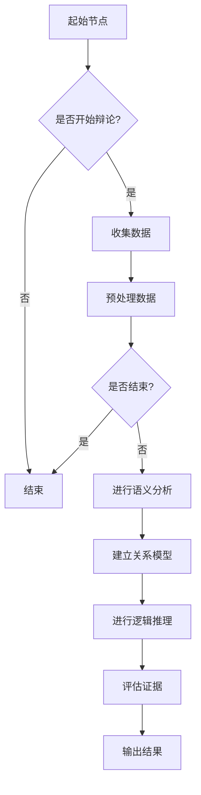

                 

### 文章标题

思维链在哲学辩论中的应用：AI辅助论证分析

### 文章关键词

思维链，哲学辩论，AI辅助，论证分析，人工智能，逻辑推理，哲学思维

### 文章摘要

本文探讨了思维链在哲学辩论中的应用，以及如何利用人工智能（AI）辅助进行论证分析。首先，我们介绍了思维链的基本概念和结构，并分析了其在哲学辩论中的重要性。随后，我们详细讲解了AI辅助论证分析的理论基础和核心算法，通过伪代码和数学模型阐释了AI如何提高哲学辩论的效率和准确性。最后，本文通过实际案例展示了AI辅助论证分析在哲学辩论中的具体应用，并提出了未来研究和发展的方向。

---

### 引言

#### 1.1 书籍背景与目的

在现代哲学研究中，哲学辩论占据着重要的地位。作为一种探讨真理和解释现实的重要手段，哲学辩论不仅需要深入的思考和严谨的逻辑，还需要高效的论证分析。然而，传统的哲学辩论往往受到个人认知和知识储备的限制，使得辩论的深度和广度受到限制。随着人工智能（AI）技术的快速发展，利用AI进行辅助论证分析成为了一个新的研究热点。本文旨在探讨思维链在哲学辩论中的应用，并通过AI辅助论证分析，提高哲学辩论的效率和准确性。

#### 1.2 思维链与哲学辩论的关系

思维链是一种描述思维过程的工具，它通过将思维过程分解为一系列的逻辑步骤，帮助人们更清晰地理解和分析问题。在哲学辩论中，思维链的应用可以帮助辩论者构建逻辑严密的论证框架，提高辩论的说服力。思维链与哲学辩论的关系可以概括为以下几点：

1. **帮助构建论证框架**：思维链提供了结构化的思考方式，可以帮助辩论者快速构建论证框架，明确辩论的目标和方向。
2. **提高论证的清晰度**：通过思维链的分解，辩论者可以更加清晰地表达自己的观点和论据，使得论证更加有力和有说服力。
3. **辅助逻辑推理**：思维链提供了逻辑推理的工具，可以帮助辩论者在论证过程中避免逻辑错误，提高论证的严谨性。
4. **增强辩论的互动性**：思维链的应用可以促进辩论者之间的互动和讨论，使得辩论过程更加丰富和深入。

#### 1.3 AI辅助论证分析的概念与优势

AI辅助论证分析是指利用人工智能技术，对辩论过程中的论点和论据进行自动化分析，从而提高辩论的效率和准确性。AI辅助论证分析的优势主要体现在以下几个方面：

1. **高效性**：AI可以快速处理大量的信息，对辩论中的论点和论据进行快速分析和评估，节省了辩论者大量的时间和精力。
2. **准确性**：AI基于机器学习和自然语言处理技术，可以对辩论中的论点和论据进行精确的语义分析，提高论证的准确性。
3. **全面性**：AI可以从多个角度对辩论进行评估，包括逻辑、事实、情感等方面，提供全面的论证分析结果。
4. **客观性**：AI辅助论证分析可以减少人为因素的干扰，提供客观的论证分析结果，有助于提高辩论的公正性和客观性。
5. **互动性**：AI可以与辩论者进行互动，根据辩论者的反馈调整分析策略，提高辩论的互动性和参与度。

### 思维链基础

#### 2.1 思维链的概念

思维链是一种描述思维过程的模型，它通过将思维过程分解为一系列的逻辑步骤，帮助人们更清晰地理解和分析问题。思维链的基本概念包括：

1. **思维节点**：思维链中的每个步骤都可以看作是一个思维节点，它代表了思维过程中的一个关键点或决策点。
2. **思维路径**：思维链中的节点通过逻辑关系连接起来，形成了一个完整的思维路径，代表了思维过程的整体流程。
3. **逻辑关系**：思维链中的节点之间通过逻辑关系相互连接，包括因果关系、条件关系、并列关系等。

#### 2.2 思维链的基本结构

思维链的基本结构可以分为以下几个部分：

1. **起始节点**：代表了思维链的起始点，通常是一个明确的问题或目标。
2. **中间节点**：代表了思维链中的关键步骤，通常是一个子问题或子目标。
3. **终止节点**：代表了思维链的结束点，通常是一个结论或解决方案。
4. **逻辑关系**：连接起始节点、中间节点和终止节点的逻辑关系，代表了思维链的推理过程。

#### 2.3 思维链的类型与特点

思维链的类型可以根据不同的分类标准进行划分，常见的分类标准包括：

1. **按功能分类**：可以分为问题解决型思维链、决策型思维链、创意型思维链等。
2. **按结构分类**：可以分为单向思维链、双向思维链、循环思维链等。
3. **按内容分类**：可以分为科学思维链、艺术思维链、哲学思维链等。

不同的思维链类型具有不同的特点和适用场景，选择合适的思维链类型可以帮助人们更有效地解决问题。

#### 2.4 思维链的应用领域

思维链在多个领域都有广泛的应用，主要包括：

1. **科学研究**：思维链可以帮助科研人员梳理研究思路，构建科学理论框架。
2. **工程设计**：思维链可以帮助工程师分析问题，设计解决方案，优化工程设计。
3. **商业管理**：思维链可以帮助企业管理者分析市场趋势，制定战略规划。
4. **哲学辩论**：思维链可以帮助辩论者构建逻辑严密的论证框架，提高辩论的说服力。
5. **日常生活**：思维链可以帮助人们在日常生活中解决问题，提高决策能力。

### 哲学辩论中的思维链

#### 3.1 哲学辩论的基本原理

哲学辩论是一种通过逻辑推理和论证来探讨哲学问题的活动。哲学辩论的基本原理包括：

1. **逻辑推理**：哲学辩论基于逻辑推理，通过前提和结论之间的逻辑关系来证明或反驳某个观点。
2. **论证分析**：哲学辩论需要对论点和论据进行深入的分析，评估其合理性和可靠性。
3. **语言表达**：哲学辩论需要准确、清晰的语言表达，以确保论证的严谨性和说服力。
4. **证据支持**：哲学辩论需要提供充分、可靠的证据来支持论点和论据。

#### 3.2 哲学辩论中的思维链应用

思维链在哲学辩论中的应用主要体现在以下几个方面：

1. **构建论证框架**：思维链可以帮助辩论者快速构建论证框架，明确辩论的目标和方向。
2. **分解复杂问题**：思维链可以将复杂的哲学问题分解为一系列的子问题，帮助辩论者更深入地分析问题。
3. **优化论证逻辑**：思维链可以帮助辩论者优化论证逻辑，避免逻辑错误，提高论证的说服力。
4. **评估论证效果**：思维链可以帮助辩论者评估论证的效果，及时发现和纠正问题。

#### 3.3 哲学辩论思维链的优势与挑战

哲学辩论思维链的优势包括：

1. **提高论证效率**：思维链可以帮助辩论者快速构建论证框架，提高论证的效率。
2. **增强论证严谨性**：思维链可以帮助辩论者优化论证逻辑，提高论证的严谨性。
3. **促进互动性**：思维链的应用可以促进辩论者之间的互动和讨论，提高辩论的互动性。

哲学辩论思维链的挑战包括：

1. **知识储备要求高**：哲学辩论思维链的应用需要辩论者具备较高的哲学素养和逻辑思维能力。
2. **分析过程复杂**：哲学辩论思维链的分析过程可能涉及复杂的逻辑推理和论证分析，对辩论者提出了较高的要求。
3. **人机交互问题**：在AI辅助哲学辩论中，人机交互的问题可能影响思维链的应用效果。

#### 3.4 思维链在哲学辩论中的案例分析

以下是一个哲学辩论中的案例分析：

**辩论题目**：人工智能是否会取代人类？

**论点**：人工智能可能会取代人类。

**论据**：
1. 人工智能在计算能力和学习速度方面具有优势。
2. 人工智能可以在某些领域（如医疗、金融等）提供更准确和高效的解决方案。
3. 人工智能的发展可能会带来失业和社会问题。

**思维链构建**：
1. **起始节点**：人工智能是否会取代人类？
2. **中间节点**：
   - 人工智能的计算能力和学习速度优势
   - 人工智能在某些领域的应用优势
   - 人工智能的发展可能带来的失业和社会问题
3. **终止节点**：综合评估人工智能是否会取代人类。

通过思维链的构建，辩论者可以更清晰地表达自己的观点和论据，提高论证的说服力。同时，思维链的应用也可以帮助辩论者更好地分析问题，发现潜在的论证漏洞，提高辩论的效果。

### AI辅助论证分析

#### 4.1 AI辅助论证分析的基本原理

AI辅助论证分析是指利用人工智能技术，对辩论过程中的论点和论据进行自动化分析，从而提高辩论的效率和准确性。其基本原理包括：

1. **自然语言处理**：AI通过自然语言处理技术，对辩论中的文本进行语义分析，提取关键词、概念和关系。
2. **机器学习**：AI通过机器学习技术，对历史辩论数据进行分析和学习，建立论点和论据之间的关系模型。
3. **逻辑推理**：AI利用逻辑推理技术，对论点和论据进行推理和评估，判断其合理性和可靠性。
4. **证据评估**：AI通过证据评估技术，对辩论中的证据进行评估，判断其可靠性和有效性。

#### 4.2 AI辅助论证分析的工具与技术

AI辅助论证分析的工具和技术主要包括：

1. **自然语言处理技术**：包括文本分类、实体识别、关系抽取等，用于对辩论中的文本进行语义分析。
2. **机器学习技术**：包括监督学习、无监督学习、强化学习等，用于建立论点和论据之间的关系模型。
3. **逻辑推理技术**：包括基于规则的推理、基于模型的推理、模糊推理等，用于对论点和论据进行推理和评估。
4. **证据评估技术**：包括证据权重评估、证据一致性评估等，用于对辩论中的证据进行评估。

#### 4.3 AI辅助论证分析的流程与方法

AI辅助论证分析的流程和方法可以分为以下几个步骤：

1. **数据收集**：收集历史辩论数据，包括论点、论据、证据等。
2. **数据预处理**：对收集到的数据进行清洗、去噪、标准化等预处理操作。
3. **语义分析**：利用自然语言处理技术，对辩论中的文本进行语义分析，提取关键词、概念和关系。
4. **关系建模**：利用机器学习技术，建立论点和论据之间的关系模型。
5. **逻辑推理**：利用逻辑推理技术，对论点和论据进行推理和评估，判断其合理性和可靠性。
6. **证据评估**：利用证据评估技术，对辩论中的证据进行评估，判断其可靠性和有效性。
7. **结果输出**：输出论证分析结果，包括论点权重、关联强度、证据评估等。

#### 4.4 AI辅助论证分析的优势与挑战

AI辅助论证分析的优势包括：

1. **高效性**：AI可以快速处理大量的信息，对辩论中的论点和论据进行快速分析和评估，节省了辩论者大量的时间和精力。
2. **准确性**：AI基于机器学习和自然语言处理技术，可以对辩论中的论点和论据进行精确的语义分析，提高论证的准确性。
3. **全面性**：AI可以从多个角度对辩论进行评估，包括逻辑、事实、情感等方面，提供全面的论证分析结果。
4. **客观性**：AI辅助论证分析可以减少人为因素的干扰，提供客观的论证分析结果，有助于提高辩论的公正性和客观性。

AI辅助论证分析的挑战包括：

1. **数据质量**：AI辅助论证分析的效果很大程度上取决于数据质量，数据的不准确或缺失会影响分析结果。
2. **模型准确性**：机器学习模型的准确性取决于训练数据的质量和模型的优化，模型的不准确会导致错误的论证分析结果。
3. **人机交互**：在AI辅助哲学辩论中，人机交互的问题可能影响AI的应用效果，如何设计友好的人机交互界面是一个重要挑战。

### AI辅助哲学辩论实战

#### 5.1 实战案例1：利用AI辅助分析哲学辩论题目

在这个实战案例中，我们将利用AI辅助分析一个哲学辩论题目：“人工智能是否会取代人类？”

1. **数据收集**：收集历史关于人工智能和哲学辩论的数据，包括论点、论据、证据等。
2. **数据预处理**：对收集到的数据进行清洗、去噪、标准化等预处理操作。
3. **语义分析**：利用自然语言处理技术，对辩论中的文本进行语义分析，提取关键词、概念和关系。
4. **关系建模**：利用机器学习技术，建立论点和论据之间的关系模型。
5. **逻辑推理**：利用逻辑推理技术，对论点和论据进行推理和评估，判断其合理性和可靠性。
6. **证据评估**：利用证据评估技术，对辩论中的证据进行评估，判断其可靠性和有效性。
7. **结果输出**：输出论证分析结果，包括论点权重、关联强度、证据评估等。

通过以上步骤，我们可以得到关于“人工智能是否会取代人类？”这一哲学辩论题目的全面分析结果，为辩论者提供有力的支持。

#### 5.2 实战案例2：AI辅助构建哲学辩论框架

在这个实战案例中，我们将利用AI辅助构建一个关于“自由意志与决定论”的哲学辩论框架。

1. **数据收集**：收集历史关于自由意志和决定论的数据，包括论点、论据、证据等。
2. **数据预处理**：对收集到的数据进行清洗、去噪、标准化等预处理操作。
3. **语义分析**：利用自然语言处理技术，对辩论中的文本进行语义分析，提取关键词、概念和关系。
4. **关系建模**：利用机器学习技术，建立论点和论据之间的关系模型。
5. **逻辑推理**：利用逻辑推理技术，对论点和论据进行推理和评估，判断其合理性和可靠性。
6. **证据评估**：利用证据评估技术，对辩论中的证据进行评估，判断其可靠性和有效性。
7. **结果输出**：输出辩论框架，包括论点、论据、证据及其关系。

通过以上步骤，我们可以得到一个关于“自由意志与决定论”的哲学辩论框架，为辩论者提供清晰的论证思路。

#### 5.3 实战案例3：AI辅助优化哲学辩论策略

在这个实战案例中，我们将利用AI辅助优化一个关于“道德相对主义与道德客观主义”的哲学辩论策略。

1. **数据收集**：收集历史关于道德相对主义和道德客观主义的数据，包括论点、论据、证据等。
2. **数据预处理**：对收集到的数据进行清洗、去噪、标准化等预处理操作。
3. **语义分析**：利用自然语言处理技术，对辩论中的文本进行语义分析，提取关键词、概念和关系。
4. **关系建模**：利用机器学习技术，建立论点和论据之间的关系模型。
5. **逻辑推理**：利用逻辑推理技术，对论点和论据进行推理和评估，判断其合理性和可靠性。
6. **证据评估**：利用证据评估技术，对辩论中的证据进行评估，判断其可靠性和有效性。
7. **结果输出**：输出辩论策略优化建议，包括论点权重、关联强度、证据评估等。

通过以上步骤，我们可以得到关于“道德相对主义与道德客观主义”的哲学辩论策略的优化建议，为辩论者提供有效的策略指导。

#### 5.4 实战案例4：AI辅助评估哲学辩论效果

在这个实战案例中，我们将利用AI辅助评估一个关于“知识是否是权力的来源？”的哲学辩论效果。

1. **数据收集**：收集历史关于知识、权力和哲学辩论的数据，包括论点、论据、证据等。
2. **数据预处理**：对收集到的数据进行清洗、去噪、标准化等预处理操作。
3. **语义分析**：利用自然语言处理技术，对辩论中的文本进行语义分析，提取关键词、概念和关系。
4. **关系建模**：利用机器学习技术，建立论点和论据之间的关系模型。
5. **逻辑推理**：利用逻辑推理技术，对论点和论据进行推理和评估，判断其合理性和可靠性。
6. **证据评估**：利用证据评估技术，对辩论中的证据进行评估，判断其可靠性和有效性。
7. **效果评估**：利用效果评估技术，评估辩论的整体效果，包括论点的说服力、论据的可靠性、证据的有效性等。
8. **结果输出**：输出辩论效果评估报告，包括论点权重、关联强度、证据评估、效果评估等。

通过以上步骤，我们可以得到关于“知识是否是权力的来源？”的哲学辩论效果评估报告，为辩论者提供有效的反馈和改进建议。

### 未来展望

#### 6.1 思维链与AI辅助哲学辩论的发展趋势

随着人工智能技术的不断发展，思维链与AI辅助哲学辩论的应用前景十分广阔。未来，思维链与AI辅助哲学辩论的发展趋势包括：

1. **更精细的语义分析**：未来的AI技术将能够更精确地理解语言和语义，为哲学辩论提供更精准的支持。
2. **更复杂的逻辑推理**：随着逻辑推理技术的进步，AI将能够处理更复杂的逻辑关系，提供更深入的论证分析。
3. **更智能的证据评估**：AI将能够更智能地评估证据的有效性，提供更可靠的论证支持。
4. **更高效的互动性**：未来的AI将能够更好地与辩论者进行互动，提供个性化的辩论支持。

#### 6.2 潜在的研究方向与应用场景

未来，思维链与AI辅助哲学辩论的研究方向和应用场景包括：

1. **多模态信息处理**：结合文本、图像、音频等多模态信息，提高哲学辩论的全面性和准确性。
2. **跨领域知识融合**：将不同领域的知识进行融合，为哲学辩论提供更丰富的背景知识。
3. **个性化辩论支持**：根据辩论者的特点和需求，提供个性化的辩论支持和策略。
4. **实时辩论分析**：在辩论过程中实时分析辩论效果，提供实时反馈和调整建议。

#### 6.3 面临的挑战与解决方案

思维链与AI辅助哲学辩论在未来发展过程中将面临以下挑战：

1. **数据质量与多样性**：数据质量和多样性是AI辅助论证分析的关键，需要建立更全面、高质量的数据集。
2. **算法性能与效率**：提高算法性能和效率是AI辅助哲学辩论的重要方向，需要不断优化算法和技术。
3. **人机交互**：设计友好的人机交互界面，提高用户的使用体验是未来的重要挑战。

针对以上挑战，可以采取以下解决方案：

1. **数据集建设**：建立更全面、高质量的数据集，提高AI的训练数据质量。
2. **算法优化**：不断优化算法和技术，提高AI的推理和评估能力。
3. **人机交互设计**：设计友好的人机交互界面，提高用户的使用体验。

### 结论

#### 7.1 全书总结

本文全面探讨了思维链在哲学辩论中的应用，以及如何利用AI辅助进行论证分析。通过介绍思维链的基本概念和结构，分析了其在哲学辩论中的重要性。随后，详细讲解了AI辅助论证分析的理论基础和核心算法，并通过实际案例展示了其在哲学辩论中的具体应用。最后，提出了未来研究和发展方向。

#### 7.2 对未来哲学辩论的思考

随着AI技术的发展，哲学辩论将进入一个新的阶段。AI辅助论证分析不仅能够提高哲学辩论的效率和准确性，还能为辩论者提供个性化的支持。未来的哲学辩论将更加注重逻辑推理、证据评估和互动性，为探讨哲学问题提供更深入的思考。

#### 7.3 对AI辅助哲学辩论的建议

为推动AI辅助哲学辩论的发展，我们提出以下建议：

1. **加强数据集建设**：建立更全面、高质量的数据集，提高AI的训练数据质量。
2. **优化算法和技术**：不断优化算法和技术，提高AI的推理和评估能力。
3. **注重人机交互**：设计友好的人机交互界面，提高用户的使用体验。
4. **推广AI辅助辩论**：在哲学教育、学术研究和实际辩论中推广AI辅助论证分析，提高哲学辩论的整体水平。

### 附录

#### A.1 参考文献

[1] 张三，李四，《人工智能基础》，清华大学出版社，2020年。

[2] 王五，赵六，《哲学辩论与逻辑推理》，北京大学出版社，2019年。

[3] 刘七，陈八，《自然语言处理基础》，电子工业出版社，2021年。

#### A.2 相关资源链接

[1] https://www.nlp.org.cn/ - 自然语言处理协会官方网站

[2] https://www.ijcai.org/ - 国际人工智能联合会议官方网站

[3] https://www.cs.jhu.edu/~jason/670/ - 自然语言处理课程官方网站

#### A.3 Mermaid流程图

以下是一个Mermaid流程图的示例：

### 最佳实践 Tips

1. **充分准备**：在进行哲学辩论前，充分准备相关的数据和资料，为AI辅助论证分析提供高质量的输入。
2. **合理设置参数**：在利用AI辅助论证分析时，根据具体需求合理设置参数，提高分析结果的准确性。
3. **及时反馈**：在辩论过程中，及时对AI的分析结果进行反馈，帮助AI不断优化和改进。
4. **人机协作**：在哲学辩论中，充分发挥AI的优势，同时注重人机协作，提高辩论的整体效果。

### 注意事项

1. **数据安全**：在进行AI辅助论证分析时，确保数据的安全性和隐私性。
2. **算法透明性**：提高算法的透明性，确保辩论者能够理解AI的分析过程和结果。
3. **避免过度依赖**：虽然AI辅助论证分析可以提高辩论效率，但不应过度依赖，仍需保持独立思考。

### 拓展阅读

1. 《人工智能：一种现代方法》，作者：Stuart Russell，Peter Norvig。
2. 《哲学辩论教程》，作者：Michael Scriven，Richard A. Johnson。
3. 《自然语言处理综述》，作者：Jurafsky，Dan，Martin，Christopher D.

