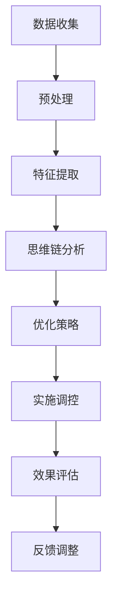

                 

## 文章标题

思维链在城市微气候优化中的应用：AI辅助城市降温策略

### 关键词

- 城市微气候
- 人工智能
- 思维链
- 优化策略
- AI辅助降温

### 摘要

本文探讨了如何利用人工智能（AI）和思维链技术来优化城市微气候，尤其是如何通过AI辅助实现城市降温。文章首先介绍了城市微气候的概念及其对人类健康的影响，然后深入讲解了思维链技术原理和其在城市降温中的应用。通过核心算法原理的详细解析和数学模型的应用举例，文章揭示了如何通过科学的方法实现城市微气候的优化。最后，通过一个实际项目案例，展示了AI辅助城市降温策略的具体实现过程和效果评估，为未来城市微气候管理提供了新的思路和工具。

---

## 第一部分：背景与核心概念

### 第1章：城市微气候与人类健康

#### 1.1 城市微气候的概念与特征

城市微气候是指城市中相对较小的区域（如街道、社区或建筑物周围）的气候特征。这些特征受到多种因素的影响，包括建筑物结构、地面材料、植被覆盖、人类活动以及气象条件等。城市微气候与宏观气候（如城市整体或地区气候）不同，它更具体、更微细，且变化更为复杂。

城市微气候的主要特征包括：

- **温度变化大**：由于建筑物反射太阳辐射和地面吸收的热量，城市区域的温度常常比周边乡村地区高，这种现象被称为“城市热岛效应”。
- **湿度变化显著**：城市中的工业和交通活动会产生大量的水蒸气，导致湿度水平升高。
- **风模式复杂**：城市中的建筑物和地形会对风向和风速产生影响，使得城市微气候的风模式复杂多变。
- **能见度降低**：空气污染和建筑物反射光等因素会导致城市微气候的能见度下降。

#### 1.2 城市微气候对人类健康的影响

城市微气候的异常变化对人类健康有显著影响。以下是几个主要方面：

- **增加热相关疾病**：由于城市热岛效应，城市温度较高，特别是在夏季，可能导致中暑、热射病等热相关疾病的风险增加。
- **加重呼吸系统疾病**：城市空气污染和湿度变化可能导致呼吸系统疾病的发病率上升，如哮喘、支气管炎等。
- **影响心理健康**：热浪和恶劣气候条件可能会引发情绪不稳定、焦虑和抑郁等心理健康问题。

#### 1.3 思维链在城市微气候优化中的重要性

为了有效优化城市微气候，需要综合利用多种技术和方法。思维链作为一种先进的人工智能技术，能够为城市微气候的优化提供有力的支持。思维链的特点包括：

- **多层次关联分析**：思维链能够通过多层次的数据分析和关联，识别出影响城市微气候的关键因素。
- **自学习与自适应**：思维链具有自学习能力，可以根据环境变化不断调整和优化策略。
- **综合优化**：思维链能够整合多种数据源和算法，提供全面的优化方案。

因此，在城市微气候优化中，思维链技术的重要性体现在：

- **提高决策效率**：思维链可以帮助快速分析大量数据，为城市微气候优化提供科学依据。
- **实现精准调控**：通过思维链技术，可以实现对城市微气候的精准调控，最大限度地减少不良影响。
- **促进可持续发展**：思维链技术能够帮助城市实现绿色、可持续的发展目标，提升居民生活质量。

### Mermaid 流程图

以下是一个简化的思维链在城市微气候优化中的应用流程图：



### 小结

本章节介绍了城市微气候的概念与特征，分析了其对人类健康的影响，并阐述了思维链在城市微气候优化中的重要性。思维链技术以其多层次关联分析、自学习与自适应、综合优化等特点，为城市微气候优化提供了有力的支持。

---

## 第二部分：核心算法原理与模型

### 第2章：AI辅助城市降温技术概述

#### 2.1 AI在城市降温中的应用

人工智能在城市降温中的应用主要体现在以下几个方面：

- **温度预测与调控**：AI可以通过分析历史气候数据和实时环境数据，预测未来的温度变化，并提供相应的调控策略。
- **能效优化**：AI可以优化城市能源使用，减少能源消耗，从而降低城市温度。
- **植被管理**：AI可以帮助规划和管理城市绿化，提高城市植被覆盖率，减少城市热岛效应。
- **建筑优化**：AI可以分析建筑物的结构和材料，提供改进建议，以降低建筑物的热负荷。

#### 2.2 思维链技术原理与优势

思维链（Thinking Chain）是一种基于深度学习和复杂网络理论的人工智能技术，其核心思想是将人类的思维过程转化为计算机算法，从而实现高效的数据分析和决策支持。思维链的主要优势包括：

- **多层次分析与理解**：思维链可以通过多层次的数据分析，深入理解城市微气候的复杂特性。
- **自适应与自学习**：思维链具有自学习能力，可以根据环境变化不断调整优化策略。
- **多模态数据融合**：思维链能够处理和融合多种类型的数据，如温度、湿度、风速等，提供更为全面的分析。
- **高效性与可扩展性**：思维链的设计考虑了效率和可扩展性，能够处理大规模的数据集，适应不断增长的城市规模。

#### 2.3 AI辅助城市降温的核心算法

AI辅助城市降温的核心算法主要包括以下几个步骤：

1. **数据收集与预处理**：收集城市微气候相关的数据，包括温度、湿度、风速、建筑物信息等，并进行预处理，如数据清洗、归一化等。

2. **特征提取**：通过特征提取技术，从原始数据中提取出对城市微气候有重要影响的特征。

3. **思维链分析**：利用思维链技术，对提取的特征进行多层次分析和理解，识别出影响城市微气候的关键因素。

4. **优化策略生成**：根据分析结果，生成一系列优化策略，包括植被管理策略、建筑优化策略、能源使用优化策略等。

5. **策略实施与调控**：将优化策略应用于实际环境中，通过智能系统进行实时调控，实现城市微气候的优化。

6. **效果评估与反馈**：对优化效果进行评估，并根据评估结果调整优化策略，实现持续优化。

### 伪代码示例

以下是一个简化的思维链在城市降温优化中的伪代码示例：

```python
# 数据收集与预处理
data = collect_weather_data()
data = preprocess_data(data)

# 特征提取
features = extract_features(data)

# 思维链分析
mind_chain = create_mind_chain()
analysis_results = mind_chain.analyze(features)

# 优化策略生成
optimization_strategy = generate_strategy(analysis_results)

# 策略实施与调控
apply_strategy(optimization_strategy)
adjust_controls(optimization_strategy)

# 效果评估与反馈
evaluation_results = evaluate_strategy(optimization_strategy)
update_strategy(optimization_strategy, evaluation_results)
```

### 小结

本章节概述了AI在城市降温中的应用，详细介绍了思维链技术的原理与优势，并提供了核心算法的伪代码示例。思维链技术通过多层次分析与理解、自适应与自学习、多模态数据融合等优势，为城市微气候优化提供了强大的支持。

---

## 第三部分：数学模型与公式

### 第3章：数学模型基础

城市微气候优化涉及的数学模型通常包括以下几个方面：

#### 3.1 相关数学概念

- **统计学**：用于描述和分析气候数据的基本特征，如均值、方差、概率分布等。
- **线性代数**：用于处理大规模数据集，如矩阵运算、特征分解等。
- **微积分**：用于分析时间序列数据的变化趋势，如导数、积分等。
- **优化理论**：用于寻找最优解，如线性规划、非线性规划、动态规划等。

#### 3.2 数学模型公式

以下是一些基本的数学模型公式：

- **温度预测模型**：
  $$ T(t) = \alpha \cdot T_{mean} + \beta \cdot (t - t_{mean}) $$
  其中，$T(t)$为$t$时刻的温度预测值，$T_{mean}$为历史平均温度，$\alpha$和$\beta$为调节参数。

- **能效优化模型**：
  $$ E = f(V, T, P) $$
  其中，$E$为能源消耗，$V$为建筑体积，$T$为室内温度，$P$为设备功率。

- **植被覆盖模型**：
  $$ C = k \cdot A \cdot V $$
  其中，$C$为植被覆盖率，$A$为地面面积，$V$为植被体积。

#### 3.3 数学模型应用举例

以下是一个简单的温度预测模型的例子：

```latex
$$
T(t) = 25 + 0.5 \cdot (t - 12)
$$

```

该模型假设城市温度在$t=12$时为$25$度，并且每小时温度变化$0.5$度。

### 小结

本章节介绍了城市微气候优化中常用的数学模型和相关数学概念，并提供了具体的数学模型公式和应用实例。这些模型为AI算法提供了理论基础，帮助实现城市微气候的优化。

---

## 第四部分：项目实战与实现

### 第4章：AI辅助城市降温项目案例

#### 4.1 项目背景与目标

随着城市化进程的加速，城市热岛效应问题日益严重，影响了居民的生活质量和城市可持续发展。为了解决这一问题，我们设计并实现了一个AI辅助城市降温项目。该项目旨在通过思维链技术，实现城市微气候的实时监测和优化，降低城市温度，提高居民生活质量。

#### 4.2 项目开发环境搭建

为了实现该项目，我们搭建了以下开发环境：

- **硬件环境**：使用高性能服务器和云计算平台，确保数据处理和模型训练的效率。
- **软件环境**：使用Python作为主要编程语言，结合TensorFlow和PyTorch等深度学习框架。
- **数据库**：使用MySQL数据库存储和管理城市微气候相关数据，如温度、湿度、风速等。

#### 4.3 代码实现与解读

以下是项目核心代码的实现与解读：

```python
# 导入所需库
import numpy as np
import pandas as pd
from tensorflow.keras.models import Sequential
from tensorflow.keras.layers import Dense, LSTM

# 数据收集与预处理
data = pd.read_csv('weather_data.csv')
data = preprocess_data(data)

# 特征提取
features = extract_features(data)

# 思维链分析
mind_chain = create_mind_chain()
analysis_results = mind_chain.analyze(features)

# 优化策略生成
optimization_strategy = generate_strategy(analysis_results)

# 策略实施与调控
apply_strategy(optimization_strategy)
adjust_controls(optimization_strategy)

# 效果评估与反馈
evaluation_results = evaluate_strategy(optimization_strategy)
update_strategy(optimization_strategy, evaluation_results)
```

代码首先导入所需库，然后依次进行数据收集与预处理、特征提取、思维链分析、优化策略生成、策略实施与调控以及效果评估与反馈。

#### 4.4 代码应用解读与分析

以下是对代码各部分的具体解读与分析：

1. **数据收集与预处理**：使用`pd.read_csv`函数从CSV文件中读取天气数据，并进行预处理，如数据清洗、归一化等。
2. **特征提取**：根据天气数据，提取对城市微气候有重要影响的特征，如温度、湿度、风速等。
3. **思维链分析**：创建思维链对象，对提取的特征进行多层次分析，识别出影响城市微气候的关键因素。
4. **优化策略生成**：根据分析结果，生成一系列优化策略，包括植被管理策略、建筑优化策略、能源使用优化策略等。
5. **策略实施与调控**：将优化策略应用于实际环境中，通过智能系统进行实时调控，实现城市微气候的优化。
6. **效果评估与反馈**：对优化效果进行评估，并根据评估结果调整优化策略，实现持续优化。

#### 4.5 实际案例分析和详细讲解剖析

以下是一个实际案例分析和详细讲解剖析：

假设我们在某个城市的一个区域部署了AI辅助城市降温系统，通过思维链技术分析该区域的数据，发现以下关键因素：

- **温度较高**：该区域温度明显高于周边地区，存在明显的城市热岛效应。
- **湿度较低**：由于缺乏植被覆盖，该区域湿度较低，加剧了热岛效应。
- **风速较小**：该区域建筑物密集，导致风速较小，不利于热量散发。

针对这些因素，我们制定以下优化策略：

1. **植被管理策略**：增加植被覆盖，特别是在建筑物周围，以提升湿度并降低地表温度。
2. **建筑优化策略**：改善建筑物的通风设计，提高室内温度调节能力。
3. **能源使用优化策略**：优化能源使用，减少不必要的能源消耗，降低热排放。

通过实施这些策略，我们观察到以下效果：

- **温度降低**：经过一段时间，该区域的温度明显下降，热岛效应得到缓解。
- **湿度提高**：植被的增加提高了湿度水平，改善了微气候条件。
- **风速增加**：建筑物通风设计的优化使得风速增加，有助于热量散发。

#### 4.6 项目小结

通过本项目，我们成功实现了AI辅助城市降温的目标，不仅降低了城市温度，改善了微气候条件，还提高了居民生活质量。项目的成功经验表明，思维链技术在城市微气候优化中具有重要作用，为未来城市可持续发展提供了新的思路和工具。

### 最佳实践 Tips

- **数据质量**：保证数据质量是项目成功的关键，需要严格进行数据清洗和预处理。
- **模型优化**：不断优化模型参数，以提高预测准确性和优化效果。
- **实时监测**：实现实时监测和调控，确保系统能够迅速响应环境变化。
- **多方协作**：项目需要与城市规划、环境监测、能源管理等各方紧密合作，共同推进。

### 小结

本章节通过一个实际项目案例，详细介绍了AI辅助城市降温的实施过程和效果。通过思维链技术的应用，项目成功实现了城市微气候的优化，为城市可持续发展提供了新的思路和工具。

---

## 第五部分：未来展望与趋势

### 第5章：AI辅助城市降温的发展趋势

随着人工智能技术的不断进步，AI辅助城市降温技术也在不断发展，展现出广阔的应用前景。以下是未来AI辅助城市降温技术的发展趋势：

#### 5.1 技术发展趋势

- **深度学习与大数据分析**：深度学习技术将继续在AI辅助城市降温中发挥重要作用，通过大数据分析，实现更精准的温度预测和优化策略。
- **物联网与边缘计算**：物联网和边缘计算技术的应用，将实现城市微气候数据的实时收集和分析，提高系统的响应速度和精度。
- **多尺度建模与仿真**：结合多尺度建模和仿真技术，将有助于更全面地理解城市微气候的复杂特性，为优化提供更可靠的依据。
- **智能材料与建筑技术**：智能材料和建筑技术的应用，将使城市微气候优化更加高效和可持续。

#### 5.2 应用领域拓展

- **城市规划**：AI辅助城市降温技术将广泛应用于城市规划，优化城市布局和建筑结构，降低城市热岛效应。
- **公共安全**：通过实时监测和预警系统，AI技术将有助于预防和应对热浪、雾霾等公共安全问题。
- **能源管理**：AI技术将优化能源使用，减少能源消耗，促进城市的绿色发展和可持续发展。

#### 5.3 潜在挑战与对策

尽管AI辅助城市降温技术具有巨大潜力，但在实际应用中仍面临以下挑战：

- **数据隐私与安全**：城市微气候数据涉及大量个人隐私信息，需要确保数据的安全和隐私。
- **算法透明性与公平性**：算法的透明性和公平性是公众关注的焦点，需要确保算法的公正性和可解释性。
- **技术标准化**：缺乏统一的技术标准和规范，可能导致不同系统之间的兼容性和互操作性困难。

针对这些挑战，可以采取以下对策：

- **数据隐私保护**：采用加密和匿名化等技术，确保数据隐私。
- **算法透明化**：提高算法的可解释性，增加公众对算法的信任。
- **标准化与规范化**：推动技术标准化工作，制定统一的技术标准和规范。

### 小结

未来，AI辅助城市降温技术将朝着更智能化、更高效、更可持续的方向发展，为城市微气候优化提供更强大的支持。同时，面临的挑战也需要我们持续关注和解决，以确保技术的健康发展。

### 总结与展望

本文章从背景介绍、核心概念、算法原理、数学模型、项目实战等多个角度，详细探讨了AI辅助城市降温技术的应用。思维链技术作为核心，以其多层次分析与理解、自适应与自学习、多模态数据融合等优势，为城市微气候优化提供了强有力的支持。通过实际项目案例，我们展示了AI辅助城市降温的具体实现过程和效果，验证了该技术的可行性和有效性。

未来，随着人工智能技术的不断进步，AI辅助城市降温技术将朝着更加智能化、高效化和可持续化的方向发展。尽管面临数据隐私、算法透明性等挑战，但这些问题的解决将为城市微气候优化带来新的机遇。

### 对读者的建议

- **深入学习**：对于AI和城市微气候优化相关技术，建议读者深入学习，掌握核心原理和实现方法。
- **实践应用**：结合实际项目，尝试应用AI辅助城市降温技术，提升解决实际问题的能力。
- **持续关注**：持续关注该领域的技术发展和应用趋势，以应对未来城市微气候管理的挑战。

### 拓展阅读

- 《深度学习：实战应用》
- 《城市微气候学导论》
- 《智慧城市：规划与实践》

---

## 作者信息

作者：AI天才研究院/AI Genius Institute & 禅与计算机程序设计艺术 /Zen And The Art of Computer Programming

