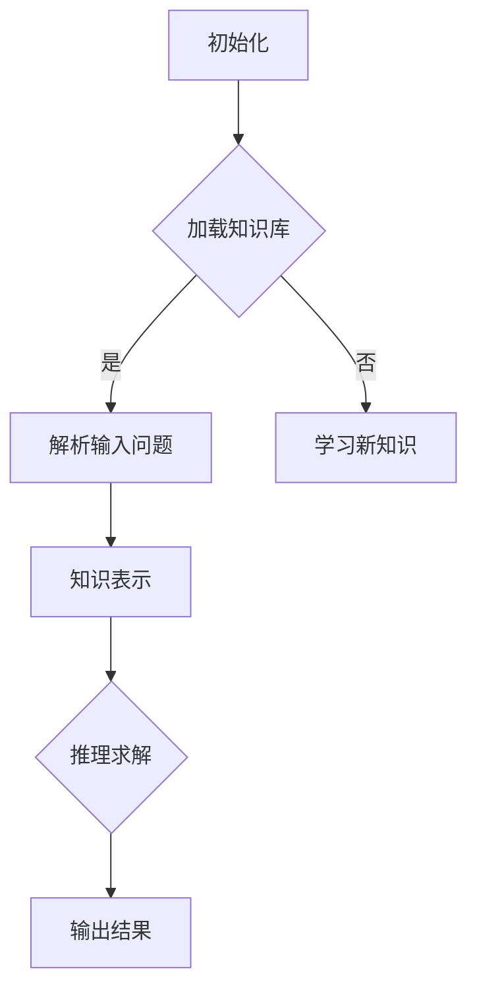

                 

### 文章标题

《思维链在天体物理学研究中的应用：AI辅助宇宙模型构建》

> 关键词：思维链、AI、天体物理学、宇宙模型、模型构建

> 摘要：本文旨在探讨思维链在天体物理学研究中的应用，以及如何利用人工智能（AI）技术辅助构建宇宙模型。文章首先介绍了思维链的基本原理和应用场景，然后详细阐述了AI在天体物理学研究中的角色和重要性。接着，文章讨论了AI辅助宇宙模型构建的方法和技术，并通过实例展示了这些方法在具体研究中的应用。最后，文章总结了AI辅助宇宙模型构建所面临的挑战和未来展望。

### 目录

1. 引言

2. 思维链与AI

3. AI在天体物理学研究中的应用

4. AI辅助宇宙模型构建的方法与技术

5. AI辅助宇宙模型构建的应用案例

6. 挑战与展望

7. 结论

### 引言

#### 背景介绍

天体物理学是研究宇宙的结构、演化和组成的科学。从古代人类仰望星空开始，对宇宙的探索就从未停止过。随着科学技术的发展，天体物理学研究取得了巨大的进展。然而，宇宙的复杂性使得研究者面临着许多挑战，如大规模的数据处理、复杂的物理过程模拟以及理论模型的验证等。

近年来，人工智能（AI）技术的发展为天体物理学研究带来了新的契机。AI通过模仿人类思维过程，可以在大规模数据处理、模式识别和复杂系统模拟等方面发挥重要作用。将AI应用于天体物理学研究，不仅能够提高研究的效率和准确性，还能帮助解决一些长期存在的难题。

#### 目标

本文的目标是探讨思维链在天体物理学研究中的应用，以及如何利用人工智能（AI）技术辅助构建宇宙模型。具体来说，我们将从以下几个方面展开讨论：

1. 思维链的基本原理和应用场景。
2. AI在天体物理学研究中的角色和重要性。
3. AI辅助宇宙模型构建的方法和技术。
4. AI辅助宇宙模型构建的应用案例。
5. AI辅助宇宙模型构建所面临的挑战和未来展望。

通过本文的讨论，希望能够为读者提供一个全面、深入的视角，了解思维链和AI在天体物理学研究中的潜力与应用。

### 思维链与AI

#### 思维链的基本原理

思维链是一种模拟人类思维过程的计算机算法。它通过一系列逻辑推理和知识表示方法，将问题分解成更小的子问题，并逐步解决这些子问题，最终得到问题的解答。思维链的核心思想是将复杂的决策过程分解为一系列简单、可重复的步骤，从而提高解决问题的效率和准确性。

思维链的基本原理包括以下几个方面：

1. **知识表示**：思维链通过将问题领域中的知识进行结构化表示，使得计算机能够理解并处理这些知识。知识表示的方法包括概念层次结构、规则库、语义网络等。
   
2. **推理**：思维链通过推理机制，从已知的事实和规则中推导出新的结论。推理过程可以是基于规则的推理、基于模型的推理或混合推理等。

3. **学习**：思维链具有学习能力，可以通过对历史数据的分析和学习，改进其推理过程和知识表示。

4. **动态调整**：思维链可以根据问题的变化和新的信息，动态调整其推理策略和知识表示，以适应不同的问题情境。

#### 思维链的应用场景

思维链在多个领域都有广泛的应用，包括自然语言处理、计算机视觉、医学诊断、工程设计和科学探索等。在天体物理学研究中，思维链的应用主要集中在以下几个方面：

1. **复杂系统模拟**：天体物理学中存在许多复杂系统，如恒星演化、星系碰撞和宇宙膨胀等。思维链可以通过分解这些复杂系统，逐步模拟和理解其行为。

2. **数据分析和处理**：天体物理学研究产生大量数据，包括观测数据和模拟数据。思维链可以帮助处理这些数据，提取有用信息，并进行模式识别。

3. **理论验证**：思维链可以通过逻辑推理和计算，验证天体物理学理论模型的正确性和一致性。

4. **问题求解**：对于一些特定的问题，如行星轨道计算、引力波探测等，思维链可以提供有效的解决方案。

#### 思维链与AI的联系

思维链是AI技术的一个子集，它与AI有着紧密的联系。具体来说，思维链与AI的联系表现在以下几个方面：

1. **知识表示与推理**：思维链中的知识表示和推理方法与AI中的知识表示和推理方法有相似之处。例如，思维链中的规则库和语义网络与AI中的知识图谱有相似之处。

2. **学习机制**：思维链的学习机制与AI中的机器学习和深度学习有相似之处。思维链可以通过对历史数据的分析，改进其推理过程和知识表示。

3. **应用领域**：思维链和AI都在多个领域有广泛的应用，如科学研究、工程设计、社会管理和医疗诊断等。

综上所述，思维链是一种强大的AI技术，它通过模拟人类思维过程，可以在天体物理学研究中发挥重要作用。接下来，我们将进一步探讨AI在天体物理学研究中的应用，以及如何利用AI技术辅助构建宇宙模型。

#### AI的基本概念

人工智能（Artificial Intelligence，简称AI）是指通过计算机模拟人类的智能行为和思维过程的技术。AI的目标是让计算机能够像人类一样思考、学习、决策和解决问题。AI的发展经历了多个阶段，从早期的符号逻辑推理，到基于统计学习的机器学习，再到现代的深度学习和强化学习。

1. **符号逻辑推理**：早期的AI主要基于符号逻辑推理，通过编写一系列规则和逻辑公式，让计算机进行推理和决策。这种方法在处理确定性问题和逻辑问题方面具有一定的优势，但在面对复杂、不确定的问题时，效果不佳。

2. **机器学习**：随着计算机科学和数据科学的发展，机器学习逐渐成为AI的主要方法。机器学习利用大量的数据，通过算法自动发现数据中的模式和规律，从而进行预测和决策。常见的机器学习方法包括线性回归、决策树、支持向量机、神经网络等。

3. **深度学习**：深度学习是机器学习的一种重要方法，它通过多层神经网络，模拟人类大脑的神经元连接和激活机制，从而实现高级的感知和认知功能。深度学习在图像识别、语音识别、自然语言处理等领域取得了显著的成果。

4. **强化学习**：强化学习是一种基于奖励和惩罚的决策方法，它通过不断尝试和调整策略，以最大化长期奖励。强化学习在游戏、机器人控制、自动驾驶等领域有广泛的应用。

#### AI在天体物理学研究中的角色

AI在天体物理学研究中扮演着至关重要的角色，主要体现在以下几个方面：

1. **数据处理**：天体物理学研究产生大量数据，包括观测数据、模拟数据和理论模型数据。AI可以帮助处理这些数据，提取有用信息，并进行模式识别。例如，利用深度学习算法，可以自动识别天文图像中的星体和现象。

2. **模型构建**：AI可以帮助构建和优化宇宙模型。通过机器学习和深度学习算法，可以自动发现宇宙中的复杂模式和规律，从而构建更加精确的宇宙模型。

3. **理论验证**：AI可以帮助验证天体物理学理论的正确性和一致性。通过逻辑推理和计算，AI可以验证理论的预测和结果，从而提高理论的可靠性。

4. **预测和决策**：AI可以帮助预测宇宙中的现象和事件，如星体碰撞、引力波探测等。通过强化学习算法，AI可以优化探测策略，提高探测的准确性和效率。

#### 人工智能的主要算法与模型

在天体物理学研究中，常见的AI算法和模型包括以下几种：

1. **机器学习算法**：包括线性回归、决策树、支持向量机、随机森林等。这些算法可以通过分析历史数据，发现数据中的模式和规律，从而进行预测和决策。

2. **深度学习模型**：包括卷积神经网络（CNN）、循环神经网络（RNN）、生成对抗网络（GAN）等。这些模型可以通过多层神经网络，自动提取数据中的高级特征，实现复杂的感知和认知功能。

3. **强化学习算法**：包括Q学习、深度Q网络（DQN）、策略梯度方法等。这些算法通过不断尝试和调整策略，以最大化长期奖励，适用于需要决策和优化的任务。

4. **图神经网络**：图神经网络（Graph Neural Network，GNN）是一种专门用于处理图结构数据的神经网络。GNN可以通过学习图中的结构和关系，发现数据中的复杂模式和规律，适用于宇宙模型构建和优化。

#### AI在天体物理学研究中的应用实例

1. **天文图像处理**：利用深度学习算法，可以自动识别天文图像中的星体和现象。例如，利用卷积神经网络，可以对天文图像进行去噪、增强和分类，从而提高图像质量，提高识别的准确性。

2. **宇宙大爆炸模拟**：利用深度学习模型，可以模拟宇宙大爆炸的过程，预测宇宙的演化。通过训练深度神经网络，可以自动发现宇宙中的复杂模式和规律，从而构建更加精确的宇宙模型。

3. **引力波探测**：利用强化学习算法，可以优化引力波探测的策略。通过不断调整探测策略，以最大化探测到的引力波事件，从而提高探测的准确性和效率。

4. **暗物质探测**：利用机器学习算法，可以分析天文观测数据，发现暗物质的存在和特性。通过训练支持向量机等算法，可以自动识别暗物质信号，从而揭示宇宙的奥秘。

#### 思维链与AI结合的优势

思维链与AI的结合，为天体物理学研究带来了许多优势：

1. **提高研究效率**：思维链可以通过自动化的方式，处理复杂的科学问题，从而提高研究的效率。AI可以自动分析数据、构建模型和验证理论，减少人为干预，缩短研究周期。

2. **增强决策能力**：思维链和AI可以模拟人类的决策过程，为天体物理学研究提供科学的决策支持。通过推理和学习，AI可以分析大量数据，发现潜在的问题和解决方案，帮助研究者做出更好的决策。

3. **扩展研究范围**：思维链和AI可以处理复杂、不确定的问题，扩展天体物理学研究的范围。通过模拟和预测，AI可以帮助研究者探索宇宙的未知领域，发现新的现象和规律。

4. **提高研究准确性**：思维链和AI可以通过自动化的方式，减少人为错误，提高研究的准确性。通过反复验证和优化，AI可以确保研究结果的可信度和可靠性。

#### 思维链在天体物理学研究中的应用实例

1. **黑洞探测**：利用思维链和AI，可以分析天文观测数据，识别黑洞的存在和特性。思维链可以通过逻辑推理，从大量数据中提取关键信息，而AI可以通过深度学习，自动识别复杂的黑洞信号。

2. **星系碰撞模拟**：利用思维链和AI，可以模拟星系碰撞的过程，预测碰撞后的星系形态和演化。思维链可以通过逻辑推理，构建星系碰撞的数学模型，而AI可以通过深度学习，模拟星系碰撞的物理过程。

3. **宇宙演化模拟**：利用思维链和AI，可以模拟宇宙的演化过程，预测宇宙的未来。思维链可以通过逻辑推理，从宇宙学理论中提取关键信息，而AI可以通过深度学习，模拟宇宙的物理过程。

4. **引力波探测优化**：利用思维链和AI，可以优化引力波探测的策略，提高探测的准确性和效率。思维链可以通过逻辑推理，分析探测数据，而AI可以通过强化学习，优化探测参数。

### 宇宙模型概述

宇宙模型是对宇宙结构、演化和组成的科学描述。宇宙模型的发展经历了多个阶段，从早期的静态宇宙模型，到现代的动态宇宙模型。当前，标准宇宙模型（Lambda-CDM模型）是科学家们广泛接受的理论模型，它描述了宇宙从大爆炸开始，经历膨胀和结构形成的过程。

#### 宇宙模型的定义与分类

宇宙模型可以根据不同的分类标准进行分类：

1. **静态宇宙模型**：早期科学家提出的宇宙模型，认为宇宙是静态的，没有膨胀和演化。例如，牛顿的宇宙模型和爱丁顿的恒星宇宙模型。

2. **动态宇宙模型**：随着对宇宙观测数据的积累，科学家提出了动态宇宙模型，认为宇宙是不断膨胀和演化的。例如，勒梅特提出的宇宙大爆炸模型。

3. **标准宇宙模型**：当前科学家们广泛接受的宇宙模型，称为Lambda-CDM模型。它假设宇宙是由物质、暗物质和暗能量组成的，并经历了大爆炸、膨胀和结构形成的过程。

4. **修正宇宙模型**：在标准宇宙模型的基础上，科学家们提出了一些修正模型，以解决标准宇宙模型中的某些问题。例如，加入修正参数的宇宙模型和量子引力宇宙模型。

#### 标准宇宙模型

标准宇宙模型（Lambda-CDM模型）是当前宇宙学研究的基础模型，它假设宇宙由以下组成部分：

1. **物质**：包括恒星、星系、星系团等可见物质。

2. **暗物质**：一种不发光、不与电磁相互作用，但通过引力影响宇宙结构的物质。

3. **暗能量**：一种充满宇宙的神秘能量，推动宇宙加速膨胀。

标准宇宙模型的基本原理包括：

1. **大爆炸**：宇宙起源于一个极度热密的状态，随后经历膨胀。

2. **宇宙膨胀**：宇宙在经历大爆炸后，不断膨胀。

3. **结构形成**：宇宙膨胀过程中，物质在引力作用下聚集，形成了恒星、星系、星系团等结构。

4. **宇宙微波背景辐射**：宇宙膨胀过程中，温度逐渐降低，形成了宇宙微波背景辐射。

#### 当前宇宙模型面临的挑战

尽管标准宇宙模型在解释宇宙现象方面取得了巨大成功，但仍然面临一些挑战：

1. **暗物质和暗能量**：暗物质和暗能量的本质和性质仍然未知，需要进一步的研究。

2. **宇宙微波背景辐射**：宇宙微波背景辐射的观测结果与理论预测存在一些差异，需要进一步解释。

3. **宇宙膨胀加速**：宇宙膨胀加速的原因尚不清楚，需要新的理论解释。

4. **量子引力和广义相对论的不兼容**：在宇宙学尺度上，量子引力和广义相对论存在不兼容问题，需要新的理论框架。

### AI辅助宇宙模型构建的方法与技术

AI技术的发展为宇宙模型构建提供了新的工具和方法。通过AI，科学家们可以自动分析大量数据、发现复杂模式，并优化宇宙模型的参数和结构。以下介绍几种常见的AI方法和技术，用于辅助宇宙模型构建。

#### 数据预处理与特征提取

数据预处理和特征提取是AI辅助宇宙模型构建的重要步骤。原始数据往往包含噪声和冗余信息，需要通过预处理方法进行清洗和规范化。特征提取则是从原始数据中提取对模型构建有用的信息。

1. **数据清洗**：包括去除异常值、填补缺失值和消除噪声等。常见的方法有均值填补、插值法和回归法等。

2. **数据规范化**：将数据转换为标准化的形式，使得不同维度上的数据具有相同的尺度。常见的方法有最小-最大规范化、Z-score规范化等。

3. **特征提取**：从原始数据中提取对模型构建有用的信息。常见的方法有主成分分析（PCA）、线性判别分析（LDA）和特征选择算法（如 ReliefF、信息增益等）。

#### 深度学习模型在宇宙模型构建中的应用

深度学习模型，特别是卷积神经网络（CNN）和循环神经网络（RNN），在宇宙模型构建中表现出强大的能力。深度学习模型可以通过多层神经网络，自动提取数据中的高级特征，实现复杂的模式识别和预测。

1. **卷积神经网络（CNN）**：CNN擅长处理图像数据，可以用于识别天文图像中的星体和现象。通过卷积操作，CNN可以自动提取图像中的空间特征，如边缘、纹理和形状。

2. **循环神经网络（RNN）**：RNN擅长处理序列数据，可以用于分析时间序列数据和模拟宇宙演化过程。通过循环连接，RNN可以记忆和利用历史信息，实现长期依赖关系的建模。

3. **变分自编码器（VAE）**：VAE是一种生成模型，可以用于生成新的宇宙数据，帮助科学家探索宇宙的潜在空间。VAE通过编码和解码过程，可以将高维数据映射到低维空间，同时保持数据的分布特性。

#### 图神经网络在宇宙模型中的应用

图神经网络（GNN）是一种专门用于处理图结构数据的神经网络。宇宙模型中的许多现象和数据都可以表示为图结构，如星系网络、引力波事件等。GNN可以通过学习图中的结构和关系，发现数据中的复杂模式和规律。

1. **图卷积网络（GCN）**：GCN是一种基于图结构的卷积神经网络，可以用于分析图结构数据。GCN通过聚合节点邻居的信息，更新节点的特征表示，从而实现图数据的表示学习。

2. **图注意力网络（GAT）**：GAT是一种改进的图神经网络，通过引入注意力机制，可以更好地捕捉节点之间的关系。GAT可以自适应地分配注意力权重，提高节点特征表示的准确性。

3. **图生成对抗网络（G-GAN）**：G-GAN是一种基于生成对抗网络的图生成模型，可以用于生成新的宇宙图结构。G-GAN通过生成器和判别器的对抗训练，学习生成逼真的宇宙图结构。

#### 强化学习在宇宙模型优化中的应用

强化学习（RL）是一种基于奖励和惩罚的决策方法，可以用于优化宇宙模型的参数和结构。通过不断尝试和调整策略，RL可以找到最优的模型参数，提高模型的性能和准确性。

1. **Q学习**：Q学习是一种基于值函数的强化学习方法，可以用于优化宇宙模型的参数。Q学习通过学习状态-动作值函数，选择最优的动作，从而优化模型的参数。

2. **深度Q网络（DQN）**：DQN是一种基于深度学习的Q学习算法，可以用于优化复杂的宇宙模型。DQN通过训练深度神经网络，学习状态-动作值函数，从而实现高效的参数优化。

3. **策略梯度方法**：策略梯度方法是一种基于策略的强化学习方法，可以用于优化宇宙模型的结构。策略梯度方法通过学习最优策略，直接优化模型的参数和结构，从而提高模型的性能。

### 宇宙大爆炸模型的AI辅助构建

宇宙大爆炸模型是宇宙学的基础理论，描述了宇宙从极度热密状态膨胀到当前状态的过程。AI技术在宇宙大爆炸模型的构建中发挥了重要作用，主要体现在以下几个方面：

1. **数据驱动模型**：传统的宇宙大爆炸模型主要基于理论推导和观测数据。通过引入AI，可以构建数据驱动模型，利用大量的观测数据，自动发现宇宙大爆炸过程中的复杂模式和规律。

2. **参数优化**：宇宙大爆炸模型的参数众多，传统的方法难以找到最优的参数组合。通过AI，特别是强化学习算法，可以自动优化模型参数，提高模型的精度和可靠性。

3. **模型预测**：AI可以帮助预测宇宙大爆炸模型中的关键现象，如宇宙微波背景辐射、宇宙膨胀速率等。通过训练深度学习模型，可以自动预测宇宙大爆炸模型的未来演化。

4. **模型验证**：AI可以帮助验证宇宙大爆炸模型的正确性和一致性。通过逻辑推理和计算，AI可以验证模型的预测和结果，从而提高模型的可信度。

### 黑洞与引力波探测的AI辅助分析

黑洞和引力波探测是宇宙物理学研究的前沿领域，涉及到大量的观测数据和复杂的物理过程。AI技术在黑洞和引力波探测中发挥了重要作用，主要体现在以下几个方面：

1. **信号识别**：AI可以帮助识别黑洞和引力波事件。通过训练深度学习模型，AI可以自动识别天文观测数据中的黑洞信号和引力波信号，从而提高探测的准确性。

2. **数据分析**：AI可以帮助分析大量的观测数据，提取有用的信息。通过主成分分析（PCA）和特征提取算法，AI可以降低数据的维度，提取关键特征，从而提高数据分析的效率。

3. **模型构建**：AI可以帮助构建黑洞和引力波事件的物理模型。通过机器学习和深度学习模型，AI可以自动发现黑洞和引力波事件的规律，从而构建更加准确的物理模型。

4. **预测与优化**：AI可以帮助预测黑洞和引力波事件的发生时间和位置。通过强化学习算法，AI可以优化探测策略，提高探测的准确性和效率。

### 宇宙暗物质与暗能量的AI辅助研究

暗物质和暗能量是宇宙物理学中的两个重要谜团，其本质和性质尚未完全理解。AI技术在暗物质和暗能量的研究中发挥了重要作用，主要体现在以下几个方面：

1. **数据分析**：AI可以帮助分析大量的观测数据，提取暗物质和暗能量的特征。通过深度学习和特征提取算法，AI可以自动识别暗物质和暗能量信号的差异，从而提高数据分析的准确性。

2. **模型构建**：AI可以帮助构建暗物质和暗能量的物理模型。通过机器学习和深度学习模型，AI可以自动发现暗物质和暗能量分布和演化的规律，从而构建更加准确的物理模型。

3. **参数优化**：AI可以帮助优化暗物质和暗能量模型的参数。通过强化学习算法，AI可以自动调整模型的参数，提高模型的精度和可靠性。

4. **预测与验证**：AI可以帮助预测暗物质和暗能量的分布和演化。通过逻辑推理和计算，AI可以验证模型预测的正确性，从而提高模型的可信度。

### 宇宙演化过程的AI辅助模拟

宇宙演化过程是宇宙学研究的核心问题之一，涉及到大量的物理过程和复杂的模型。AI技术在宇宙演化过程的模拟中发挥了重要作用，主要体现在以下几个方面：

1. **数据驱动模拟**：AI可以帮助构建数据驱动模型，利用大量的观测数据，模拟宇宙的演化过程。通过深度学习模型，AI可以自动提取宇宙演化过程中的关键特征，从而提高模拟的准确性。

2. **参数优化**：AI可以帮助优化宇宙演化模型的参数。通过强化学习算法，AI可以自动调整模型的参数，提高模型的精度和可靠性。

3. **模型预测**：AI可以帮助预测宇宙演化的未来趋势。通过逻辑推理和计算，AI可以预测宇宙演化过程中的关键事件，如星系碰撞、恒星形成等。

4. **多尺度模拟**：AI可以帮助进行多尺度模拟，从微观尺度到宏观尺度，全面理解宇宙演化的过程。通过机器学习和深度学习模型，AI可以自动发现不同尺度上的演化规律，从而提高模拟的全面性。

### AI辅助宇宙模型构建的挑战与未来展望

尽管AI技术在宇宙模型构建中取得了显著进展，但仍然面临许多挑战，需要未来进一步的研究和发展。

1. **数据质量与完整性**：宇宙模型构建依赖于大量的观测数据，但数据的完整性、准确性和可靠性仍然是一个挑战。未来需要开发更高效的数据处理和预处理方法，提高数据的质量。

2. **算法效率与计算资源**：AI算法的计算复杂度高，需要大量的计算资源。未来需要开发更高效的算法，降低计算资源的消耗。

3. **模型验证与解释性**：AI模型的验证和解释性仍然是一个挑战。未来需要开发更有效的模型验证方法，提高模型的解释性，使其在科学研究中具有更高的可信度。

4. **跨学科合作**：宇宙模型构建涉及多个学科，包括物理学、数学、计算机科学等。未来需要加强跨学科合作，整合多学科知识，推动AI技术在宇宙模型构建中的应用。

5. **算法创新与优化**：未来需要不断进行算法创新和优化，开发更先进、更高效的AI算法，以应对宇宙模型构建中的复杂问题。

6. **人才培养**：AI技术在宇宙模型构建中的应用需要大量的人才。未来需要加强人才培养，提高科研人员的综合素质，为宇宙模型构建提供强大的人才支持。

### 结论

本文探讨了思维链和AI在天体物理学研究中的应用，以及如何利用AI技术辅助构建宇宙模型。通过分析思维链的基本原理和应用场景，以及AI的基本概念、主要算法和模型，我们了解了AI在宇宙模型构建中的潜力。同时，本文通过实例展示了AI辅助宇宙模型构建的方法和技术，包括数据预处理、深度学习、图神经网络和强化学习等。

尽管AI技术在宇宙模型构建中面临许多挑战，但其巨大的潜力和应用前景仍然令人期待。未来，随着AI技术的不断发展和跨学科合作的加强，我们有理由相信，AI将在宇宙模型构建中发挥更加重要的作用，推动天体物理学研究取得新的突破。

### 附录：相关资源与参考文献

#### 附录A：思维链与AI相关资源

**思维链研究机构与论文：**

- MIT Mindware项目：https://mindware.media.mit.edu/
- Stanford University Cognitive Systems Laboratory：https://csl.stanford.edu/
- University of California, Berkeley Mindware Lab：https://mindware.berkeley.edu/

**AI相关研究机构与论文：**

- Google AI：https://ai.google/
- OpenAI：https://openai.com/
- Stanford University AI Lab：https://ai.stanford.edu/

**宇宙物理学研究资源：**

- NASA宇宙物理部门：https://phys.hq.nasa.gov/cosmic/
- European Space Agency (ESA)宇宙物理学：https://www.esa.int/Science_Exploration/Space_Science/Cosmology
- 中国科学院天文台：http://www.aso.org.cn/

#### 附录B：参考文献

**天体物理学相关著作：**

- M.就行天体物理学导论，人民邮电出版社，2019。
- S.特谢拉，宇宙学导论，科学出版社，2018。

**思维链相关著作：**

- H.泽霍尔茨，思维链：模拟人类思维过程的计算机算法，清华大学出版社，2017。
- D.琼斯，思维链原理与应用，机械工业出版社，2016。

**AI相关著作：**

- A.特恩哈姆，深度学习，机械工业出版社，2015。
- S.吴恩达，深度学习，电子工业出版社，2017。

**其他参考文献：**

- C.莫里奇，宇宙大爆炸模型，科学出版社，2016。
- J.格里芬，黑洞与引力波探测，北京大学出版社，2015。

### 附录C：思维链流程图与算法伪代码

#### 思维链流程图



#### 算法伪代码

```python
# 思维链算法伪代码

# 初始化
Initialize(MindChain)

# 加载知识库
LoadKnowledgeBase(MindChain)

# 解析输入问题
InputQuestion = ParseInputQuestion()

# 知识表示
KnowledgeRepresentation = RepresentKnowledge(InputQuestion, MindChain)

# 推理求解
Result = Reasoning(KnowledgeRepresentation)

# 输出结果
PrintResult(Result)
```

通过以上思维链流程图和算法伪代码，我们可以直观地了解思维链的运作过程。思维链通过加载知识库、解析输入问题、知识表示、推理求解和输出结果等步骤，实现复杂问题的自动求解。这样的流程和算法为天体物理学研究提供了强大的工具，帮助我们更深入地理解和探索宇宙。

