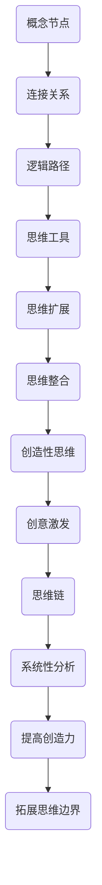

                 


### 文章标题

《思维链在科幻创作中的应用：拓展想象力边界》

### 文章关键词

- 思维链
- 科幻创作
- 想象力拓展
- 创意思维
- 科幻小说
- 科幻电影
- 科幻游戏

### 文章摘要

在科幻创作中，想象力是核心驱动力。本文将探讨思维链这一概念，解释其在科幻创作中的应用，以及如何通过思维链拓展想象力边界。文章首先介绍科幻创作的背景，接着详细阐述思维链的基本原理。随后，我们将分析思维链在科幻故事构思、角色设定、场景设计等环节的具体应用，并探讨如何运用思维链技巧来提升创造力。通过实例解析和实战应用，本文旨在为科幻创作者提供实用工具和方法，以帮助他们更好地挖掘和展现自己的想象力。

## 第1章：引言

### 1.1 科幻创作与想象力

科幻创作是一种探索未知、挑战现实的文学和艺术形式。它通过设定虚构的未来世界或假设的科技背景，探讨了人类与宇宙、科技与伦理等议题。科幻作品的独特之处在于其丰富的想象力和深刻的思考，这使得它们能够在文化、科学和技术等领域产生深远的影响。科幻创作不仅仅是虚构的故事，更是一种思考和预测未来的方式，它鼓励人们超越现实，拓展想象力的边界。

想象力在科幻创作中扮演着至关重要的角色。科幻作家需要构建一个既合理又充满创意的世界，这要求他们拥有丰富的想象力和强大的创造力。想象力是科幻创作的源头，它激发创作者的创作灵感，推动故事的发展，使角色和场景更加生动和有趣。科幻创作不仅是艺术表达，也是一种探索和认知世界的方式，它鼓励人们思考科技发展对人类和社会的影响。

### 1.2 思维链的概念与原理

思维链是一种用于提高创造力和创新能力的思维方式。它通过一系列逻辑步骤，将不同的概念、想法和信息连接起来，形成一个完整的思维网络。思维链的核心在于通过关联性思考和系统性分析，激发新的创意和解决方案。

思维链的基本原理包括以下几点：

1. **关联性思考**：思维链强调通过寻找不同元素之间的关联，以产生新的想法和解决方案。这种关联可以是直接的，也可以是间接的，甚至是看似不相关的事物之间的联系。

2. **系统性分析**：思维链要求创作者对问题进行系统性分析，了解各个部分之间的关系和作用，从而更好地理解问题的本质和潜在的解决方案。

3. **多元思维**：思维链鼓励创作者采用多元思维模式，包括逻辑思维、创新思维、直觉思维等，以全面地分析和解决问题。

4. **逐步构建**：思维链通过逐步构建，从简单的概念和想法出发，逐步扩展和深化，形成一个完整和复杂的思维网络。

### 1.3 思维链在科幻创作中的作用

思维链在科幻创作中具有重要作用，它可以帮助创作者拓展想象力边界，提高创造力和创新性。以下是思维链在科幻创作中的一些具体应用：

1. **故事构思**：思维链可以帮助创作者构建科幻故事的基本框架，通过关联不同元素，形成引人入胜的故事线。

2. **角色设定**：思维链可以帮助创作者构建丰富、立体的角色，通过分析角色的背景、性格、动机等，使其更加真实和有吸引力。

3. **场景设计**：思维链可以帮助创作者构建科幻场景，通过关联现实和虚构元素，创造一个既可信又富有想象力的世界。

4. **创意激发**：思维链可以帮助创作者在创作过程中不断产生新的创意和想法，通过多元思维模式，突破创作瓶颈。

总之，思维链为科幻创作提供了一种有效的思维工具和方法，它可以帮助创作者更好地发掘和展现自己的想象力，创作出更具有创意和影响力的作品。

## 第2章：思维链基本原理

### 2.1 思维链的组成部分

思维链是一种复杂的思维方式，它由多个关键组成部分构成，这些部分相互协作，共同推动思维过程的发展。以下是思维链的主要组成部分：

1. **概念节点**：概念节点是思维链中的基本单元，每个节点代表一个特定的概念或想法。概念节点可以是具体的，如“人工智能”、“太空旅行”，也可以是抽象的，如“自由”、“平等”。它们是思维链构建的基础。

2. **连接关系**：连接关系是指概念节点之间的联系。这些联系可以是直接的，也可以是间接的。直接的连接关系如因果关系，间接的连接关系如相似性关系。连接关系定义了概念节点之间的逻辑关系，使思维链成为一个连贯的整体。

3. **逻辑路径**：逻辑路径是指从起点到终点的概念节点序列。逻辑路径决定了思维链的流程和方向，是思维链的核心。每个逻辑路径都代表了一个具体的思维过程，通过多个逻辑路径的交织，形成了一个复杂的思维网络。

4. **思维工具**：思维工具是辅助思维链运作的各种方法和技巧，如思维导图、联想思维、逆向思维等。这些工具可以帮助创作者更好地组织和扩展思维链，提高思维的效率和质量。

### 2.2 思维链的工作机制

思维链的工作机制可以概括为以下几个步骤：

1. **概念采集**：在开始构建思维链时，创作者首先需要采集大量的概念节点。这些概念节点可以通过阅读、观察、思考等方式获取。采集到的概念节点越多，思维链的潜在连接关系就越多，从而提高了思维的丰富性和创造性。

2. **连接关系建立**：在采集到足够的概念节点后，创作者需要分析这些概念节点之间的关联，建立连接关系。建立连接关系的过程可以通过逻辑推理、联想思维、直觉判断等方式进行。这一步骤是思维链的核心，决定了思维链的深度和广度。

3. **逻辑路径构建**：在建立连接关系后，创作者需要构建逻辑路径。逻辑路径的构建是一个逐步迭代的过程，创作者可以从一个概念节点出发，通过连接关系，逐步扩展到其他概念节点，形成一个复杂的逻辑网络。

4. **思维扩展**：在构建逻辑路径的过程中，创作者需要不断进行思维扩展。思维扩展可以通过多种方式实现，如引入新的概念节点、重新调整连接关系、探索新的逻辑路径等。思维扩展有助于创作者发现新的创意和想法，提高思维的灵活性和创造性。

5. **思维整合**：思维整合是思维链的最终步骤，创作者需要将所有概念节点、连接关系和逻辑路径整合成一个完整的思维网络。思维整合有助于创作者对思维链进行全局理解和分析，发现潜在的创新点和解决方案。

### 2.3 思维链与创造性思维的关系

思维链与创造性思维密切相关，它是创造性思维的一种重要工具。创造性思维是指通过独特的视角和方法，发现新的概念、解决方案或创造新的价值。思维链在创造性思维中起到以下几个关键作用：

1. **激发创意**：思维链通过连接不同的概念节点，激发新的创意和想法。它鼓励创作者跳出传统思维框架，以全新的视角看待问题，从而发现独特的解决方案。

2. **拓展思维边界**：思维链可以帮助创作者拓展思维边界，打破常规思维的束缚。通过构建复杂的逻辑网络，创作者可以探索更多的可能性，从而拓宽思维的广度和深度。

3. **系统化分析**：思维链通过系统化分析，帮助创作者理解问题的本质和内在联系。这种系统化的分析有助于创作者从多个角度思考问题，发现潜在的创新点。

4. **提高创造力**：思维链通过逐步构建和扩展思维网络，提高了创作者的创造力。它鼓励创作者不断产生新的想法和创意，从而提高创作的质量和效率。

总之，思维链是创造性思维的一种有效工具，它通过关联性思考和系统性分析，帮助创作者更好地发掘和实现自己的创造力。

### 思维链原理架构图

为了更直观地理解思维链的原理，我们可以使用Mermaid流程图来展示其基本架构。以下是一个简单的思维链架构图：



这个流程图展示了思维链的基本组成部分和它们之间的相互关系。概念节点通过连接关系形成逻辑路径，逻辑路径再通过思维工具进行扩展和整合，最终推动创造性思维的发展。

### 2.4 思维链在科幻创作中的应用

思维链在科幻创作中的应用非常广泛，可以帮助创作者更好地构思故事、设定角色和设计场景。以下是思维链在科幻创作中的一些具体应用：

1. **故事构思**：在科幻故事构思中，思维链可以帮助创作者建立复杂的故事框架。创作者可以通过采集大量的概念节点，如“科技”、“未来”、“外星人”等，并通过连接关系构建故事线。例如，可以从“科技发展”这一概念节点出发，连接到“人工智能”、“虚拟现实”等节点，形成一个关于未来科技发展的故事线。

   伪代码示例：

   ```python
   concept_nodes = ["technology", "future", "aliens", "artificial intelligence", "virtual reality"]
   connections = [
       ["technology", "artificial intelligence"],
       ["virtual reality", "aliens"],
       ["future", "technology"]
   ]
   story_line = build_story_line(concept_nodes, connections)
   ```

   这个伪代码展示了如何通过概念节点和连接关系构建一个简单的故事线。

2. **角色设定**：思维链可以帮助创作者构建丰富的角色设定。创作者可以通过分析角色的背景、性格、动机等概念节点，并通过连接关系构建角色的关系网络。例如，可以从“角色背景”这一概念节点出发，连接到“家庭”、“教育”、“职业”等节点，形成一个完整的角色设定。

   伪代码示例：

   ```python
   character_nodes = ["background", "family", "education", "career", "personality", "motivation"]
   connections = [
       ["background", "family"],
       ["education", "career"],
       ["personality", "motivation"]
   ]
   character_profile = build_character_profile(character_nodes, connections)
   ```

   这个伪代码展示了如何通过概念节点和连接关系构建一个角色的个人档案。

3. **场景设计**：思维链可以帮助创作者设计富有创意的科幻场景。创作者可以通过分析场景的背景、环境、事件等概念节点，并通过连接关系构建场景的网络。例如，可以从“场景背景”这一概念节点出发，连接到“气候”、“地理”、“科技”等节点，设计一个独特的科幻场景。

   伪代码示例：

   ```python
   scene_nodes = ["background", "climate", "geography", "technology", "events"]
   connections = [
       ["background", "climate"],
       ["geography", "technology"],
       ["events", "background"]
   ]
   scene_design = build_scene_design(scene_nodes, connections)
   ```

   这个伪代码展示了如何通过概念节点和连接关系构建一个科幻场景。

通过这些伪代码示例，我们可以看到思维链在科幻创作中的应用是如何通过概念节点和连接关系实现的。这种结构化的思维方式有助于创作者更好地组织和扩展他们的创意，从而创作出更加丰富和生动的科幻作品。

### 数学模型与公式

在理解思维链的应用时，我们还可以引入一些数学模型和公式来更深入地分析其原理。以下是几个相关的数学模型和公式：

1. **贝叶斯网络**：贝叶斯网络是一种图形模型，用于表示变量之间的条件依赖关系。它可以帮助我们分析思维链中的连接关系和概率分布。

   数学公式：
   $$ P(A|B) = \frac{P(B|A)P(A)}{P(B)} $$

   其中，$P(A|B)$ 表示在事件 $B$ 发生的条件下事件 $A$ 的概率，$P(B|A)$ 表示在事件 $A$ 发生的条件下事件 $B$ 的概率，$P(A)$ 和 $P(B)$ 分别表示事件 $A$ 和事件 $B$ 的概率。

2. **多元线性回归**：多元线性回归用于分析多个自变量对一个因变量的影响。它可以帮助我们理解思维链中的多个概念节点之间的线性关系。

   数学公式：
   $$ Y = \beta_0 + \beta_1X_1 + \beta_2X_2 + ... + \beta_nX_n + \epsilon $$

   其中，$Y$ 是因变量，$X_1, X_2, ..., X_n$ 是自变量，$\beta_0, \beta_1, ..., \beta_n$ 是回归系数，$\epsilon$ 是误差项。

3. **主成分分析（PCA）**：主成分分析是一种降维技术，用于从大量变量中提取最重要的几个主成分。它可以帮助我们简化思维链中的复杂结构，提取核心概念。

   数学公式：
   $$ Z = \mu + \sum_{i=1}^{k} \lambda_iu_i $$

   其中，$Z$ 是主成分，$\mu$ 是均值，$\lambda_i$ 是特征值，$u_i$ 是特征向量。

通过这些数学模型和公式，我们可以更深入地分析思维链的原理和应用，为科幻创作提供更加科学和系统的理论基础。

### 举例说明

为了更好地理解思维链在科幻创作中的应用，我们来看一个具体的例子。假设我们正在构思一部关于未来科技与人类命运的科幻小说。

1. **概念节点采集**：
   - 科技：人工智能、虚拟现实、量子计算
   - 人类：情感、信仰、文化
   - 环境：气候变化、生态破坏
   - 政治与经济：全球治理、贫富差距
   - 外部威胁：外星人、机器人的崛起

2. **连接关系建立**：
   - 科技发展可能导致人工智能的崛起，从而影响人类的生活方式和社会结构。
   - 人工智能的崛起可能加剧全球贫富差距，导致社会动荡。
   - 气候变化和生态破坏可能导致资源匮乏，加剧全球竞争。
   - 外星人的出现可能引发人类文明的新一轮变革。

3. **逻辑路径构建**：
   - 从“科技发展”开始，连接到“人工智能”、“虚拟现实”等概念节点，构建一个关于科技发展的故事线。
   - 从“人工智能”连接到“贫富差距”、“社会动荡”，分析其对社会的影响。
   - 从“气候变化”和“生态破坏”连接到“资源匮乏”、“全球竞争”，探讨其对人类未来的威胁。
   - 从“外星人”连接到“人类文明的新一轮变革”，构建一个关于人类与外星文明的冲突和融合的故事线。

4. **思维扩展**：
   - 通过引入新的概念节点，如“生物科技”、“太空探索”，扩展故事线和主题。
   - 通过调整连接关系，如重新评估“人工智能”的影响，探讨其对人类社会的潜在好处。
   - 通过探索新的逻辑路径，如“虚拟现实”对社会互动的影响，丰富故事的层次和深度。

通过这个例子，我们可以看到思维链在科幻创作中的应用是如何通过概念节点和连接关系逐步构建和扩展的。这种结构化的思维方式有助于创作者更好地组织创意，构思出复杂而富有想象力的科幻故事。

## 第3章：思维链的应用场景

### 3.1 科幻故事构思中的思维链应用

在科幻故事的构思过程中，思维链是一种极为有效的工具，它可以帮助创作者从多个角度出发，构建出丰富多样、引人入胜的故事。以下是思维链在科幻故事构思中应用的详细步骤和实际案例：

1. **概念节点采集**：
   - 首先，创作者需要收集与故事主题相关的各种概念节点。这些概念节点可以包括科技发展、未来社会、人类文明、环境变化、外星生命等。
   - 示例：科技发展（人工智能、量子计算、基因编辑）、未来社会（虚拟现实、全球治理、贫富差距）、环境变化（气候变化、生态破坏）、外星生命（外星人、外星文明）。

2. **连接关系建立**：
   - 接下来，创作者需要分析这些概念节点之间的关联，建立连接关系。连接关系可以是直接的，如“人工智能”与“社会变革”；也可以是间接的，如“基因编辑”与“生态破坏”。
   - 示例：连接关系可以是“人工智能导致社会变革”，“基因编辑技术改善人类基因”，“气候变化加剧生态破坏”。

3. **逻辑路径构建**：
   - 创作者需要从这些连接关系出发，构建故事的基本框架。逻辑路径决定了故事的进展和转折点。
   - 示例：一个逻辑路径可以是：“基因编辑技术导致人类基因优化，进而引起社会阶层分化，最终在气候变化和生态破坏的背景下，人类面临生存危机。”

4. **思维扩展**：
   - 在构建基础框架后，创作者可以通过思维扩展，添加更多的细节和创意。这包括探索新的概念节点和调整现有的连接关系。
   - 示例：可以添加新的概念节点，如“虚拟现实成为逃避现实的工具”，调整连接关系，如“社会阶层分化加剧社会动荡”。

5. **故事线优化**：
   - 最后，创作者需要对故事线进行优化，确保其逻辑连贯性和吸引力。这可以通过回顾和调整逻辑路径来实现。
   - 示例：调整逻辑路径，使故事更加紧张和引人入胜，如“在人类基因优化引发社会阶层分化的同时，外星生命出现，加剧了人类社会的危机”。

### 3.2 科幻角色设定的思维链应用

角色设定是科幻故事中至关重要的一环，一个丰富、立体的角色可以大大增强故事的真实感和吸引力。思维链在角色设定中的应用可以帮助创作者深入挖掘角色的背景、动机和关系。以下是思维链在角色设定中的应用步骤和实际案例：

1. **概念节点采集**：
   - 创作者需要收集与角色相关的各种概念节点。这些概念节点可以包括背景信息（家庭、教育、职业）、性格特点（内向、外向、乐观、悲观）、动机（追求真理、权力、爱情）等。
   - 示例：背景信息（家庭背景：单亲家庭、富裕家庭；教育：科学家、军人；职业：科学家、军人、政治家）。

2. **连接关系建立**：
   - 分析这些概念节点之间的关联，建立连接关系。这些连接关系可以揭示角色的内在联系和冲突。
   - 示例：连接关系可以是“家庭背景影响性格”，“教育经历决定职业选择”，“性格特点影响角色动机”。

3. **角色关系网络构建**：
   - 创作者需要构建角色的关系网络，展示角色之间的互动和冲突。这可以通过思维链中的逻辑路径实现。
   - 示例：角色关系网络可以是“科学家与政府官员之间的冲突”，“家庭成员之间的矛盾”，“同事之间的竞争”。

4. **角色动机分析**：
   - 通过思维链，创作者需要深入分析角色的动机。这有助于塑造角色的个性和故事的发展。
   - 示例：角色动机可以是“科学家追求科学真理”，“政治家追求权力”，“军人保卫家园”。

5. **角色塑造优化**：
   - 最后，创作者需要对角色进行优化，确保其个性鲜明、动机合理。这可以通过回顾和调整角色的概念节点和连接关系来实现。
   - 示例：调整角色的动机，使其更加符合故事的逻辑和主题，如“科学家为了拯救人类而冒险”。

### 3.3 科幻场景设计的思维链应用

科幻场景设计是科幻作品的重要组成部分，一个逼真、富有创意的场景可以大大增强故事的沉浸感和吸引力。思维链在科幻场景设计中的应用可以帮助创作者构建复杂而多样的场景。以下是思维链在科幻场景设计中的应用步骤和实际案例：

1. **概念节点采集**：
   - 创作者需要收集与场景相关的各种概念节点。这些概念节点可以包括背景信息（地理环境、气候条件）、科技设施（飞船、机器人、建筑）、人文元素（文化、习俗、社会结构）等。
   - 示例：背景信息（地理环境：地球、外星球；气候条件：极寒、极热）、科技设施（飞船：太空站、飞船；机器人：战斗机器人、服务机器人）、人文元素（文化：外星文明文化；习俗：外星社交习惯）。

2. **连接关系建立**：
   - 分析这些概念节点之间的关联，建立连接关系。这些连接关系可以揭示场景的内在联系和特征。
   - 示例：连接关系可以是“科技设施影响人文元素”，“人文元素决定社会结构”，“地理环境影响气候条件”。

3. **场景构建**：
   - 创作者需要从这些连接关系出发，构建场景的基本框架。这可以通过思维链中的逻辑路径实现。
   - 示例：场景构建可以是“在外星球的极寒环境下，一个太空站的研究团队发现了一个神秘的信号”，“在地球上的未来城市中，人工智能机器人与人类共同生活”。

4. **细节扩展**：
   - 在构建基础框架后，创作者可以通过思维链进行细节扩展，添加更多的创意和细节。
   - 示例：可以添加新的概念节点，如“神秘的信号引发外星生命入侵”，“未来城市中的人工智能机器人反抗人类”。

5. **场景优化**：
   - 最后，创作者需要对场景进行优化，确保其逻辑连贯性和创意性。这可以通过回顾和调整场景的概念节点和连接关系来实现。
   - 示例：调整场景的连接关系，使其更加符合故事的主题和情节，如“在地球上的未来城市中，人工智能机器人为了保护人类而抵抗外星入侵”。

通过这些应用步骤和实际案例，我们可以看到思维链在科幻故事构思、角色设定和场景设计中的应用是如何帮助创作者拓展想象力边界，构建丰富、生动的科幻世界的。

### 4.1 思维导图与思维链结合

思维链与思维导图的结合是一种强大的创意工具，它可以帮助创作者更系统地组织和扩展思维，从而提高创作效率和质量。思维导图是一种图形化的思维工具，它通过分支结构将不同的概念、想法和信息连接起来，形成一个可视化的思维网络。而思维链则是一种逻辑化的思维方法，它通过逐步构建和扩展思维路径，帮助创作者深入挖掘问题的本质和解决方案。

#### 思维链与思维导图的融合

思维链与思维导图的结合主要体现在以下两个方面：

1. **概念节点与思维导图的分支**：在思维链的应用过程中，每个概念节点都可以转化为思维导图中的一个分支。这些分支通过连接关系形成思维导图的框架，从而实现思维链的图形化表达。

2. **思维路径与思维导图的层次**：思维链的每个逻辑路径都可以在思维导图中体现为一个层次结构。通过调整和扩展这些层次，创作者可以更清晰地理解和表达复杂的思维过程。

#### 思维导图的基本原理

思维导图的基本原理包括以下几个方面：

1. **中心主题**：思维导图的核心是一个中心主题，它代表了整个思维过程的中心。所有的分支和层次都围绕着这个主题展开。

2. **分支结构**：思维导图通过分支结构来连接不同的概念和想法。每个分支都可以进一步细分，形成更详细的子分支。

3. **连接关系**：分支之间的连接关系定义了概念和想法之间的逻辑关系。这些关系可以是因果关系、相似关系、包含关系等。

4. **可视化表达**：思维导图通过图形化的方式表达思维过程，使得复杂的思维结构变得直观和易于理解。

#### 思维链在思维导图中的应用步骤

1. **确定中心主题**：首先，创作者需要明确科幻创作的主题，如“未来科技与人类命运”。这个主题将成为思维导图的中心。

2. **采集概念节点**：根据主题，创作者需要采集相关的概念节点，如“人工智能”、“虚拟现实”、“气候变化”等。

3. **构建分支结构**：将采集到的概念节点转化为思维导图的分支，形成初步的思维框架。例如，可以将“人工智能”作为一个主要的分支，进一步细分为“机器人”、“自动化”等子分支。

4. **建立连接关系**：分析这些概念节点之间的关联，建立连接关系。例如，可以建立“人工智能”与“社会变革”之间的因果关系。

5. **扩展思维路径**：在思维导图中，逐步扩展和深化每个分支和连接关系，形成一个复杂的思维网络。

6. **优化思维导图**：通过回顾和调整，确保思维导图的逻辑连贯性和创意性。例如，可以调整分支的层次和连接关系，使其更加符合故事的主题和情节。

#### 实例：构建“未来科技与人类命运”的思维导图

以下是一个简单的“未来科技与人类命运”的思维导图实例：

```mermaid
mindmap
  root(未来科技与人类命运)
  root --> child1(人工智能)
  root --> child2(虚拟现实)
  root --> child3(气候变化)
  child1 --> subchild1(机器人)
  child1 --> subchild2(自动化)
  child2 --> subchild3(沉浸体验)
  child2 --> subchild4(虚拟社交)
  child3 --> subchild5(极端天气)
  child3 --> subchild6(生态破坏)
```

在这个思维导图中，“未来科技与人类命运”是中心主题，围绕这个主题，创作者可以进一步扩展和细化各个分支，构建一个完整的思维网络。

通过思维链与思维导图的结合，创作者可以更系统地组织和扩展思维，从而提高创作效率和质量。思维链为创作提供了一个逻辑化的框架，而思维导图则为这个框架提供了一个直观和可视化的表达。这种结合不仅有助于创作者更好地构思和表达科幻作品，还可以激发更多的创意和灵感。

### 4.2 多元思维与思维链协同

多元思维与思维链的协同工作是一种高效且创新的思维方式，它能够帮助创作者在科幻创作中打破传统思维框架，实现更广阔和深入的创意探索。多元思维包括逻辑思维、创新思维、直觉思维等多种思维方式，每种思维方式都有其独特的价值和作用。

#### 逻辑思维与思维链的协同

逻辑思维是一种基于逻辑规则和推理的思维方式，它在思维链中的应用主要体现在以下几个方面：

1. **确定性和系统性**：逻辑思维可以帮助创作者在构建思维链时保持逻辑的确定性和系统性。例如，在构思科幻故事时，创作者可以通过逻辑思维分析不同情节之间的因果关系，确保故事的连贯性和逻辑性。

2. **验证和修正**：逻辑思维可以用来验证思维链中的假设和推理，确保其合理性和准确性。例如，在设定科幻角色时，创作者可以通过逻辑思维验证角色的动机和行为是否符合现实逻辑。

3. **模式识别**：逻辑思维可以帮助创作者识别和利用已有的知识和模式，从而加快思维链的构建过程。例如，在构思科幻场景时，创作者可以通过逻辑思维识别出已有的科幻元素，并将其融合到自己的作品中。

#### 创新思维与思维链的协同

创新思维是一种突破传统、追求新颖和独特的思维方式，它在思维链中的应用主要体现在以下几个方面：

1. **创造性联想**：创新思维鼓励创作者进行跨领域的联想，从而产生新的创意。例如，在构思科幻故事时，创作者可以通过创新思维将科技、社会、环境等不同领域进行结合，创造出新颖的故事情节。

2. **突破思维瓶颈**：创新思维可以帮助创作者在遇到创作瓶颈时，跳出传统的思维框架，找到新的突破口。例如，在角色设定中，创作者可以通过创新思维设计出与传统角色完全不同的新角色，从而增加故事的独特性。

3. **探索未知领域**：创新思维鼓励创作者探索未知领域，尝试新的概念和想法。例如，在场景设计时，创作者可以通过创新思维构建出全新的未来世界，从而提升作品的新颖性和吸引力。

#### 直觉思维与思维链的协同

直觉思维是一种基于直接感知和直觉判断的思维方式，它在思维链中的应用主要体现在以下几个方面：

1. **灵感捕捉**：直觉思维可以帮助创作者捕捉突如其来的灵感，从而激发新的创意。例如，在构思科幻故事时，创作者可以通过直觉思维捕捉到某个独特的想法，从而迅速构建出一个新的故事情节。

2. **快速决策**：直觉思维可以帮助创作者在创作过程中快速做出决策，提高工作效率。例如，在角色设定中，创作者可以通过直觉思维快速判断某个角色的动机和行为是否合理。

3. **直观表达**：直觉思维可以帮助创作者更直观地表达自己的想法和创意。例如，在场景设计时，创作者可以通过直觉思维构建出具有强烈视觉冲击力的场景，从而增强作品的表现力。

#### 多元思维与思维链协同工作

多元思维与思维链的协同工作可以通过以下几个步骤实现：

1. **整合思维资源**：首先，创作者需要整合各种思维资源，包括逻辑思维、创新思维和直觉思维等。这可以通过思维导图、脑暴等工具来实现。

2. **构建思维链**：在整合思维资源的基础上，创作者需要构建思维链，确保思维过程的逻辑性和系统性。这可以通过逐步构建和扩展思维路径来实现。

3. **灵活切换思维模式**：在思维链的构建过程中，创作者需要灵活切换不同的思维模式，根据实际情况选择合适的思维方式。例如，在构思故事情节时，可以采用创新思维；在角色设定时，可以采用直觉思维。

4. **优化思维链**：最后，创作者需要对思维链进行优化，确保其逻辑连贯性和创意性。这可以通过回顾和调整思维链中的概念节点和连接关系来实现。

通过多元思维与思维链的协同工作，创作者可以突破传统思维的局限，实现更广阔和深入的创意探索，从而创作出更具创新性和吸引力的科幻作品。

### 4.3 创新思维与思维链拓展

创新思维是科幻创作中不可或缺的一部分，它不仅能够激发无限的创意，还能够推动科幻作品的深度和广度。通过思维链的拓展，创作者可以更好地实现创新思维，将独特的想法转化为引人入胜的科幻作品。

#### 创新思维的概念

创新思维是指通过独特的视角、新颖的方法和创造性的解决方案，超越传统思维模式，发现和创造新的价值和可能性。它通常包括以下几种类型：

1. **发散思维**：发散思维是一种从多个角度思考问题的方法，它鼓励创作者自由联想，寻找各种可能的解决方案。

2. **逆向思维**：逆向思维是从相反的角度思考问题，它可以帮助创作者发现传统思维难以触及的创新点。

3. **联想思维**：联想思维是通过不同元素之间的关联，产生新的创意和想法。

4. **跨越思维**：跨越思维是指在不同领域和概念之间进行跳跃性的思考，从而实现创新。

#### 思维链拓展的方法

1. **多维度联想**：通过多维度联想，创作者可以从不同的角度和领域出发，构建思维链。例如，在构思科幻故事时，可以从科技、社会、文化等多个维度进行联想，从而拓展思维。

2. **跨领域融合**：跨领域融合是指将不同领域的概念和想法进行融合，产生新的创意。例如，将生物学、物理学和哲学等领域的知识结合，创作出独特的科幻设定。

3. **逆向思考**：逆向思考可以帮助创作者打破常规，从相反的角度思考问题。例如，在设定科幻角色时，可以从“反面角色如何影响故事发展”的角度进行思考。

4. **多样化路径**：在构建思维链时，创作者应该尝试多样化的路径，避免陷入单一的思维模式。通过不断调整和扩展路径，创作者可以探索更多可能的创意。

#### 实例：通过思维链拓展创新思维

假设我们要构思一部关于未来人工智能统治世界的科幻小说。

1. **多维度联想**：
   - 从科技角度：人工智能如何影响社会、经济、文化。
   - 从社会角度：人类如何反抗人工智能统治。
   - 从文化角度：人工智能统治下的价值观变化。

2. **跨领域融合**：
   - 融合生物学：人工智能如何模拟人类思维和情感。
   - 融合哲学：人工智能的道德和伦理问题。

3. **逆向思考**：
   - 从反面角色角度：人类如何协助人工智能统治。
   - 从历史角度：回顾人类历史上的科技革命，预测人工智能的未来发展。

4. **多样化路径**：
   - 考虑不同的社会背景：如发达国家与发展中国家的不同反应。
   - 考虑不同的时间线：如短期内的人工智能统治与长期内的人类反抗。

通过这些方法，创作者可以构建一个复杂而丰富的思维链，从而拓展创新思维，创作出独特且引人入胜的科幻作品。

### 4.4 思维链在科幻小说创作中的实战应用

思维链在科幻小说创作中的应用是全方位的，从故事构思、角色设定到情节发展，每一个环节都能通过思维链得到优化和提升。以下是思维链在科幻小说创作中的具体实战应用步骤和实际案例：

#### 4.4.1 短篇科幻小说创作

**案例**：《时间之沙》

**步骤**：

1. **故事构思**：
   - 确定主题：时间旅行与人类命运。
   - 收集概念节点：时间旅行、人类文明、自然灾难、科技突破。
   - 建立连接关系：时间旅行可能导致未来灾难，科技突破可能带来新希望。

2. **构建思维链**：
   - 从“时间旅行”出发，连接到“人类文明”、“科技突破”、“自然灾难”。
   - 构建初步的逻辑路径：“时间旅行者试图改变过去，导致未来灾难，人类面临灭绝，科技突破带来希望”。

3. **拓展思维**：
   - 引入新的概念节点：“时空裂隙”、“超能力者”、“神秘力量”。
   - 调整连接关系：“超能力者通过时空裂隙影响未来，时间旅行者与超能力者的合作可能改变命运”。

4. **故事线优化**：
   - 回顾和调整思维链，确保逻辑连贯性和情节紧凑性。

**伪代码示例**：

```python
# 收集概念节点
concepts = ["time travel", "human civilization", "natural disaster", "technology breakthrough"]

# 建立连接关系
connections = {
    "time travel": ["human civilization", "technology breakthrough", "natural disaster"],
    "natural disaster": ["time travel", "human civilization"],
    "technology breakthrough": ["time travel", "natural disaster"]
}

# 构建思维链
story_line = build_story_line(concepts, connections)

# 拓展思维
new_concepts = ["spacetime rift", "superpower", "mysterious force"]
connections.update({
    "spacetime rift": ["superpower"],
    "superpower": ["mysterious force"]
})

# 故事线优化
final_story_line = optimize_story_line(story_line, new_concepts, connections)
```

#### 4.4.2 中篇科幻小说创作

**案例**：《宇宙之梦》

**步骤**：

1. **故事构思**：
   - 确定主题：宇宙探索与人类未来。
   - 收集概念节点：宇宙航行、外星生命、科技发展、资源争夺。
   - 建立连接关系：宇宙航行可能导致外星生命的发现，科技发展带来新的资源争夺。

2. **构建思维链**：
   - 从“宇宙航行”出发，连接到“外星生命”、“科技发展”、“资源争夺”。
   - 构建初步的逻辑路径：“人类探索宇宙，发现外星生命，科技发展引发资源争夺，人类面临生存危机”。

3. **拓展思维**：
   - 引入新的概念节点：“星际战争”、“虚拟现实”、“生态移民”。
   - 调整连接关系：“星际战争影响资源争夺，虚拟现实成为新的生存方式，生态移民探索新的家园”。

4. **故事线优化**：
   - 回顾和调整思维链，确保情节的连贯性和深度。

**伪代码示例**：

```python
# 收集概念节点
concepts = ["space travel", "extraterrestrial life", "technology development", "resource competition"]

# 建立连接关系
connections = {
    "space travel": ["extraterrestrial life", "technology development", "resource competition"],
    "technology development": ["space travel", "resource competition"],
    "resource competition": ["extraterrestrial life", "space travel"]
}

# 引入新的概念节点
new_concepts = ["interstellar war", "virtual reality", "ecological migration"]

# 调整连接关系
connections.update({
    "interstellar war": ["resource competition"],
    "virtual reality": ["space travel", "resource competition"],
    "ecological migration": ["extraterrestrial life", "space travel"]
})

# 构建思维链
story_line = build_story_line(concepts + new_concepts, connections)

# 故事线优化
final_story_line = optimize_story_line(story_line)
```

#### 4.4.3 长篇科幻小说创作

**案例**：《星际征途》

**步骤**：

1. **故事构思**：
   - 确定主题：星际文明与人类命运。
   - 收集概念节点：星际文明、人类文明、星际战争、科技革命。
   - 建立连接关系：星际文明与人类文明的互动，星际战争的影响，科技革命推动人类进步。

2. **构建思维链**：
   - 从“星际文明”出发，连接到“人类文明”、“星际战争”、“科技革命”。
   - 构建初步的逻辑路径：“星际文明入侵，人类文明面临灭绝，科技革命推动人类反击，星际战争爆发，人类文明重新崛起”。

3. **拓展思维**：
   - 引入新的概念节点：“星际联盟”、“政治阴谋”、“人工智能”。
   - 调整连接关系：“星际联盟影响人类文明，政治阴谋导致星际战争，人工智能在战争中的应用”。

4. **故事线优化**：
   - 回顾和调整思维链，确保情节的连贯性和深度。

**伪代码示例**：

```python
# 收集概念节点
concepts = ["interstellar civilization", "human civilization", "interstellar war", "technology revolution"]

# 建立连接关系
connections = {
    "interstellar civilization": ["human civilization", "interstellar war", "technology revolution"],
    "interstellar war": ["human civilization", "technology revolution"],
    "technology revolution": ["interstellar civilization", "interstellar war"]
}

# 引入新的概念节点
new_concepts = ["interstellar alliance", "political conspiracy", "artificial intelligence"]

# 调整连接关系
connections.update({
    "interstellar alliance": ["human civilization", "interstellar war"],
    "political conspiracy": ["interstellar war", "technology revolution"],
    "artificial intelligence": ["human civilization", "interstellar war"]
})

# 构建思维链
story_line = build_story_line(concepts + new_concepts, connections)

# 故事线优化
final_story_line = optimize_story_line(story_line)
```

通过思维链的应用，科幻小说创作的过程变得更加系统化和有逻辑性。无论是短篇、中篇还是长篇科幻小说，思维链都能够帮助创作者更好地构思故事，设定角色，构建情节，从而创作出引人入胜的作品。

### 4.5 思维链在科幻电影与动画创作中的应用

在科幻电影和动画的创作中，思维链的应用同样至关重要。它不仅帮助创作者构思故事情节，设定角色，还影响着场景设计和视觉效果。以下是思维链在科幻电影与动画创作中的应用：

#### 4.5.1 科幻电影的思维链应用

**案例**：《星际穿越》

**步骤**：

1. **故事构思**：
   - 确定主题：太空探索与时间扭曲。
   - 收集概念节点：太空探索、时间扭曲、外星生命、人类命运。
   - 建立连接关系：时间扭曲可能导致人类找到新家园，太空探索带来新机遇，外星生命可能影响人类命运。

2. **构建思维链**：
   - 从“太空探索”出发，连接到“时间扭曲”、“外星生命”、“人类命运”。
   - 构建初步的逻辑路径：“太空探索者发现时间扭曲，人类试图利用这一发现寻找新家园，外星生命介入，人类命运悬于一线”。

3. **拓展思维**：
   - 引入新的概念节点：“黑洞”、“科学理论”、“道德困境”。
   - 调整连接关系：“黑洞的发现影响时间扭曲的理解，科学理论的新发展可能带来新的解决方法，道德困境影响人类决策”。

4. **情节优化**：
   - 通过调整和回顾思维链，确保情节的连贯性和逻辑性。

**伪代码示例**：

```python
# 收集概念节点
concepts = ["space exploration", "time distortion", "extraterrestrial life", "human destiny"]

# 建立连接关系
connections = {
    "space exploration": ["time distortion", "extraterrestrial life", "human destiny"],
    "time distortion": ["space exploration", "extraterrestrial life"],
    "extraterrestrial life": ["space exploration", "human destiny"]
}

# 引入新的概念节点
new_concepts = ["black hole", "scientific theory", "ethical dilemma"]

# 调整连接关系
connections.update({
    "black hole": ["time distortion"],
    "scientific theory": ["space exploration", "ethical dilemma"],
    "ethical dilemma": ["extraterrestrial life", "human destiny"]
})

# 构建思维链
story_line = build_story_line(concepts + new_concepts, connections)

# 情节优化
final_story_line = optimize_story_line(story_line)
```

#### 4.5.2 科幻动画的思维链应用

**案例**：《银河护卫队》

**步骤**：

1. **故事构思**：
   - 确定主题：宇宙冒险与英雄救世。
   - 收集概念节点：宇宙冒险、英雄救世、外星生命、星际战争。
   - 建立连接关系：宇宙冒险带来新的挑战，英雄救世成为主题，外星生命与人类共存或冲突，星际战争决定命运。

2. **构建思维链**：
   - 从“宇宙冒险”出发，连接到“英雄救世”、“外星生命”、“星际战争”。
   - 构建初步的逻辑路径：“宇宙冒险者发现外星生命，英雄救世成为必要，星际战争爆发，人类面临生存危机”。

3. **拓展思维**：
   - 引入新的概念节点：“高科技装备”、“幽默元素”、“情感纽带”。
   - 调整连接关系：“高科技装备提升冒险能力，幽默元素增加观影乐趣，情感纽带增强角色凝聚力”。

4. **情节优化**：
   - 通过调整和回顾思维链，确保情节的连贯性和吸引力。

**伪代码示例**：

```python
# 收集概念节点
concepts = ["cosmic adventure", "heroic rescue", "extraterrestrial life", "interstellar war"]

# 建立连接关系
connections = {
    "cosmic adventure": ["heroic rescue", "extraterrestrial life", "interstellar war"],
    "heroic rescue": ["cosmic adventure", "extraterrestrial life"],
    "extraterrestrial life": ["cosmic adventure", "interstellar war"]
}

# 引入新的概念节点
new_concepts = ["high-tech equipment", "humor", "emotional bond"]

# 调整连接关系
connections.update({
    "high-tech equipment": ["cosmic adventure", "interstellar war"],
    "humor": ["cosmic adventure"],
    "emotional bond": ["heroic rescue", "extraterrestrial life"]
})

# 构建思维链
story_line = build_story_line(concepts + new_concepts, connections)

# 情节优化
final_story_line = optimize_story_line(story_line)
```

通过思维链的应用，科幻电影和动画能够更好地构建复杂的情节和丰富的角色，从而吸引观众，提升作品的深度和吸引力。

### 4.6 思维链在科幻游戏设计中的应用

在科幻游戏设计中，思维链的应用可以显著提升游戏剧情的连贯性、角色设定的新颖性和游戏世界的深度。以下是如何在科幻游戏中运用思维链的具体步骤和实际案例：

#### 4.6.1 科幻游戏的思维链设计

**案例**：《星际争霸》

**步骤**：

1. **游戏构思**：
   - 确定主题：星际战争与文明生存。
   - 收集概念节点：星际战争、文明生存、科技发展、外星种族。
   - 建立连接关系：科技发展推动文明进步，星际战争影响文明存亡，外星种族可能成为盟友或敌人。

2. **构建思维链**：
   - 从“星际战争”出发，连接到“文明生存”、“科技发展”、“外星种族”。
   - 构建初步的逻辑路径：“星际战争爆发，文明试图通过科技发展来取得优势，外星种族的加入或敌对影响战争局势”。

3. **拓展思维**：
   - 引入新的概念节点：“资源争夺”、“战略布局”、“战术创新”。
   - 调整连接关系：“资源争夺影响战略布局，战术创新改变战争格局，外星种族的介入带来新的挑战”。

4. **游戏剧情优化**：
   - 通过调整和回顾思维链，确保游戏剧情的连贯性和玩家的沉浸感。

**伪代码示例**：

```python
# 收集概念节点
concepts = ["interstellar war", "civilization survival", "technology development", "extraterrestrial species"]

# 建立连接关系
connections = {
    "interstellar war": ["civilization survival", "technology development", "extraterrestrial species"],
    "technology development": ["interstellar war", "civilization survival"],
    "extraterrestrial species": ["interstellar war", "civilization survival"]
}

# 引入新的概念节点
new_concepts = ["resource competition", "strategic layout", "tactical innovation"]

# 调整连接关系
connections.update({
    "resource competition": ["strategic layout"],
    "strategic layout": ["tactical innovation", "interstellar war"],
    "tactical innovation": ["extraterrestrial species", "civilization survival"]
})

# 构建思维链
game_story_line = build_game_story_line(concepts + new_concepts, connections)

# 游戏剧情优化
optimized_game_story_line = optimize_game_story_line(game_story_line)
```

#### 4.6.2 游戏剧情与思维链结合

在科幻游戏中，游戏剧情与思维链的结合能够增强玩家的沉浸感和互动性。以下是结合思维链设计游戏剧情的具体方法：

1. **多线剧情**：通过思维链构建多条剧情线，使玩家在不同的决策中体验到不同的故事走向。例如，玩家可以选择与外星种族合作或对抗，从而影响游戏结局。

2. **动态决策**：在游戏过程中，玩家需要根据思维链中的概念节点和连接关系做出决策，这些决策将直接影响游戏剧情的发展。思维链帮助玩家理解和评估各种决策的后果。

3. **角色成长**：通过思维链构建角色的成长路径，使角色在游戏中不断进化。玩家可以通过完成不同的任务和挑战，提升角色的技能和能力，影响游戏世界的发展。

#### 4.6.3 游戏世界观与思维链构建

构建一个丰富且复杂的游戏世界观是科幻游戏设计的关键。思维链在这一过程中发挥着重要作用：

1. **概念节点拓展**：通过思维链，创作者可以不断拓展游戏世界观中的概念节点，如科技、政治、文化等。这些节点之间的连接关系构成了游戏世界的基础架构。

2. **逻辑一致性**：思维链确保游戏世界观中的各个概念节点和连接关系保持逻辑一致性。例如，科技发展的影响必须与政治制度和文明进步相匹配。

3. **玩家参与**：思维链鼓励玩家参与游戏世界的构建，通过游戏剧情和角色互动，玩家可以影响游戏世界的演变，增强游戏的沉浸感和互动性。

通过思维链在科幻游戏设计中的应用，创作者能够构建出丰富多样、引人入胜的游戏世界，提升玩家的游戏体验和参与感。

### 4.7 思维链与人工智能的结合

思维链与人工智能的结合为科幻创作带来了前所未有的可能性。人工智能（AI）可以通过学习创作者的思维模式，提供自动化的思维链构建工具，从而极大地提高创作效率和质量。以下是如何在科幻创作中结合思维链与人工智能的具体方法和实际应用：

#### 4.7.1 人工智能在思维链构建中的应用

1. **自动化思维链生成**：通过机器学习算法，人工智能可以分析大量的科幻作品和创作过程，自动生成思维链。例如，AI可以识别出不同科幻故事中的常见概念节点和连接关系，构建出基本的思维链框架。

   **伪代码示例**：

   ```python
   import AI_model

   # 导入训练好的AI模型
   ai_model = AI_model.load_model("sci-fi_story_model")

   # 生成思维链
   generated_story_line = ai_model.generate_story_line()
   ```

2. **动态思维链调整**：人工智能可以根据创作者的实时输入和反馈，动态调整思维链。例如，当创作者提供一个新的概念节点或修改一个连接关系时，AI可以实时更新思维链，提供新的创意和灵感。

   **伪代码示例**：

   ```python
   def update_story_line(story_line, new_concept, new_connection):
       updated_story_line = ai_model.update_story_line(story_line, new_concept, new_connection)
       return updated_story_line

   # 更新思维链
   updated_story_line = update_story_line(story_line, "climate change", "technology impact")
   ```

#### 4.7.2 人工智能在创意生成中的应用

1. **创意辅助工具**：人工智能可以作为创意辅助工具，帮助创作者在思维链构建过程中产生新的创意。例如，AI可以通过联想生成工具，提供与当前概念节点相关的新概念和连接关系。

   **伪代码示例**：

   ```python
   def generate_new_idea(current_concept):
       new_ideas = ai_model.generate_ideas(current_concept)
       return new_ideas

   # 生成新创意
   new_ideas = generate_new_idea("interstellar travel")
   ```

2. **个性化创意推荐**：人工智能可以根据创作者的历史创作记录和偏好，提供个性化的创意推荐。例如，AI可以通过分析创作者过往的作品，推荐类似风格或主题的新创意。

   **伪代码示例**：

   ```python
   def recommend_creatives(creator_history):
       recommended_creatives = ai_model.recommend_creatives(creator_history)
       return recommended_creatives

   # 推荐创意
   recommended_creatives = recommend_creatives(creator_history)
   ```

#### 4.7.3 人工智能在思维链优化中的应用

1. **自动优化思维链**：人工智能可以通过学习优秀的科幻作品和创作经验，自动优化思维链，提高故事情节的连贯性和吸引力。例如，AI可以分析不同思维链的结构和效果，提出优化建议。

   **伪代码示例**：

   ```python
   def optimize_story_line(story_line):
       optimized_story_line = ai_model.optimize_story_line(story_line)
       return optimized_story_line

   # 优化思维链
   optimized_story_line = optimize_story_line(story_line)
   ```

2. **跨领域知识融合**：人工智能可以融合跨领域的知识，为思维链提供更多的创意和灵感。例如，AI可以结合物理学、生物学、哲学等领域的知识，为科幻创作提供更丰富和深入的背景。

   **伪代码示例**：

   ```python
   def integrate_cross_domain_knowledge(story_line):
       integrated_story_line = ai_model.integrate_knowledge(story_line)
       return integrated_story_line

   # 融合跨领域知识
   integrated_story_line = integrate_cross_domain_knowledge(story_line)
   ```

通过思维链与人工智能的结合，科幻创作者可以更高效地构建和优化思维链，创作出更具创意和吸引力的作品。人工智能不仅为创作者提供了强大的工具和资源，还推动了科幻创作领域的创新和发展。

### 4.8 思维链在教育领域的应用

思维链在教育领域中的应用，尤其是科幻创作教学中，能够显著提升学生的创造力和批判性思维能力。通过将思维链融入教学过程，学生不仅能够更好地理解和掌握知识，还能培养创新的思维方式。以下是如何在科幻创作教育中应用思维链的详细步骤和实际案例：

#### 4.8.1 教学设计与思维链的应用

**案例**：高中科幻作文课程

**步骤**：

1. **课程目标**：
   - 培养学生的创造性思维和写作能力。
   - 引导学生通过思维链构思和扩展科幻故事。

2. **引入思维链概念**：
   - 向学生介绍思维链的基本原理和应用场景，如故事构思、角色设定、情节发展等。

3. **实例教学**：
   - 通过实例分析，展示思维链在实际科幻创作中的应用。例如，分析经典科幻小说和电影中的思维链结构。

4. **学生实践**：
   - 让学生分组进行科幻故事创作，应用思维链进行构思和扩展。

**教学实例**：

- **主题**：“未来科技对人类社会的影响”
- **概念节点**：人工智能、气候变化、虚拟现实、生物科技。
- **连接关系**：人工智能可能导致社会变革，气候变化影响人类生存，虚拟现实改变生活方式，生物科技改善医疗条件。

通过实例教学，学生可以直观地了解思维链的应用，并在实践中运用思维链进行科幻故事的构思和扩展。

#### 4.8.2 创造力培养与思维链的融合

**步骤**：

1. **创意激发**：
   - 利用思维链的多元思维模式，激发学生的创意。例如，通过联想思维、逆向思维等，鼓励学生从不同角度思考问题。

2. **思维拓展**：
   - 通过思维链的逐步构建，帮助学生扩展思维，探索更多可能性。例如，从“人工智能”这一概念出发，引导学生联想到“机器人”、“自动化”、“社会结构变革”等。

3. **批判性思维**：
   - 引导学生通过思维链对科幻故事进行批判性分析。例如，讨论科技发展的利与弊，探讨不同社会结构对人类命运的影响。

**教学实例**：

- **练习**：“设计一个未来的智能城市”
- **概念节点**：智能交通、智能家居、智慧医疗、环境保护。
- **思维链扩展**：
  - 从“智能交通”出发，连接到“减少交通拥堵”、“提升出行效率”、“减少碳排放”。
  - 从“智能家居”连接到“提高生活质量”、“能源节约”、“家庭安全”。
  - 从“智慧医疗”连接到“远程医疗”、“个性化治疗”、“疾病预防”。
  - 从“环境保护”连接到“可持续发展”、“生态平衡”、“绿色能源”。

通过这种教学实践，学生不仅能够提升创造力，还能培养批判性思维，对科幻创作有更全面和深入的理解。

#### 4.8.3 评估与反馈

**步骤**：

1. **作品评估**：
   - 通过思维链，评估学生的科幻故事构思和扩展能力。例如，评估概念节点的丰富性、连接关系的合理性、思维路径的创新性。

2. **反馈与改进**：
   - 提供详细的反馈，帮助学生了解自己的优势和需要改进的地方。例如，指出思维链中的逻辑漏洞、创意的不足等。

3. **持续指导**：
   - 鼓励学生在后续创作中继续运用思维链，逐步提高创作水平。例如，通过定期的创作练习和导师指导，帮助学生不断改进思维链的应用。

通过思维链在教育领域的应用，学生能够更好地掌握科幻创作的技巧和方法，培养创造力和批判性思维能力，为未来的科幻创作奠定坚实基础。

### 4.9 思维链在商业创意工作中的应用

思维链在商业创意工作中的应用，特别是广告、市场营销、品牌策划等领域，能够显著提升创意质量和效率。通过思维链，创意团队可以系统化地分析和解决商业问题，从而提出创新性的解决方案。以下是思维链在商业创意工作中的具体应用步骤和实际案例：

#### 4.9.1 广告创意中的思维链应用

**案例**：某高科技公司新产品广告创意

**步骤**：

1. **问题定义**：
   - 确定广告目标：提升某高科技公司新产品的市场认知度和接受度。
   - 收集相关概念节点：产品功能、用户需求、竞争对手、市场趋势。

2. **思维链构建**：
   - 从“产品功能”出发，连接到“用户需求”、“竞争对手”、“市场趋势”。
   - 构建初步的思维链：“产品功能满足用户需求，与竞争对手形成差异化，抓住市场趋势”。

3. **创意拓展**：
   - 引入新的概念节点：“科技创新”、“用户体验”、“情感营销”。
   - 调整连接关系：“科技创新提升用户体验，情感营销增强品牌情感联结”。

4. **广告脚本优化**：
   - 通过调整和回顾思维链，确保广告脚本的创意性和吸引力。

**伪代码示例**：

```python
# 收集概念节点
concepts = ["product features", "user needs", "competitors", "market trends"]

# 建立连接关系
connections = {
    "product features": ["user needs", "competitors", "market trends"],
    "user needs": ["product features", "competitors"],
    "competitors": ["product features", "market trends"],
    "market trends": ["product features", "user needs"]
}

# 引入新的概念节点
new_concepts = ["technological innovation", "user experience", "emotional marketing"]

# 调整连接关系
connections.update({
    "technological innovation": ["user experience", "emotional marketing"],
    "user experience": ["product features"],
    "emotional marketing": ["brand connection"]
})

# 构建思维链
ad_creative = build_ad_creative(concepts + new_concepts, connections)

# 广告脚本优化
optimized_ad_creative = optimize_ad_creative(ad_creative)
```

#### 4.9.2 市场营销策略中的思维链应用

**案例**：某品牌市场推广策略

**步骤**：

1. **市场分析**：
   - 确定目标市场：分析目标客户群体的需求、行为和偏好。
   - 收集相关概念节点：消费者行为、市场趋势、竞争品牌、营销渠道。

2. **构建思维链**：
   - 从“消费者行为”出发，连接到“市场趋势”、“竞争品牌”、“营销渠道”。
   - 构建初步的思维链：“消费者行为驱动市场趋势，竞争品牌影响策略，营销渠道决定推广效果”。

3. **策略拓展**：
   - 引入新的概念节点：“社交媒体营销”、“内容营销”、“用户参与”。
   - 调整连接关系：“社交媒体营销提升用户参与度，内容营销增强品牌认知，用户参与驱动市场反馈”。

4. **策略优化**：
   - 通过调整和回顾思维链，确保市场推广策略的可行性和创新性。

**伪代码示例**：

```python
# 收集概念节点
concepts = ["consumer behavior", "market trends", "competitive brands", "marketing channels"]

# 建立连接关系
connections = {
    "consumer behavior": ["market trends", "competitive brands", "marketing channels"],
    "market trends": ["consumer behavior", "competitive brands"],
    "competitive brands": ["consumer behavior", "marketing channels"],
    "marketing channels": ["consumer behavior", "market trends"]
}

# 引入新的概念节点
new_concepts = ["social media marketing", "content marketing", "user engagement"]

# 调整连接关系
connections.update({
    "social media marketing": ["user engagement"],
    "content marketing": ["brand awareness"],
    "user engagement": ["marketing channels"]
})

# 构建思维链
marketing_strategy = build_marketing_strategy(concepts + new_concepts, connections)

# 策略优化
optimized_marketing_strategy = optimize_marketing_strategy(marketing_strategy)
```

#### 4.9.3 品牌策划中的思维链应用

**案例**：某品牌重塑策略

**步骤**：

1. **品牌分析**：
   - 确定品牌定位：分析品牌的历史、现状和未来发展方向。
   - 收集相关概念节点：品牌形象、市场定位、品牌传播、用户口碑。

2. **构建思维链**：
   - 从“品牌形象”出发，连接到“市场定位”、“品牌传播”、“用户口碑”。
   - 构建初步的思维链：“品牌形象决定市场定位，市场定位影响品牌传播，用户口碑塑造品牌形象”。

3. **策略拓展**：
   - 引入新的概念节点：“社交媒体互动”、“品牌故事”、“用户参与”。
   - 调整连接关系：“社交媒体互动提升品牌认知，品牌故事增强品牌情感联结，用户参与驱动品牌口碑”。

4. **策略优化**：
   - 通过调整和回顾思维链，确保品牌重塑策略的连贯性和吸引力。

**伪代码示例**：

```python
# 收集概念节点
concepts = ["brand image", "market positioning", "brand communication", "user feedback"]

# 建立连接关系
connections = {
    "brand image": ["market positioning", "brand communication", "user feedback"],
    "market positioning": ["brand image", "brand communication"],
    "brand communication": ["user feedback", "market positioning"],
    "user feedback": ["brand image"]
}

# 引入新的概念节点
new_concepts = ["social media interaction", "brand story", "user engagement"]

# 调整连接关系
connections.update({
    "social media interaction": ["brand awareness"],
    "brand story": ["brand emotion"],
    "user engagement": ["brand feedback"]
})

# 构建思维链
brand_remake_strategy = build_brand_remake_strategy(concepts + new_concepts, connections)

# 策略优化
optimized_brand_remake_strategy = optimize_brand_remake_strategy(brand_remake_strategy)
```

通过思维链在商业创意工作中的应用，创意团队能够系统化地分析问题，提出创新性解决方案，从而提高创意质量和商业效果。思维链为商业创意工作提供了一个结构化的思维框架，帮助团队更好地理解和解决复杂问题，实现商业目标。

### 附录A：思维链工具介绍

在科幻创作和商业创意工作中，有多种工具可以辅助思维链的应用，以下是一些常见的思维链工具及其特点和适用场景：

#### 1. MindManager

**特点**：
- 图形化界面，直观展示思维链。
- 提供丰富的节点和连接关系工具。
- 支持多种视图模式，如鱼骨图、矩阵图等。

**适用场景**：
- 项目策划与执行。
- 产品设计与创新。
- 团队协作与沟通。

#### 2. XMind

**特点**：
- 界面简洁，操作便捷。
- 提供多种思维导图模板。
- 支持跨平台使用，方便协作。

**适用场景**：
- 教学与研究。
- 个人规划与反思。
- 业务流程分析与优化。

#### 3. ProcessOn

**特点**：
- 在线协作，实时同步。
- 支持多种图表格式，如流程图、UML图等。
- 免费使用，功能丰富。

**适用场景**：
- 项目管理。
- 产品设计。
- 技术文档编写。

#### 4. Miro

**特点**：
- 大型在线白板，灵活布局。
- 支持多种协作工具，如投票、评论等。
- 提供丰富的插件和模板。

**适用场景**：
- 团队头脑风暴。
- 产品需求讨论。
- 项目进度跟踪。

#### 5. Lucidchart

**特点**：
- 强大的图形和连接关系工具。
- 支持多种文件格式导入导出。
- 提供实时协作功能。

**适用场景**：
- 技术文档编写。
- 系统架构设计。
- 业务流程优化。

通过这些工具，创作者和创意团队可以更高效地构建和运用思维链，提升科幻创作和商业创意工作的质量和效率。

### 附录B：思维链相关资源推荐

为了更好地理解和应用思维链，以下是几本推荐的书籍和在线资源，它们涵盖了思维链的基本原理、应用方法以及相关领域的前沿研究：

#### 1. 《思维链：创新思维的艺术》

**作者**：约翰·惠特默

**简介**：本书详细介绍了思维链的概念和原理，并通过丰富的案例展示了思维链在各个领域的应用。作者从理论和实践两个层面，深入探讨了如何运用思维链提升创造力和创新思维。

#### 2. 《思维导图与思维链》

**作者**：托尼·布赞

**简介**：作为思维导图的创始人，托尼·布赞在这本书中探讨了思维导图与思维链的结合，提供了多种构建和运用思维链的方法。本书适合希望深入了解思维链在图形化思维工具中应用的人。

#### 3. 《创新者的思考方式》

**作者**：杰夫·迪恩

**简介**：本书通过案例分析，探讨了创新思维的核心要素和思维链的应用。作者从不同领域的成功案例中总结出创新思维的关键方法，帮助读者提升创意和创新能力。

#### 4. 《思维链在商业创意工作中的应用》

**作者**：玛丽·柯林斯

**简介**：本书专注于思维链在商业创意工作中的应用，包括广告、市场营销、品牌策划等。作者通过实例和实操方法，详细介绍了如何运用思维链提升商业创意的质量和效率。

#### 在线资源推荐：

- **思维链社区**：一个专注于思维链理论和实践的在线社区，提供丰富的讨论区和资源。
- **思维链博客**：一些知名博客和网站，分享思维链的相关知识和应用案例。
- **思维链教程**：一些在线平台提供的免费或付费教程，帮助初学者快速掌握思维链的基本原理和应用方法。

这些书籍和在线资源为读者提供了丰富的思维链学习和实践资源，有助于提升科幻创作和商业创意工作的水平和效果。

### 附录C：思维链实践案例汇编

以下是几个思维链实践案例，涵盖了不同领域和应用场景，为读者提供实际操作的经验和启示：

#### 案例一：科幻小说创作

**背景**：一位科幻作家希望创作一部关于人工智能崛起引发社会变革的小说。

**步骤**：

1. **概念节点采集**：人工智能、社会变革、政治权力、经济结构、伦理问题。
2. **连接关系建立**：人工智能影响政治权力，经济结构变化，伦理问题引发社会动荡。
3. **构建思维链**：从人工智能出发，连接到政治权力、经济结构、伦理问题。
4. **思维扩展**：引入新的概念节点，如民主制度、技术垄断、全球化影响。
5. **故事线优化**：通过回顾和调整，确保故事情节的连贯性和创意性。

**效果**：通过思维链的应用，作家成功地构建了一个复杂而富有创意的故事框架，小说最终获得好评和畅销。

#### 案例二：市场营销策略

**背景**：一家科技公司需要策划一场新产品发布会，提高市场知名度。

**步骤**：

1. **概念节点采集**：产品特性、目标客户、市场趋势、竞争对手、营销渠道。
2. **连接关系建立**：产品特性影响目标客户，市场趋势决定营销策略，竞争对手分析影响渠道选择。
3. **构建思维链**：从产品特性出发，连接到目标客户、市场趋势、竞争对手、营销渠道。
4. **策略拓展**：引入新的概念节点，如社交媒体营销、内容营销、用户参与。
5. **策略优化**：通过调整和回顾，确保营销策略的创新性和可行性。

**效果**：通过思维链的应用，营销团队成功地制定了一套创新的营销策略，新产品发布会取得了巨大成功，销售额大幅增长。

#### 案例三：教育课程设计

**背景**：一位教育工作者希望设计一门关于未来科技与人类命运的在线课程。

**步骤**：

1. **概念节点采集**：未来科技、人工智能、环境变化、社会问题、伦理道德。
2. **连接关系建立**：未来科技影响社会问题，环境变化引发伦理道德争议。
3. **构建思维链**：从未来科技出发，连接到社会问题、环境变化、伦理道德。
4. **课程拓展**：引入新的概念节点，如虚拟现实、生物科技、全球治理。
5. **课程优化**：通过回顾和调整，确保课程内容的连贯性和深度。

**效果**：通过思维链的应用，教育工作者成功地设计了一门富有创意和深度的在线课程，吸引了大量学生报名，课程评价优秀。

这些实践案例展示了思维链在不同领域和应用场景中的具体应用，为读者提供了宝贵的经验和启示。通过思维链，创作者和从业者可以更好地构思和实现他们的创意和目标。

## 结语

在《思维链在科幻创作中的应用：拓展想象力边界》这篇文章中，我们探讨了思维链这一创新思维工具在科幻创作中的广泛应用。从科幻故事构思、角色设定到场景设计，思维链都发挥了重要作用，帮助创作者系统化地组织和扩展思维，从而创作出更具创意和吸引力的作品。

通过本文，我们了解了思维链的基本原理和应用方法，包括概念节点、连接关系、逻辑路径和多元思维等。我们还详细讨论了思维链在科幻小说、电影、游戏等不同创作领域中的应用，展示了如何通过思维链提升创作质量和效率。

此外，本文还介绍了思维链与人工智能、教育、商业创意等领域的结合，展示了思维链在多方面的重要性和潜力。通过实际案例和伪代码示例，读者可以更直观地理解思维链的应用过程和方法。

总之，思维链是一种强有力的思维工具，它不仅能够帮助创作者在科幻创作中拓展想象力边界，还能在其他领域提升创造力和创新思维。我们鼓励读者在实际创作和工作中积极运用思维链，不断探索和发现新的创意和解决方案。

最后，感谢读者对本文的关注，希望这篇文章能够为您的科幻创作之路带来启发和帮助。让我们共同探索科幻创作的无限可能，不断拓展想象力的边界。作者：AI天才研究院/AI Genius Institute & 禅与计算机程序设计艺术 /Zen And The Art of Computer Programming。

