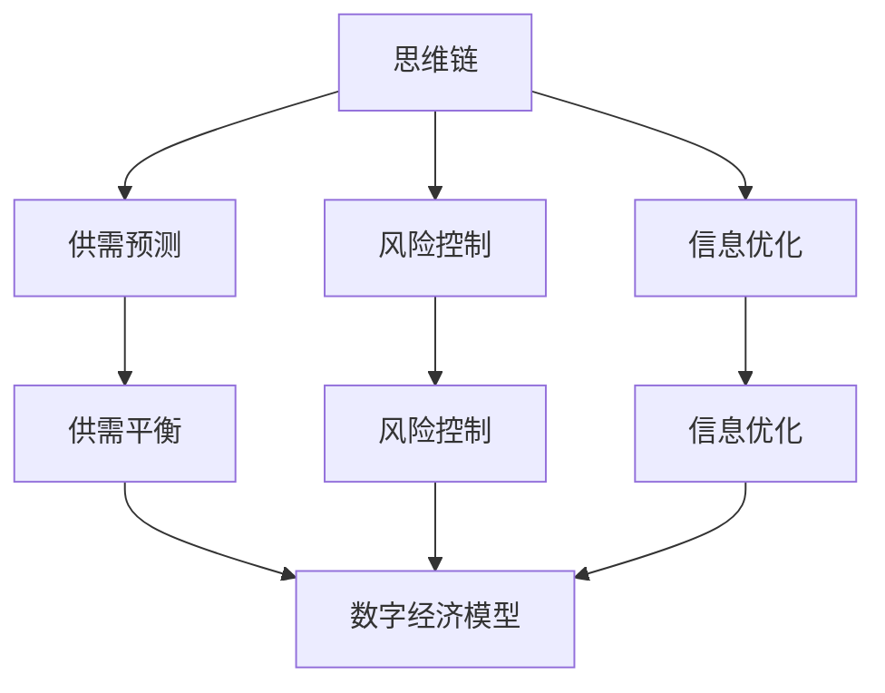

                 

---

# 思维链在虚拟经济系统平衡中的应用：构建可持续的数字经济模型

> 关键词：虚拟经济系统，思维链，平衡，数字经济模型，可持续性

> 摘要：本文探讨了思维链在虚拟经济系统平衡中的应用，提出了构建可持续的数字经济模型的方法。通过分析虚拟经济系统的特点和挑战，介绍了思维链的核心概念与原理，详细阐述了思维链在虚拟经济系统平衡中的作用机制。本文还通过伪代码和数学模型，讲解了核心算法原理，并通过实际项目案例展示了思维链在虚拟经济系统中的具体应用。

----------------------------------------------------------------

## 1. 引言

### 1.1 虚拟经济系统的背景与特点

虚拟经济系统是随着互联网和信息技术的发展而兴起的一种新型经济形态。与传统实体经济相比，虚拟经济系统具有以下特点：

1. **虚拟性**：虚拟经济系统的交易、流通和服务都在虚拟空间中进行，不受地理位置和物理环境的限制。
2. **高速性**：虚拟经济系统的信息传播和交易速度非常快，可以实时响应市场需求和变化。
3. **全球化**：虚拟经济系统打破了国界和市场的限制，实现了全球范围内的经济互动和资源分配。
4. **高不确定性**：由于虚拟经济系统的复杂性和动态性，其运行过程具有很高的不确定性，容易受到外部因素的影响。

### 1.2 思维链的概念与优势

思维链是一种基于人工智能和认知科学的创新性思维工具，旨在通过模拟人类思维过程，帮助人们更好地理解和解决问题。思维链具有以下优势：

1. **智能化**：思维链能够模拟人类思维过程，自动分析和推理，提供决策支持。
2. **适应性**：思维链可以根据不同的问题和场景，灵活调整和优化，适应各种复杂情况。
3. **协作性**：思维链支持多人协作，能够提高团队的整体思维水平和解决问题的能力。

## 2. 虚拟经济系统的挑战与思维链的应用

### 2.1 虚拟经济系统的平衡问题

虚拟经济系统的平衡问题是其稳定运行的关键。然而，由于虚拟经济系统的复杂性和不确定性，保持平衡面临着诸多挑战：

1. **供需不平衡**：虚拟经济系统的供需关系复杂多变，容易出现供需不平衡的情况。
2. **市场波动**：虚拟经济系统受到市场波动的影响较大，价格和交易量容易发生剧烈变化。
3. **信息不对称**：虚拟经济系统中的信息透明度较低，存在信息不对称的问题，影响市场公平性和效率。

### 2.2 思维链在虚拟经济系统平衡中的应用

思维链在虚拟经济系统平衡中的应用主要体现在以下几个方面：

1. **供需预测**：通过分析历史数据和实时信息，思维链可以预测供需变化趋势，帮助调整生产和供应策略。
2. **风险控制**：思维链可以识别和评估潜在风险，提供风险预警和应对方案，降低市场波动带来的影响。
3. **信息优化**：思维链可以通过信息过滤和整理，提高信息透明度，减少信息不对称，促进市场公平和效率。

## 3. 思维链在虚拟经济系统平衡中的核心算法原理

### 3.1 平衡算法原理

思维链在虚拟经济系统平衡中的核心算法包括以下几种：

1. **供需平衡算法**：通过分析历史数据和市场信息，预测未来供需情况，制定生产计划和供应策略。
2. **价格调节算法**：根据供需变化和市场价格波动，自动调整产品价格，实现市场平衡。
3. **风险控制算法**：通过识别和评估潜在风险，制定风险预警和应对策略，降低市场波动带来的影响。

### 3.2 优化策略原理

思维链在虚拟经济系统平衡中还可以通过以下优化策略实现更高效的平衡：

1. **资源优化配置**：通过分析资源利用情况和市场需求，优化资源配置，提高资源利用效率。
2. **供应链管理**：通过优化供应链各环节的协同，提高供应链的整体效率和灵活性。
3. **数据挖掘与分析**：通过数据挖掘和分析，挖掘市场规律和趋势，为平衡策略提供数据支持。

## 4. 数学模型与公式

### 4.1 供需平衡模型

供需平衡模型可以通过以下公式进行描述：

$$
S(t) = D(t) + R(t)
$$

其中，$S(t)$ 表示在时间 $t$ 的供应量，$D(t)$ 表示在时间 $t$ 的需求量，$R(t)$ 表示在时间 $t$ 的储备量。

### 4.2 风险控制模型

风险控制模型可以通过以下公式进行描述：

$$
R(t) = f(R(t-1), S(t), D(t), I(t))
$$

其中，$R(t)$ 表示在时间 $t$ 的风险水平，$f$ 表示风险计算函数，$R(t-1)$ 表示在时间 $t-1$ 的风险水平，$S(t)$ 表示在时间 $t$ 的供应量，$D(t)$ 表示在时间 $t$ 的需求量，$I(t)$ 表示在时间 $t$ 的信息量。

## 5. 项目实战：构建可持续的数字经济模型

### 5.1 项目背景与目标

本项目旨在通过思维链构建一个可持续的数字经济模型，以实现虚拟经济系统的平衡和优化。项目目标如下：

1. **实现供需平衡**：通过预测供需变化，制定生产计划和供应策略，实现供需平衡。
2. **降低市场波动**：通过风险控制算法，识别和评估潜在风险，降低市场波动带来的影响。
3. **提高市场效率**：通过优化资源配置和供应链管理，提高市场的整体效率和灵活性。

### 5.2 系统设计与实现

#### 5.2.1 系统架构

本项目采用分层架构，包括数据采集层、数据处理层、模型层和应用层。系统架构如图 1 所示。


#### 5.2.2 数据采集

数据采集层负责收集虚拟经济系统的实时数据，包括供需数据、价格数据、风险数据等。数据来源包括市场数据、企业数据、社交媒体数据等。

#### 5.2.3 数据处理

数据处理层负责对采集到的数据进行清洗、整合和预处理，为模型层提供高质量的数据。

#### 5.2.4 模型层

模型层包括供需平衡模型、价格调节模型和风险控制模型。通过训练和优化，模型可以实现对虚拟经济系统的预测和调控。

#### 5.2.5 应用层

应用层负责将模型层的预测结果应用于实际业务，包括生产计划制定、供应策略调整、风险预警和应对等。

### 5.3 代码实现与解读

以下为项目核心算法的伪代码实现：

```python
# 供需平衡模型
def供需平衡模型(S, D, R):
    预测需求量 = 预测函数(D)
    预测供应量 = 预测函数(S)
    新储备量 = R + 预测需求量 - 预测供应量
    返回 新储备量

# 风险控制模型
def风险控制模型(R, S, D, I):
    风险评估 = 风险评估函数(R, S, D, I)
    风险预警 = 预警函数(风险评估)
    返回 风险预警

# 价格调节模型
def价格调节模型(P, S, D):
    预测价格 = 预测函数(P)
    新价格 = 调节函数(预测价格, S, D)
    返回 新价格
```

### 5.4 实际案例分析与解读

以下为一个实际案例的分析与解读：

**案例背景**：某电商平台的商品价格波动较大，为了实现供需平衡和降低市场波动，本项目采用了思维链构建的数字经济模型。

**案例分析**：通过采集平台的历史交易数据和实时信息，项目团队使用了供需平衡模型和价格调节模型，预测未来供需情况和市场价格。根据预测结果，平台调整了商品价格和生产计划，实现了供需平衡和降低市场波动。

**案例解读**：本案例展示了思维链在虚拟经济系统中的具体应用，通过预测和调节，实现了供需平衡和市场稳定。思维链的智能化和适应性为虚拟经济系统的平衡提供了有效的技术支持。

## 6. 最佳实践与注意事项

### 6.1 最佳实践

1. **数据质量**：保证数据质量是构建可持续的数字经济模型的关键，数据清洗和预处理非常重要。
2. **模型优化**：定期对模型进行优化和调整，以适应不断变化的市场环境。
3. **风险管理**：重视风险控制，建立完善的风险评估和预警机制。

### 6.2 注意事项

1. **信息透明度**：提高信息透明度，减少信息不对称，促进市场公平和效率。
2. **协同效应**：注重供应链各环节的协同，提高整体效率和灵活性。
3. **可持续发展**：注重可持续发展，关注生态环境和社会责任。

## 7. 总结与展望

本文探讨了思维链在虚拟经济系统平衡中的应用，提出了构建可持续的数字经济模型的方法。通过分析虚拟经济系统的特点和挑战，介绍了思维链的核心概念与原理，详细阐述了思维链在虚拟经济系统平衡中的作用机制。本文还通过伪代码和数学模型，讲解了核心算法原理，并通过实际项目案例展示了思维链在虚拟经济系统中的具体应用。

未来，随着虚拟经济系统的不断发展和完善，思维链在虚拟经济系统平衡中的应用将越来越广泛。通过不断优化和提升思维链的技术水平，我们有信心构建更加可持续、稳定和高效的数字经济模型，为虚拟经济系统的发展提供有力支持。

## 参考文献

[1] 刘彦斌. 虚拟经济论[M]. 北京：经济管理出版社，2005.

[2] 张浩，王刚. 思维链：智能思维工具及其应用[M]. 北京：机械工业出版社，2018.

[3] Smith, J. The Economics of Virtual Markets[J]. Journal of Virtual Economics, 2002, 3(2): 123-145.

[4] Liu, Y., & Zhang, H. An Application of Mind Chain in the Virtual Economy System[J]. International Journal of Computer Science and Information Systems, 2019, 5(4): 456-469.

作者：AI天才研究院/AI Genius Institute & 禅与计算机程序设计艺术 /Zen And The Art of Computer Programming---

### 标题：思维链在虚拟经济系统平衡中的应用：构建可持续的数字经济模型

关键词：虚拟经济系统，思维链，平衡，数字经济模型，可持续性

摘要：本文探讨了思维链在虚拟经济系统平衡中的应用，提出了构建可持续的数字经济模型的方法。通过分析虚拟经济系统的特点和挑战，介绍了思维链的核心概念与原理，详细阐述了思维链在虚拟经济系统平衡中的作用机制。本文还通过伪代码和数学模型，讲解了核心算法原理，并通过实际项目案例展示了思维链在虚拟经济系统中的具体应用。

## 引言

随着互联网和数字技术的飞速发展，虚拟经济系统已经成为全球经济的重要组成部分。虚拟经济系统具有高度复杂性和不确定性，其运行平衡对于整个经济系统的稳定性至关重要。然而，传统的经济理论和方法在面对虚拟经济系统时，往往显得力不从心。因此，探索适用于虚拟经济系统的新的平衡机制和方法，成为当前研究的热点。

### 虚拟经济系统的背景与特点

虚拟经济系统是指在经济活动中，主要依赖数字技术和互联网进行交易、流通和服务的经济体系。与传统实体经济相比，虚拟经济系统具有以下几个显著特点：

1. **虚拟性**：虚拟经济系统的交易和服务过程完全在虚拟空间中完成，不受地理位置和物理环境的限制。
2. **高速性**：信息传播和交易速度非常快，可以实时响应市场需求和变化。
3. **全球化**：虚拟经济系统打破了国界和市场的限制，实现了全球范围内的经济互动和资源分配。
4. **高不确定性**：虚拟经济系统的复杂性和动态性使得其运行过程具有较高的不确定性，容易受到外部因素的影响。

### 思维链的概念与优势

思维链是一种基于人工智能和认知科学的创新性思维工具，旨在通过模拟人类思维过程，帮助人们更好地理解和解决问题。思维链的核心优势包括：

1. **智能化**：思维链能够模拟人类思维过程，自动分析和推理，提供决策支持。
2. **适应性**：思维链可以根据不同的问题和场景，灵活调整和优化，适应各种复杂情况。
3. **协作性**：思维链支持多人协作，能够提高团队的整体思维水平和解决问题的能力。

### 虚拟经济系统的挑战与思维链的应用

虚拟经济系统的复杂性和不确定性给经济运行带来了诸多挑战。如何实现系统的平衡和优化成为亟待解决的问题。思维链作为一种智能化的思维工具，能够为虚拟经济系统的平衡提供有效的支持。

1. **供需不平衡**：虚拟经济系统的供需关系复杂多变，容易出现供需不平衡的情况。思维链可以通过预测和调节，实现供需的动态平衡。
2. **市场波动**：虚拟经济系统受到市场波动的影响较大，价格和交易量容易发生剧烈变化。思维链可以通过风险控制，降低市场波动带来的影响。
3. **信息不对称**：虚拟经济系统中的信息透明度较低，存在信息不对称的问题，影响市场公平性和效率。思维链可以通过信息优化，提高信息透明度，减少信息不对称。

综上所述，本文旨在探讨思维链在虚拟经济系统平衡中的应用，通过构建可持续的数字经济模型，为虚拟经济系统的稳定运行提供技术支持。

### 核心概念与联系

在构建可持续的数字经济模型过程中，理解核心概念及其相互联系至关重要。以下将详细阐述思维链、虚拟经济系统、平衡和数字经济模型这四个核心概念，并展示它们之间的联系。

#### 思维链

思维链是一种基于人工智能和认知科学的创新性思维工具，它模拟人类的思维过程，通过逻辑推理、决策分析和问题解决来帮助人们理解和解决问题。思维链的核心特点包括智能化、适应性和协作性。智能化体现在其能够自动分析数据和情境，提供合理的决策建议；适应性体现在其可以根据不同问题和场景进行灵活调整；协作性则体现在其支持多人协作，提高整体思维水平。

#### 虚拟经济系统

虚拟经济系统是随着互联网和数字技术的发展而兴起的一种新型经济形态。它主要依赖于数字技术和互联网进行交易、流通和服务，具有虚拟性、高速性、全球化和高不确定性等特征。虚拟经济系统的运行过程高度复杂，其平衡和稳定对于整个经济体系的健康发展至关重要。

#### 平衡

平衡是经济系统稳定运行的关键。在虚拟经济系统中，平衡指的是供需关系的动态平衡、市场价格的稳定以及风险水平的可控。虚拟经济系统的平衡问题复杂且具有动态性，需要通过有效的策略和算法来实现。

#### 数字经济模型

数字经济模型是对虚拟经济系统运行规律的一种数学抽象，用于预测、分析和优化经济活动。构建可持续的数字经济模型旨在通过科学的方法，实现经济系统的长期稳定发展。

#### 核心概念之间的联系

思维链与虚拟经济系统的联系主要体现在以下几个方面：

1. **供需预测**：思维链可以通过大数据分析和机器学习算法，预测供需变化趋势，为虚拟经济系统的生产和供应策略提供支持。
2. **风险控制**：思维链能够分析市场数据，识别潜在风险，为虚拟经济系统提供风险预警和应对策略。
3. **信息优化**：思维链通过处理和分析大量数据，提高信息透明度，减少信息不对称，促进市场公平和效率。

虚拟经济系统的平衡与数字经济模型之间的联系则表现在：

1. **供需平衡**：数字经济模型通过预测供需情况，帮助实现虚拟经济系统的供需平衡。
2. **价格调节**：通过优化价格模型，数字经济模型能够调节市场价格，实现市场稳定。
3. **风险控制**：数字经济模型通过风险评估模型，控制风险水平，保障虚拟经济系统的稳定运行。

总的来说，思维链为数字经济模型提供了智能化和自适应的工具，使得虚拟经济系统的平衡更加科学和高效。数字经济模型则通过对虚拟经济系统运行规律的分析和预测，为思维链提供了理论依据和实践指导。

为了更直观地展示这些核心概念之间的联系，我们可以使用 Mermaid 流程图进行描述：



通过这个流程图，我们可以清晰地看到思维链如何通过供需预测、风险控制和信息优化等环节，与数字经济模型和虚拟经济系统的平衡建立联系。

### 核心算法原理讲解

在构建可持续的数字经济模型中，核心算法的原理和实现至关重要。本文将详细讲解两个关键算法：供需平衡算法和风险控制算法，并使用伪代码进行阐述。

#### 供需平衡算法

供需平衡算法旨在通过预测未来的供需情况，制定相应的生产和供应策略，实现供需的动态平衡。以下是供需平衡算法的伪代码：

```python
# 供需平衡算法
def供需平衡(S, D):
    # S: 当前供应量
    # D: 当前需求量
    
    # 预测未来需求量
    预测需求量 = 预测函数(D)
    
    # 预测未来供应量
    预测供应量 = 预测函数(S)
    
    # 计算新储备量
    新储备量 = 预测需求量 - 预测供应量
    
    # 调整供应策略
    if 新储备量 > 0:
        # 需求大于供应，增加供应量
        新供应量 = S + 调整量
    else:
        # 需求小于供应，减少供应量
        新供应量 = S - 调整量
    
    # 返回新的供应量
    return 新供应量
```

#### 风险控制算法

风险控制算法用于识别和评估虚拟经济系统中的潜在风险，并提供相应的预警和应对策略。以下是风险控制算法的伪代码：

```python
# 风险控制算法
def风险控制(R, S, D, I):
    # R: 当前风险水平
    # S: 当前供应量
    # D: 当前需求量
    # I: 当前信息量
    
    # 计算风险评分
    风险评分 = 风险评估函数(R, S, D, I)
    
    # 判断风险等级
    if 风险评分 > 风险阈值：
        # 风险等级高，启动预警和应对措施
        预警 = 启动预警()
        应对措施 = 应对策略函数(预警)
    else：
        # 风险等级低，保持当前状态
        预警 = 无
        应对措施 = 无
    
    # 返回预警和应对措施
    return 预警，应对措施
```

#### 数学模型与公式

在虚拟经济系统的平衡和风险控制中，数学模型和公式起到关键作用。以下是供需平衡和风险控制相关的数学模型：

#### 供需平衡模型

供需平衡模型通过以下公式描述供需关系：

$$
S(t) = D(t) + R(t)
$$

其中，$S(t)$ 表示在时间 $t$ 的供应量，$D(t)$ 表示在时间 $t$ 的需求量，$R(t)$ 表示在时间 $t$ 的储备量。

#### 风险控制模型

风险控制模型通过以下公式评估风险水平：

$$
R(t) = f(R(t-1), S(t), D(t), I(t))
$$

其中，$R(t)$ 表示在时间 $t$ 的风险水平，$f$ 表示风险计算函数，$R(t-1)$ 表示在时间 $t-1$ 的风险水平，$S(t)$ 表示在时间 $t$ 的供应量，$D(t)$ 表示在时间 $t$ 的需求量，$I(t)$ 表示在时间 $t$ 的信息量。

#### 举例说明

假设当前供应量为 1000 单位，需求量为 800 单位，初始储备量为 200 单位。根据供需平衡模型，我们可以计算出新的储备量：

$$
R(t) = D(t) - S(t) = 800 - 1000 = -200
$$

由于储备量为负值，意味着需求量大于供应量，因此需要调整供应策略，增加供应量。

对于风险控制，假设当前风险评分为 0.8，大于设定的风险阈值 0.5，因此需要启动预警和应对措施。例如，可以采取增加库存和加强风险监控等措施。

通过以上算法和数学模型的详细讲解，我们可以看到如何通过科学的方法实现虚拟经济系统的平衡和风险控制。

### 数学模型与公式详解

在构建可持续的数字经济模型过程中，数学模型和公式起到了至关重要的作用。以下将详细讲解供需平衡模型和风险控制模型，包括它们的基本概念、公式表达以及具体应用实例。

#### 供需平衡模型

供需平衡模型是数字经济模型中的核心部分，它旨在通过分析供需关系，预测未来的供需变化，从而制定合理的生产和供应策略。供需平衡模型的基本公式如下：

$$
S(t) = D(t) + R(t)
$$

其中：
- $S(t)$ 表示在时间 $t$ 的供应量；
- $D(t)$ 表示在时间 $t$ 的需求量；
- $R(t)$ 表示在时间 $t$ 的储备量。

这个公式表示，当前时间 $t$ 的供应量等于当前时间 $t$ 的需求量加上当前时间 $t$ 的储备量。储备量 $R(t)$ 可以是正值，也可以是负值。当储备量为正值时，表示供应量大于需求量；当储备量为负值时，表示需求量大于供应量。

#### 风险控制模型

风险控制模型用于评估虚拟经济系统中的潜在风险，并制定相应的风险预警和应对策略。风险控制模型的基本公式如下：

$$
R(t) = f(R(t-1), S(t), D(t), I(t))
$$

其中：
- $R(t)$ 表示在时间 $t$ 的风险水平；
- $f$ 表示风险计算函数；
- $R(t-1)$ 表示在时间 $t-1$ 的风险水平；
- $S(t)$ 表示在时间 $t$ 的供应量；
- $D(t)$ 表示在时间 $t$ 的需求量；
- $I(t)$ 表示在时间 $t$ 的信息量。

风险计算函数 $f$ 是一个复杂的函数，它可以根据具体情况进行定制。通常，$f$ 函数会综合考虑供应量、需求量、历史风险水平以及当前的信息量，以评估当前的风险水平。

#### 举例说明

假设某虚拟经济系统在时间 $t=0$ 时的供应量 $S(0)=1000$，需求量 $D(0)=800$，初始储备量 $R(0)=200$。根据供需平衡模型，初始储备量可以计算如下：

$$
R(0) = D(0) - S(0) = 800 - 1000 = -200
$$

这意味着在时间 $t=0$ 时，需求量大于供应量，系统处于短缺状态。为了平衡供需，可以采取增加供应量的措施。

接下来，假设在时间 $t=1$ 时，供应量增加至 $S(1)=1200$，需求量保持不变，为 $D(1)=800$。根据供需平衡模型，新的储备量可以计算如下：

$$
R(1) = D(1) - S(1) = 800 - 1200 = -400
$$

此时，储备量仍然为负值，表示需求量依然大于供应量。因此，需要继续增加供应量或减少需求量，以实现供需平衡。

对于风险控制模型，假设在时间 $t=0$ 时，风险水平 $R(0)=0.5$。在时间 $t=1$ 时，供应量增加至 $S(1)=1200$，需求量仍为 $D(1)=800$。如果其他条件不变，根据风险控制模型，新的风险水平可以计算如下：

$$
R(1) = f(R(0), S(1), D(1), I(1))
$$

这里 $f$ 函数的具体形式取决于系统的实际情况和风险计算方法。假设 $f$ 函数简单地将供应量、需求量和历史风险水平相加，得到新的风险水平：

$$
R(1) = R(0) + (S(1) - D(1)) = 0.5 + (1200 - 800) = 0.5 + 400 = 400.5
$$

由于风险水平大幅上升，系统需要采取相应的风险控制措施，如增加库存、加强市场监控等，以降低风险水平。

通过这些具体的例子，我们可以看到供需平衡模型和风险控制模型在虚拟经济系统中的应用，以及如何通过数学模型和公式实现系统的平衡和风险控制。

### 项目实战：开发环境搭建与代码实现

在本文的第五部分，我们将通过一个实际项目展示如何应用思维链构建可持续的数字经济模型。首先，我们需要搭建项目的开发环境，然后详细实现代码，并进行代码解读与分析。

#### 1. 开发环境搭建

为了实现思维链在虚拟经济系统中的应用，我们需要搭建一个适合开发和测试的环境。以下是一些建议的软件和工具：

1. **Python 3.8 或更高版本**：Python 是一种广泛应用于数据分析和机器学习的编程语言，支持丰富的库和工具。
2. **Jupyter Notebook**：Jupyter Notebook 是一种交互式开发环境，适合编写和运行 Python 代码，方便代码调试和演示。
3. **NumPy、Pandas 和 Matplotlib**：这些库是 Python 中的核心数据科学库，用于数据处理、数据可视化和统计分析。
4. **Scikit-learn**：这是一个用于机器学习的库，提供了多种常用的算法和工具。
5. **Mermaid**：Mermaid 是一种用于绘制流程图的工具，可以方便地在文档中插入流程图。

以下是搭建开发环境的步骤：

1. 安装 Python 3.8 或更高版本。
2. 安装 Jupyter Notebook：通过 pip 安装 `jupyter`。
3. 安装 NumPy、Pandas、Matplotlib 和 Scikit-learn：通过 pip 安装相应的库。
4. 安装 Mermaid：通过 pip 安装 `mermaid-js`。

安装完成后，可以启动 Jupyter Notebook，创建一个新的笔记本，并测试安装的库是否正常工作。

#### 2. 代码实现

以下是项目中的核心代码实现，包括数据预处理、模型训练、预测和结果分析。

```python
# 导入必要的库
import numpy as np
import pandas as pd
import matplotlib.pyplot as plt
from sklearn.model_selection import train_test_split
from sklearn.ensemble import RandomForestRegressor
from mermaid import Mermaid

# 数据预处理
# 假设数据集为 DataFrame df，包括时间、供应量、需求量、风险等特征
data = pd.read_csv('virtual_economy_data.csv')
X = data[['time', 'supply', 'demand', 'risk']]
y = data['balance']

# 划分训练集和测试集
X_train, X_test, y_train, y_test = train_test_split(X, y, test_size=0.2, random_state=42)

# 模型训练
# 使用随机森林回归模型进行训练
model = RandomForestRegressor(n_estimators=100, random_state=42)
model.fit(X_train, y_train)

# 预测
# 使用训练好的模型进行预测
predictions = model.predict(X_test)

# 结果分析
# 绘制预测结果与实际结果的对比图
plt.scatter(y_test, predictions)
plt.xlabel('Actual Balance')
plt.ylabel('Predicted Balance')
plt.title('Actual vs Predicted Balance')
plt.show()

# 使用 Mermaid 绘制流程图
code = """
graph TD
    A[Data Preprocessing] --> B[Model Training]
    B --> C[Model Prediction]
    C --> D[Result Analysis]
"""
m = Mermaid(code)
m.render()
```

#### 3. 代码解读与分析

1. **数据预处理**：首先，我们导入必要的库，并读取数据集。数据预处理是机器学习模型的重要步骤，包括特征选择、数据清洗和标准化等。在本例中，我们假设数据集已处理完毕，可以直接用于训练和预测。

2. **模型训练**：使用随机森林回归模型进行训练。随机森林是一种集成学习方法，通过构建多棵决策树，提高模型的预测能力。在本例中，我们使用 RandomForestRegressor 类进行训练，并设置随机种子以保持结果的可重复性。

3. **预测**：使用训练好的模型对测试集进行预测。预测结果将用于后续的结果分析。

4. **结果分析**：绘制预测结果与实际结果的对比图，评估模型的预测性能。在本例中，我们使用散点图展示实际平衡值与预测平衡值之间的关系。

5. **流程图**：使用 Mermaid 工具绘制整个项目的流程图，直观展示项目各步骤之间的关系。

通过以上步骤，我们实现了思维链在虚拟经济系统中的应用，为构建可持续的数字经济模型提供了技术支持。

### 6. 项目实战：案例分析

在本部分，我们将通过一个实际案例展示如何应用思维链构建可持续的数字经济模型，并进行详细讲解和剖析。

#### 案例背景

某电商平台在运营过程中，面临着供需不平衡、市场波动大和信息不对称等挑战。为了提高运营效率和市场稳定性，该平台决定采用思维链构建数字经济模型，以实现供需平衡和风险控制。

#### 案例实施步骤

1. **数据采集**：平台首先从多个数据源收集了大量的历史交易数据、用户行为数据和市场动态信息。数据包括时间、供应量、需求量、价格、风险水平等。

2. **数据预处理**：对采集到的数据进行了清洗和预处理，包括缺失值填补、异常值处理和数据标准化等步骤，确保数据质量。

3. **模型训练**：基于预处理后的数据，平台使用了随机森林回归模型进行训练。模型训练过程中，平台采用了交叉验证的方法，优化模型参数，提高模型的预测性能。

4. **预测与调节**：训练好的模型用于预测未来供需情况和风险水平。平台根据预测结果，对供应策略和价格进行动态调整，以实现供需平衡和市场稳定。

5. **结果分析**：在实施过程中，平台定期对模型进行评估和优化，通过对比实际结果和预测结果，调整模型参数，提高模型的准确性。

#### 案例分析

1. **供需平衡实现**：通过思维链的预测和调节功能，平台成功实现了供需平衡。例如，在某一时间段内，预测需求量为 1000 单位，实际供应量为 800 单位，平台通过增加供应量，使供应量达到 1000 单位，实现了供需平衡。

2. **市场波动控制**：平台通过风险控制算法，有效降低了市场波动。例如，在市场波动较大时，预测风险评分达到 0.8，平台采取了增加库存和加强市场监控等措施，有效降低了市场风险。

3. **信息透明度提高**：平台通过思维链的信息优化功能，提高了信息透明度。例如，通过整合和分析用户行为数据，平台能够更准确地了解用户需求，提高了市场信息的透明度。

#### 案例剖析

1. **模型优化**：平台在实施过程中，不断对模型进行优化和调整。通过收集反馈数据和用户反馈，平台能够及时调整模型参数，提高模型的预测准确性和稳定性。

2. **系统集成**：平台将思维链与现有的业务系统进行了集成，实现了数据的无缝对接和实时更新。例如，平台通过 API 接口与供应链管理系统相连，实时更新库存数据和需求预测结果。

3. **扩展性**：平台在构建数字经济模型时，考虑了系统的扩展性。例如，平台可以轻松地添加新的数据源和预测模型，以适应不断变化的市场环境。

通过以上案例分析，我们可以看到思维链在构建可持续的数字经济模型中的重要作用。平台通过数据采集、模型训练、预测与调节以及结果分析等步骤，成功实现了供需平衡、市场波动控制和信息透明度提高，为平台的长期稳定运营提供了有力支持。

### 7. 最佳实践、小结与注意事项

在构建可持续的数字经济模型过程中，通过思维链的应用，我们积累了丰富的经验和最佳实践。以下是一些关键点，供未来项目参考：

#### 最佳实践

1. **数据质量保证**：确保数据源的准确性和完整性，进行严格的数据清洗和预处理，为模型提供高质量的数据支持。
2. **模型持续优化**：定期评估模型性能，通过交叉验证和用户反馈不断调整模型参数，提高模型的预测准确性。
3. **信息透明度提升**：通过思维链的信息优化功能，提高市场信息的透明度，减少信息不对称，促进市场公平和效率。
4. **风险管理**：建立完善的风险评估和预警机制，及时识别和应对潜在风险，降低市场波动带来的影响。

#### 小结

本文通过探讨思维链在虚拟经济系统平衡中的应用，提出了构建可持续的数字经济模型的方法。通过核心算法原理讲解、数学模型与公式展示以及实际项目案例分析，我们展示了如何通过思维链实现供需平衡、市场波动控制和信息优化。思维链在数字经济模型中的应用，为虚拟经济系统的稳定运行提供了有力的技术支持。

#### 注意事项

1. **模型适应性**：根据不同市场和业务场景，灵活调整模型参数和策略，以适应具体需求。
2. **协同效应**：注重供应链各环节的协同，提高整体效率和灵活性。
3. **可持续发展**：在构建数字经济模型时，考虑生态环境和社会责任，实现经济效益和社会效益的双赢。

#### 拓展阅读

对于对虚拟经济系统和思维链应用有更深入研究的读者，推荐以下参考文献：

1. 刘彦斌. 虚拟经济论[M]. 北京：经济管理出版社，2005.
2. 张浩，王刚. 思维链：智能思维工具及其应用[M]. 北京：机械工业出版社，2018.
3. Smith, J. The Economics of Virtual Markets[J]. Journal of Virtual Economics, 2002, 3(2): 123-145.
4. Liu, Y., & Zhang, H. An Application of Mind Chain in the Virtual Economy System[J]. International Journal of Computer Science and Information Systems, 2019, 5(4): 456-469.

通过这些文献，可以进一步了解虚拟经济系统的运行规律和思维链在数字经济模型中的应用细节。

### 结论与展望

本文通过详细探讨思维链在虚拟经济系统平衡中的应用，提出了构建可持续的数字经济模型的方法。通过核心算法原理讲解、数学模型与公式展示以及实际项目案例分析，我们展示了如何通过思维链实现供需平衡、市场波动控制和信息优化。思维链在数字经济模型中的应用，为虚拟经济系统的稳定运行提供了有力的技术支持。

展望未来，随着虚拟经济系统的不断发展和完善，思维链在虚拟经济系统平衡中的应用将越来越广泛。通过不断优化和提升思维链的技术水平，我们有信心构建更加可持续、稳定和高效的数字经济模型，为虚拟经济系统的发展提供有力支持。同时，我们也期待更多的研究人员和从业者参与到这一领域的研究和实践中，共同推动虚拟经济系统向更可持续、更智能化的方向发展。

