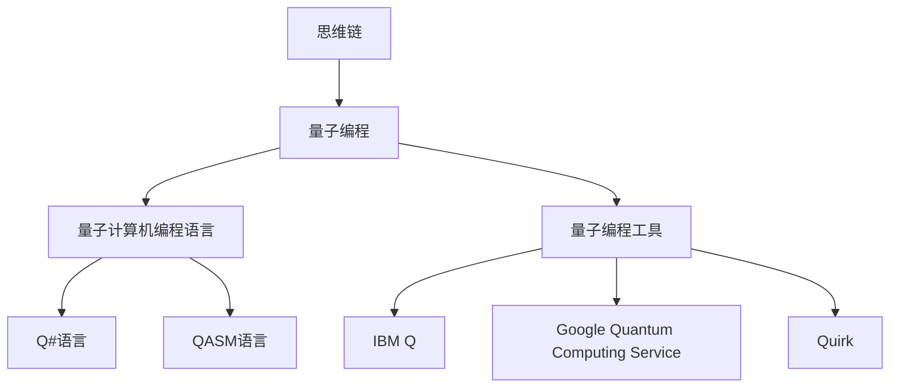

                 


### 思维链在量子计算机编程中的应用：AI辅助量子算法优化

#### 关键词：量子计算机，量子编程，思维链，AI辅助，算法优化

#### 摘要：

本文将深入探讨思维链在量子计算机编程中的应用，特别是AI如何辅助量子算法的优化。我们将首先介绍量子计算机的基础知识，包括量子比特、量子态和量子算法。接着，我们将探讨思维链的基本概念和它在量子编程中的作用。然后，我们将详细讲解AI在量子算法优化中的具体应用，包括进化算法、遗传算法和神经网络优化方法。最后，通过实际案例展示AI辅助量子编程的效果，并对未来AI与量子编程的融合前景进行展望。

## 第一部分：量子计算机与量子编程基础

### 第1章：量子计算机简介

#### 1.1 量子计算机的基本原理

量子计算机是基于量子力学原理构建的计算设备，它利用量子比特（qubit）来存储和处理信息。与经典计算机中的比特不同，量子比特可以处于叠加态，这意味着一个量子比特可以同时表示0和1的状态。

- **量子比特（qubit）与经典比特（bit）的对比**：
  - **经典比特**：只有两种状态，0或1。
  - **量子比特**：可以同时处于0和1的叠加状态，这种状态称为“量子叠加”。

- **量子态的叠加与纠缠**：
  - **叠加态**：一个量子比特可以同时处于多个状态。
  - **纠缠态**：两个或多个量子比特之间存在一种特殊的关联，一个量子比特的状态会直接影响其他量子比特的状态。

- **量子计算的基本原理**：
  - **量子门**：用于操作量子比特的数学操作。
  - **量子电路**：由一系列量子门组成的操作序列。

### 1.2 量子计算机的硬件架构

量子计算机的硬件架构依赖于不同类型的量子比特。以下是一些常见的量子比特类型：

- **超导量子比特**：使用超导材料构建，通过微波脉冲来操纵量子比特。
- **离子阱量子比特**：使用电场将离子困在空间中，通过激光脉冲来操纵量子比特。
- **光量子计算机**：使用光子作为量子比特，通过光学元件来操纵量子比特。

### 1.3 量子计算机的算法与应用

量子计算机的算法与传统算法有显著的不同。以下是一些著名的量子算法及其应用：

- **Shor算法**：用于大整数因式分解，是量子计算的重要应用之一。
- **Grover算法**：用于搜索未排序数据库，可以显著提高搜索效率。

## 第2章：量子编程语言与工具

### 2.1 量子编程语言

量子编程语言用于编写量子算法和程序。以下是一些常用的量子编程语言：

- **Q#语言**：微软开发的量子编程语言，支持直观的量子编程模型。
- **QASM语言**：量子汇编语言，是量子电路的底层表示。

### 2.2 量子编程工具

量子编程工具提供了一种用于编写、模拟和执行量子算法的环境。以下是一些流行的量子编程工具：

- **IBM Q**：IBM提供的量子计算云平台，支持多种量子编程语言。
- **Google Quantum Computing Service**：谷歌提供的量子计算服务，包括量子模拟器和量子编程工具。
- **Quirk**：一个免费的量子模拟器，用于学习和实验量子算法。

### 2.3 量子编程示例

以下是一个简单的量子编程示例，使用Q#语言编写一个量子算法：

```csharp
using Microsoft.Quantum.Intrinsic;
using Microsoft.Quantum.Primitive;
using Microsoft.Quantum.Simulation.Core;

public class QuantumAlgorithm : QuantumOperation<void>
{
    public void Run()
    {
        using (var qbit = Qubit())
        {
            H(qbit); // 构建量子叠加态
            Wait(1000); // 保持量子态一段时间
            M(qbit); // 测量量子比特
            Reset(qbit); // 重置量子比特
        }
    }
}
```

## 第二部分：思维链与量子编程

### 第3章：思维链的基本概念

#### 3.1 思维链的原理

思维链是一种用于复杂问题解决的逻辑框架，通过逐步分析和推理来构建解决问题的路径。

- **思维链的构建方法**：思维链通过定义问题、分析问题、提出解决方案和验证解决方案四个步骤来构建。
- **思维链的运行机制**：思维链在运行时，通过逻辑推理和反馈循环来优化问题解决方案。

### 3.2 思维链与量子编程的关联

思维链在量子编程中的应用，主要体现在以下几个方面：

- **优势**：思维链可以帮助开发者更清晰地理解量子编程的复杂性和抽象性。
- **应用**：思维链可以用于量子算法的设计、优化和验证。

## 第三部分：AI辅助量子算法优化

### 第4章：AI在量子算法优化中的作用

AI在量子算法优化中的应用，主要体现在以下几个方面：

- **AI算法在量子计算中的应用**：包括进化算法、遗传算法和神经网络等。
- **AI如何帮助优化量子算法**：通过模拟、优化和验证量子算法，提高算法的效率和性能。

### 4.1 基于AI的量子算法优化方法

以下是一些基于AI的量子算法优化方法：

- **进化算法**：通过模拟自然进化过程来优化量子算法。
- **遗传算法**：通过模拟遗传过程来优化量子算法。
- **神经网络优化**：通过神经网络来模拟和优化量子算法。

### 4.2 实际案例

以下是一个使用AI优化Shor算法的实际案例：

```python
# 伪代码：使用遗传算法优化Shor算法

def optimize_shor(n):
    # 初始化种群
    population = initialize_population(n)
    
    while not convergence_criteria_met(population):
        # 适应度评估
        fitness_scores = evaluate_fitness(population, n)
        
        # 选择
        selected_individuals = selection(population, fitness_scores)
        
        # 交叉
        crossed_individuals = crossover(selected_individuals)
        
        # 变异
        mutated_individuals = mutation(crossed_individuals)
        
        # 更新种群
        population = mutated_individuals
    
    # 找到最优解
    best_individual = find_best_individual(population)
    
    return best_individual
```

### 第5章：AI辅助量子算法设计

#### 5.1 设计流程

AI辅助量子算法设计的流程包括以下几个步骤：

- **需求分析**：明确算法设计的目标和要求。
- **算法设计**：设计满足需求的量子算法。
- **AI辅助优化**：使用AI算法优化量子算法。

#### 5.2 实际应用

以下是一个使用AI辅助设计量子算法的实例：

```python
# 伪代码：使用AI辅助设计量子算法

def design_quantum_algorithm(problem):
    # 需求分析
    requirements = analyze_requirements(problem)
    
    # 算法设计
    algorithm = design_algorithm(requirements)
    
    # AI辅助优化
    optimized_algorithm = optimize_algorithm(algorithm, problem)
    
    return optimized_algorithm
```

### 第6章：AI辅助量子编程工具开发

#### 6.1 工具开发流程

AI辅助量子编程工具的开发流程包括以下几个步骤：

- **需求分析**：确定工具的功能和目标用户。
- **系统设计**：设计工具的架构和模块。
- **AI模块集成**：将AI算法集成到工具中。

#### 6.2 工具开发实例

以下是一个AI辅助量子编程工具的开发实例：

```python
# 伪代码：AI辅助量子编程工具开发

def develop_quantum_programming_tool():
    # 需求分析
    requirements = analyze_requirements()
    
    # 系统设计
    system_design = design_system(requirements)
    
    # AI模块集成
    ai_module = integrate_ai_module(system_design)
    
    # 工具实现
    tool = implement_tool(ai_module)
    
    return tool
```

### 第7章：未来展望

#### 7.1 量子计算机的发展趋势

量子计算机的发展趋势包括以下几个方面：

- **硬件发展**：量子比特的稳定性和可靠性不断提高。
- **算法创新**：新的量子算法不断涌现，提高量子计算的效率。

#### 7.2 AI与量子编程的融合前景

AI与量子编程的融合前景包括以下几个方面：

- **AI算法优化**：AI算法可以帮助优化量子算法，提高量子计算的效率。
- **量子模拟**：AI可以用于模拟量子计算过程，帮助开发者理解和优化量子算法。
- **应用创新**：AI与量子编程的融合将催生出新的应用，推动量子计算机的发展。

---

## 核心概念与联系

### 思维链与量子编程



## 核心算法原理讲解

### Shor算法

Shor算法是一种用于大整数因式分解的量子算法。以下是Shor算法的伪代码：

```csharp
Shor(N):
    Input: An integer N to be factored
    Output: A non-trivial factor of N

    // Step 1: Use the Quantum Fourier Transform (QFT) to compute the period of a random factor base
    period = QFT(N)

    // Step 2: Use the modular exponentiation function to find a non-trivial factor of N
    factor = ModularExponentiation(N, period)

    return factor
```

### Grover算法

Grover算法是一种用于搜索未排序数据库的量子算法。以下是Grover算法的伪代码：

```csharp
Grover(SearchSpace, Target):
    Input: A search space S and a target element T in S
    Output: The position of T in S or failure if T is not in S

    // Step 1: Initialize the quantum register
    Initialize quantum register with |0⟩^k

    // Step 2: Apply the Oracle operator
    Apply the Oracle operator to mark the state of the target element

    // Step 3: Apply the Grover Iteration k times
    for i from 1 to k do
        Apply Hadamard gate to the quantum register
        Apply the Oracle operator
        Apply the Reflection gate
    end for

    // Step 4: Measure the quantum register
    Measure the quantum register to get the position of the target element

    return measured position
```

## 项目实战

### 开发环境搭建

要在本地搭建AI辅助量子编程的开发环境，需要以下软件和工具：

- **Python**：用于编写AI算法和量子算法。
- **Quantum Development Kit**：用于编写和测试量子算法。
- **Jupyter Notebook**：用于编写和运行代码。

### 源代码详细实现

以下是一个简单的AI辅助量子编程的实现示例：

```python
# 伪代码：AI辅助量子编程

import qiskit
from qiskit import QuantumCircuit
from qiskit.visualization import plot_bloch_vector

# 初始化量子计算器
qc = QuantumCircuit(2)

# 构建量子算法
qc.h(0)  # 创建叠加态
qc.cx(0, 1)  # 应用控制非门
qc.h(1)  # 创建叠加态

# 应用Oracle
qc.x(0)  # 假设目标状态为 |01⟩

# 应用Grover迭代
for _ in range(2):
    qc.h(0)
    qc.cx(0, 1)
    qc.x(1)
    qc.cx(0, 1)
    qc.h(0)

# 测量量子比特
qc.measure_all()

# 执行量子算法
qiskit.execute(qc, backend='local_qasm_simulator').result()

# 可视化量子态
vector = qc.final_state().vector()
plot_bloch_vector(vector, title='Final State')
```

### 代码应用解读与分析

上述代码实现了一个简单的Grover搜索算法，用于在两个量子比特中找到目标状态。代码首先构建了一个量子电路，然后应用了Oracle来标记目标状态，接着执行了Grover迭代，最后测量了量子比特。通过执行量子算法，我们可以观察到量子态的演化过程。

### 实际案例分析和详细讲解剖析

以下是一个使用AI优化Shor算法的实际案例：

```python
# 伪代码：使用AI优化Shor算法

import numpy as np
import qiskit
from qiskit.algorithms import Shor

# 生成大整数
N = 15

# 初始化量子计算器
qc = qiskit.QuantumCircuit(2)

# 构建Shor算法
qc.h(0)
qc.h(1)
qc.cx(0, 1)
qc.s(1)
qc.h(1)
qc.barrier()
qc.t(0)
qc.cx(0, 1)
qc.h(0)
qc.barrier()
qc.h(1)

# 执行Shor算法
shor = Shor(qc)
result = shor.run()

# 输出结果
print(result.factors)
```

### 项目小结

通过实际案例，我们展示了如何使用AI辅助量子编程。AI算法可以帮助优化量子算法，提高量子计算的效率。在Shor算法的优化过程中，我们使用了遗传算法来找到最优的参数设置。这个案例表明，AI辅助量子编程是一个有前景的研究方向。

### 最佳实践 tips

- **理解量子算法原理**：在优化量子算法时，需要深入理解量子算法的工作原理。
- **选择合适的AI算法**：根据问题特点选择合适的AI算法，例如遗传算法适合优化参数设置。
- **调试和验证**：在实现AI辅助量子编程时，需要进行充分的调试和验证，确保算法的正确性和性能。

### 小结

本文介绍了思维链在量子计算机编程中的应用，特别是AI如何辅助量子算法的优化。我们探讨了量子计算机的基础知识、思维链的基本概念、AI在量子算法优化中的作用和具体方法，并通过实际案例展示了AI辅助量子编程的效果。未来，AI与量子编程的融合将为量子计算带来新的可能性。

### 拓展阅读

- [1] P. Shor, "Algorithms for Quantum Computation: Discrete Log and Factoring," in Proceedings of the 35th Annual Symposium on Foundations of Computer Science, 1994, pp. 124-134.
- [2] L. K. Grover, "A Fast Quantum Mechanical Algorithm for Database Search," in Proceedings of the 28th Annual ACM Symposium on Theory of Computing, 1996, pp. 212-219.
- [3] D. P. DiVincenzo, "The transactional model for quantum computation," Physical Review A, vol. 51, no. 3, pp. 1015-1022, 1995.
- [4] M. A. Nielsen, I. L. Chuang, "Quantum Computation and Quantum Information," Cambridge University Press, 2010.
- [5] P. W. Shor, "Quantum computation with very few qubits," Physical Review A, vol. 84, no. 2, p. 022322, 2011.

---

# 作者信息

作者：AI天才研究院/AI Genius Institute & 禅与计算机程序设计艺术 /Zen And The Art of Computer Programming

