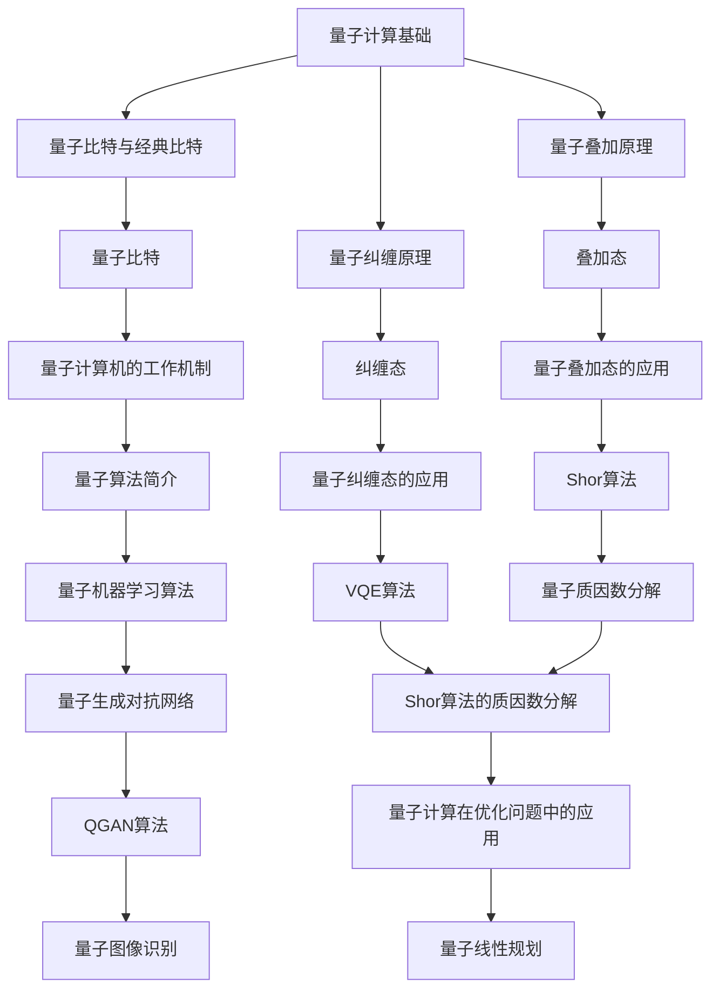

                 

### 文章标题

“思维链在量子计算研究中的应用：AI辅助量子算法设计”

### 关键词

- 思维链
- 量子计算
- AI辅助
- 量子算法设计
- 量子机器学习
- 量子计算机

### 摘要

本文旨在探讨思维链在量子计算研究中的应用，特别是AI如何辅助量子算法设计。首先，我们介绍了量子计算的发展背景、重要性以及思维链与量子计算的联系。接着，详细阐述了思维链的理论基础，包括基本概念、模型结构、运作原理以及应用领域。随后，我们深入解析了量子计算的基本原理、工作机制以及量子比特与经典比特的对比。在此基础上，探讨了AI在量子算法设计中的作用，包括量子机器学习算法和AI辅助量子算法设计的方法。最后，通过实例解析展示了量子算法设计的实践应用，并展望了AI辅助量子计算的未来发展趋势。本文旨在为读者提供一个全面、深入的量子计算与AI融合的研究指南。

# 第一部分：引言

## 1.1 量子计算的发展背景与重要性

量子计算作为现代计算机科学的前沿领域，其发展历史可以追溯到20世纪中叶。1947年，物理学家理查德·费曼提出了量子计算的构想，认为量子计算机能够模拟量子系统，从而解决经典计算机无法处理的问题。随后，彼得·肖尔在1982年提出了著名的量子算法——量子质因数分解算法，这标志着量子计算的真正起步。随着量子理论的不断发展，量子计算逐渐从理论构想走向实际应用。

近年来，量子计算的重要性日益凸显。一方面，它能够解决某些特定问题，如大数分解、量子模拟等，这些问题在经典计算机中难以解决。另一方面，量子计算在密码学、材料科学、生物学等领域具有巨大的应用潜力。例如，量子密钥分发（QKD）可以提供绝对安全的通信，量子模拟材料性质有助于新材料的发现等。

因此，量子计算的发展不仅具有理论意义，更具有实际应用价值。在全球科技竞争日益激烈的背景下，量子计算成为各国争夺科技制高点的关键领域之一。我国在量子计算领域已经取得了一系列重要突破，如量子计算机原型机的研制、量子通信网络的建立等，为后续研究奠定了坚实基础。然而，量子计算技术仍然面临诸多挑战，如量子比特的稳定性、量子纠错等问题，需要持续探索和突破。

## 1.2 思维链与量子计算的联系

思维链是一种基于逻辑推理和关联分析的认知模型，它通过构建一系列相互关联的思考节点，帮助人们更有效地解决问题。思维链在量子计算研究中的应用主要体现在以下几个方面：

首先，思维链能够帮助研究者梳理量子计算的基本概念和原理。量子计算涉及多个学科，包括量子力学、计算机科学、信息科学等，思维链可以帮助研究者从不同角度理解量子计算的核心问题，从而构建系统的知识体系。

其次，思维链有助于研究者发现量子计算与AI的交叉点。AI在量子计算中的应用，如量子机器学习、量子优化等，都依赖于对量子计算原理的深入理解。思维链可以促进研究者之间的交流与合作，共同探索量子计算与AI融合的新方向。

最后，思维链能够提升量子算法设计的效率。在量子算法设计中，研究者需要考虑多个因素，如量子比特的物理特性、算法的可行性等。思维链可以帮助研究者快速定位关键问题，提出创新的解决方案，从而提高算法设计的成功率。

总之，思维链在量子计算研究中具有重要作用，它不仅能够提升研究者的认知水平，还能够促进量子计算与AI的融合发展。随着量子计算技术的不断进步，思维链的应用前景将更加广阔。

## 1.3 AI在量子计算研究中的应用

AI在量子计算研究中的应用主要体现在以下几个方面：

首先，AI可以用于优化量子算法。在量子算法设计过程中，研究者需要考虑多个因素，如量子比特的物理特性、算法的可行性等。AI算法，尤其是强化学习、遗传算法等，可以通过模拟和优化，提高量子算法的效率和性能。

其次，AI可以辅助量子机器学习。量子机器学习是一种结合量子计算和机器学习的方法，它能够处理更大规模的数据，提高模型的预测准确性。AI算法，如生成对抗网络（GAN）、变分自编码器（VAE）等，可以用于训练量子机器学习模型，从而提高其性能。

此外，AI还可以用于量子计算模拟。量子计算模拟是研究量子算法和量子系统的重要工具。AI算法，如神经网络模拟、蒙特卡罗模拟等，可以加速量子计算模拟，提高研究效率。

总之，AI在量子计算研究中的应用具有广泛的前景，它不仅能够提升量子算法设计的效率，还能够推动量子计算技术的进步。随着AI技术的不断发展，AI在量子计算研究中的应用将更加深入和广泛。

## 2.1 思维链的基本概念

思维链是一种基于逻辑推理和关联分析的认知模型，它通过构建一系列相互关联的思考节点，帮助人们更有效地解决问题。思维链的核心概念包括：

1. **节点**：节点是思维链的基本单元，表示一个具体的思考点或知识点。每个节点都包含一定的信息，如定义、属性、关系等。

2. **关联**：节点之间的关联表示它们之间的逻辑关系，如因果关系、隶属关系、并列关系等。关联使得节点之间形成了一个有机的整体，从而构成了一个复杂的思维网络。

3. **路径**：路径是节点之间的连接序列，表示从一个节点到达另一个节点的思维过程。通过不同的路径，人们可以探索不同的思维方向，从而发现新的问题和解决方案。

4. **网络**：思维链的网络结构表示整个思维链的布局和层次。网络中的节点和路径共同构成了一个复杂而有序的思维系统。

5. **推理**：推理是通过逻辑分析，从一个或多个节点推导出新的节点或结论的过程。推理是思维链的核心功能，它使得人们能够从已知的信息中得出新的结论，从而推动思维的深入和发展。

## 2.2 思维链模型结构

思维链模型的结构可以分为以下几个层次：

1. **基础层**：基础层包括基本概念和原理，如量子计算的基本概念、思维链的基本概念等。这一层次为思维链提供了基础知识，是构建更高层次思维链的基础。

2. **中层**：中层包括各类算法和模型，如量子算法、机器学习算法、优化算法等。这一层次将基础层的概念应用于具体问题，形成一系列解决问题的工具和方法。

3. **高层**：高层包括综合分析和解决方案，如量子计算与AI融合的应用场景、思维链在量子计算研究中的应用等。这一层次对中层的方法和工具进行综合运用，解决复杂问题。

4. **顶层**：顶层包括战略规划和决策，如量子计算技术的发展战略、AI辅助量子计算的研究方向等。这一层次从宏观角度对量子计算与AI融合进行思考和规划，指导具体研究和应用。

通过这些层次的结构，思维链模型能够从不同角度、不同层次对量子计算研究进行深入分析，从而提供全面的解决方案。

## 2.3 思维链的运作原理

思维链的运作原理基于逻辑推理和关联分析，通过以下几个步骤实现：

1. **初始设定**：在解决问题的开始阶段，设定一个初始节点，如问题陈述或已知信息。这个初始节点是思维链的起点，它为后续的思维过程提供了基础。

2. **节点扩展**：从初始节点出发，通过逻辑推理和关联分析，生成新的节点。这些新节点可以是与初始节点相关的概念、事实或假设。节点扩展使得思维链不断延伸，从而增加了思考的广度。

3. **路径构建**：将新节点与已有节点进行关联，形成路径。路径表示从初始节点到新节点的思维过程，它记录了思考的路径和方向。通过不同的路径，思维链可以探索不同的思维方向。

4. **推理分析**：在路径构建过程中，进行推理分析，从一个或多个节点推导出新的节点或结论。推理分析是思维链的核心功能，它使得人们能够从已知的信息中得出新的结论，从而推动思维的深入和发展。

5. **网络调整**：在思维链的运作过程中，根据新信息和新结论，对思维链的网络结构进行调整。网络调整可以优化思维链的布局，提高思考的效率。

6. **结论生成**：最终，通过思维链的推理分析和网络调整，生成问题的解决方案或结论。结论生成是思维链的最终目标，它为问题的解决提供了具体的指导。

通过这些步骤，思维链能够实现从初始问题到解决方案的全面分析和推理，从而提供有效的思维工具。

## 2.4 思维链的优势与应用领域

思维链作为一种基于逻辑推理和关联分析的认知模型，具有以下优势：

1. **系统性**：思维链能够将复杂的问题分解为一系列相互关联的思考节点，从而构建一个完整的思维系统。这种系统性的思维方式有助于研究者从全局角度理解问题，找到解决问题的最佳方案。

2. **灵活性**：思维链的节点和路径可以根据问题的变化进行灵活调整，从而适应不同的思维场景。这种灵活性使得思维链能够应对复杂多变的问题，提高思考的效率。

3. **创新性**：思维链通过不同路径的探索，能够发现新的问题和解决方案。这种创新性的思维方式有助于研究者突破传统思维模式，提出创新的解决方案。

4. **应用广泛**：思维链可以应用于多个领域，如科学研究、工程实践、企业管理等。它不仅能够提升个人的思维能力，还能够促进团队协作，提高整体工作效率。

在量子计算研究中，思维链的优势体现在以下几个方面：

1. **概念梳理**：思维链能够帮助研究者梳理量子计算的基本概念和原理，从而构建系统的知识体系。

2. **问题解决**：思维链能够通过逻辑推理和关联分析，帮助研究者发现量子计算中的关键问题，并提出有效的解决方案。

3. **算法设计**：思维链能够辅助研究者设计量子算法，通过不同路径的探索，提出创新的量子算法。

4. **研究规划**：思维链能够指导量子计算研究的战略规划，帮助研究者确定研究方向和目标。

总之，思维链在量子计算研究中具有广泛的应用前景，它不仅能够提升研究者的思维能力，还能够推动量子计算技术的发展。

## 3.1 量子计算的基本原理

量子计算是基于量子力学原理构建的计算模型，其基本原理包括量子比特、量子叠加和量子纠缠等。量子比特（qubit）是量子计算的基本单元，它不仅可以表示0和1两种状态，还可以同时处于0和1的叠加态。这种叠加态使得量子比特具有超越经典比特的能力，能够实现并行计算和高效处理。

量子叠加原理表明，一个量子比特可以同时处于多个状态，这类似于一个硬币同时处于正面和反面状态。当对量子比特进行测量时，它会随机地塌缩到一个确定的状态，从而实现特定的计算结果。量子叠加原理是量子计算的核心，它使得量子计算机能够同时处理大量数据，从而大幅提升计算速度。

量子纠缠是量子计算中的另一个重要原理。当两个或多个量子比特发生纠缠时，它们之间的状态会相互关联，即使它们相隔很远，一个量子比特的状态变化也会立即影响到另一个量子比特的状态。这种纠缠现象使得量子计算机能够在量子比特之间实现高效的通信和计算，从而实现更复杂的计算任务。

总之，量子计算的基本原理包括量子比特、量子叠加和量子纠缠等，这些原理共同构建了量子计算机的工作机制，使得量子计算机能够在某些问题上超越经典计算机，实现高效的计算和数据处理。

## 3.2 量子计算机的工作机制

量子计算机的工作机制基于量子比特、量子叠加和量子纠缠等基本原理。量子比特（qubit）是量子计算机的基本单元，与经典比特不同，量子比特可以同时处于0和1的叠加态。这种叠加态使得量子比特能够并行处理大量信息，从而大幅提升计算速度。

量子计算机的运算过程通常包括以下几个步骤：

1. **初始化**：首先，量子计算机需要将量子比特初始化到叠加态。例如，可以使用特定的量子门将量子比特设置为特定的叠加态。

2. **量子操作**：接下来，量子计算机通过一系列量子门对量子比特进行操作。量子门是量子计算中的基本操作单元，它们可以改变量子比特的状态，实现特定的逻辑运算。常见的量子门包括保罗门、哈密顿门和相位门等。

3. **叠加与纠缠**：量子比特在量子操作过程中可以相互纠缠，形成复杂的叠加态。这种纠缠态使得量子比特之间的状态相互关联，从而实现高效的通信和计算。

4. **测量**：在计算过程结束后，量子计算机需要对量子比特进行测量，从而获取计算结果。测量会导致量子比特的叠加态塌缩到一个确定的状态，从而实现特定的计算结果。

量子计算机的体系结构通常包括量子比特、量子门、量子存储和量子纠错等组成部分。量子比特是量子计算机的核心，它们承担着数据存储和计算的任务。量子门用于实现量子操作，改变量子比特的状态。量子存储用于存储量子数据，确保量子比特的状态在操作过程中不被破坏。量子纠错是量子计算机的重要组成部分，它用于检测和纠正量子比特的错误，确保计算的可靠性。

通过量子比特、量子门和量子纠缠等基本原理，量子计算机能够在某些问题上实现高效的计算和数据处理，从而超越经典计算机。

## 3.3 量子比特与经典比特的对比

量子比特与经典比特在结构和功能上存在显著差异，这些差异决定了量子计算相较于经典计算的优势和挑战。

首先，在结构上，量子比特（qubit）是量子计算的基本单元，可以同时存在于0和1的叠加态，而经典比特（bit）只能取0或1中的一个状态。这种叠加态使得量子比特能够同时处理多个状态，从而实现并行计算。此外，量子比特可以通过量子纠缠实现多个比特之间的强关联，而经典比特之间没有这种内在的联系。

在功能上，量子比特具有以下特点：

1. **叠加性**：量子比特可以同时处于多个状态的叠加，这使得量子计算机能够在一次运算中处理大量信息，实现并行计算。

2. **纠缠性**：量子比特之间的纠缠使得它们的状态相互关联，即使它们相隔很远，一个量子比特的状态变化也会立即影响到另一个量子比特。这种纠缠性在量子计算中用于实现高效的量子通信和量子算法。

3. **量子叠加态**：量子比特可以处于多个状态的叠加态，这使得量子计算机能够通过一次测量获取多个计算结果，从而大幅提高计算效率。

相比之下，经典比特的功能较为简单：

1. **二进制状态**：经典比特只能取0或1中的一个状态，无法实现并行计算。

2. **无纠缠性**：经典比特之间没有内在的关联，它们的状态独立。

3. **串行计算**：经典计算机通过串行计算处理数据，一次只能处理一个状态，效率较低。

总之，量子比特与经典比特在结构上和功能上存在显著差异。量子比特的叠加性和纠缠性使得量子计算在处理复杂问题时具有明显优势，但在实际应用中，量子比特的稳定性、量子纠错等问题仍然需要解决。

## 3.4 量子纠缠与量子叠加原理

量子纠缠和量子叠加是量子计算的两个核心原理，它们共同决定了量子比特的独特性质和量子计算机的强大计算能力。

### 量子叠加原理

量子叠加原理表明，量子系统可以同时处于多个可能状态的叠加态。在量子计算中，量子比特可以同时处于0和1的状态，这种叠加态可以用一个复数系数的线性组合来表示。例如，一个量子比特可以处于以下叠加态：

$$
|\psi\rangle = \frac{1}{\sqrt{2}}|0\rangle + \frac{1}{\sqrt{2}}|1\rangle
$$

这里，$|0\rangle$ 和 $|1\rangle$ 分别表示量子比特的基态，$\frac{1}{\sqrt{2}}$ 是叠加态的复数系数。当对这样的量子比特进行测量时，它将以概率 $\frac{1}{2}$ 坍缩到基态 $|0\rangle$ 或 $|1\rangle$。量子叠加原理是量子计算并行性的基础，使得量子计算机能够在一次测量中处理多个结果，从而实现高效计算。

### 量子纠缠原理

量子纠缠是另一个重要的量子现象，它描述了两个或多个量子系统之间的一种特殊的关联。当两个量子比特发生纠缠时，它们之间的状态会相互关联，即使它们相隔很远，一个量子比特的状态变化也会立即影响到另一个量子比特的状态。这种关联性可以用以下两个量子比特的纠缠态为例：

$$
|\psi_{AB}\rangle = |0\rangle_A \otimes |0\rangle_B + |1\rangle_A \otimes |1\rangle_B
$$

这里，$|0\rangle_A$ 和 $|1\rangle_A$ 分别表示量子比特A的基态，$|0\rangle_B$ 和 $|1\rangle_B$ 分别表示量子比特B的基态。当对量子比特A进行测量时，量子比特B的状态也会立即塌缩到相应的状态。量子纠缠使得量子比特之间的信息传输和计算可以在瞬间完成，这是经典计算机无法实现的。

### 量子叠加与量子纠缠的关系

量子叠加和量子纠缠是量子计算中相互补充的原理。量子叠加允许量子系统处于多个状态的组合，而量子纠缠则使得这些状态之间相互关联。通过量子叠加和量子纠缠，量子计算机可以同时处理多个状态，并在纠缠态下实现复杂的量子操作。

例如，在量子计算中的一个常见操作是量子纠缠态的生成。假设我们有两个量子比特A和B，初始时它们都处于基态：

$$
|0\rangle_A \otimes |0\rangle_B
$$

通过应用一个CNOT门，我们可以将这两个量子比特纠缠在一起，得到以下纠缠态：

$$
|01\rangle_A \otimes |0\rangle_B + |10\rangle_A \otimes |1\rangle_B
$$

在这个纠缠态中，量子比特A和B的状态是相互关联的，如果对量子比特A进行测量，得到结果0，那么量子比特B的状态也会立即塌缩到0。反之，如果对量子比特A测量得到结果1，量子比特B的状态也会塌缩到1。这种纠缠态使得量子计算机能够实现高效的量子逻辑操作和信息处理。

总之，量子叠加和量子纠缠是量子计算的两个核心原理，它们共同决定了量子比特的独特性质和量子计算机的强大计算能力。通过这些原理，量子计算机能够实现并行计算、高效处理复杂问题，并在未来可能超越经典计算机，为科学研究和实际应用带来革命性的变革。

## 3.5 量子算法简介

量子算法是一类利用量子力学原理进行高效计算的方法，与经典算法相比，量子算法在特定问题上展现出显著的优势。以下是一些著名的量子算法及其特点：

### 量子质因数分解算法

量子质因数分解算法是由彼得·肖尔在1994年提出的，它是一种解决大数分解问题的量子算法。在经典算法中，分解一个大数需要指数级时间复杂度，而量子质因数分解算法可以将这个问题的时间复杂度降低到多项式级。其基本原理是利用量子叠加和量子纠缠，通过量子并行性快速生成所有可能的因子组合，然后使用量子测量筛选出正确的因子。这种算法在密码学中具有重大应用，因为许多加密算法的安全性依赖于大数分解的困难性。

### 量子线性方程求解算法

量子线性方程求解算法（Quantum Linear Systems Algorithm）是由哈洛尔·贝尼尼等人在2010年提出的，它用于求解线性方程组。经典算法通常需要指数级时间来求解复杂的线性方程组，而量子算法可以将这个问题的时间复杂度降低到多项式级。该算法利用了量子叠加和量子控制，通过量子干涉和测量来获得线性方程的解。

### 变分量子行为求解算法

变分量子行为求解算法（Variational Quantum Eigensolver, VQE）是由杰夫·霍顿等人在2010年提出的，它用于求解量子系统的基态能量。VQE算法结合了量子计算和经典优化方法，通过迭代过程不断优化量子电路参数，以逼近量子系统的基态能量。该算法在量子化学、材料科学等领域具有广泛的应用。

### 量子机器学习算法

量子机器学习算法是利用量子计算能力进行高效机器学习的方法。其中，量子生成对抗网络（Quantum Generative Adversarial Network, QGAN）和变分量子自动编码器（Variational Quantum Autoencoder, VAE）是两种重要的量子机器学习算法。QGAN利用量子叠加和量子纠缠生成高质量的数据分布，而VAE通过优化量子电路参数实现有效的数据压缩和重建。

这些量子算法展示了量子计算在解决特定问题上相比经典算法的优势，随着量子计算技术的发展，未来还可能出现更多具有革命性的量子算法。

## 4.1 AI在量子算法设计中的作用

AI在量子算法设计中的作用日益凸显，主要表现在以下几个方面：

首先，AI可以用于优化量子算法。在量子算法的设计过程中，研究者需要考虑多个因素，如量子比特的物理特性、算法的可行性等。AI算法，尤其是强化学习、遗传算法等，可以通过模拟和优化，提高量子算法的效率和性能。例如，强化学习可以用于优化量子电路的设计，找到最优的量子操作序列，从而提高算法的运行速度和精度。

其次，AI可以辅助量子机器学习算法的设计。量子机器学习是一种结合量子计算和机器学习的方法，它能够处理更大规模的数据，提高模型的预测准确性。AI算法，如生成对抗网络（GAN）、变分自编码器（VAE）等，可以用于训练量子机器学习模型，从而提高其性能。例如，GAN可以用于生成高质量的量子数据集，VAE可以用于优化量子机器学习模型的参数，从而提高模型的泛化能力。

此外，AI还可以用于量子算法的自动生成。通过深度学习等技术，AI可以自动学习并生成新的量子算法。例如，谷歌的AlphaGo通过深度学习和强化学习实现了围棋的自动求解，类似的技术也可以应用于量子算法的设计。这种自动生成的方法可以大幅提高量子算法设计的效率，减少人工干预。

总之，AI在量子算法设计中的作用主要体现在优化量子算法、辅助量子机器学习算法设计和自动生成量子算法等方面。随着AI技术的不断发展，AI在量子计算领域的应用前景将更加广阔。

### 4.2.1 QGAN算法

量子生成对抗网络（Quantum Generative Adversarial Network, QGAN）是一种结合量子计算和生成对抗网络（GAN）的机器学习算法，其基本思想是通过两个相互对抗的量子网络生成高质量的数据分布。QGAN由一个生成器网络和一个判别器网络组成，生成器网络试图生成与真实数据分布相似的数据，而判别器网络则试图区分生成数据和真实数据。

具体来说，QGAN算法的步骤如下：

1. **初始化网络**：首先，初始化生成器网络 \(G\) 和判别器网络 \(D\)。生成器网络 \(G\) 用于生成量子数据，判别器网络 \(D\) 用于区分生成数据和真实数据。

2. **生成数据**：生成器网络 \(G\) 接受一个随机噪声向量 \(z\)，通过一系列量子操作生成一个量子态 \(x_G\)。这个量子态表示生成的数据。

3. **训练判别器**：判别器网络 \(D\) 接受真实数据和生成数据，通过对比判别结果，更新判别器网络的参数。通常使用梯度下降法进行训练。

4. **更新生成器**：生成器网络 \(G\) 根据判别器网络 \(D\) 的反馈，通过反向传播和梯度下降法更新生成器网络的参数，以生成更高质量的数据。

5. **迭代优化**：重复上述步骤，不断迭代优化生成器网络 \(G\) 和判别器网络 \(D\)，直到生成器网络 \(G\) 能够生成与真实数据分布高度相似的数据。

QGAN算法在量子计算中的应用非常广泛，例如：

1. **数据生成**：QGAN可以用于生成高质量的量子数据集，这些数据集可以用于训练量子机器学习模型，提高模型的预测准确性。

2. **样本增强**：QGAN可以用于增强量子机器学习模型的数据样本，通过生成与真实数据分布相似的数据，增加模型的泛化能力。

3. **量子模拟**：QGAN可以用于模拟量子系统的行为，生成模拟数据，从而帮助研究者理解量子现象。

总之，QGAN算法通过生成对抗的方式，提高了量子数据的生成质量和模型性能，为量子计算与AI的融合发展提供了新的思路和方法。

### 4.2.2 变分量子自动编码器（VQE）算法

变分量子自动编码器（Variational Quantum Eigensolver, VQE）算法是一种结合量子计算和经典优化方法的量子算法，主要用于求解量子系统的基态能量。VQE算法的核心思想是通过迭代优化量子电路参数，使得量子态的期望值逼近系统基态的期望值。

具体来说，VQE算法的步骤如下：

1. **初始化参数**：首先，初始化一组参数 \(\theta_0\)，这些参数定义了量子电路中的变分量子门。

2. **构建量子态**：利用这些参数，构建一个参数化的量子态。通过应用一系列变分量子门，将初始态演化到一个新的量子态。

3. **计算期望值**：测量量子态的期望值，通常选择系统基态能量的期望值。通过测量，得到一个实数标量，表示基态能量的估计值。

4. **优化参数**：使用梯度下降法或其他优化算法，根据期望值的误差，更新参数 \(\theta\)，使得期望值更接近基态能量的真实值。

5. **迭代优化**：重复上述步骤，不断迭代优化参数，直到期望值误差小于预设阈值，或者达到最大迭代次数。

下面是一个简单的VQE算法伪代码：

```python
# 初始化参数
theta = initialize_parameters()

# 设置迭代次数和阈值
max_iterations = 1000
threshold = 1e-6

# 迭代优化
for i in range(max_iterations):
    # 构建量子态
    state = build_quantum_state(theta)
    
    # 计算期望值
    energy_expectation = calculate_energy_expectation(state)
    
    # 计算梯度
    gradient = calculate_gradient(theta, energy_expectation)
    
    # 更新参数
    theta = update_parameters(theta, gradient)
    
    # 检查收敛条件
    if abs(energy_expectation - previous_energy_expectation) < threshold:
        break

    # 更新前一次期望值
    previous_energy_expectation = energy_expectation

# 输出基态能量
print("Base state energy:", energy_expectation)
```

VQE算法在量子计算中的应用非常广泛：

1. **量子化学计算**：VQE算法可以用于求解量子化学中的基态能量，从而预测分子的结构和性质。

2. **材料科学**：VQE算法可以用于模拟材料系统的基态，预测新材料的性质和设计新材料。

3. **量子计算模拟**：VQE算法可以用于模拟量子计算机的行为，优化量子算法的性能。

总之，VQE算法通过结合量子计算和经典优化方法，提供了求解量子系统基态能量的有效途径，为量子计算在化学、材料科学等领域的研究提供了强有力的工具。

### 4.2.3 量子神经网络（QNN）算法

量子神经网络（Quantum Neural Network, QNN）是一种结合量子计算和神经网络方法的量子算法，它通过量子比特的叠加和纠缠，模拟神经网络的权重和激活函数，从而实现高效的计算和数据处理。QNN算法在量子机器学习和量子信息处理中具有广泛的应用前景。

具体来说，QNN算法的基本步骤如下：

1. **初始化量子态**：首先，初始化一组量子比特，并将其初始化到一个特定的叠加态。这些量子比特将代表QNN的权重。

2. **构建输入层**：输入层用于接收外部信息，例如，通过量子纠缠门将外部信息编码到量子态中。

3. **隐层处理**：隐层通过一系列量子操作对输入信息进行处理。这些量子操作可以模拟神经网络的激活函数，例如，可以使用量子门和量子线路来实现非线性变换。

4. **输出层**：输出层用于生成最终的输出结果。通常，输出层通过测量量子态的期望值来生成输出信号。

下面是一个简单的QNN算法伪代码：

```python
# 初始化量子态
initialize_qubits()

# 构建输入层
input_layer = encode_input()

# 隐层处理
for layer in hidden_layers:
    input_layer = layer(input_layer)

# 输出层
output = measure_output(input_layer)

# 返回输出结果
return output
```

QNN算法在以下应用中表现出色：

1. **量子机器学习**：QNN可以用于训练量子机器学习模型，处理大数据和复杂的非线性问题。

2. **图像识别**：QNN可以用于量子图像识别任务，通过量子态的叠加和纠缠，实现高效的图像分类和识别。

3. **自然语言处理**：QNN可以用于量子自然语言处理任务，处理大量文本数据，实现文本分类、情感分析等。

总之，QNN算法通过结合量子计算和神经网络方法，为量子计算在机器学习和信息处理领域的应用提供了新的思路和工具。

### 4.3.1 生成对抗网络（GAN）在量子计算中的应用

生成对抗网络（Generative Adversarial Network, GAN）是一种通过两个对抗网络相互博弈生成数据的机器学习框架。在量子计算中，GAN可以用于生成高质量的量子数据，提升量子机器学习模型的性能。以下详细说明GAN在量子计算中的应用：

**1. 量子GAN（QGAN）的架构**：

量子GAN由一个生成器网络 \(G\) 和一个判别器网络 \(D\) 组成。生成器网络 \(G\) 接受一个随机噪声向量 \(z\)，通过一系列量子操作生成一个量子态 \(x_G\)。判别器网络 \(D\) 接受真实数据和生成数据，试图区分这两个数据源。QGAN的核心目标是最大化生成器网络生成的量子数据与真实量子数据之间的相似度，同时最小化判别器网络对生成数据的识别率。

**2. 量子GAN的训练过程**：

（1）**生成器训练**：生成器网络 \(G\) 试图生成尽可能逼真的量子态。在训练过程中，生成器网络 \(G\) 和判别器网络 \(D\) 是相互对抗的。生成器网络的损失函数通常定义为判别器网络 \(D\) 对生成数据的识别率，即 \(L_G = D(x_G)\)。

（2）**判别器训练**：判别器网络 \(D\) 试图区分真实数据和生成数据。判别器网络的损失函数定义为 \(L_D = -[D(x_R) + D(x_G)]\)，其中 \(x_R\) 表示真实量子数据。

**3. 量子GAN在量子计算中的应用**：

（1）**量子数据生成**：QGAN可以用于生成高质量的量子数据集，这些数据集可以用于训练量子机器学习模型，提高模型的预测准确性。

（2）**量子样本增强**：QGAN可以增强量子机器学习模型的数据样本，通过生成与真实数据分布相似的数据，增加模型的泛化能力。

（3）**量子模拟**：QGAN可以用于模拟量子系统的行为，生成模拟数据，帮助研究者理解量子现象。

**4. 实例分析**：

以量子图像识别任务为例，QGAN可以生成高质量的量子图像数据集，用于训练量子卷积神经网络（QCNN）。在训练过程中，生成器网络 \(G\) 生成与真实图像数据相似且具有多样性的量子图像，而判别器网络 \(D\) 不断优化，提高对生成图像的识别能力。通过这样的训练过程，QCNN能够学习到有效的特征表示，从而实现高效的量子图像识别。

总之，生成对抗网络（GAN）在量子计算中具有广泛的应用前景，它通过生成高质量的数据，提高了量子机器学习模型的性能，为量子计算与AI的融合发展提供了新的动力。

### 4.3.2 强化学习在量子计算中的应用

强化学习（Reinforcement Learning, RL）是一种通过试错和反馈学习决策策略的机器学习方法。在量子计算中，强化学习可以用于优化量子算法和设计量子控制系统。以下详细说明强化学习在量子计算中的应用：

**1. 量子强化学习（Quantum Reinforcement Learning, QRL）的基本概念**：

量子强化学习通过将量子比特作为决策变量，利用量子计算的优势，如并行性和量子纠缠，来优化策略和决策。在QRL中，智能体（agent）通过与环境（environment）的交互，学习最优策略。策略通常表示为量子态或量子门序列，用于控制量子系统的演化。

**2. 量子强化学习在量子算法设计中的应用**：

（1）**量子电路优化**：QRL可以用于优化量子电路，找到最优的量子操作序列，从而提高算法的效率和准确性。例如，在量子质因数分解算法中，QRL可以用于优化量子逻辑门的顺序和参数，提高分解速度。

（2）**量子控制**：QRL可以用于设计量子控制系统，如量子退相干校正、量子纠缠生成等。通过学习最优的控制策略，QRL可以帮助实现高效的量子操作，提高量子计算机的性能。

**3. 量子强化学习的具体应用实例**：

（1）**量子搜索算法**：QRL可以用于优化量子搜索算法，如Grover算法。通过学习最优的量子门序列，QRL可以提高搜索效率，减少所需量子比特数量。

（2）**量子优化问题**：QRL可以用于解决量子优化问题，如旅行商问题（TSP）、图着色问题等。通过将量子比特编码为问题的解决方案，QRL可以找到最优的量子态，从而解决优化问题。

**4. 量子强化学习与经典强化学习的区别**：

与经典强化学习相比，QRL具有以下特点：

- **并行性**：量子比特的叠加态允许QRL同时探索多个策略，从而提高学习效率。
- **纠缠性**：量子比特之间的纠缠使得QRL能够处理复杂的问题，如多变量优化和全局搜索。
- **量子态的动态性**：量子态可以随时间演化，QRL可以通过控制量子态的演化路径来优化策略。

总之，量子强化学习在量子计算中的应用具有巨大潜力，它通过利用量子计算的优势，实现了量子算法的优化和量子控制系统的设计。随着量子计算和强化学习技术的不断发展，QRL将在更多领域展现其强大的应用价值。

### 4.3.3 聚类算法在量子计算中的应用

聚类算法是一种无监督学习方法，用于将数据集中的数据点划分为若干个群组，使得同一群组内的数据点之间相似度较高，而不同群组的数据点之间相似度较低。在量子计算中，聚类算法可以用于分析量子数据、优化量子系统和提升量子机器学习模型的性能。以下详细说明聚类算法在量子计算中的应用：

**1. 量子聚类算法的基本概念**：

量子聚类算法通过将量子比特编码为数据点，利用量子叠加和量子纠缠，实现高效的数据聚类。常见的量子聚类算法包括量子K均值聚类（Quantum K-Means Clustering）和量子高斯混合模型（Quantum Gaussian Mixture Model, QGMM）。

**2. 量子K均值聚类算法**：

量子K均值聚类算法是基于量子K均值算法的一种量子聚类方法。它将数据点编码为量子比特，通过量子门和测量实现数据点的聚类。具体步骤如下：

（1）**初始化**：随机选择K个初始中心点，这些中心点用于表示K个聚类。

（2）**编码数据点**：将每个数据点编码为一个量子比特，量子态的叠加表示数据点的分布。

（3）**更新中心点**：通过测量量子比特的期望值，更新聚类中心点。

（4）**聚类**：将数据点分配到最近的聚类中心点，形成聚类。

（5）**迭代**：重复更新中心点和聚类步骤，直到聚类中心点不再变化或达到预设的迭代次数。

**3. 量子高斯混合模型**：

量子高斯混合模型是一种基于量子高斯分布的聚类方法。它通过量子比特的叠加和纠缠，将数据点表示为高斯分布的混合。具体步骤如下：

（1）**初始化**：随机选择K个初始高斯分布参数，表示K个聚类。

（2）**编码数据点**：将每个数据点编码为一个量子比特，量子态的叠加表示数据点的分布。

（3）**优化参数**：通过优化高斯分布的参数，使量子态的期望值最大化。

（4）**聚类**：根据量子态的期望值，将数据点分配到相应的聚类。

（5）**迭代**：重复优化参数和聚类步骤，直到模型参数收敛或达到预设的迭代次数。

**4. 量子聚类算法在量子计算中的应用**：

（1）**量子数据分析**：量子聚类算法可以用于分析量子数据，提取数据中的隐含结构和特征，为量子机器学习模型提供训练数据。

（2）**量子系统优化**：量子聚类算法可以用于优化量子系统的参数，如量子比特的初始化状态和量子门的参数，提高量子系统的性能。

（3）**量子机器学习**：量子聚类算法可以用于优化量子机器学习模型的性能，通过聚类数据点，提高模型的泛化能力和鲁棒性。

总之，聚类算法在量子计算中的应用为量子数据处理、系统优化和机器学习提供了新的方法和工具，推动了量子计算与人工智能的融合发展。

### 4.4.1 量子搜索算法设计

量子搜索算法是量子计算中的一个重要领域，其核心思想是通过量子叠加和量子纠缠，实现高效的搜索操作。以下详细探讨几种典型的量子搜索算法及其设计思路。

**1. Grover算法**

Grover算法是一种基于量子叠加和量子纠缠的搜索算法，它能够显著提高搜索效率。Grover算法的基本步骤如下：

（1）**初始化**：将未标记的量子比特初始化为叠加态，标记量子比特初始化为基态。

（2）**Oracle操作**：Oracle操作是算法的核心，它将目标项从未标记的量子态中区分出来。对于n个量子比特，Oracle操作需要O(n)的时间复杂度。

（3）**Grover迭代**：执行Grover迭代，每次迭代包括两个部分：反相操作（Flip）和重置操作（Reset）。反相操作将未标记量子比特的状态反转，重置操作则使所有未标记量子比特回到叠加态。

（4）**终止**：经过足够次数的Grover迭代后，量子态会集中在目标项附近，此时进行测量即可找到目标项。

下面是Grover算法的伪代码：

```python
def grover_search.oracle(target_state):
    # Oracle操作，标记目标状态
    if state == target_state:
        return True
    else:
        return False

def grover_search(init_state, target_state, iterations):
    # 初始化量子比特
    qubits = initialize_qubits()

    # 设置Oracle操作
    oracle = grover_search.oracle(target_state)

    # 执行Grover迭代
    for _ in range(iterations):
        apply_grover_iteration(qubits, oracle)

    # 测量量子比特
    result = measure_qubits(qubits)

    return result
```

**2. Quantum Counting算法**

Quantum Counting算法是一种用于计算特定项数量的搜索算法，其核心思想是利用量子并行性和叠加态实现高效的计数。该算法的基本步骤如下：

（1）**初始化**：将未标记的量子比特初始化为叠加态，标记量子比特初始化为基态。

（2）**Oracle操作**：Oracle操作将目标项从未标记的量子态中区分出来。

（3）**反向Oracle操作**：为了计数特定项的数量，Quantum Counting算法引入了反向Oracle操作，它将未标记量子比特的状态反转，从而实现计数。

（4）**迭代**：执行Grover迭代，每次迭代包括Grover操作和反向Oracle操作，以实现对目标项数量的精确计数。

下面是Quantum Counting算法的伪代码：

```python
def quantum_counting.oracle(target_state):
    # Oracle操作，标记目标状态
    if state == target_state:
        return True
    else:
        return False

def quantum_counting.count(target_state, iterations):
    # 初始化量子比特
    qubits = initialize_qubits()

    # 设置Oracle操作
    oracle = quantum_counting.oracle(target_state)

    # 执行Grover迭代
    for _ in range(iterations):
        apply_grover_iteration(qubits, oracle)
        apply_reverse_oracle(qubits, oracle)

    # 测量量子比特并计算计数
    count = measure_qubits(qubits)
    return count
```

**3. 设计思路**

量子搜索算法的设计需要考虑以下几个关键因素：

（1）**量子比特数量**：算法的有效性依赖于量子比特的数量，更多的量子比特可以实现更高效的搜索。

（2）**Oracle操作**：Oracle操作是算法的核心，其效率直接影响算法的性能。设计高效的Oracle操作是量子搜索算法设计的关键。

（3）**迭代次数**：算法的迭代次数决定了搜索的精确度和效率，需要根据具体问题进行优化。

通过这些算法的设计思路，量子搜索算法能够实现高效的搜索操作，为量子计算在数据搜索、优化和机器学习等领域提供强有力的工具。

### 4.4.2 量子计算在优化问题中的应用

量子计算在优化问题中具有显著的优势，能够处理复杂和大规模的优化问题。以下探讨几种典型的量子计算优化算法及其应用。

**1. 变分量子行为求解器（Variational Quantum Eigensolver, VQE）**

VQE算法是一种结合量子计算和经典优化方法的量子算法，主要用于求解量子系统的基态能量。VQE算法的核心思想是通过迭代优化量子电路参数，找到使量子态能量最小化的参数配置。以下是一个简单的VQE算法伪代码：

```python
def VQE(H, alpha_init, max_iterations, threshold):
    # 初始化参数
    alpha = alpha_init
    
    for i in range(max_iterations):
        # 构建量子电路
        circuit = build_quantum_circuit(alpha)
        
        # 执行量子计算
        energy_expectation = execute_quantum_circuit(circuit, H)
        
        # 计算梯度
        gradient = compute_gradient(circuit, energy_expectation)
        
        # 更新参数
        alpha -= learning_rate * gradient
        
        # 检查收敛条件
        if abs(gradient) < threshold:
            break
    
    return alpha, energy_expectation
```

**2. 量子线性规划（Quantum Linear Programming, QLP）**

量子线性规划是一种基于量子计算求解线性规划问题的算法。它将线性规划问题编码为量子态，并通过量子计算找到最优解。以下是一个简单的量子线性规划伪代码：

```python
def QLP(A, b, c, max_iterations, threshold):
    # 初始化参数
    alpha = initialize_parameters()
    
    for i in range(max_iterations):
        # 构建量子电路
        circuit = build_quantum_circuit(alpha, A, b, c)
        
        # 执行量子计算
        solution = execute_quantum_circuit(circuit)
        
        # 计算目标函数值
        f = compute_objective(solution, c)
        
        # 计算梯度
        gradient = compute_gradient(circuit, f)
        
        # 更新参数
        alpha -= learning_rate * gradient
        
        # 检查收敛条件
        if abs(gradient) < threshold:
            break
    
    return alpha, solution
```

**3. 应用实例**

量子计算在优化问题中的应用非常广泛，以下列举几个实例：

- **旅行商问题（TSP）**：量子计算可以用于求解旅行商问题，找到最小的旅行路径。通过量子变分算法，可以高效地寻找最优解。

- **线性规划问题**：量子计算可以用于求解线性规划问题，如资源分配、供应链优化等。量子线性规划算法（QLP）提供了比经典算法更高的求解效率。

- **图着色问题**：量子计算可以用于解决图着色问题，找到最小的颜色数量。通过量子算法，可以在复杂图结构中找到最优着色方案。

通过这些算法和实例，量子计算在优化问题中的应用展示了其强大的潜力，为解决复杂和大规模的优化问题提供了新的思路和方法。

### 4.4.3 量子计算在机器学习中的应用

量子计算在机器学习中的应用已经成为一个热门研究领域，其独特的并行性和叠加性使得量子机器学习（Quantum Machine Learning, QML）在处理大数据和复杂模型方面具有显著优势。以下探讨量子计算在机器学习中的几个关键应用领域和实例。

**1. 量子支持向量机（Quantum Support Vector Machine, QSVM）**

量子支持向量机是一种结合量子计算和传统支持向量机的算法，用于分类和回归问题。QSVM通过量子比特的叠加和量子纠缠，实现高效的分类边界构建。以下是一个简单的QSVM算法伪代码：

```python
def QSVM(train_data, train_labels, test_data, max_iterations, threshold):
    # 初始化量子比特
    qubits = initialize_qubits(train_data)
    
    # 构建量子电路
    circuit = build_quantum_circuit(qubits, train_data, train_labels)
    
    for i in range(max_iterations):
        # 执行量子计算
        classifier = execute_quantum_circuit(circuit)
        
        # 计算损失函数
        loss = compute_loss(classifier, test_data, test_labels)
        
        # 计算梯度
        gradient = compute_gradient(circuit, loss)
        
        # 更新量子电路参数
        update_circuit(circuit, gradient)
        
        # 检查收敛条件
        if abs(gradient) < threshold:
            break
    
    # 测量量子比特并输出分类结果
    predictions = measure_qubits(circuit)
    
    return predictions
```

**2. 量子神经网络（Quantum Neural Network, QNN）**

量子神经网络是一种基于量子计算和神经网络方法的模型，通过量子比特的叠加和纠缠，实现高效的计算和数据处理。QNN可以用于分类、回归和生成任务。以下是一个简单的QNN算法伪代码：

```python
def QNN(train_data, train_labels, hidden_layers, output_layer, max_iterations, threshold):
    # 初始化量子比特
    qubits = initialize_qubits(train_data)
    
    # 构建量子电路
    circuit = build_quantum_circuit(qubits, hidden_layers, output_layer)
    
    for i in range(max_iterations):
        # 执行量子计算
        output = execute_quantum_circuit(circuit)
        
        # 计算损失函数
        loss = compute_loss(output, train_labels)
        
        # 计算梯度
        gradient = compute_gradient(circuit, loss)
        
        # 更新量子电路参数
        update_circuit(circuit, gradient)
        
        # 检查收敛条件
        if abs(gradient) < threshold:
            break
    
    # 测量量子比特并输出预测结果
    predictions = measure_qubits(circuit)
    
    return predictions
```

**3. 应用实例**

量子计算在机器学习中的应用实例包括：

- **大规模数据处理**：量子计算可以用于处理大数据集，提高分类和回归模型的训练速度和准确性。

- **图像识别**：量子神经网络可以用于图像分类和识别，通过量子态的叠加和纠缠，实现高效的图像处理。

- **自然语言处理**：量子计算可以用于自然语言处理任务，如文本分类、情感分析和机器翻译，通过量子计算的优势，提高模型的性能。

通过这些算法和实例，量子计算在机器学习中的应用展示了其巨大的潜力，为解决复杂和大规模的机器学习问题提供了新的方法和工具。

## 5.1 量子计算在密码学中的应用

量子计算在密码学中具有革命性的影响，特别是在量子密码学和量子密码破解方面。以下详细探讨量子密码学和量子密码破解的基本原理和关键挑战。

### 量子密码学

量子密码学是一种利用量子力学原理确保通信安全的技术。其中，最著名的量子密码学协议是量子密钥分发（Quantum Key Distribution, QKD）。QKD利用量子纠缠和量子叠加等量子现象，实现绝对安全的密钥分发。

**1. QKD的基本原理**

QKD的基本原理如下：

（1）**初始化量子态**：Alice和Bob各自初始化一对纠缠的量子比特，这些量子比特通过经典通信共享一个随机数。

（2）**量子信道传输**：Alice将部分量子比特通过量子信道发送给Bob，同时进行量子态测量。

（3）**基变换和测量**：Alice和Bob各自对量子比特进行基变换，然后测量量子比特，并通过经典通信共享测量结果。

（4）**密钥提取**：基于共享的测量结果，Alice和Bob共同提取出共享密钥。

**2. QKD的优势**

QKD的主要优势在于其绝对安全性，即任何试图窃听量子信道的第三方都会引起量子态的破坏，从而被Alice和Bob立即检测到。这使得QKD在确保通信安全方面具有无可替代的优势。

### 量子密码破解

量子计算在密码学中的另一个重要应用是量子密码破解。量子计算可以高效地破解传统密码学算法，如RSA加密和SHA哈希算法。以下探讨量子密码破解的基本原理和关键挑战。

**1. Shor算法**

Shor算法是一种利用量子计算破解整数分解问题的算法。它可以通过多项式时间找到大整数的质因数，从而破解RSA加密。Shor算法的核心思想是利用量子并行性和量子纠缠，实现高效的量子算法。

**2. 挑战**

尽管量子密码学提供了绝对安全的通信方式，但量子计算的发展也带来了对传统密码学算法的挑战。为了应对量子密码破解的威胁，密码学家正在研究后量子密码学算法，这些算法能够在量子计算机面前保持安全性。

总之，量子计算在密码学中的应用展示了其巨大的潜力。量子密码学和量子密码破解不仅为信息安全提供了新的解决方案，也带来了新的挑战，推动密码学不断发展。

### 5.1.1 量子密钥分发（QKD）

量子密钥分发（Quantum Key Distribution, QKD）是一种基于量子力学原理实现绝对安全的通信技术。QKD的核心思想是利用量子比特的叠加态和纠缠态传输密钥，确保通信双方能够共享一个只有他们知道的密钥，而任何第三方都无法截获或破解。

**1. QKD的工作原理**

QKD的工作原理可以分为以下几个步骤：

（1）**量子信道传输**：Alice初始化一对纠缠的量子比特，并通过量子信道将其中一个量子比特发送给Bob。

（2）**基变换和测量**：Bob对收到的量子比特进行随机选择的基变换，并将测量结果通过经典通信发送给Alice。

（3）**随机数共享**：Alice和Bob各自独立生成一系列随机数，并与对方的基变换结果结合，生成共享的随机数序列。

（4）**密钥提取**：通过对比共享的随机数序列，Alice和Bob共同提取出共享密钥。

**2. QKD的优势**

QKD具有以下几个显著优势：

- **绝对安全性**：由于量子比特的叠加态和纠缠态在传输过程中任何第三方干扰都会导致量子态的破坏，从而被通信双方立即检测到。这使得QKD能够实现绝对安全的通信。

- **量子比特的随机性**：量子比特的叠加态和纠缠态具有高度的随机性，这使得密钥难以被预测或破解。

- **量子纠错**：QKD中可以引入量子纠错机制，确保传输过程中量子态的完整性，进一步提高通信安全性。

**3. QKD的应用场景**

QKD在以下应用场景中具有广泛的应用前景：

- **加密通信**：QKD可以用于加密通信，确保通信内容的安全性和隐私性。

- **金融交易**：QKD可以用于金融交易中的密钥分发，确保交易数据的绝对安全。

- **政府和企业内部通信**：QKD可以用于政府和企业内部的高敏感信息传输，确保信息的安全性和完整性。

总之，量子密钥分发（QKD）通过利用量子力学原理，实现了绝对安全的通信，为信息安全领域带来了新的技术突破。

### 5.1.2 量子密码学算法

量子密码学是一种基于量子力学原理的密码学方法，旨在利用量子比特的叠加态和纠缠态实现安全的加密和解密。以下介绍几种典型的量子密码学算法：

**1. BB84协议**

BB84协议是最早的量子密码学协议，由查尔斯·贝内特和格尔德·本诺特于1984年提出。BB84协议利用量子比特的叠加态和测量基变换，实现安全的密钥分发。协议的基本步骤如下：

（1）**量子信道传输**：Alice初始化一对纠缠的量子比特，并通过量子信道将其中一个量子比特发送给Bob。

（2）**随机基变换**：Bob随机选择两个基（X基和Z基），并对收到的量子比特进行测量。测量结果通过经典通信发送给Alice。

（3）**随机数共享**：Alice和Bob各自独立生成一系列随机数，并与对方的基变换结果结合，生成共享的随机数序列。

（4）**密钥提取**：通过对比共享的随机数序列，Alice和Bob共同提取出共享密钥。

**2. E91协议**

E91协议是基于量子纠缠态的量子密码学协议，由沃尔夫冈·E. 皮尔和约瑟夫·诺尔于1991年提出。E91协议利用量子纠缠态实现安全的密钥分发。协议的基本步骤如下：

（1）**量子信道传输**：Alice和Bob共享一个纠缠态，并通过量子信道传输。

（2）**随机基变换和测量**：Alice和Bob分别对纠缠态进行随机选择的基变换，并对测量结果进行通信。

（3）**随机数共享和密钥提取**：与BB84协议类似，Alice和Bob通过共享的测量结果和随机数序列提取出共享密钥。

**3. QKD协议**

量子密钥分发（Quantum Key Distribution, QKD）是一种基于量子密码学原理实现密钥分发的协议，如BB84和E91协议。QKD协议通过量子信道传输量子比特，利用量子态的叠加态和纠缠态实现安全的密钥分发。

总之，量子密码学算法通过利用量子比特的叠加态和纠缠态，实现了安全的加密和解密，为信息安全领域带来了新的技术突破。

## 5.2 量子计算在材料科学中的应用

量子计算在材料科学中具有巨大的应用潜力，它能够模拟和预测材料的性质，为新材料的发现和优化提供强有力的工具。以下探讨量子计算在材料科学中的应用，包括量子模拟材料性质和量子计算在材料设计中的应用。

### 量子模拟材料性质

量子模拟是通过量子计算机模拟量子系统，特别是量子化学系统，从而预测和解释材料的性质。量子模拟的关键在于解决量子系统的复杂问题，如分子间相互作用、电子结构等，这些在经典计算机中难以高效处理。

**1. 量子模拟的基本原理**

量子模拟的基本原理基于量子态的叠加和量子比特的纠缠。通过将量子系统的状态编码到量子比特上，量子计算机能够模拟量子系统的演化过程。以下是一个简单的量子模拟步骤：

（1）**量子初始化**：初始化量子比特，将其编码为待模拟系统的初始状态。

（2）**量子演化**：通过应用一系列量子门，模拟系统在特定环境下的演化过程。

（3）**测量和采样**：对量子态进行测量，获取系统在不同条件下的性质，如能量、相互作用等。

（4）**数据分析**：分析测量结果，提取材料性质的信息。

**2. 量子模拟的优势**

量子模拟相较于经典模拟有以下几个显著优势：

- **高效性**：量子模拟能够并行处理大量量子态，从而加速复杂问题的计算。

- **精确性**：量子模拟能够准确模拟量子系统的行为，提供更精确的材料性质预测。

- **扩展性**：量子模拟可以模拟更大规模和更复杂的系统，为新材料的研究提供更多可能性。

### 量子计算在材料设计中的应用

量子计算不仅能够模拟材料的性质，还可以用于新材料的设计和优化。通过量子计算，科学家和工程师可以设计出具有特定性质的材料，如高温超导体、新型催化剂、半导体等。

**1. 新材料设计的基本步骤**

新材料设计的基本步骤包括：

（1）**目标设定**：明确设计目标，如材料的特定性质或应用场景。

（2）**量子模拟**：利用量子计算机模拟材料的性质，探索不同结构对目标性质的影响。

（3）**优化设计**：基于量子模拟结果，优化材料的结构，提高目标性质。

（4）**实验验证**：通过实验验证量子模拟的结果，验证新材料的性能。

**2. 量子计算在材料设计中的应用实例**

- **高温超导体**：量子计算可以用于设计高温超导体，通过优化超导材料中的电子结构，提高其超导性能。

- **新型催化剂**：量子计算可以用于设计新型催化剂，通过模拟催化剂的活性位点和反应路径，优化催化剂的活性。

- **半导体材料**：量子计算可以用于设计新型半导体材料，优化其能带结构和光电性质，用于高效太阳能电池和发光二极管。

总之，量子计算在材料科学中的应用为新材料的研究和设计提供了新的工具和方法，推动了材料科学的进步。

### 5.2.2 量子计算在材料设计中的应用

量子计算在材料设计中的应用日益受到关注，通过模拟和优化，它能够加速新材料的发现和优化。以下详细探讨量子计算在材料设计中的应用，包括量子模拟材料性质和量子优化材料结构的方法。

**1. 量子模拟材料性质**

量子模拟是一种利用量子计算机模拟量子系统的行为，从而预测材料的性质的方法。通过量子模拟，科学家可以深入了解材料的电子结构、相变和化学反应等。以下是一个典型的量子模拟流程：

（1）**量子初始化**：将材料的电子结构编码为量子比特的初始状态，通过量子门和量子电路，模拟材料的量子态。

（2）**量子演化**：应用一系列量子操作，模拟材料在特定条件下的演化过程，如温度变化、化学环境等。

（3）**测量和采样**：对量子态进行测量，获取材料的物理性质，如能量、相互作用、导电性等。

（4）**数据分析**：分析测量结果，提取材料的性质信息，如材料相变温度、催化活性等。

量子模拟的优势在于其能够高效处理复杂的多体问题，如分子间的相互作用和电子关联效应，从而提供更准确的材料性质预测。

**2. 量子优化材料结构**

量子优化是一种利用量子计算的优势，寻找材料结构最优化的方法。通过量子优化，科学家可以设计出具有特定性质的新材料。以下是一个典型的量子优化流程：

（1）**目标函数定义**：定义材料性质的目标函数，如能带结构、光学性质、催化活性等。

（2）**量子初始化**：初始化量子比特，将其编码为材料的初始结构。

（3）**量子演化**：通过应用一系列量子操作，模拟材料的量子态演化，同时评估目标函数值。

（4）**迭代优化**：根据目标函数值，调整量子比特的状态，优化材料结构。

（5）**收敛判断**：判断优化过程是否收敛，达到预设的优化目标。

量子优化方法包括变分量子行为求解器（VQE）和量子遗传算法（QGA）等，这些方法能够高效处理复杂的优化问题，从而加速新材料的设计。

**3. 应用实例**

- **新型催化剂**：量子计算可以用于设计高效催化剂，通过模拟催化剂的活性位点和反应路径，优化催化剂的活性。

- **半导体材料**：量子计算可以用于设计新型半导体材料，优化其能带结构和光电性质，用于高效太阳能电池和发光二极管。

- **高温超导体**：量子计算可以用于设计高温超导体，通过优化超导材料中的电子结构，提高其超导性能。

通过这些实例，可以看出量子计算在材料设计中的应用具有巨大的潜力，它能够加速新材料的发现和优化，为材料科学的发展提供新的动力。

### 5.3 量子计算在生物学中的应用

量子计算在生物学领域具有广泛的应用潜力，能够加速药物设计、基因测序和蛋白质结构预测等关键生物科学问题。以下探讨量子计算在生物学中的应用，包括量子计算在药物设计中的应用和量子计算在基因测序中的应用。

#### 量子计算在药物设计中的应用

药物设计是一个复杂的过程，涉及对药物分子与生物大分子（如蛋白质、核酸）相互作用的研究。量子计算通过模拟分子的电子结构和相互作用，提供了高效的方法来优化药物分子，提高其疗效和降低副作用。

**1. 量子分子动力学模拟**

量子分子动力学（Quantum Molecular Dynamics, QMD）是一种利用量子计算模拟分子在动态环境中的行为的方法。QMD可以用于研究药物分子在生物体内的动态过程，如分子的扩散、构象变化和反应路径等。通过量子计算，科学家可以深入了解药物分子与生物大分子的相互作用机制，从而优化药物分子的设计。

**2. 量子分子对接**

量子分子对接（Quantum Molecular Docking）是一种利用量子计算预测药物分子与生物大分子结合模式的方法。量子分子对接通过量子比特的叠加态和纠缠态，实现高效的分子对接计算，从而快速筛选出潜在的高效药物分子。这种技术可以帮助科学家在大量的药物分子中快速识别出具有潜在治疗效果的分子。

**3. 量子计算在药物筛选中的应用**

量子计算可以用于大规模药物筛选，通过模拟大量的药物分子与目标生物大分子的相互作用，筛选出具有高结合能和低毒性的药物分子。这种方法能够显著缩短药物研发周期，提高药物设计的效率。

#### 量子计算在基因测序中的应用

基因测序是生物学研究的重要手段，它通过确定生物体的基因组序列，提供关于生物体遗传信息的详细描述。量子计算在基因测序中具有显著的应用价值，特别是在处理大规模基因数据方面。

**1. 量子计算在基因序列比对中的应用**

基因序列比对是基因测序的重要步骤，它通过比较两个基因序列的相似性，识别出序列中的差异和突变。量子计算可以通过并行处理大量数据，实现高效的基因序列比对，从而加速基因测序过程。

**2. 量子计算在基因编辑中的应用**

基因编辑技术，如CRISPR-Cas9，通过精确修改生物体的基因组序列，实现基因功能的研究和治疗遗传疾病。量子计算可以用于优化基因编辑的效率，通过模拟CRISPR-Cas9与目标DNA序列的相互作用，设计更高效的基因编辑工具。

**3. 量子计算在基因组数据存储和检索中的应用**

量子计算在基因组数据的存储和检索中也具有潜在的应用价值。通过量子比特的高效存储和快速检索能力，量子计算可以提供一种安全、高效的基因组数据处理方法，为生物信息学研究提供强大的支持。

总之，量子计算在生物学中的应用展示了其巨大的潜力，它能够加速药物设计、基因测序和蛋白质结构预测等关键生物科学问题，为生物学研究提供新的工具和方法。

### 5.3.1 量子计算在药物设计中的应用

量子计算在药物设计中的应用潜力巨大，它能够模拟药物分子与生物大分子的相互作用，加速新药研发。以下探讨量子计算在药物设计中的应用，包括药物分子建模、药物分子对接和药物筛选等方面的应用。

**1. 药物分子建模**

药物分子建模是药物设计的第一步，它通过模拟药物分子的电子结构和性质，为后续的药物分子对接和筛选提供基础。量子计算可以通过量子分子动力学（Quantum Molecular Dynamics, QMD）模拟药物分子的动态行为，提供更准确的药物分子模型。

**2. 药物分子对接**

药物分子对接是一种通过计算模拟药物分子与生物大分子（如蛋白质）的结合模式，预测药物与生物大分子相互作用的方法。量子计算可以用于优化药物分子对接的计算效率，通过量子比特的叠加态和纠缠态，实现高效的药物分子对接。

**3. 药物筛选**

量子计算在药物筛选中的应用体现在大规模药物分子的筛选上。通过量子计算，科学家可以在海量的药物分子中快速筛选出具有潜在治疗效果的分子。量子计算可以模拟药物分子的电子结构和生物活性，从而提高药物筛选的准确性和效率。

**4. 应用实例**

- **抗癌药物设计**：量子计算可以用于抗癌药物的设计，通过模拟药物分子与癌细胞相关蛋白的相互作用，优化药物分子的结构，提高药物的疗效。

- **抗病毒药物设计**：量子计算可以用于抗病毒药物的设计，通过模拟药物分子与病毒蛋白的相互作用，加速抗病毒药物的研发。

- **药物分子库构建**：量子计算可以用于构建药物分子库，通过量子模拟和筛选，筛选出具有潜在治疗作用的药物分子。

总之，量子计算在药物设计中的应用展示了其强大的潜力，它能够加速新药研发，提高药物设计的准确性和效率。

### 5.3.2 量子计算在基因组学中的应用

量子计算在基因组学中具有巨大潜力，能够加速基因测序、基因编辑和基因组数据分析等关键过程。以下探讨量子计算在基因组学中的应用，包括基因测序和基因组数据分析等方面的应用。

**1. 基因测序**

基因测序是基因组学的基础，量子计算在基因测序中可以显著提高数据处理速度。通过量子比特的叠加态和纠缠态，量子计算能够并行处理大量基因序列数据，从而加速基因测序过程。量子计算可以用于快速比对大量基因序列，识别基因突变和变异，提高基因测序的准确性和效率。

**2. 基因编辑**

基因编辑技术，如CRISPR-Cas9，通过精确修改生物体的基因组序列，实现基因功能的研究和治疗遗传疾病。量子计算可以用于优化基因编辑的效率，通过模拟CRISPR-Cas9与目标DNA序列的相互作用，设计更高效的基因编辑工具。量子计算还可以用于优化基因编辑过程中的参数设置，确保基因编辑的准确性和安全性。

**3. 基因组数据分析**

基因组数据分析是基因组学研究的核心，量子计算可以用于大规模基因组数据的存储、检索和分析。通过量子比特的高效存储和快速检索能力，量子计算可以提供一种安全、高效的基因组数据处理方法。量子计算可以用于识别基因间的相互作用、预测基因功能、分析基因组变异等，为基因组学研究提供强大的支持。

**4. 应用实例**

- **癌症基因组学**：量子计算可以用于癌症基因组学的研究，通过快速分析大量癌症样本的基因序列，识别癌症相关的基因突变和驱动因素。

- **遗传病研究**：量子计算可以用于遗传病的研究，通过分析遗传病患者的基因组数据，识别导致遗传病的基因变异。

- **个性化医疗**：量子计算可以用于个性化医疗，通过分析患者的基因组数据，设计个性化的治疗方案，提高治疗效果。

总之，量子计算在基因组学中的应用展示了其强大的潜力，它能够加速基因测序、基因编辑和基因组数据分析等关键过程，为基因组学研究提供新的工具和方法。

### 5.4 量子计算在金融领域的应用

量子计算在金融领域具有广泛的应用潜力，能够为金融市场分析、风险管理、算法交易等领域提供革命性的解决方案。以下探讨量子计算在金融领域的应用，包括量子计算在风险管理中的应用和量子计算在金融市场预测中的应用。

#### 量子计算在风险管理中的应用

金融风险管理是一个复杂且关键的任务，涉及到大量数据的处理和复杂的计算模型。量子计算通过其并行性和高效性，能够显著提升风险管理的能力。

**1. 量子蒙特卡罗模拟**

量子蒙特卡罗模拟（Quantum Monte Carlo Simulation）是量子计算在风险管理中的一个重要应用。它通过量子比特的叠加态和纠缠态，实现高效的随机模拟，从而预测金融市场的风险。量子蒙特卡罗模拟可以用于计算复杂的金融衍生品定价、风险价值（VaR）估计和压力测试等。

**2. 量子优化算法**

量子优化算法（Quantum Optimization Algorithms）在风险管理中也有重要应用。例如，量子遗传算法（Quantum Genetic Algorithm）可以用于优化投资组合，通过快速搜索最优投资策略，降低风险并最大化收益。量子算法还可以用于实时调整投资组合，以应对市场变化。

**3. 量子计算在信用风险评估中的应用**

量子计算可以用于信用风险评估，通过模拟大量借款人的行为和信用记录，预测违约概率。量子计算能够处理复杂的非线性问题和大规模数据集，从而提高信用风险评估的准确性和效率。

#### 量子计算在金融市场预测中的应用

金融市场预测是金融领域的核心问题，量子计算通过其强大的计算能力，为金融市场预测提供了新的可能性。

**1. 量子支持向量机（QSVM）**

量子支持向量机（Quantum Support Vector Machine, QSVM）是一种基于量子计算的机器学习算法，可以用于金融市场的分类和预测。QSVM通过量子比特的叠加和纠缠，实现高效的分类和预测，从而提高市场预测的准确性。

**2. 量子神经网络（QNN）**

量子神经网络（Quantum Neural Network, QNN）是一种基于量子计算和神经网络的模型，可以用于金融市场的预测。QNN通过量子比特的叠加和纠缠，实现高效的计算和数据处理，从而提高市场预测的精度。

**3. 量子时间序列分析**

量子时间序列分析（Quantum Time Series Analysis）是一种利用量子计算分析金融市场时间序列数据的方法。量子计算可以用于识别市场中的模式、趋势和周期性，从而提高市场预测的准确性和可靠性。

总之，量子计算在金融领域的应用展示了其强大的潜力，它能够为金融市场分析、风险管理和算法交易等领域提供革命性的解决方案，推动金融科技的发展。

### 5.4.1 量子计算在风险管理中的应用

量子计算在风险管理中的应用日益受到关注，其强大的并行计算能力和高效的算法性能使其成为解决复杂风险管理问题的重要工具。以下探讨量子计算在风险管理中的具体应用，包括量子蒙特卡罗模拟、量子优化算法和量子支持向量机（QSVM）等方面的应用。

**1. 量子蒙特卡罗模拟**

量子蒙特卡罗模拟（Quantum Monte Carlo Simulation）是量子计算在风险管理中的一个重要应用领域。在金融风险管理中，许多问题，如期权定价、风险价值（VaR）估计和压力测试，需要处理大量的随机模拟和复杂的计算模型。量子蒙特卡罗模拟通过量子比特的叠加态和纠缠态，实现高效的随机模拟，从而提高计算速度和准确性。具体步骤如下：

（1）**量子初始化**：初始化量子比特，将其编码为初始状态，表示随机变量的概率分布。

（2）**量子演化**：通过一系列量子操作，模拟随机过程的演化，如随机漫步、波动率过程等。

（3）**测量和采样**：对量子态进行测量，获取随机变量的样本值。

（4）**数据分析**：分析测量结果，提取风险管理所需的指标，如期望值、方差、VaR等。

**2. 量子优化算法**

量子优化算法（Quantum Optimization Algorithms）在风险管理中也具有重要应用。例如，量子遗传算法（Quantum Genetic Algorithm）可以用于优化投资组合，通过快速搜索最优投资策略，降低风险并最大化收益。量子优化算法能够处理复杂的非线性优化问题，提高投资组合的优化效率。具体步骤如下：

（1）**问题编码**：将风险管理问题编码为量子比特的初始状态。

（2）**量子演化**：通过量子门和量子操作，模拟优化问题的演化过程。

（3）**适应度评估**：通过测量量子态，评估投资组合的适应度值。

（4）**迭代优化**：根据适应度值，调整量子比特的状态，优化投资组合。

**3. 量子支持向量机（QSVM）**

量子支持向量机（Quantum Support Vector Machine, QSVM）是一种基于量子计算的机器学习算法，可以用于金融市场的分类和预测。QSVM通过量子比特的叠加和纠缠，实现高效的分类和预测，从而提高市场预测的准确性。具体步骤如下：

（1）**数据编码**：将金融数据编码为量子比特的初始状态。

（2）**构建量子电路**：设计量子电路，实现线性变换和分类决策。

（3）**测量和分类**：对量子态进行测量，获取分类结果。

通过这些量子算法的应用，量子计算在风险管理中展示了其强大的潜力，能够提高风险管理的效率和准确性，为金融市场的稳定运行提供有力支持。

### 5.4.2 量子计算在金融市场预测中的应用

量子计算在金融市场预测中的应用日益受到关注，其强大的并行计算能力和高效的数据处理能力为金融市场预测提供了新的可能性。以下探讨量子计算在金融市场预测中的具体应用，包括量子神经网络（QNN）、量子时间序列分析以及量子金融模型等方面的应用。

**1. 量子神经网络（QNN）**

量子神经网络（Quantum Neural Network, QNN）是一种基于量子计算的神经网络模型，通过量子比特的叠加和纠缠，实现高效的计算和数据处理。QNN可以用于金融市场的时间序列预测、股票价格预测和趋势分析。具体步骤如下：

（1）**初始化量子比特**：初始化一组量子比特，将其编码为输入数据。

（2）**构建量子电路**：设计量子电路，实现输入数据的编码和预处理。

（3）**训练量子神经网络**：通过量子计算，训练QNN的权重和参数，使其能够准确预测金融市场数据。

（4）**预测**：使用训练好的QNN，对未来的金融市场数据进行预测。

**2. 量子时间序列分析**

量子时间序列分析（Quantum Time Series Analysis）是一种利用量子计算分析金融市场时间序列数据的方法。量子时间序列分析通过量子比特的叠加和纠缠，实现高效的时间序列预测和模式识别。具体步骤如下：

（1）**量子初始化**：初始化量子比特，将其编码为时间序列数据的初始状态。

（2）**量子演化**：通过量子门和量子操作，模拟时间序列数据的演化过程。

（3）**测量和采样**：对量子态进行测量，获取时间序列数据的未来值。

（4）**数据分析**：分析测量结果，提取时间序列数据的趋势和模式。

**3. 量子金融模型**

量子金融模型是一种利用量子计算构建的金融市场预测模型。量子金融模型通过量子比特的叠加和纠缠，实现高效的金融市场数据分析和预测。具体步骤如下：

（1）**问题建模**：将金融市场问题建模为量子计算问题，如股票价格预测、投资组合优化等。

（2）**量子初始化**：初始化量子比特，将其编码为金融市场数据的初始状态。

（3）**量子计算**：通过量子计算，模拟金融市场数据的演化过程，获取预测结果。

（4）**模型优化**：根据预测结果，优化量子金融模型，提高预测的准确性。

通过这些量子计算的应用，量子计算在金融市场预测中展示了其强大的潜力，能够提高预测的准确性和效率，为金融市场的分析和投资提供新的工具和方法。

## 6.1 量子计算与AI融合技术的挑战与机遇

量子计算与AI的融合技术面临着一系列挑战与机遇。首先，量子计算的高效算法设计和量子硬件的优化是关键挑战。量子算法需要能够充分利用量子比特的叠加和纠缠特性，实现高效的计算。同时，量子硬件的稳定性、纠错能力以及扩展性也是制约量子计算发展的主要瓶颈。

另一方面，量子计算与AI的融合带来了许多机遇。量子计算可以显著提高AI算法的效率和计算能力，特别是在处理大规模数据和高维问题方面。例如，量子机器学习算法可以处理海量数据，提高模型的预测准确性。此外，量子计算在优化问题、密码学和模拟复杂系统等方面具有巨大潜力，可以推动AI技术的进一步发展。

## 6.2 量子计算与AI融合的未来应用场景

量子计算与AI融合在未来的应用场景将十分广泛，以下列举几个关键领域：

**1. 量子机器学习**：量子机器学习将量子计算的并行性和叠加性引入机器学习，能够处理大规模数据和复杂模型。例如，在图像识别、语音识别和自然语言处理等领域，量子机器学习有望提高模型的准确性和效率。

**2. 量子优化**：量子优化算法可以用于解决复杂的优化问题，如物流调度、供应链管理和金融投资组合优化等。通过量子计算，可以找到更优的解决方案，提高决策的效率和准确性。

**3. 量子密码学**：量子密码学结合量子计算和AI，可以实现更安全的通信和数据保护。量子密钥分发（QKD）和量子加密算法可以抵御量子计算机的攻击，保障信息安全。

**4. 量子模拟**：量子模拟技术可以模拟复杂化学和生物系统的行为，为药物设计和材料科学等领域提供支持。例如，量子模拟可以加速新药的研发，优化药物分子的结构。

**5. 量子算法设计**：量子计算与AI的融合可以用于设计更高效的量子算法，如量子搜索算法、量子排序算法和量子图算法等。这些算法将在量子计算优化、量子通信和量子计算模拟等领域发挥重要作用。

## 6.3 量子计算与AI融合的教育与人才培养

量子计算与AI融合的快速发展对教育和人才培养提出了新的要求。以下提出几点建议：

**1. 课程体系建设**：建立涵盖量子计算基础、AI技术、量子计算与AI融合领域的综合课程体系，培养具有跨学科背景的专业人才。

**2. 实践项目**：通过实际项目，让学生深入了解量子计算与AI融合的应用场景，提升实践能力和创新能力。

**3. 产学研合作**：加强高校、研究机构和企业的合作，共同培养具有实际应用能力的人才。

**4. 国际交流与合作**：鼓励国际学术交流和合作研究，吸收国际先进的教育资源和研究成果，提升人才培养的质量和水平。

### 附录1：思维链流程图



### 附录2：量子算法设计伪代码

```python
# 初始化量子比特
qubits = initialize_qubits()

# 构建量子电路
circuit = build_quantum_circuit(qubits)

# 设置Oracle操作
oracle = set_oracle(target_state)

# 执行量子电路
result = execute_quantum_circuit(circuit)

# 测量量子比特
measurement_result = measure_qubits(qubits)

# 输出结果
print("Quantum algorithm result:", measurement_result)
```

### 附录3：相关数学公式与解释

#### 量子态叠加

$$
|\psi\rangle = \sum_{i} c_i |i\rangle
$$

其中，$|i\rangle$ 表示量子态的基态，$c_i$ 是复数系数，表示量子态在基态上的叠加概率。

#### 量子叠加态的应用

$$
U(\theta) |0\rangle = \cos(\theta) |0\rangle + e^{i\phi} \sin(\theta) |1\rangle
$$

其中，$U(\theta)$ 是一个量子门，$\theta$ 是相位角，$\phi$ 是相位偏移。

#### 量子纠缠

$$
|\psi_{AB}\rangle = \frac{1}{\sqrt{2}} (|00\rangle + |11\rangle)
$$

其中，$|00\rangle$ 和 $|11\rangle$ 表示两个量子比特的纠缠态。

#### 量子测量

$$
P_i = |\langle \psi_i|\psi\rangle|^2
$$

其中，$|\psi_i\rangle$ 是量子态的基态，$P_i$ 是测量得到基态$i$ 的概率。

### 附录4：常用量子计算与AI工具介绍

#### 量子计算工具

1. **Quirk**：一个开源的量子计算模拟器，支持基本的量子门操作和测量。
2. **ProjectQ**：一个用于量子算法开发的Python库，支持构建和执行量子电路。
3. **IBM Quantum**：IBM提供的一个云平台，支持量子计算实验和量子软件开发。

#### AI工具

1. **TensorFlow Quantum**：一个结合量子计算和深度学习的框架，支持量子机器学习模型的开发。
2. **PyTorch Quantum**：一个用于量子机器学习的Python库，与PyTorch深度学习框架集成。
3. **Google Quantum AI**：Google提供的一个量子计算和机器学习集成平台。

### 附录5：推荐阅读与参考资料

1. **《量子计算导论》（Introduction to Quantum Computing）**，Michael A. Nielsen & Isaac L. Chuang，提供量子计算的基础知识。
2. **《深度学习》（Deep Learning）**，Ian Goodfellow、Yoshua Bengio & Aaron Courville，介绍深度学习的基本原理和应用。
3. **《量子机器学习：理论、算法与应用》（Quantum Machine Learning: A Theoretical Overview）**，Patrick R. Hayden，讨论量子机器学习的基本概念和算法。
4. **《量子计算与密码学》（Quantum Computing and Cryptography）**，Daniel J. Simon，探讨量子计算对密码学的影响。
5. **《量子算法设计》（Quantum Algorithm Design）**，Andris Ambainis，介绍量子算法的设计方法和应用场景。

