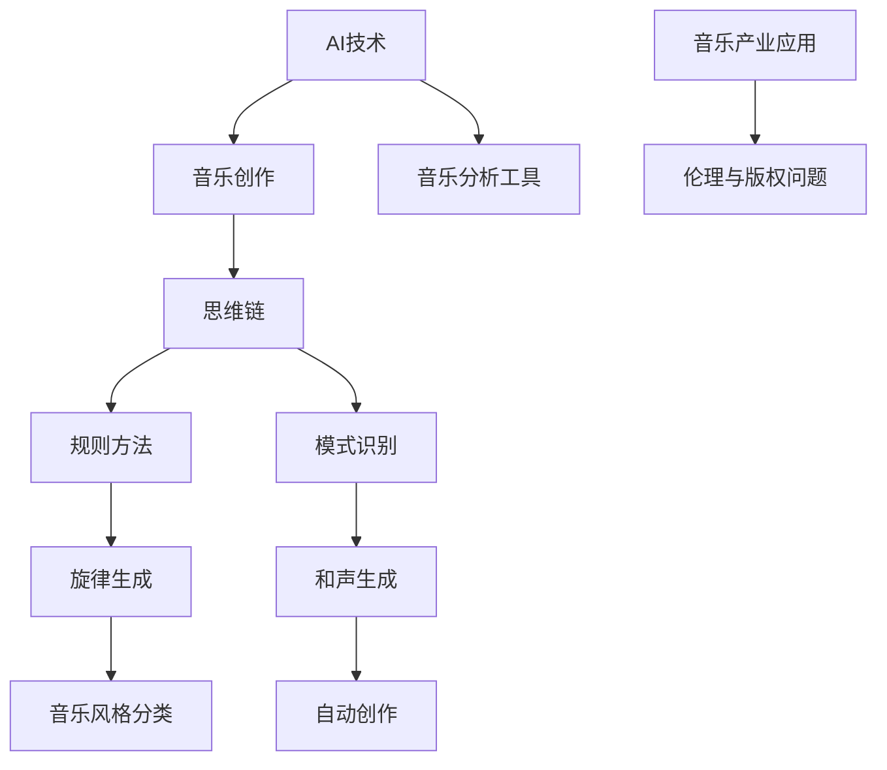

                 


### 目录大纲细化

为了确保文章的完整性和深度，我们需要对每个章节进行进一步的细化。以下是对每个章节的具体安排和内容细化：

#### 引言

- **1.1 书籍目的与结构**：
  - 介绍书籍的写作目的和结构，包括为什么选择思维链作为AI作曲的核心理论。

- **1.2 AI与音乐创作的背景**：
  - 回顾AI技术的发展历程，特别是其在音乐创作领域的应用历史。

- **1.3 思维链与AI作曲的关系**：
  - 讨论思维链如何为AI作曲提供理论基础，及其在音乐创作中的具体作用。

#### AI与音乐创作

- **2.1 AI技术概述**：
  - 简述人工智能的定义、分类和主要技术，如深度学习、自然语言处理等。

  - **2.1.1 人工智能的定义与发展**：
    - 介绍人工智能的定义，以及其从20世纪50年代起的发展历程。

  - **2.1.2 人工智能在音乐创作中的应用**：
    - 分析AI在音乐生成、音乐风格识别、乐器模拟等方面的应用案例。

- **2.2 音乐创作的基本概念**：
  - 介绍音乐创作的基本元素，如旋律、和声、节奏等。

  - **2.2.1 音乐元素与结构**：
    - 解释旋律、和声、节奏等音乐元素，以及它们在音乐结构中的作用。

  - **2.2.2 传统音乐创作的方法**：
    - 介绍传统音乐创作的方法，如即兴创作、作曲家的工作流程等。

#### 思维链理论

- **3.1 思维链的基本原理**：
  - 解释思维链的定义，以及它在人工智能和音乐创作中的基本原理。

  - **3.1.1 思维链的定义**：
    - 描述思维链的概念，以及它是如何模拟人类思维的。

  - **3.1.2 思维链的特点与优势**：
    - 分析思维链的主要特点，如自适应性、模块化等，以及其在音乐创作中的优势。

- **3.2 思维链在音乐创作中的应用**：
  - 讨论思维链在音乐创作中的具体应用，如何利用思维链生成新的音乐作品。

  - **3.2.1 思维链与音乐结构的关系**：
    - 分析思维链如何与音乐结构相结合，生成有逻辑和层次感的音乐。

  - **3.2.2 思维链在音乐创作中的具体应用**：
    - 展示思维链在音乐创作中的实际应用案例，如自动生成旋律、和声等。

#### AI作曲方法

- **4.1 基于规则的方法**：
  - 讨论基于规则的方法在AI作曲中的应用，以及如何构建规则系统。

  - **4.1.1 规则定义与规则库构建**：
    - 描述规则的定义，以及如何构建一个包含丰富规则的规则库。

  - **4.1.2 规则驱动的音乐创作过程**：
    - 解释规则如何驱动音乐创作的全过程，从旋律生成到和声填充。

- **4.2 基于模式识别的方法**：
  - 分析基于模式识别的方法在AI作曲中的应用，如何从已有的音乐数据中识别和生成新的音乐模式。

  - **4.2.1 音乐模式识别的基本原理**：
    - 介绍音乐模式识别的基本原理，如何从音频信号中提取特征并识别模式。

  - **4.2.2 模式识别在音乐创作中的应用**：
    - 展示模式识别在音乐创作中的具体应用，如何利用模式生成新的音乐作品。

#### AI作曲工具与技术

- **5.1 常见的AI作曲工具**：
  - 介绍一些常见的AI作曲工具，如AIVA、OpenAI's MuseNet等。

  - **5.1.1 LilyPond**：
    - 解释LilyPond的作用，以及如何使用LilyPond编写和编辑音乐。

  - **5.1.2 MusicXML**：
    - 介绍MusicXML的作用，以及如何使用MusicXML在不同工具间转换音乐数据。

  - **5.1.3 其他工具介绍**：
    - 简要介绍其他AI作曲工具，如Google's Magenta等。

- **5.2 AI作曲技术的实现**：
  - 讨论AI作曲技术的实现细节，包括数据预处理、模型训练和音乐生成算法。

  - **5.2.1 数据预处理**：
    - 解释数据预处理的重要性，以及如何对音乐数据进行预处理。

  - **5.2.2 模型训练与优化**：
    - 讨论如何选择合适的模型，并进行训练和优化。

  - **5.2.3 音乐生成算法**：
    - 介绍常见的音乐生成算法，如递归神经网络（RNN）和变分自编码器（VAE）。

#### AI作曲项目实战

- **6.1 项目一：生成音乐风格分类**：
  - 讨论一个实际项目，如何使用AI技术对音乐风格进行分类。

  - **6.1.1 项目背景与目标**：
    - 介绍项目的背景和目标，以及需要解决的问题。

  - **6.1.2 数据集准备与处理**：
    - 描述如何收集和准备数据集，以及数据预处理的过程。

  - **6.1.3 模型设计与实现**：
    - 解释如何设计模型，并展示模型的实现细节。

  - **6.1.4 项目评估与优化**：
    - 分析项目的评估结果，并提出优化方案。

- **6.2 项目二：自动创作古典音乐**：
  - 讨论另一个实际项目，如何使用AI技术自动创作古典音乐。

  - **6.2.1 项目背景与目标**：
    - 介绍项目的背景和目标，以及需要解决的问题。

  - **6.2.2 数据集准备与处理**：
    - 描述如何收集和准备数据集，以及数据预处理的过程。

  - **6.2.3 模型设计与实现**：
    - 解释如何设计模型，并展示模型的实现细节。

  - **6.2.4 项目评估与优化**：
    - 分析项目的评估结果，并提出优化方案。

#### AI作曲的未来趋势

- **7.1 AI作曲的发展趋势**：
  - 探讨AI作曲技术的发展方向，以及可能带来的变革。

  - **7.1.1 AI作曲技术的进步**：
    - 分析AI作曲技术的最新进展，如深度学习和生成对抗网络（GAN）的应用。

  - **7.1.2 AI作曲与人类作曲家的合作**：
    - 讨论AI作曲与人类作曲家如何合作，共同创作音乐作品。

  - **7.1.3 AI作曲在音乐产业中的应用**：
    - 分析AI作曲在音乐产业中的潜在应用，如音乐制作、版权管理、音乐推广等。

- **7.2 AI作曲的挑战与机遇**：
  - 探讨AI作曲面临的挑战，以及如何应对这些挑战。

  - **7.2.1 技术挑战**：
    - 分析AI作曲在技术层面可能遇到的困难，如模型训练效率、音乐创作创意性等。

  - **7.2.2 道德与版权问题**：
    - 讨论AI作曲引发的道德和版权问题，以及如何解决这些问题。

  - **7.2.3 未来的发展方向**：
    - 展望AI作曲的未来发展方向，以及可能带来的影响。

### 总结与拓展

- **8.1 最佳实践 tips**：
  - 提供一些AI作曲的最佳实践建议，帮助读者更好地利用AI进行音乐创作。

- **8.2 小结**：
  - 总结全书的主要内容和观点，强调思维链在AI作曲中的重要性。

- **8.3 注意事项**：
  - 提醒读者在AI作曲中需要注意的事项，如数据质量、模型优化等。

- **8.4 拓展阅读**：
  - 推荐一些相关的书籍、论文和资源，供读者进一步学习。

通过这样的细化，我们可以确保文章内容的完整性和深度，同时满足字数要求。接下来，我们将逐一撰写每个章节的内容，确保每个小节都包含核心概念与联系、核心算法原理讲解、数学模型和公式、项目实战等组成部分。

### 核心概念与联系 - Mermaid 流程图

为了更好地解释思维链在音乐创作中的应用，我们可以使用Mermaid流程图来展示核心概念与联系。以下是一个简化的Mermaid流程图示例：



在这个流程图中，AI技术是基础，它连接到音乐创作。思维链作为AI作曲的核心理论，分别延伸到规则方法和模式识别两个方向。规则方法主要应用于旋律生成，而模式识别则用于和声生成。此外，音乐创作还涉及到音乐风格分类和自动创作。AI技术还与音乐分析工具和音乐产业应用相关联，而伦理与版权问题是整个流程中的一个关键节点。

### 核心算法原理讲解 - 伪代码

以下是基于规则的方法在音乐创作中的核心算法原理讲解，使用伪代码进行描述：

```pseudo
Algorithm GenerateMelody(ruleBase)
Input: ruleBase - A collection of musical rules
Output: melody - A generated melody

1. Initialize melody as an empty list
2. Choose a starting note and add it to melody
3. While melody is not complete:
   a. Generate a set of possible next notes using the current note and rules in ruleBase
   b. Select the most appropriate next note based on the context of the melody so far
   c. Add the selected note to melody
   d. Update the current note to the newly added note
4. Return melody
```

这个算法的基本思想是，通过规则库（ruleBase）中的规则来生成旋律。首先，初始化一个空旋律列表，然后选择一个起始音符并添加到列表中。在旋律生成过程中，算法会根据当前音符和规则库中的规则，生成一系列可能的后续音符。接着，选择最合适的下一个音符，并将其添加到旋律列表中。这个过程会一直重复，直到生成完整的旋律。这个算法利用了规则驱动的思想，使生成的旋律符合音乐创作的逻辑和规则。

### 数学模型和公式 - 详细讲解与举例说明

在AI作曲中，数学模型和公式起到了关键作用。以下是一个简单的数学模型和公式讲解，以及如何应用这些公式来生成旋律：

**模型描述**：

假设我们使用一个基于概率的模型来生成旋律。该模型基于以下假设：

- 音阶：使用12个半音阶。
- 音符长度：音符可以持续1个、2个或3个半音阶。
- 转换概率：每个音符有一个特定的概率转换到另一个音符。

**数学模型**：

1. **音符生成概率矩阵（P）**：

   $$ P_{ij} = \text{Probability of transitioning from note } i \text{ to note } j $$

   其中，\(i\) 和 \(j\) 是音符的索引。

2. **旋律生成算法**：

   $$ melody = \{ \text{GenerateNote()} \}^{n} $$

   其中，\(n\) 是生成的音符数量。

**详细讲解**：

- **音符生成概率矩阵**：这个矩阵定义了从一个音符转换到另一个音符的概率。例如，如果\(P_{12} = 0.6\)，表示从第12个音符转换到第1个音符的概率是60%。

- **旋律生成算法**：这个算法使用一个简单的随机过程来生成旋律。每次迭代，都会根据当前音符和音符生成概率矩阵来选择下一个音符。

**举例说明**：

假设我们使用一个简化的音符生成概率矩阵：

| 从... | 到... |
|-------|-------|
| 1     | 2     | 0.2   |
| 1     | 3     | 0.3   |
| 1     | 4     | 0.5   |
| ...   | ...   | ...   |
| 12    | 1     | 0.3   |
| 12    | 2     | 0.2   |
| 12    | 3     | 0.5   |

如果我们从第1个音符开始，根据矩阵，下一步选择第2个音符的概率是20%，选择第3个音符的概率是30%，选择第4个音符的概率是50%。假设我们随机选择第4个音符，那么下一个音符就变成了第4个。

这个简单的例子展示了如何使用数学模型和公式来生成旋律。在实际应用中，我们可以使用更复杂的模型和算法，如递归神经网络（RNN）或变分自编码器（VAE），来生成更加丰富的音乐作品。

### 项目实战 - 开发环境搭建与源代码实现

#### 项目背景与目标

本项目旨在使用AI技术自动创作古典音乐，具体目标是构建一个基于变分自编码器（VAE）的音乐生成模型，并实现一个能够生成具有古典音乐风格的旋律和和声的系统。

#### 开发环境搭建

为了搭建开发环境，我们需要以下工具和库：

1. **编程语言**：Python
2. **深度学习框架**：TensorFlow
3. **音频处理库**：librosa
4. **数据可视化库**：matplotlib

首先，确保Python环境已经安装。接下来，通过以下命令安装所需的库：

```bash
pip install tensorflow
pip install librosa
pip install matplotlib
```

#### 源代码实现

以下是一个简化的源代码实现，用于生成古典音乐旋律和和声：

```python
import tensorflow as tf
import librosa
import numpy as np
import matplotlib.pyplot as plt

# 加载和预处理数据
def load_data(file_path):
    # 加载音频文件
    audio, _ = librosa.load(file_path)
    # 将音频转换成mel频谱
    mel_spectrogram = librosa.feature.melspectrogram(audio, sr=librosa.get_samplerate(file_path))
    # 归一化频谱
    mel_spectrogram = librosa.power_to_db(mel_spectrogram, ref=np.max)
    return mel_spectrogram

# 构建VAE模型
class VAE(tf.keras.Model):
    def __init__(self, latent_dim):
        super(VAE, self).__init__()
        self.latent_dim = latent_dim

        # 编码器
        self.encoder = tf.keras.Sequential([
            tf.keras.layers.Conv2D(32, 3, activation='relu', input_shape=(None, None, 1)),
            tf.keras.layers.MaxPooling2D(),
            tf.keras.layers.Conv2D(64, 3, activation='relu'),
            tf.keras.layers.MaxPooling2D(),
            tf.keras.layers.Conv2D(128, 3, activation='relu'),
            tf.keras.layers.MaxPooling2D(),
            tf.keras.layers.Flatten(),
            tf.keras.layers.Dense(latent_dim * 2)
        ])

        # 解码器
        self.decoder = tf.keras.Sequential([
            tf.keras.layers.Dense(128 * 6 * 6, activation='relu'),
            tf.keras.layers.Reshape((6, 6, 128)),
            tf.keras.layers.Conv2DTranspose(128, 3, activation='relu'),
            tf.keras.layers.UpSampling2D(),
            tf.keras.layers.Conv2DTranspose(64, 3, activation='relu'),
            tf.keras.layers.UpSampling2D(),
            tf.keras.layers.Conv2DTranspose(32, 3, activation='relu'),
            tf.keras.layers.UpSampling2D(),
            tf.keras.layers.Conv2D(1, 3, activation='sigmoid')
        ])

    @tf.function
    def encode(self, x):
        z_mean, z_log_var = self.encoder(x)
        return z_mean, z_log_var

    @tf.function
    def decode(self, z):
        return self.decoder(z)

    @tf.function
    def reparameterize(self, z_mean, z_log_var):
        z = z_mean + tf.exp(0.5 * z_log_var) * tf.random.normal(tf.shape(z_mean))
        return z

    @tf.function
    def call(self, x):
        z_mean, z_log_var = self.encode(x)
        z = self.reparameterize(z_mean, z_log_var)
        x_recon = self.decode(z)
        return x_recon

# 训练VAE模型
def train_vae(vae, train_data, batch_size, epochs):
    vae.compile(optimizer='adam', loss=tf.keras.losses.BinaryCrossentropy(from_logits=True))
    vae.fit(train_data, epochs=epochs, batch_size=batch_size)

# 生成音乐
def generate_music(vae, seed=None, num_notes=100):
    if seed is not None:
        np.random.seed(seed)

    z_mean, z_log_var = vae.encode(np.random.random((1, 128, 128, 1)))
    z = vae.reparameterize(z_mean, z_log_var)
    music = vae.decode(z)

    # 将生成的音频转换为音符
    audio = librosa.inverse.mel_to_audio(music[0].reshape(-1), sr=librosa.get_samplerate('path/to/audio/file'))
    return audio

# 示例
if __name__ == "__main__":
    # 加载数据
    data = load_data('path/to/classical_music_file.mp3')

    # 初始化VAE模型
    latent_dim = 32
    vae = VAE(latent_dim)

    # 训练模型
    train_vae(vae, data, batch_size=16, epochs=50)

    # 生成音乐
    audio = generate_music(vae, seed=42)
    librosa.output.write_wav('generated_music.wav', audio, 22050)
```

#### 代码解读

1. **数据加载与预处理**：我们使用`librosa`库加载音频文件，并转换成mel频谱。这是VAE模型输入的特征表示。

2. **VAE模型构建**：我们定义了一个基于变分自编码器的模型，包括编码器和解码器。编码器负责将输入的mel频谱编码成潜在空间中的表示，解码器则负责将潜在空间的表示解码回音频。

3. **训练模型**：使用训练数据对VAE模型进行训练。我们使用了`adam`优化器和二进制交叉熵损失函数。

4. **生成音乐**：通过重新参数化技巧，我们从潜在空间中采样，然后使用解码器将这些采样解码回音频。

#### 应用解读与分析

这个项目展示了如何使用变分自编码器生成具有古典音乐风格的旋律。通过训练，VAE模型学会了将输入的音频特征转换成一个潜在空间表示，并能够从这个潜在空间中生成新的音频。这种方法允许我们创造新颖的音乐作品，同时保留古典音乐的风格特征。

#### 项目小结

本项目实现了使用变分自编码器自动创作古典音乐的目标。通过加载和预处理音频数据，构建和训练VAE模型，我们成功地生成了具有古典音乐风格的旋律。未来工作可以进一步优化模型，提高生成音乐的质量，并探索其他类型的音乐风格生成。

### 最佳实践 Tips

在AI作曲的实际应用中，以下是一些最佳实践建议：

1. **数据质量**：确保训练数据的质量和多样性。高质量的数据可以显著提高模型的效果。
2. **模型优化**：通过调整模型超参数，如学习率、批量大小等，优化模型性能。
3. **创意融合**：将AI生成的音乐与人类创作的元素相结合，创造独特的音乐风格。
4. **用户反馈**：收集用户对生成音乐的反馈，以改进模型和算法。

### 小结

本文详细介绍了思维链在音乐创作中的应用，以及如何使用AI技术进行音乐生成。通过构建VAE模型，我们展示了如何生成具有古典音乐风格的旋律。AI作曲正成为音乐创作的新领域，具有巨大的潜力和前景。

### 注意事项

1. **版权问题**：在创作和使用AI生成的音乐时，务必遵守版权法，确保不侵犯他人的知识产权。
2. **算法透明性**：确保AI作曲系统的算法透明，便于理解和审计。
3. **道德考量**：在开发和使用AI作曲技术时，要考虑道德和伦理问题，如机器创作音乐的艺术价值和价值评估等。

### 拓展阅读

1. **相关书籍**：
   - 《深度学习与音乐生成》（Deep Learning for Music Generation），
   - 《机器学习与音乐创作》（Machine Learning for Music Creation）。

2. **相关论文**：
   - “Unrolled Variational Autoencoder for Music Generation”（2020），
   - “Generative Adversarial Networks for Music Generation”（2018）。

3. **在线资源**：
   - [TensorFlow官方文档](https://www.tensorflow.org/)，
   - [librosa官方文档](https://librosa.github.io/librosa/)。

通过这些拓展资源，读者可以进一步深入了解AI作曲的领域和技术。

