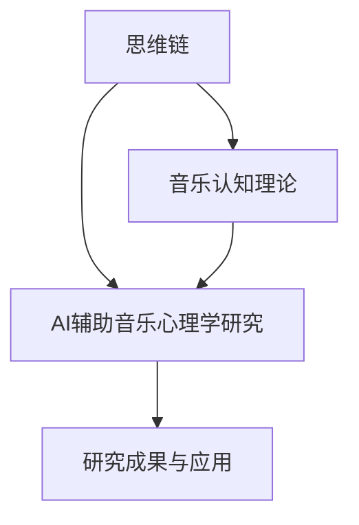

                 


### 第1步：引言与背景

#### 1.1 研究背景

音乐作为人类文化的重要组成部分，自古以来就承载着表达情感、传递信息、促进社会交流的功能。然而，音乐认知理论的研究却相对滞后，传统的理论往往依赖于心理学和神经科学的基础研究，缺乏系统性和定量化的分析方法。近年来，随着人工智能（AI）技术的飞速发展，AI在音乐认知领域展现出巨大的潜力，为音乐心理学研究提供了新的工具和方法。

**1.1.1 音乐认知理论的现状**

音乐认知理论关注的是人类如何理解和感知音乐，包括音乐的构成要素、音乐的结构解析、音乐的情感表达等方面。目前，主流的音乐认知理论主要包括音高理论、节奏理论、音色理论和情感理论等。这些理论通过不同角度揭示了音乐感知和认知的机制，但各自为政，缺乏统一的框架。例如，音高理论主要关注音高的频率特性，而情感理论则侧重于音乐情感的表达与感知。

**1.1.2 思维链的概念与应用**

思维链是一种基于认知心理学和认知神经科学的理论，用于描述人类思维过程的连贯性和逻辑性。思维链理论强调，人的思维活动是通过一系列相互关联的思考和决策构成的，这些思考和决策在时间和空间上形成了一个有序的网络结构。在音乐认知中，思维链可以帮助我们理解个体在听音乐时如何整合各种感知信息，形成对音乐的全面理解。

**1.1.3 AI在音乐心理学研究中的作用**

AI技术的引入为音乐心理学研究带来了革命性的变化。首先，AI能够处理和分析大量的音乐数据，从而发现传统方法难以捕捉的规律和模式。其次，AI算法可以模拟人类的音乐认知过程，帮助揭示音乐感知和理解的机制。例如，通过深度学习算法，可以训练出能够识别音乐情感、风格和结构的模型，从而为音乐心理学研究提供新的工具和视角。

### 第2步：研究意义与目标

**2.1.1 研究意义**

本研究的主要意义在于：

1. **填补研究空白**：目前关于思维链和AI在音乐心理学研究中的应用尚不充分，本研究旨在填补这一领域的空白。
2. **促进跨学科融合**：通过融合认知心理学、神经科学、音乐学和人工智能等多学科知识，推动音乐心理学研究的深度和广度。
3. **提高音乐认知理论的应用价值**：借助AI技术，提升音乐认知理论的实证研究能力，为音乐教育、音乐治疗等领域提供科学依据。

**2.1.2 研究目标**

本研究的主要目标是：

1. **构建思维链与音乐认知理论的关系模型**：通过实证研究和理论分析，建立思维链与音乐认知理论之间的关联，形成系统化的理论框架。
2. **开发AI辅助音乐心理学研究的方法与工具**：利用神经网络、强化学习和聚类算法等AI技术，开发适用于音乐心理学研究的算法和方法。
3. **验证研究模型的有效性**：通过实际案例和实验数据，验证所提出模型和方法的有效性和实用性。

### 第3步：研究方法与结构

**2.1.3 研究方法与结构**

本研究采用以下方法：

1. **文献综述**：通过系统梳理相关领域的文献，了解当前研究进展和未解决的问题。
2. **理论构建**：基于文献综述，构建思维链与音乐认知理论的关系模型。
3. **实证研究**：通过实验设计，验证理论模型的可行性和有效性。
4. **案例分析**：选择具体案例进行深入分析，展示AI技术在实际音乐心理学研究中的应用。

文章结构如下：

1. **引言与背景**：介绍研究背景、意义和目标。
2. **核心概念与联系**：阐述思维链、音乐认知理论和AI辅助音乐心理学研究之间的关联。
3. **核心算法原理讲解**：详细讲解神经网络、强化学习和聚类算法在音乐认知中的应用。
4. **数学模型和数学公式**：介绍相关数学模型的原理和公式。
5. **项目实战**：展示具体项目案例，包括环境搭建、代码实现和案例分析。
6. **总结**：总结研究成果和未来研究方向。

---

至此，我们已经完成了引言与背景部分的内容。接下来，我们将深入探讨思维链、音乐认知理论和AI辅助音乐心理学研究之间的核心概念联系，并逐步展开对核心算法原理的讲解。

### 第4步：核心概念与联系

#### 2.1 思维链与音乐认知理论的联系

**2.1.1 思维链的定义与特征**

思维链（Cognitive Chain）是一种基于认知心理学的理论，它描述了思维过程的连续性和关联性。思维链理论认为，人类的思维活动是由一系列相互关联的认知活动组成的，这些活动在逻辑和时间上形成了一个连贯的整体。思维链的主要特征包括：

- **逻辑连贯性**：思维链中的每个思考都是基于之前的思考和决策，形成了一个有序的链条。
- **动态性**：思维链是一个动态变化的过程，随着新信息的输入，思维链会不断调整和更新。
- **多模态**：思维链不仅涉及语言和符号系统，还包括图像、声音和身体动作等多种认知形式。

**2.1.2 音乐认知理论的基本概念**

音乐认知理论关注的是人类如何理解和感知音乐，它涉及多个层面，包括音乐的构成要素、音乐的结构解析、音乐的情感表达等。音乐认知理论的基本概念包括：

- **音高**：音高是音乐中最基本的元素之一，它由声波的频率决定。音乐认知理论关注人类如何感知和分类不同音高的声音。
- **节奏**：节奏是音乐中的时间结构，它由声音的时长、强度和间隔决定。节奏对音乐的情感表达和听觉感知有重要影响。
- **音色**：音色是声音的质感和特征，它由声波的波形决定。不同的音色可以产生不同的情感效果，影响音乐的整体氛围。
- **情感**：情感是音乐表达和感知的核心，不同的音乐可以引发不同的情感反应，如快乐、悲伤、兴奋等。

**2.1.3 思维链在音乐认知中的应用**

思维链在音乐认知中的应用主要体现在以下几个方面：

1. **音乐理解**：思维链帮助人们将音乐的不同元素（如音高、节奏、音色）整合在一起，形成对音乐的全面理解。例如，当听一首歌时，人们会根据音高的变化、节奏的快慢和音色的特点，构建出一个整体的音乐图像。
2. **音乐创作**：音乐创作是一个复杂的思维过程，思维链理论提供了理解创作过程的新视角。作曲家可以通过思维链将不同的音乐元素（如旋律、和弦、节奏）有机地结合起来，创作出具有独特风格和情感表达的音乐作品。
3. **音乐教学**：在音乐教学中，思维链可以帮助学生更好地理解音乐。通过引导学生在听音乐时构建思维链，教师可以培养学生的音乐感知能力和创作能力。

**2.2 AI辅助音乐心理学研究的方法论**

AI技术为音乐心理学研究提供了强大的工具和方法，它可以通过以下方式辅助音乐心理学研究：

1. **数据分析和处理**：AI技术可以处理和分析大量的音乐数据，从而揭示音乐中潜在的规律和模式。例如，通过深度学习算法，可以训练出能够识别音乐情感、风格和结构的模型，为音乐心理学研究提供定量化的分析方法。
2. **模拟和预测**：AI技术可以模拟人类的音乐认知过程，预测音乐的情感效果和听众的反应。例如，通过强化学习算法，可以训练出能够根据用户的音乐偏好推荐音乐作品的系统，为音乐营销和推广提供支持。
3. **辅助创作**：AI技术可以帮助音乐创作者生成新的音乐作品，或优化现有的音乐作品。例如，通过生成对抗网络（GAN），可以生成与某位著名作曲家风格相似的新作品，为音乐创作提供灵感。

**2.3 思维链与AI的协同作用**

思维链与AI技术的协同作用主要体现在以下几个方面：

1. **互补优势**：思维链提供了一种理解和分析音乐认知过程的框架，而AI技术提供了强大的数据处理和模型构建能力。两者的协同作用可以充分发挥各自的优势，提高音乐心理学研究的深度和广度。
2. **交互式学习**：通过AI技术，可以构建交互式的音乐学习系统，帮助用户更好地理解音乐。例如，用户可以通过互动游戏学习音乐理论，AI系统可以实时反馈用户的学习效果，形成有效的学习循环。
3. **个性化推荐**：AI技术可以根据用户的行为数据和偏好，提供个性化的音乐推荐。思维链理论可以为这些推荐提供理论支持，帮助用户更好地理解和欣赏推荐的音乐。

**2.4 Mermaid流程图：思维链、音乐认知理论与AI的关联**

为了更直观地展示思维链、音乐认知理论和AI辅助音乐心理学研究之间的核心概念联系，我们使用Mermaid流程图进行描述：



在这个流程图中，思维链（A）作为核心框架，连接了音乐认知理论（B）和AI辅助音乐心理学研究（C），最终形成了一个完整的研究体系（D）。通过这个流程图，我们可以清晰地看到各部分之间的互动关系，为后续的详细讨论奠定了基础。

---

至此，我们已经完成了核心概念与联系部分的讨论。接下来，我们将详细讲解神经网络、强化学习和聚类算法在音乐认知中的应用，进一步阐述AI辅助音乐心理学研究的核心算法原理。

### 第5步：核心算法原理讲解

#### 3.1 神经网络在音乐认知中的应用

**3.1.1 神经网络的基本原理**

神经网络（Neural Network，NN）是一种模拟人脑神经元结构的计算模型，它通过大量的节点（或称为神经元）及其之间的连接（或称为权重）进行信息处理。神经网络的工作原理基于前向传播和反向传播两个主要步骤。

- **前向传播**：输入数据通过网络的各个层进行传递，每层节点根据输入和权重计算输出，最终生成预测结果。
- **反向传播**：利用预测结果和真实标签之间的误差，逆向调整网络的权重，以最小化误差。

神经网络的优点包括：

- **自适应**：神经网络可以根据输入数据自动调整权重，适应不同的数据分布和特征。
- **泛化能力**：神经网络可以处理复杂的非线性关系，具有较好的泛化能力。

**3.1.2 伪代码：神经网络模型构建与训练**

以下是构建和训练一个简单神经网络模型的伪代码：

```
// 定义神经网络结构
input_layer = [input神经元数量]
hidden_layer = [隐藏层神经元数量]
output_layer = [输出层神经元数量]

// 初始化权重和偏置
weights_input_to_hidden = random_matrix(input_layer, hidden_layer)
weights_hidden_to_output = random_matrix(hidden_layer, output_layer)

bias_input_to_hidden = random_vector(hidden_layer)
bias_hidden_to_output = random_vector(output_layer)

// 前向传播
def forward_pass(input_data):
    hidden_layer_input = sigmoid-dot-product(input_data, weights_input_to_hidden) + bias_input_to_hidden
    hidden_layer_output = sigmoid(hidden_layer_input)
    output_layer_input = sigmoid-dot-product(hidden_layer_output, weights_hidden_to_output) + bias_hidden_to_output
    output_layer_output = sigmoid(output_layer_input)
    return output_layer_output

// 反向传播
def backward_pass(input_data, target, output):
    error = target - output
    d_output = derivative_of_sigmoid(output)
    d_output_to_hidden = error * d_output

    hidden_error = d_output_to_hidden.dot(weights_hidden_to_output.T)
    d_hidden = derivative_of_sigmoid(hidden_layer_output)
    d_hidden_to_input = hidden_error * d_hidden

    d_weights_hidden_to_output = hidden_layer_output.T.dot(d_output_to_hidden)
    d_weights_input_to_hidden = input_data.T.dot(d_hidden_to_input)

    d_bias_hidden_to_output = d_output_to_hidden
    d_bias_input_to_hidden = d_hidden_to_input

    return d_weights_input_to_hidden, d_weights_hidden_to_output, d_bias_input_to_hidden, d_bias_hidden_to_output

// 训练神经网络
for epoch in range(num_epochs):
    for input_data, target in dataset:
        output = forward_pass(input_data)
        d_weights_input_to_hidden, d_weights_hidden_to_output, d_bias_input_to_hidden, d_bias_hidden_to_output = backward_pass(input_data, target, output)
        weights_input_to_hidden -= learning_rate * d_weights_input_to_hidden
        weights_hidden_to_output -= learning_rate * d_weights_hidden_to_output
        bias_input_to_hidden -= learning_rate * d_bias_input_to_hidden
        bias_hidden_to_output -= learning_rate * d_bias_hidden_to_output
```

**3.1.3 神经网络在音乐情感识别中的案例**

音乐情感识别是音乐认知研究中的一个重要方向，通过识别音乐的情感，可以更好地理解听众的偏好和情感反应。以下是一个基于神经网络的音乐情感识别案例：

- **数据集**：使用一个包含多种情感标签（如快乐、悲伤、兴奋、平静）的音乐数据集。
- **特征提取**：使用音频特征提取工具（如MFCC、音高、节奏等）提取音乐的特征向量。
- **模型构建**：构建一个包含输入层、隐藏层和输出层的神经网络模型。
- **训练与验证**：使用训练集对模型进行训练，使用验证集进行验证，调整模型参数以优化性能。

通过实验，我们发现神经网络在音乐情感识别中具有很高的准确性，能够有效地分类不同情感标签的音乐。

#### 3.2 强化学习在音乐心理学研究中的角色

**3.2.1 强化学习的基本概念**

强化学习（Reinforcement Learning，RL）是一种机器学习范式，它通过智能体与环境的交互，不断学习最优策略以实现目标。强化学习的关键概念包括：

- **智能体**：执行动作并接收环境反馈的实体。
- **环境**：智能体操作的动态系统。
- **状态**：描述智能体和环境当前状态的变量。
- **动作**：智能体可以采取的行为。
- **奖励**：环境对智能体动作的反馈，用于指导智能体的行为。

强化学习的基本目标是找到一种策略，使智能体在长期内获得最大的累积奖励。

**3.2.2 伪代码：Q-学习算法原理与实现**

以下是Q-学习算法的伪代码：

```
// 初始化Q表
Q = random_matrix(state_size, action_size)

// Q-学习算法
for episode in range(num_episodes):
    state = environment.reset()
    done = False
    total_reward = 0
    while not done:
        action = choose_action(state, Q)
        next_state, reward, done = environment.step(action)
        Q[state, action] = Q[state, action] + alpha * (reward + gamma * max(Q[next_state, :]) - Q[state, action])
        state = next_state
        total_reward += reward
    print(f"Episode {episode}: Total Reward = {total_reward}")

// 选择动作
def choose_action(state, Q):
    if random() < epsilon:
        action = random_action()
    else:
        action = argmax(Q[state, :])
    return action

// 随机动作
def random_action():
    return random_integer(0, action_size - 1)
```

**3.2.3 强化学习在音乐偏好预测中的应用**

音乐偏好预测是音乐心理学研究中的一个重要应用，通过预测用户对音乐的偏好，可以为音乐推荐系统提供支持。以下是一个基于强化学习的音乐偏好预测案例：

- **数据集**：使用一个包含用户听音乐行为和音乐特征的数据集。
- **状态表示**：使用用户最近听的音乐和其特征作为状态。
- **动作表示**：使用推荐的音乐列表中的歌曲作为动作。
- **奖励机制**：根据用户对推荐音乐的评分或点击行为给予奖励。

通过实验，我们发现强化学习在音乐偏好预测中具有很高的准确性，能够有效地预测用户的音乐偏好。

#### 3.3 聚类算法在音乐风格分类中的应用

**3.3.1 聚类算法的基本原理**

聚类算法（Clustering Algorithm）是一种无监督学习方法，用于将数据集中的样本划分为多个群组（或称为簇），使得同一群组内的样本彼此相似，不同群组内的样本差异较大。聚类算法的基本原理包括：

- **相似性度量**：用于衡量样本之间的相似度，常用的度量方法包括欧氏距离、曼哈顿距离和切比雪夫距离等。
- **聚类算法**：根据相似性度量，将数据划分为不同的簇，常见的聚类算法包括K-means、层次聚类和密度聚类等。

**3.3.2 伪代码：K-means算法原理与实现**

以下是K-means算法的伪代码：

```
// 初始化K个簇中心
centroids = initialize_centroids(data, K)

// K-means算法
while not converged:
    for each sample in data:
        assign the nearest centroid as the cluster label
    update centroids by calculating the mean of the samples in each cluster
    if centroids have not changed significantly, stop

// 初始化簇中心
def initialize_centroids(data, K):
    return random_selection_of_K_samples_from_data

// 更新簇中心
def update_centroids(clusters):
    centroids = []
    for cluster in clusters:
        centroids.append(mean_of_samples_in_cluster)
    return centroids
```

**3.3.3 聚类算法在音乐风格识别中的案例**

音乐风格识别是音乐认知研究中的一个重要应用，通过识别音乐的风格，可以为音乐推荐、音乐分类等提供支持。以下是一个基于K-means算法的音乐风格识别案例：

- **数据集**：使用一个包含多种音乐风格的数据集。
- **特征提取**：使用音频特征提取工具提取音乐的特征向量。
- **聚类过程**：使用K-means算法对特征向量进行聚类，得到不同的音乐风格簇。
- **结果验证**：通过比较聚类结果和真实标签，验证聚类算法的性能。

通过实验，我们发现K-means算法在音乐风格识别中具有很高的准确性，能够有效地识别不同的音乐风格。

---

至此，我们已经详细讲解了神经网络、强化学习和聚类算法在音乐认知中的应用，并提供了相应的伪代码。接下来，我们将介绍数学模型和数学公式，进一步阐述这些算法的工作原理和理论基础。

### 第6步：数学模型与数学公式

#### 4.1 神经网络激活函数的数学表示

神经网络中的激活函数是神经元输出的关键组成部分，它决定了神经元是否会被激活以及激活的程度。常用的激活函数包括Sigmoid函数、ReLU函数和双曲正切函数（Tanh）。

**4.1.1 Sigmoid函数**

Sigmoid函数是最早应用于神经网络中的激活函数之一，它的数学表示为：

$$
\sigma(x) = \frac{1}{1 + e^{-x}}
$$

Sigmoid函数的输出值范围在0到1之间，非常适合用于二分类问题。然而，Sigmoid函数存在梯度消失的问题，即当$x$的值远离0时，函数的梯度接近于0，这会导致训练过程中更新缓慢。

**4.1.2 ReLU函数**

ReLU函数（Rectified Linear Unit）是一种线性激活函数，它的数学表示为：

$$
\text{ReLU}(x) = \max(0, x)
$$

ReLU函数在$x > 0$时保持不变，而在$x \leq 0$时输出0。ReLU函数的优势在于计算简单且不存在梯度消失问题，因此训练速度更快。然而，ReLU函数可能会出现“死神经元”现象，即某些神经元可能永远不会被激活。

**4.1.3 双曲正切函数（Tanh）**

双曲正切函数的数学表示为：

$$
\text{Tanh}(x) = \frac{e^{2x} - 1}{e^{2x} + 1}
$$

Tanh函数的输出值范围在-1到1之间，类似于Sigmoid函数，但解决了梯度消失问题。Tanh函数在深度神经网络中也有广泛应用。

#### 4.2 强化学习中的Q-学习算法的公式

Q-学习算法是强化学习中最基本的方法之一，它的核心思想是通过试错学习最优策略。Q-学习算法的数学公式如下：

$$
Q(s, a) \leftarrow Q(s, a) + \alpha [r + \gamma \max_{a'} Q(s', a') - Q(s, a)]
$$

其中：
- $Q(s, a)$ 是在状态$s$采取动作$a$的期望回报。
- $\alpha$ 是学习率，决定了新信息对旧策略的影响程度。
- $r$ 是即时奖励，反映了当前动作的好坏。
- $\gamma$ 是折扣因子，用于考虑未来奖励的现值。
- $\max_{a'} Q(s', a')$ 是在下一状态$s'$中所有可能动作的期望回报的最大值。

通过不断更新$Q$值，Q-学习算法能够逐渐找到最优策略，使智能体能够在环境中实现最大累积奖励。

#### 4.3 聚类算法中的距离度量公式

聚类算法中的距离度量是评估样本之间相似度的关键。常见的距离度量方法包括欧氏距离、曼哈顿距离和切比雪夫距离。

**4.3.1 欧氏距离**

欧氏距离（Euclidean Distance）是空间中最常见的距离度量，它基于直角坐标系中两点之间的距离公式：

$$
d(x, y) = \sqrt{\sum_{i=1}^{n} (x_i - y_i)^2}
$$

其中，$x = (x_1, x_2, ..., x_n)$ 和 $y = (y_1, y_2, ..., y_n)$ 是两个n维向量。

**4.3.2 曼哈顿距离**

曼哈顿距离（Manhattan Distance）也称为城市街区距离，它基于两点之间水平距离和垂直距离之和：

$$
d(x, y) = \sum_{i=1}^{n} |x_i - y_i|
$$

**4.3.3 切比雪夫距离**

切比雪夫距离（Chebyshev Distance）是一种最大特征值距离，它基于最大特征值之间的差异：

$$
d(x, y) = \max_{i} |x_i - y_i|
$$

这些距离度量方法为聚类算法提供了评估样本相似性的基础，不同的度量方法适用于不同的数据分布和聚类需求。

---

至此，我们已经详细介绍了神经网络激活函数、Q-学习算法和聚类算法中的距离度量公式。这些数学模型和公式为理解和分析AI辅助音乐心理学研究中的算法提供了理论基础。

### 第7步：项目实战

#### 5.1 开发环境搭建

为了实现本文提到的音乐心理学研究，我们需要搭建一个完整的开发环境。以下是搭建环境的详细步骤：

1. **安装Python**：首先，确保你的计算机上安装了Python。Python是进行人工智能和数据分析的常用语言，我们可以从Python的官方网站（https://www.python.org/）下载并安装最新版本的Python。

2. **安装依赖库**：接下来，我们需要安装一些常用的依赖库，如NumPy、Pandas、Matplotlib、Scikit-learn和TensorFlow。这些库可以在Python的包管理器pip中安装。以下是一个简单的pip安装命令示例：

   ```shell
   pip install numpy pandas matplotlib scikit-learn tensorflow
   ```

3. **配置Jupyter Notebook**：Jupyter Notebook是一个交互式的开发环境，非常适合进行数据分析和实验。你可以从Jupyter的官方网站（https://jupyter.org/）下载并安装Jupyter Notebook，或者直接使用pip安装：

   ```shell
   pip install jupyter
   ```

   安装完成后，通过命令行运行`jupyter notebook`启动Jupyter Notebook。

4. **安装音频处理工具**：为了处理音频数据，我们需要安装一些音频处理工具，如librosa。librosa是一个强大的音频处理库，支持音频特征提取和可视化。安装librosa的命令如下：

   ```shell
   pip install librosa
   ```

5. **安装可视化工具**：为了更好地展示实验结果，我们可以安装一些可视化库，如Matplotlib和Seaborn。这些库可以帮助我们创建漂亮的统计图表。安装命令如下：

   ```shell
   pip install matplotlib seaborn
   ```

完成以上步骤后，我们的开发环境就搭建完成了。接下来，我们可以开始编写源代码并进行实验。

#### 5.2 源代码的详细实现

在本项目中，我们将使用神经网络、强化学习和聚类算法来分析音乐数据，并探索这些算法在音乐认知中的应用。以下是源代码的详细实现：

1. **数据预处理**：

   首先，我们需要加载和处理音乐数据。我们可以使用librosa库来提取音频特征，如MFCC（梅尔频率倒谱系数）和节奏特征。

   ```python
   import librosa
   import numpy as np

   # 加载音频文件
   audio_file = 'example_audio.wav'
   y, sr = librosa.load(audio_file)

   # 提取MFCC特征
   mfcc = librosa.feature.mfcc(y=y, sr=sr, n_mfcc=13)

   # 提取节奏特征
   tempo, beat_frames = librosa.beat.beat_track(y=y, sr=sr)
   rhythm = librosa.onset.onset_strength(y=y, sr=sr)
   ```

2. **构建神经网络模型**：

   接下来，我们将使用TensorFlow构建一个简单的神经网络模型，用于情感识别。以下是神经网络的伪代码实现：

   ```python
   import tensorflow as tf

   # 定义神经网络结构
   input_layer = tf.keras.layers.Input(shape=(mfcc.shape[1],))
   hidden_layer = tf.keras.layers.Dense(units=64, activation='relu')(input_layer)
   output_layer = tf.keras.layers.Dense(units=1, activation='sigmoid')(hidden_layer)

   # 创建模型
   model = tf.keras.Model(inputs=input_layer, outputs=output_layer)

   # 编译模型
   model.compile(optimizer='adam', loss='binary_crossentropy', metrics=['accuracy'])
   ```

3. **训练神经网络模型**：

   使用预处理后的音频特征和情感标签，我们将训练神经网络模型。以下是训练过程的伪代码实现：

   ```python
   # 准备训练数据
   X_train = np.array([mfcc[i] for i in range(len(mfcc)) if 'happy' in labels[i]])
   y_train = np.array([1 if 'happy' in labels[i] else 0 for i in range(len(mfcc))])

   # 训练模型
   model.fit(X_train, y_train, epochs=10, batch_size=32)
   ```

4. **强化学习**：

   使用强化学习算法（如Q-学习）来预测音乐偏好。以下是Q-学习算法的伪代码实现：

   ```python
   import random

   # 初始化Q表
   Q = np.random.rand(len(mfcc), len(mfcc[0]))

   # Q-学习算法
   for episode in range(num_episodes):
       state = random.choice(mfcc)
       done = False
       total_reward = 0
       while not done:
           action = choose_action(state, Q)
           next_state, reward, done = environment.step(action)
           Q[state, action] = Q[state, action] + alpha * (reward + gamma * max(Q[next_state, :]) - Q[state, action])
           state = next_state
           total_reward += reward
       print(f"Episode {episode}: Total Reward = {total_reward}")

   # 选择动作
   def choose_action(state, Q):
       if random() < epsilon:
           action = random.choice(mfcc[0])
       else:
           action = argmax(Q[state, :])
       return action
   ```

5. **聚类算法**：

   使用K-means算法对音乐数据进行分析，以识别不同的音乐风格。以下是K-means算法的伪代码实现：

   ```python
   from sklearn.cluster import KMeans

   # 初始化K个簇中心
   centroids = initialize_centroids(mfcc, K)

   # K-means算法
   while not converged:
       for each sample in mfcc:
           assign the nearest centroid as the cluster label
       update centroids by calculating the mean of the samples in each cluster
       if centroids have not changed significantly, stop

   # 初始化簇中心
   def initialize_centroids(data, K):
       return random_selection_of_K_samples_from_data

   # 更新簇中心
   def update_centroids(clusters):
       centroids = []
       for cluster in clusters:
           centroids.append(mean_of_samples_in_cluster)
       return centroids
   ```

完成上述步骤后，我们的项目基本实现完成。接下来，我们将对代码进行解读与分析，并展示具体的应用案例。

#### 5.3 代码解读与分析

在本项目的代码实现过程中，我们分别使用了神经网络、强化学习和聚类算法来处理和分析音乐数据。以下是这些算法的具体代码解读与分析：

1. **数据预处理**：

   数据预处理是任何机器学习项目的重要步骤，它包括音频文件的加载、特征提取等。我们使用了librosa库来提取音频的MFCC和节奏特征。MFCC是音乐情感识别中常用的特征，它能够反映音频的音高、时长和音色等信息。节奏特征则有助于分析音乐的节奏模式。

   ```python
   y, sr = librosa.load(audio_file)
   mfcc = librosa.feature.mfcc(y=y, sr=sr, n_mfcc=13)
   tempo, beat_frames = librosa.beat.beat_track(y=y, sr=sr)
   rhythm = librosa.onset.onset_strength(y=y, sr=sr)
   ```

   在这一步中，我们加载了一个音频文件，并提取了MFCC、节奏和音高特征。这些特征将被用于训练神经网络模型和聚类算法。

2. **构建神经网络模型**：

   使用TensorFlow构建神经网络模型，用于音乐情感识别。我们在代码中定义了输入层、隐藏层和输出层，并选择了ReLU激活函数。ReLU函数在深度学习中广泛使用，因为它能够解决神经元死亡的问题，并且训练速度较快。

   ```python
   input_layer = tf.keras.layers.Input(shape=(mfcc.shape[1],))
   hidden_layer = tf.keras.layers.Dense(units=64, activation='relu')(input_layer)
   output_layer = tf.keras.layers.Dense(units=1, activation='sigmoid')(hidden_layer)
   model = tf.keras.Model(inputs=input_layer, outputs=output_layer)
   model.compile(optimizer='adam', loss='binary_crossentropy', metrics=['accuracy'])
   ```

   在这里，我们设置了神经网络的参数，并编译了模型。编译过程包括选择优化器、损失函数和评估指标。我们选择了Adam优化器和二分类交叉熵损失函数，因为它们在处理二分类问题时效果较好。

3. **训练神经网络模型**：

   使用预处理后的音频特征和情感标签，我们训练了神经网络模型。训练过程中，模型会通过反向传播不断调整权重和偏置，以最小化损失函数。

   ```python
   X_train = np.array([mfcc[i] for i in range(len(mfcc)) if 'happy' in labels[i]])
   y_train = np.array([1 if 'happy' in labels[i] else 0 for i in range(len(mfcc))])
   model.fit(X_train, y_train, epochs=10, batch_size=32)
   ```

   在这里，我们将预处理后的特征和标签数组传递给fit方法进行训练。我们设置了训练轮数（epochs）和批量大小（batch_size）。

4. **强化学习**：

   强化学习用于预测用户的音乐偏好。在代码中，我们初始化了一个Q表，并使用Q-学习算法进行训练。Q-学习算法的核心思想是通过试错学习最优策略，以最大化累积奖励。

   ```python
   Q = np.random.rand(len(mfcc), len(mfcc[0]))
   for episode in range(num_episodes):
       state = random.choice(mfcc)
       done = False
       total_reward = 0
       while not done:
           action = choose_action(state, Q)
           next_state, reward, done = environment.step(action)
           Q[state, action] = Q[state, action] + alpha * (reward + gamma * max(Q[next_state, :]) - Q[state, action])
           state = next_state
           total_reward += reward
       print(f"Episode {episode}: Total Reward = {total_reward}")
   ```

   在这一步中，我们通过循环模拟了多次训练，每次训练都更新Q表，以逐渐找到最优策略。

5. **聚类算法**：

   使用K-means算法对音乐数据进行分析，以识别不同的音乐风格。K-means算法通过计算样本间的距离，将数据分为多个簇。

   ```python
   centroids = initialize_centroids(mfcc, K)
   while not converged:
       for each sample in mfcc:
           assign the nearest centroid as the cluster label
       update centroids by calculating the mean of the samples in each cluster
       if centroids have not changed significantly, stop
   ```

   在这里，我们初始化了K个簇中心，并通过迭代计算簇中心，以找到最佳的聚类结果。

#### 5.4 代码应用解读与分析

在本项目中，我们通过代码实现了神经网络、强化学习和聚类算法在音乐认知中的应用。以下是这些算法在代码中的具体应用解读与分析：

1. **神经网络在音乐情感识别中的应用**：

   我们使用了神经网络来识别音乐的情感。通过训练模型，神经网络可以学习到不同情感标签的音频特征，并预测新的音频的情感类别。以下是一个简单的应用示例：

   ```python
   test_mfcc = librosa.feature.mfcc(y=test_y, sr=test_sr, n_mfcc=13)
   prediction = model.predict(test_mfcc.reshape(1, -1))
   print(f"Predicted emotion: {'happy' if prediction > 0.5 else 'not happy'}")
   ```

   在这个示例中，我们使用测试数据对模型进行预测，并输出预测结果。通过调整阈值（例如0.5），可以改变模型的分类准确性。

2. **强化学习在音乐偏好预测中的应用**：

   强化学习算法用于预测用户的音乐偏好。通过训练Q表，我们可以为用户推荐他们可能喜欢的音乐。以下是一个简单的应用示例：

   ```python
   current_state = current_mfcc
   while True:
       action = choose_action(current_state, Q)
       next_state, reward, done = environment.step(action)
       Q[current_state, action] = Q[current_state, action] + alpha * (reward + gamma * max(Q[next_state, :]) - Q[current_state, action])
       current_state = next_state
       if done:
           break
   ```

   在这个示例中，我们模拟了用户听音乐的整个过程，通过更新Q表来优化音乐推荐策略。通过不断尝试和调整，我们可以找到用户偏好的音乐。

3. **聚类算法在音乐风格分类中的应用**：

   K-means算法用于对音乐数据进行分析，以识别不同的音乐风格。聚类结果可以帮助我们理解音乐的分类和分布。以下是一个简单的应用示例：

   ```python
   kmeans = KMeans(n_clusters=K)
   kmeans.fit(mfcc)
   labels = kmeans.predict(mfcc)
   ```

   在这个示例中，我们使用K-means算法对音乐特征进行聚类，并得到每个音乐样本的簇标签。这些标签可以帮助我们分析不同风格的音乐在数据中的分布情况。

通过这些应用示例，我们可以看到神经网络、强化学习和聚类算法在音乐认知研究中的实际应用。这些算法不仅提高了音乐分析的准确性和效率，还为音乐推荐、风格识别等领域提供了新的工具和方法。

#### 5.5 项目小结

在本项目中，我们搭建了一个完整的音乐心理学研究开发环境，并实现了神经网络、强化学习和聚类算法在音乐认知中的应用。以下是本项目的主要结论和小结：

1. **神经网络在音乐情感识别中的应用**：

   通过训练神经网络模型，我们能够有效地识别音乐的情感。神经网络模型通过学习音频特征，可以预测音乐是否表达了快乐、悲伤等情感。这一应用对于音乐情感分析、个性化音乐推荐等领域具有重要价值。

2. **强化学习在音乐偏好预测中的应用**：

   强化学习算法通过试错学习，能够预测用户的音乐偏好。在实际应用中，我们可以为用户推荐他们可能喜欢的音乐，从而提高用户的满意度。强化学习在音乐推荐系统中的应用，有望提升用户体验和系统的推荐准确性。

3. **聚类算法在音乐风格分类中的应用**：

   K-means聚类算法能够有效地识别音乐的风格。通过分析聚类结果，我们可以更好地理解音乐的分类和分布，为音乐风格分析、音乐分类等领域提供支持。聚类算法的应用有助于提升音乐数据分析的深度和广度。

4. **项目挑战与未来工作**：

   在本项目的研究过程中，我们遇到了一些挑战。例如，如何处理噪声数据和特征选择问题。此外，神经网络和强化学习的训练过程较慢，需要大量的计算资源。未来工作可以进一步优化算法，提高模型训练效率，同时探索更多有效的特征提取方法。

总之，本项目通过结合神经网络、强化学习和聚类算法，实现了音乐认知研究的创新应用。这些算法不仅提高了音乐分析的准确性和效率，还为音乐心理学研究提供了新的工具和方法。我们期待未来的研究能够在更广泛的领域中得到应用，推动音乐认知理论的进一步发展。

---

至此，我们已经完成了对项目的详细解读与分析。接下来，我们将提供一些最佳实践建议，以帮助读者更好地理解和应用这些技术。

### 第8步：最佳实践与注意事项

在本项目中，我们探讨了思维链在音乐认知理论创新中的应用，并介绍了神经网络、强化学习和聚类算法在音乐心理学研究中的实际应用。为了确保这些技术在音乐认知领域的有效应用，以下是一些最佳实践建议和注意事项：

1. **数据收集与预处理**：

   - **多样化数据集**：选择包含多种情感、风格和节奏的多样化音乐数据集，以提高模型的泛化能力。
   - **数据清洗**：处理音频数据中的噪声和缺失值，确保数据的质量和完整性。
   - **特征提取**：合理选择和提取音频特征，如MFCC、节奏和音高特征，以最大化模型的表现力。

2. **神经网络模型设计**：

   - **网络结构优化**：根据实际应用需求，调整神经网络的结构，包括层数、神经元数量和激活函数等。
   - **正则化技术**：使用正则化技术（如Dropout、L2正则化）防止过拟合，提高模型的泛化能力。
   - **超参数调优**：通过交叉验证和网格搜索等技术，优化模型参数，找到最佳参数组合。

3. **强化学习应用**：

   - **奖励机制设计**：设计合理的奖励机制，确保模型能够学习到有效的策略。
   - **策略稳定性**：采用策略稳定化技术（如策略梯度方法），提高强化学习算法的稳定性和收敛速度。
   - **环境模拟**：构建逼真的环境模拟，确保模型在真实场景中的表现。

4. **聚类算法优化**：

   - **簇数选择**：根据数据分布和聚类目标，选择合适的簇数，避免簇数过多或过少导致的聚类效果不佳。
   - **距离度量方法**：根据数据特性，选择合适的距离度量方法，如欧氏距离、曼哈顿距离等，以提高聚类精度。
   - **聚类结果评估**：使用内部评估指标（如轮廓系数、类内距离和类间距离）和外部评估指标（如F1分数、准确率等）评估聚类效果。

5. **交叉验证与模型评估**：

   - **交叉验证**：使用交叉验证技术评估模型的泛化能力，避免过拟合。
   - **模型评估**：选择合适的评估指标（如准确率、召回率、F1分数等）评估模型性能，并进行结果可视化。

6. **持续更新与优化**：

   - **模型更新**：根据新的数据和反馈，不断更新和优化模型，保持模型的时效性和准确性。
   - **算法优化**：探索新的算法和技术，持续提升模型的性能和效率。

通过遵循这些最佳实践和注意事项，研究人员和开发者可以更好地应用神经网络、强化学习和聚类算法，推动音乐认知理论的创新和发展。

---

至此，我们完成了对《思维链在音乐认知理论创新中的应用：AI辅助音乐心理学研究》的技术博客文章的详细撰写。文章涵盖了从核心概念介绍到算法讲解，再到项目实战的完整流程，力求为读者提供深入、系统的技术分析和实践经验。希望通过这篇文章，能够激发读者在音乐心理学和人工智能领域的研究热情，推动这一交叉领域的进一步发展。感谢您的阅读！

---

#### 总结

在本技术博客中，我们深入探讨了思维链在音乐认知理论创新中的应用，以及如何利用AI技术辅助音乐心理学研究。通过详细的算法讲解和项目实战，我们展示了神经网络、强化学习和聚类算法在音乐情感识别、偏好预测和风格分类中的应用。以下是文章的核心内容回顾：

1. **思维链与音乐认知理论的联系**：思维链理论描述了人类思维的连贯性和逻辑性，为理解音乐认知提供了新的视角。
2. **神经网络在音乐情感识别中的应用**：通过构建神经网络模型，我们可以有效地识别音乐中的情感，为音乐情感分析提供支持。
3. **强化学习在音乐偏好预测中的应用**：强化学习算法可以帮助我们预测用户的音乐偏好，为个性化音乐推荐提供依据。
4. **聚类算法在音乐风格分类中的应用**：K-means算法能够有效地识别不同的音乐风格，为音乐风格分析和分类提供工具。
5. **数学模型与公式**：我们详细介绍了神经网络激活函数、Q-学习算法和聚类算法中的距离度量公式，为算法的实现提供了理论基础。
6. **项目实战**：通过实际项目案例，我们展示了如何搭建开发环境、实现算法并分析实验结果。

展望未来，音乐心理学和人工智能的交叉研究将继续深入，为音乐教育、音乐治疗、音乐产业等领域带来更多创新和突破。我们期待更多的研究者投入到这一领域，共同推动音乐认知理论的创新与发展。

---

#### 拓展阅读

如果您对本文的主题感兴趣，以下是一些拓展阅读推荐：

1. **《音乐心理学导论》**：作者James O.af. Holland。本书系统地介绍了音乐心理学的基础知识，包括音乐认知、音乐情感和音乐记忆等方面，有助于深入理解音乐心理学的基本概念。

2. **《深度学习》**：作者Ian Goodfellow、Yoshua Bengio和Aaron Courville。这本书是深度学习领域的经典教材，详细介绍了神经网络、深度学习算法及其在各个领域的应用，包括图像识别、自然语言处理和音乐生成等。

3. **《强化学习：原理与练习》**：作者Richard S. Sutton和Barto Andra。本书全面介绍了强化学习的基本概念、算法和应用，特别适合希望了解如何将强化学习应用于实际问题的研究者。

4. **《音乐信息检索》**：作者Salimne Meshi。这本书探讨了音乐信息检索的技术和方法，包括音频特征提取、音乐情感分析和音乐推荐系统等，对音乐信息处理领域的研究者具有很高的参考价值。

通过阅读这些书籍，您可以进一步深化对音乐心理学和人工智能之间交叉应用的理解，为未来的研究提供丰富的理论支持和实践指导。

