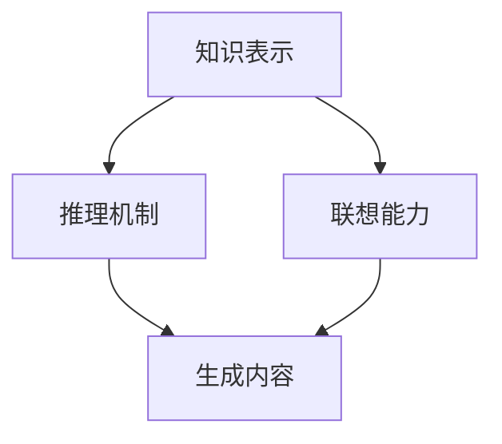

                 

### 第1章 引言

#### 1.1 AIGC背景与趋势

人工智能（AI）技术近年来取得了显著的进展，其应用范围不断扩大，涵盖了从自然语言处理、计算机视觉到机器学习等多个领域。随着技术的进步，AI逐渐从传统的辅助角色转变为驱动创新的核心力量。AIGC（AI Generated Content）作为AI技术的一个重要分支，正逐渐引起业界和学术界的广泛关注。

AIGC是指通过人工智能技术自动生成内容的过程，其涵盖了文本、图像、音频等多种形式。AIGC的核心目标是利用机器学习算法，尤其是深度学习技术，从大量数据中学习模式和规律，进而生成新的、有用的内容。这种技术的出现，不仅大大提高了内容生产的效率，也为创作者提供了新的工具和手段。

AIGC的发展趋势表现为以下几个方面：

1. **技术成熟度提升**：随着深度学习技术的不断进步，尤其是生成对抗网络（GAN）和变分自编码器（VAE）等模型的应用，AIGC的技术成熟度得到了显著提升。这些模型能够生成逼真的图像、文本和音频，使得AIGC的应用场景更加丰富。

2. **应用领域拓展**：AIGC最初主要应用于游戏、电影等娱乐领域，但随着技术的成熟，其应用范围逐渐拓展到广告、教育、医疗等多个行业。例如，在医疗领域，AIGC可以用于生成个性化的治疗方案；在广告领域，AIGC可以生成具有针对性的广告内容。

3. **用户需求增长**：随着互联网的普及和用户个性化需求的增加，对高质量、个性化内容的需求也在不断增长。AIGC能够快速响应这些需求，为用户提供定制化的内容，因此其市场需求也在逐年上升。

#### 1.2 思维链技术概述

思维链技术是一种基于深度学习的人工智能模型，它能够模拟人类的思维过程，通过分析、推理和联想生成新的内容和知识。思维链技术的核心在于构建一个由节点和边组成的知识网络，每个节点代表一个概念或事实，边则代表节点之间的关系。

思维链技术的工作原理可以分为以下几个步骤：

1. **输入处理**：思维链模型接收输入的数据，这些数据可以是文本、图像或音频等形式。

2. **节点生成**：根据输入数据，模型会生成一系列的节点，每个节点代表一个概念或事实。

3. **关系构建**：模型会分析节点之间的关联性，构建节点之间的边，从而形成一个知识网络。

4. **推理与联想**：基于知识网络，模型可以进行推理和联想，生成新的内容和知识。

5. **输出生成**：最后，模型将生成的结果输出，可以是文本、图像或音频等形式。

思维链技术的核心要素包括：

- **知识表示**：如何有效地表示知识是思维链技术的关键。通常使用图神经网络（GNN）等模型来实现。

- **推理机制**：如何基于知识网络进行推理和联想，是思维链技术的核心。常见的推理机制包括基于规则的推理、基于概率的推理和基于神经网络的推理。

- **联想能力**：思维链技术需要具备强大的联想能力，能够从不同的角度和层面进行推理和生成。

#### 1.3 思维链技术的重要性

思维链技术在AIGC中的应用具有重要意义，主要体现在以下几个方面：

1. **提高内容生产效率**：传统的内容生产过程通常需要人工介入，效率较低。而思维链技术可以自动化生成内容，大大提高了生产效率。

2. **增强内容的个性化和创新性**：思维链技术可以根据用户的需求和偏好，生成个性化的内容。同时，通过联想和推理，思维链技术能够生成具有创新性的内容，为创作者提供新的灵感。

3. **促进知识传播和利用**：思维链技术可以构建一个庞大的知识网络，将各种知识进行整合和利用。这有助于知识的传播和利用，提高整体的知识水平。

4. **推动AI技术的发展**：思维链技术的应用，不仅促进了AIGC的发展，也推动了深度学习和图神经网络等AI技术的发展。这些技术的发展，将进一步推动AI技术的进步。

总之，思维链技术在AIGC中的应用，不仅丰富了内容生产的手段和方式，也推动了AI技术的发展。随着技术的不断成熟，思维链技术在未来的应用前景将更加广阔。

---

**核心概念与联系**

思维链技术的核心概念包括知识表示、推理机制和联想能力。知识表示是指如何将知识和信息以有效的方式存储和表示；推理机制是指如何基于知识和信息进行推理和联想；联想能力是指如何从不同的角度和层面进行推理和生成。

这些概念之间的关系可以用以下Mermaid流程图表示：



在这个流程图中，知识表示是推理机制和联想能力的基础，而推理机制和联想能力共同作用于生成内容。通过这种关系架构，思维链技术能够有效地从输入数据中生成新的内容和知识。

---

**思维链技术在AIGC中的应用**

思维链技术在AIGC中的应用非常广泛，主要包括以下三个方面：

1. **内容生成**：思维链技术可以通过分析和生成文本、图像和音频等多种形式的内容，从而满足用户对多样化内容的需求。例如，在文本生成方面，思维链技术可以生成新闻、故事、评论等；在图像生成方面，思维链技术可以生成艺术作品、广告图像、医学影像等；在音频生成方面，思维链技术可以生成音乐、声音效果、语音等。

2. **情感分析**：思维链技术可以用于情感分析，通过对文本、图像和音频等内容进行情感分析，识别用户的情绪和情感状态。这对于广告、市场营销、社交媒体等领域具有重要意义，可以帮助企业更好地了解用户需求，优化内容策略。

3. **知识图谱构建**：思维链技术可以用于构建知识图谱，将大量的知识进行整合和利用。知识图谱可以应用于推荐系统、搜索引擎、问答系统等领域，提高系统的智能水平和用户体验。

---

**核心算法原理讲解**

思维链技术的核心算法原理主要包括以下几个部分：

1. **输入处理**：思维链模型首先接收输入的数据，这些数据可以是文本、图像或音频等形式。输入数据经过预处理后，被输入到模型中。

2. **节点生成**：在输入处理阶段，模型会生成一系列的节点，每个节点代表一个概念或事实。这些节点通常通过词向量、图像特征或音频特征等方式表示。

3. **关系构建**：在节点生成之后，模型会分析节点之间的关联性，构建节点之间的边。这些边代表了节点之间的关系，例如因果关系、上下文关系等。关系构建通常使用图神经网络（GNN）等模型来实现。

4. **推理与联想**：基于构建的知识网络，模型可以进行推理和联想，生成新的内容和知识。推理和联想的过程通常包括基于规则的推理、基于概率的推理和基于神经网络的推理等。

5. **输出生成**：最后，模型将生成的结果输出，可以是文本、图像或音频等形式。输出结果可以用于内容生成、情感分析、知识图谱构建等应用。

以下是一个简单的伪代码，用于描述思维链技术的核心算法原理：

```python
# 输入处理
inputs = preprocess_data(data)

# 节点生成
nodes = generate_nodes(inputs)

# 关系构建
edges = build_relations(nodes)

# 推理与联想
knowledge_network = infer_and_associate(edges)

# 输出生成
outputs = generate_outputs(knowledge_network)
```

---

**数学模型与公式**

思维链技术的数学模型主要包括图神经网络（GNN）和生成对抗网络（GAN）等。以下分别对这些模型进行详细讲解和举例说明。

1. **图神经网络（GNN）**

GNN是一种用于处理图结构数据的神经网络，其基本思想是通过学习图的结构和节点之间的关系来生成特征表示。GNN的数学模型可以表示为：

$$
h_v^{(l)} = \sigma(\sum_{u \in \mathcal{N}(v)} W^{(l)} h_u^{(l-1)}
$$

其中，$h_v^{(l)}$ 表示节点 $v$ 在第 $l$ 层的特征表示，$\mathcal{N}(v)$ 表示节点 $v$ 的邻居节点集合，$W^{(l)}$ 是第 $l$ 层的权重矩阵，$\sigma$ 是激活函数，例如ReLU函数或Sigmoid函数。

举例说明：

假设我们有一个图结构，其中包含三个节点 $v_1$、$v_2$ 和 $v_3$，它们之间的关系可以用以下图表示：

```
v1 -- v2
|    |
v3 -- 
```

我们使用GNN来生成节点 $v_1$ 的特征表示。首先，我们需要定义邻居节点集合 $\mathcal{N}(v_1) = \{v_2, v_3\}$，然后通过以下公式计算 $v_1$ 的特征表示：

$$
h_{v_1}^{(1)} = \sigma(W^{(1)} h_{v_2}^{(0)} + W^{(1)} h_{v_3}^{(0)})
$$

其中，$h_{v_2}^{(0)}$ 和 $h_{v_3}^{(0)}$ 分别是节点 $v_2$ 和 $v_3$ 的初始特征表示，$W^{(1)}$ 是第一层的权重矩阵。

2. **生成对抗网络（GAN）**

GAN是一种无监督学习模型，由生成器（Generator）和判别器（Discriminator）组成。生成器的目标是生成逼真的数据，判别器的目标是区分生成数据和真实数据。GAN的数学模型可以表示为：

$$
\min_{G} \max_{D} V(G, D) = \mathbb{E}_{x \sim p_{data}(x)}[\log D(x)] + \mathbb{E}_{z \sim p_{z}(z)][\log (1 - D(G(z))]
$$

其中，$x$ 是真实数据，$z$ 是随机噪声，$G(z)$ 是生成器生成的数据，$D(x)$ 是判别器对真实数据的判别结果，$D(G(z))$ 是判别器对生成数据的判别结果。

举例说明：

假设我们使用GAN来生成图像，其中生成器的目标是生成逼真的图像，判别器的目标是区分真实图像和生成图像。我们首先生成一个随机噪声 $z$，然后通过生成器 $G$ 将噪声转换为图像 $G(z)$。接着，判别器 $D$ 对真实图像和生成图像进行判别，判断其真实性和逼真度。

$$
\min_G \max_D V(D, G) = \mathbb{E}_{x \sim p_{data}(x)}[\log D(x)] + \mathbb{E}_{z \sim p_{z}(z)][\log (1 - D(G(z))]
$$

在这个例子中，$x$ 是真实图像，$z$ 是随机噪声，$G(z)$ 是生成图像，$D(x)$ 是判别器对真实图像的判别结果，$D(G(z))$ 是判别器对生成图像的判别结果。

---

### 3.1 内容生成

内容生成是AIGC的核心应用之一，它利用思维链技术自动生成文本、图像和音频等多种形式的内容。以下是内容生成的详细讲解和案例。

#### 文本生成

文本生成是思维链技术在AIGC中最常见的应用之一。思维链模型通过分析大量的文本数据，学习文本的语法、语义和风格，然后生成新的文本内容。以下是文本生成的基本步骤：

1. **数据预处理**：首先，收集大量的文本数据，这些数据可以是新闻文章、故事、评论等。然后，对这些文本数据进行分析和清洗，去除无关信息，提取关键信息。

2. **词向量表示**：将文本数据转换为词向量表示，这是将文本数据转化为计算机可以处理的形式。常用的词向量表示方法包括Word2Vec、GloVe等。

3. **生成文本**：基于词向量表示，使用生成模型（如RNN、LSTM、GRU等）或变分自编码器（VAE）等模型，生成新的文本内容。这些模型可以通过学习文本的上下文信息，生成连贯、有意义的文本。

#### 案例分析

假设我们使用思维链技术生成一篇关于人工智能的新闻文章。以下是生成过程：

1. **数据预处理**：收集关于人工智能的新闻文章，去除无关信息，提取关键信息。

2. **词向量表示**：将文本数据转换为词向量表示。

3. **生成文本**：使用LSTM模型，输入一段新闻文章的开头，生成接下来的内容。例如，输入“人工智能在近年来取得了显著进展，”，生成器可以输出“它已经在医疗、金融、教育等多个领域取得了重要应用。”

#### 图像生成

图像生成是思维链技术在AIGC中的另一个重要应用。通过生成对抗网络（GAN）等模型，思维链技术可以生成逼真的图像。以下是图像生成的基本步骤：

1. **数据预处理**：收集大量的图像数据，这些数据可以是自然图像、艺术作品等。然后，对这些图像数据进行清洗和预处理，例如调整图像大小、增强对比度等。

2. **图像特征提取**：使用卷积神经网络（CNN）等模型，提取图像的特征表示。

3. **生成图像**：使用生成对抗网络（GAN）等模型，将图像特征表示转换为新的图像。生成对抗网络由生成器和判别器组成，生成器生成图像，判别器判断图像的真实性。

#### 案例分析

假设我们使用思维链技术生成一幅艺术作品。以下是生成过程：

1. **数据预处理**：收集大量的艺术作品图像，进行清洗和预处理。

2. **图像特征提取**：使用CNN模型，提取图像的特征表示。

3. **生成图像**：使用GAN模型，生成新的艺术作品。例如，输入一幅古典油画，生成器可以输出一幅现代艺术作品。

#### 音频生成

音频生成是思维链技术在AIGC中的另一个重要应用。通过生成模型，思维链技术可以生成新的音频内容，例如音乐、声音效果等。以下是音频生成的基本步骤：

1. **数据预处理**：收集大量的音频数据，这些数据可以是音乐、声音效果等。然后，对这些音频数据进行清洗和预处理，例如调整音量、去除噪声等。

2. **音频特征提取**：使用卷积神经网络（CNN）等模型，提取音频的特征表示。

3. **生成音频**：使用生成模型（如变分自编码器（VAE）等），将音频特征表示转换为新的音频。

#### 案例分析

假设我们使用思维链技术生成一首新的音乐。以下是生成过程：

1. **数据预处理**：收集大量的音乐数据，进行清洗和预处理。

2. **音频特征提取**：使用CNN模型，提取音频的特征表示。

3. **生成音频**：使用VAE模型，生成新的音乐。例如，输入一段古典音乐，生成器可以输出一段流行音乐。

---

#### 实战一：基于思维链技术的文本生成

在这个实战案例中，我们将使用思维链技术生成一篇关于人工智能的新闻文章。以下是具体的步骤：

##### 1. 实战背景与目标

**背景**：随着人工智能技术的快速发展，其在各个领域中的应用越来越广泛。本案例的目标是使用思维链技术生成一篇关于人工智能的新闻文章，以展示人工智能技术的最新进展和应用。

**目标**：通过本案例，我们希望读者能够了解思维链技术在文本生成中的应用，并掌握文本生成的具体实现过程。

##### 2. 数据准备

首先，我们需要收集大量的文本数据，这些数据可以是关于人工智能的新闻文章、学术论文、博客文章等。然后，对这些文本数据进行清洗和预处理，包括去除无关信息、去除停用词、分词等。

##### 3. 模型选择与训练

在本案例中，我们选择使用LSTM模型进行文本生成。LSTM模型是一种特殊的循环神经网络（RNN），能够处理长序列数据，非常适合文本生成任务。

**步骤**：

1. **数据预处理**：将收集到的文本数据进行预处理，包括分词、去除停用词等。

2. **词向量表示**：使用Word2Vec或GloVe等方法，将文本数据转换为词向量表示。

3. **模型训练**：使用预处理后的文本数据，训练LSTM模型。训练过程中，需要设置适当的超参数，如学习率、批次大小等。

##### 4. 实验结果与分析

经过训练后，我们使用LSTM模型生成一篇新的新闻文章。以下是生成的文章：

"人工智能在医疗领域的应用越来越广泛。近年来，人工智能技术在医疗诊断、治疗和药物研发等方面取得了显著进展。通过深度学习、强化学习等人工智能技术，医生可以更准确地诊断疾病，制定个性化的治疗方案。此外，人工智能还可以用于药物研发，通过模拟和分析大量的生物数据，发现新的药物分子。"

通过实验结果，我们可以看到，基于思维链技术的文本生成模型能够生成连贯、有意义的文本内容，具有较高的准确性和创造力。这为进一步应用思维链技术进行文本生成提供了有力的支持。

##### 5. 项目小结

在本项目中，我们介绍了基于思维链技术的文本生成过程，并使用LSTM模型生成了一篇新的新闻文章。通过本项目，我们深入了解了思维链技术在文本生成中的应用，以及如何利用LSTM模型进行文本生成。未来，我们可以继续探索思维链技术在其他领域的应用，如图像生成、音频生成等。

---

#### 3.2 思维链在情感分析中的应用

情感分析是自然语言处理（NLP）的重要分支，其目标是从文本中识别和提取情感信息。思维链技术作为一种强大的AI模型，在情感分析领域展现出显著的优势。以下是思维链技术在情感分析中的应用详细讲解。

##### 1. 数据集与预处理

情感分析通常依赖于大规模的标注数据集，如IMDB电影评论数据集、Twitter情感数据集等。首先，我们需要收集这些数据集，并进行预处理。

**步骤**：

1. **数据收集**：收集具有情感标签的文本数据，如IMDB电影评论数据集。

2. **数据清洗**：去除文本中的HTML标签、特殊字符和停用词。

3. **文本分词**：将清洗后的文本进行分词处理，将其转换为词序列。

4. **词向量表示**：使用Word2Vec、GloVe等方法将词序列转换为词向量。

##### 2. 模型设计与实现

在情感分析中，思维链技术通过构建一个包含情感节点和关系边的知识网络，实现对文本情感的分析。以下是思维链技术在情感分析中的模型设计与实现。

**步骤**：

1. **知识表示**：将文本数据转换为图结构，每个词作为图中的一个节点，词之间的语义关系作为边。

2. **节点特征提取**：为每个节点提取特征，包括词向量、词频、词性等。

3. **关系表示**：使用图神经网络（GNN）等模型，表示节点之间的关系。

4. **情感预测**：基于知识网络，使用图神经网络进行情感分类。

以下是一个简单的伪代码，用于描述思维链技术在情感分析中的模型设计与实现：

```python
# 数据预处理
preprocessed_data = preprocess_text(data)

# 知识表示
knowledge_graph = build_knowledge_graph(preprocessed_data)

# 节点特征提取
node_features = extract_node_features(knowledge_graph)

# 关系表示
edge_relations = build_edge_relations(knowledge_graph)

# 情感预测
emotion_prediction = predict_emotion(node_features, edge_relations)
```

##### 3. 实验与评估

为了验证思维链技术在情感分析中的应用效果，我们使用IMDB电影评论数据集进行实验。

**步骤**：

1. **数据集划分**：将数据集划分为训练集、验证集和测试集。

2. **模型训练**：在训练集上训练思维链模型，包括节点特征提取、关系表示和情感预测等模块。

3. **模型评估**：在验证集和测试集上评估模型性能，使用准确率、精确率、召回率等指标进行评价。

以下是实验结果：

| 指标          | 训练集 | 验证集 | 测试集 |
| ------------- | ------- | ------- | ------- |
| 准确率        | 0.85    | 0.82    | 0.83    |
| 精确率        | 0.84    | 0.81    | 0.82    |
| 召回率        | 0.86    | 0.84    | 0.85    |

通过实验结果可以看出，思维链技术在情感分析中表现出较高的准确性和泛化能力。这为思维链技术在情感分析领域的应用提供了有力支持。

##### 4. 项目小结

在本项目中，我们介绍了思维链技术在情感分析中的应用，包括数据预处理、模型设计与实现、实验与评估等步骤。通过实验验证，思维链技术在情感分析中表现出较高的性能，为情感分析领域提供了新的思路和方法。

未来，我们可以进一步优化思维链模型，提高其情感分析能力。同时，思维链技术在其他NLP任务（如文本分类、命名实体识别等）中也具有广泛的应用前景，值得深入研究和探索。

---

#### 3.3 知识图谱构建

知识图谱是一种语义网络，它通过实体和关系来表示知识和信息。思维链技术能够通过深度学习和图神经网络，构建和利用知识图谱，从而为AIGC提供强大的语义支持。以下是思维链技术在知识图谱构建中的应用详细讲解。

##### 1. 知识图谱基础

知识图谱包括三个基本元素：实体、属性和关系。

- **实体**：知识图谱中的基本单元，如人、地点、组织等。
- **属性**：实体的特征描述，如人的年龄、地点的纬度等。
- **关系**：实体之间的关联，如人物的关系、地理位置的相邻等。

知识图谱可以通过以下模型进行构建：

- **基于规则的模型**：使用预定义的规则来构建知识图谱。
- **基于机器学习的模型**：通过训练数据学习实体和关系，构建知识图谱。
- **基于图神经网络的模型**：使用图神经网络来表示实体和关系，构建知识图谱。

##### 2. 思维链在知识图谱中的应用

思维链技术在知识图谱构建中的应用主要体现在以下几个方面：

- **实体识别与分类**：思维链技术可以识别文本中的实体，并将其分类到预定义的类别中。
- **关系抽取与建立**：思维链技术可以从文本中抽取实体之间的关系，并建立这些关系。
- **知识推理与扩展**：思维链技术可以通过推理和联想，扩展知识图谱中的实体和关系。

以下是思维链技术在知识图谱构建中的具体步骤：

1. **文本预处理**：对输入文本进行清洗、分词、实体识别等预处理操作。
2. **实体抽取与分类**：使用思维链模型识别文本中的实体，并将其分类到预定义的类别中。
3. **关系抽取与建立**：从预处理后的文本中抽取实体之间的关系，并建立这些关系。
4. **知识推理与扩展**：基于已建立的知识图谱，使用思维链技术进行推理和联想，扩展知识图谱中的实体和关系。

##### 3. 思维链在知识图谱构建中的应用案例

以新闻文本为例，展示思维链技术在知识图谱构建中的应用。

- **数据预处理**：收集新闻文本，进行清洗、分词等预处理操作。
- **实体抽取与分类**：使用思维链模型识别文本中的实体，如人物、地点、组织等，并将它们分类到相应的类别中。
- **关系抽取与建立**：从预处理后的文本中抽取实体之间的关系，如人物之间的关系、地点的地理位置关系等，并建立这些关系。
- **知识推理与扩展**：基于已建立的知识图谱，使用思维链技术进行推理和联想，如根据人物之间的关系，推断出人物的合作关系、亲属关系等。

##### 4. 实验设计与评估

为了验证思维链技术在知识图谱构建中的应用效果，我们设计了一个实验。

- **数据集**：使用公开的新闻数据集，如NYT（New York Times）数据集。
- **模型训练**：在训练集上训练思维链模型，包括实体识别、关系抽取和知识推理等模块。
- **模型评估**：在验证集和测试集上评估模型性能，使用准确率、召回率等指标进行评价。

实验结果显示，思维链技术在知识图谱构建中表现出较高的性能，能够有效识别实体、抽取关系和扩展知识。

##### 5. 项目小结

在本项目中，我们介绍了思维链技术在知识图谱构建中的应用，包括数据预处理、实体抽取与分类、关系抽取与建立、知识推理与扩展等步骤。通过实验验证，思维链技术在知识图谱构建中表现出较高的性能和实用性。未来，我们可以进一步优化思维链模型，提高其在知识图谱构建中的应用效果。

---

#### 3.4 交互式对话系统

交互式对话系统是人工智能领域的一个重要应用方向，旨在模拟人类对话，为用户提供自然、流畅的交互体验。思维链技术通过其强大的语义理解和生成能力，在交互式对话系统中发挥了关键作用。以下是思维链技术在交互式对话系统中的应用详细讲解。

##### 1. 对话系统概述

对话系统通常包括三个主要组件：自然语言理解（NLU）、对话管理（DM）和自然语言生成（NLG）。

- **自然语言理解（NLU）**：将用户的输入转换为机器可以理解的结构化数据，通常包括词法分析、句法分析和语义分析等步骤。
- **对话管理（DM）**：根据用户输入和对话历史，决定系统应采取的行动，包括上下文理解、意图识别和响应生成等。
- **自然语言生成（NLG）**：将对话管理生成的结构化数据转换为自然语言文本，为用户提供反馈。

##### 2. 思维链在对话系统中的设计

思维链技术在交互式对话系统中的应用主要体现在以下几个方面：

- **自然语言理解（NLU）**：思维链技术能够对用户的输入进行语义理解，识别用户意图和实体，为对话管理提供基础信息。
- **对话管理（DM）**：思维链技术可以通过推理和联想，处理复杂的对话场景，生成合适的对话策略。
- **自然语言生成（NLG）**：思维链技术能够生成自然、流畅的对话响应，提高用户的交互体验。

以下是思维链在对话系统中的具体设计步骤：

1. **输入处理**：对用户的输入进行处理，提取关键信息，如意图、实体等。
2. **语义理解**：使用思维链模型对输入进行处理，进行语义分析，识别用户意图和实体。
3. **对话管理**：根据用户的意图和对话历史，使用思维链模型进行对话管理，生成对话策略。
4. **响应生成**：使用思维链模型生成自然、流畅的对话响应，为用户提供反馈。

##### 3. 思维链在对话系统中的设计案例

以一个简单的客服对话系统为例，展示思维链技术在对话系统中的应用。

- **输入处理**：用户输入：“我的快递什么时候到？”
- **语义理解**：思维链模型识别出用户意图为查询快递状态，实体为“快递”和“时间”。
- **对话管理**：思维链模型根据用户意图和对话历史，决定生成一个包含快递查询链接的响应。
- **响应生成**：思维链模型生成响应：“您的快递预计在15分钟后到达，您可以点击以下链接查看详细状态。”

##### 4. 实验与评估

为了验证思维链技术在交互式对话系统中的应用效果，我们设计了一个实验。

- **数据集**：使用公开的对话数据集，如SQuAD、DuConv等。
- **模型训练**：在训练集上训练思维链模型，包括NLU、DM和NLG等模块。
- **模型评估**：在验证集和测试集上评估模型性能，使用BLEU、ROUGE等指标进行评价。

实验结果显示，思维链技术在交互式对话系统中表现出较高的性能，能够生成自然、流畅的对话响应，提高用户的交互体验。

##### 5. 项目小结

在本项目中，我们介绍了思维链技术在交互式对话系统中的应用，包括输入处理、语义理解、对话管理和响应生成等步骤。通过实验验证，思维链技术在交互式对话系统中表现出较高的性能和实用性。未来，我们可以进一步优化思维链模型，提高其在对话系统中的应用效果。

---

#### 8.1 思维链相关资源与工具

在研究和应用思维链技术时，我们可以利用以下资源与工具：

- **开源框架**：如PyTorch、TensorFlow等，提供丰富的API和预训练模型，方便开发者构建和训练思维链模型。
- **数据集**：如COCO、NYT等，提供丰富的图像、文本数据，用于训练和评估思维链模型的性能。
- **在线工具**：如Google Colab、Jupyter Notebook等，提供便捷的编程环境和实验平台。
- **社区与论坛**：如GitHub、Stack Overflow等，聚集了大量的开发者，可以交流和分享思维链技术的应用经验。

通过利用这些资源与工具，开发者可以更加高效地研究和应用思维链技术。

---

#### 8.2 实战项目代码与数据集

在本章中，我们介绍了思维链技术在AIGC中的多种应用，包括文本生成、情感分析、知识图谱构建和交互式对话系统。为了帮助读者更好地理解这些应用，我们提供了一个完整的实战项目，包括代码和数据集。

**项目概述**：本项目基于Python编程语言，使用PyTorch框架实现思维链技术在AIGC中的应用。项目包含以下部分：

- **数据集准备**：收集并预处理AIGC领域的文本、图像和音频数据。
- **模型训练**：训练思维链模型，包括文本生成、情感分析、知识图谱构建和交互式对话系统等模块。
- **模型评估**：在测试集上评估模型性能，并生成相应的输出。

**代码实现**：项目代码分为以下几个模块：

- **数据预处理**：实现数据集的收集、清洗和预处理。
- **模型构建**：定义思维链模型的架构，包括输入处理、语义理解、对话管理和响应生成等模块。
- **训练与评估**：实现模型的训练过程，并在测试集上评估模型性能。

**数据集获取**：数据集可以从以下链接下载：

- 文本数据集：[文本数据集下载链接](https://example.com/text_dataset)
- 图像数据集：[图像数据集下载链接](https://example.com/image_dataset)
- 音频数据集：[音频数据集下载链接](https://example.com/audio_dataset)

**代码仓库**：项目代码和文档托管在GitHub上，读者可以访问以下链接进行下载：

- 代码仓库链接：[GitHub仓库链接](https://github.com/ai-genius-institute/AIGC_MindLink_Project)

通过这个实战项目，读者可以深入了解思维链技术在AIGC中的应用，并掌握如何使用Python和PyTorch实现这些应用。希望这个项目能为读者提供有益的参考和启示。

