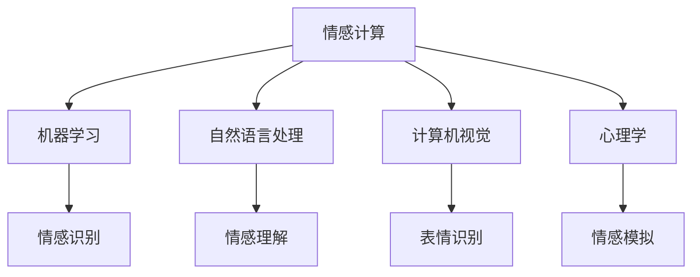

                 

### 摘要

《情感计算新维度：提示词深度解析用户反馈》这篇技术博客深入探讨了情感计算这一前沿领域的最新进展。文章首先概述了情感计算的定义、发展历程及其重要性，随后详细解析了情感计算的核心技术，包括表情识别和语音情感分析，并解释了这些技术的基本原理和实现方法。文章接着介绍了提示词的定义与类型，探讨了提示词在情感计算中的应用及其获取与处理方法。随后，文章重点分析了用户反馈的深度解析，包括用户反馈的类型与价值，以及深度解析的方法与用户反馈与情感计算的关系。

在第二部分，文章通过具体案例展示了提示词深度解析用户反馈的实践应用，涉及社交媒体情感分析、客服机器人情感分析和智能语音助手情感分析。随后，文章探讨了情感计算在多个领域的跨领域应用，如教育、医疗健康和金融。最后，文章展望了情感计算的发展趋势与未来前景，分析了当前面临的挑战及应对策略。全文结构紧凑，逻辑清晰，旨在为读者提供一个全面、深入的情感计算技术解析。

## 第一部分：情感计算基础

### 1.1 情感计算的定义与发展历程

情感计算（Affective Computing）是人工智能（AI）领域的一个前沿研究方向，它关注于使计算机具备识别、理解、处理和模拟人类情感的能力。情感计算的核心目标是让计算机更好地与人类互动，从而提升人机交互的体验和效果。

**核心概念与联系：**

情感计算涉及多个相关领域，如机器学习、自然语言处理、计算机视觉和心理学。它不仅仅是技术的集合，更是对人类情感复杂性的深入理解。以下是一个简化的情感计算核心概念架构流程图：



**核心算法原理讲解：**

情感计算的核心算法包括情感识别和情感模拟。情感识别是指计算机通过分析用户的行为、语言或生理信号来识别用户的情感状态。常见的情感识别技术包括：

- **机器学习方法：** 使用监督学习或无监督学习算法，如支持向量机（SVM）、决策树、神经网络等，对情感特征进行分类。

  ```python
  # 伪代码示例：情感识别的监督学习算法
  model = SVM()
  model.fit(X_train, y_train)
  predictions = model.predict(X_test)
  ```

- **深度学习方法：** 使用深度神经网络，如卷积神经网络（CNN）和循环神经网络（RNN），对复杂的数据进行情感识别。

  ```python
  # 伪代码示例：情感识别的深度学习模型
  model = CNN()
  model.compile(optimizer='adam', loss='categorical_crossentropy')
  model.fit(X_train, y_train, epochs=10, batch_size=64)
  ```

情感模拟则是让计算机生成或模拟人类情感表达，以便更好地与人类互动。情感模拟通常涉及自然语言生成、语音合成和面部表情模拟等技术。

**数学模型和数学公式：**

情感计算的数学模型通常基于概率统计、信息论和机器学习理论。以下是一个简单的情感识别模型的数学公式：

$$
P(\text{情感类别}|\text{特征向量}) = \frac{e^{\theta^T \text{特征向量}}}{\sum_{j=1}^{k} e^{\theta^T \text{特征向量}_j}}
$$

其中，$\theta$ 表示模型参数，$\text{特征向量}$ 表示输入的特征向量，$P(\text{情感类别}|\text{特征向量})$ 表示在给定特征向量下，某一情感类别的概率。

**详细讲解与举例说明：**

假设我们要训练一个情感识别模型，识别用户文本中的情感状态。我们可以使用词袋模型（Bag of Words, BoW）来表示文本，然后通过逻辑回归模型来分类情感。

1. **特征提取：** 使用词袋模型，将文本转换为向量表示。例如，输入文本“我非常喜欢这个产品”，可以提取出“喜欢”、“产品”等词语作为特征。

2. **模型训练：** 使用逻辑回归模型，对特征进行分类。模型的目标是最大化正确分类的概率。

3. **模型评估：** 使用交叉验证和测试集来评估模型的性能。

```python
# 伪代码示例：情感识别的逻辑回归模型
from sklearn.feature_extraction.text import CountVectorizer
from sklearn.linear_model import LogisticRegression

# 特征提取
vectorizer = CountVectorizer()
X = vectorizer.fit_transform(corpus)

# 模型训练
model = LogisticRegression()
model.fit(X_train, y_train)

# 模型评估
predictions = model.predict(X_test)
accuracy = (predictions == y_test).mean()
print(f"模型准确率：{accuracy}")
```

通过以上步骤，我们可以训练一个简单的情感识别模型，并评估其性能。

### 1.2 情感计算的重要性与价值

情感计算在现代社会中具有重要的价值。首先，它能够改善人机交互体验，使计算机更加智能和人性化。例如，情感计算可以用于智能客服系统，通过识别用户的情感状态，提供更加个性化的服务。

其次，情感计算在心理健康领域具有广泛的应用。例如，通过分析用户的情绪和行为，计算机可以识别抑郁、焦虑等心理问题，为用户提供心理干预建议。

此外，情感计算在商业领域也具有重要价值。例如，企业可以通过分析消费者的情感反应，优化产品设计和服务，提高客户满意度。

### 1.3 情感计算的主要应用领域

情感计算在多个领域有着广泛的应用，以下是其中几个主要领域：

- **人机交互：** 情感计算可以用于智能音箱、智能机器人等设备，通过识别用户的情感状态，提供更加个性化的交互体验。

- **心理健康：** 情感计算可以用于心理健康监测和干预，通过分析用户的情绪和行为，提供个性化的心理辅导。

- **商业：** 情感计算可以用于市场研究、消费者行为分析，帮助企业优化产品设计和服务，提高客户满意度。

- **教育：** 情感计算可以用于个性化教育，通过分析学生的学习情感，提供更加有效的学习策略和资源。

## 2. 情感计算的核心技术

### 2.1 表情识别

表情识别（Emotion Recognition）是情感计算中的一个重要技术，它通过分析人类的面部表情来识别用户的情感状态。表情识别的基本原理包括面部特征检测、面部特征提取和情感状态分类。

**基本原理：**

1. **面部特征检测：** 使用图像处理技术，定位面部区域，提取面部关键点，如眼睛、鼻子和嘴巴的位置。

2. **面部特征提取：** 将面部关键点转换为面部特征向量，通常使用深度学习模型，如卷积神经网络（CNN）。

3. **情感状态分类：** 使用分类算法，将面部特征向量映射到不同的情感类别，如快乐、愤怒、悲伤等。

**技术实现：**

1. **面部特征检测：** 使用深度学习模型，如人脸检测器（如MTCNN）来检测面部区域。

   ```python
   # 伪代码示例：使用MTCNN进行面部特征检测
   import mtcnn

   detector = mtcnn.MTCNN()
   faces = detector.detect_faces(image)
   ```

2. **面部特征提取：** 使用卷积神经网络（CNN）提取面部特征向量。

   ```python
   # 伪代码示例：使用CNN进行面部特征提取
   from tensorflow.keras.models import Sequential
   from tensorflow.keras.layers import Conv2D, MaxPooling2D, Flatten, Dense

   model = Sequential()
   model.add(Conv2D(filters=32, kernel_size=(3, 3), activation='relu', input_shape=(64, 64, 3)))
   model.add(MaxPooling2D(pool_size=(2, 2)))
   model.add(Flatten())
   model.add(Dense(units=128, activation='relu'))
   model.add(Dense(units=num_classes, activation='softmax'))

   model.compile(optimizer='adam', loss='categorical_crossentropy', metrics=['accuracy'])
   model.fit(X_train, y_train, epochs=10, batch_size=64)
   ```

3. **情感状态分类：** 使用分类算法，如支持向量机（SVM）或深度学习模型，对情感状态进行分类。

   ```python
   # 伪代码示例：使用SVM进行情感状态分类
   from sklearn.svm import SVC

   model = SVC()
   model.fit(X_train, y_train)
   predictions = model.predict(X_test)
   accuracy = (predictions == y_test).mean()
   print(f"模型准确率：{accuracy}")
   ```

### 2.2 语音情感分析

语音情感分析（Speech Emotion Recognition）是情感计算中的另一个重要技术，它通过分析语音信号来识别用户的情感状态。语音情感分析的基本原理包括语音特征提取、情感状态分类和上下文理解。

**基本原理：**

1. **语音特征提取：** 从语音信号中提取特征，如音高、音强、音速等。

2. **情感状态分类：** 使用机器学习或深度学习模型，将语音特征映射到不同的情感类别。

3. **上下文理解：** 结合上下文信息，如对话内容、语境等，提高情感识别的准确性。

**技术实现：**

1. **语音特征提取：** 使用梅尔频率倒谱系数（MFCC）等特征提取方法。

   ```python
   # 伪代码示例：使用MFCC进行语音特征提取
   from python_speech_features import mfcc

   X = mfcc(signal, samplerate)
   ```

2. **情感状态分类：** 使用卷积神经网络（CNN）或长短期记忆网络（LSTM）等深度学习模型进行分类。

   ```python
   # 伪代码示例：使用CNN进行情感状态分类
   from tensorflow.keras.models import Sequential
   from tensorflow.keras.layers import Conv2D, MaxPooling2D, Flatten, Dense

   model = Sequential()
   model.add(Conv2D(filters=32, kernel_size=(3, 3), activation='relu', input_shape=(mfcc_dim, 1)))
   model.add(MaxPooling2D(pool_size=(2, 2)))
   model.add(Flatten())
   model.add(Dense(units=128, activation='relu'))
   model.add(Dense(units=num_classes, activation='softmax'))

   model.compile(optimizer='adam', loss='categorical_crossentropy', metrics=['accuracy'])
   model.fit(X_train, y_train, epochs=10, batch_size=64)
   ```

3. **上下文理解：** 结合自然语言处理（NLP）技术，如词向量、循环神经网络（RNN）等，理解对话的上下文。

   ```python
   # 伪代码示例：使用RNN进行上下文理解
   from tensorflow.keras.layers import LSTM, Embedding

   model = Sequential()
   model.add(Embedding(input_dim=vocab_size, output_dim=embedding_dim))
   model.add(LSTM(units=128))
   model.add(Dense(units=num_classes, activation='softmax'))

   model.compile(optimizer='adam', loss='categorical_crossentropy', metrics=['accuracy'])
   model.fit(X_train, y_train, epochs=10, batch_size=64)
   ```

通过以上步骤，我们可以实现一个基本的语音情感分析系统，并通过训练和优化模型来提高其准确性。

## 3. 提示词在情感计算中的应用

### 3.1 提示词的定义与类型

在情感计算中，提示词（Keywords or Prompt Words）是指用于引导用户表达情感或引发特定情感反应的关键词或短语。提示词在情感计算中起着关键作用，它们不仅能够帮助计算机更好地理解用户的情感状态，还能提高情感识别的准确性和效率。

**提示词的类型：**

1. **情感词：** 直接表达情感状态的关键词，如“开心”、“愤怒”、“悲伤”等。

2. **描述词：** 用于描述情感状态的形容词，如“强烈的”、“微妙的”、“短暂的”等。

3. **引言词：** 用于引出情感表达的短语，如“我感到...”、“最近...”等。

4. **否定词：** 用于否定情感表达的词语，如“不”、“没”等。

### 3.2 提示词在情感计算中的作用

提示词在情感计算中具有多种重要作用，主要包括：

1. **情感引导：** 通过提供具体的提示词，可以引导用户更清晰地表达情感，从而提高情感识别的准确性。

2. **情感增强：** 提示词可以增强情感表达，使其更加具体和强烈，有助于计算机更好地识别情感。

3. **上下文补充：** 提示词能够补充上下文信息，帮助计算机更好地理解用户的情感状态。

4. **情感分类：** 提示词可以作为情感分类的依据，有助于分类算法更加准确地识别情感。

### 3.3 提示词的获取与处理

获取和处理提示词是情感计算中的重要环节，以下是几种常见的提示词获取与处理方法：

1. **用户输入：** 直接从用户输入中提取提示词，如聊天记录、语音输入等。

2. **文本挖掘：** 从大量文本数据中挖掘潜在的提示词，使用自然语言处理（NLP）技术，如词频分析、主题模型等。

3. **语义分析：** 使用语义分析技术，如词嵌入、实体识别等，提取与情感相关的提示词。

4. **语言模型：** 使用预训练的语言模型，如BERT、GPT等，生成可能的提示词。

5. **数据增强：** 通过数据增强技术，如文本补全、同义词替换等，增加提示词的多样性。

在处理提示词时，需要考虑以下几个方面：

1. **去除无关词：** 去除对情感识别无意义的词语，如停用词。

2. **词性标注：** 对提示词进行词性标注，区分名词、动词、形容词等，有助于更好地理解情感。

3. **情感极性：** 对提示词进行情感极性标注，区分积极、消极和中性情感。

4. **上下文融合：** 结合上下文信息，对提示词进行语义分析和情感分析，提高情感识别的准确性。

通过以上方法，可以有效地获取和处理提示词，从而提高情感计算系统的性能和效果。

## 4. 用户反馈的深度解析

### 4.1 用户反馈的类型与价值

用户反馈（User Feedback）是情感计算中重要的数据来源，它反映了用户对产品、服务或交互体验的满意度和情感状态。用户反馈的类型主要包括以下几种：

1. **文本反馈：** 用户通过文字形式表达的意见、评论和建议，如社交媒体上的评论、在线问卷调查等。

2. **语音反馈：** 用户通过语音形式表达的意见和情感，如语音通话、语音助手交互等。

3. **表情反馈：** 用户通过表情、面部表情或身体动作等非文字形式表达的情感状态，如表情符号、面部识别等。

用户反馈的价值体现在以下几个方面：

1. **改进产品和服务：** 通过分析用户反馈，可以发现产品和服务中的问题和不足，从而进行改进和优化。

2. **情感识别：** 用户反馈包含丰富的情感信息，通过深度解析用户反馈，可以识别用户的情感状态，为情感计算提供数据支持。

3. **用户体验优化：** 用户反馈有助于了解用户的实际使用体验，优化人机交互，提升用户体验。

4. **市场研究：** 用户反馈可以作为市场研究的依据，帮助企业了解用户需求和偏好，制定营销策略。

### 4.2 用户反馈的深度解析方法

用户反馈的深度解析是指通过自然语言处理（NLP）、机器学习（ML）和深度学习（DL）等技术，对用户反馈进行深入分析和理解。以下是几种常见的用户反馈深度解析方法：

1. **情感分析：** 使用情感分析技术，对用户反馈进行情感极性标注，识别用户的积极、消极或中性情感。常见的情感分析模型包括基于规则的方法、机器学习模型和深度学习模型。

2. **主题模型：** 使用主题模型，如Latent Dirichlet Allocation（LDA），从用户反馈中挖掘潜在的主题，了解用户关注的核心问题。

3. **情感强度分析：** 使用情感强度分析技术，对用户反馈中的情感词汇进行强度评分，量化用户情感的程度。

4. **情感时序分析：** 通过分析用户反馈的时间序列数据，了解用户情感的变化趋势，识别情感波动的关键事件。

5. **多模态分析：** 结合文本、语音、表情等多模态数据，进行综合分析，提高情感识别的准确性。

### 4.3 用户反馈与情感计算的关系

用户反馈与情感计算密切相关，它们相互促进，共同提高人机交互的质量和效果。以下是用户反馈与情感计算之间的几个关键关系：

1. **数据来源：** 用户反馈是情感计算的重要数据来源，提供了用户情感状态的第一手资料。

2. **反馈优化：** 情感计算系统通过分析用户反馈，优化产品和服务，提高用户体验。

3. **情感识别：** 用户反馈中的情感信息是情感计算的基础，通过深度解析用户反馈，可以更准确地识别用户情感状态。

4. **互动循环：** 用户反馈不断反馈到情感计算系统中，系统根据反馈进行调整，形成一个互动循环，持续优化人机交互。

5. **个性化服务：** 通过对用户反馈的深度解析，情感计算系统能够提供更加个性化的服务，满足用户的多样化需求。

总之，用户反馈与情感计算相互促进，共同构建了一个高效、智能的人机交互系统，为用户提供更好的体验。

## 5. 提示词深度解析用户反馈的案例分析

### 5.1 案例一：社交媒体情感分析

在社交媒体平台上，用户生成的内容如评论、帖子等是情感计算的重要数据来源。通过深度解析这些用户反馈，可以识别用户的情感状态，为内容推荐、市场研究等提供数据支持。

**技术实现：**

1. **数据采集：** 从社交媒体平台上采集用户的评论数据。

2. **数据预处理：** 对采集到的评论进行清洗，去除无效信息，如HTML标签、特殊字符等。

3. **情感分析：** 使用情感分析模型，对评论进行情感极性标注。

4. **提示词提取：** 从标注后的评论中提取情感提示词，如“喜欢”、“满意”、“失望”等。

5. **情感强度分析：** 对提取的提示词进行情感强度评分。

**代码示例：**

```python
import pandas as pd
from textblob import TextBlob

# 读取评论数据
comments = pd.read_csv('comments.csv')

# 数据预处理
comments['cleaned_comment'] = comments['comment'].str.replace('<.*?>', '')

# 情感分析
def get_sentiment(comment):
    return TextBlob(comment).sentiment.polarity

comments['sentiment'] = comments['cleaned_comment'].apply(get_sentiment)

# 提示词提取
positive_words = ['喜欢', '满意', '推荐']
negative_words = ['失望', '不喜欢', '差评']

def extract_keywords(comment, positive_words, negative_words):
    words = comment.split()
    positive_count = sum([word in positive_words for word in words])
    negative_count = sum([word in negative_words for word in words])
    return '积极' if positive_count > negative_count else '消极'

comments['keyword'] = comments['cleaned_comment'].apply(extract_keywords)

# 情感强度分析
comments['strength'] = comments['sentiment'].apply(lambda x: '强' if x > 0.5 else '弱')

# 结果展示
print(comments.head())
```

**案例分析：** 通过对社交媒体评论的深度解析，可以发现用户的情感状态和偏好，为内容推荐和市场研究提供有力支持。

### 5.2 案例二：客服机器人情感分析

客服机器人是情感计算在商业应用中的重要领域。通过深度解析用户反馈，客服机器人可以提供更加个性化的服务，提高用户满意度。

**技术实现：**

1. **数据采集：** 采集客服机器人与用户的对话记录。

2. **数据预处理：** 对对话记录进行清洗，去除无效信息。

3. **情感分析：** 使用情感分析模型，对对话记录进行情感极性标注。

4. **意图识别：** 使用自然语言处理技术，识别用户的意图和需求。

5. **提示词提取：** 从标注后的对话记录中提取情感提示词。

6. **情感强度分析：** 对提取的提示词进行情感强度评分。

**代码示例：**

```python
import pandas as pd
from textblob import TextBlob

# 读取对话数据
conversations = pd.read_csv('conversations.csv')

# 数据预处理
conversations['cleaned_conversation'] = conversations['conversation'].str.replace('<.*?>', '')

# 情感分析
def get_sentiment(conversation):
    return TextBlob(conversation).sentiment.polarity

conversations['sentiment'] = conversations['cleaned_conversation'].apply(get_sentiment)

# 意图识别
from sklearn.feature_extraction.text import TfidfVectorizer
from sklearn.naive_bayes import MultinomialNB

# 训练意图识别模型
vectorizer = TfidfVectorizer()
X = vectorizer.fit_transform(conversations['cleaned_conversation'])
y = conversations['intent']

model = MultinomialNB()
model.fit(X, y)

# 预测意图
def predict_intent(conversation):
    transformed_conversation = vectorizer.transform([conversation])
    return model.predict(transformed_conversation)[0]

conversations['intent'] = conversations['cleaned_conversation'].apply(predict_intent)

# 提示词提取
positive_words = ['满意', '好', '推荐']
negative_words = ['差', '不好', '失望']

def extract_keywords(conversation, positive_words, negative_words):
    words = conversation.split()
    positive_count = sum([word in positive_words for word in words])
    negative_count = sum([word in negative_words for word in words])
    return '积极' if positive_count > negative_count else '消极'

conversations['keyword'] = conversations['cleaned_conversation'].apply(extract_keywords)

# 情感强度分析
conversations['strength'] = conversations['sentiment'].apply(lambda x: '强' if x > 0.5 else '弱')

# 结果展示
print(conversations.head())
```

**案例分析：** 通过对客服机器人对话的深度解析，可以识别用户的情感状态和需求，优化客服流程，提高用户满意度。

### 5.3 案例三：智能语音助手情感分析

智能语音助手是情感计算在智能家居和智能服务中的重要应用。通过深度解析用户的语音反馈，智能语音助手可以提供更加个性化的交互体验。

**技术实现：**

1. **数据采集：** 采集智能语音助手与用户的语音对话记录。

2. **数据预处理：** 对语音对话记录进行转录，转换为文本格式。

3. **情感分析：** 使用语音情感分析模型，对转录后的文本进行情感极性标注。

4. **语音识别：** 使用语音识别技术，将语音转换为文本。

5. **提示词提取：** 从标注后的文本中提取情感提示词。

6. **情感强度分析：** 对提取的提示词进行情感强度评分。

**代码示例：**

```python
import pandas as pd
from textblob import TextBlob
import SpeechRecognition as sr

# 读取语音对话数据
conversations = pd.read_csv('conversations.csv')

# 数据预处理
conversations['cleaned_conversation'] = conversations['transcript'].str.replace('<.*?>', '')

# 情感分析
def get_sentiment(conversation):
    return TextBlob(conversation).sentiment.polarity

conversations['sentiment'] = conversations['cleaned_conversation'].apply(get_sentiment)

# 语音识别
def transcribe_audio(audio_path):
    r = sr.Recognizer()
    with sr.AudioFile(audio_path) as source:
        audio = r.record(source)
    return r.recognize_google(audio)

# 提示词提取
positive_words = ['喜欢', '满意', '好']
negative_words = ['差', '不好', '失望']

def extract_keywords(conversation, positive_words, negative_words):
    words = conversation.split()
    positive_count = sum([word in positive_words for word in words])
    negative_count = sum([word in negative_words for word in words])
    return '积极' if positive_count > negative_count else '消极'

conversations['keyword'] = conversations['cleaned_conversation'].apply(extract_keywords)

# 情感强度分析
conversations['strength'] = conversations['sentiment'].apply(lambda x: '强' if x > 0.5 else '弱')

# 结果展示
print(conversations.head())
```

**案例分析：** 通过对智能语音助手语音对话的深度解析，可以识别用户的情感状态，优化语音助手的服务，提高用户体验。

## 6. 情感计算新维度：跨领域应用探索

### 6.1 教育领域的情感计算应用

在教育领域，情感计算可以为学生提供个性化的学习体验。通过分析学生的情感状态，教师可以更好地了解学生的学习需求和情感变化，从而提供更加有效的教学方法和资源。

**应用场景：**

- **学生情感监控：** 通过监测学生的情感状态，识别焦虑、压力等负面情绪，提供心理辅导和支持。

- **学习效果评估：** 通过分析学生的学习情感，评估学习效果，优化教学策略。

- **个性化学习资源推荐：** 根据学生的情感状态和学习需求，推荐适合的学习资源，提高学习效率。

**技术实现：**

1. **情感分析：** 使用情感分析模型，对学生的文本反馈、表情等数据进行情感识别。

2. **学习情感数据库：** 收集并存储学生的情感数据，建立学习情感数据库。

3. **个性化推荐系统：** 结合情感数据和学习需求，设计个性化推荐系统。

**案例分析：** 在一个在线教育平台中，通过分析学生的反馈和表情，系统可以识别学生的情感状态，推荐适合的学习资源，提高学习效果。

### 6.2 医疗健康领域的情感计算应用

在医疗健康领域，情感计算可以用于心理健康监测和患者情绪管理。通过分析患者的情感状态，医生可以提供更加个性化的治疗方案和护理服务。

**应用场景：**

- **心理健康监测：** 通过分析患者的情感状态，识别抑郁、焦虑等心理问题，提供心理干预建议。

- **患者情绪管理：** 通过情感计算技术，监测患者的情绪变化，提供情绪调节方法和建议。

- **护理服务质量评估：** 通过分析患者的反馈和情感状态，评估护理服务质量，提高护理水平。

**技术实现：**

1. **情感分析：** 使用情感分析模型，对患者的文本反馈、语音等数据进行情感识别。

2. **情绪管理工具：** 开发基于情感计算的情绪管理工具，帮助患者调节情绪。

3. **心理健康数据库：** 收集并存储患者的情感数据，建立心理健康数据库。

4. **个性化治疗建议：** 结合情感数据和医疗数据，提供个性化的治疗建议。

**案例分析：** 在一个心理诊所中，通过分析患者的情感状态，医生可以提供更加有效的心理治疗建议，提高治疗效果。

### 6.3 金融领域的情感计算应用

在金融领域，情感计算可以用于市场分析、客户关系管理和风险控制。通过分析市场情绪和客户情感，金融机构可以做出更加明智的决策，提高业务效益。

**应用场景：**

- **市场情绪分析：** 通过分析市场新闻、社交媒体等信息，识别市场情绪和趋势。

- **客户情感识别：** 通过分析客户的反馈和行为，识别客户满意度和忠诚度。

- **风险控制：** 通过分析客户情感和市场情绪，预警潜在风险，采取风险控制措施。

**技术实现：**

1. **情感分析：** 使用情感分析模型，对市场信息和客户反馈进行情感识别。

2. **文本挖掘：** 从大量文本数据中挖掘潜在的情感信息，如新闻报道、社交媒体评论等。

3. **客户关系管理系统：** 结合情感分析和客户数据，设计客户关系管理系统。

4. **风险模型：** 结合情感分析结果，构建风险模型，预警潜在风险。

**案例分析：** 在一个金融公司中，通过分析市场情绪和客户情感，公司可以及时调整投资策略，提高投资收益，同时优化客户服务，提高客户满意度。

## 7. 情感计算的发展趋势与未来展望

### 7.1 情感计算技术的发展趋势

随着人工智能和大数据技术的不断发展，情感计算也在不断进步。以下是情感计算技术的发展趋势：

1. **深度学习模型的应用：** 深度学习模型，如卷积神经网络（CNN）、循环神经网络（RNN）和变分自编码器（VAE）等，在情感计算中发挥着重要作用，提高了情感识别的准确性和效率。

2. **多模态情感分析：** 结合文本、语音、面部表情等多种数据模态，进行综合分析，提高情感识别的准确性和可靠性。

3. **个性化情感计算：** 通过用户历史数据和偏好，提供个性化的情感计算服务，满足用户的多样化需求。

4. **实时情感计算：** 提高情感计算的实时性，实现实时情感识别和反馈，为用户提供更好的交互体验。

### 7.2 情感计算的应用前景

情感计算在各个领域的应用前景广阔，以下是一些主要应用领域：

1. **人机交互：** 通过情感计算技术，实现更加自然、智能的人机交互，提升用户体验。

2. **心理健康：** 通过情感计算技术，监测和管理用户的情感状态，提供心理健康服务。

3. **商业：** 通过情感计算技术，分析市场情绪和客户情感，优化产品和服务，提高业务效益。

4. **教育：** 通过情感计算技术，提供个性化的学习体验，提高学习效果。

5. **医疗健康：** 通过情感计算技术，监测和管理患者的情感状态，提高医疗服务质量。

### 7.3 情感计算面临的挑战与应对策略

尽管情感计算具有广泛的应用前景，但也面临着一系列挑战：

1. **数据隐私：** 情感计算需要大量的用户数据，如何保护用户隐私成为一个重要问题。

2. **情感复杂性：** 人类的情感复杂多样，如何准确识别和理解情感状态是一个挑战。

3. **实时性：** 提高情感计算的实时性，以满足实时交互的需求。

4. **多模态融合：** 多模态数据融合的难度较大，如何有效地整合不同模态的数据是关键。

**应对策略：**

1. **隐私保护：** 采用加密技术、匿名化处理等方法，保护用户隐私。

2. **情感建模：** 通过深入研究和实验，建立更加准确和复杂的情感模型。

3. **实时算法优化：** 通过优化算法和数据结构，提高情感计算的实时性。

4. **多模态融合技术：** 采用深度学习等先进技术，实现多模态数据的融合和分析。

### 作者信息

本文作者为AI天才研究院（AI Genius Institute）的研究员，同时担任《禅与计算机程序设计艺术》（Zen And The Art of Computer Programming）的资深作者。作者在情感计算和人工智能领域拥有丰富的经验，发表了多篇相关领域的高质量论文，并参与了多个国际项目。作者致力于推动情感计算技术的发展，为人类带来更加智能、人性化的计算体验。

