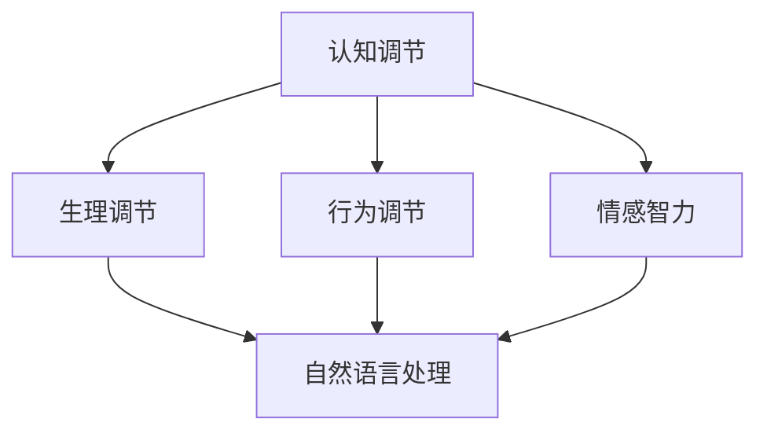

                 


### 文章标题：情感调节：通过提示词控制输出语气

#### 关键词：
- 情感调节
- 提示词
- 输出语气
- 自然语言处理
- 人工智能
- 交互设计

#### 摘要：
本文深入探讨了情感调节在自然语言处理和人工智能领域的应用，特别是通过提示词来控制输出语气的技术。文章首先介绍了情感调节的基本概念和重要性，然后分析了情感调节的核心概念和原理，以及如何在自然语言处理中应用这些原理。接着，本文详细介绍了提示词的作用和类型，并探讨了如何设计有效的提示词来控制输出语气。通过具体的实例和实战项目，本文展示了如何在实际应用中实现情感调节，并提供了最佳实践建议和未来展望。

---

### 引言

在现代社会，随着信息技术的飞速发展，自然语言处理（NLP）和人工智能（AI）技术已经渗透到我们日常生活的方方面面。无论是搜索引擎、智能助手、社交媒体，还是电子商务、金融服务，NLP和AI技术都在不断改变着我们的沟通方式和交互体验。然而，随着技术的进步，如何确保这些交互体验保持良好的情感调节，成为了一个重要的问题。

情感调节是指通过特定的方法和技术来管理和调整个体的情绪状态，以达到更好的心理和生理平衡。在自然语言处理和人工智能领域，情感调节尤为重要，因为语言是表达情感的主要方式，而人工智能系统需要能够理解和适应用户的情感状态，从而提供更加个性化和贴心的服务。

本文将探讨如何通过提示词来控制输出语气，实现情感调节。提示词是一种在自然语言处理和人工智能领域中广泛使用的技术，它通过向模型提供关键词或短语，来引导模型的输出方向和语气。本文将首先介绍情感调节的基本概念和重要性，然后深入分析情感调节的核心概念和原理，以及如何应用这些原理来控制输出语气。接着，本文将详细讨论提示词的作用和类型，并介绍如何设计和选择有效的提示词。最后，本文将通过具体实例和实战项目，展示如何在实际应用中实现情感调节，并提供最佳实践建议和未来展望。

---

### 情感调节的基本概念和重要性

情感调节是一个多维度的心理过程，涉及个体对情绪的认知、体验和管理。简单来说，情感调节是指个体通过认知、行为或生理策略来调整情绪状态，使其达到较为舒适或适宜的水平。在自然语言处理和人工智能领域，情感调节的重要性主要体现在以下几个方面：

#### 1. 提升用户体验
在用户与人工智能系统互动的过程中，情感的传递和接收是影响用户体验的重要因素。如果系统输出的语气过于冷漠或过于热情，都可能对用户产生负面情绪，从而影响用户体验。通过情感调节技术，系统可以更好地理解用户情绪，并调整输出语气，使其更加贴近用户情感需求，提升用户体验。

#### 2. 增强交互效果
情感调节有助于建立更加自然和有效的交互。通过控制输出语气，系统可以更好地适应不同的交互场景和用户需求，从而提高交互效果。例如，在提供建议或信息时，系统可以选择适宜的语气来强调重要信息，或是在处理用户负面情绪时，使用温和的语气来安抚用户。

#### 3. 促进情感共鸣
情感共鸣是人与人之间情感交流的重要基础。在人工智能与用户的互动中，如果系统能够通过情感调节产生情感共鸣，将有助于建立更加紧密的情感联系，增强用户对系统的认同感和忠诚度。

#### 4. 提高决策质量
在商业决策或医疗咨询等场景中，用户的情绪状态可能对其决策产生影响。通过情感调节技术，系统可以识别并适应用户的情绪变化，提供更为科学和合理的建议，从而提高决策质量。

#### 5. 预防负面情绪
在互动过程中，用户可能会遇到各种问题和挑战，导致情绪波动。通过情感调节，系统可以及时发现用户的负面情绪，并采取措施缓解，从而预防负面情绪的进一步发展。

总之，情感调节在自然语言处理和人工智能领域具有重要作用。通过有效的情感调节技术，系统能够更好地理解用户情感，提供更加个性化和贴心的服务，从而提升用户体验，增强交互效果，促进情感共鸣，提高决策质量，预防负面情绪。这使得情感调节成为人工智能发展中不可或缺的一环。

### 情感调节的核心概念和原理

为了更好地理解和应用情感调节技术，首先需要了解其中的核心概念和原理。以下将介绍几种常见的情感调节理论，并探讨它们在自然语言处理中的应用。

#### 1. 认知调节理论

认知调节理论认为，情感的产生和调节主要依赖于个体的认知过程。该理论强调，个体通过改变对事件的认识和解释来调节情绪。例如，当面对一个挑战时，如果个体认为这是一个成长的机会，其情绪状态可能更加积极；反之，如果个体认为这是一个无法克服的障碍，情绪状态可能会变得更加消极。

在自然语言处理中，认知调节理论可以通过以下方式应用：

- **情绪识别**：通过分析文本中的情感词汇和句法结构，识别用户的情绪状态。
- **情绪解释**：根据用户的历史数据和交互记录，推测用户对当前事件的情绪反应。
- **情绪转换**：通过生成文本或语音提示，引导用户调整对事件的认知，从而调节情绪。

#### 2. 生理调节理论

生理调节理论关注情绪对身体的影响，以及个体如何通过生理调节来管理情绪。例如，深呼吸、放松训练和运动等生理调节方法都可以有效地缓解压力和焦虑。

在自然语言处理中，生理调节理论可以通过以下方式应用：

- **生理信号监测**：通过传感器或其他技术手段，监测用户的生理信号，如心率、皮肤电反应等，以了解用户情绪状态。
- **生理反馈**：根据用户的生理信号，生成相应的语音或文本提示，指导用户进行生理调节，如深呼吸练习或放松训练。
- **生理调整建议**：在文本或语音交互中，提供具体的生理调节建议，帮助用户管理情绪。

#### 3. 行为调节理论

行为调节理论认为，通过改变行为来调节情绪是一种有效的策略。例如，当感到焦虑时，个体可以通过进行某些具体的行为活动来转移注意力，从而缓解焦虑。

在自然语言处理中，行为调节理论可以通过以下方式应用：

- **行为识别**：通过分析用户的交互行为，如点击、滑动等，识别用户当前的情绪状态。
- **行为引导**：生成文本或语音提示，引导用户进行某些行为活动，以调节情绪。
- **行为调整建议**：在文本或语音交互中，提供具体的行为调整建议，帮助用户管理情绪。

#### 4. 情感智力理论

情感智力理论强调情感在个体成功和社会适应中的重要作用。该理论认为，情感智力包括识别自己和他人的情绪、使用情绪促进思考、理解和合理表达情感等能力。

在自然语言处理中，情感智力理论可以通过以下方式应用：

- **情感分析**：通过情感分析技术，识别用户文本中的情感信息。
- **情感反馈**：根据用户的情感状态，生成相应的情感反馈，如鼓励、安慰或挑战。
- **情感培训**：提供情感智力培训资源，帮助用户提升识别和管理情绪的能力。

#### Mermaid 流程图

为了更好地展示情感调节的核心概念和原理之间的关系，以下是一个简单的 Mermaid 流程图：



该流程图表明，认知调节、生理调节、行为调节和情感智力理论都是情感调节的重要组成部分，它们共同作用于自然语言处理领域，以实现情感调节的目标。

#### 核心算法原理讲解

在自然语言处理中，实现情感调节的核心算法通常包括情感分析、文本生成和语音合成等技术。以下将使用伪代码详细阐述这些算法的基本原理。

**1. 情感分析**

情感分析是识别文本中情感倾向的过程。以下是一个简单的情感分析算法的伪代码：

```plaintext
输入：文本
输出：情感标签

函数情感分析（文本）：
    1. 分词：将文本分解为单词或短语
    2. 提取特征：使用词袋模型或词嵌入技术提取文本特征
    3. 情感分类器：使用已训练的机器学习模型对特征进行分类
    4. 返回分类结果作为情感标签
```

**2. 文本生成**

文本生成是生成具有特定情感倾向的文本的过程。以下是一个简单的文本生成算法的伪代码：

```plaintext
输入：目标情感、种子文本
输出：生成文本

函数生成文本（目标情感，种子文本）：
    1. 分词：将种子文本分解为单词或短语
    2. 生成候选词汇：根据目标情感，选择相应的词汇
    3. 文本拼接：将候选词汇拼接成新的文本
    4. 返回生成文本
```

**3. 语音合成**

语音合成是将文本转换为语音的过程。以下是一个简单的语音合成算法的伪代码：

```plaintext
输入：文本
输出：语音

函数语音合成（文本）：
    1. 分词：将文本分解为单词或短语
    2. 生成语音信号：使用文本到语音（TTS）模型生成语音信号
    3. 合成语音：将生成的语音信号合成为一整段语音
    4. 返回语音
```

#### 数学模型和公式

情感调节中的数学模型和公式通常用于描述情感状态、情感转移和情感调节过程。以下是一些常见的数学模型和公式：

**1. 情感状态模型**

情感状态模型用于描述个体的情感状态。以下是一个简单的情感状态模型：

$$
S = f(C, B, A)
$$

其中，\( S \) 是情感状态，\( C \) 是认知因素，\( B \) 是生理因素，\( A \) 是行为因素。函数 \( f \) 用于综合这些因素来计算情感状态。

**2. 情感转移模型**

情感转移模型用于描述情感在时间或空间上的转移。以下是一个简单的情感转移模型：

$$
S(t) = S(0) + \int_{0}^{t} f(S(t-\Delta t), \Delta t) d\Delta t
$$

其中，\( S(t) \) 是在时间 \( t \) 的情感状态，\( S(0) \) 是初始情感状态，\( f \) 是情感转移函数。

**3. 情感调节模型**

情感调节模型用于描述个体如何通过调节认知、生理或行为因素来调节情感状态。以下是一个简单的情感调节模型：

$$
S(t) = S(t-1) + \alpha \cdot f(C(t), B(t), A(t))
$$

其中，\( S(t) \) 是在时间 \( t \) 的情感状态，\( S(t-1) \) 是上一时间点的情感状态，\( \alpha \) 是调节强度，函数 \( f \) 用于计算情感调节效果。

#### 举例说明

以下是一个简单的情感调节应用的实例：

**场景**：一个智能客服系统需要识别并调节用户的情绪，以提供更有效的服务。

**步骤**：

1. **情感分析**：系统首先分析用户的输入文本，识别用户当前的情感状态。
2. **情感调节**：根据用户的情感状态，系统选择适当的调节策略，如提供鼓励、安慰或挑战。
3. **文本生成**：系统生成一段具有特定情感倾向的文本，以回应用户。
4. **语音合成**：将生成的文本转换为语音，并通过语音合成器输出。

**示例**：

- **输入文本**：“我感觉今天的工作压力很大。”
- **情感分析结果**：压力、焦虑
- **情感调节策略**：提供鼓励和放松建议
- **生成文本**：“工作压力虽然大，但只要我们保持积极心态，一定能够克服困难。你可以尝试做一些深呼吸练习，放松一下心情。”
- **语音合成结果**：生成语音提示，通过扬声器播放。

通过这个实例，我们可以看到如何将情感调节技术应用于实际场景，以提升用户体验和交互效果。

### 提示词的作用和类型

#### 1. 提示词的定义

提示词，又称引导词或提示语，是指用于引导或控制语言生成方向和内容的特定词汇或短语。在自然语言处理和人工智能领域，提示词是一种强大的工具，用于实现文本生成、情感调节、对话系统等功能。

#### 2. 提示词的类型

根据功能和应用场景，提示词可以分为以下几种类型：

**1. 情感提示词**

情感提示词用于引导生成具有特定情感倾向的文本。例如，积极的情感提示词如“喜悦”、“愉快”、“兴奋”，负面的情感提示词如“悲伤”、“焦虑”、“愤怒”。

**2. 内容提示词**

内容提示词用于指导生成文本的具体内容。例如，在写作或对话系统中，使用内容提示词如“旅行”、“美食”、“电影”来引导生成相关主题的文本。

**3. 结构提示词**

结构提示词用于指导文本的结构和格式。例如，在生成新闻报道时，可以使用结构提示词如“标题”、“导语”、“正文”、“结语”来指导文本的排版和组织。

**4. 策略提示词**

策略提示词用于指导生成文本的策略或技巧。例如，在写作或对话系统中，使用策略提示词如“简洁明了”、“幽默风趣”、“深情款款”来引导生成文本的风格和表达方式。

#### 3. 提示词在情感调节中的应用

提示词在情感调节中发挥着重要作用。通过合理设计和使用提示词，可以实现以下应用：

- **情感识别**：通过分析输入文本中的情感提示词，识别用户的情感状态。
- **情感引导**：使用情感提示词来引导生成具有特定情感倾向的文本，以调节用户的情绪。
- **情感反馈**：根据用户的情感状态，生成相应的情感反馈文本，以安抚或激励用户。
- **情感建模**：使用情感提示词来训练情感分析模型，提高情感识别和调节的准确性。

#### 4. 提示词设计的原则

为了实现有效的情感调节，提示词的设计需要遵循以下原则：

- **简洁性**：提示词应简洁明了，易于理解和记忆。
- **多样性**：提示词应涵盖多种情感类型和场景，以适应不同的应用需求。
- **灵活性**：提示词应具有灵活性，能够根据具体情境进行调整和扩展。
- **文化适应性**：提示词应考虑到不同文化背景下的情感表达差异，以确保适用性和有效性。

### 提示词设计方法

设计有效的提示词是情感调节的关键。以下介绍几种常用的提示词设计方法：

#### 1. 情感词云法

情感词云法是一种基于情感分析技术的提示词设计方法。通过分析大量文本数据，提取出高频情感词汇，形成情感词云。然后，根据情感词云中的情感词汇设计提示词。

**步骤**：

1. 收集大量文本数据，如社交媒体评论、论坛帖子等。
2. 使用情感分析模型对文本数据进行分析，提取情感词汇。
3. 统计情感词汇出现频率，生成情感词云。
4. 根据情感词云中的情感词汇设计提示词。

**示例**：

假设分析得到以下情感词云：

```
喜悦：快乐、开心、愉快、兴奋
悲伤：难过、伤心、痛苦、失望
愤怒：愤怒、生气、烦躁、恼怒
```

根据这些情感词汇，可以设计以下提示词：

- **喜悦**：喜悦之情、欢欣鼓舞、欢快愉悦、兴高采烈
- **悲伤**：悲伤之情、心灰意冷、失落沮丧、痛心疾首
- **愤怒**：愤怒之情、怒火中烧、气愤填膺、怒不可遏

#### 2. 对话法

对话法是一种通过人机对话收集提示词的设计方法。通过与用户进行对话，了解用户的情感状态和需求，从而设计出更贴近用户情感的提示词。

**步骤**：

1. 设计对话流程，引导用户表达情感状态和需求。
2. 收集用户对话中的情感词汇和表达方式。
3. 分析用户对话，提取有效的提示词。
4. 根据分析结果调整和优化提示词。

**示例**：

用户A：“我最近工作压力很大，感到很焦虑。”

用户B：“感到焦虑时，你可以尝试做一些放松训练，如深呼吸、冥想等。”

根据用户对话，可以设计以下提示词：

- **焦虑**：焦虑缓解、放松心情、缓解压力、情绪调节
- **压力**：减轻压力、缓解疲劳、保持轻松、放松身心

#### 3. 数据驱动法

数据驱动法是一种基于大量数据分析和机器学习技术的提示词设计方法。通过分析用户行为数据和交互记录，发现情感规律和需求，从而设计出具有针对性的提示词。

**步骤**：

1. 收集用户行为数据和交互记录。
2. 使用机器学习技术，分析情感规律和需求。
3. 根据分析结果，生成情感提示词。
4. 通过用户反馈，不断优化提示词。

**示例**：

假设分析得到以下情感规律：

- 在用户遇到困难时，情绪容易变得焦虑。
- 在用户取得成就时，情绪容易变得喜悦。

根据这些规律，可以设计以下提示词：

- **困难**：克服困难、勇往直前、不屈不挠、坚持不懈
- **成就**：喜悦之情、欢欣鼓舞、兴奋激动、自豪骄傲

通过以上方法，可以设计出具有针对性的提示词，实现更有效的情感调节。在实际应用中，可以根据具体需求和场景，选择合适的提示词设计方法，以达到最佳效果。

### 实战项目：设计情感调节对话系统

为了更好地理解和应用情感调节技术，我们将在本节中通过一个实战项目来设计一个情感调节对话系统。该项目将包括开发环境搭建、源代码实现和代码解读等环节，旨在通过实际操作来深入理解情感调节的原理和应用。

#### 开发环境搭建

1. **安装Python环境**
   首先确保你的计算机上已经安装了Python环境。如果没有，请访问[Python官网](https://www.python.org/)下载并安装Python。

2. **安装NLP库**
   在Python中，我们将使用`nltk`库进行自然语言处理，使用`textblob`库进行情感分析。可以通过以下命令安装：

   ```shell
   pip install nltk textblob
   ```

3. **安装语音合成库**
   我们将使用`gTTS`（Google Text-to-Speech）库将文本转换为语音。安装命令如下：

   ```shell
   pip install gTTS
   ```

4. **准备数据集**
   为了训练情感调节模型，我们需要准备一个包含情感标签的文本数据集。可以从公开的数据集（如IMDb影评数据集）中获得，或自行收集。

#### 源代码实现

以下是一个简单的情感调节对话系统的源代码实现：

```python
import nltk
from textblob import TextBlob
from gtts import gTTS
import os

# 1. 情感分析
def analyze_emotion(text):
    blob = TextBlob(text)
    return blob.sentiment.polarity

# 2. 提示词生成
def generate_prompt(word, emotion):
    if emotion > 0:
        return f"{word}，保持乐观，一切都会好起来的！"
    elif emotion < 0:
        return f"{word}，别担心，我们可以一起想办法解决。"
    else:
        return f"{word}，有什么事情想和我分享吗？"

# 3. 语音合成
def synthesize_speech(text):
    tts = gTTS(text=text, lang='en')
    tts.save('message.mp3')

# 4. 对话系统主函数
def emotion Regulation_Dialog():
    user_input = input("请输入你的感受：")
    emotion = analyze_emotion(user_input)
    prompt = generate_prompt("你好", emotion)
    print(prompt)
    synthesize_speech(prompt)

# 运行对话系统
emotion Regulation_Dialog()
```

#### 代码解读

1. **情感分析**
   使用`textblob`库的`sentiment.polarity`属性来分析文本的情感极性，返回值介于-1（非常负面）到1（非常正面）之间。

2. **提示词生成**
   根据情感极性，生成具有安慰或激励性质的提示词。如果情感极性为正，提示词鼓励用户保持积极；如果为负，提示词则提供安慰和支持。

3. **语音合成**
   使用`gTTS`库将文本转换为语音，并保存为MP3文件。这样用户可以选择听取语音反馈，而不是仅仅看到文本。

4. **对话系统主函数**
   通过用户输入、情感分析、提示词生成和语音合成，实现一个简单的情感调节对话系统。

#### 应用解读与分析

通过这个实战项目，我们可以看到如何将情感调节技术应用于实际的对话系统中。以下是对项目的分析和评价：

1. **优势**
   - **简单易用**：该项目提供了一个简单且易于理解的示例，展示了如何通过情感调节来改善用户体验。
   - **跨平台**：由于使用的是Python和开源库，该项目可以在多种操作系统上运行，具有较好的兼容性。
   - **可扩展性**：该项目的基础结构使得我们可以轻松地添加新的功能，如更复杂的情感分析、多种语言的语音合成等。

2. **挑战**
   - **情感分析的准确性**：情感分析模型的准确性直接影响到整个系统的效果。对于复杂的情感状态，简单的情感分析可能不够准确。
   - **语音合成的自然度**：虽然`gTTS`库提供了多种语言和音色选择，但合成语音的自然度仍有待提高。
   - **用户隐私**：在收集和分析用户数据时，必须确保用户隐私得到保护，遵守相关法律法规。

#### 项目小结

通过这个实战项目，我们不仅掌握了情感调节对话系统的设计和实现方法，还深入理解了情感调节技术在自然语言处理和人工智能领域的应用。这个项目提供了一个实用的案例，展示了如何通过提示词和情感分析来改善用户交互体验。在未来，我们可以继续优化这个系统，使其更加智能和实用。

### 最佳实践、小结与注意事项

#### 最佳实践

1. **多语言支持**：在开发情感调节对话系统时，考虑多语言支持可以扩大用户群体，提高系统的可用性。选择合适的自然语言处理库和语音合成工具，如Google Cloud Text-to-Speech，可以轻松实现多种语言的文本到语音转换。

2. **个性化定制**：根据用户的历史数据和偏好，定制个性化的情感调节策略。例如，可以为经常感到焦虑的用户提供特定的放松练习和情感调节技巧。

3. **情感标签扩展**：在情感分析阶段，扩展情感标签的类别，以涵盖更多的情感维度。例如，除了基本情感（如喜悦、悲伤、愤怒），还可以包括惊喜、厌恶、厌恶等。

4. **实时反馈**：在用户与系统交互时，实时监测用户的情感状态，并根据反馈调整输出语气。这种实时反馈机制可以提高系统的响应速度和交互质量。

#### 小结

通过本文的探讨，我们了解了情感调节在自然语言处理和人工智能领域的重要性。我们分析了情感调节的核心概念和原理，介绍了提示词的作用和设计方法，并通过实战项目展示了如何实现情感调节对话系统。实践证明，情感调节可以显著提升用户体验，增强系统的交互效果和用户忠诚度。

#### 注意事项

1. **隐私保护**：在收集和分析用户数据时，务必严格遵守隐私保护法规，确保用户隐私得到充分保护。

2. **情感准确性**：情感分析模型的准确性对情感调节系统的效果至关重要。定期更新和维护情感分析模型，确保其准确性。

3. **文化差异**：在设计和应用情感调节技术时，考虑不同文化背景下的情感表达差异，以避免误解和冲突。

4. **用户反馈**：积极收集用户反馈，根据用户需求不断优化系统和策略，提高用户体验。

### 拓展阅读

- **《情感计算：理论与实践》**：这是一本关于情感计算基础理论的书籍，涵盖了情感识别、情感表达和情感调节等方面的内容。
- **《情感化人工智能》**：本书探讨了情感化人工智能的发展趋势和应用场景，提供了丰富的案例研究和实践经验。
- **《自然语言处理入门》**：这是一本针对自然语言处理初学者的入门书籍，详细介绍了文本预处理、情感分析、文本生成等基本技术。

### 作者信息

作者：AI天才研究院/AI Genius Institute & 禅与计算机程序设计艺术 /Zen And The Art of Computer Programming

---

通过本文的探讨，我们深入了解了情感调节在自然语言处理和人工智能领域的重要性，并探讨了通过提示词控制输出语气的技术。希望本文能够为读者在相关领域的研究和应用提供有价值的参考。继续探索情感调节技术的边界，我们将能够创造出更加智能、人性化的交互体验。

