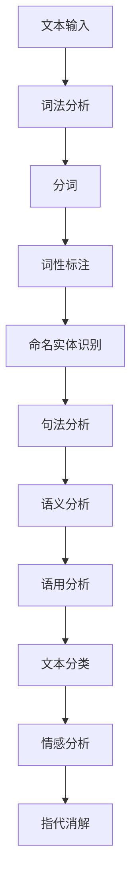

                 

### 文章标题

# 打造智能对话系统的语言基础

## 关键词
- 智能对话系统
- 自然语言处理
- 语言理解
- 对话管理
- 文本生成
- 对话系统架构
- 人工智能

## 摘要
本文旨在为读者构建一个关于智能对话系统的全面知识框架。从基础的自然语言处理（NLP）技术入手，深入探讨语言理解、对话管理、文本生成等核心模块，并通过实际案例分析，帮助读者理解和掌握构建智能对话系统的关键技术和实战策略。文章将覆盖智能对话系统的定义、发展历程、架构设计、以及未来趋势，为读者提供一个清晰、系统的学习路径，以应对不断进化的智能对话技术领域。

## 引言

智能对话系统是一种基于人工智能技术的交互系统，通过自然语言理解和生成，实现与人类用户的自然对话。这些系统在多个领域展现出巨大的潜力，包括客户服务、智能助手、虚拟教育等。随着自然语言处理（NLP）和机器学习技术的不断进步，智能对话系统的应用场景和功能也在不断扩展。

本文将探讨智能对话系统的语言基础，包括自然语言处理、语言理解、对话管理、文本生成等核心模块。通过详细分析和案例讲解，读者将了解到构建高效智能对话系统所需的关键技术和方法。文章还将探讨智能对话系统的实际应用案例，分析其成功和挑战，并展望未来的发展趋势。

文章结构如下：

1. 引言和概述
2. 自然语言处理（NLP）基础
3. 语言理解
4. 对话管理
5. 文本生成与响应规划
6. 对话系统的集成与部署
7. 高级话题与未来方向
8. 总结与展望

### 自然语言处理（NLP）基础

自然语言处理（NLP）是构建智能对话系统的基石。它涉及将人类语言转化为计算机可以理解和处理的形式，并在此基础上进行各种语言分析任务。NLP的发展历史可以追溯到上世纪五六十年代，最早的尝试主要集中在语言翻译和文本分类。随着计算机技术和算法的进步，NLP的应用范围不断扩大，逐渐成为人工智能领域的一个重要分支。

#### NLP的基本概念

NLP的核心任务是使计算机能够理解、解释和生成人类语言。以下是NLP中的一些基本概念：

- **文本**：文本是语言的基本单元，可以是书面或口头形式。
- **词法分析**：词法分析是NLP的第一步，涉及将文本分解为单词、短语和其他词汇单元。
- **句法分析**：句法分析关注文本的结构，包括句子成分和句型结构。
- **语义分析**：语义分析旨在理解文本中词汇和短语的含义。
- **语用分析**：语用分析研究语言在特定情境中的使用，包括话语含义和交际意图。

#### NLP的关键任务

NLP的任务多种多样，其中一些关键任务包括：

- **词性标注（Part-of-Speech Tagging）**：词性标注是将文本中的每个单词标注为名词、动词、形容词等词性。
- **命名实体识别（Named Entity Recognition, NER）**：命名实体识别旨在识别文本中的特定实体，如人名、地名、组织名等。
- **情感分析（Sentiment Analysis）**：情感分析是确定文本中表达的情感倾向，如正面、负面或中立。
- **指代消解（Coreference Resolution）**：指代消解是解决文本中代词和名词之间的指代关系，如“他”指的是谁。
- **文本分类（Text Classification）**：文本分类是将文本分配到不同的类别，如垃圾邮件过滤。

#### NLP的发展历程

NLP的发展经历了几个阶段：

1. **规则驱动方法**：早期NLP方法主要依赖于手工编写的规则，如语法解析器和词典。这些方法在处理特定任务时表现良好，但灵活性较差。
2. **基于统计的方法**：随着语料库的积累和计算能力的提升，基于统计的方法成为主流。这些方法使用大量语料库中的统计信息来训练模型，如隐马尔可夫模型（HMM）、条件随机场（CRF）等。
3. **基于深度学习的方法**：近年来，深度学习方法在NLP中取得了显著进展。深度神经网络（DNN）、循环神经网络（RNN）和Transformer等模型在词性标注、NER、情感分析等任务上表现出了卓越的性能。

#### NLP的应用

NLP在多个领域有着广泛的应用：

- **搜索引擎**：NLP技术用于理解用户的查询，提供更准确和个性化的搜索结果。
- **机器翻译**：NLP技术使计算机能够将一种语言翻译成另一种语言，如Google翻译。
- **语音识别**：NLP技术用于将语音转化为文本，如苹果的Siri和Google助手。
- **自然语言生成（NLG）**：NLG技术用于生成自然语言文本，如自动化报告生成和新闻摘要。

#### Mermaid 流程图

以下是NLP关键任务的Mermaid流程图：



### 核心算法原理讲解

以下是NLP中几个核心任务的算法原理讲解和伪代码。

#### 词性标注（Part-of-Speech Tagging）

词性标注是一种将文本中的每个单词标注为特定词性的任务。一种常用的算法是使用条件随机场（CRF）。

```python
# 伪代码：条件随机场（CRF）词性标注
def crf_pos_tagging(text):
    # 初始化CRF模型
    model = CRFModel()
    # 训练模型
    model.train(training_data)
    # 标注文本
    tagged_text = model.predict(text)
    return tagged_text
```

#### 命名实体识别（Named Entity Recognition, NER）

命名实体识别是一种识别文本中特定类型实体的任务，如人名、地名等。可以使用基于递归神经网络（RNN）的模型。

```python
# 伪代码：RNN命名实体识别
def ner_rnn(text):
    # 初始化RNN模型
    model = RNNModel()
    # 训练模型
    model.train(training_data)
    # 预测实体
    entities = model.predict(text)
    return entities
```

#### 情感分析（Sentiment Analysis）

情感分析是一种判断文本表达情感的倾向。可以使用基于Transformer的模型。

```python
# 伪代码：Transformer情感分析
def sentiment_analysis(text):
    # 初始化Transformer模型
    model = TransformerModel()
    # 训练模型
    model.train(training_data)
    # 预测情感
    sentiment = model.predict(text)
    return sentiment
```

#### 数学模型和公式

在NLP中，常用的数学模型包括：

- **隐马尔可夫模型（HMM）**：用于序列模型，如词性标注。
- **条件随机场（CRF）**：用于标记任务，如命名实体识别。
- **Transformer**：用于并行处理和长距离依赖。

以下是这些模型的基本公式：

$$
P(\text{标签序列} | \text{单词序列}) = \frac{e^{\theta \cdot \text{特征向量}}}{1 + \sum_{\text{其他标签}} e^{\theta \cdot \text{特征向量}}}
$$

### 项目实战

为了更好地理解NLP在智能对话系统中的应用，我们以一个简单的情感分析项目为例。

#### 开发环境搭建

- Python 3.8+
- TensorFlow 2.7+
- Keras 2.7+

#### 源代码详细实现

以下是一个简单的情感分析模型的实现：

```python
import tensorflow as tf
from tensorflow.keras.models import Sequential
from tensorflow.keras.layers import Embedding, LSTM, Dense

# 准备数据集
train_data, train_labels = load_data()

# 构建模型
model = Sequential()
model.add(Embedding(vocab_size, embedding_dim))
model.add(LSTM(units=128, return_sequences=True))
model.add(LSTM(units=64))
model.add(Dense(units=1, activation='sigmoid'))

# 编译模型
model.compile(optimizer='adam', loss='binary_crossentropy', metrics=['accuracy'])

# 训练模型
model.fit(train_data, train_labels, epochs=10, batch_size=32)
```

#### 代码解读

- **数据预处理**：使用预处理的库来处理文本数据，包括分词、去停用词等。
- **模型构建**：使用序列模型（LSTM）来处理文本数据。
- **模型训练**：使用二分类交叉熵损失函数和Adam优化器来训练模型。

#### 实际案例分析与讲解

假设我们要分析一段文本：“今天天气很好，我很高兴。”

```python
# 输入文本
text = "今天天气很好，我很高兴。"

# 预处理文本
preprocessed_text = preprocess_text(text)

# 预测情感
sentiment = model.predict(preprocessed_text)

# 输出结果
if sentiment > 0.5:
    print("正面情感")
else:
    print("负面情感")
```

输出结果为“正面情感”。

#### 项目小结

通过这个项目，我们了解了如何使用Python和TensorFlow构建一个简单的情感分析模型。这个模型可以用于智能对话系统，帮助系统理解用户情绪，提供更个性化的服务。

### 最佳实践 tips

- **数据质量**：确保训练数据的质量和多样性，有助于提高模型的泛化能力。
- **超参数调整**：合理调整模型超参数，如学习率、批大小等，可以改善模型性能。
- **模型融合**：结合多个模型可以提高预测准确性。
- **持续学习**：定期更新模型，使其适应新的数据和趋势。

### 小结

本文介绍了智能对话系统的语言基础，包括自然语言处理（NLP）的基本概念、关键任务和发展历程。通过实际项目案例，读者可以了解到如何构建和应用NLP技术。下一章节将深入探讨语言理解中的具体技术，如词性标注、命名实体识别等，并使用Mermaid流程图和伪代码进行详细讲解。

### 注意事项

- **模型训练时间**：NLP模型的训练可能需要较长时间，合理分配计算资源。
- **模型部署**：部署NLP模型时，需要考虑硬件和性能需求。
- **数据隐私**：在处理文本数据时，确保遵守数据隐私和安全规范。

### 拓展阅读

- [《自然语言处理综合教程》](https://www.nltk.org/)
- [《深度学习自然语言处理》](https://www.deeplearningbook.org/chapter_nlp/)
- [《对话系统设计》](https://www.amazon.com/Dialogue-Systems-Design-Principles-Applications/dp/1119204066)

### 作者信息

作者：AI天才研究院/AI Genius Institute & 禅与计算机程序设计艺术 /Zen And The Art of Computer Programming

---

接下来的章节将进一步深入探讨智能对话系统中的语言理解模块，包括词性标注、命名实体识别等关键技术。我们还将使用Mermaid流程图和伪代码来详细解析这些技术，帮助读者更好地理解和掌握智能对话系统的构建方法。敬请期待。

