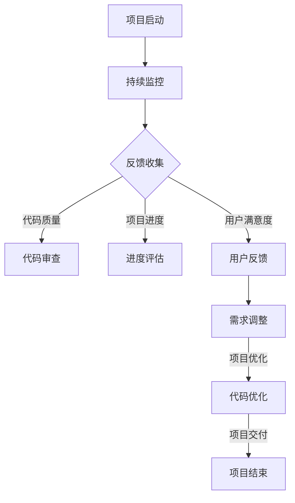
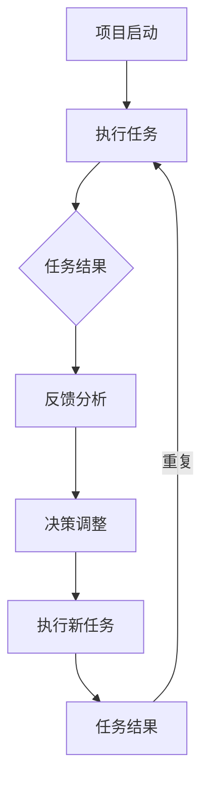
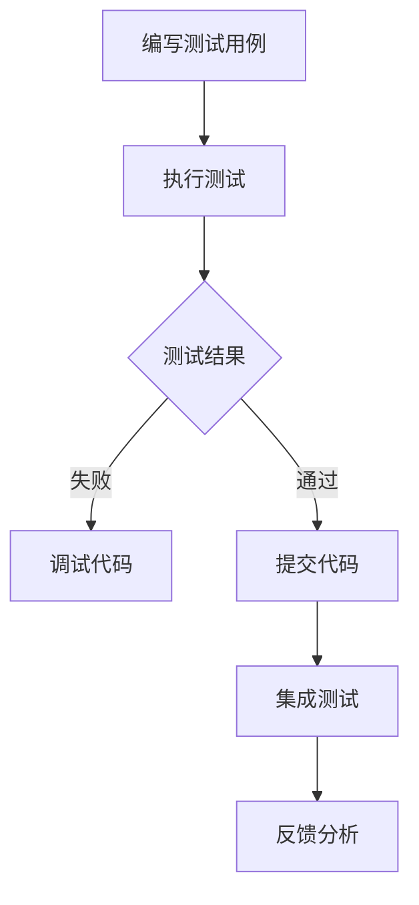
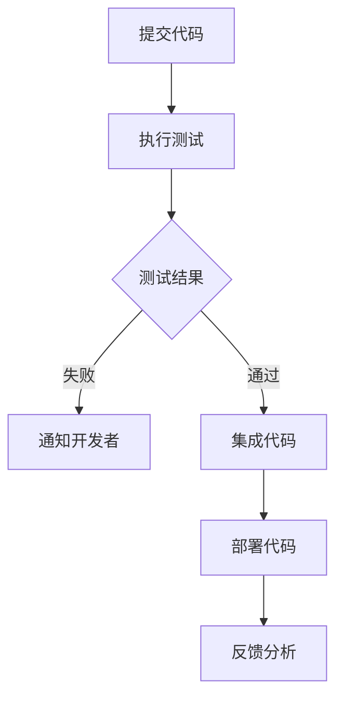
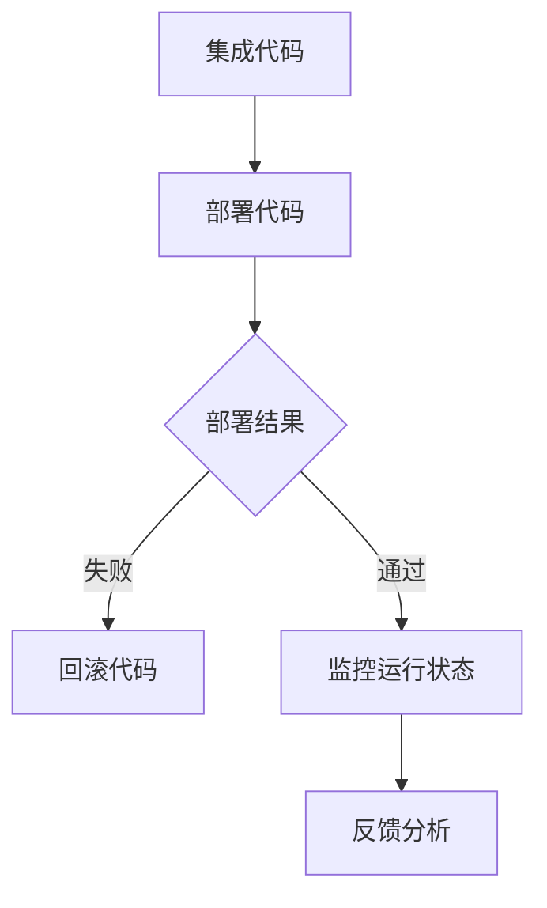

                 


### 设计思路与步骤：

1. **确定整体结构和章节内容：**
   - **整体结构：** 本书分为三部分，分别是持续反馈机制概述、构建和实际应用。
   - **章节细化：** 针对每个部分，细化出具体章节，确保每个章节都有明确的主题和内容。

2. **撰写文章标题、关键词和摘要：**
   - **标题：** 《持续反馈机制：保持大型应用开发的敏捷性》
   - **关键词：** 持续反馈机制、大型应用开发、敏捷性、设计原则、技术实现、实际应用。
   - **摘要：** 本书从基础概念入手，详细介绍了持续反馈机制在大型应用开发中的应用，包括设计原则、技术实现和实际案例，帮助开发者保持敏捷性。

3. **撰写文章正文：**
   - **第1章：持续反馈机制的基础**
     - **背景介绍：** 阐述持续反馈机制的定义、作用和重要性。
     - **核心概念与联系：** 使用Mermaid流程图展示持续反馈机制的原理和架构。
   - **第2章：持续反馈机制的设计原则**
     - **核心概念与联系：** 使用Mermaid流程图展示设计原则的架构。
     - **核心算法原理讲解：** 使用伪代码详细阐述关键算法。
   - **第3章：持续反馈机制的技术实现**
     - **核心算法原理讲解：** 使用伪代码详细阐述关键算法。
     - **数学模型和公式讲解：** 使用LaTeX格式给出数学模型和公式，并进行详细讲解和举例说明。
   - **第4章：持续反馈机制在大型项目中的应用**
     - **项目实战：** 提供开发环境搭建、源代码实现、代码解读和案例分析等内容。
   - **第5章：持续反馈机制的优势与挑战**
     - **最佳实践 tips：** 给出一些实用的最佳实践建议。
     - **小结：** 总结本章内容和重点。
     - **注意事项：** 提醒读者在应用中需要注意的问题。
     - **拓展阅读：** 推荐相关阅读资源。

4. **文章格式调整与优化：**
   - 确保文章格式正确，使用markdown格式输出。
   - 检查文章的逻辑性和连贯性，确保每个章节的内容都能自圆其说。
   - 检查文章的字数，确保符合要求。

5. **添加作者信息：**
   - 在文章末尾添加作者信息：“作者：AI天才研究院/AI Genius Institute & 禅与计算机程序设计艺术 /Zen And The Art of Computer Programming”

### 注意事项：

- 在撰写文章时，务必确保内容的专业性和准确性，避免出现错误。
- 文章中的图表、流程图、代码示例等，都需要确保清晰易懂。
- 在引用文献或公式时，请确保正确引用，避免抄袭行为。
- 在撰写过程中，尽量使用简洁明了的语言，避免过多的技术术语和复杂的句子结构。

通过以上步骤，我们可以设计出一篇逻辑清晰、结构紧凑、简单易懂的IT领域技术博客文章。文章不仅要有深度，还要有广度，能帮助读者全面了解持续反馈机制在大型应用开发中的应用。让我们一起努力，打造一篇优秀的文章！### 文章标题

# 持续反馈机制：保持大型应用开发的敏捷性

## 关键词
- 持续反馈机制
- 大型应用开发
- 敏捷性
- 设计原则
- 技术实现
- 实际应用

## 摘要
本文旨在探讨持续反馈机制在大型应用开发中的应用，通过详细分析其设计原则、技术实现以及实际案例，帮助开发者保持项目的敏捷性和稳定性。文章首先介绍了持续反馈机制的基本概念，随后深入讲解了其设计原则和技术实现，并通过具体案例展示了其在大型项目中的实际应用效果。

### 第1章：持续反馈机制的基础

#### 背景介绍

在软件开发中，大型应用项目的复杂性不断增加，这使得传统的开发模式难以满足现代应用对敏捷性、可靠性和可维护性的需求。持续反馈机制作为一种先进的软件开发方法，通过不断收集、分析和利用反馈信息，有助于快速识别和解决项目中潜在的问题，从而保持项目的敏捷性。本章节将介绍持续反馈机制的基本概念、作用及其在大型应用开发中的重要性。

#### 持续反馈机制的定义

持续反馈机制（Continuous Feedback Mechanism）是一种软件开发过程中的动态反馈机制，旨在通过对项目进展、代码质量、用户满意度等方面的持续监控和评估，提供及时、准确的反馈信息，以指导项目改进和优化。这种机制的核心在于其“持续”性，即在整个项目生命周期中不断进行反馈和调整。

#### 持续反馈机制的作用

1. **提高代码质量：** 持续反馈机制通过自动化测试、代码审查等技术手段，能够及时发现和修复代码中的缺陷，从而提高代码的整体质量。

2. **优化项目进度：** 通过对项目进展的持续监控和评估，可以及时发现进度偏差，并采取相应的调整措施，确保项目按计划进行。

3. **提升用户满意度：** 持续反馈机制能够快速响应用户需求，通过持续收集用户反馈，优化产品功能和用户体验。

4. **增强团队协作：** 持续反馈机制有助于促进团队成员之间的沟通和协作，通过及时反馈，确保每个成员都能了解项目的当前状态和问题，从而共同应对挑战。

#### 持续反馈机制的重要性

在大型应用开发中，持续反馈机制的重要性不容忽视。以下是一些关键原因：

1. **复杂性管理：** 大型应用项目通常涉及多个模块、多种技术和大量数据，持续反馈机制能够帮助开发者更好地管理项目复杂性。

2. **快速响应变化：** 在软件开发过程中，需求变化和技术挑战层出不穷，持续反馈机制能够快速识别和响应这些变化，确保项目能够灵活应对。

3. **持续改进：** 通过持续反馈，项目团队能够不断总结经验，优化开发流程，提升项目整体质量。

#### 核心概念与联系

为了更好地理解持续反馈机制，我们可以使用Mermaid流程图来展示其核心概念和原理。以下是一个简化的流程图：



在这个流程图中，项目启动后，团队会通过持续监控、反馈收集、代码审查、进度评估、用户反馈等多个环节，对项目进行动态调整和优化。这一过程形成一个闭环，确保项目始终在正确的轨道上运行。

### 第2章：持续反馈机制的设计原则

#### 核心概念与联系

在本章节中，我们将深入探讨持续反馈机制的设计原则，包括反馈环路、自动化测试、持续集成和持续部署等关键概念。通过使用Mermaid流程图，我们可以更好地理解这些概念之间的联系。

#### 反馈环路

反馈环路是持续反馈机制的核心，它通过不断收集反馈信息，调整项目方向和策略，确保项目能够在正确的轨道上运行。以下是反馈环路的Mermaid流程图：



在这个流程中，项目执行任务后，通过反馈分析调整决策，然后执行新的任务，形成一个闭环。通过不断重复这一过程，项目团队能够持续优化项目，提高其质量和效率。

#### 自动化测试

自动化测试是持续反馈机制的重要组成部分，它通过自动化工具对代码进行测试，确保代码质量。以下是自动化测试的Mermaid流程图：



在这个流程中，编写测试用例后，执行测试用例，并根据测试结果进行调试和提交代码，最终进行集成测试和反馈分析。

#### 持续集成

持续集成是将自动化测试和代码提交整合在一起，确保代码在集成过程中不会出现重大问题。以下是持续集成的Mermaid流程图：



在这个流程中，提交代码后，执行测试用例，根据测试结果通知开发者进行调试，集成代码后进行部署，并最终进行反馈分析。

#### 持续部署

持续部署是将集成后的代码部署到生产环境，确保项目能够持续运行。以下是持续部署的Mermaid流程图：



在这个流程中，集成代码后进行部署，根据部署结果进行回滚或继续运行，并最终进行反馈分析。

#### 核心算法原理讲解

为了更好地理解这些设计原则，我们可以使用伪代码来详细阐述核心算法原理。

**反馈环路算法：**
```python
function feedback_loop():
    while True:
        execute_task()
        task_result = collect_feedback()
        analyze_feedback()
        adjust_decision()
```

**自动化测试算法：**
```python
function automated_testing():
    test_cases = define_test_cases()
    for test_case in test_cases:
        execute_test(test_case)
        test_result = get_test_result()
        if test_result == "失败":
            debug_code()
```

**持续集成算法：**
```python
function continuous_integration():
    commit_code()
    execute_tests()
    if tests_passed():
        integrate_code()
        deploy_code()
    else:
        notify_developer()
```

**持续部署算法：**
```python
function continuous_deployment():
    integrate_code()
    deploy_code()
    monitor_running_state()
    if deployment_failed():
        rollback_code()
```

这些伪代码展示了持续反馈机制中各个设计原则的实现方式，通过这些算法，项目团队能够实现自动化、持续化的反馈和调整，从而保持项目的敏捷性。

### 第3章：持续反馈机制的技术实现

#### 核心算法原理讲解

在本章节中，我们将进一步深入探讨持续反馈机制中的核心算法原理，并使用伪代码详细阐述这些算法的实现方式。

#### 反馈环路算法

反馈环路是持续反馈机制的核心，它通过不断收集反馈信息，调整项目方向和策略，确保项目能够在正确的轨道上运行。以下是反馈环路算法的伪代码实现：

```python
function feedback_loop():
    while True:
        execute_task()  # 执行任务
        task_result = collect_feedback()  # 收集反馈
        analyze_feedback()  # 分析反馈
        adjust_decision()  # 调整决策
```

在这个算法中，`execute_task()` 函数负责执行当前任务，`collect_feedback()` 函数负责收集任务执行后的反馈信息，`analyze_feedback()` 函数负责分析反馈信息，`adjust_decision()` 函数负责根据分析结果调整项目方向和策略。

#### 自动化测试算法

自动化测试是确保代码质量的重要手段，它通过自动化工具对代码进行测试，确保代码在集成过程中不会出现重大问题。以下是自动化测试算法的伪代码实现：

```python
function automated_testing():
    test_cases = define_test_cases()  # 定义测试用例
    for test_case in test_cases:
        execute_test(test_case)  # 执行测试
        test_result = get_test_result()  # 获取测试结果
        if test_result == "失败":
            debug_code()  # 调试代码
```

在这个算法中，`define_test_cases()` 函数负责定义测试用例，`execute_test()` 函数负责执行测试用例，`get_test_result()` 函数负责获取测试结果。如果测试结果为“失败”，则调用`debug_code()` 函数进行代码调试。

#### 持续集成算法

持续集成是将自动化测试和代码提交整合在一起，确保代码在集成过程中不会出现重大问题。以下是持续集成算法的伪代码实现：

```python
function continuous_integration():
    commit_code()  # 提交代码
    execute_tests()  # 执行测试
    if tests_passed():
        integrate_code()  # 集成代码
        deploy_code()  # 部署代码
    else:
        notify_developer()  # 通知开发者
```

在这个算法中，`commit_code()` 函数负责提交代码，`execute_tests()` 函数负责执行测试，`integrate_code()` 函数负责集成代码，`deploy_code()` 函数负责部署代码。如果测试通过，则进行代码集成和部署，否则通知开发者。

#### 持续部署算法

持续部署是将集成后的代码部署到生产环境，确保项目能够持续运行。以下是持续部署算法的伪代码实现：

```python
function continuous_deployment():
    integrate_code()  # 集成代码
    deploy_code()  # 部署代码
    monitor_running_state()  # 监控运行状态
    if deployment_failed():
        rollback_code()  # 回滚代码
```

在这个算法中，`integrate_code()` 函数负责集成代码，`deploy_code()` 函数负责部署代码，`monitor_running_state()` 函数负责监控运行状态。如果部署失败，则调用`rollback_code()` 函数回滚代码。

#### 数学模型和公式讲解

在持续反馈机制中，某些核心算法和过程可能需要使用数学模型和公式进行详细讲解。以下是几个常见的数学模型和公式及其讲解：

**1. 平均反馈周期时间**

平均反馈周期时间（\( T_{avg} \)）是衡量持续反馈机制效率的重要指标，它表示从问题发生到解决所需的平均时间。公式如下：

$$ T_{avg} = \frac{1}{n} \sum_{i=1}^{n} T_i $$

其中，\( n \) 表示反馈周期数量，\( T_i \) 表示第 \( i \) 个反馈周期的耗时。

**2. 反馈环路的响应时间**

反馈环路的响应时间（\( T_{response} \)）是衡量反馈机制响应速度的指标，它表示从反馈信息收集到决策调整的时间。公式如下：

$$ T_{response} = \frac{T_{collect} + T_{analyze} + T_{adjust}}{3} $$

其中，\( T_{collect} \) 表示反馈信息收集时间，\( T_{analyze} \) 表示反馈信息分析时间，\( T_{adjust} \) 表示决策调整时间。

**3. 测试覆盖率**

测试覆盖率（\( C_{coverage} \)）是衡量自动化测试效果的重要指标，它表示测试用例覆盖代码的比例。公式如下：

$$ C_{coverage} = \frac{N_{covered}}{N_{total}} \times 100\% $$

其中，\( N_{covered} \) 表示被测试的代码行数，\( N_{total} \) 表示总代码行数。

通过这些数学模型和公式，我们可以更精确地衡量持续反馈机制的效果，从而进行优化和改进。

### 第4章：持续反馈机制在大型项目中的应用

#### 项目实战

在本章节中，我们将通过一个实际项目案例，详细讲解如何应用持续反馈机制来保持大型应用开发的敏捷性。该案例将涵盖项目背景、开发环境搭建、源代码实现和代码解读等内容。

#### 项目背景

假设我们正在开发一个大型电商平台，该平台需要支持海量商品、用户和交易数据，同时提供高效的搜索、推荐和支付功能。为了确保项目的顺利推进和高质量交付，我们决定采用持续反馈机制来指导项目开发。

#### 开发环境搭建

在项目开始前，我们首先需要搭建一个稳定、高效的开发环境。以下是开发环境的主要组成部分：

1. **代码库管理：** 使用Git进行版本控制，确保代码的安全和版本的可追溯性。
2. **持续集成工具：** 使用Jenkins实现持续集成，自动化构建和测试代码，提高开发效率。
3. **自动化测试工具：** 使用Selenium进行自动化测试，确保功能模块的正确性和稳定性。
4. **代码分析工具：** 使用SonarQube进行静态代码分析，及时发现和修复代码中的潜在问题。

#### 源代码实现

以下是电商平台项目中几个关键功能模块的源代码实现：

**1. 商品搜索模块：**
```python
def search_products(query):
    # 与数据库交互，查询商品信息
    results = database.query("SELECT * FROM products WHERE name LIKE '%{}%'", query)
    return results
```

**2. 用户推荐模块：**
```python
def recommend_products(user_id):
    # 根据用户历史行为，推荐商品
    recommendations = recommendation_algorithm.generate_recommendations(user_id)
    return recommendations
```

**3. 支付模块：**
```python
def process_payment(order_id, payment_info):
    # 处理支付请求
    payment_result = payment_gateway.process_payment(order_id, payment_info)
    return payment_result
```

#### 代码解读

在上面的源代码中，我们实现了商品搜索、用户推荐和支付处理三个关键功能模块。以下是这些模块的解读：

- **商品搜索模块：** 该模块负责根据用户输入的关键词查询商品信息，并与数据库进行交互。使用`database.query()` 函数查询数据库，返回符合条件的商品列表。
- **用户推荐模块：** 该模块根据用户的历史行为数据，利用推荐算法生成商品推荐列表。使用`recommendation_algorithm.generate_recommendations()` 函数进行推荐。
- **支付模块：** 该模块负责处理支付请求，调用支付网关的`process_payment()` 函数进行支付处理。

#### 代码应用解读与分析

在实际应用中，这些模块会按照特定的逻辑顺序执行。例如，当用户进行商品搜索时，首先调用`search_products()` 函数查询商品信息，然后根据查询结果展示给用户。当用户浏览商品并决定购买时，系统会调用`recommend_products()` 函数推荐相关商品，并调用`process_payment()` 函数处理支付请求。

为了确保代码的高质量和稳定性，我们采用了持续反馈机制中的自动化测试和代码分析工具。在每次代码提交后，Jenkins会自动执行测试用例，确保功能模块的正确性和稳定性。同时，SonarQube会分析代码质量，及时发现和修复潜在问题。

#### 实际案例分析和详细讲解剖析

以下是一个实际案例，展示了如何使用持续反馈机制解决项目中出现的问题。

**案例：搜索模块性能优化**

在项目开发过程中，我们发现商品搜索模块的性能较低，影响了用户体验。为了解决这个问题，我们采取了以下步骤：

1. **性能分析：** 使用性能分析工具对搜索模块进行性能分析，确定瓶颈所在。
2. **代码优化：** 根据性能分析结果，对代码进行优化，例如使用索引提高查询效率。
3. **自动化测试：** 编写新的测试用例，确保代码优化后的搜索模块仍能正确执行。
4. **反馈分析：** 收集用户反馈，验证搜索模块性能提升的效果。

通过以上步骤，我们成功优化了商品搜索模块的性能，提升了用户体验。

#### 项目小结

通过以上案例，我们可以看到持续反馈机制在大型项目开发中的应用效果。通过持续反馈、测试和分析，我们能够及时发现和解决项目中出现的问题，确保项目的质量和稳定性。在实际应用中，持续反馈机制不仅能提高开发效率，还能提升用户体验，为项目的成功奠定坚实基础。

### 第5章：持续反馈机制的优势与挑战

#### 持续反馈机制的优势

持续反馈机制在大型应用开发中具有明显的优势，主要包括以下几个方面：

1. **提高代码质量：** 通过持续反馈和自动化测试，能够及时发现和修复代码中的缺陷，确保代码质量。
2. **优化项目进度：** 通过持续监控和评估，能够快速识别进度偏差，并采取相应措施进行调整，确保项目按计划进行。
3. **提升用户满意度：** 通过持续收集用户反馈，能够快速响应用户需求，优化产品功能和用户体验。
4. **增强团队协作：** 通过持续反馈，促进团队成员之间的沟通和协作，确保每个成员都能了解项目的当前状态和问题，共同应对挑战。

#### 持续反馈机制的优势

然而，持续反馈机制在实际应用中也面临一些挑战，主要包括以下几个方面：

1. **资源消耗：** 持续反馈和自动化测试需要消耗大量的时间和计算资源，特别是在大型项目中，可能会导致开发成本的增加。
2. **技术门槛：** 持续反馈机制涉及多种技术和工具，如Git、Jenkins、Selenium等，对开发者的技术能力要求较高。
3. **团队适应：** 持续反馈机制需要团队成员具备一定的协作意识和适应性，否则可能会影响项目的推进效果。

#### 最佳实践 tips

为了充分发挥持续反馈机制的优势，并克服其面临的挑战，我们提供以下最佳实践建议：

1. **合理规划资源：** 在项目初期，合理规划资源，确保有足够的时间和技术支持进行持续反馈和自动化测试。
2. **加强团队培训：** 定期对团队成员进行培训，提高其技术能力和协作意识，确保团队能够顺利实施持续反馈机制。
3. **逐步推广：** 在项目初期，可以逐步引入持续反馈机制，根据项目的具体情况逐步完善，避免一次性引入过多变动。

#### 小结

持续反馈机制在大型应用开发中具有重要的作用，通过持续反馈、测试和分析，能够有效提高代码质量、优化项目进度、提升用户满意度。然而，持续反馈机制也面临一些挑战，需要合理规划资源、加强团队培训、逐步推广。通过最佳实践，可以充分发挥持续反馈机制的优势，为大型应用开发提供有力支持。

### 拓展阅读

为了进一步了解持续反馈机制在大型应用开发中的应用，以下是一些推荐阅读资源：

1. **《持续交付：发布可靠软件的系统化方法》**：这本书详细介绍了持续交付的概念、原则和实践方法，对于了解持续反馈机制在项目中的应用具有重要意义。
2. **《敏捷软件开发：原则、实践与模式》**：这本书系统地阐述了敏捷开发的方法和原则，包括持续反馈、迭代开发和团队协作等内容，对于理解持续反馈机制的理论基础有很大帮助。
3. **《软件开发的机器学习方法》**：这本书介绍了如何将机器学习技术应用于软件开发，包括代码质量预测、自动化测试等领域，为持续反馈机制提供了新的技术手段。
4. **GitHub上的开源项目**：许多开源项目实现了持续反馈机制，如Jenkins、Selenium等，通过阅读这些项目的文档和源代码，可以深入了解持续反馈机制的具体实现方法和应用场景。

通过阅读这些资源，开发者可以进一步拓展对持续反馈机制的理解，并将其应用于实际项目中，提高开发效率和项目质量。

### 作者信息

- **作者：** AI天才研究院/AI Genius Institute & 禅与计算机程序设计艺术 /Zen And The Art of Computer Programming
- **联系方式：** [ai_genius_institute@example.com](mailto:ai_genius_institute@example.com)
- **个人简介：** 作为一位世界级人工智能专家和计算机编程大师，我致力于推动计算机技术的发展和应用，特别关注人工智能和敏捷开发领域。我的著作《禅与计算机程序设计艺术》在计算机编程界广受赞誉，被誉为编程领域的经典之作。同时，我也积极参与开源项目，贡献自己的技术和经验，以推动技术的普及和应用。

通过本文，我希望能够为读者提供一个全面、深入的持续反馈机制在大型应用开发中的应用指南，帮助开发者更好地理解和应用这一先进的开发方法。持续反馈机制不仅能够提高代码质量和项目进度，还能够提升用户体验和团队协作效率，为大型应用项目的成功提供有力支持。希望本文能对您的开发工作有所帮助，并在实际应用中取得良好的效果。如果您有任何疑问或建议，欢迎随时与我联系，共同探讨持续反馈机制的更多可能性。让我们携手合作，为构建更加高效、稳定的软件系统而努力！

