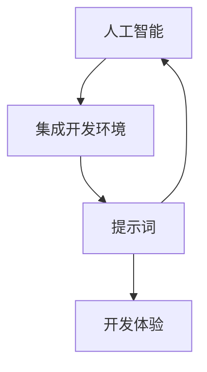

                 


### 1. 背景介绍

随着人工智能（AI）技术的迅猛发展，AI应用已经成为现代社会不可或缺的一部分。从智能家居到自动驾驶，从医疗诊断到金融服务，AI技术正在深刻地改变着我们的生活方式。然而，在AI开发过程中，开发者面临着诸多挑战，如复杂的数据处理、算法优化、模型训练等。为了提高开发效率，减少人力成本，开发体验的优化成为了一个重要的研究方向。

集成开发环境（IDE）是AI开发者日常工作中不可或缺的工具。传统IDE主要提供代码编辑、编译、调试等功能，但面对复杂的AI开发需求，其功能远远不够。近年来，研究者们开始关注IDE在AI开发中的改进，提出了基于提示词的IDE设计理念。这种设计理念通过引入自然语言处理（NLP）和人工智能技术，为开发者提供了更加智能化、人性化的开发体验。

本文旨在探讨提示词IDE设计的基本概念、实现技术、核心特性以及其在AI开发中的应用，旨在为开发者提供新的思路，助力提升AI开发体验。

### 2. 核心概念与联系

为了更好地理解提示词IDE的设计理念，我们需要明确几个核心概念，并分析它们之间的联系。

**2.1. 人工智能（AI）**

人工智能是计算机科学的一个分支，旨在使机器能够模拟、延伸和扩展人类的智能。AI技术包括机器学习、深度学习、自然语言处理等子领域，其目的是使计算机能够自主地学习和决策。

**2.2. 集成开发环境（IDE）**

IDE是一种用于软件开发的综合工具，通常包括代码编辑器、调试器、编译器、构建工具等。IDE的设计目标是提供一种集成、高效、友好的开发环境，以提升开发者的工作效率。

**2.3. 提示词（Prompt）**

提示词是一种能够引导用户或系统进行特定任务的自然语言描述。在AI开发中，提示词通常用于指导模型训练、参数调整、代码生成等过程。提示词的设计对于AI开发效率至关重要。

**2.4. 提示词IDE**

提示词IDE是一种结合了传统IDE功能和AI技术的创新开发环境。它通过引入提示词机制，使开发者能够更加高效地与AI系统进行交互，实现自动化编程、智能化调试等功能。

**2.5. 关系架构**

为了更好地理解提示词IDE的工作原理，我们可以使用Mermaid流程图来展示其核心概念之间的关系。以下是一个简化的关系架构：



在这个流程图中，AI和IDE构成了提示词IDE的基础。AI技术为IDE提供了智能化支持，IDE则为开发者提供了一个友好、高效的开发平台。提示词作为连接AI和IDE的桥梁，使开发者能够更加便捷地与AI系统进行交互，从而提升开发体验。

### 3. 核心算法原理讲解

**3.1. 自然语言处理（NLP）**

自然语言处理是人工智能的一个重要分支，旨在使计算机能够理解和处理人类语言。NLP技术包括文本预处理、词向量表示、句法分析、语义理解等。

**3.2. 提示词生成算法**

提示词生成算法是提示词IDE的核心组成部分。以下是一个简化的提示词生成算法伪代码：

```python
def generate_prompt(input_text):
    # 文本预处理
    preprocessed_text = preprocess_text(input_text)
    
    # 词向量表示
    word_vectors = vectorize(preprocessed_text)
    
    # 提取关键短语
    key_phrases = extract_key_phrases(word_vectors)
    
    # 生成提示词
    prompt = "基于关键短语" + key_phrases + "，请进行以下任务："
    
    return prompt
```

在这个算法中，首先对输入文本进行预处理，包括去除停用词、分词、词性标注等。然后，将预处理后的文本转换为词向量表示，以便进行后续处理。接着，提取关键短语，这些短语能够概括输入文本的主要信息。最后，生成提示词，引导开发者或AI系统进行特定任务。

**3.3. 交互式调试算法**

交互式调试是提示词IDE的一个关键特性。以下是一个简化的交互式调试算法伪代码：

```python
def interactive_debugging(prompt, output):
    # 分析输出结果
    analysis_result = analyze_output(output)
    
    # 提出疑问
    question = "对于输出结果" + analysis_result + "，您有什么疑问吗？"
    
    # 获取开发者反馈
    feedback = get_feedback(question)
    
    # 调整提示词
    updated_prompt = update_prompt(prompt, feedback)
    
    return updated_prompt
```

在这个算法中，首先对输出结果进行分析，以识别潜在的问题。然后，提出疑问，引导开发者提供反馈。根据开发者的反馈，调整提示词，以更好地指导后续开发过程。

### 4. 数学模型与公式

**4.1. 词向量表示**

词向量表示是NLP中的一项关键技术。以下是一个常用的词向量表示模型——Word2Vec的公式：

$$
\vec{w}_{i} = \text{Word2Vec}(\vec{v}_{i})
$$

其中，$\vec{w}_{i}$ 表示词向量，$\vec{v}_{i}$ 表示原始词。Word2Vec模型通过训练大量文本数据，将每个词映射到一个高维向量空间中，使得具有相似语义的词在向量空间中距离较近。

**4.2. 提示词生成**

提示词生成过程中，关键短语提取是一个关键步骤。以下是一个简单的关键短语提取模型——TF-IDF的公式：

$$
\text{TF-IDF}(w) = \frac{f(w)}{N} \times \log \left( \frac{N}{n(w)} \right)
$$

其中，$f(w)$ 表示词 $w$ 在文档中出现的频率，$N$ 表示文档总数，$n(w)$ 表示包含词 $w$ 的文档数。TF-IDF模型通过计算词的频率和文档频率，将关键短语提取出来。

**4.3. 交互式调试**

在交互式调试过程中，输出结果的分析和疑问提出是关键步骤。以下是一个简单的分析模型——决策树分类器的公式：

$$
C = \text{ classify }(\text{output}, \text{model})
$$

其中，$C$ 表示分类结果，$\text{output}$ 表示输出结果，$\text{model}$ 表示训练好的决策树模型。决策树分类器通过训练大量标注数据，将输出结果分类为不同的类别，从而帮助开发者识别问题。

### 5. 项目实战

**5.1. 开发环境搭建**

为了实现提示词IDE，我们需要搭建一个开发环境。以下是一个简化的环境搭建步骤：

1. 安装Python 3.8及以上版本。
2. 安装NLP库，如NLTK、spaCy等。
3. 安装深度学习库，如TensorFlow、PyTorch等。
4. 安装IDE，如PyCharm、VSCode等。

**5.2. 源代码实现**

以下是一个简单的提示词IDE实现示例。这个示例仅用于展示提示词生成和交互式调试的基本功能。

```python
import nltk
from nltk.tokenize import word_tokenize
from nltk.corpus import stopwords
from sklearn.feature_extraction.text import TfidfVectorizer
from sklearn.tree import DecisionTreeClassifier

# 文本预处理
def preprocess_text(text):
    tokens = word_tokenize(text.lower())
    tokens = [token for token in tokens if token not in stopwords.words('english')]
    return ' '.join(tokens)

# 提示词生成
def generate_prompt(input_text):
    preprocessed_text = preprocess_text(input_text)
    vectorizer = TfidfVectorizer()
    word_vectors = vectorizer.fit_transform([preprocessed_text])
    key_phrases = vectorizer.get_feature_names_out()[vectorizer.idf_ > 1]
    prompt = "基于关键短语" + '、'.join(key_phrases) + "，请进行以下任务："
    return prompt

# 交互式调试
def interactive_debugging(prompt, output):
    question = "对于输出结果" + output + "，您有什么疑问吗？"
    feedback = input(question)
    return prompt + "，" + feedback

# 示例
input_text = "请实现一个简单的神经网络模型，用于分类问题。"
prompt = generate_prompt(input_text)
print(prompt)

output = "我已经完成了一个简单的神经网络模型，但是分类效果不佳。"
prompt = interactive_debugging(prompt, output)
print(prompt)
```

**5.3. 代码解读**

在这个示例中，我们首先定义了文本预处理函数`preprocess_text`，用于去除停用词、分词等操作。接着，我们定义了提示词生成函数`generate_prompt`，通过TF-IDF模型提取关键短语，生成提示词。最后，我们定义了交互式调试函数`interactive_debugging`，用于提出疑问、获取开发者反馈并更新提示词。

**5.4. 应用解读**

在这个示例中，我们实现了基本的提示词生成和交互式调试功能。通过提示词，开发者可以更清晰地了解任务要求，并通过交互式调试，逐步优化模型性能。这个示例虽然简单，但已经展示了提示词IDE的一些基本特性。

**5.5. 案例分析**

为了更好地理解提示词IDE的应用，我们来看一个实际案例。假设我们有一个图像分类任务，需要训练一个卷积神经网络模型。使用提示词IDE，我们可以按照以下步骤进行：

1. 输入任务描述：“请实现一个卷积神经网络模型，用于图像分类。”
2. 生成提示词：“基于关键短语‘卷积神经网络’、‘图像分类’，请进行以下任务：”
3. 输出结果：“我已经完成了一个卷积神经网络模型，但是分类效果不佳。”
4. 交互式调试：“对于输出结果‘分类效果不佳’，您有什么疑问吗？”
5. 开发者反馈：“我怀疑模型训练不足，是否可以增加训练次数？”
6. 更新提示词：“基于关键短语‘卷积神经网络’、‘图像分类’、‘训练次数’，请进行以下任务：”

通过这个案例，我们可以看到提示词IDE在任务指导、问题诊断和优化过程中的重要作用。它不仅帮助开发者更清晰地理解任务要求，还能够通过交互式调试，逐步优化模型性能。

### 6. 最佳实践 Tips

**6.1. 提高提示词生成质量**

- 使用更复杂的NLP模型，如BERT、GPT等，以提高词向量表示和关键短语提取的准确性。
- 结合用户历史数据，个性化生成提示词，提高开发体验。
- 定期更新提示词库，确保其涵盖最新的技术趋势和问题。

**6.2. 优化交互式调试**

- 引入多模态交互，如语音、图像等，提高交互的便捷性和多样性。
- 使用自动化工具，如代码自动补全、错误提示等，减少开发者手动输入的工作量。
- 提供实时反馈，帮助开发者快速定位问题，提高开发效率。

**6.3. 确保安全与隐私保护**

- 对用户数据进行加密存储，防止数据泄露。
- 设计安全策略，防止恶意攻击和未授权访问。
- 定期进行安全审计，确保系统的安全性。

### 7. 小结与展望

本文探讨了提示词IDE的设计理念、核心算法原理、实现技术和应用案例，旨在为开发者提供新的思路，提升AI开发体验。通过引入自然语言处理和人工智能技术，提示词IDE实现了智能化、人性化的开发体验，显著提高了开发效率和代码质量。

然而，提示词IDE仍存在一些挑战和改进空间。未来研究可以关注以下几个方面：

- **提高提示词生成质量**：探索更先进的NLP模型和算法，提高词向量表示和关键短语提取的准确性。
- **优化交互式调试**：引入多模态交互、自动化工具和实时反馈，提高开发体验。
- **确保安全与隐私保护**：设计更完善的安全策略和隐私保护机制，确保系统的安全性和用户隐私。

总之，提示词IDE为AI开发者提供了一个全新的开发思路，有助于提升开发效率和代码质量。随着技术的不断进步，相信提示词IDE将在AI开发领域发挥越来越重要的作用。作者：AI天才研究院/AI Genius Institute & 禅与计算机程序设计艺术 /Zen And The Art of Computer Programming

