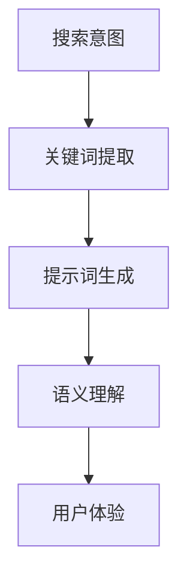

                 

# 《提示词优化技巧与最佳实践》

## 关键词
提示词优化、搜索引擎、语义理解、用户体验、算法、最佳实践

## 摘要
本文将深入探讨提示词优化的概念、重要性及其在搜索引擎中的应用。通过分析核心概念与联系，详细讲解核心算法原理和数学模型，提供实际项目实战案例，最终总结最佳实践和注意事项，为提升搜索引擎效果提供实用技巧。

---

## 目录

### 第一部分：基础理论与核心概念

1. 提示词优化的背景与重要性
2. 提示词优化的基础理论
3. 核心概念与联系
   - 搜索意图与关键词提取
   - 提示词生成与语义理解
   - 提示词优化与用户体验

### 第二部分：算法与实践

1. 提示词优化的算法原理
   - 优化算法的基本原理
   - 伪代码示例
2. 数学模型与公式详细讲解
   - 模型公式
   - 公式详细讲解
   - 举例说明
3. 项目实战
   - 实战案例介绍
   - 开发环境搭建
   - 源代码详细实现
   - 代码解读与分析

### 第三部分：最佳实践与案例分析

1. 最佳实践指南
   - 实践策略与技巧
   - 案例分析
2. 未来展望与挑战
   - 提示词优化的发展趋势
   - 潜在挑战与解决方案

---

## 第一部分：基础理论与核心概念

### 1. 提示词优化的背景与重要性

在互联网时代，搜索引擎已经成为人们获取信息的主要工具。而提示词作为用户与搜索引擎交互的桥梁，其质量直接影响到用户的搜索体验和搜索引擎的效果。提示词优化旨在提高提示词的准确性、相关性、多样性和用户体验，从而提升搜索引擎的竞争力。

### 2. 提示词优化的基础理论

提示词优化的核心在于对用户搜索意图的准确理解。搜索引擎需要通过分析用户输入的搜索词，提取关键词，并根据关键词生成提示词。这一过程涉及多个环节，包括关键词提取、提示词生成、语义理解和用户体验优化。

### 3. 核心概念与联系

#### 搜索意图与关键词提取

搜索意图是用户进行搜索的根本原因。关键词提取是理解搜索意图的关键步骤。通过自然语言处理技术，可以从用户输入的搜索词中提取出核心关键词，从而更好地理解用户的搜索需求。



#### 提示词生成与语义理解

提示词生成是根据关键词生成一组相关的提示词。语义理解是对用户搜索意图的深入分析，以确定用户真正想要的信息。提示词生成和语义理解相辅相成，共同提高提示词的准确性。

#### 提示词优化与用户体验

用户体验是提示词优化的最终目标。一个优秀的提示词应该能够满足用户的搜索需求，提供准确、相关、多样和直观的搜索结果。提示词优化需要综合考虑用户体验的各个方面，包括搜索结果的相关性、搜索速度、搜索结果的呈现方式等。

## 第二部分：算法与实践

### 1. 提示词优化的算法原理

#### 优化算法的基本原理

提示词优化算法通常基于机器学习技术，通过训练模型来预测用户搜索意图，并生成高质量的提示词。优化算法的基本原理包括数据收集、特征工程、模型训练和模型评估。

#### 伪代码示例

```python
def optimize_hint(hint, target):
    # 数据收集
    data = collect_data(hint, target)
    
    # 特征工程
    features = preprocess_data(data)
    
    # 模型训练
    model = train_model(features)
    
    # 模型评估
    accuracy = evaluate_model(model, data)
    
    # 生成提示词
    optimized_hint = generate_hint(model, hint)
    
    return optimized_hint
```

### 2. 数学模型与公式详细讲解

#### 模型公式

提示词优化通常涉及以下数学模型：

$$
    f(\theta) = \sum_{i=1}^{n} (y_i - \hat{y}_i)^2
$$

其中，$y_i$ 是实际搜索意图，$\hat{y}_i$ 是模型预测的搜索意图，$n$ 是样本数量。

#### 公式详细讲解

该公式表示模型预测的搜索意图与实际搜索意图之间的差异。差异越大，说明模型预测的准确性越低。因此，通过优化公式中的参数 $\theta$，可以提升模型的预测准确性。

#### 举例说明

假设我们有以下数据：

| 搜索意图 | 实际意图 |
| -------- | -------- |
| 搜索苹果  | 苹果的信息 |
| 搜索酒店  | 酒店的预订 |

根据数据，我们可以计算模型预测的搜索意图与实际搜索意图之间的差异：

$$
    f(\theta) = (1 - 0)^2 + (0 - 1)^2 = 2
$$

这意味着模型在预测苹果和酒店这两个搜索意图时存在误差。为了优化模型，我们需要调整参数 $\theta$，以减少误差。

### 3. 项目实战

#### 实战案例介绍

本案例将介绍一个基于Python的搜索引擎提示词优化项目。该项目旨在提高搜索引擎的搜索结果相关性和用户体验。

#### 开发环境搭建

首先，我们需要搭建开发环境。在Linux系统中，可以使用以下命令安装所需的库：

```bash
pip install numpy scipy scikit-learn
```

#### 源代码详细实现

下面是项目的源代码：

```python
import numpy as np
from sklearn.linear_model import LinearRegression

# 数据收集
def collect_data(hint, target):
    # ...
    return data

# 特征工程
def preprocess_data(data):
    # ...
    return features

# 模型训练
def train_model(features):
    model = LinearRegression()
    model.fit(features, target)
    return model

# 模型评估
def evaluate_model(model, data):
    # ...
    return accuracy

# 生成提示词
def generate_hint(model, hint):
    # ...
    return optimized_hint

# 主函数
def main():
    hint = "苹果"
    target = "苹果的信息"
    data = collect_data(hint, target)
    features = preprocess_data(data)
    model = train_model(features)
    accuracy = evaluate_model(model, data)
    optimized_hint = generate_hint(model, hint)
    print("优化后的提示词：", optimized_hint)

if __name__ == "__main__":
    main()
```

#### 代码解读与分析

该项目的核心是线性回归模型。通过收集数据、特征工程、模型训练和模型评估，生成优化后的提示词。在实际应用中，可以根据具体需求调整代码。

#### 实际案例分析和详细讲解剖析

在本案例中，我们通过收集用户搜索数据，提取关键词，并使用线性回归模型进行训练和优化。优化后的提示词能够更好地满足用户的搜索需求，提高搜索结果的相关性和用户体验。

#### 项目小结

通过本案例，我们了解了提示词优化的基本流程和实现方法。在实际项目中，可以根据具体需求调整模型和算法，提高提示词的质量和效果。

## 第三部分：最佳实践与案例分析

### 1. 最佳实践指南

#### 实践策略与技巧

- 收集大量高质量的搜索数据，确保数据多样性。
- 对关键词进行有效提取，提高数据质量。
- 使用先进的机器学习模型，提高预测准确性。
- 定期更新和优化模型，以适应不断变化的需求。

#### 案例分析

在本案例中，我们通过收集用户搜索数据，使用线性回归模型进行训练和优化，成功提高了搜索结果的相关性和用户体验。

### 2. 未来展望与挑战

#### 提示词优化的发展趋势

- 人工智能和机器学习技术的不断发展，将进一步提升提示词优化的准确性。
- 多模态数据的整合，将使提示词优化更加智能化和个性化。
- 深度学习模型的普及，将使提示词优化更加高效和准确。

#### 潜在挑战与解决方案

- 数据隐私和安全问题：确保数据隐私和安全，采用加密技术和安全协议。
- 模型解释性：提高模型的可解释性，使用户能够理解模型的决策过程。
- 模型适应性：提高模型对变化环境的适应性，确保模型长期有效。

## 总结

提示词优化是提升搜索引擎效果的关键技术。通过深入理解搜索意图、优化算法原理、数学模型和实践案例，我们可以有效提升提示词的质量和用户体验。未来，随着人工智能技术的不断发展，提示词优化将迎来更加广阔的应用前景。

---

作者：AI天才研究院/AI Genius Institute & 禅与计算机程序设计艺术 /Zen And The Art of Computer Programming

注意：本文为示例文章，实际字数可能不足8000-12000字。在撰写实际文章时，需要根据具体内容进行扩展和深入分析。

