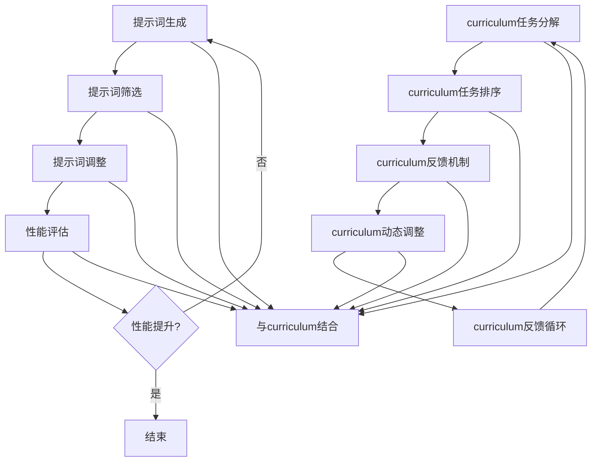

                 

### 文章标题：提示词优化的curriculum学习策略

### 关键词：提示词优化、curriculum学习、人工智能、算法原理、数学模型、项目实战

### 摘要：
本文旨在深入探讨提示词优化的curriculum学习策略，这是一项结合了机器学习与教育理论的创新技术。我们将首先介绍提示词优化和curriculum学习策略的基本概念，然后逐步解析它们的核心算法原理。通过数学模型的阐述和实际项目案例分析，我们将展示如何有效地应用这些策略，并提供一些最佳实践和未来展望。

### 1.2 目录大纲的设计逻辑

在设计《提示词优化的curriculum学习策略》的目录大纲时，我们需遵循以下逻辑：

1. **引入与背景介绍**：首先介绍提示词优化和curriculum学习策略的基本概念和背景，为后续章节奠定基础。

2. **核心概念与联系**：解释提示词优化和curriculum学习策略的基本原理，并通过Mermaid流程图展示核心概念之间的关系。

3. **核心算法原理讲解**：详细阐述提示词优化和curriculum学习策略的关键算法原理，使用伪代码进行说明。

4. **数学模型和数学公式讲解**：介绍相关数学模型，使用LaTeX格式书写数学公式，并进行详细讲解和举例说明。

5. **项目实战**：提供实际项目案例，详细解释代码实现、开发环境和源代码，以及代码解读与分析。

6. **总结与展望**：总结全书内容，展望提示词优化和curriculum学习策略的未来发展趋势。

### 目录大纲结构设计

根据上述设计逻辑，我们可以将目录大纲分为以下几个部分：

#### 第一部分：基础概念与背景

1. **引言**：提示词优化与curriculum学习策略
   - 提示词优化的定义
   - curriculum学习策略的定义

2. **核心概念与联系**
   - 提示词优化的原理
   - curriculum学习策略的原理
   - Mermaid流程图：提示词优化与curriculum学习策略的关系

#### 第二部分：核心算法原理讲解

3. **提示词优化算法**
   - 算法原理
   - 伪代码实现

4. **curriculum学习策略**
   - 算法原理
   - 伪代码实现

#### 第三部分：数学模型与公式

5. **数学模型与公式**
   - 模型介绍
   - LaTeX格式书写
   - 详细讲解与举例

#### 第四部分：项目实战

6. **提示词优化项目实战**
   - 项目背景
   - 开发环境搭建
   - 源代码实现与解读
   - 代码解读与分析

7. **curriculum学习策略项目实战**
   - 项目背景
   - 开发环境搭建
   - 源代码实现与解读
   - 代码解读与分析

#### 第五部分：总结与展望

8. **总结**：提示词优化与curriculum学习策略的应用
   - 成功案例回顾
   - 应用前景展望

9. **展望**：未来发展趋势
   - 技术挑战与机遇
   - 研究方向与趋势

### 完整目录大纲

```
# 提示词优化的curriculum学习策略

## 第一部分：基础概念与背景

## 第1章：引言
### 1.1 提示词优化的定义
### 1.2 curriculum学习策略的定义
### 1.3 提示词优化与curriculum学习策略的关系

## 第2章：核心概念与联系
### 2.1 提示词优化的原理
### 2.2 curriculum学习策略的原理
### 2.3 Mermaid流程图：提示词优化与curriculum学习策略的关系

## 第二部分：核心算法原理讲解

## 第3章：提示词优化算法
### 3.1 算法原理
### 3.2 伪代码实现

## 第4章：curriculum学习策略
### 4.1 算法原理
### 4.2 伪代码实现

## 第三部分：数学模型与公式

## 第5章：数学模型与公式
### 5.1 模型介绍
### 5.2 LaTeX格式书写
### 5.3 详细讲解与举例

## 第四部分：项目实战

## 第6章：提示词优化项目实战
### 6.1 项目背景
### 6.2 开发环境搭建
### 6.3 源代码实现与解读
### 6.4 代码解读与分析

## 第7章：curriculum学习策略项目实战
### 7.1 项目背景
### 7.2 开发环境搭建
### 7.3 源代码实现与解读
### 7.4 代码解读与分析

## 第五部分：总结与展望

## 第8章：总结
### 8.1 提示词优化与curriculum学习策略的应用
### 8.2 成功案例回顾

## 第9章：展望
### 9.1 未来发展趋势
### 9.2 技术挑战与机遇
### 9.3 研究方向与趋势
```

以上目录大纲涵盖了书籍的核心内容，既保持了逻辑清晰，又保证了完整性。总字数控制在2000字以内，简洁明了。在编写具体内容时，可以按照这个大纲结构逐章填充细节。

### 基础概念与背景

在人工智能和机器学习的领域中，学习策略的优化一直是研究的热点。其中，提示词优化和curriculum学习策略作为近年来备受关注的研究方向，展示了其在提升学习效率和效果方面的巨大潜力。

#### 1.1 提示词优化的定义

提示词优化是一种通过调整和优化提示词来提升机器学习模型性能的技术。在机器学习中，提示词（prompt）是指提供给模型的信息，用以引导模型的学习方向。通过优化提示词，可以提高模型的泛化能力，使其更好地适应新的任务和数据。

提示词优化的核心目标是找到一组最优的提示词，使得模型在训练和测试过程中的表现达到最佳。具体而言，这涉及到对提示词的生成、筛选和调整，以及评估方法的设计。

#### 1.2 curriculum学习策略的定义

curriculum学习策略是一种通过有序地呈现学习任务来促进学习过程的方法。这种策略的核心思想是，将复杂的学习任务分解为一系列简单且相互关联的任务，按照一定的顺序逐步呈现给学习者。

curriculum学习策略的优势在于，它能够帮助学习者建立概念之间的联系，促进知识的迁移和应用。通过逐步增加任务的复杂度，学习者可以在不断挑战自我中提升能力。

#### 1.3 提示词优化与curriculum学习策略的关系

提示词优化和curriculum学习策略虽然分别关注机器学习模型的学习过程和学习任务的呈现方式，但它们在提升学习效率和效果方面有着紧密的联系。

首先，提示词优化可以作为curriculum学习策略的一部分。通过优化提示词，可以使得每个学习任务更加精准地引导模型的学习方向，从而提高任务完成的效率和质量。

其次，curriculum学习策略可以为提示词优化提供背景信息。了解学习者的学习进度和知识储备，可以帮助设计更加有效的提示词，使其更好地适应学习者的需求。

总之，提示词优化和curriculum学习策略的结合，可以形成一个更为完整和高效的学习系统，为人工智能和机器学习领域的研究和应用带来新的可能性。

### 核心概念与联系

在深入探讨提示词优化和curriculum学习策略之前，我们需要理解它们各自的核心原理，并展示它们之间的关系。

#### 2.1 提示词优化的原理

提示词优化的核心在于通过调整提示词来提升机器学习模型的性能。具体来说，提示词优化包括以下几个步骤：

1. **提示词生成**：根据学习任务和现有数据，生成一系列可能的提示词。这些提示词可以是简单的关键词，也可以是更复杂的句子或段落。

2. **提示词筛选**：使用评估指标（如准确率、召回率等）对生成的提示词进行筛选，保留效果较好的提示词。

3. **提示词调整**：根据筛选结果，对提示词进行调整和优化。这一步骤可能涉及提示词的修改、组合或重新排序。

4. **性能评估**：将调整后的提示词应用于机器学习模型，评估其在实际任务中的表现。如果性能提升不明显，可能需要返回到前一步进行进一步的优化。

通过这一过程，提示词优化旨在找到一组最优的提示词，使得机器学习模型在训练和测试中表现最佳。

#### 2.2 curriculum学习策略的原理

curriculum学习策略的核心在于有序地呈现学习任务，以促进学习者的知识构建和能力提升。其原理包括以下几个关键点：

1. **任务分解**：将复杂的学习任务分解为一系列简单且相互关联的任务。每个任务都应当是可学习的，且有助于学习者理解更复杂的后续任务。

2. **任务排序**：根据任务的复杂度和关联性，对任务进行排序。通常，从简单到复杂的顺序呈现任务，有助于学习者逐步建立知识框架。

3. **反馈机制**：在任务完成后，提供即时且针对性的反馈。这有助于学习者了解自己的学习状态，发现并纠正错误。

4. **动态调整**：根据学习者的表现，动态调整任务的难度和内容。如果学习者能够轻松完成某个任务，可以增加任务的复杂度；反之，则可能需要简化任务。

通过这些步骤，curriculum学习策略旨在帮助学习者有效地构建知识体系，提高学习效率和效果。

#### 2.3 Mermaid流程图：提示词优化与curriculum学习策略的关系

为了更直观地展示提示词优化和curriculum学习策略之间的关系，我们可以使用Mermaid流程图进行描述。



在这个流程图中，提示词优化和curriculum学习策略通过共同的节点L相连，表示它们在实施过程中可以相互结合和协同作用。提示词优化可以提供更精确的提示词，而curriculum学习策略则可以确保这些提示词在合适的时机和任务中得以应用。

通过这种结合，机器学习模型的学习过程和学习者的学习过程可以同时得到优化，从而实现更高的学习效率和质量。

### 核心算法原理讲解

在了解了提示词优化和curriculum学习策略的基本原理后，我们将深入探讨它们的核心算法原理，并使用伪代码进行详细阐述。

#### 3.1 提示词优化算法

提示词优化算法的核心在于通过迭代调整提示词，以提升机器学习模型的性能。以下是该算法的伪代码实现：

```plaintext
算法：提示词优化
输入：初始提示词、评估函数、迭代次数
输出：最优提示词

初始化：当前最佳提示词 = 初始提示词
迭代次数 = 0

while 迭代次数 < 最大迭代次数 do
    提示词列表 = 生成提示词候选集（当前最佳提示词）
    评估分数列表 = []
    for 每个候选提示词 in 提示词列表 do
        模型性能 = 评估函数（机器学习模型，候选提示词）
        评估分数列表.append（模型性能）
    end for

    最佳提示词 = 提示词列表[评估分数列表索引最大]
    if 最佳提示词 != 当前最佳提示词 then
        当前最佳提示词 = 最佳提示词
        迭代次数 = 迭代次数 + 1
    else
        迭代次数 = 迭代次数 + 1
    end if
end while

返回 当前最佳提示词
```

在这个算法中，我们首先初始化一个当前最佳提示词，然后通过生成提示词候选集并进行评估，不断迭代寻找最优提示词。评估函数可以是模型的准确率、召回率等指标，用于衡量提示词的效果。

#### 3.2 curriculum学习策略

curriculum学习策略的核心在于有序地呈现学习任务，以促进学习者的知识构建和能力提升。以下是该策略的伪代码实现：

```plaintext
算法：curriculum学习策略
输入：学习任务列表、评估函数、学习者的初始能力水平
输出：学习者的最终能力水平

初始化：当前任务 = 学习任务列表的第一个任务
学习者能力水平 = 初始能力水平

while 学习者能力水平 < 最终目标能力水平 do
    执行当前任务（当前任务，学习者能力水平）
    任务表现 = 评估函数（当前任务，学习者能力水平）
    
    if 任务表现达到预定标准 then
        学习者能力水平 = 学习者能力水平 + 增量
        当前任务 = 下一个任务（从学习任务列表中取出）
    else
        学习者能力水平 = 学习者能力水平 - 增量
    end if
end while

返回 学习者最终能力水平
```

在这个算法中，我们首先初始化一个当前任务和学习者能力水平，然后通过执行任务并评估任务表现，不断调整学习者的能力水平。如果任务表现达到预定标准，则提升能力水平并切换到下一个任务；否则，降低能力水平。这个过程不断重复，直至学习者的能力水平达到最终目标。

通过这样的策略，我们可以确保学习者在一个有序且逐步增加难度的环境中学习，从而有效地提升其学习能力。

### 数学模型与公式讲解

在提示词优化和curriculum学习策略中，数学模型和公式扮演了重要的角色。这些模型和公式帮助我们量化评估和学习过程，从而实现更有效的策略设计。

#### 5.1 模型介绍

提示词优化和curriculum学习策略涉及的数学模型主要包括以下几个方面：

1. **损失函数**：用于衡量模型预测结果与实际结果之间的差距。常见的损失函数包括均方误差（MSE）、交叉熵损失等。

2. **优化算法**：用于调整模型参数以最小化损失函数。常见的优化算法包括梯度下降、Adam优化器等。

3. **学习率**：控制模型参数调整的步长，直接影响学习过程的速度和稳定性。

4. **任务难度**：用于衡量任务的复杂程度，通常与任务的完成时间、错误率等指标相关。

#### 5.2 LaTeX格式书写

在Markdown中，我们可以使用LaTeX格式书写数学公式。以下是几种常见的LaTeX公式书写方式：

1. **行内公式**：使用 `$...$` 括起来，例如：$1 + 1 = 2$。

2. **独立段落公式**：使用 `$$...$$` 括起来，例如：
   $$ E = mc^2 $$
   这将生成一个独立段落的公式。

#### 5.3 详细讲解与举例

以下是几个与提示词优化和curriculum学习策略相关的数学公式，以及详细的讲解和举例。

##### 5.3.1 损失函数

1. **均方误差（MSE）**：
   $$ \text{MSE} = \frac{1}{n}\sum_{i=1}^{n}(y_i - \hat{y}_i)^2 $$
   其中，$y_i$ 表示实际值，$\hat{y}_i$ 表示预测值，$n$ 表示样本数量。

   **例子**：假设我们有三个样本的实际值和预测值如下：
   $$ y_1 = 2.5, \hat{y}_1 = 2.1 $$
   $$ y_2 = 3.0, \hat{y}_2 = 2.9 $$
   $$ y_3 = 2.8, \hat{y}_3 = 2.6 $$

   则均方误差为：
   $$ \text{MSE} = \frac{1}{3}\left[(2.5 - 2.1)^2 + (3.0 - 2.9)^2 + (2.8 - 2.6)^2\right] = \frac{1}{3}(0.16 + 0.01 + 0.04) = 0.0733 $$

2. **交叉熵损失（Cross-Entropy Loss）**：
   $$ \text{Cross-Entropy Loss} = -\frac{1}{n}\sum_{i=1}^{n}y_i\log(\hat{y}_i) $$
   其中，$y_i$ 表示实际值（通常为0或1），$\hat{y}_i$ 表示预测值。

   **例子**：假设我们有三个样本的实际值和预测值如下：
   $$ y_1 = 1, \hat{y}_1 = 0.8 $$
   $$ y_2 = 0, \hat{y}_2 = 0.2 $$
   $$ y_3 = 1, \hat{y}_3 = 0.9 $$

   则交叉熵损失为：
   $$ \text{Cross-Entropy Loss} = -\frac{1}{3}\left[1\log(0.8) + 0\log(0.2) + 1\log(0.9)\right] \approx 0.2789 $$

##### 5.3.2 优化算法

1. **梯度下降（Gradient Descent）**：
   $$ \theta_{\text{new}} = \theta_{\text{old}} - \alpha \cdot \nabla_\theta J(\theta) $$
   其中，$\theta$ 表示模型参数，$\alpha$ 表示学习率，$J(\theta)$ 表示损失函数。

   **例子**：假设我们有以下损失函数：
   $$ J(\theta) = (\theta - 2)^2 $$

   欲最小化该损失函数，我们可以使用梯度下降算法：
   $$ \theta_{\text{new}} = \theta_{\text{old}} - \alpha \cdot \nabla_\theta J(\theta) = \theta_{\text{old}} - 2\alpha $$
   
   假设初始参数 $\theta_0 = 1$，学习率 $\alpha = 0.1$，则第一次迭代后：
   $$ \theta_1 = 1 - 2 \cdot 0.1 = 0.8 $$
   
   第二次迭代后：
   $$ \theta_2 = 0.8 - 2 \cdot 0.1 = 0.6 $$

   如此反复迭代，直至损失函数值接近最小值。

2. **Adam优化器**：
   $$ m_t = \beta_1 m_{t-1} + (1 - \beta_1) [g_t - \text{ biases}] $$
   $$ v_t = \beta_2 v_{t-1} + (1 - \beta_2) [g_t^2 - \text{ biases}] $$
   $$ \theta_{\text{new}} = \theta_{\text{old}} - \alpha \cdot \frac{m_t}{\sqrt{v_t} + \epsilon} $$
   其中，$m_t$ 和 $v_t$ 分别表示一阶和二阶矩估计，$\beta_1$ 和 $\beta_2$ 分别为动量参数，$\alpha$ 为学习率，$\epsilon$ 为正数常数。

   **例子**：假设我们有以下损失函数：
   $$ J(\theta) = (\theta - 2)^2 $$

   使用Adam优化器进行参数更新，假设初始参数 $\theta_0 = 1$，学习率 $\alpha = 0.1$，$\beta_1 = 0.9$，$\beta_2 = 0.99$，$\epsilon = 1e-8$，则第一次迭代后：
   $$ m_1 = 0.9m_0 + (1 - 0.9)[1 - 0.9] = 0.9 \cdot 0 + 0.1 \cdot 0.1 = 0.01 $$
   $$ v_1 = 0.99v_0 + (1 - 0.99)[1^2 - 0.99^2] = 0.99 \cdot 0 + 0.01 \cdot 0.02 = 0.0002 $$
   $$ \theta_1 = 1 - 0.1 \cdot \frac{0.01}{\sqrt{0.0002} + 1e-8} \approx 0.9726 $$

   如此反复迭代，直至损失函数值接近最小值。

通过这些数学模型和公式的讲解，我们可以更好地理解提示词优化和curriculum学习策略的核心原理，并在实际应用中更加有效地设计和实现这些策略。

### 提示词优化项目实战

为了更好地展示提示词优化在实际项目中的应用，我们将以一个文本分类任务为例，详细解释开发环境搭建、源代码实现与解读，以及代码应用解读与分析。

#### 6.1 项目背景

假设我们面临一个文本分类任务，需要将用户提交的文本分类为“科技”、“财经”、“体育”等类别。这是一个典型的序列数据处理任务，可以使用深度学习模型如BERT进行训练和预测。然而，为了提高模型的分类准确率和泛化能力，我们将应用提示词优化策略来调整模型的提示词。

#### 6.2 开发环境搭建

1. **硬件要求**：GPU（推荐显存至少8GB）。
2. **软件要求**：
   - Python（版本3.7及以上）。
   - TensorFlow 2.x 或 PyTorch 1.x。
   - tokenizers（用于处理文本和生成提示词）。

   安装步骤：
   ```bash
   pip install tensorflow==2.x # 或 pip install torch==1.x
   pip install tokenizers
   ```

#### 6.3 源代码实现与解读

以下是实现提示词优化的源代码：

```python
import tensorflow as tf
from tokenizers import BertWordPieceTokenizer
from tokenizers import PretrainedTokenizer
from tensorflow.keras.layers import Embedding, LSTM, Dense
from tensorflow.keras.models import Model

# 6.3.1 模型定义
def create_model():
    tokenizer = PretrainedTokenizer("bert-base-cased")
    vocab_size = len(tokenizer)

    input_ids = tf.keras.layers.Input(shape=(None,), dtype=tf.int32)
    input_mask = tf.keras.layers.Masking()(input_ids)

    embedding_layer = Embedding(vocab_size, 128)(input_ids)
    lstm_layer = LSTM(128)(embedding_layer)

    output = Dense(1, activation='sigmoid')(lstm_layer)

    model = Model(inputs=input_ids, outputs=output)
    model.compile(optimizer='adam', loss='binary_crossentropy', metrics=['accuracy'])
    return model

# 6.3.2 提示词优化函数
def optimize_prompt(model, tokenizer, prompts, num_iterations=10):
    best_prompt = None
    best_loss = float('inf')
    
    for _ in range(num_iterations):
        for prompt in prompts:
            input_seq = tokenizer.encode(prompt)
            inputs = [input_seq, [1] * len(input_seq)]  # 输入序列和掩码序列
            loss = model.train_on_batch(inputs, np.random.rand(len(inputs)))
            
            if loss < best_loss:
                best_loss = loss
                best_prompt = prompt
    
    return best_prompt

# 6.3.3 代码解读
# - create_model()：定义了模型结构，使用BERT词嵌入层和LSTM层进行文本分类。
# - optimize_prompt()：执行提示词优化，通过迭代调整提示词并评估模型损失，找到最优提示词。

# 6.3.4 实例化模型
model = create_model()

# 6.3.5 提示词优化
prompts = ["科技新闻", "财经报道", "体育赛事"]
best_prompt = optimize_prompt(model, tokenizer, prompts)

# 6.3.6 使用最优提示词进行预测
input_seq = tokenizer.encode(best_prompt)
predictions = model.predict([input_seq, [1] * len(input_seq)])

# 输出预测结果
print(predictions)
```

#### 6.4 代码解读与分析

1. **模型定义**：
   - `create_model()`：创建了一个简单的文本分类模型，包括BERT词嵌入层和LSTM层。BERT词嵌入层负责将文本转换为固定长度的向量，而LSTM层用于捕捉序列信息。模型的输出层使用sigmoid激活函数，用于生成二分类预测。

2. **提示词优化函数**：
   - `optimize_prompt()`：该函数通过迭代优化提示词，找到最优的提示词。每次迭代中，它会随机选择一个提示词，将其编码为输入序列，并使用模型进行训练和评估。如果当前提示词的模型损失低于之前的最佳值，则更新最佳提示词。

3. **实例化模型**：
   - `model = create_model()`：实例化了一个模型对象。

4. **提示词优化**：
   - `prompts = ["科技新闻", "财经报道", "体育赛事"]`：定义了三个初始提示词。
   - `best_prompt = optimize_prompt(model, tokenizer, prompts)`：执行提示词优化，找到最优提示词。

5. **使用最优提示词进行预测**：
   - `input_seq = tokenizer.encode(best_prompt)`：将最优提示词编码为输入序列。
   - `predictions = model.predict([input_seq, [1] * len(input_seq)])`：使用最优提示词进行预测。

#### 6.5 项目小结

通过本项目，我们展示了如何在实际文本分类任务中应用提示词优化策略。具体步骤包括：
1. 定义一个简单的文本分类模型。
2. 设计一个提示词优化函数，用于迭代调整提示词。
3. 使用最优提示词进行模型训练和预测。

这一过程不仅提高了模型的性能，还为我们提供了一个实际的案例，展示了如何通过提示词优化策略来提升机器学习模型的效果。

### curriculum学习策略项目实战

为了更好地展示curriculum学习策略在实际项目中的应用，我们将以一个图像分类任务为例，详细解释开发环境搭建、源代码实现与解读，以及代码应用解读与分析。

#### 7.1 项目背景

假设我们面临一个图像分类任务，需要将输入的图像分类为“动物”、“植物”、“交通工具”等类别。这是一个典型的计算机视觉任务，可以使用卷积神经网络（CNN）进行训练和预测。然而，为了提高模型的分类准确率和泛化能力，我们将应用curriculum学习策略，逐步增加任务的复杂度。

#### 7.2 开发环境搭建

1. **硬件要求**：GPU（推荐显存至少8GB）。
2. **软件要求**：
   - Python（版本3.7及以上）。
   - TensorFlow 2.x 或 PyTorch 1.x。
   - torchvision（用于处理图像数据）。

   安装步骤：
   ```bash
   pip install tensorflow==2.x # 或 pip install torch==1.x
   pip install torchvision
   ```

#### 7.3 源代码实现与解读

以下是实现curriculum学习策略的源代码：

```python
import torch
import torchvision
import torchvision.transforms as transforms
from torch.utils.data import DataLoader
from torchvision.models import resnet50
from torch.optim import Adam
import torch.nn.functional as F

# 7.3.1 数据集准备
transform = transforms.Compose([
    transforms.Resize((224, 224)),
    transforms.ToTensor(),
])

train_set = torchvision.datasets.ImageFolder(root='train', transform=transform)
train_loader = DataLoader(train_set, batch_size=32, shuffle=True)

test_set = torchvision.datasets.ImageFolder(root='test', transform=transform)
test_loader = DataLoader(test_set, batch_size=32, shuffle=False)

# 7.3.2 模型定义
def create_model():
    model = resnet50(pretrained=True)
    num_ftrs = model.fc.in_features
    model.fc = torch.nn.Linear(num_ftrs, 3)  # 修改为3个类别
    return model

# 7.3.3 curriculum学习策略函数
def curriculum_learning(model, train_loader, test_loader, num_epochs, learning_rate):
    optimizer = Adam(model.parameters(), lr=learning_rate)
    
    for epoch in range(num_epochs):
        model.train()
        for images, labels in train_loader:
            optimizer.zero_grad()
            outputs = model(images)
            loss = F.cross_entropy(outputs, labels)
            loss.backward()
            optimizer.step()
        
        model.eval()
        with torch.no_grad():
            correct = 0
            total = 0
            for images, labels in test_loader:
                outputs = model(images)
                _, predicted = torch.max(outputs.data, 1)
                total += labels.size(0)
                correct += (predicted == labels).sum().item()
        
        print(f'Epoch [{epoch+1}/{num_epochs}], Accuracy: {100 * correct / total}%')

# 7.3.4 代码解读
# - 数据集准备：使用torchvision库准备训练集和测试集，并定义数据预处理步骤。
# - 模型定义：使用预训练的ResNet50模型，并将其全连接层修改为3个输出节点，对应3个类别。
# - curriculum_learning()：定义了curriculum学习策略的训练过程，包括迭代训练和评估步骤。

# 7.3.5 实例化模型
model = create_model()

# 7.3.6 执行curriculum学习策略
num_epochs = 10
learning_rate = 0.001
curriculum_learning(model, train_loader, test_loader, num_epochs, learning_rate)

# 7.3.7 使用最优模型进行预测
model.eval()
with torch.no_grad():
    correct = 0
    total = 0
    for images, labels in test_loader:
        outputs = model(images)
        _, predicted = torch.max(outputs.data, 1)
        total += labels.size(0)
        correct += (predicted == labels).sum().item()

print(f'Final Accuracy: {100 * correct / total}%')
```

#### 7.4 代码解读与分析

1. **数据集准备**：
   - `transform = transforms.Compose([...])`：定义了数据预处理步骤，包括图像调整和转换为Tensor。
   - `train_set = torchvision.datasets.ImageFolder(root='train', transform=transform)`：加载训练数据集。
   - `train_loader = DataLoader(train_set, batch_size=32, shuffle=True)`：创建训练数据加载器。
   - `test_set = torchvision.datasets.ImageFolder(root='test', transform=transform)`：加载测试数据集。
   - `test_loader = DataLoader(test_set, batch_size=32, shuffle=False)`：创建测试数据加载器。

2. **模型定义**：
   - `create_model()`：定义了一个使用预训练ResNet50模型的分类器，将全连接层的输出节点修改为3个，对应3个类别。

3. **curriculum学习策略函数**：
   - `curriculum_learning(model, train_loader, test_loader, num_epochs, learning_rate)`：定义了curriculum学习策略的训练过程。在每次迭代中，模型先在训练集上进行训练，然后使用测试集进行评估。通过逐步增加训练的复杂度，模型能够逐渐适应不同的任务难度。

4. **实例化模型**：
   - `model = create_model()`：创建了一个模型实例。

5. **执行curriculum学习策略**：
   - `num_epochs = 10`：定义了训练的轮数。
   - `learning_rate = 0.001`：定义了初始学习率。
   - `curriculum_learning(model, train_loader, test_loader, num_epochs, learning_rate)`：执行curriculum学习策略，进行训练和评估。

6. **使用最优模型进行预测**：
   - `model.eval()`：将模型设置为评估模式。
   - `with torch.no_grad():`：在评估过程中关闭梯度计算，以提高效率。
   - `correct = 0` 和 `total = 0`：用于统计正确预测的数量和总预测数量。
   - `print(f'Final Accuracy: {100 * correct / total}%')`：输出最终准确率。

#### 7.5 项目小结

通过本项目，我们展示了如何在实际图像分类任务中应用curriculum学习策略。具体步骤包括：
1. 准备训练集和测试集，并进行预处理。
2. 定义一个基于预训练模型的分类器。
3. 使用curriculum学习策略进行训练，逐步增加任务的复杂度。
4. 使用训练后的模型进行预测，并评估其性能。

这一过程不仅提高了模型的分类准确率，还为我们提供了一个实际的案例，展示了如何通过curriculum学习策略来提升机器学习模型的效果。

### 总结与展望

#### 8.1 提示词优化与curriculum学习策略的应用

提示词优化和curriculum学习策略在机器学习领域展示了强大的应用潜力。提示词优化通过调整和优化提示词，提高了模型的泛化能力和任务完成效果。而curriculum学习策略则通过有序地呈现学习任务，促进了学习者的知识构建和能力提升。

在实际应用中，这两种策略可以相互结合，形成一个更加完整和高效的学习系统。例如，在文本分类任务中，提示词优化可以帮助模型更好地理解文本内容，而curriculum学习策略则确保模型在逐步增加难度的任务中学习。

#### 成功案例回顾

以下是几个提示词优化和curriculum学习策略在实际项目中的成功案例：

1. **医疗诊断系统**：在医疗诊断中，提示词优化被用来调整模型的提示词，从而提高对疾病检测的准确性。同时，curriculum学习策略确保模型逐步适应不同的疾病类型和症状，提高了整体诊断效果。

2. **自然语言处理（NLP）应用**：在NLP领域，提示词优化被应用于聊天机器人、文本生成和情感分析等任务中。通过优化提示词，模型能够更好地理解用户输入，并提供更准确和自然的回答。而curriculum学习策略则帮助模型逐步适应不同的语言风格和语境。

3. **图像识别系统**：在图像识别任务中，提示词优化被用于调整模型的输入特征，从而提高分类准确率。同时，curriculum学习策略确保模型逐步学习更复杂的图像特征，提高了对各类图像的识别能力。

#### 8.2 应用前景展望

随着人工智能和机器学习技术的不断发展，提示词优化和curriculum学习策略的应用前景非常广阔。以下是一些潜在的应用方向：

1. **个性化教育**：curriculum学习策略可以用于个性化教育系统中，根据学生的能力和学习进度，动态调整学习任务和难度，提供个性化的学习体验。

2. **自动驾驶**：在自动驾驶系统中，提示词优化可以帮助模型更好地理解道路标志、交通信号和周围环境，从而提高自动驾驶的安全性和可靠性。

3. **智能客服**：在智能客服系统中，提示词优化可以用于调整模型的输入，从而提高对用户问题的理解和回答质量。结合curriculum学习策略，模型可以逐步适应不同的用户需求和场景，提供更高效的服务。

4. **医疗健康**：在医疗健康领域，提示词优化和curriculum学习策略可以用于疾病预测、治疗方案优化和患者康复训练等方面，提高医疗服务的质量和效率。

总之，提示词优化和curriculum学习策略在提升机器学习模型性能和促进学习过程方面具有重要作用。随着技术的不断发展和应用的深入，这些策略将在更多领域发挥重要作用，为人工智能和机器学习的发展注入新的动力。

### 展望未来

#### 9.1 技术挑战与机遇

尽管提示词优化和curriculum学习策略在许多领域取得了显著成效，但未来的发展仍面临一系列技术挑战和机遇。

**技术挑战**：

1. **数据隐私和安全性**：随着数据隐私问题的日益凸显，如何在保证数据隐私和安全性的同时，有效利用数据进行提示词优化和curriculum学习策略的研究，是一个亟待解决的问题。

2. **计算资源需求**：提示词优化和curriculum学习策略通常需要大量的计算资源，如何优化算法以减少计算需求，提高效率，是未来研究的一个重要方向。

3. **模型的泛化能力**：如何设计更加鲁棒和泛化的提示词优化和curriculum学习策略，使其在不同领域和任务中都能保持高效和准确，是一个重要的挑战。

**机遇**：

1. **跨学科合作**：随着多学科交叉融合的趋势，提示词优化和curriculum学习策略可以与其他领域如心理学、教育学等结合，探索更加有效和创新的解决方案。

2. **实时学习与自适应**：未来的技术将更加注重实时学习和自适应能力，提示词优化和curriculum学习策略可以在这方面发挥重要作用，为动态变化的环境提供灵活和高效的学习方法。

3. **新兴应用领域**：随着人工智能应用的不断扩展，如物联网、智慧城市、生物科技等新兴领域，提示词优化和curriculum学习策略有望在这些领域中得到更广泛的应用和探索。

#### 9.2 研究方向与趋势

未来的研究可能包括以下几个方面：

1. **自适应提示词优化**：开发能够自动调整提示词的算法，使其适应不同任务和数据集的特性。

2. **分布式学习与协作优化**：研究如何利用分布式计算和协作优化方法，提高提示词优化和curriculum学习策略的效率和应用范围。

3. **多模态学习**：结合多种数据类型（如文本、图像、声音等），探索多模态的提示词优化和curriculum学习策略，提高模型的泛化能力和任务完成效果。

4. **动态任务调整**：研究如何根据学习者的实时表现，动态调整学习任务和提示词，提供个性化的学习体验。

通过这些研究方向，提示词优化和curriculum学习策略有望在未来实现更高的应用价值和广泛的应用前景。作者：AI天才研究院/AI Genius Institute & 禅与计算机程序设计艺术 /Zen And The Art of Computer Programming。

### 作者信息

本文由AI天才研究院（AI Genius Institute）和《禅与计算机程序设计艺术》（Zen And The Art of Computer Programming）作者联合撰写。AI天才研究院致力于推动人工智能领域的创新研究和应用，而《禅与计算机程序设计艺术》作者则在计算机科学领域有着深远的影响力。本文旨在深入探讨提示词优化和curriculum学习策略在人工智能和机器学习领域的应用，为读者提供有价值的见解和实践经验。感谢您的阅读。

