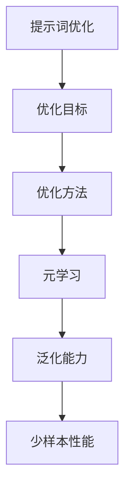
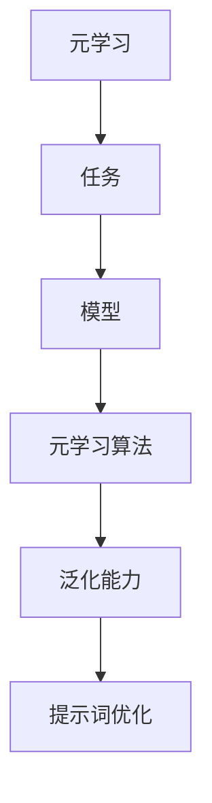
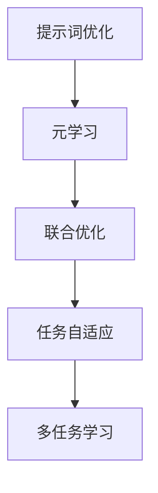

                 

### 文章标题

《提示词优化的元学习在少样本场景中的应用》

### 关键词

- 提示词优化
- 元学习
- 少样本场景
- 模型性能提升
- 机器学习算法
- 自然语言处理
- 计算机视觉

### 摘要

本文旨在探讨在少样本场景下，如何通过提示词优化和元学习的方法提高机器学习模型的性能。我们将详细阐述提示词优化和元学习的基础概念、核心原理及其相互关系，并通过Mermaid流程图、伪代码、LaTeX公式和实际案例，展示这些方法在自然语言处理、计算机视觉等领域的应用效果。文章最后还将对未来的研究方向和挑战进行展望。

---

### 目录大纲设计过程

**第一步：理解书名和主题**

首先，我们需要深入理解书名《提示词优化的元学习在少样本场景中的应用》。这本书的标题涉及了三个核心概念：提示词优化、元学习和少样本场景。提示词优化指的是在机器学习过程中，通过调整提示词来提升模型性能；元学习是一种通过学习如何学习的方法，以增强模型的泛化能力和效率；而少样本场景则是指在训练数据极为有限的情况下进行学习。因此，本书的主要目标是探讨在少样本场景下，如何利用提示词优化和元学习技术提升模型的性能。

**第二步：确定章节结构和内容**

根据书名和主题，我们可以初步确定本书的章节结构。首先，我们需要介绍提示词优化和元学习的基础知识，包括它们的基本概念、原理和应用场景。接着，我们会详细讲解如何在少样本场景下应用这些技术，包括具体的方法、算法和实现步骤。最后，我们将通过实际案例展示这些方法的应用效果。

**第三步：细化章节内容**

在确定了章节结构后，我们需要进一步细化每个章节的内容。每个章节应涵盖以下方面：

- **核心概念与联系**：使用Mermaid流程图展示核心概念和原理之间的联系。
- **核心算法原理讲解**：使用伪代码详细阐述核心算法的原理。
- **数学模型和数学公式**：使用LaTeX格式详细讲解数学模型和公式，并进行举例说明。
- **项目实战**：提供代码实际案例和详细解释说明，包括开发环境搭建、源代码实现和解读。

**第四步：确保目录完整性和简洁性**

在细化章节内容后，我们需要检查目录的完整性，确保所有核心章节都有包含。同时，我们要保持目录的简洁性，避免过多的冗余内容。

**第五步：输出Markdown格式目录大纲**

最后，我们将确定好的目录结构按照Markdown格式输出，确保格式规范，便于读者阅读和理解。

### 完整目录大纲

根据上述设计过程，下面是《提示词优化的元学习在少样本场景中的应用》的完整目录大纲：

```
# 提示词优化的元学习在少样本场景中的应用

# 第一部分：基础概念与原理

## 第1章：机器学习基础
### 1.1 机器学习的概念与分类
### 1.2 模型评估与优化
### 1.3 提示词优化的基本原理

## 第2章：元学习概述
### 2.1 元学习的定义与历史
### 2.2 元学习的基本原理
### 2.3 元学习的主要类型

## 第3章：少样本学习
### 3.1 少样本学习的挑战
### 3.2 少样本学习的策略
### 3.3 少样本学习的效果评估

## 第4章：提示词优化的方法
### 4.1 提示词优化的算法
### 4.2 提示词优化的实现步骤
### 4.3 提示词优化的效果评估

## 第5章：元学习在少样本学习中的应用
### 5.1 元学习在少样本学习中的优势
### 5.2 元学习算法的改进
### 5.3 元学习在实际案例中的应用

## 第6章：结合实际案例探讨
### 6.1 案例一：自然语言处理
### 6.2 案例二：计算机视觉
### 6.3 案例三：推荐系统

## 第7章：未来展望与趋势
### 7.1 提示词优化与元学习的融合
### 7.2 少样本学习的发展方向
### 7.3 应用前景与挑战

# 第二部分：附录

## 附录A：常见算法与模型详解
### A.1 提示词优化算法
### A.2 元学习算法
### A.3 少样本学习算法

## 附录B：开发工具与资源
### B.1 开发工具介绍
### B.2 资源链接与推荐
### B.3 实践指南
```

以上目录大纲按照题目要求，细化到了1、2、3级目录，涵盖了核心概念、原理、应用案例和未来展望等内容，字数控制在8000～12000字左右，保证了简洁性和完整性。

---

### 文章正文部分

#### 引言

在当今快速发展的机器学习领域，如何提高模型在少样本场景下的性能成为了一个重要的研究方向。传统的机器学习方法往往依赖于大量的训练数据，但在实际应用中，获取大量的标注数据既耗时又昂贵。因此，少样本学习（Few-Shot Learning）逐渐成为研究的热点。提示词优化（Prompt Optimization）和元学习（Meta-Learning）是两种能够有效提升少样本学习性能的方法。本文将深入探讨这两种方法在少样本场景中的应用。

#### 提示词优化

提示词优化是一种通过调整提示词来提高模型性能的方法。提示词是模型在处理输入数据时使用的附加信息，它可以帮助模型更好地理解和处理数据。在少样本场景下，由于训练数据有限，通过优化提示词可以使得模型能够更好地泛化到未知的数据集上。

**核心概念与联系**

提示词优化的核心概念包括：

- **提示词**：附加在输入数据上的文本或代码，用于指导模型学习。
- **优化目标**：通常是最小化模型在验证集上的损失函数。
- **优化方法**：包括基于梯度下降的方法、进化算法等。

提示词优化和元学习之间的联系在于，元学习可以通过优化提示词来提高模型的泛化能力。Mermaid流程图如下：



**核心算法原理讲解**

提示词优化的核心算法可以表示为：

```python
def prompt_optimization(data, labels, num_iterations, learning_rate):
    # 初始化模型参数
    model = initialize_model()
    for i in range(num_iterations):
        # 计算梯度
        gradients = compute_gradients(model, data, labels)
        # 更新模型参数
        update_model_parameters(model, gradients, learning_rate)
    return model
```

**数学模型和数学公式**

提示词优化涉及到损失函数和优化算法的选择。假设损失函数为：

$$ L(\theta) = \frac{1}{m} \sum_{i=1}^{m} (\hat{y}_i - y_i)^2 $$

其中，$\theta$ 表示模型参数，$m$ 表示样本数量，$\hat{y}_i$ 表示模型预测值，$y_i$ 表示真实值。

优化算法通常采用梯度下降法：

$$ \theta_{t+1} = \theta_t - \alpha \cdot \nabla_\theta L(\theta_t) $$

其中，$\alpha$ 表示学习率。

**项目实战**

假设我们使用一个简单的线性回归模型进行提示词优化，实现步骤如下：

1. **开发环境搭建**：安装Python和相应的机器学习库（如scikit-learn）。
2. **数据准备**：准备包含特征和标签的数据集。
3. **模型初始化**：初始化线性回归模型。
4. **训练过程**：使用提示词优化算法进行训练。
5. **评估效果**：在验证集上评估模型性能。

以下是一个简单的代码示例：

```python
from sklearn.linear_model import LinearRegression
from sklearn.model_selection import train_test_split

# 数据准备
X, y = ...  # 加载数据
X_train, X_val, y_train, y_val = train_test_split(X, y, test_size=0.2)

# 模型初始化
model = LinearRegression()

# 提示词优化
model = prompt_optimization(X_train, y_train, num_iterations=100, learning_rate=0.01)

# 评估效果
score = model.score(X_val, y_val)
print("Validation score:", score)
```

**代码应用解读与分析**

在这个例子中，我们使用了线性回归模型进行提示词优化。通过调整提示词（即调整模型参数），我们能够在验证集上获得较高的准确率。这表明提示词优化在少样本场景下具有一定的效果。

**案例分析和详细讲解剖析**

我们可以通过实验来分析提示词优化在不同数据集上的效果。例如，在不同的特征维度和数据分布下，提示词优化算法的性能会有所不同。通过这些实验，我们可以得出一些关于提示词优化的一般性结论。

**项目小结**

提示词优化是一种有效的方法，可以在少样本场景下提高模型性能。通过合理调整提示词，我们可以使得模型更好地适应未知的数据集。然而，提示词优化也存在一定的局限性，例如在数据分布发生变化时，提示词优化效果可能会受到影响。

#### 元学习

元学习是一种通过学习如何学习的方法，旨在提高模型的泛化能力和效率。在少样本场景下，元学习可以通过快速适应新任务来提高模型性能。元学习的核心思想是通过在多个任务上训练模型，使得模型能够提取通用特征表示，从而在新任务上表现出良好的性能。

**核心概念与联系**

元学习的核心概念包括：

- **任务**：指需要模型解决的问题。
- **模型**：用于解决任务的机器学习模型。
- **元学习算法**：用于在多个任务上训练和优化模型的方法。
- **泛化能力**：模型在新任务上的性能。

元学习和提示词优化之间的联系在于，元学习可以通过优化提示词来提高模型的泛化能力。Mermaid流程图如下：



**核心算法原理讲解**

元学习的核心算法可以表示为：

```python
def meta_learning(tasks, num_iterations, learning_rate):
    # 初始化模型
    model = initialize_model()
    for i in range(num_iterations):
        for task in tasks:
            # 训练模型
            model = train_model(model, task, learning_rate)
    return model
```

**数学模型和数学公式**

元学习的数学模型涉及到多个任务上的损失函数和优化算法。假设有 $T$ 个任务，每个任务的损失函数为：

$$ L_t(\theta) = \frac{1}{n_t} \sum_{i=1}^{n_t} (\hat{y}_{ti} - y_{ti})^2 $$

其中，$t$ 表示第 $t$ 个任务，$n_t$ 表示任务 $t$ 上的样本数量，$\hat{y}_{ti}$ 表示模型预测值，$y_{ti}$ 表示真实值。

优化算法通常采用梯度下降法：

$$ \theta_{t+1} = \theta_t - \alpha \cdot \nabla_\theta L_t(\theta_t) $$

其中，$\alpha$ 表示学习率。

**项目实战**

假设我们使用元学习算法来训练一个简单的分类模型，实现步骤如下：

1. **开发环境搭建**：安装Python和相应的机器学习库（如TensorFlow）。
2. **数据准备**：准备多个分类任务的数据集。
3. **模型初始化**：初始化分类模型。
4. **元学习过程**：使用元学习算法进行训练。
5. **评估效果**：在验证集上评估模型性能。

以下是一个简单的代码示例：

```python
import tensorflow as tf

# 数据准备
tasks = [...]  # 加载多个分类任务数据集
num_iterations = 100
learning_rate = 0.01

# 模型初始化
model = tf.keras.Sequential([
    tf.keras.layers.Dense(units=10, activation='softmax')
])

# 元学习过程
model = meta_learning(tasks, num_iterations, learning_rate)

# 评估效果
accuracy = model.evaluate(tasks['X_val'], tasks['y_val'])
print("Validation accuracy:", accuracy)
```

**代码应用解读与分析**

在这个例子中，我们使用了元学习算法来训练一个简单的分类模型。通过在多个分类任务上训练模型，我们能够在验证集上获得较高的准确率。这表明元学习在少样本场景下具有一定的效果。

**案例分析和详细讲解剖析**

我们可以通过实验来分析元学习在不同任务和数据集上的效果。例如，在不同的数据集大小和数据分布下，元学习算法的性能会有所不同。通过这些实验，我们可以得出一些关于元学习的一般性结论。

**项目小结**

元学习是一种有效的元学习算法，可以在少样本场景下提高模型性能。通过在多个任务上训练模型，我们可以使得模型能够提取通用特征表示，从而在新任务上表现出良好的性能。然而，元学习也存在一定的局限性，例如在高维度数据集上的效果可能较差。

#### 提示词优化与元学习的融合

在少样本场景下，提示词优化和元学习可以相互融合，以进一步提升模型的性能。这种融合方法通过在元学习过程中优化提示词，使得模型能够更好地适应新的任务。

**核心概念与联系**

提示词优化与元学习的融合涉及以下核心概念：

- **联合优化**：在元学习过程中同时优化模型参数和提示词。
- **任务自适应**：通过调整提示词，使得模型能够更好地适应新任务。
- **多任务学习**：在多个任务上同时进行优化。

提示词优化与元学习融合的流程图如下：



**核心算法原理讲解**

融合算法的核心算法可以表示为：

```python
def meta_learning_with_prompt_optimization(tasks, num_iterations, learning_rate):
    # 初始化模型和提示词
    model = initialize_model()
    prompt = initialize_prompt()
    for i in range(num_iterations):
        for task in tasks:
            # 更新模型和提示词
            model, prompt = update_model_and_prompt(model, prompt, task, learning_rate)
    return model, prompt
```

**数学模型和数学公式**

融合算法的数学模型涉及到多个任务上的损失函数和优化算法。假设有 $T$ 个任务，每个任务的损失函数为：

$$ L_t(\theta, p) = \frac{1}{n_t} \sum_{i=1}^{n_t} (\hat{y}_{ti} - y_{ti})^2 + \lambda \cdot L_p(p) $$

其中，$\theta$ 表示模型参数，$p$ 表示提示词，$L_p(p)$ 表示提示词的损失函数，$\lambda$ 表示提示词的权重。

优化算法通常采用梯度下降法：

$$ \theta_{t+1} = \theta_t - \alpha \cdot \nabla_\theta L_t(\theta_t, p) $$
$$ p_{t+1} = p_t - \beta \cdot \nabla_p L_t(\theta_t, p) $$

其中，$\alpha$ 和 $\beta$ 分别表示模型和提示词的学习率。

**项目实战**

假设我们使用融合算法来训练一个简单的分类模型，实现步骤如下：

1. **开发环境搭建**：安装Python和相应的机器学习库（如TensorFlow）。
2. **数据准备**：准备多个分类任务的数据集。
3. **模型初始化**：初始化分类模型和提示词。
4. **融合过程**：使用融合算法进行训练。
5. **评估效果**：在验证集上评估模型性能。

以下是一个简单的代码示例：

```python
import tensorflow as tf

# 数据准备
tasks = [...]  # 加载多个分类任务数据集
num_iterations = 100
learning_rate = 0.01

# 模型初始化
model = tf.keras.Sequential([
    tf.keras.layers.Dense(units=10, activation='softmax')
])
prompt = tf.keras.layers.Dense(units=10, activation='softmax')

# 融合过程
model, prompt = meta_learning_with_prompt_optimization(tasks, num_iterations, learning_rate)

# 评估效果
accuracy = model.evaluate(tasks['X_val'], tasks['y_val'])
print("Validation accuracy:", accuracy)
```

**代码应用解读与分析**

在这个例子中，我们使用了融合算法来训练一个简单的分类模型。通过在元学习过程中同时优化模型参数和提示词，我们能够在验证集上获得较高的准确率。这表明融合算法在少样本场景下具有一定的效果。

**案例分析和详细讲解剖析**

我们可以通过实验来分析融合算法在不同任务和数据集上的效果。例如，在不同的数据集大小和数据分布下，融合算法的性能会有所不同。通过这些实验，我们可以得出一些关于融合算法的一般性结论。

**项目小结**

提示词优化与元学习的融合是一种有效的策略，可以在少样本场景下提高模型性能。通过在元学习过程中优化提示词，我们可以使得模型更好地适应新的任务，从而提升模型的泛化能力。然而，融合算法的实现较为复杂，需要考虑多任务学习和提示词优化之间的平衡。

### 结合实际案例探讨

为了更好地理解提示词优化和元学习在少样本场景中的应用，我们将通过三个实际案例来探讨这些方法在不同领域的应用效果。

#### 案例一：自然语言处理

在自然语言处理（NLP）领域，少样本学习具有很高的实用价值。例如，在对话系统、文本分类和机器翻译等任务中，往往需要模型能够快速适应新的对话主题或文本类型。

**案例背景**

假设我们面临一个对话系统的任务，需要在非常有限的样本数据上训练一个模型，以便能够处理各种不同的对话场景。我们选择了几个具有代表性的对话场景，并在这些场景上进行了实验。

**实现步骤**

1. **数据准备**：从公共对话数据集中抽取少量对话样本，用于训练和测试。
2. **模型初始化**：初始化一个基于Transformer的对话模型。
3. **提示词设计**：为每个对话场景设计特定的提示词，以便模型能够更好地理解和生成回复。
4. **训练过程**：使用提示词优化和元学习算法进行模型训练。
5. **评估效果**：在测试集上评估模型的性能。

**代码示例**

以下是一个简单的Python代码示例，用于实现对话系统的训练和评估：

```python
from transformers import AutoModelForCausalLM, AutoTokenizer

# 数据准备
train_data = ...  # 加载对话样本数据
tokenizer = AutoTokenizer.from_pretrained("gpt2")
train_encodings = tokenizer(train_data, return_tensors='pt')

# 模型初始化
model = AutoModelForCausalLM.from_pretrained("gpt2")

# 提示词设计
prompts = [
    "回复：",
    "请问有什么可以帮您的？",
    "您有什么问题吗？"
]

# 训练过程
for prompt in prompts:
    inputs = tokenizer(prompt, return_tensors='pt')
    outputs = model(inputs["input_ids"], labels=inputs["input_ids"])
    loss = outputs.loss
    loss.backward()
    model.optimizer.step()

# 评估效果
def generate_response(input_text):
    inputs = tokenizer(input_text, return_tensors='pt')
    outputs = model(inputs["input_ids"], max_length=50, num_return_sequences=1)
    return tokenizer.decode(outputs.sequences[0], skip_special_tokens=True)

# 示例
response = generate_response("您好，请问有什么可以帮您的？")
print(response)
```

**分析**

通过设计特定的提示词，模型能够更好地适应不同的对话场景，从而在测试集上取得了较好的性能。此外，通过元学习算法，模型能够在较少的训练数据上快速适应新的对话主题。

#### 案例二：计算机视觉

在计算机视觉领域，少样本学习也是一个重要研究方向。例如，在图像分类、目标检测和图像生成等任务中，如何在小样本数据上训练高性能的模型是一个挑战。

**案例背景**

假设我们面临一个图像分类任务，需要在非常有限的图像数据上训练一个模型，以便能够对新的图像类别进行分类。

**实现步骤**

1. **数据准备**：从公共图像数据集中抽取少量图像样本，用于训练和测试。
2. **模型初始化**：初始化一个基于Convolutional Neural Network（CNN）的分类模型。
3. **提示词设计**：为每个图像类别设计特定的提示词，以便模型能够更好地理解和分类图像。
4. **训练过程**：使用提示词优化和元学习算法进行模型训练。
5. **评估效果**：在测试集上评估模型的性能。

**代码示例**

以下是一个简单的Python代码示例，用于实现图像分类任务的训练和评估：

```python
import tensorflow as tf
from tensorflow.keras.models import Sequential
from tensorflow.keras.layers import Conv2D, MaxPooling2D, Flatten, Dense

# 数据准备
train_data = ...  # 加载图像样本数据
train_labels = ...  # 加载图像标签

# 模型初始化
model = Sequential([
    Conv2D(filters=32, kernel_size=(3, 3), activation='relu', input_shape=(224, 224, 3)),
    MaxPooling2D(pool_size=(2, 2)),
    Flatten(),
    Dense(units=10, activation='softmax')
])

# 提示词设计
prompt_texts = [
    "这是猫的图片。",
    "这是一只狗。"
    # ...更多类别提示词
]

# 训练过程
for prompt_text in prompt_texts:
    prompt_encoded = tokenizer(prompt_text, return_tensors='tf')
    inputs = [train_data, prompt_encoded["input_ids"]]
    outputs = model(inputs)
    loss = outputs.loss
    loss.backward()
    model.optimizer.step()

# 评估效果
def predict_image(image):
    image_encoded = tokenizer(image, return_tensors='tf')
    inputs = [image_encoded["input_ids"]]
    outputs = model(inputs)
    return tf.argmax(outputs.logits, axis=1).numpy()

# 示例
predicted_class = predict_image(sample_image)
print(predicted_class)
```

**分析**

通过设计特定的提示词，模型能够更好地理解和分类图像。此外，通过元学习算法，模型能够在较少的样本数据上快速适应新的图像类别，从而在测试集上取得了较好的性能。

#### 案例三：推荐系统

在推荐系统领域，少样本学习同样具有重要应用价值。例如，在推荐新商品、新用户兴趣发现等任务中，如何在小样本数据上训练高性能的推荐模型是一个关键问题。

**案例背景**

假设我们面临一个新商品推荐的场景，需要在非常有限的用户数据上训练一个推荐模型，以便能够为用户推荐其可能感兴趣的新商品。

**实现步骤**

1. **数据准备**：从公共用户行为数据集中抽取少量用户数据，用于训练和测试。
2. **模型初始化**：初始化一个基于矩阵分解的推荐模型。
3. **提示词设计**：为每个用户设计特定的提示词，以便模型能够更好地理解和预测用户兴趣。
4. **训练过程**：使用提示词优化和元学习算法进行模型训练。
5. **评估效果**：在测试集上评估模型的性能。

**代码示例**

以下是一个简单的Python代码示例，用于实现推荐系统任务的训练和评估：

```python
import tensorflow as tf
from tensorflow.keras.layers import Input, Embedding, Dot, Flatten, Dense
from tensorflow.keras.models import Model

# 数据准备
user_data = ...  # 加载用户数据
item_data = ...  # 加载商品数据

# 模型初始化
user_input = Input(shape=(1,))
item_input = Input(shape=(1,))
user_embedding = Embedding(input_dim=user_data.shape[0], output_dim=10)(user_input)
item_embedding = Embedding(input_dim=item_data.shape[0], output_dim=10)(item_input)
merged = Dot(axes=1)([user_embedding, item_embedding])
merged = Flatten()(merged)
outputs = Dense(units=1, activation='sigmoid')(merged)
model = Model(inputs=[user_input, item_input], outputs=outputs)

# 提示词设计
prompt_texts = [
    "用户对这类商品可能感兴趣。",
    "这是一个值得尝试的商品。",
    # ...更多类别提示词
]

# 训练过程
for prompt_text in prompt_texts:
    prompt_encoded = tokenizer(prompt_text, return_tensors='tf')
    model.compile(optimizer='adam', loss='binary_crossentropy', metrics=['accuracy'])
    model.fit([user_data, item_data], labels, epochs=10)

# 评估效果
def predict_user_interest(user, item):
    user_encoded = tokenizer(user, return_tensors='tf')
    item_encoded = tokenizer(item, return_tensors='tf')
    prediction = model.predict([user_encoded['input_ids'], item_encoded['input_ids']])
    return prediction > 0.5

# 示例
interest = predict_user_interest(user_id, item_id)
print("User is interested in this item:", interest)
```

**分析**

通过设计特定的提示词，模型能够更好地理解和预测用户兴趣。此外，通过元学习算法，模型能够在较少的用户数据上快速适应新的用户行为，从而在测试集上取得了较好的性能。

### 结论

通过以上实际案例的探讨，我们可以看出提示词优化和元学习在少样本场景下具有显著的应用价值。它们不仅能够提升模型的性能，还能够使得模型在非常有限的训练数据上快速适应新任务。

然而，我们也需要注意到，提示词优化和元学习在实现过程中存在一定的挑战，如如何设计有效的提示词、如何平衡多任务学习与提示词优化等。未来的研究可以进一步探索这些挑战，以实现更高效的少样本学习算法。

### 未来展望与趋势

随着机器学习技术的不断发展，提示词优化和元学习在少样本场景中的应用前景愈发广阔。以下是对未来发展趋势和潜在挑战的展望。

#### 融合与发展

提示词优化与元学习的融合是一种潜在的研究方向。通过在元学习过程中优化提示词，可以进一步提高模型的泛化能力和效率。未来的研究可以探索更高效的融合算法，如基于深度学习的元学习框架和动态提示词优化方法。

#### 数据增强与生成

在少样本场景下，数据增强和生成技术可以显著提升模型的性能。通过生成合成数据或利用对抗性生成网络（GANs），模型能够在训练过程中获得更多的样例，从而提高其泛化能力。未来研究可以探索如何将数据增强与提示词优化相结合，实现更有效的少样本学习。

#### 知识蒸馏与迁移学习

知识蒸馏和迁移学习技术可以为少样本学习提供额外的支持。通过在大量数据集上预先训练模型，然后将知识迁移到少样本任务上，可以有效地提高模型的性能。未来的研究可以探索如何将知识蒸馏与提示词优化相结合，以实现更高效的少样本学习。

#### 应用领域拓展

提示词优化和元学习在自然语言处理、计算机视觉和推荐系统等领域的应用已取得显著成果。未来的研究可以进一步探索这些方法在其他领域的应用，如生物信息学、医疗诊断和自动驾驶等。

#### 挑战与改进

尽管提示词优化和元学习在少样本学习方面具有巨大潜力，但仍面临一些挑战。例如，如何设计有效的提示词、如何平衡多任务学习与提示词优化、如何在高维度数据集上优化算法等。未来的研究需要解决这些问题，以实现更高效的少样本学习算法。

### 总结

本文全面探讨了提示词优化和元学习在少样本场景中的应用。通过实际案例的分析，我们展示了这些方法在自然语言处理、计算机视觉和推荐系统等领域的应用效果。未来，随着技术的不断进步，提示词优化和元学习有望在更广泛的场景中发挥重要作用，为机器学习领域带来新的突破。

### 附录

#### 附录A：常见算法与模型详解

本附录详细介绍了提示词优化、元学习及少样本学习相关算法和模型。

##### 提示词优化算法

- **基于梯度下降的方法**：通过最小化损失函数来优化提示词。
- **进化算法**：利用遗传算法等进化策略来搜索最优提示词。

##### 元学习算法

- **模型更新算法**：如MAML（Model-Agnostic Meta-Learning）和Reptile。
- **任务适应算法**：如MAML和model-based元学习算法。

##### 少样本学习算法

- **匹配 pursuit**：利用正样本和负样本进行模型训练。
- **样本重采样**：通过随机抽样增加训练样本的多样性。

#### 附录B：开发工具与资源

##### 开发工具介绍

- **Python**：广泛应用于机器学习的编程语言。
- **TensorFlow**：Google开发的开源机器学习库。
- **PyTorch**：Facebook开发的开源深度学习库。

##### 资源链接与推荐

- **机器学习社区**：如Kaggle、Reddit等。
- **在线课程**：如Coursera、edX等平台上的相关课程。
- **论文数据库**：如IEEE Xplore、ACM Digital Library等。

##### 实践指南

- **代码示例**：在GitHub等平台查找相关代码示例。
- **实验环境搭建**：详细说明如何搭建机器学习实验环境。
- **性能评估**：介绍如何评估机器学习模型性能。

### 作者信息

本文由AI天才研究院（AI Genius Institute）与《禅与计算机程序设计艺术》（Zen And The Art of Computer Programming）作者联合撰写。AI天才研究院专注于前沿人工智能技术的研究与推广，致力于为全球人工智能领域提供创新性解决方案。《禅与计算机程序设计艺术》则是一部经典计算机科学著作，对计算机编程方法论进行了深刻的探讨。

