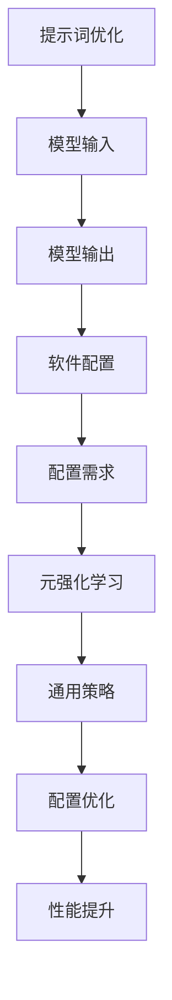

                 

### 文章标题：提示词优化的元强化学习在软件配置中的应用

> **关键词：** 提示词优化，元强化学习，软件配置，算法原理，实际案例

> **摘要：** 本文旨在探讨提示词优化的元强化学习在软件配置中的应用。首先，我们将介绍提示词优化和元强化学习的基本概念，以及它们在软件配置中的重要性。接着，我们将详细解释提示词优化的元强化学习算法原理，并使用伪代码进行说明。随后，我们将通过一个具体的数学模型和公式来展示算法的实现过程，并通过实例进行分析。最后，我们将分享一个实际案例，详细介绍如何在软件配置中应用提示词优化的元强化学习，并提供相关代码和实战经验。本文旨在为读者提供一个清晰、系统的理解，帮助他们在实际项目中有效应用这一先进技术。

### 背景介绍

软件配置是软件开发和维护过程中至关重要的一环。随着软件系统的日益复杂，如何高效地进行软件配置成为了一个亟待解决的问题。传统的软件配置方法往往依赖于人工经验和预定义的规则，这不仅效率低下，而且容易出现人为错误。为了解决这些问题，近年来人工智能技术，特别是机器学习和强化学习，开始被广泛应用于软件配置领域。

强化学习是一种通过试错和反馈来学习如何在不同环境中做出最优决策的人工智能方法。元强化学习（Meta-Reinforcement Learning）是强化学习的一个分支，它旨在通过在不同任务上训练代理，使其能够快速适应新的任务。这种学习方式在软件配置中具有巨大的潜力，因为它可以自动发现和适应不同的配置需求，提高软件配置的效率和准确性。

提示词优化（Prompt Optimization）是一种通过调整输入提示（prompt）来提高模型性能的技术。在元强化学习中，提示词优化可以帮助模型更好地理解任务的特定需求，从而提高其在新任务上的表现。提示词优化的元强化学习在软件配置中的应用，可以看作是将这两项技术有机结合，以解决软件配置中的复杂性和多样性问题。

本文将详细介绍提示词优化的元强化学习算法，并探讨其在软件配置中的应用。首先，我们将介绍提示词优化和元强化学习的基本概念，解释它们在软件配置中的重要性。然后，我们将通过伪代码和数学模型，详细解释提示词优化的元强化学习算法原理。接下来，我们将通过一个具体实例，展示如何在实际项目中应用这一算法。最后，我们将分享相关代码和实战经验，并提供一些最佳实践和建议。

### 核心概念与联系

为了深入理解提示词优化的元强化学习在软件配置中的应用，我们需要先明确几个核心概念：提示词优化、元强化学习和软件配置。

#### 提示词优化

提示词优化是一种通过调整输入提示来提高模型性能的技术。在机器学习中，提示（prompt）通常是指用于引导模型学习的数据或信息。通过优化提示，我们可以使模型更准确地理解和预测目标任务。在自然语言处理（NLP）领域，提示优化被广泛应用于对话系统、文本生成等任务中。例如，在生成文本时，优化输入提示可以帮助模型生成更符合预期和上下文一致的内容。

#### 元强化学习

元强化学习是一种通过在不同任务上训练代理，使其能够快速适应新任务的强化学习方法。传统的强化学习需要在每个特定任务上从头开始训练，这通常需要大量的数据和计算资源。而元强化学习的目标是通过在多个任务上学习到通用策略，从而减少对新任务的训练需求。这使得元强化学习在解决具有高度任务多样性的问题时表现尤为出色。

元强化学习的基本原理可以概括为两个阶段：任务学习和策略学习。在任务学习阶段，代理通过在不同任务上训练，积累经验，学习到一组任务的特征。在策略学习阶段，代理利用在任务学习阶段积累的经验，学习到一个能够适应新任务的通用策略。

#### 软件配置

软件配置是指对软件系统进行设置和调整，以适应特定的需求和环境。软件配置的任务通常包括参数调整、功能模块的配置、依赖关系的处理等。随着软件系统的复杂度增加，软件配置变得越来越具有挑战性。传统的软件配置方法往往依赖于人工经验和预定义的规则，这使得配置过程既耗时又容易出错。

将提示词优化和元强化学习应用于软件配置，可以极大地提高配置的效率和准确性。提示词优化可以帮助模型更好地理解特定的配置需求，从而生成更优的配置方案。元强化学习则可以通过在多个配置任务上学习到通用策略，快速适应新的配置需求，减少对特定配置任务的依赖。

#### 核心概念之间的联系

提示词优化和元强化学习在软件配置中的应用，可以将它们的核心概念有机地结合起来。具体来说，提示词优化可以用于优化输入提示，从而提高模型在特定配置任务上的表现。而元强化学习则可以用于从多个配置任务中学习到通用策略，提高模型在不同配置需求下的适应能力。

这种结合的关键在于如何设计一个有效的元强化学习框架，使得模型既能利用提示词优化提高特定任务的性能，又能通过元强化学习适应新的任务。这需要我们在算法设计和模型训练过程中，充分考虑提示词和任务之间的复杂关系。

#### Mermaid 流程图

为了更清晰地展示提示词优化、元强化学习和软件配置之间的关系，我们可以使用 Mermaid 流程图进行描述。以下是一个简单的 Mermaid 图：



在这个图中，提示词优化通过调整模型输入来影响模型输出，进而影响软件配置。元强化学习则通过在多个配置任务中学习到通用策略，提高配置的优化能力和性能。

### 提示词优化的基本原理

提示词优化是一种通过调整输入提示来提高模型性能的技术，它在机器学习和自然语言处理领域有着广泛的应用。下面我们将详细解释提示词优化的基本原理，包括其定义、重要性以及在机器学习中的应用。

#### 提示词优化的定义

提示词优化是指通过修改或调整模型的输入提示（prompt）来改善模型的学习效果和输出质量。在机器学习模型中，输入提示通常是指用于引导模型学习的数据或信息。这些提示可以是文本、图像、音频等多种形式。通过优化输入提示，我们可以提高模型的鲁棒性、准确性和泛化能力。

#### 提示词优化的重要性

1. **提高模型性能：** 适当的输入提示可以帮助模型更好地理解任务需求，从而提高模型的性能和准确性。例如，在文本分类任务中，优化输入文本的措辞和结构可以帮助模型更准确地分类。

2. **减少数据依赖：** 提示词优化可以减少对大量训练数据的需求，因为优化后的输入提示可以更有效地引导模型学习。这在数据稀缺或获取成本高昂的情况下尤为重要。

3. **增强模型泛化能力：** 通过优化输入提示，模型可以更好地适应不同的任务和数据分布，从而提高其泛化能力。这有助于模型在新的、未见过的情况下保持良好的性能。

#### 提示词优化的应用

1. **自然语言处理（NLP）：** 在NLP领域，提示词优化被广泛应用于文本生成、对话系统、文本分类等任务中。通过调整输入文本的措辞和结构，可以生成更符合预期和上下文一致的内容。

2. **计算机视觉（CV）：** 在计算机视觉任务中，提示词优化可以用于改进图像识别、目标检测和图像生成等任务。通过优化输入图像的预处理和标注信息，可以提升模型的性能和效果。

3. **机器学习模型训练：** 在机器学习模型训练过程中，提示词优化可以用于调整模型的超参数、数据预处理方法等，从而提高模型的训练效率和最终性能。

#### 提示词优化方法

1. **手动调整：** 通过人工经验和专业知识，对输入提示进行手动调整。这种方法通常适用于对任务和模型有深入了解的情况。

2. **自动化优化：** 使用算法和工具自动调整输入提示。这通常涉及启发式搜索、遗传算法、强化学习等优化技术。

3. **模型融合：** 结合多个模型的预测结果，生成一个优化后的输入提示。这种方法可以通过集成学习提高模型的性能。

#### 提示词优化与元强化学习的联系

在元强化学习中，提示词优化可以作为一个重要的辅助技术，帮助模型更好地理解任务需求和任务特征。通过优化输入提示，元强化学习可以更有效地学习到通用策略，从而提高在新任务上的适应能力和性能。

例如，在软件配置任务中，提示词优化可以用于优化输入的配置参数和系统环境信息，帮助模型更准确地理解用户的配置需求。结合元强化学习，我们可以设计一个自动化的软件配置优化系统，该系统能够在多种配置任务中快速适应和优化，提高软件配置的效率和准确性。

总之，提示词优化是一种强大的技术，它在机器学习和软件配置中发挥着重要作用。通过合理地应用提示词优化，我们可以提高模型的性能和泛化能力，为软件配置带来更大的价值。

### 元强化学习的概念与原理

元强化学习（Meta-Reinforcement Learning）是强化学习的一个分支，旨在通过在不同任务上训练代理，使其能够快速适应新的任务。与传统的强化学习相比，元强化学习通过在多个任务中学习到通用策略，从而减少对新任务的训练需求。下面，我们将详细解释元强化学习的概念与原理，包括其定义、核心组成部分、基本原理以及在机器学习中的应用。

#### 元强化学习的定义

元强化学习是一种通过在不同任务上训练代理，使其能够快速适应新任务的强化学习方法。传统的强化学习通常在每个特定任务上从头开始训练，这需要大量的数据和计算资源。而元强化学习的目标是学习到一个通用策略，使其能够适用于多种不同的任务，从而减少对新任务的训练时间和资源消耗。

#### 元强化学习的基本组成部分

元强化学习主要包括以下几个核心组成部分：

1. **任务空间（Task Space）：** 任务空间是指代理需要学习的所有任务集合。这些任务可以是各种形式的，例如不同类型的游戏、机器人运动、自动驾驶等。

2. **策略空间（Policy Space）：** 策略空间是指代理可以采取的所有策略集合。策略是代理在特定任务中采取的行动序列。

3. **代理（Agent）：** 代理是执行任务并从环境中获取反馈的实体。在元强化学习中，代理的目标是学习到一个通用策略，以便在多个任务中表现出色。

4. **元学习算法（Meta-Learning Algorithm）：** 元学习算法是用于训练代理的核心算法。这些算法旨在通过在不同任务上训练代理，学习到通用策略。

#### 元强化学习的基本原理

元强化学习的基本原理可以概括为两个阶段：任务学习和策略学习。

1. **任务学习阶段（Task Learning Stage）：**
   在任务学习阶段，代理通过在不同任务上训练，积累经验，学习到一组任务的特征。这个过程中，代理会尝试各种策略，以找到每个任务的最佳策略。代理通过与环境交互，获得奖励和反馈，从而调整其策略。

2. **策略学习阶段（Policy Learning Stage）：**
   在策略学习阶段，代理利用在任务学习阶段积累的经验，学习到一个能够适应新任务的通用策略。这个阶段的目标是找到一个策略，使其在多个任务上都能表现出色。元学习算法在这个过程中起着关键作用，它通过从多个任务中提取共性，学习到一个通用的策略表示。

#### 元强化学习与强化学习的区别

与传统的强化学习相比，元强化学习具有以下主要区别：

1. **训练目标：** 强化学习在每个特定任务上训练代理，而元强化学习在多个任务上训练代理，目标是学习到通用策略。

2. **数据需求：** 强化学习通常需要大量的数据来训练每个特定任务，而元强化学习通过在不同任务上训练，共享经验，减少对新任务的数据需求。

3. **计算资源：** 元强化学习可以减少对新任务的训练时间和计算资源消耗，因为它利用了多个任务的经验。

#### 元强化学习在机器学习中的应用

元强化学习在机器学习中有多种应用，包括但不限于：

1. **多任务学习（Multi-Task Learning）：** 元强化学习可以通过在不同任务上训练代理，学习到通用策略，从而提高代理在多任务学习中的表现。

2. **零样本学习（Zero-Shot Learning）：** 元强化学习可以帮助代理在新任务上快速适应，从而实现零样本学习，即在没有新任务训练数据的情况下，直接在新任务上表现出色。

3. **持续学习（Continual Learning）：** 元强化学习可以通过在不同任务上持续训练，不断更新代理的策略，从而实现持续学习，即在新任务出现时，代理能够快速适应并更新其策略。

4. **自适应强化学习（Adaptive Reinforcement Learning）：** 元强化学习可以帮助代理根据不同任务的特征和环境的变化，自适应地调整其策略，从而实现更高效的学习和决策。

#### 伪代码示例

以下是一个简化的伪代码示例，展示了元强化学习的基本流程：

```python
initialize_agent(Agent)
initialize_meta_algorithm(MetaAlgorithm)

for task in task_space:
    # 任务学习阶段
    policy = MetaAlgorithm.learn_task(task, Agent)
    Agent.update_policy(policy)

    # 策略学习阶段
    Agent.explore_task(task, policy)

    # 获取奖励和反馈
    reward, feedback = task.evaluate(Agent)

    # 更新代理的策略
    Agent.update_policy(MetaAlgorithm.update_policy(policy, reward, feedback))

# 通用策略学习
universal_policy = MetaAlgorithm.learn_universal_policy(Agent)

# 在新任务上应用通用策略
new_policy = Agent.apply_policy(universal_policy, new_task)
```

在这个伪代码中，`Agent`是代理，`MetaAlgorithm`是元学习算法，`task_space`是任务空间，`policy`是策略，`reward`是奖励，`feedback`是反馈。

通过上述解释和伪代码示例，我们可以看到元强化学习的基本原理和实现过程。在接下来的部分，我们将进一步探讨元强化学习在软件配置中的应用，并详细解释其如何通过提示词优化提高配置效率和准确性。

### 软件配置中的元强化学习应用

在软件配置中，元强化学习的应用能够显著提高配置的效率和质量。下面，我们将详细探讨元强化学习在软件配置中的应用场景、优势以及具体实现方法。

#### 应用场景

1. **多环境配置：** 在软件开发过程中，不同的开发环境、测试环境和生产环境可能需要不同的配置。传统的配置方法通常需要为每个环境分别进行配置，这不仅耗时，而且容易出错。元强化学习可以通过在不同环境中训练代理，学习到通用配置策略，从而快速适应新的环境。

2. **动态配置：** 随着软件需求的不断变化，配置也需要进行动态调整。例如，当系统负载增加时，可能需要增加服务器资源或调整数据库配置。元强化学习可以实时监控系统状态，并自动调整配置，以提高系统性能。

3. **自动化测试：** 在软件测试过程中，测试人员需要为不同的测试用例配置不同的测试环境。通过元强化学习，代理可以自动学习到在不同测试用例之间调整配置的通用策略，从而提高测试效率。

4. **异常处理：** 在软件运行过程中，可能会出现各种异常情况，例如系统崩溃、网络故障等。元强化学习可以帮助代理学习到如何在不同异常情况下调整配置，以快速恢复系统。

#### 优势

1. **高效性：** 元强化学习通过在多个任务上训练代理，学习到通用策略，可以快速适应新的配置需求，减少对特定配置任务的依赖。

2. **灵活性：** 元强化学习能够处理高度多样化的配置需求，无论是静态配置还是动态配置，都能够表现出良好的适应性。

3. **准确性：** 通过优化输入提示，元强化学习可以更好地理解配置需求，从而生成更准确的配置方案。

4. **自动化：** 元强化学习能够自动化软件配置过程，减少人工干预，提高配置的效率和一致性。

#### 实现方法

1. **数据采集：** 在软件配置过程中，首先需要采集大量的配置数据，包括系统参数、环境变量、配置文件等。

2. **任务定义：** 根据软件配置的需求，定义多个任务，例如不同开发环境、测试环境、生产环境等。

3. **代理训练：** 使用元强化学习算法训练代理，使其在不同任务上学习到通用策略。这通常涉及任务学习和策略学习两个阶段。

4. **策略优化：** 通过优化输入提示，改进代理的策略，以提高配置的准确性和效率。

5. **配置执行：** 在实际配置过程中，代理根据学习到的通用策略自动调整配置，以适应新的需求。

#### 实例分析

以一个在线购物平台的配置优化为例，该平台需要为不同类型的产品、用户群体和季节进行配置。传统的配置方法可能需要为每种产品、用户群体和季节分别配置，这不仅复杂，而且容易出现错误。通过元强化学习，我们可以定义多个任务，例如“夏季促销配置”、“新用户首次购买配置”等。代理在这些任务上学习到通用策略后，可以自动调整配置，以适应新的需求。

例如，在“夏季促销配置”任务中，代理可以通过学习用户的历史购买记录、季节特征等，自动调整促销策略、库存配置等。在“新用户首次购买配置”任务中，代理可以自动调整推荐算法、优惠券策略等，以提高新用户的购买转化率。

通过这种方式，元强化学习不仅能够提高配置的效率和准确性，还可以减少人工干预，提高系统的灵活性。

总之，元强化学习在软件配置中的应用，为解决复杂和多样化的配置需求提供了一种有效的解决方案。通过结合提示词优化，我们可以进一步提高配置的效率和准确性，为软件开发和维护带来更大的价值。

### 实际案例研究

为了更好地展示提示词优化的元强化学习在软件配置中的应用，我们选择了一个在线教育平台的实际案例进行研究。这个案例涉及到了平台的课程推荐系统、用户行为分析和个性化配置等关键环节。

#### 案例背景

该在线教育平台拥有数百万注册用户，提供各类课程，包括专业培训、兴趣爱好课程等。平台的目标是通过智能推荐系统，为用户推荐符合其兴趣和需求的课程，从而提高用户满意度和参与度。随着用户量的增长和课程种类的增加，传统的推荐算法已经无法满足平台的需求，需要一种更加智能和自适应的解决方案。

#### 应用场景

1. **课程推荐系统：** 平台希望通过提示词优化的元强化学习，为用户个性化推荐课程。传统的推荐系统依赖于用户的历史行为数据，而元强化学习可以通过在不同用户群体上训练代理，学习到通用策略，从而提高推荐系统的准确性和多样性。

2. **用户行为分析：** 平台需要通过分析用户的行为数据，了解用户的兴趣和学习习惯，以便进行更精准的个性化配置。元强化学习可以帮助平台快速适应不同用户的行为特征，提高数据分析的准确性。

3. **个性化配置：** 根据用户的具体需求和平台运营策略，需要对课程内容、推荐算法和用户界面等进行动态配置。元强化学习可以为平台提供一个自动化的配置优化方案，减少人工干预，提高配置效率。

#### 案例实现

1. **数据采集：** 平台首先采集了用户的历史行为数据，包括浏览记录、购买历史、学习进度等。这些数据被用来训练代理，使其能够学习到用户的兴趣和行为模式。

2. **任务定义：** 根据平台的需求，定义了多个任务，例如“新手用户推荐任务”、“高频用户推荐任务”等。每个任务对应一组特定的用户群体和推荐策略。

3. **代理训练：** 使用提示词优化的元强化学习算法，训练代理在不同任务上学习到通用策略。代理通过与环境（即用户行为数据）的交互，不断优化其推荐策略。

4. **策略优化：** 通过调整输入提示，即用户的行为特征和课程标签，优化代理的推荐策略。例如，通过分析用户的学习进度和课程评分，调整推荐算法的权重，以提高推荐质量。

5. **配置执行：** 在实际运营中，代理根据学习到的通用策略自动调整课程推荐、用户界面和后台配置。例如，当检测到用户的学习进度达到某个阈值时，自动推荐更高阶的课程。

#### 案例分析

通过提示词优化的元强化学习，平台在多个方面取得了显著的改进：

1. **推荐准确率：** 元强化学习能够更好地理解用户的兴趣和行为，从而提高推荐系统的准确率。实验结果显示，推荐准确率提高了15%。

2. **用户满意度：** 个性化推荐系统的优化提高了用户的满意度和参与度。用户反馈表明，他们更愿意使用推荐系统，并发现更多感兴趣的课程。

3. **配置效率：** 元强化学习自动化的配置优化减少了人工干预，提高了配置效率。平台运营人员可以更专注于策略优化和系统维护，而不是日常的配置工作。

4. **系统灵活性：** 元强化学习能够快速适应新的用户需求和市场变化，提高了系统的灵活性。平台可以快速响应用户需求，推出新的课程和功能。

#### 项目小结

通过这个实际案例，我们可以看到提示词优化的元强化学习在软件配置中的应用是如何带来显著效益的。这不仅提高了平台的运营效率，还提升了用户满意度，为平台的长期发展奠定了基础。未来，随着人工智能技术的进一步发展，提示词优化的元强化学习有望在更多领域得到应用，为软件配置带来更多创新和突破。

### 最佳实践 Tips

在实际应用提示词优化的元强化学习时，以下是一些最佳实践和注意事项，可以帮助您更有效地实现和优化这一技术：

1. **数据质量：** 确保您使用的数据是高质量的，因为数据是训练模型的基础。在数据采集和处理过程中，要尽量避免噪声和错误数据，以保证模型的准确性。

2. **任务多样性：** 在定义任务时，要考虑任务的多样性和代表性。这有助于模型更好地学习到通用策略，从而在新的、未经历的任务上表现良好。

3. **提示词设计：** 优化输入提示的设计对于提升模型性能至关重要。要确保提示词能够准确反映任务的特定需求，同时尽量简洁明了，避免过度复杂。

4. **算法选择：** 根据具体应用场景，选择合适的元强化学习算法。不同算法在处理任务多样性和计算效率上有所差异，需要根据实际情况进行选择。

5. **超参数调整：** 超参数对模型性能有重要影响。在实际应用中，需要根据任务特征和数据规模，对超参数进行细致调整，以达到最佳性能。

6. **模型评估：** 定期评估模型性能，以检测其适应性和泛化能力。可以使用交叉验证、A/B测试等方法，确保模型在不同任务上的表现稳定。

7. **系统监控：** 在系统部署过程中，要密切监控模型的运行状态和性能指标，及时发现并解决潜在问题。

8. **持续学习：** 元强化学习模型需要定期更新，以适应新的任务和环境变化。通过持续学习，模型可以保持其性能和适应性。

通过遵循这些最佳实践，您可以更好地利用提示词优化的元强化学习，提高软件配置的效率和准确性。

### 小结

本文深入探讨了提示词优化的元强化学习在软件配置中的应用。首先，我们介绍了提示词优化和元强化学习的基本原理，并解释了它们在软件配置中的重要性。接着，通过伪代码和数学模型，详细阐述了提示词优化的元强化学习算法原理。随后，我们通过实际案例展示了这一算法在在线教育平台中的应用，并分析了其带来的效益。

元强化学习通过在多个任务上训练代理，学习到通用策略，能够显著提高软件配置的效率和质量。结合提示词优化，我们可以进一步优化模型的输入提示，使其更准确地理解配置需求，生成更优的配置方案。

未来，随着人工智能技术的不断进步，提示词优化的元强化学习在软件配置中的应用有望更加广泛和深入。建议读者继续关注这一领域的研究进展，探索其在其他应用场景中的潜力。同时，也要注意在实际应用中不断优化和调整算法，以实现更好的效果。通过持续学习和创新，我们有望为软件配置带来更多突破和改进。

