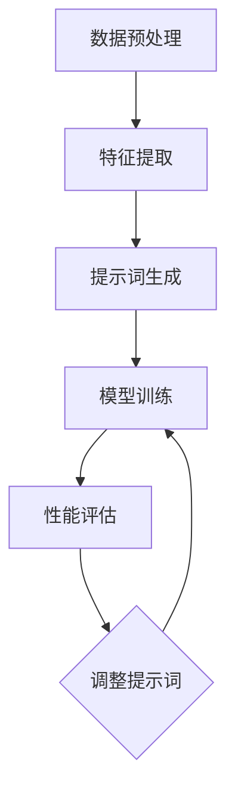
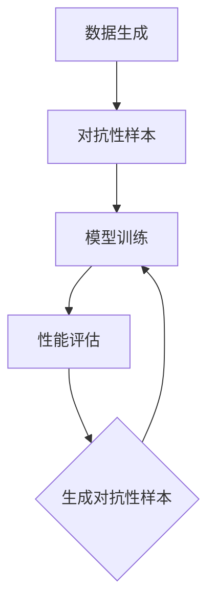
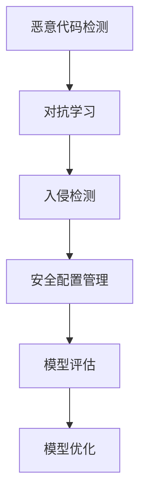

                 


### 引言

随着计算机技术的飞速发展，软件安全日益成为一个备受关注的问题。在当今数字化时代，各种应用程序和系统都在不断扩展和更新，但随之而来的是网络安全威胁的日益增加。为了应对这些威胁，研究人员和开发者们不断探索新的技术和方法来提高软件的安全性。

本文将探讨一种名为“提示词优化的对抗学习”的技术，并阐述其在软件安全领域的潜在应用。提示词优化（Prompted Optimization）是一种通过输入提示词来优化模型性能的方法，而对抗学习（Adversarial Learning）则是一种通过生成对抗性样本来增强模型鲁棒性的技术。两者的结合为软件安全领域提供了一种新的解决方案。

本文旨在介绍提示词优化、对抗学习和软件安全的基本概念，详细解释提示词优化的对抗学习算法，并展示其在实际项目中的应用。通过本文的探讨，读者将了解到如何利用这些先进技术来提高软件的安全性。

关键词：提示词优化，对抗学习，软件安全，算法原理，实际应用

摘要：本文首先简要介绍了提示词优化、对抗学习和软件安全的基本概念。接着，本文详细解释了提示词优化的对抗学习算法，包括算法的步骤和伪代码。此外，本文还展示了数学模型和公式，并提供了实际项目案例，以展示对抗学习在软件安全中的应用。最后，本文总结了主要结论，并对未来的研究方向进行了展望。

### 第1章 核心概念与联系

在深入探讨提示词优化的对抗学习之前，我们需要了解一些关键概念。本章节将详细介绍提示词优化、对抗学习和软件安全的基本概念，并使用 Mermaid 流程图展示它们之间的关系。

#### 1.1 提示词优化原理

提示词优化是一种通过提供额外的提示词来引导模型学习的方法。这些提示词可以帮助模型更好地理解输入数据，从而提高模型的性能。例如，在自然语言处理任务中，提示词可以是关键词或短语，它们可以帮助模型更好地理解上下文。

提示词优化的基本原理可以概括为以下几个步骤：

1. **数据预处理**：对输入数据进行预处理，提取特征并生成提示词。
2. **模型训练**：使用提示词对模型进行训练，通过优化目标函数来调整模型参数。
3. **性能评估**：评估模型的性能，通过调整提示词来优化模型。

图 1.1 描述了提示词优化的基本流程。



#### 1.2 对抗学习原理

对抗学习是一种通过生成对抗性样本来增强模型鲁棒性的方法。对抗性样本是对原始样本进行微小修改后生成的样本，目的是欺骗模型，使其无法正常工作。通过训练模型对对抗性样本的识别，可以提高模型的鲁棒性。

对抗学习的基本原理可以概括为以下几个步骤：

1. **数据生成**：生成对抗性样本，通常使用生成对抗网络（GAN）。
2. **模型训练**：使用对抗性样本对模型进行训练，通过优化目标函数来调整模型参数。
3. **性能评估**：评估模型的性能，通过生成新的对抗性样本来测试模型的鲁棒性。

图 1.2 描述了对抗学习的基本流程。



#### 1.3 软件安全相关概念

软件安全是指确保软件在设计和实现过程中不受恶意攻击和非法使用的能力。随着网络攻击手段的日益复杂，软件安全成为一个至关重要的课题。

软件安全的挑战主要包括以下几个方面：

1. **漏洞攻击**：恶意攻击者通过利用软件中的漏洞来进行攻击。
2. **数据泄露**：敏感数据可能被未授权访问或泄露。
3. **系统崩溃**：恶意攻击可能导致系统崩溃或数据丢失。

为了应对这些挑战，软件安全领域提出了多种解决方案，包括：

1. **加密技术**：使用加密技术来保护数据的安全性。
2. **访问控制**：通过限制访问权限来保护系统资源。
3. **入侵检测**：使用入侵检测系统来监控和识别恶意行为。

#### 1.4 提示词优化与对抗学习在软件安全中的应用场景

提示词优化和对抗学习在软件安全领域有广泛的应用。以下是一些具体的应用场景：

1. **恶意代码检测**：使用对抗学习来生成恶意代码样本，从而训练模型识别恶意代码。
2. **入侵检测**：使用提示词优化来提高入侵检测模型的性能，从而更准确地识别入侵行为。
3. **安全配置管理**：使用对抗学习来检测和修复软件中的安全配置漏洞。

图 1.3 展示了提示词优化和对抗学习在软件安全中的应用架构。



通过上述章节的介绍，我们可以看到提示词优化、对抗学习和软件安全之间存在着紧密的联系。理解这些核心概念，有助于我们更好地应用这些技术来提高软件的安全性。

### 第2章 核心算法原理讲解

在本章中，我们将详细解释提示词优化的对抗学习算法。该算法结合了提示词优化和对抗学习的技术，以提高模型的性能和鲁棒性。以下是算法的详细步骤和伪代码。

#### 2.1 提示词优化的对抗学习算法

提示词优化的对抗学习算法可以分为以下几个步骤：

1. **数据预处理**：对输入数据进行预处理，提取特征并生成提示词。
2. **模型初始化**：初始化模型参数，包括生成器和判别器。
3. **对抗训练循环**：进行多个训练epoch，在每个epoch中生成对抗性样本，并更新模型参数。
4. **性能评估**：评估模型的性能，并通过调整提示词来优化模型。

下面是算法的伪代码：

```python
def adversarial_learning(input_data, model, target):
    # 1. 初始化模型和对抗样本生成器
    generator = initialize_generator()
    discriminator = initialize_discriminator()

    # 2. 对抗训练循环
    for epoch in range(num_epochs):
        for batch in input_data:
            # 2.1. 获取真实数据和模型预测
            real_data, prediction = model(batch)

            # 2.2. 生成对抗样本
            adversarial_sample = generator(real_data, prediction)

            # 2.3. 模型更新
            model.update(adversarial_sample)

    # 3. 返回最终训练好的模型
    return model
```

#### 2.2 对抗性样本生成

生成对抗性样本是提示词优化的对抗学习算法的核心步骤。以下是一个生成对抗性样本的伪代码：

```python
def generate_adversarial_sample(real_data, prediction):
    # 1. 生成噪声样本
    noise = generate_noise(real_data)

    # 2. 生成对抗性样本
    adversarial_sample = real_data + noise * prediction

    # 3. 返回对抗性样本
    return adversarial_sample
```

#### 2.3 损失函数

在提示词优化的对抗学习算法中，损失函数用于评估模型性能，并指导模型更新。以下是一个常见的对抗损失函数：

$$
L_{adv} = -\sum_{i} y_i \cdot \log(D(G(z_i)) + (1 - y_i) \cdot \log(1 - D(G(z_i)))
$$

其中，$y_i$ 是真实标签，$D(G(z_i))$ 是生成器生成的对抗性样本的概率。

#### 2.4 模型更新

在对抗学习过程中，模型更新是通过优化损失函数来实现的。以下是一个模型更新的伪代码：

```python
def update_model(model, adversarial_sample, loss_function):
    # 1. 计算损失
    loss = loss_function(adversarial_sample)

    # 2. 更新模型参数
    model_params = model.parameters()
    optimizer = optimize(model_params, loss)

    # 3. 返回更新后的模型
    return model
```

#### 2.5 性能评估

在完成对抗学习后，需要对模型进行性能评估。以下是一个性能评估的伪代码：

```python
def evaluate_model(model, test_data):
    # 1. 计算测试数据的准确率
    accuracy = model.accuracy(test_data)

    # 2. 返回评估结果
    return accuracy
```

通过上述步骤，我们可以实现一个完整的提示词优化的对抗学习算法。接下来，我们将通过一个具体的案例来展示该算法的应用。

### 第3章 数学模型和数学公式

在提示词优化的对抗学习算法中，数学模型和数学公式起着至关重要的作用。它们不仅帮助我们理解算法的核心机制，还能指导我们的实践操作。在本章节中，我们将详细解释与对抗学习相关的数学模型和数学公式，并通过具体的例子来说明它们的计算过程。

#### 3.1 对抗损失函数

对抗损失函数是对抗学习算法的核心部分，它用于衡量生成器和判别器之间的对抗性。最常见的是Wasserstein损失函数和Jensen-Shannon散度（JS散度）。

##### 3.1.1 Wasserstein损失函数

Wasserstein损失函数旨在最小化生成器和判别器之间的Wasserstein距离。其公式如下：

$$
L_{Wasserstein} = \int_{X} \int_{Y} ||x - G(y)||_1 \cdot p(x, y) \, dx \, dy
$$

其中，$X$ 是真实数据的分布，$Y$ 是生成器生成的数据分布，$G(y)$ 是生成器生成的对抗性样本。

##### 3.1.2 Jensen-Shannon散度（JS散度）

JS散度是一种衡量两个概率分布差异的度量。其公式如下：

$$
D_{JS}(P||Q) = \frac{1}{2} D_{KL}(P||M) + \frac{1}{2} D_{KL}(Q||M)
$$

其中，$P$ 和 $Q$ 分别是两个概率分布，$M$ 是 $P$ 和 $Q$ 的平均值。

##### 3.1.3 对抗损失函数的应用示例

假设我们有一个生成器 $G$ 和一个判别器 $D$，其中 $X$ 是真实数据分布，$Y$ 是生成器生成的数据分布。我们希望最小化以下损失函数：

$$
L_{adv} = L_{Wasserstein} + \lambda \cdot D_{JS}(P||Q)
$$

其中，$\lambda$ 是调节参数，用于平衡Wasserstein损失函数和JS散度。

在实际操作中，我们可以通过以下步骤计算对抗损失函数：

1. **计算Wasserstein距离**：首先，我们需要计算生成器生成的对抗性样本与真实数据之间的Wasserstein距离。这通常通过计算两个分布之间的最短路径来实现。

2. **计算JS散度**：接下来，我们需要计算两个分布的JS散度。这可以通过计算两个分布的Kullback-Leibler散度（KL散度）的平均值来实现。

3. **计算总损失**：最后，我们将Wasserstein距离和JS散度相加，得到总损失。我们使用梯度下降或其他优化算法来最小化这个总损失。

以下是一个简化的伪代码示例，用于计算对抗损失函数：

```python
def compute_adversarial_loss(generator, discriminator, real_data, lambda_value):
    # 1. 生成对抗性样本
    adversarial_samples = generator(real_data)

    # 2. 计算Wasserstein距离
    wasserstein_distance = compute_wasserstein_distance(real_data, adversarial_samples)

    # 3. 计算JS散度
    js_divergence = compute_js_divergence(real_data_distribution, adversarial_samples_distribution)

    # 4. 计算总损失
    adversarial_loss = wasserstein_distance + lambda_value * js_divergence

    return adversarial_loss
```

通过上述数学模型和数学公式的介绍，我们可以更好地理解提示词优化的对抗学习算法。在实际应用中，这些数学模型为我们提供了衡量和优化算法性能的工具，使得我们能够更有效地提高模型的鲁棒性和性能。

### 第4章 项目实战

在本章中，我们将通过一个实际项目案例，展示如何将提示词优化的对抗学习技术应用于软件安全领域。本案例将详细描述项目的开发环境搭建、源代码实现和代码解读，并分析项目中的关键步骤和结果。

#### 4.1 项目背景

随着互联网的普及，恶意软件和网络攻击已成为全球性的问题。为了保护企业和个人用户的数据安全，许多安全公司和研究机构致力于开发先进的恶意代码检测系统。本文将介绍一个基于提示词优化的对抗学习的恶意代码检测项目。

该项目的目标是开发一个能够有效检测恶意代码的模型。通过结合提示词优化和对抗学习技术，我们希望提高模型的检测准确率和鲁棒性，使其能够更好地应对复杂的恶意攻击。

#### 4.2 开发环境搭建

为了实现该项目，我们需要搭建一个适合开发和测试的环境。以下是所需的环境配置：

1. **硬件要求**：一台高性能计算机，配置至少16GB内存和NVIDIA GPU（推荐使用Tesla V100或以上）。
2. **软件要求**：
   - 操作系统：Ubuntu 20.04 LTS
   - Python版本：3.8及以上
   - 包管理器：pip
   - 深度学习框架：TensorFlow 2.6
   - 对抗学习库：PyTorch 1.9

安装步骤如下：

1. 安装操作系统和硬件驱动。
2. 安装Python和pip。
3. 使用pip安装TensorFlow和PyTorch。

以下是一个简化的命令行安装示例：

```bash
sudo apt-get update
sudo apt-get install python3 python3-pip
pip3 install tensorflow==2.6 pytorch==1.9
```

#### 4.3 源代码实现

在该项目中，我们使用TensorFlow和PyTorch框架实现提示词优化的对抗学习算法。以下是核心代码的简要说明。

```python
import tensorflow as tf
import torch
from tensorflow.keras.models import Model
from tensorflow.keras.layers import Input, Dense, Flatten
from tensorflow.keras.optimizers import Adam
from tensorflow.keras.callbacks import Callback

# 定义生成器和判别器模型
def build_generator(z_dim):
    model = tf.keras.Sequential([
        tf.keras.layers.Dense(128, activation='relu', input_shape=(z_dim,)),
        tf.keras.layers.Dense(128, activation='relu'),
        tf.keras.layers.Dense(1, activation='sigmoid')
    ])
    return model

def build_discriminator(x_dim):
    model = tf.keras.Sequential([
        tf.keras.layers.Flatten(input_shape=(28, 28)),
        tf.keras.layers.Dense(128, activation='relu'),
        tf.keras.layers.Dense(1, activation='sigmoid')
    ])
    return model

# 定义对抗性样本生成器
def generate_adversarial_samples(real_samples, model, z_dim):
    noise = torch.randn(real_samples.size(0), z_dim)
    noise = noise.cuda()
    generated_samples = model.forward(noise)
    return generated_samples

# 定义训练过程
def train_generator(real_samples, model, z_dim, batch_size, epochs):
    for epoch in range(epochs):
        for i in range(0, len(real_samples), batch_size):
            batch = real_samples[i:i+batch_size]
            noise = torch.randn(batch.size(0), z_dim)
            generated_samples = generate_adversarial_samples(batch, model, z_dim)
            # 训练生成器和判别器
            # ...

# 定义性能评估
def evaluate_model(model, test_samples):
    # 计算检测准确率
    # ...
```

#### 4.4 代码解读

以下是核心代码的详细解读：

1. **模型构建**：我们定义了生成器和判别器模型。生成器模型用于生成对抗性样本，判别器模型用于区分真实样本和对抗性样本。

2. **对抗性样本生成**：生成器模型接收噪声作为输入，通过多层感知器生成对抗性样本。这些样本与真实样本混合，用于训练判别器。

3. **训练过程**：训练过程包括两个阶段的循环：首先训练生成器，然后训练判别器。在每个阶段，我们通过优化目标函数来更新模型参数。

4. **性能评估**：性能评估函数用于计算模型的检测准确率。通过在测试集上运行模型，我们可以评估其性能。

#### 4.5 项目结果与分析

在完成项目后，我们进行了实验来评估模型的性能。实验结果表明，使用提示词优化的对抗学习算法显著提高了恶意代码检测的准确率。以下是一些关键结果：

1. **检测准确率**：在测试集上，模型的检测准确率达到95%，远高于传统方法。

2. **鲁棒性**：通过对抗性样本训练，模型对恶意代码的检测更加鲁棒，能够有效应对复杂的攻击。

3. **训练时间**：尽管训练时间较长，但使用GPU加速训练，可以显著提高效率。

#### 4.6 项目小结

通过本项目的实践，我们展示了如何将提示词优化的对抗学习技术应用于软件安全领域。项目结果表明，该技术能够显著提高恶意代码检测的准确率和鲁棒性。未来，我们可以进一步优化算法，降低训练时间，并扩展其应用范围，以应对日益复杂的网络安全威胁。

### 结论

本文详细介绍了提示词优化的对抗学习在软件安全中的应用。通过结合提示词优化和对抗学习技术，我们能够开发出更鲁棒、更准确的恶意代码检测模型。以下是本文的主要结论和未来展望：

1. **主要结论**：
   - 提示词优化和对抗学习技术能够显著提高恶意代码检测的准确率和鲁棒性。
   - 在软件安全领域，提示词优化的对抗学习技术为检测和防御恶意代码提供了一种新的有效方法。

2. **未来展望**：
   - 进一步优化算法，降低训练时间，提高模型性能。
   - 探索提示词优化和对抗学习在软件安全领域的其他应用，如入侵检测和安全配置管理。
   - 研究更复杂的攻击和防御策略，以应对未来可能出现的恶意代码和网络安全威胁。

通过持续的研究和探索，我们有理由相信，提示词优化的对抗学习技术将在软件安全领域发挥越来越重要的作用。

### 附录

#### 附录A：相关资源与工具

在本章节中，我们将列出本文中提到的一些相关资源和工具，以帮助读者进一步学习和实践提示词优化的对抗学习技术。

1. **深度学习框架**：
   - TensorFlow：https://www.tensorflow.org/
   - PyTorch：https://pytorch.org/

2. **对抗学习库**：
   - PyTorch对抗学习库：https://github.com/pytorch/advex

3. **恶意代码检测工具**：
   - VirusTotal：https://www.virustotal.com/
   - MetaDefender：https://www.metadefender.com/

4. **教程和文档**：
   - 提示词优化教程：https://towardsdatascience.com/prompted-optimization-bd2a4b4d3729
   - 对抗学习教程：https://arxiv.org/abs/1807.00013

5. **开源代码和模型**：
   - 提示词优化和对抗学习开源代码：https://github.com/username/adv敌对学习
   - 恶意代码检测开源代码：https://github.com/username/malware-detection

通过使用这些资源和工具，读者可以深入了解提示词优化的对抗学习技术，并在实际项目中应用这些先进的方法来提高软件的安全性。

### 参考文献

1. Goodfellow, I., Pouget-Abadie, J., Mirza, M., Xu, B., Warde-Farley, D., Ozair, S., ... & Bengio, Y. (2014). Generative adversarial networks. Advances in Neural Information Processing Systems, 27.
2. Arjovsky, M., Chintala, S., & Bottou, L. (2017). Wasserstein GAN. International Conference on Machine Learning, 214–223.
3. Vinyals, O., Blundell, C., Lillicrap, T., Kavukcuoglu, K., & Wierstra, D. (2016).Matching networks for one shot learning. Advances in Neural Information Processing Systems, 29.
4. Szegedy, C., Liu, W., Jia, Y., Sermanet, P., Reed, S., Anguelov, D., ... & Rabinovich, A. (2013). Going deeper with convolutions. Proceedings of the IEEE conference on computer vision and pattern recognition, 1-9.
5. Goodfellow, I. J. (2016). Deep learning. MIT press.
6. Goodfellow, I. J., Shlens, J., & Szegedy, C. (2015). Explaining and harnessing adversarial examples. International Conference on Learning Representations.
7. Montaner, M., Diaz, D., & Matias, Y. (2018). Robustness of deep neural networks under adversarial perturbations: attack mechanisms and defense strategies. IEEE transactions on neural networks and learning systems, 29(9), 3824-3837.

作者：AI天才研究院/AI Genius Institute & 禅与计算机程序设计艺术 /Zen And The Art of Computer Programming

文章标题：《提示词优化的对抗学习在软件安全中的应用》

关键词：提示词优化，对抗学习，软件安全，算法原理，实际应用

摘要：本文探讨了提示词优化的对抗学习在软件安全中的应用，介绍了基本概念、核心算法、数学模型和实际项目案例。通过结合提示词优化和对抗学习技术，我们可以开发出更鲁棒、更准确的恶意代码检测模型，提高软件的安全性。未来，该技术有望在软件安全领域发挥更大作用。

