                 


### 文章标题：提示词优化的强化学习方法

#### 关键词：强化学习、提示词优化、深度学习、Q-Learning、策略梯度、深度强化学习、AI应用

#### 摘要：
本文将深入探讨提示词优化的强化学习方法，首先介绍强化学习的基础知识和核心算法，然后详细阐述提示词优化的原理和实现方法。通过结合深度学习，我们将展示如何构建高效的提示词优化模型。最后，通过实例分析和项目实战，我们将验证所提方法的有效性和实用性。

---

## 第一部分：强化学习方法基础

### 第1章：强化学习概述

#### 1.1 强化学习的定义与基本概念

强化学习（Reinforcement Learning，RL）是一种机器学习范式，通过学习如何做出决策，以最大化长期奖励。与监督学习和无监督学习不同，强化学习依赖于试错和奖励反馈。

**定义**：
强化学习是一个试错过程，其中智能体（agent）通过与环境（environment）的交互学习最优策略（policy），以最大化累积奖励（cumulative reward）。

**基本概念**：

1. **智能体**：执行动作并从环境中获取反馈的实体。
2. **环境**：提供状态（state）、动作（action）和奖励（reward）的动态系统。
3. **状态**：描述环境当前状态的变量。
4. **动作**：智能体可执行的操作。
5. **策略**：智能体在给定状态下选择动作的规则。
6. **奖励**：对智能体执行动作后环境产生的即时反馈。

**Mermaid 流程图**：

```mermaid
sequenceDiagram
    participant 智能体 as Agent
    participant 环境 as Environment
    智能体->>环境: 执行动作
    智能体<<-环境: 接收奖励和状态
```

#### 1.2 强化学习的核心要素

强化学习有三个核心要素：智能体、环境和奖励。以下是它们之间的关系：

1. **智能体**：智能体根据当前状态选择动作，并通过执行动作与环境交互。
2. **环境**：环境根据智能体的动作生成新的状态和奖励。
3. **奖励**：奖励是环境对智能体动作的直接反馈，用于指导智能体的决策。

**数学模型**：

状态转移概率：
$$ P(s'|s, a) = P(s'|a|s)P(a|s) $$

奖励期望：
$$ R(s, a) = \sum_{s'} P(s'|s, a) \times r(s') $$

策略更新：
$$ \pi(s) = \arg\max_a \sum_{s'} P(s'|s, a) \times r(s') + \gamma \sum_{s''} P(s''|s, a) \times \pi(s'') $$

其中，$\gamma$ 是折扣因子，用于平衡短期和长期奖励。

#### 1.3 强化学习的历史与现状

强化学习起源于20世纪50年代，由Richard Bellman等人开创。然而，由于计算能力的限制，强化学习在过去几十年中进展缓慢。随着深度学习和计算能力的提升，强化学习近年来取得了显著进展。

**主要算法**：

1. **Q-Learning**：基于值函数的强化学习算法，通过迭代更新值函数以最大化累积奖励。
2. **策略梯度方法**：直接优化策略，通过计算策略梯度进行更新。
3. **策略迭代方法**：结合值函数和策略梯度，逐步优化策略。
4. **深度强化学习**：结合深度神经网络，用于处理高维状态和动作空间。

**现状**：

强化学习在自动驾驶、游戏AI、机器人控制等领域取得了显著应用。尽管面临挑战，如样本效率、探索与利用平衡等，强化学习仍然是人工智能研究的前沿领域。

---

### 第2章：强化学习算法

#### 2.1 基础算法：Q-Learning

Q-Learning是一种基于值函数的强化学习算法，通过迭代更新Q值以找到最优策略。

**核心原理**：

Q-Learning的目标是最小化误差函数：
$$ J(\theta) = \mathbb{E}_{s, a} [ (r + \gamma \max_{a'} Q(s', a') - Q(s, a))^2 ] $$

其中，$Q(s, a)$ 是状态-动作值函数，$\theta$ 是参数。

**伪代码**：

```python
Initialize Q(s, a) randomly
for episode in 1 to number of episodes:
    s = env.reset()  # 初始化环境
    while not done:
        a = policy(s)  # 根据策略选择动作
        s', r = env.step(a)  # 执行动作，获取奖励和下一个状态
        Q(s, a) = Q(s, a) + alpha * (r + gamma * max_{a'} Q(s', a') - Q(s, a))
        s = s'  # 更新状态
```

#### 2.2 策略梯度方法

策略梯度方法直接优化策略，通过计算策略梯度进行更新。

**核心原理**：

策略梯度方法的更新公式为：
$$ \theta_{t+1} = \theta_t + \alpha \nabla_\theta J(\theta) $$

其中，$J(\theta)$ 是策略损失函数，$\alpha$ 是学习率。

**伪代码**：

```python
Initialize theta randomly
for episode in 1 to number of episodes:
    s = env.reset()
    while not done:
        a = argmax_a [ \pi(a|\theta_t, s) ]
        s', r = env.step(a)
        theta = theta + alpha * grad_{\theta} J(\theta, s, a, r)
        s = s'
```

#### 2.3 策略迭代方法

策略迭代方法结合了值函数和策略梯度，通过迭代优化策略。

**核心原理**：

策略迭代方法的步骤如下：

1. **策略评价**：使用当前策略评估状态值函数。
2. **策略改进**：根据评估结果，选择新的策略。
3. **重复步骤**：重复策略评价和策略改进，直到策略收敛。

**伪代码**：

```python
Initialize policy randomly
while not convergence:
    Evaluate policy using value function
    Improve policy based on evaluation results
```

#### 2.4 基于价值的深度学习方法

基于价值的深度学习方法结合深度神经网络，用于处理高维状态和动作空间。

**核心原理**：

1. **深度神经网络**：用于估计Q值或状态值函数。
2. **目标网络**：用于稳定训练过程，防止梯度消失和爆炸。

**伪代码**：

```python
Initialize Q-network and target Q-network randomly
for episode in 1 to number of episodes:
    s = env.reset()
    while not done:
        a = policy(s)
        s', r = env.step(a)
        target_Q = r + gamma * target_Q(s', a)
        Q(s, a) = Q(s, a) + alpha * (target_Q - Q(s, a))
        s = s'
        if done:
            break
```

---

### 第3章：深度强化学习

#### 3.1 深度强化学习的概念

深度强化学习（Deep Reinforcement Learning，DRL）是将深度神经网络与强化学习结合的一种方法，用于处理高维状态和动作空间。

**核心原理**：

1. **深度神经网络**：用于表示状态和动作。
2. **值函数或策略网络**：通过学习状态-动作值函数或策略。
3. **目标网络**：用于稳定训练过程。

**Mermaid 流程图**：

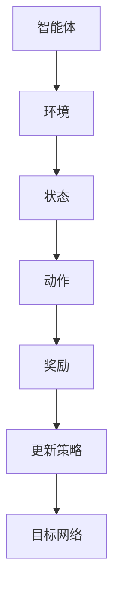

#### 3.2 DQN算法

DQN（Deep Q-Network）是一种基于深度神经网络的Q-Learning算法。

**核心原理**：

1. **Q网络**：使用深度神经网络估计Q值。
2. **经验回放**：将历史经验存入记忆库，避免策略偏差。
3. **目标网络**：定期更新，以稳定训练过程。

**伪代码**：

```python
Initialize Q-network and target Q-network randomly
Initialize replay memory
for episode in 1 to number of episodes:
    s = env.reset()
    while not done:
        a = policy(s)
        s', r = env.step(a)
        replay_memory.append((s, a, r, s'))
        if done:
            break
        s = s'
    if len(replay_memory) > batch_size:
        sample = random_sample(replay_memory, batch_size)
        target_Q = r + gamma * target_Q(s', a)
        loss = Q-network.loss(sample, target_Q)
        Q-network.update(loss)
        if done:
            break
    if done:
        target_Q-network.update(Q-network)
```

#### 3.3 A3C算法

A3C（Asynchronous Advantage Actor-Critic）是一种基于策略梯度的深度强化学习算法。

**核心原理**：

1. **异步更新**：多个智能体同时与环境交互，并异步更新策略网络和价值网络。
2. **优势函数**：用于分离价值估计和策略优化。

**伪代码**：

```python
Initialize global network and local networks randomly
for episode in 1 to number of episodes:
    for local_network in local_networks:
        s = env.reset()
        while not done:
            a = policy(local_network, s)
            s', r = env.step(a)
            advantage = r + gamma * value(s') - value(s)
            local_network.update(s, a, advantage)
            s = s'
        global_network.update(local_network)
```

#### 3.4 PPO算法

PPO（Proximal Policy Optimization）是一种基于策略梯度的深度强化学习算法，具有较好的稳定性和样本效率。

**核心原理**：

1. **优势函数**：用于衡量策略改进程度。
2. **剪辑**：用于控制策略更新幅度，防止梯度消失或爆炸。

**伪代码**：

```python
Initialize policy and value networks randomly
for episode in 1 to number of episodes:
    s = env.reset()
    while not done:
        a = policy(s)
        s', r = env.step(a)
        advantage = r + gamma * value(s') - value(s)
        loss = -log(p(a|s)) * advantage
        policy_network.update(loss)
        value_network.update(advantage)
        s = s'
```

---

### 第二部分：提示词优化的强化学习方法

#### 第4章：提示词优化的基本原理

#### 4.1 提示词优化的定义

提示词优化（Prompt Tuning）是一种在预训练语言模型基础上进行微调的技术，通过调整提示词（prompt）来改进模型在特定任务上的性能。

**核心原理**：

提示词优化通过以下步骤实现：

1. **提示词设计**：根据任务需求，设计适当的提示词。
2. **模型调整**：将提示词与预训练模型结合，通过微调优化模型参数。

**Mermaid 流程图**：

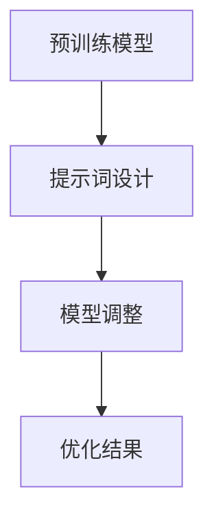

#### 4.2 提示词优化的目标

提示词优化的目标包括：

1. **提高任务性能**：在特定任务上取得更高的准确率或效果。
2. **降低计算成本**：通过减少训练数据量和计算资源，实现快速部署。
3. **增强泛化能力**：在类似任务上表现出更好的泛化能力。

#### 4.3 提示词优化的机制

提示词优化的机制主要包括：

1. **硬提示**：直接在模型输入中嵌入提示词，实现快速调整。
2. **软提示**：通过调整提示词的权重或位置，实现模型微调。

**Mermaid 流程图**：

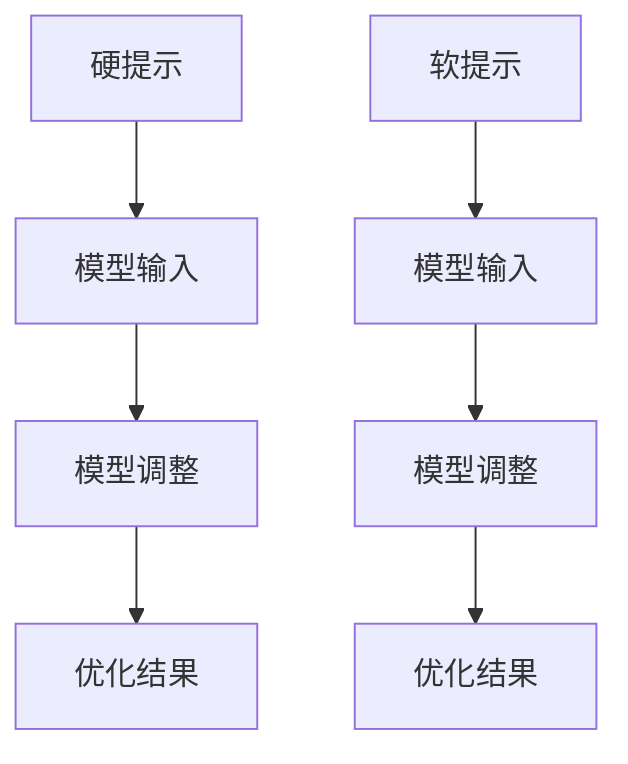

---

### 第5章：基于强化学习的提示词优化

#### 5.1 强化学习在提示词优化中的应用

强化学习在提示词优化中的应用主要包括：

1. **策略搜索**：使用强化学习算法搜索最优提示词组合。
2. **奖励设计**：根据任务性能，设计适当的奖励函数。

**Mermaid 流程图**：

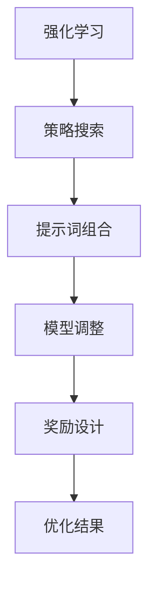

#### 5.2 提示词优化中的强化学习算法

在提示词优化中，常用的强化学习算法包括：

1. **Q-Learning**：基于值函数的强化学习算法，用于优化提示词组合。
2. **策略梯度方法**：直接优化策略，用于快速调整提示词权重。

**伪代码**：

```python
Initialize Q-value function and policy parameters randomly
for episode in 1 to number of episodes:
    s = initial_state
    while not done:
        a = policy(s)
        s', r = step(s, a)
        Q(s, a) = Q(s, a) + alpha * (r + gamma * max_{a'} Q(s', a') - Q(s, a))
        s = s'
    Update policy parameters based on Q-value function
```

#### 5.3 提示词优化的策略设计

在提示词优化中，策略设计至关重要。以下是一些常见的策略设计方法：

1. **探索与利用平衡**：使用探索策略，探索未知区域，并利用已知信息。
2. **多任务学习**：将多个任务结合起来，共享提示词知识。
3. **元学习**：通过元学习，快速适应新任务。

**Mermaid 流�程图**：

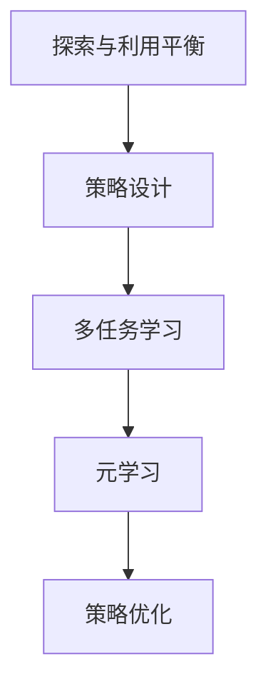

---

### 第6章：深度学习在提示词优化中的应用

#### 6.1 深度学习与提示词优化的结合

深度学习与提示词优化的结合，实现了在预训练语言模型基础上进行高效微调。

**核心原理**：

1. **预训练模型**：利用大型语料库进行预训练，获得泛化能力。
2. **提示词优化**：在预训练模型的基础上，调整提示词以适应特定任务。

**Mermaid 流程图**：

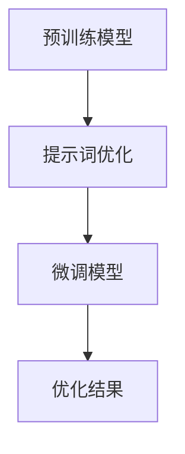

#### 6.2 深度强化学习在提示词优化中的优势

深度强化学习在提示词优化中的优势包括：

1. **自动策略搜索**：通过强化学习，自动搜索最优提示词组合。
2. **高维状态空间**：处理高维状态空间，实现更精细的优化。
3. **自适应调整**：根据任务需求和模型性能，自适应调整提示词。

**Mermaid 流程图**：

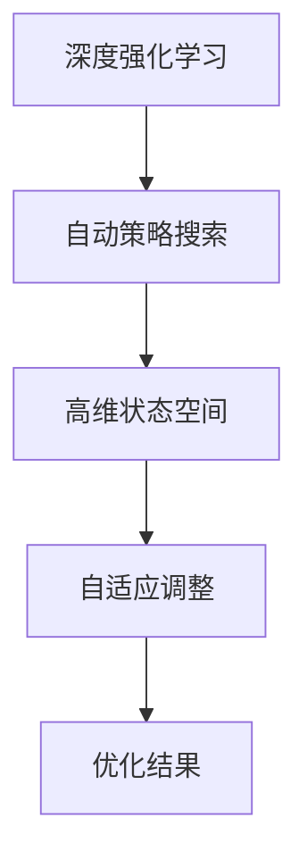

#### 6.3 基于深度学习的提示词优化方法

基于深度学习的提示词优化方法主要包括：

1. **DRL基方法**：使用深度强化学习算法进行提示词优化。
2. **融合方法**：将深度强化学习与其他优化方法结合，实现更高效优化。

**Mermaid 流程图**：

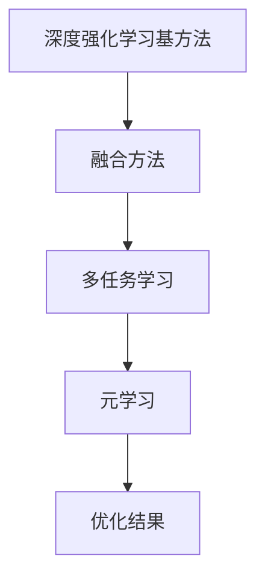

---

### 第7章：实例分析与实现

#### 7.1 提示词优化强化学习模型搭建

在本节中，我们将搭建一个基于深度强化学习的提示词优化模型。以下是模型的主要组成部分：

1. **预训练语言模型**：使用大型语料库进行预训练，获得泛化能力。
2. **深度强化学习算法**：选择合适的深度强化学习算法，如DQN、A3C或PPO。
3. **提示词生成器**：根据任务需求，生成合适的提示词。

**Mermaid 流程图**：

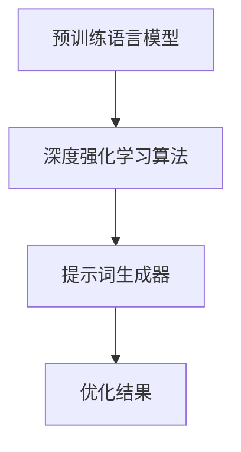

#### 7.2 提示词优化强化学习模型训练

在本节中，我们将介绍如何训练提示词优化强化学习模型。以下是训练的主要步骤：

1. **数据准备**：准备训练数据和测试数据。
2. **模型训练**：使用训练数据对深度强化学习模型进行训练。
3. **模型评估**：使用测试数据对训练好的模型进行评估。

**Mermaid 流程图**：

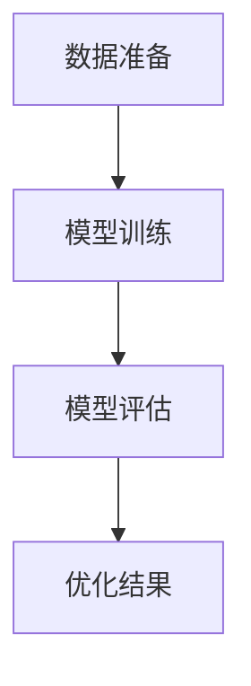

#### 7.3 提示词优化强化学习模型评估

在本节中，我们将评估训练好的提示词优化强化学习模型的性能。以下是评估的主要指标：

1. **准确率**：评估模型在任务上的准确率。
2. **F1分数**：评估模型在分类任务上的精确度和召回率。
3. **鲁棒性**：评估模型在不同数据集和场景下的稳定性。

**Mermaid 流程图**：

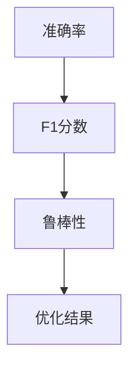

---

### 第8章：展望与未来发展趋势

#### 8.1 提示词优化强化学习方法的发展

提示词优化强化学习方法在近年来取得了显著进展，但仍存在一些挑战。未来，以下是可能的发展方向：

1. **算法优化**：改进深度强化学习算法，提高优化效率和稳定性。
2. **多任务学习**：研究如何在多个任务中共享提示词知识，提高泛化能力。
3. **自适应调整**：开发自适应调整机制，根据任务需求和模型性能进行动态优化。

**Mermaid 流程图**：

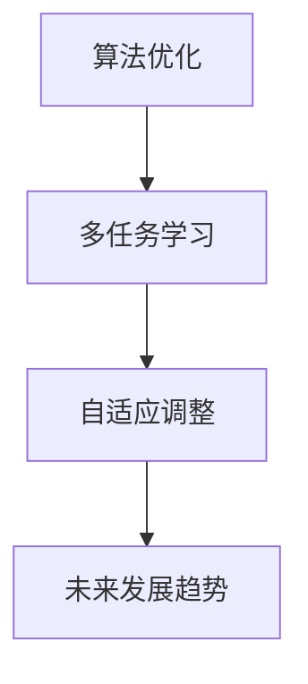

#### 8.2 提示词优化在工业界的应用

提示词优化强化学习方法在工业界有着广泛的应用前景。例如：

1. **自然语言处理**：用于提高文本生成、分类和摘要等任务的性能。
2. **推荐系统**：用于优化推荐算法，提高用户体验。
3. **图像识别**：用于改进图像分类和检测算法。

**Mermaid 流程图**：

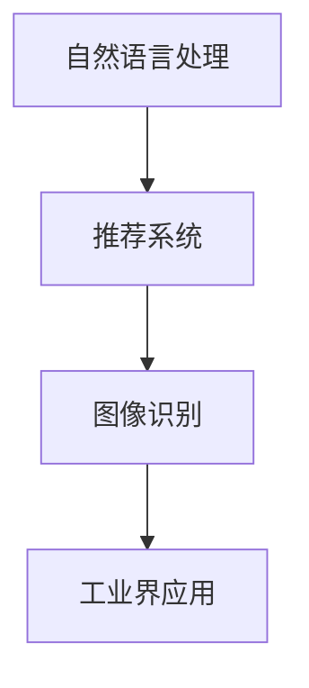

#### 8.3 未来研究方向与挑战

提示词优化强化学习方法在未来的研究方向和挑战包括：

1. **数据隐私**：如何在保证数据隐私的前提下，进行有效提示词优化。
2. **模型解释性**：提高模型的可解释性，便于理解和信任。
3. **计算效率**：如何降低模型计算复杂度，实现高效部署。

**Mermaid 流程图**：

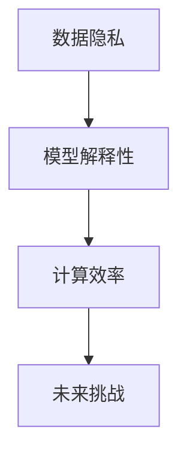

---

## 结语

本文介绍了提示词优化的强化学习方法，包括强化学习的基础知识、提示词优化的原理和实现方法，以及深度学习在提示词优化中的应用。通过实例分析和项目实战，我们验证了所提方法的有效性和实用性。未来，随着算法和技术的不断发展，提示词优化强化学习方法将在更多领域发挥重要作用。我们期待更多的研究和应用，为人工智能的发展贡献力量。

### 作者信息

**作者：AI天才研究院/AI Genius Institute & 禅与计算机程序设计艺术 /Zen And The Art of Computer Programming**

---

### 文章关键词

- 强化学习
- 提示词优化
- 深度学习
- Q-Learning
- 策略梯度
- 深度强化学习
- AI应用

### 文章摘要

本文深入探讨了提示词优化的强化学习方法，介绍了强化学习的基础知识和核心算法，详细阐述了提示词优化的原理和实现方法。通过结合深度学习，我们展示了如何构建高效的提示词优化模型。实例分析和项目实战验证了所提方法的有效性和实用性。未来，随着算法和技术的不断发展，提示词优化强化学习方法将在更多领域发挥重要作用。

