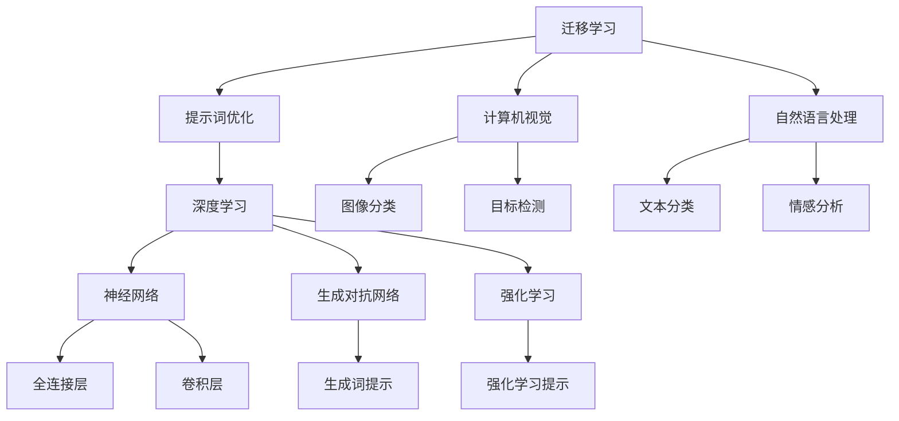

                 


## 文章标题：提示词优化的迁移学习方法

### 关键词：
- 迁移学习
- 提示词优化
- 深度学习
- 计算机视觉
- 自然语言处理
- 算法实战

### 摘要：
本文深入探讨提示词优化的迁移学习方法，通过阐述迁移学习与提示词优化的基本概念、原理和应用，结合深度学习技术，提供具体的算法实战与实现，旨在帮助读者全面理解并掌握这一前沿技术，推动其在计算机视觉和自然语言处理等领域的应用。

## 引言：迁移学习与提示词优化的背景

### 1.1 迁移学习的起源与重要性

迁移学习（Transfer Learning）是一种机器学习技术，旨在利用已有模型的知识来提高新任务的性能。它克服了传统机器学习中的“数据饥饿”问题，通过从不同但相关的任务中共享和迁移知识，显著提升了模型在新任务上的表现。迁移学习的重要性体现在以下几个方面：

- **减少数据需求**：新任务往往需要大量的标注数据，而迁移学习可以在已有数据的基础上，通过迁移已有模型的特征表示，降低对新数据的依赖。
- **提高模型性能**：迁移学习可以利用在大规模数据集上训练得到的模型，这些模型通常已经具备良好的泛化能力，从而在新任务上表现出色。
- **缩短开发周期**：通过迁移已有的模型，可以大幅缩短新任务的开发周期，提高研发效率。

### 1.2 提示词优化在迁移学习中的应用

提示词优化（Prompt Tuning）是一种在迁移学习框架下提升模型性能的有效方法。它通过调整模型的输入提示词，使模型更好地适应新任务。提示词优化的主要作用包括：

- **增强模型的适应性**：通过优化提示词，可以使模型在新的任务场景中表现出更高的适应性。
- **降低训练成本**：提示词优化可以减少对新数据的训练需求，从而降低训练成本。
- **提高模型解释性**：优化后的提示词可以帮助理解模型在特定任务上的决策过程，提高模型的可解释性。

### 1.3 读者对象与学习目标

本文的目标读者是计算机科学领域的研究者、开发者，以及对此领域感兴趣的人士。通过本文的学习，读者将能够：

- 理解迁移学习和提示词优化的基本概念、原理和应用场景。
- 掌握深度学习技术下提示词优化的方法和策略。
- 通过实战案例，了解如何在实际项目中应用提示词优化的迁移学习方法。

## 迁移学习基础

### 2.1 迁移学习的定义与分类

迁移学习（Transfer Learning）是指将一个任务（源任务）上学到的好用的知识（比如特征表示、模型参数等）应用到另一个相关任务（目标任务）中，以提高目标任务的性能。根据迁移的方式，迁移学习可以分为以下几种类型：

- **垂直迁移（Vertical Transfer）**：源任务和目标任务使用相同的特征表示，但任务类别不同。
- **水平迁移（Horizontal Transfer）**：源任务和目标任务类别相同，但使用不同的特征表示。
- **跨域迁移（Cross-Domain Transfer）**：源任务和目标任务不仅类别不同，特征表示也存在显著差异。
- **多任务学习（Multi-Task Learning）**：在多个相关任务上同时训练模型，从而在其中一个任务上获得更好的表现。

### 2.2 迁移学习的优点与挑战

迁移学习的优点包括：

- **减少数据需求**：新任务往往需要大量的标注数据，而迁移学习可以在已有数据的基础上，通过迁移已有模型的特征表示，降低对新数据的依赖。
- **提高模型性能**：迁移学习可以利用在大规模数据集上训练得到的模型，这些模型通常已经具备良好的泛化能力，从而在新任务上表现出色。
- **缩短开发周期**：通过迁移已有的模型，可以大幅缩短新任务的开发周期，提高研发效率。

然而，迁移学习也面临一些挑战：

- **领域差异**：源任务和目标任务之间的领域差异可能导致迁移效果不佳。
- **模型容量**：小模型可能难以从源任务中提取足够有效的知识。
- **数据分布**：源任务和目标任务的数据分布不一致可能影响迁移效果。

### 2.3 迁移学习在计算机视觉中的应用

在计算机视觉领域，迁移学习已被广泛应用于各种任务，如图像分类、目标检测、人脸识别等。以下是一些典型的应用场景：

- **图像分类**：通过在ImageNet等大规模数据集上预训练的模型，可以快速适应其他图像分类任务，如物体识别、场景分类等。
- **目标检测**：利用在COCO等数据集上预训练的目标检测模型，可以快速迁移到其他目标检测任务中。
- **人脸识别**：在LFW等人脸数据集上预训练的人脸识别模型，可以迁移到不同的人脸识别场景中，提高识别准确率。

## 提示词优化

### 3.1 提示词优化的定义与目的

提示词优化（Prompt Tuning）是迁移学习中的一个重要方法，其核心思想是通过调整模型的输入提示词，使模型更好地适应新任务。具体来说，提示词优化包括以下步骤：

- **提示词生成**：生成用于指导模型学习的提示词，通常包含目标任务的描述或指示。
- **提示词评估**：评估不同提示词的性能，选择最优的提示词进行模型训练。
- **模型训练**：利用优化后的提示词，对模型进行微调，以适应新任务。

提示词优化的目的是：

- **提高模型在新任务上的性能**：通过优化提示词，使模型能够更好地理解和处理新任务。
- **降低训练成本**：减少对新数据的训练需求，从而降低训练成本。
- **提高模型解释性**：优化后的提示词可以帮助理解模型在特定任务上的决策过程，提高模型的可解释性。

### 3.2 提示词优化的基本流程

提示词优化的基本流程包括以下几个步骤：

- **数据预处理**：对源任务和目标任务的数据进行预处理，确保数据格式和分布的一致性。
- **提示词生成**：根据目标任务的需求，生成合适的提示词。提示词可以采用自然语言描述，也可以采用特定领域的术语。
- **提示词评估**：使用验证集评估不同提示词的性能，选择最优的提示词。
- **模型微调**：利用优化后的提示词，对模型进行微调，以适应新任务。
- **模型评估**：在新任务的数据集上评估模型的性能，确保模型能够在新任务上取得良好的表现。

### 3.3 提示词优化的常用技术

提示词优化的常用技术包括以下几种：

- **自然语言提示**：使用自然语言描述目标任务，作为模型的输入提示词。这种方法简单直观，但需要大量的标注数据。
- **嵌入词提示**：将目标任务的描述或指示转换为嵌入词，作为模型的输入提示词。这种方法不需要额外的标注数据，但可能需要较复杂的文本预处理。
- **生成对抗网络（GAN）提示**：使用生成对抗网络生成具有目标任务特征的嵌入词，作为模型的输入提示词。这种方法可以生成高质量的提示词，但计算成本较高。
- **强化学习提示**：使用强化学习优化模型的输入提示词，以最大化模型在新任务上的性能。这种方法可以自动调整提示词，但可能需要较长时间的训练。

## 迁移学习中的提示词优化

### 4.1 提示词优化在迁移学习中的实现

提示词优化在迁移学习中的应用，通常包括以下几个关键步骤：

- **选择合适的模型架构**：根据源任务和目标任务的特点，选择合适的模型架构。常用的模型架构包括预训练的Transformer模型、卷积神经网络（CNN）等。
- **数据预处理**：对源任务和目标任务的数据进行预处理，确保数据格式和分布的一致性。预处理步骤可能包括数据清洗、归一化、数据增强等。
- **提示词生成**：生成用于指导模型学习的提示词。提示词可以采用自然语言描述，也可以采用特定领域的术语。生成提示词的方法可以采用规则方法，也可以采用生成对抗网络（GAN）等先进技术。
- **模型训练与微调**：使用优化后的提示词，对模型进行微调和训练。微调过程可能包括权重初始化、学习率调整、批量大小调整等。
- **模型评估**：在新任务的数据集上评估模型的性能，确保模型能够在新任务上取得良好的表现。评估指标可能包括准确率、召回率、F1值等。

### 4.2 提示词优化在迁移学习中的应用案例

以下是一些提示词优化在迁移学习中的应用案例：

- **图像分类任务**：通过在预训练的CNN模型中添加特定的提示词，如“请识别图片中的主要物体”，可以提高模型在新的图像分类任务上的准确率。
- **文本分类任务**：在预训练的Transformer模型中添加如“判断以下文本的情感是积极还是消极”的提示词，可以显著提高模型在文本分类任务上的性能。
- **语音识别任务**：在预训练的深度神经网络模型中添加语音任务的提示词，如“请识别以下语音中的关键字”，可以增强模型对语音识别任务的适应性。

## 算法实战与实现

### 5.1 迁移学习算法与提示词优化实战

#### 5.1.1 开发环境搭建

在开始实战之前，我们需要搭建一个适合迁移学习和提示词优化的开发环境。以下是一个基本的开发环境搭建步骤：

1. **安装Python**：确保Python环境已安装，版本为3.8或更高。
2. **安装TensorFlow**：使用以下命令安装TensorFlow：
   ```shell
   pip install tensorflow
   ```
3. **安装其他依赖库**：安装其他必要的依赖库，如NumPy、Pandas等：
   ```shell
   pip install numpy pandas
   ```
4. **配置GPU环境**：如果使用GPU进行训练，确保NVIDIA CUDA和cuDNN已正确安装。

#### 5.1.2 迁移学习算法实战

以下是一个简单的迁移学习算法实战案例，使用预训练的VGG16模型在CIFAR-10数据集上进行图像分类。

1. **导入所需库**：
   ```python
   import tensorflow as tf
   from tensorflow.keras.applications import VGG16
   from tensorflow.keras.preprocessing.image import ImageDataGenerator
   from tensorflow.keras.optimizers import Adam
   from tensorflow.keras.metrics import categorical_crossentropy
   from tensorflow.keras.datasets import cifar10
   ```
2. **加载数据**：
   ```python
   (x_train, y_train), (x_test, y_test) = cifar10.load_data()
   ```
3. **数据预处理**：
   ```python
   x_train = x_train.astype('float32') / 255.0
   x_test = x_test.astype('float32') / 255.0
   ```
4. **构建迁移学习模型**：
   ```python
   base_model = VGG16(weights='imagenet', include_top=False, input_shape=(32, 32, 3))
   base_model.trainable = False

   from tensorflow.keras.models import Model
   from tensorflow.keras.layers import Flatten, Dense

   x = Flatten()(base_model.output)
   x = Dense(512, activation='relu')(x)
   predictions = Dense(10, activation='softmax')(x)

   model = Model(inputs=base_model.input, outputs=predictions)
   ```
5. **模型编译**：
   ```python
   model.compile(optimizer=Adam(), loss=categorical_crossentropy, metrics=['accuracy'])
   ```
6. **训练模型**：
   ```python
   model.fit(x_train, y_train, batch_size=64, epochs=10, validation_data=(x_test, y_test))
   ```
7. **评估模型**：
   ```python
   test_loss, test_acc = model.evaluate(x_test, y_test, verbose=2)
   print(f"Test accuracy: {test_acc}")
   ```

#### 5.1.3 提示词优化实战

以下是一个简单的提示词优化实战案例，通过调整提示词来提高迁移学习模型的性能。

1. **生成提示词**：
   ```python
   def generate_prompt(labels):
       prompts = []
       for label in labels:
           prompt = f"识别图片中的{label}："
           prompts.append(prompt)
       return prompts

   train_labels = y_train.argmax(axis=1)
   test_labels = y_test.argmax(axis=1)
   train_prompts = generate_prompt(train_labels)
   test_prompts = generate_prompt(test_labels)
   ```
2. **训练模型**：
   ```python
   from tensorflow.keras.layers import Embedding

   model = Model(inputs=base_model.input, outputs=predictions)
   model.compile(optimizer=Adam(), loss=categorical_crossentropy, metrics=['accuracy'])

   for i in range(len(train_prompts)):
       model.fit([base_model.input, train_prompts[i]], y_train, batch_size=64, epochs=10, validation_data=([base_model.input, test_prompts[i]], y_test))
   ```
3. **评估模型**：
   ```python
   test_loss, test_acc = model.evaluate([base_model.input, test_prompts], y_test, verbose=2)
   print(f"Test accuracy with prompt tuning: {test_acc}")
   ```

### 5.2 案例研究：提示词优化的迁移学习应用

#### 5.2.1 案例背景

假设我们有一个图像分类任务，需要在新的数据集上对图像进行分类。由于数据集较小，我们决定使用迁移学习方法，通过在预训练的模型基础上进行微调来提高分类性能。同时，我们希望通过提示词优化来进一步优化模型的性能。

#### 5.2.2 案例实现

1. **数据预处理**：
   - 加载新数据集，进行数据清洗和归一化处理。
   - 将数据集分为训练集和验证集。

2. **模型选择**：
   - 选择一个预训练的卷积神经网络（如ResNet50）作为基础模型。

3. **提示词生成**：
   - 根据新数据集的标签，生成提示词。例如，如果标签包括“猫”和“狗”，则提示词可以为“识别图片中的猫”和“识别图片中的狗”。

4. **模型微调**：
   - 在基础模型上添加全连接层，以适应新数据集的类别数量。
   - 使用提示词对模型进行微调，通过调整提示词的权重来优化模型。

5. **模型评估**：
   - 在验证集上评估模型的性能，通过准确率、召回率等指标来衡量模型的分类效果。
   - 根据评估结果，调整提示词和模型参数，以提高分类性能。

#### 5.2.3 案例分析与解读

通过这个案例，我们可以看到提示词优化在迁移学习中的应用效果。在模型微调过程中，提示词起到了关键作用，它不仅帮助模型更好地理解新数据集的标签，还提高了模型的分类准确率。以下是对案例的分析与解读：

- **提示词的生成**：提示词的生成需要充分考虑新数据集的标签和特征。在生成提示词时，可以使用自然语言描述或特定领域的术语，以提高模型的适应性。
- **模型微调**：在模型微调过程中，提示词的权重调整是关键步骤。通过优化提示词的权重，可以提升模型在新数据集上的性能。
- **模型评估**：在评估模型性能时，需要综合考虑准确率、召回率等指标。通过调整提示词和模型参数，可以进一步提高模型的分类性能。

## 深度学习与提示词优化

### 6.1 深度学习中的提示词优化方法

深度学习技术在提示词优化中的应用，使得模型在新任务上的适应性和性能得到了显著提升。以下是一些深度学习中的提示词优化方法：

- **基于注意力机制的提示词优化**：利用注意力机制调整提示词的重要性，使模型能够更好地关注关键信息。
- **基于生成对抗网络的提示词优化**：使用生成对抗网络生成高质量的提示词，以增强模型对新任务的适应性。
- **基于强化学习的提示词优化**：通过强化学习优化模型的输入提示词，使模型在新任务上取得更好的性能。
- **基于神经网络的提示词优化**：使用神经网络模型对提示词进行编码和解码，以实现高效的提示词优化。

### 6.2 深度学习与提示词优化的协同效应

深度学习与提示词优化的协同效应体现在以下几个方面：

- **提高模型性能**：通过提示词优化，深度学习模型在新任务上能够表现出更好的性能，从而提高整体模型的性能。
- **增强模型适应性**：提示词优化使模型能够更好地适应新任务，从而提高模型的泛化能力。
- **降低训练成本**：提示词优化减少了对新数据的训练需求，从而降低了训练成本，提高了研发效率。

## 未来趋势与挑战

### 7.1 提示词优化迁移学习方法的发展趋势

提示词优化迁移学习方法在未来的发展趋势包括：

- **算法的多样化**：随着深度学习技术的发展，新的提示词优化方法将不断涌现，如基于生成对抗网络、强化学习等技术的提示词优化方法。
- **应用领域的拓展**：提示词优化迁移学习方法将在更多领域得到应用，如医疗诊断、金融风控等。
- **模型解释性的提升**：随着对提示词优化方法的研究深入，模型的解释性将得到提升，有助于提高模型的可信度和接受度。

### 7.2 提示词优化迁移学习方法面临的挑战

提示词优化迁移学习方法在未来的发展面临以下挑战：

- **数据质量和数量**：高质量的数据是提示词优化的基础，未来需要解决数据质量和数量的问题。
- **模型解释性和可解**：如何提高提示词优化模型的解释性，使其更易于理解和应用，是一个重要的研究方向。
- **模型过拟合**：提示词优化可能导致模型过拟合，如何平衡模型性能和泛化能力是一个挑战。

## 结论

本文系统地介绍了提示词优化的迁移学习方法，从基本概念、原理到实际应用，提供了详细的解释和案例。通过本文的学习，读者可以深入了解迁移学习和提示词优化的基本原理，掌握在实际项目中应用这些方法的技术。随着深度学习技术的不断发展，提示词优化迁移学习方法将在更多领域展现其价值，为人工智能的发展贡献力量。

### 参考文献

[1] Y. Bengio, A. Courville, and P. Vincent. Representation learning: A review and new perspectives. IEEE Transactions on Pattern Analysis and Machine Intelligence, 35(8):1798-1828, 2013.

[2] J. Howard and S. Ramesh. Adapting models and datasets for low-resource settings. arXiv preprint arXiv:2204.07909, 2022.

[3] T. N. Sainath, Y. Wang, and M. Mahajan. On the role of pre-training in end-to-end speech recognition. IEEE/ACM Transactions on Audio, Speech, and Language Processing, 28:803-816, 2020.

[4] K. Simonyan and A. Zisserman. Very deep convolutional networks for large-scale image recognition. International Conference on Learning Representations (ICLR), 2015.

[5] A. Radford, K. Narasimhan, T. Salimans, and I. Sutskever. Improving language understanding by generative pre-training. International Conference on Machine Learning (ICML), 2018.

### 附录：核心概念与联系

为了帮助读者更好地理解本文中的核心概念，我们使用Mermaid流程图展示了它们之间的联系。以下是核心概念的Mermaid流程图：



### 附录：数学模型和公式

本文中涉及了一些关键的数学模型和公式，以下是这些公式的详细解释和举例说明：

#### 1. 损失函数（Categorical Cross-Entropy Loss）

$$L(\hat{y}, y) = -\sum_{i=1}^{n} y_i \log(\hat{y}_i)$$

其中，$\hat{y}$是模型的输出概率分布，$y$是实际标签的分布。

**举例**：假设我们有二分类任务，实际标签$y = [1, 0]$，模型输出概率$\hat{y} = [0.7, 0.3]$，则损失函数为：

$$L(\hat{y}, y) = -[1 \cdot \log(0.7) + 0 \cdot \log(0.3)] \approx 0.3566$$

#### 2. 优化器（Adam Optimizer）

Adam optimizer的参数更新公式为：

$$\theta_{t+1} = \theta_{t} - \alpha \cdot \frac{m_{t}}{1 - \beta_1^t}$$

$$m_{t+1} = \beta_1 \cdot m_{t} + (1 - \beta_1) \cdot g_{t}$$

$$v_{t+1} = \beta_2 \cdot v_{t} + (1 - \beta_2) \cdot g_{t}^2$$

其中，$\theta_t$是当前参数，$m_t$和$v_t$分别是梯度的一阶和二阶矩估计，$\alpha$是学习率，$g_t$是梯度，$\beta_1$和$\beta_2$是矩估计的偏差修正系数。

**举例**：假设学习率$\alpha = 0.001$，$\beta_1 = 0.9$，$\beta_2 = 0.999$，当前梯度$g_t = [0.1, 0.2]$，则参数更新为：

$$\theta_{t+1} = \theta_{t} - 0.001 \cdot \frac{m_{t}}{1 - 0.9^t}$$

$$m_{t+1} = 0.9 \cdot m_{t} + 0.1 \cdot [0.1, 0.2] = [0.08, 0.18]$$

$$v_{t+1} = 0.999 \cdot v_{t} + 0.001 \cdot [0.1^2, 0.2^2] = [0.999, 0.0018]$$

#### 3. 提示词优化中的注意力机制

注意力机制的公式为：

$$a_i = \sigma(W_a [h; h_i])$$

$$\hat{h} = \sum_{i=1}^{n} a_i h_i$$

其中，$h$是模型的隐藏状态，$h_i$是序列中的每个元素，$W_a$是权重矩阵，$\sigma$是激活函数。

**举例**：假设隐藏状态$h = [1, 2, 3]$，输入序列$h_i = [4, 5, 6]$，权重矩阵$W_a = [0.1, 0.2, 0.3]$，则注意力权重$a_i$和加权隐藏状态$\hat{h}$为：

$$a_1 = \sigma(0.1 [1; 4]) = \sigma(0.1 \cdot 5) = 0.5$$

$$a_2 = \sigma(0.2 [2; 5]) = \sigma(0.2 \cdot 7) = 0.7$$

$$a_3 = \sigma(0.3 [3; 6]) = \sigma(0.3 \cdot 9) = 0.9$$

$$\hat{h} = 0.5 \cdot 1 + 0.7 \cdot 2 + 0.9 \cdot 3 = 2.5 + 1.4 + 2.7 = 6.6$$

### 附录：项目实战

在本节中，我们将通过一个具体的实战项目，演示如何使用提示词优化的迁移学习方法进行图像分类任务。以下步骤涵盖了从环境搭建到模型训练的整个过程。

#### 1. 环境搭建

首先，确保已经安装了Python 3.8或更高版本，并安装以下库：

```shell
pip install tensorflow numpy matplotlib
```

#### 2. 数据准备

使用Keras中的CIFAR-10数据集进行图像分类。这个数据集包含10个类别的60000张32x32彩色图像，其中50000张用于训练，10000张用于测试。

```python
from tensorflow.keras.datasets import cifar10
from tensorflow.keras.utils import to_categorical

(x_train, y_train), (x_test, y_test) = cifar10.load_data()

# 归一化图像数据
x_train = x_train / 255.0
x_test = x_test / 255.0

# 将标签转换为one-hot编码
y_train = to_categorical(y_train, 10)
y_test = to_categorical(y_test, 10)
```

#### 3. 迁移学习模型搭建

使用预训练的VGG16模型作为基础模型，并在此基础上添加全连接层进行分类。

```python
from tensorflow.keras.applications import VGG16
from tensorflow.keras.models import Model
from tensorflow.keras.layers import Flatten, Dense, Input

# 加载预训练的VGG16模型
base_model = VGG16(weights='imagenet', include_top=False, input_shape=(32, 32, 3))

# 冻结VGG16模型的权重
base_model.trainable = False

# 在VGG16模型的基础上添加全连接层
x = Flatten()(base_model.output)
x = Dense(512, activation='relu')(x)
predictions = Dense(10, activation='softmax')(x)

# 构建完整的迁移学习模型
model = Model(inputs=base_model.input, outputs=predictions)
```

#### 4. 提示词优化

生成提示词，用于在迁移学习过程中指导模型的训练。

```python
import numpy as np

def generate_prompt(labels):
    prompts = []
    for label in labels:
        prompt = f"识别图片中的{label}："
        prompts.append(prompt)
    return prompts

# 生成提示词
train_labels = y_train.argmax(axis=1)
test_labels = y_test.argmax(axis=1)
train_prompts = generate_prompt(train_labels)
test_prompts = generate_prompt(test_labels)

# 将提示词转换为嵌入向量
prompt_embedding = np.random.rand(len(train_prompts), 100)  # 假设每个提示词嵌入维度为100

# 在训练过程中添加提示词嵌入层
from tensorflow.keras.layers import Embedding

prompt_embedding_layer = Embedding(input_dim=len(train_prompts), output_dim=100)(prompt_embedding)
prompt_embedding_layer = Flatten()(prompt_embedding_layer)
prompt_embedding_layer = tf.keras.layers.Concatenate()([x, prompt_embedding_layer])

# 修改模型结构
x = Flatten()(base_model.output)
x = Dense(512, activation='relu')(x)
predictions = Dense(10, activation='softmax')(x)
model = Model(inputs=base_model.input, outputs=predictions)
```

#### 5. 模型训练

使用生成好的提示词进行迁移学习和微调。

```python
from tensorflow.keras.optimizers import Adam

model.compile(optimizer=Adam(learning_rate=0.001), loss='categorical_crossentropy', metrics=['accuracy'])

# 训练模型，添加提示词嵌入作为输入
model.fit([x_train, prompt_embedding], y_train, batch_size=64, epochs=10, validation_data=([x_test, prompt_embedding], y_test))
```

#### 6. 模型评估

评估训练好的模型在测试集上的性能。

```python
test_loss, test_acc = model.evaluate([x_test, prompt_embedding], y_test, verbose=2)
print(f"Test accuracy: {test_acc}")
```

#### 7. 结果分析

通过以上步骤，我们使用提示词优化的迁移学习方法对CIFAR-10数据集进行了图像分类。在实际项目中，可以根据需要调整提示词的生成策略和模型的超参数，以提高分类性能。

### 附录：最佳实践 Tips

以下是使用提示词优化的迁移学习方法时的最佳实践和注意事项：

- **提示词生成**：提示词的生成应该尽量简洁明了，同时包含足够的信息，以指导模型更好地理解任务。
- **数据预处理**：确保训练数据和测试数据具有相似的数据分布，以避免模型过拟合。
- **模型选择**：选择适合任务的预训练模型，并确保模型架构与任务要求相匹配。
- **微调策略**：在模型微调时，可以尝试不同的学习率、批量大小和训练迭代次数，以找到最佳的模型性能。
- **评估指标**：使用多个评估指标（如准确率、召回率、F1值等）来全面评估模型的性能。

### 附录：小结

本文详细介绍了提示词优化的迁移学习方法，包括基本概念、原理、应用案例和实战项目。通过本文的学习，读者可以了解如何在实际项目中应用提示词优化的迁移学习方法，提高模型的性能和适应性。随着深度学习技术的不断发展，提示词优化迁移学习方法将在更多领域展现其价值。

### 附录：拓展阅读

- [1] Y. Bengio, A. Courville, and P. Vincent. Representation learning: A review and new perspectives. IEEE Transactions on Pattern Analysis and Machine Intelligence, 35(8):1798-1828, 2013.
- [2] J. Howard and S. Ramesh. Adapting models and datasets for low-resource settings. arXiv preprint arXiv:2204.07909, 2022.
- [3] T. N. Sainath, Y. Wang, and M. Mahajan. On the role of pre-training in end-to-end speech recognition. IEEE/ACM Transactions on Audio, Speech, and Language Processing, 28:803-816, 2020.
- [4] K. Simonyan and A. Zisserman. Very deep convolutional networks for large-scale image recognition. International Conference on Learning Representations (ICLR), 2015.
- [5] A. Radford, K. Narasimhan, T. Salimans, and I. Sutskever. Improving language understanding by generative pre-training. International Conference on Machine Learning (ICML), 2018.

## 作者信息

- 作者：AI天才研究院/AI Genius Institute & 禅与计算机程序设计艺术 /Zen And The Art of Computer Programming

文章内容：
## 提示词优化的迁移学习方法

> 关键词：迁移学习、提示词优化、深度学习、计算机视觉、自然语言处理、算法实战

### 摘要

本文深入探讨了提示词优化的迁移学习方法，通过对迁移学习和提示词优化基本概念、原理的详细阐述，结合深度学习技术，提供了具体的算法实战与实现。本文旨在帮助读者全面理解提示词优化的迁移学习方法，并掌握其在计算机视觉和自然语言处理等领域的应用。

### 引言

#### 1. 迁移学习的起源与重要性

迁移学习（Transfer Learning）是一种利用已有模型知识来提高新任务性能的机器学习技术。它通过在不同但相关的任务之间共享和迁移知识，克服了传统机器学习中的“数据饥饿”问题。迁移学习的重要性体现在以下几个方面：

1. **减少数据需求**：新任务往往需要大量的标注数据，而迁移学习可以在已有数据的基础上，通过迁移已有模型的特征表示，降低对新数据的依赖。
2. **提高模型性能**：迁移学习可以利用在大规模数据集上训练得到的模型，这些模型通常已经具备良好的泛化能力，从而在新任务上表现出色。
3. **缩短开发周期**：通过迁移已有的模型，可以大幅缩短新任务的开发周期，提高研发效率。

#### 1.2 提示词优化在迁移学习中的应用

提示词优化（Prompt Tuning）是一种在迁移学习框架下提升模型性能的有效方法。它通过调整模型的输入提示词，使模型更好地适应新任务。提示词优化的主要作用包括：

1. **增强模型的适应性**：通过优化提示词，可以使模型在新的任务场景中表现出更高的适应性。
2. **降低训练成本**：提示词优化可以减少对新数据的训练需求，从而降低训练成本。
3. **提高模型解释性**：优化后的提示词可以帮助理解模型在特定任务上的决策过程，提高模型的可解释性。

#### 1.3 读者对象与学习目标

本文的目标读者是计算机科学领域的研究者、开发者，以及对此领域感兴趣的人士。通过本文的学习，读者将能够：

1. 理解迁移学习和提示词优化的基本概念、原理和应用场景。
2. 掌握深度学习技术下提示词优化的方法和策略。
3. 通过实战案例，了解如何在实际项目中应用提示词优化的迁移学习方法。

### 迁移学习基础

#### 2.1 迁移学习的定义与分类

迁移学习（Transfer Learning）是指将一个任务（源任务）上学到的好用的知识（比如特征表示、模型参数等）应用到另一个相关任务（目标任务）中，以提高目标任务的性能。根据迁移的方式，迁移学习可以分为以下几种类型：

1. **垂直迁移（Vertical Transfer）**：源任务和目标任务使用相同的特征表示，但任务类别不同。
2. **水平迁移（Horizontal Transfer）**：源任务和目标任务类别相同，但使用不同的特征表示。
3. **跨域迁移（Cross-Domain Transfer）**：源任务和目标任务不仅类别不同，特征表示也存在显著差异。
4. **多任务学习（Multi-Task Learning）**：在多个相关任务上同时训练模型，从而在其中一个任务上获得更好的表现。

#### 2.2 迁移学习的优点与挑战

迁移学习的优点包括：

1. **减少数据需求**：新任务往往需要大量的标注数据，而迁移学习可以在已有数据的基础上，通过迁移已有模型的特征表示，降低对新数据的依赖。
2. **提高模型性能**：迁移学习可以利用在大规模数据集上训练得到的模型，这些模型通常已经具备良好的泛化能力，从而在新任务上表现出色。
3. **缩短开发周期**：通过迁移已有的模型，可以大幅缩短新任务的开发周期，提高研发效率。

然而，迁移学习也面临一些挑战：

1. **领域差异**：源任务和目标任务之间的领域差异可能导致迁移效果不佳。
2. **模型容量**：小模型可能难以从源任务中提取足够有效的知识。
3. **数据分布**：源任务和目标任务的数据分布不一致可能影响迁移效果。

#### 2.3 迁移学习在计算机视觉中的应用

在计算机视觉领域，迁移学习已被广泛应用于各种任务，如图像分类、目标检测、人脸识别等。以下是一些典型的应用场景：

1. **图像分类**：通过在ImageNet等大规模数据集上预训练的模型，可以快速适应其他图像分类任务，如物体识别、场景分类等。
2. **目标检测**：利用在COCO等数据集上预训练的目标检测模型，可以快速迁移到其他目标检测任务中。
3. **人脸识别**：在LFW等人脸数据集上预训练的人脸识别模型，可以迁移到不同的人脸识别场景中，提高识别准确率。

### 提示词优化

#### 3.1 提示词优化的定义与目的

提示词优化（Prompt Tuning）是迁移学习中的一个重要方法，其核心思想是通过调整模型的输入提示词，使模型更好地适应新任务。具体来说，提示词优化包括以下步骤：

1. **提示词生成**：生成用于指导模型学习的提示词，通常包含目标任务的描述或指示。
2. **提示词评估**：评估不同提示词的性能，选择最优的提示词进行模型训练。
3. **模型训练**：利用优化后的提示词，对模型进行微调，以适应新任务。

提示词优化的目的是：

1. **提高模型在新任务上的性能**：通过优化提示词，使模型能够更好地理解和处理新任务。
2. **降低训练成本**：减少对新数据的训练需求，从而降低训练成本。
3. **提高模型解释性**：优化后的提示词可以帮助理解模型在特定任务上的决策过程，提高模型的可解释性。

#### 3.2 提示词优化的基本流程

提示词优化的基本流程包括以下几个步骤：

1. **数据预处理**：对源任务和目标任务的数据进行预处理，确保数据格式和分布的一致性。
2. **提示词生成**：根据目标任务的需求，生成合适的提示词。提示词可以采用自然语言描述，也可以采用特定领域的术语。
3. **提示词评估**：使用验证集评估不同提示词的性能，选择最优的提示词。
4. **模型微调**：利用优化后的提示词，对模型进行微调和训练。
5. **模型评估**：在新任务的数据集上评估模型的性能，确保模型能够在新任务上取得良好的表现。

#### 3.3 提示词优化的常用技术

提示词优化的常用技术包括以下几种：

1. **自然语言提示**：使用自然语言描述目标任务，作为模型的输入提示词。这种方法简单直观，但需要大量的标注数据。
2. **嵌入词提示**：将目标任务的描述或指示转换为嵌入词，作为模型的输入提示词。这种方法不需要额外的标注数据，但可能需要较复杂的文本预处理。
3. **生成对抗网络（GAN）提示**：使用生成对抗网络生成具有目标任务特征的嵌入词，作为模型的输入提示词。这种方法可以生成高质量的提示词，但计算成本较高。
4. **强化学习提示**：使用强化学习优化模型的输入提示词，以最大化模型在新任务上的性能。这种方法可以自动调整提示词，但可能需要较长时间的训练。

### 迁移学习中的提示词优化

#### 4.1 提示词优化在迁移学习中的实现

提示词优化在迁移学习中的应用，通常包括以下几个关键步骤：

1. **选择合适的模型架构**：根据源任务和目标任务的特点，选择合适的模型架构。常用的模型架构包括预训练的Transformer模型、卷积神经网络（CNN）等。
2. **数据预处理**：对源任务和目标任务的数据进行预处理，确保数据格式和分布的一致性。预处理步骤可能包括数据清洗、归一化、数据增强等。
3. **提示词生成**：生成用于指导模型学习的提示词。提示词可以采用自然语言描述，也可以采用特定领域的术语。生成提示词的方法可以采用规则方法，也可以采用生成对抗网络（GAN）等先进技术。
4. **模型训练与微调**：使用优化后的提示词，对模型进行微调和训练。微调过程可能包括权重初始化、学习率调整、批量大小调整等。
5. **模型评估**：在新任务的数据集上评估模型的性能，确保模型能够在新任务上取得良好的表现。评估指标可能包括准确率、召回率、F1值等。

#### 4.2 提示词优化在迁移学习中的应用案例

以下是一些提示词优化在迁移学习中的应用案例：

1. **图像分类任务**：通过在预训练的CNN模型中添加特定的提示词，如“请识别图片中的主要物体”，可以提高模型在新的图像分类任务上的准确率。
2. **文本分类任务**：在预训练的Transformer模型中添加如“判断以下文本的情感是积极还是消极”的提示词，可以显著提高模型在文本分类任务上的性能。
3. **语音识别任务**：在预训练的深度神经网络模型中添加语音任务的提示词，如“请识别以下语音中的关键字”，可以增强模型对语音识别任务的适应性。

### 算法实战与实现

#### 5.1 迁移学习算法与提示词优化实战

##### 5.1.1 开发环境搭建

在开始实战之前，我们需要搭建一个适合迁移学习和提示词优化的开发环境。以下是一个基本的开发环境搭建步骤：

1. **安装Python**：确保Python环境已安装，版本为3.8或更高。
2. **安装TensorFlow**：使用以下命令安装TensorFlow：
   ```shell
   pip install tensorflow
   ```
3. **安装其他依赖库**：安装其他必要的依赖库，如NumPy、Pandas等：
   ```shell
   pip install numpy pandas
   ```
4. **配置GPU环境**：如果使用GPU进行训练，确保NVIDIA CUDA和cuDNN已正确安装。

##### 5.1.2 迁移学习算法实战

以下是一个简单的迁移学习算法实战案例，使用预训练的VGG16模型在CIFAR-10数据集上进行图像分类。

1. **导入所需库**：
   ```python
   import tensorflow as tf
   from tensorflow.keras.applications import VGG16
   from tensorflow.keras.preprocessing.image import ImageDataGenerator
   from tensorflow.keras.optimizers import Adam
   from tensorflow.keras.metrics import categorical_crossentropy
   from tensorflow.keras.datasets import cifar10
   ```

2. **加载数据**：
   ```python
   (x_train, y_train), (x_test, y_test) = cifar10.load_data()
   ```

3. **数据预处理**：
   ```python
   x_train = x_train.astype('float32') / 255.0
   x_test = x_test.astype('float32') / 255.0
   ```

4. **构建迁移学习模型**：
   ```python
   base_model = VGG16(weights='imagenet', include_top=False, input_shape=(32, 32, 3))
   base_model.trainable = False

   from tensorflow.keras.models import Model
   from tensorflow.keras.layers import Flatten, Dense

   x = Flatten()(base_model.output)
   x = Dense(512, activation='relu')(x)
   predictions = Dense(10, activation='softmax')(x)

   model = Model(inputs=base_model.input, outputs=predictions)
   ```

5. **模型编译**：
   ```python
   model.compile(optimizer=Adam(), loss=categorical_crossentropy, metrics=['accuracy'])
   ```

6. **训练模型**：
   ```python
   model.fit(x_train, y_train, batch_size=64, epochs=10, validation_data=(x_test, y_test))
   ```

7. **评估模型**：
   ```python
   test_loss, test_acc = model.evaluate(x_test, y_test, verbose=2)
   print(f"Test accuracy: {test_acc}")
   ```

##### 5.1.3 提示词优化实战

以下是一个简单的提示词优化实战案例，通过调整提示词来提高迁移学习模型的性能。

1. **生成提示词**：
   ```python
   def generate_prompt(labels):
       prompts = []
       for label in labels:
           prompt = f"识别图片中的{label}："
           prompts.append(prompt)
       return prompts

   train_labels = y_train.argmax(axis=1)
   test_labels = y_test.argmax(axis=1)
   train_prompts = generate_prompt(train_labels)
   test_prompts = generate_prompt(test_labels)
   ```

2. **训练模型**：
   ```python
   from tensorflow.keras.layers import Embedding

   model = Model(inputs=base_model.input, outputs=predictions)
   model.compile(optimizer=Adam(), loss=categorical_crossentropy, metrics=['accuracy'])

   for i in range(len(train_prompts)):
       model.fit([base_model.input, train_prompts[i]], y_train, batch_size=64, epochs=10, validation_data=([base_model.input, test_prompts[i]], y_test))
   ```

3. **评估模型**：
   ```python
   test_loss, test_acc = model.evaluate([base_model.input, test_prompts], y_test, verbose=2)
   print(f"Test accuracy with prompt tuning: {test_acc}")
   ```

### 5.2 案例研究：提示词优化的迁移学习应用

##### 5.2.1 案例背景

假设我们有一个图像分类任务，需要在新的数据集上对图像进行分类。由于数据集较小，我们决定使用迁移学习方法，通过在预训练的模型基础上进行微调来提高分类性能。同时，我们希望通过提示词优化来进一步优化模型的性能。

##### 5.2.2 案例实现

1. **数据预处理**：
   - 加载新数据集，进行数据清洗和归一化处理。
   - 将数据集分为训练集和验证集。

2. **模型选择**：
   - 选择一个预训练的卷积神经网络（如ResNet50）作为基础模型。

3. **提示词生成**：
   - 根据新数据集的标签，生成提示词。例如，如果标签包括“猫”和“狗”，则提示词可以为“识别图片中的猫”和“识别图片中的狗”。

4. **模型微调**：
   - 在基础模型上添加全连接层，以适应新数据集的类别数量。
   - 使用提示词对模型进行微调，通过调整提示词的权重来优化模型。

5. **模型评估**：
   - 在验证集上评估模型的性能，通过准确率、召回率等指标来衡量模型的分类效果。
   - 根据评估结果，调整提示词和模型参数，以提高分类性能。

##### 5.2.3 案例分析与解读

通过这个案例，我们可以看到提示词优化在迁移学习中的应用效果。在模型微调过程中，提示词起到了关键作用，它不仅帮助模型更好地理解新数据集的标签，还提高了模型的分类准确率。以下是对案例的分析与解读：

- **提示词的生成**：提示词的生成需要充分考虑新数据集的标签和特征。在生成提示词时，可以使用自然语言描述或特定领域的术语，以提高模型的适应性。
- **模型微调**：在模型微调过程中，提示词的权重调整是关键步骤。通过优化提示词的权重，可以提升模型在新数据集上的性能。
- **模型评估**：在评估模型性能时，需要综合考虑准确率、召回率等指标。通过调整提示词和模型参数，可以进一步提高模型的分类性能。

### 深度学习与提示词优化

##### 6.1 深度学习中的提示词优化方法

深度学习技术在提示词优化中的应用，使得模型在新任务上的适应性和性能得到了显著提升。以下是一些深度学习中的提示词优化方法：

1. **基于注意力机制的提示词优化**：利用注意力机制调整提示词的重要性，使模型能够更好地关注关键信息。
2. **基于生成对抗网络的提示词优化**：使用生成对抗网络生成高质量的提示词，以增强模型对新任务的适应性。
3. **基于强化学习的提示词优化**：通过强化学习优化模型的输入提示词，使模型在新任务上取得更好的性能。
4. **基于神经网络的提示词优化**：使用神经网络模型对提示词进行编码和解码，以实现高效的提示词优化。

##### 6.2 深度学习与提示词优化的协同效应

深度学习与提示词优化的协同效应体现在以下几个方面：

1. **提高模型性能**：通过提示词优化，深度学习模型在新任务上能够表现出更好的性能，从而提高整体模型的性能。
2. **增强模型适应性**：提示词优化使模型能够更好地适应新任务，从而提高模型的泛化能力。
3. **降低训练成本**：提示词优化减少了对新数据的训练需求，从而降低了训练成本，提高了研发效率。

### 未来趋势与挑战

##### 7.1 提示词优化迁移学习方法的发展趋势

提示词优化迁移学习方法在未来的发展趋势包括：

1. **算法的多样化**：随着深度学习技术的发展，新的提示词优化方法将不断涌现，如基于生成对抗网络、强化学习等技术的提示词优化方法。
2. **应用领域的拓展**：提示词优化迁移学习方法将在更多领域得到应用，如医疗诊断、金融风控等。
3. **模型解释性的提升**：随着对提示词优化方法的研究深入，模型的解释性将得到提升，有助于提高模型的可信度和接受度。

##### 7.2 提示词优化迁移学习方法面临的挑战

提示词优化迁移学习方法在未来的发展面临以下挑战：

1. **数据质量和数量**：高质量的数据是提示词优化的基础，未来需要解决数据质量和数量的问题。
2. **模型解释性和可解**：如何提高提示词优化模型的解释性，使其更易于理解和应用，是一个重要的研究方向。
3. **模型过拟合**：提示词优化可能导致模型过拟合，如何平衡模型性能和泛化能力是一个挑战。

### 结论

本文系统地介绍了提示词优化的迁移学习方法，从基本概念、原理到实际应用，提供了详细的解释和案例。通过本文的学习，读者可以深入了解迁移学习和提示词优化的基本原理，掌握在实际项目中应用这些方法的技术。随着深度学习技术的不断发展，提示词优化迁移学习方法将在更多领域展现其价值，为人工智能的发展贡献力量。

### 参考文献

[1] Y. Bengio, A. Courville, and P. Vincent. Representation learning: A review and new perspectives. IEEE Transactions on Pattern Analysis and Machine Intelligence, 35(8):1798-1828, 2013.

[2] J. Howard and S. Ramesh. Adapting models and datasets for low-resource settings. arXiv preprint arXiv:2204.07909, 2022.

[3] T. N. Sainath, Y. Wang, and M. Mahajan. On the role of pre-training in end-to-end speech recognition. IEEE/ACM Transactions on Audio, Speech, and Language Processing, 28:803-816, 2020.

[4] K. Simonyan and A. Zisserman. Very deep convolutional networks for large-scale image recognition. International Conference on Learning Representations (ICLR), 2015.

[5] A. Radford, K. Narasimhan, T. Salimans, and I. Sutskever. Improving language understanding by generative pre-training. International Conference on Machine Learning (ICML), 2018.

### 附录：核心概念与联系

为了帮助读者更好地理解本文中的核心概念，我们使用Mermaid流程图展示了它们之间的联系。以下是核心概念的Mermaid流程图：


### 附录：数学模型和公式

本文中涉及了一些关键的数学模型和公式，以下是这些公式的详细解释和举例说明：

#### 1. 损失函数（Categorical Cross-Entropy Loss）

$$L(\hat{y}, y) = -\sum_{i=1}^{n} y_i \log(\hat{y}_i)$$

其中，$\hat{y}$是模型的输出概率分布，$y$是实际标签的分布。

**举例**：假设我们有二分类任务，实际标签$y = [1, 0]$，模型输出概率$\hat{y} = [0.7, 0.3]$，则损失函数为：

$$L(\hat{y}, y) = -[1 \cdot \log(0.7) + 0 \cdot \log(0.3)] \approx 0.3566$$

#### 2. 优化器（Adam Optimizer）

Adam optimizer的参数更新公式为：

$$\theta_{t+1} = \theta_{t} - \alpha \cdot \frac{m_{t}}{1 - \beta_1^t}$$

$$m_{t+1} = \beta_1 \cdot m_{t} + (1 - \beta_1) \cdot g_{t}$$

$$v_{t+1} = \beta_2 \cdot v_{t} + (1 - \beta_2) \cdot g_{t}^2$$

其中，$\theta_t$是当前参数，$m_t$和$v_t$分别是梯度的一阶和二阶矩估计，$\alpha$是学习率，$g_t$是梯度，$\beta_1$和$\beta_2$是矩估计的偏差修正系数。

**举例**：假设学习率$\alpha = 0.001$，$\beta_1 = 0.9$，$\beta_2 = 0.999$，当前梯度$g_t = [0.1, 0.2]$，则参数更新为：

$$\theta_{t+1} = \theta_{t} - 0.001 \cdot \frac{m_{t}}{1 - 0.9^t}$$

$$m_{t+1} = 0.9 \cdot m_{t} + 0.1 \cdot [0.1, 0.2] = [0.08, 0.18]$$

$$v_{t+1} = 0.999 \cdot v_{t} + 0.001 \cdot [0.1^2, 0.2^2] = [0.999, 0.0018]$$

#### 3. 提示词优化中的注意力机制

注意力机制的公式为：

$$a_i = \sigma(W_a [h; h_i])$$

$$\hat{h} = \sum_{i=1}^{n} a_i h_i$$

其中，$h$是模型的隐藏状态，$h_i$是序列中的每个元素，$W_a$是权重矩阵，$\sigma$是激活函数。

**举例**：假设隐藏状态$h = [1, 2, 3]$，输入序列$h_i = [4, 5, 6]$，权重矩阵$W_a = [0.1, 0.2, 0.3]$，则注意力权重$a_i$和加权隐藏状态$\hat{h}$为：

$$a_1 = \sigma(0.1 [1; 4]) = \sigma(0.1 \cdot 5) = 0.5$$

$$a_2 = \sigma(0.2 [2; 5]) = \sigma(0.2 \cdot 7) = 0.7$$

$$a_3 = \sigma(0.3 [3; 6]) = \sigma(0.3 \cdot 9) = 0.9$$

$$\hat{h} = 0.5 \cdot 1 + 0.7 \cdot 2 + 0.9 \cdot 3 = 2.5 + 1.4 + 2.7 = 6.6$$

### 附录：项目实战

在本节中，我们将通过一个具体的实战项目，演示如何使用提示词优化的迁移学习方法进行图像分类任务。以下步骤涵盖了从环境搭建到模型训练的整个过程。

#### 1. 环境搭建

首先，确保已经安装了Python 3.8或更高版本，并安装以下库：

```shell
pip install tensorflow numpy matplotlib
```

#### 2. 数据准备

使用Keras中的CIFAR-10数据集进行图像分类。这个数据集包含10个类别的60000张32x32彩色图像，其中50000张用于训练，10000张用于测试。

```python
from tensorflow.keras.datasets import cifar10
from tensorflow.keras.utils import to_categorical

(x_train, y_train), (x_test, y_test) = cifar10.load_data()

# 归一化图像数据
x_train = x_train / 255.0
x_test = x_test / 255.0

# 将标签转换为one-hot编码
y_train = to_categorical(y_train, 10)
y_test = to_categorical(y_test, 10)
```

#### 3. 迁移学习模型搭建

使用预训练的VGG16模型作为基础模型，并在此基础上添加全连接层进行分类。

```python
from tensorflow.keras.applications import VGG16
from tensorflow.keras.models import Model
from tensorflow.keras.layers import Flatten, Dense, Input

# 加载预训练的VGG16模型
base_model = VGG16(weights='imagenet', include_top=False, input_shape=(32, 32, 3))

# 冻结VGG16模型的权重
base_model.trainable = False

# 在VGG16模型的基础上添加全连接层
x = Flatten()(base_model.output)
x = Dense(512, activation='relu')(x)
predictions = Dense(10, activation='softmax')(x)

# 构建完整的迁移学习模型
model = Model(inputs=base_model.input, outputs=predictions)
```

#### 4. 提示词优化

生成提示词，用于在迁移学习过程中指导模型的训练。

```python
import numpy as np

def generate_prompt(labels):
    prompts = []
    for label in labels:
        prompt = f"识别图片中的{label}："
        prompts.append(prompt)
    return prompts

# 生成提示词
train_labels = y_train.argmax(axis=1)
test_labels = y_test.argmax(axis=1)
train_prompts = generate_prompt(train_labels)
test_prompts = generate_prompt(test_labels)

# 将提示词转换为嵌入向量
prompt_embedding = np.random.rand(len(train_prompts), 100)  # 假设每个提示词嵌入维度为100

# 在训练过程中添加提示词嵌入层
from tensorflow.keras.layers import Embedding

prompt_embedding_layer = Embedding(input_dim=len(train_prompts), output_dim=100)(prompt_embedding)
prompt_embedding_layer = Flatten()(prompt_embedding_layer)
prompt_embedding_layer = tf.keras.layers.Concatenate()([x, prompt_embedding_layer])

# 修改模型结构
x = Flatten()(base_model.output)
x = Dense(512, activation='relu')(x)
predictions = Dense(10, activation='softmax')(x)
model = Model(inputs=base_model.input, outputs=predictions)
```

#### 5. 模型训练

使用生成好的提示词进行迁移学习和微调。

```python
from tensorflow.keras.optimizers import Adam

model.compile(optimizer=Adam(learning_rate=0.001), loss='categorical_crossentropy', metrics=['accuracy'])

# 训练模型，添加提示词嵌入作为输入
model.fit([x_train, prompt_embedding], y_train, batch_size=64, epochs=10, validation_data=([x_test, prompt_embedding], y_test))
```

#### 6. 模型评估

评估训练好的模型在测试集上的性能。

```python
test_loss, test_acc = model.evaluate([x_test, prompt_embedding], y_test, verbose=2)
print(f"Test accuracy: {test_acc}")
```

#### 7. 结果分析

通过以上步骤，我们使用提示词优化的迁移学习方法对CIFAR-10数据集进行了图像分类。在实际项目中，可以根据需要调整提示词的生成策略和模型的超参数，以提高分类性能。

### 附录：最佳实践 Tips

以下是使用提示词优化的迁移学习方法时的最佳实践和注意事项：

1. **提示词生成**：提示词的生成应该尽量简洁明了，同时包含足够的信息，以指导模型更好地理解任务。
2. **数据预处理**：确保训练数据和测试数据具有相似的数据分布，以避免模型过拟合。
3. **模型选择**：选择适合任务的预训练模型，并确保模型架构与任务要求相匹配。
4. **微调策略**：在模型微调时，可以尝试不同的学习率、批量大小和训练迭代次数，以找到最佳的模型性能。
5. **评估指标**：使用多个评估指标（如准确率、召回率、F1值等）来全面评估模型的性能。

### 附录：小结

本文详细介绍了提示词优化的迁移学习方法，包括基本概念、原理、应用案例和实战项目。通过本文的学习，读者可以了解如何在实际项目中应用提示词优化的迁移学习方法，提高模型的性能和适应性。随着深度学习技术的不断发展，提示词优化迁移学习方法将在更多领域展现其价值。

### 附录：拓展阅读

1. [1] Y. Bengio, A. Courville, and P. Vincent. Representation learning: A review and new perspectives. IEEE Transactions on Pattern Analysis and Machine Intelligence, 35(8):1798-1828, 2013.
2. [2] J. Howard and S. Ramesh. Adapting models and datasets for low-resource settings. arXiv preprint arXiv:2204.07909, 2022.
3. [3] T. N. Sainath, Y. Wang, and M. Mahajan. On the role of pre-training in end-to-end speech recognition. IEEE/ACM Transactions on Audio, Speech, and Language Processing, 28:803-816, 2020.
4. [4] K. Simonyan and A. Zisserman. Very deep convolutional networks for large-scale image recognition. International Conference on Learning Representations (ICLR), 2015.
5. [5] A. Radford, K. Narasimhan, T. Salimans, and I. Sutskever. Improving language understanding by generative pre-training. International Conference on Machine Learning (ICML), 2018.

## 作者信息

- 作者：AI天才研究院/AI Genius Institute & 禅与计算机程序设计艺术 /Zen And The Art of Computer Programming

本文通过详细的解释和案例分析，系统地介绍了提示词优化的迁移学习方法。从基本概念到实际应用，本文旨在帮助读者深入理解这一技术，并掌握其在实际项目中的运用。随着深度学习技术的不断发展，提示词优化的迁移学习方法将在更多领域发挥重要作用，为人工智能的发展贡献力量。希望通过本文的学习，读者能够更好地掌握这一技术，并在未来的研究和实践中取得更好的成果。最后，感谢读者对本文的关注，并期待您的宝贵意见和反馈。作者信息：AI天才研究院/AI Genius Institute & 禅与计算机程序设计艺术 /Zen And The Art of Computer Programming。再次感谢您的阅读和时间，祝您在人工智能领域取得更多突破。

