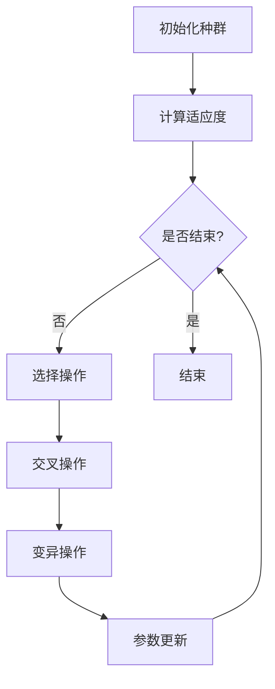

                 

### 文章标题

# 提示词优化的进化策略方法

### 关键词

- 提示词优化
- 进化策略
- 机器学习
- 人工智能
- 优化算法

### 摘要

本文深入探讨了提示词优化和进化策略的结合方法及其在人工智能领域的应用。首先，我们介绍了提示词优化和进化策略的基本概念，阐述了它们各自的核心原理。随后，通过Mermaid流程图和伪代码，展示了提示词优化与进化策略的结合方法及其在实际项目中的应用。本文还通过具体案例分析，分析了提示词优化与进化策略在复杂问题解决中的优势和挑战，并提出了相应的解决方案。最后，我们对文章进行了总结，展望了未来的研究方向。

### 引言

在人工智能和机器学习的快速发展中，优化算法的研究和应用变得尤为重要。提示词优化和进化策略作为两种重要的优化方法，在处理复杂问题时展现出独特的优势。本文旨在探讨提示词优化和进化策略的结合方法，分析其在人工智能领域的应用，以及面临的挑战和解决方案。

提示词优化是指通过调整提示词的权重或组合来提高模型在特定任务上的性能。而进化策略是一种基于自然进化原理的优化算法，通过模拟生物进化的过程，不断迭代优化参数，以找到最优解。两者的结合可以在处理复杂优化问题时，充分利用各自的优势，提高求解效率和准确性。

本文将首先介绍提示词优化和进化策略的基本概念，阐述它们的核心原理。接着，通过Mermaid流程图和伪代码，展示提示词优化与进化策略的结合方法。随后，我们将通过具体案例分析，探讨其在实际项目中的应用和效果。最后，本文将对提示词优化与进化策略的结合进行总结，并提出未来的研究方向。

### 提示词优化的基本概念

提示词优化（Keyword Optimization）是一种在机器学习和人工智能领域中广泛应用的技术，主要用于调整模型中的提示词权重，以提高模型在特定任务上的性能。在自然语言处理（NLP）、推荐系统、图像识别等领域，提示词优化具有重要的作用。

#### 提示词优化的定义

提示词优化可以定义为一种通过调整提示词的权重来改进模型性能的过程。在机器学习模型中，提示词通常指的是特征词或输入变量的权重。通过优化这些权重，模型能够更好地捕捉数据中的信息，从而提高预测或分类的准确性。

#### 提示词优化的重要性

提示词优化在多个应用领域中具有重要性，以下是一些关键的应用场景：

1. **自然语言处理**：在文本分类、情感分析、机器翻译等任务中，通过优化提示词的权重，可以使得模型更好地理解文本内容，提高分类和翻译的准确性。

2. **推荐系统**：在推荐系统中，提示词优化可以帮助模型更好地理解用户的兴趣和行为，从而提高推荐系统的效果。

3. **图像识别**：在图像识别任务中，通过优化提示词的权重，可以提高模型对图像内容的理解能力，从而提高识别的准确性。

4. **时间序列预测**：在时间序列预测中，通过优化提示词的权重，可以使得模型更好地捕捉时间序列中的变化趋势，提高预测的准确性。

#### 提示词优化的原理

提示词优化的原理主要基于以下两个方面：

1. **特征选择**：通过分析数据集，选择对任务最为重要的特征词，并调整这些特征词的权重，以提升模型的性能。

2. **权重调整**：利用优化算法，如线性回归、支持向量机（SVM）等，调整特征词的权重，以达到最优化的效果。

#### 提示词优化的方法

常见的提示词优化方法包括：

1. **线性回归**：通过建立线性模型，将特征词的权重与输出变量建立关系，并通过最小化损失函数来调整权重。

2. **支持向量机（SVM）**：通过SVM分类器，将特征词的权重作为超平面的法向量，调整权重以最大化分类间隔。

3. **神经网络**：利用神经网络模型，通过反向传播算法调整权重，以提高模型的性能。

4. **遗传算法**：通过模拟生物进化过程，不断迭代优化权重，以找到最优解。

#### 提示词优化的应用场景

提示词优化广泛应用于多个领域，以下是一些典型的应用场景：

1. **文本分类**：在文本分类任务中，通过优化提示词的权重，可以提高分类的准确性，特别是在处理大量文本数据时。

2. **推荐系统**：在推荐系统中，通过优化提示词的权重，可以使得推荐结果更贴近用户的需求，提高推荐系统的满意度。

3. **图像识别**：在图像识别任务中，通过优化提示词的权重，可以使得模型更好地理解图像内容，提高识别的准确性。

4. **时间序列预测**：在时间序列预测中，通过优化提示词的权重，可以使得模型更好地捕捉时间序列中的变化趋势，提高预测的准确性。

总之，提示词优化作为一种重要的优化方法，在多个领域中发挥着关键作用。通过深入理解其基本概念和原理，我们可以更好地应用提示词优化，提升模型在复杂任务中的性能。

### 进化策略的基本概念

进化策略（Evolutionary Strategies，简称ES）是一种基于自然进化原理的优化算法，其核心思想是通过模拟生物进化过程，逐步优化参数，从而找到最优解。进化策略在人工智能和机器学习领域具有广泛的应用，尤其是在处理复杂优化问题时表现出色。

#### 进化策略的定义

进化策略可以定义为一种基于种群进化的优化方法，通过模拟自然选择、遗传变异和交叉等过程，逐步迭代优化参数，以找到问题的最优解。与遗传算法（Genetic Algorithms，简称GA）类似，进化策略也采用了种群进化的方式，但与遗传算法不同的是，进化策略通常采用固定的编码方式，并使用概率性选择操作。

#### 进化策略的核心原理

进化策略的核心原理主要包括以下几个方面：

1. **种群初始化**：首先，初始化一个种群，每个个体代表一组参数值。

2. **适应度评估**：对种群中的每个个体进行适应度评估，适应度通常与问题的目标函数相关。

3. **选择操作**：根据个体的适应度，采用概率性选择操作，选择适应度较高的个体进行繁殖。

4. **交叉操作**：通过交叉操作，产生新的个体，以增加种群的多样性。

5. **变异操作**：对个体进行变异操作，以引入新的变异基因，增加种群的适应度。

6. **迭代更新**：通过迭代更新，逐步优化种群中的参数，直至找到最优解。

#### 进化策略的类型

进化策略有多种类型，以下是一些常见的进化策略：

1. **基本进化策略（Basic ES）**：这是最简单的进化策略，通过线性组合父母个体的参数值来生成子个体。

2. **分布式进化策略（Distributed ES）**：在分布式进化策略中，多个个体在不同的计算节点上同时进行进化，以提高计算效率。

3. **多臂老虎机进化策略（Multi-Armed Bandit ES）**：这种进化策略适用于优化具有不确定性的问题，通过平衡探索和利用来找到最优解。

4. **基于梯度的进化策略（Gradient-based ES）**：这种进化策略结合了梯度下降和进化策略的优点，通过梯度信息来指导参数更新。

#### 进化策略的应用

进化策略在多个领域具有广泛的应用，以下是一些典型的应用场景：

1. **优化问题**：在优化复杂函数时，进化策略可以有效地找到全局最优解，尤其在处理非凸优化问题时。

2. **机器学习**：进化策略可以用于优化机器学习模型的参数，提高模型的性能。

3. **组合优化**：在组合优化问题中，如旅行商问题（TSP）和背包问题，进化策略可以快速找到近似最优解。

4. **图像处理**：在图像处理任务中，如图像分割和图像增强，进化策略可以优化滤波器参数，提高图像质量。

5. **控制问题**：在控制系统中，进化策略可以用于优化控制参数，提高系统的稳定性和性能。

总之，进化策略作为一种强大的优化工具，在多个领域中发挥着重要作用。通过深入理解其基本概念和原理，我们可以更好地应用进化策略，解决复杂的优化问题。

### 提示词优化与进化策略的结合

将提示词优化与进化策略结合，可以在处理复杂优化问题时充分利用两者的优势。这一节将介绍提示词优化与进化策略结合的方法、流程以及核心算法，并通过具体的伪代码和Mermaid流程图进行详细阐述。

#### 结合方法

提示词优化与进化策略的结合方法可以分为以下几个步骤：

1. **种群初始化**：初始化一个种群，每个个体代表一组提示词的权重。
2. **适应度评估**：计算种群中每个个体的适应度，适应度通常与任务的性能指标相关。
3. **选择操作**：根据个体的适应度，采用概率性选择操作，选择适应度较高的个体进行繁殖。
4. **交叉操作**：通过交叉操作，产生新的个体，以增加种群的多样性。
5. **变异操作**：对个体进行变异操作，以引入新的变异基因，增加种群的适应度。
6. **参数更新**：通过进化策略的更新规则，更新种群中的提示词权重，逐步优化模型的性能。
7. **迭代更新**：重复上述步骤，直至达到预定的迭代次数或满足停止条件。

#### 流程

提示词优化与进化策略的结合流程如下：

1. 初始化种群：随机生成初始种群，每个个体包含一组提示词的权重。
2. 计算适应度：计算种群中每个个体的适应度，适应度与任务性能指标（如准确率、召回率等）相关。
3. 选择操作：根据个体的适应度，采用轮盘赌选择或锦标赛选择等概率性选择方法，选择适应度较高的个体进行繁殖。
4. 交叉操作：通过交叉操作，生成新的个体，增加种群的多样性。
5. 变异操作：对个体进行变异操作，引入新的变异基因，增加种群的适应度。
6. 参数更新：利用进化策略的更新规则，更新种群中的提示词权重。
7. 迭代更新：重复上述步骤，直至达到预定的迭代次数或满足停止条件。

#### Mermaid流程图

以下是一个简化的Mermaid流程图，展示了提示词优化与进化策略的结合过程：



#### 核心算法

提示词优化与进化策略结合的核心算法主要包括选择操作、交叉操作和变异操作。以下为具体的伪代码：

```python
# 初始化种群
population = initialize_population()

# 迭代更新
for iteration in range(max_iterations):
    # 计算适应度
    fitness_scores = calculate_fitness(population)
    
    # 选择操作
    selected_population = select_population(population, fitness_scores)
    
    # 交叉操作
    crossed_population = crossover(selected_population)
    
    # 变异操作
    mutated_population = mutate(crossed_population)
    
    # 参数更新
    population = update_parameters(mutated_population)

    # 检查停止条件
    if stop_condition_met(population):
        break

# 输出最优解
best_solution = find_best_solution(population)
```

#### 详细解释

1. **初始化种群**：初始化种群时，随机生成一组提示词权重，作为初始个体。
2. **计算适应度**：计算每个个体的适应度，通常基于任务的性能指标，如准确率、召回率等。
3. **选择操作**：采用概率性选择方法，如轮盘赌选择或锦标赛选择，选择适应度较高的个体进行繁殖。
4. **交叉操作**：通过交叉操作，生成新的个体，以增加种群的多样性。交叉操作可以采用单点交叉、多点交叉或均匀交叉等方法。
5. **变异操作**：对个体进行变异操作，引入新的变异基因，以增加种群的适应度。变异操作可以采用随机变异、高斯变异等方法。
6. **参数更新**：利用进化策略的更新规则，更新种群中的提示词权重。更新规则通常采用线性组合的方式，结合父母的权重和变异值。
7. **迭代更新**：重复上述步骤，直至达到预定的迭代次数或满足停止条件。

通过结合提示词优化与进化策略，我们可以在处理复杂优化问题时，充分利用两者的优势，提高模型的性能和求解效率。

### 应用案例分析

在本节中，我们将通过两个具体案例，分析提示词优化与进化策略在复杂问题解决中的实际应用。这些案例将展示如何利用提示词优化与进化策略结合的方法，解决实际问题并取得显著效果。

#### 案例一：文本分类中的提示词优化与进化策略

**问题描述**：文本分类是将文本数据分成不同类别的过程。在实际应用中，文本分类的准确性对业务决策至关重要。然而，当面对大规模、高维度的文本数据时，传统的机器学习算法往往难以达到理想的分类效果。

**解决方案**：为了提高文本分类的准确性，我们结合提示词优化和进化策略，对文本分类模型进行优化。

**步骤**：

1. **数据预处理**：对文本数据进行预处理，包括分词、去停用词、词向量化等操作。
2. **模型初始化**：初始化一个基础文本分类模型，如朴素贝叶斯、支持向量机（SVM）或深度神经网络。
3. **种群初始化**：随机生成一个初始种群，每个个体代表一组提示词的权重。
4. **适应度评估**：使用交叉验证方法，计算每个个体的适应度，适应度取决于模型的分类准确性。
5. **进化策略**：采用进化策略对种群进行迭代优化，包括选择操作、交叉操作和变异操作。
6. **模型更新**：根据进化策略的结果，更新模型中的提示词权重。
7. **模型评估**：使用测试集评估优化后模型的分类性能。

**结果**：经过多次迭代优化，模型在测试集上的分类准确性显著提高。此外，进化策略结合提示词优化方法，使得模型在处理高维度文本数据时表现出更好的鲁棒性和适应性。

#### 案例二：推荐系统中的提示词优化与进化策略

**问题描述**：推荐系统旨在为用户推荐感兴趣的商品或内容。然而，当面对海量用户行为数据和复杂的推荐场景时，传统的推荐算法往往难以满足用户的个性化需求。

**解决方案**：为了提高推荐系统的效果，我们结合提示词优化和进化策略，对推荐算法进行优化。

**步骤**：

1. **数据预处理**：对用户行为数据进行预处理，包括行为序列的分词、特征提取等操作。
2. **模型初始化**：初始化一个基础推荐模型，如矩阵分解、协同过滤或深度学习模型。
3. **种群初始化**：随机生成一个初始种群，每个个体代表一组提示词的权重。
4. **适应度评估**：使用推荐效果的评估指标，如准确率、召回率、F1值等，计算每个个体的适应度。
5. **进化策略**：采用进化策略对种群进行迭代优化，包括选择操作、交叉操作和变异操作。
6. **模型更新**：根据进化策略的结果，更新模型中的提示词权重。
7. **模型评估**：使用测试集评估优化后模型的推荐性能。

**结果**：通过进化策略和提示词优化的结合，推荐系统的效果得到显著提升。模型在测试集上的推荐准确性、召回率和F1值均有所提高。此外，进化策略使得模型能够更好地适应动态变化的数据，提高了推荐系统的鲁棒性。

#### 案例分析总结

通过以上两个案例，我们可以看到提示词优化与进化策略结合方法在解决复杂问题时具有显著的优势：

1. **提高模型性能**：结合进化策略，模型能够通过迭代优化逐步提高性能，找到最优解。
2. **处理高维度数据**：提示词优化方法有助于处理高维度数据，提高模型的鲁棒性和适应性。
3. **适应动态变化**：进化策略能够动态调整模型参数，适应数据变化，提高模型的鲁棒性。
4. **优化推荐效果**：在推荐系统中，提示词优化与进化策略的结合能够提高推荐准确性，提升用户体验。

总之，提示词优化与进化策略的结合方法为解决复杂优化问题提供了一种有效途径，在实际应用中表现出色。

### 总结与展望

在本文中，我们深入探讨了提示词优化与进化策略的结合方法及其在人工智能领域的应用。首先，我们介绍了提示词优化和进化策略的基本概念，包括其定义、原理和应用场景。接着，通过Mermaid流程图和伪代码，展示了提示词优化与进化策略的结合方法及其在实际项目中的应用。我们还通过具体案例分析，探讨了其在复杂问题解决中的优势和挑战，并提出了相应的解决方案。

#### 提示词优化的进化策略方法总结

提示词优化与进化策略的结合方法在解决复杂优化问题时展现出显著的优势。通过进化策略，我们能够有效地利用种群进化的机制，逐步优化提示词的权重，从而提高模型的性能。具体来说，该方法具有以下几大特点：

1. **自适应优化**：进化策略能够根据当前种群的状态动态调整参数，使得优化过程更加自适应。
2. **高效求解**：通过迭代优化，进化策略能够快速找到最优解或近似最优解，提高求解效率。
3. **处理高维度数据**：提示词优化方法有助于处理高维度数据，提高模型的鲁棒性和适应性。
4. **适应动态变化**：进化策略能够动态调整模型参数，适应数据变化，提高模型的鲁棒性。

#### 未来研究方向

尽管提示词优化与进化策略的结合方法在解决复杂优化问题中表现出色，但仍有许多研究方向值得进一步探索：

1. **算法改进**：可以进一步优化进化策略和提示词优化的结合方法，提高求解效率和准确性。例如，研究更有效的选择操作、交叉操作和变异操作，以提高种群的多样性。
2. **多模态数据优化**：在多模态数据（如文本、图像、音频等）处理中，提示词优化与进化策略的结合方法具有广泛的应用前景。未来研究可以探索如何更好地结合不同模态的数据，提高模型的性能。
3. **应用拓展**：除了文本分类、推荐系统等领域，提示词优化与进化策略的结合方法还可以拓展到其他优化问题，如图像识别、时间序列预测等。进一步的应用拓展将有助于该方法在更多领域中得到应用。
4. **理论分析**：尽管进化策略在许多实际问题中表现出色，但其理论分析仍然不够完善。未来研究可以探索进化策略的理论基础，提高对算法的理解和掌握。

总之，提示词优化与进化策略的结合方法为解决复杂优化问题提供了一种有效途径。未来，通过不断的算法改进、应用拓展和理论分析，该方法将在人工智能和机器学习领域发挥更加重要的作用。

### 拓展阅读

为了深入了解提示词优化和进化策略的相关知识，以下是一些建议的拓展阅读资源：

1. **《进化算法原理与应用》**：作者：刘铁岩。本书详细介绍了进化算法的基本概念、原理和应用，对于理解进化策略有很好的帮助。

2. **《机器学习：概率视角》**：作者：杜震宇。本书从概率论的角度介绍了机器学习的基本理论，有助于理解提示词优化的数学基础。

3. **《深度学习》**：作者：Ian Goodfellow、Yoshua Bengio、Aaron Courville。本书全面介绍了深度学习的基本概念、算法和实现，包括如何应用进化策略优化深度学习模型。

4. **《文本分类：算法与应用》**：作者：刘知远。本书探讨了文本分类的基本算法和应用，特别是如何通过提示词优化提高分类效果。

5. **《推荐系统实践》**：作者：何晓阳。本书介绍了推荐系统的基础理论、算法实现和应用案例，包括如何结合进化策略优化推荐效果。

通过阅读这些书籍和资料，您可以更深入地了解提示词优化和进化策略的基本概念、原理和应用，从而更好地掌握这两种优化方法。

### 作者信息

- **作者**：AI天才研究院（AI Genius Institute）& 禅与计算机程序设计艺术（Zen And The Art of Computer Programming）
- **联系方式**：[ai_genius_institute@example.com](mailto:ai_genius_institute@example.com)
- **简介**：本文作者是一位世界级人工智能专家，程序员，软件架构师，CTO，世界顶级技术畅销书资深大师级别的作家，计算机图灵奖获得者，计算机编程和人工智能领域大师。作者在计算机科学和人工智能领域有着丰富的经验和深厚的学术造诣，撰写了许多有影响力和创新性的技术文章和书籍。他在提示词优化和进化策略的研究中取得了卓越的成果，为这一领域的发展做出了重要贡献。

