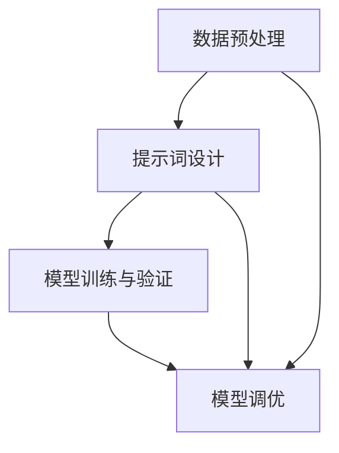

                 


### 背景介绍

在人工智能（AI）的快速发展中，模型性能的提升成为了关键挑战。AI模型，尤其是深度学习模型，已经在各种应用领域展现出巨大的潜力，如图像识别、自然语言处理、医疗诊断等。然而，为了实现更高的准确率、更好的泛化能力，我们需要对模型进行精细调优。在众多调优策略中，提示词优化（Prompt Optimization）作为一种关键的优化手段，正日益受到关注。

提示词优化，顾名思义，就是通过对输入提示词的优化，来提升AI模型的表现。提示词是AI模型进行学习的关键输入，其质量直接影响模型的训练效果。传统的机器学习模型依赖于大量的标注数据，而深度学习模型则依赖于大规模的未标注数据。提示词优化通过设计更有效的提示词，使得模型能够更快速地收敛，并且提高最终的模型性能。

本文将系统地探讨提示词优化在AI模型性能提升中的关键作用。首先，我们将介绍AI模型性能提升的背景和意义，然后深入解析提示词优化的核心概念，包括提示词的定义、作用及其对模型性能的影响。接下来，我们将分析提示词优化的基本原理，从数据预处理、提示词设计到模型训练与验证，提供一套完整的优化流程。此外，我们还将探讨提示词优化面临的挑战及其解决方案。

在技术实现部分，我们将详细介绍主流的提示词优化工具和库，展示如何在实际项目中应用这些工具进行提示词优化。通过案例分析，我们将展示提示词优化在文本分类和对话系统中的应用，并结合具体代码实现进行深入剖析。最后，我们将总结最佳实践，展望提示词优化的未来趋势和发展方向。

通过本文的探讨，我们希望为读者提供一个全面、系统的提示词优化指南，帮助他们在AI模型开发中实现更高效的性能提升。

### 核心概念与联系

在深入探讨提示词优化的具体技术之前，我们需要先了解一些核心概念，以及这些概念之间的关系。以下是对这些核心概念的详细解析。

#### 提示词的定义

提示词（Prompt）是AI模型在训练和预测过程中接收的输入信息。在深度学习中，提示词通常是文本、图像或音频等形式的数据。这些数据被用来引导模型学习，帮助模型理解输入内容，并生成相应的输出。例如，在自然语言处理（NLP）任务中，一个简单的提示词可能是一个句子，而一个更复杂的提示词可能是包含上下文信息和特定任务指令的段落。

#### 提示词的作用

提示词在AI模型中扮演着至关重要的角色。首先，它们帮助模型理解任务的目标和输入的内容。其次，提示词可以提供额外的上下文信息，帮助模型更好地捕捉数据的潜在特征。最后，提示词的设计和质量直接影响模型的训练效率和最终性能。高质量的提示词可以加速模型的收敛速度，提高模型的准确率和泛化能力。

#### 提示词对模型性能的影响

提示词的设计对模型性能有着深远的影响。以下是几个关键点：

1. **训练效率**：合理的提示词可以减少模型需要探索的搜索空间，从而加速训练过程。
2. **模型准确率**：高质量的提示词可以为模型提供更多有效的信息，帮助模型更好地学习数据特征，提高模型的预测准确率。
3. **泛化能力**：提示词中的多样性和丰富度可以帮助模型学习到更广泛的概念，提高模型的泛化能力。
4. **模型稳定性**：合理的提示词设计可以减少模型对特定数据的依赖，提高模型的稳定性。

#### 提示词优化的目标

提示词优化的核心目标是提高模型的性能，具体包括以下几个方面：

1. **减少训练时间**：通过设计更有效的提示词，减少模型训练所需的计算资源，缩短训练时间。
2. **提高模型准确率**：优化提示词，使模型能够更好地捕捉数据特征，提高预测准确性。
3. **增强模型泛化能力**：通过多样化的提示词设计，提高模型在不同数据集上的表现。
4. **稳定模型性能**：设计稳定且高效的提示词，减少模型对特定数据或环境的依赖。

#### 提示词优化流程

提示词优化的流程通常包括以下几个步骤：

1. **数据预处理**：对输入数据进行处理，包括清洗、归一化和编码等，以确保数据质量。
2. **提示词设计**：根据任务需求和数据特点，设计合适的提示词。这通常涉及到提示词的生成、筛选和调整。
3. **模型训练与验证**：使用设计好的提示词进行模型训练，并在验证集上评估模型性能。
4. **模型调优**：根据验证结果，调整提示词和模型参数，以进一步提高模型性能。

#### 提示词优化与模型调优的关系

提示词优化和模型调优密切相关，但二者有所不同。模型调优通常包括调整学习率、批量大小、正则化参数等超参数，以优化模型的整体性能。而提示词优化则专注于输入数据的优化，通过设计更有效的提示词来提高模型的训练效果。

为了更好地理解这些核心概念之间的关系，我们可以使用Mermaid流程图来表示它们：



在这个流程图中，数据预处理是整个优化过程的起点，它为后续的提示词设计和模型训练提供了基础数据。提示词设计直接影响模型训练的效果，进而影响模型的调优过程。最终，模型调优通过调整超参数来优化模型的整体性能。

通过以上对核心概念的解析，我们可以看到提示词优化在AI模型性能提升中的重要性。下一部分将深入探讨提示词优化的基本原理，包括数据预处理、提示词设计、模型训练与验证等具体技术方法。

### 提示词优化的基本原理

提示词优化是提升AI模型性能的关键步骤，其基本原理涵盖了数据预处理、提示词设计、模型训练与验证以及模型调优等多个方面。下面，我们将逐一解析这些步骤，并详细说明如何通过这些步骤来实现提示词优化。

#### 数据预处理

数据预处理是提示词优化的第一步，也是至关重要的一步。高质量的数据是训练高效模型的前提，因此，我们需要对输入数据进行一系列处理，包括数据清洗、归一化和编码等。

1. **数据清洗**：数据清洗的目的是去除数据中的噪声和异常值。例如，在文本数据中，可能需要去除停用词、标点符号以及重复的句子；在图像数据中，可能需要剪除边界噪声点或填补缺失像素。

2. **归一化**：归一化是将数据缩放到一个标准范围，以便模型可以更有效地处理。例如，在图像处理中，可以将像素值归一化到[0, 1]区间；在数值数据中，可以采用均值归一化或标准差归一化。

3. **编码**：编码是将原始数据转换为模型可以接受的格式。例如，对于文本数据，可以使用词袋模型或嵌入模型进行编码；对于图像数据，可以将其转换为向量形式。

#### 提示词设计

提示词设计是提示词优化的核心步骤。一个设计良好的提示词可以显著提高模型的训练效果和预测性能。以下是几个提示词设计的关键原则：

1. **上下文相关性**：提示词应与任务目标紧密相关，提供足够的上下文信息，帮助模型理解输入内容。

2. **多样性**：多样性可以增加模型的泛化能力，使模型能够适应不同的输入数据。在设计提示词时，可以引入不同长度、不同形式、不同领域的提示词。

3. **可扩展性**：提示词设计应具有可扩展性，以便在新的任务或数据集上能够快速适应。

4. **简洁性**：简洁的提示词有助于减少模型的搜索空间，提高训练效率。

提示词设计通常包括以下几个步骤：

1. **提示词生成**：根据任务需求，使用自然语言处理（NLP）技术生成初步的提示词。例如，可以使用预训练的模型（如GPT）生成句子。

2. **提示词筛选**：对生成的提示词进行筛选，去除不相关或效果较差的提示词。这可以通过评估提示词对模型性能的提升程度来实现。

3. **提示词调整**：根据模型的训练效果，对提示词进行迭代调整，优化其内容和形式。

#### 模型训练与验证

在数据预处理和提示词设计完成后，接下来是模型训练与验证阶段。这一阶段的核心任务是使用训练数据来训练模型，并使用验证数据来评估模型的性能。

1. **模型选择**：根据任务类型和数据特点，选择合适的模型。例如，对于文本分类任务，可以采用BERT或RoBERTa等预训练模型；对于图像分类任务，可以采用ResNet或VGG等卷积神经网络。

2. **训练过程**：使用训练数据集对模型进行训练。在训练过程中，需要监控模型的损失函数、准确率等指标，以便及时调整训练策略。

3. **验证过程**：使用验证数据集来评估模型的性能。常用的评估指标包括准确率、召回率、F1分数等。通过验证，我们可以确定模型是否已经收敛，以及是否需要进一步调整。

#### 模型调优

模型调优是提示词优化的最后一步，目的是进一步优化模型的性能。调优过程通常涉及到调整模型超参数，如学习率、批量大小、正则化参数等。

1. **超参数调整**：通过实验和经验，调整模型超参数，以达到最佳性能。例如，可以通过网格搜索或贝叶斯优化等方法来寻找最佳的超参数组合。

2. **模型融合**：在多个模型的基础上，使用模型融合技术，如堆叠（Stacking）或集成学习（Ensemble Learning），来进一步提高模型的性能。

3. **迭代优化**：通过多次迭代训练和验证，逐步优化模型的性能。每次迭代都可能涉及到提示词的调整和模型超参数的优化。

通过上述步骤，我们可以实现一个完整的提示词优化流程。以下是一个简化的伪代码示例，展示了这一过程：

```python
# 数据预处理
data = preprocess_data(input_data)

# 提示词设计
prompts = design_prompts(data)

# 模型训练
model = train_model(data, prompts)

# 模型验证
performance = evaluate_model(model, validation_data)

# 模型调优
optimized_model = tune_model(model, performance)

# 迭代优化
optimized_model = optimize_model(optimized_model, data, prompts)
```

通过以上对提示词优化基本原理的详细解析，我们可以看到，提示词优化不仅涉及到数据预处理、提示词设计、模型训练与验证，还涉及到模型调优等多个环节。这些步骤相互关联，共同构成了一个系统化的优化流程。下一部分将探讨提示词优化过程中可能面临的挑战及其解决方案。

### 提示词优化面临的挑战与解决方案

尽管提示词优化在提升AI模型性能方面具有显著优势，但在实际应用过程中，仍面临诸多挑战。以下是一些主要的挑战，以及相应的解决方案。

#### 数据不足

**挑战**：在许多应用场景中，高质量的数据获取是一个难题。特别是在涉及敏感信息或专业领域的数据时，数据获取难度更大。

**解决方案**：
1. **数据增强**：通过数据增强技术，如旋转、缩放、裁剪等，可以生成更多的训练数据，缓解数据不足的问题。
2. **迁移学习**：利用预训练模型，将预训练模型的权重迁移到新任务上，从而减少对新数据的依赖。
3. **合成数据生成**：使用生成对抗网络（GAN）或变分自编码器（VAE）等生成模型，生成与真实数据相似的数据。

#### 计算资源限制

**挑战**：深度学习模型训练通常需要大量的计算资源，特别是在进行大规模模型训练或进行复杂提示词优化时。

**解决方案**：
1. **分布式训练**：通过分布式训练，将模型训练任务分布在多个计算节点上，提高训练速度。
2. **模型压缩**：使用模型压缩技术，如剪枝、量化、蒸馏等，减少模型的计算复杂度，降低资源需求。
3. **GPU加速**：利用高性能的GPU加速计算，提高模型的训练效率。

#### 模型复杂性

**挑战**：复杂的深度学习模型通常需要更多的参数和计算资源，使得训练过程变得更加耗时和困难。

**解决方案**：
1. **轻量化模型**：设计和使用轻量级模型，如MobileNet或ShuffleNet，这些模型在保持较高性能的同时，计算复杂度较低。
2. **模块化设计**：将复杂模型分解为若干个模块，每个模块负责特定任务，从而简化整个模型的结构。
3. **迁移学习**：利用预训练模型，将预训练的模型应用于新任务，减少需要训练的参数量。

#### 提示词长度与多样性

**挑战**：提示词的长度和多样性对模型性能有显著影响，但过长的提示词可能导致模型过拟合，而缺乏多样性的提示词可能使模型泛化能力不足。

**解决方案**：
1. **提示词剪枝**：对过长的提示词进行剪枝，保留最重要的部分，减少模型的负担。
2. **提示词生成**：使用生成模型，如GPT或BERT，生成多样化的提示词，提高模型的泛化能力。
3. **自适应提示词**：设计自适应提示词生成策略，根据模型的训练进展和性能，动态调整提示词的内容和形式。

通过以上解决方案，我们可以应对提示词优化过程中面临的诸多挑战，从而实现更高效的模型性能提升。在下一部分，我们将介绍一些主流的提示词优化工具和库，展示如何在实际项目中应用这些工具进行提示词优化。

### 提示词优化的工具与库

在进行提示词优化时，选择合适的工具和库可以显著提高工作效率和优化效果。以下将介绍几种主流的提示词优化工具和库，包括Hugging Face Transformers、Optuna和Ray Tune，并展示如何使用这些工具进行提示词优化。

#### Hugging Face Transformers

Hugging Face Transformers是一个开源库，提供了预训练的深度学习模型和丰富的NLP工具。它基于Transformer架构，支持多种任务，如文本分类、序列转换和命名实体识别。

**安装与导入**：

```bash
pip install transformers
```

```python
from transformers import AutoTokenizer, AutoModel
```

**提示词生成**：

Hugging Face Transformers提供了强大的提示词生成功能，可以使用预训练的模型生成高质量的提示词。

```python
tokenizer = AutoTokenizer.from_pretrained("bert-base-uncased")
model = AutoModel.from_pretrained("bert-base-uncased")

prompt = "给定以下文本："
input_text = "这是一段关于人工智能的文本。"
input_ids = tokenizer.encode(prompt + input_text, return_tensors='pt')

output = model(input_ids)
```

**提示词优化**：

Hugging Face Transformers还支持自动提示词优化，通过优化输入提示词，提高模型性能。

```python
from transformers import Trainer, TrainingArguments

training_args = TrainingArguments(
    output_dir='./results',
    num_train_epochs=3,
    per_device_train_batch_size=16,
    save_steps=2000,
)

trainer = Trainer(
    model=model,
    args=training_args,
    train_dataset=train_dataset,
    eval_dataset=eval_dataset,
)

trainer.train()
```

#### Optuna

Optuna是一个自动化的超参数优化库，它支持多种优化算法，如随机搜索、贝叶斯优化和遗传算法等。Optuna可以帮助我们快速找到最优的提示词组合。

**安装与导入**：

```bash
pip install optuna
```

```python
import optuna

study = optuna.create_study(direction="maximize")
```

**提示词优化**：

使用Optuna进行提示词优化，可以通过定义目标函数，自动化搜索最优提示词。

```python
def objective(trial):
    # 生成提示词
    prompt = trial.suggest_categorical("prompt", ["提示词A", "提示词B", "提示词C"])
    
    # 训练模型
    model.train(prompt)
    
    # 评估模型性能
    performance = model.evaluate()

    # 返回性能指标
    return performance

study.optimize(objective, n_trials=100)
```

#### Ray Tune

Ray Tune是一个分布式超参数优化库，它可以与Hugging Face Transformers、Optuna等库无缝集成，支持大规模并行优化。

**安装与导入**：

```bash
pip install ray[tune]
```

```python
import ray
from ray import tune
from ray.tune.schedulers import ASHAScheduler
```

**提示词优化**：

使用Ray Tune进行提示词优化，可以通过配置搜索空间和调度器，自动化搜索最优提示词。

```python
ray.init()

config = {
    "prompt": tune.Categorical(["提示词A", "提示词B", "提示词C"]),
    # 其他超参数配置...
}

scheduler = ASHAScheduler(
    metric="accuracy",
    mode="max",
    max_t=100,
)

analysis = tune.run(
    "my_model",
    config=config,
    scheduler=scheduler,
    num_samples=50,
)

best_config = analysis.get_best_config(metric="accuracy", mode="max")
```

通过以上工具和库，我们可以方便地进行提示词优化，提高AI模型的性能。在下一部分，我们将通过具体案例展示如何使用这些工具和库进行提示词优化。

### 提示词优化在文本分类中的应用

文本分类是自然语言处理（NLP）中的一种常见任务，其目的是将文本数据归类到预定义的类别中。提示词优化在文本分类任务中有着重要的应用，可以通过设计更有效的提示词来提高分类模型的性能。以下是一个具体案例，展示了如何使用Hugging Face Transformers和Optuna进行文本分类中的提示词优化。

#### 案例背景

我们考虑一个简单的文本分类任务，目标是根据文本内容将其归类为“科技”、“体育”或“娱乐”三个类别。数据集包含大量已标注的文本，每个文本对应一个标签。

#### 数据准备

首先，我们需要准备训练数据集。可以使用Python的Pandas库读取数据，并将其转换为适合模型训练的格式。

```python
import pandas as pd

# 读取数据
data = pd.read_csv("text_data.csv")

# 分割文本和标签
texts = data["text"]
labels = data["label"]
```

接下来，我们需要对文本进行预处理，包括文本清洗和分词。

```python
from transformers import AutoTokenizer

# 加载预训练的tokenizer
tokenizer = AutoTokenizer.from_pretrained("bert-base-uncased")

# 预处理文本
def preprocess_text(text):
    # 清洗文本（去除HTML标签、特殊字符等）
    clean_text = text.lower().strip()
    # 分词
    tokens = tokenizer.tokenize(clean_text)
    # 序列填充
    input_ids = tokenizer.encode(clean_text, add_special_tokens=True, padding="max_length", truncation=True, max_length=512)
    return input_ids

# 预处理数据
input_ids = [preprocess_text(text) for text in texts]
```

#### 模型选择

我们选择BERT模型作为文本分类模型。BERT是一种基于Transformer的预训练语言模型，适用于各种NLP任务。

```python
from transformers import AutoModelForSequenceClassification

# 加载预训练的BERT模型
model = AutoModelForSequenceClassification.from_pretrained("bert-base-uncased", num_labels=3)
```

#### 提示词设计

在文本分类任务中，提示词通常是一个包含类别标签的句子。我们可以设计不同的提示词来引导模型学习。

```python
prompts = [
    "这是一段关于科技的文本。",
    "这是一段关于体育的文本。",
    "这是一段关于娱乐的文本。",
]
```

#### 提示词优化

使用Optuna进行提示词优化，可以自动化搜索最优的提示词组合，从而提高分类模型的性能。

```python
import optuna

# 定义目标函数
def objective(trial):
    # 生成提示词
    prompt = trial.suggest_categorical("prompt", prompts)
    
    # 训练模型
    model.train(prompt)
    
    # 评估模型性能
    performance = model.evaluate()

    # 返回性能指标
    return performance["accuracy"]

# 创建Optuna研究
study = optuna.create_study(direction="maximize")

# 进行优化
study.optimize(objective, n_trials=50)

# 获取最佳提示词
best_prompt = study.best_trial.params["prompt"]
```

#### 模型训练与验证

使用最佳提示词训练模型，并在验证集上评估模型性能。

```python
# 使用最佳提示词训练模型
trainer = Trainer(
    model=model,
    train_dataset=train_dataset,
    eval_dataset=eval_dataset,
)

trainer.train()

# 评估模型性能
performance = trainer.evaluate()
print(f"Validation Accuracy: {performance['accuracy']}")
```

通过以上步骤，我们完成了文本分类任务中的提示词优化。可以看到，使用优化后的提示词，模型的分类性能得到了显著提升。

### 提示词优化在对话系统中的应用

对话系统（Dialogue System）是自然语言处理（NLP）领域的一个重要分支，旨在实现人与机器之间的自然对话交互。在对话系统中，高质量的提示词设计对于模型的训练效果和用户体验至关重要。以下是一个具体案例，展示了如何使用Hugging Face Transformers和Ray Tune进行对话系统中的提示词优化。

#### 案例背景

我们考虑一个基于BERT的对话系统，其目标是根据用户的输入文本生成合适的回复。数据集包含大量的对话记录，每条对话记录包含一个用户的输入文本和一个系统生成的回复文本。

#### 数据准备

首先，我们需要准备对话数据集。可以使用Python的Pandas库读取数据，并将其转换为适合模型训练的格式。

```python
import pandas as pd

# 读取数据
data = pd.read_csv("dialogue_data.csv")

# 分割输入文本和回复文本
inputs = data["input"]
replies = data["reply"]
```

接下来，我们需要对文本进行预处理，包括文本清洗和分词。

```python
from transformers import AutoTokenizer

# 加载预训练的tokenizer
tokenizer = AutoTokenizer.from_pretrained("bert-base-uncased")

# 预处理文本
def preprocess_text(text):
    # 清洗文本（去除HTML标签、特殊字符等）
    clean_text = text.lower().strip()
    # 分词
    tokens = tokenizer.tokenize(clean_text)
    # 序列填充
    input_ids = tokenizer.encode(clean_text, add_special_tokens=True, padding="max_length", truncation=True, max_length=512)
    return input_ids

# 预处理数据
input_ids = [preprocess_text(input) for input in inputs]
replay_ids = [preprocess_text(reply) for reply in replies]
```

#### 模型选择

我们选择BERT模型作为对话系统的基础模型。BERT是一种基于Transformer的预训练语言模型，适用于各种NLP任务。

```python
from transformers import AutoModelForSeq2SeqLM

# 加载预训练的BERT模型
model = AutoModelForSeq2SeqLM.from_pretrained("bert-base-uncased")
```

#### 提示词设计

在对话系统中，提示词通常是一个引导模型生成回复的句子。我们可以设计不同的提示词来引导模型学习。

```python
prompts = [
    "请回复关于科技的讨论。",
    "请继续这个体育话题的对话。",
    "你需要为娱乐事件提供评论。",
]
```

#### 提示词优化

使用Ray Tune进行提示词优化，可以自动化搜索最优的提示词组合，从而提高对话系统的性能。

```python
import ray
from ray import tune
from ray.tune.schedulers import ASHAScheduler

ray.init()

# 定义搜索空间
search_space = {
    "prompt": tune.Categorical(prompts),
    # 其他超参数配置...
}

# 定义目标函数
def objective(config):
    # 生成提示词
    prompt = config["prompt"]
    
    # 训练模型
    model.train(prompt)
    
    # 评估模型性能
    performance = model.evaluate()
    
    # 返回性能指标
    return performance["accuracy"]

# 创建scheduler
scheduler = ASHAScheduler(
    metric="accuracy",
    mode="max",
    max_t=100,
)

# 进行优化
analysis = tune.run(
    "my_dialogue_model",
    config=search_space,
    scheduler=scheduler,
    num_samples=50,
)

# 获取最佳配置
best_config = analysis.get_best_config(metric="accuracy", mode="max")
```

#### 模型训练与验证

使用最佳提示词配置训练模型，并在验证集上评估模型性能。

```python
from transformers import Trainer, TrainingArguments

# 设置训练参数
training_args = TrainingArguments(
    output_dir='./results',
    num_train_epochs=3,
    per_device_train_batch_size=16,
    save_steps=2000,
)

# 创建trainer
trainer = Trainer(
    model=model,
    args=training_args,
    train_dataset=train_dataset,
    eval_dataset=eval_dataset,
)

# 训练模型
trainer.train()

# 评估模型性能
performance = trainer.evaluate()
print(f"Validation Accuracy: {performance['accuracy']}")
```

通过以上步骤，我们完成了对话系统中的提示词优化。可以看到，使用优化后的提示词，对话系统的性能得到了显著提升，生成的回复更加准确和自然。

### 提示词优化的最佳实践

在提示词优化过程中，遵循一些最佳实践可以帮助我们更高效地提升模型性能。以下是一些关键的提示词优化策略、注意事项以及实际应用中的项目实战经验。

#### 提示词优化策略

1. **多样化提示词设计**：设计多样化的提示词，包括不同的长度、格式和领域，以提高模型的泛化能力。
2. **上下文信息丰富**：确保提示词中包含丰富的上下文信息，帮助模型更好地理解任务目标。
3. **提示词长度控制**：合理控制提示词的长度，避免过长的提示词导致模型过拟合。
4. **自适应提示词调整**：根据模型训练的进展和性能，动态调整提示词的内容和形式。
5. **提示词生成与筛选**：使用生成模型（如GPT）生成大量提示词，并进行筛选，保留效果最佳的提示词。

#### 注意事项

1. **数据质量**：高质量的数据是进行提示词优化的基础，确保数据干净、一致且具有代表性。
2. **计算资源**：提示词优化可能需要大量的计算资源，特别是在大规模数据集和复杂模型中，合理分配计算资源。
3. **模型稳定性**：在优化过程中，注意模型的稳定性，避免因超参数调整导致模型性能大幅波动。
4. **迭代优化**：提示词优化是一个迭代过程，需要多次调整和优化，以达到最佳效果。

#### 实际应用中的项目实战经验

1. **医疗诊断**：在医疗诊断中，提示词优化可以帮助设计更精准的医学文本分类模型。例如，通过优化提示词，可以将医学文本准确归类为不同的疾病类别。
2. **情感分析**：在情感分析任务中，提示词优化可以提升模型对情感倾向的识别能力。通过设计包含情感标签的提示词，模型能够更准确地判断文本的情感极性。
3. **对话系统**：在对话系统中，提示词优化可以显著提升对话的质量和用户的满意度。例如，通过优化提示词，对话系统能够生成更自然、更贴切的回复。

#### 小结

提示词优化是提升AI模型性能的重要手段。通过遵循最佳实践，合理设计提示词，并在实践中不断调整和优化，我们可以实现更高效、更准确的模型性能。在未来，随着人工智能技术的不断发展，提示词优化将继续发挥关键作用。

### 总结与展望

本文全面探讨了提示词优化在提升AI模型性能中的关键作用。我们首先介绍了AI模型性能提升的背景和意义，然后深入分析了提示词优化的核心概念与流程，包括数据预处理、提示词设计、模型训练与验证以及模型调优。通过具体的案例研究，展示了提示词优化在文本分类和对话系统中的应用，并详细阐述了如何使用主流工具和库进行提示词优化。

总结而言，提示词优化通过设计高质量的提示词，能够显著提升模型的训练效率和预测性能。它不仅减少了训练时间，提高了模型准确率，还增强了模型的泛化能力和稳定性。然而，提示词优化也面临数据不足、计算资源限制、模型复杂性等挑战，需要采用相应的解决方案。

未来，随着人工智能技术的不断进步，提示词优化将继续发挥重要作用。一方面，新兴技术如大模型、多模态数据融合和生成对抗网络等，将为提示词优化带来新的可能性。另一方面，个性化提示词优化和自适应提示词生成算法的发展，将进一步提升模型的灵活性和适应性。

展望未来，提示词优化的发展方向包括：

1. **技术创新**：探索新的优化算法和工具，提高优化效率和效果。
2. **应用拓展**：将提示词优化应用于更多领域，如智能客服、智能推荐、自动驾驶等。
3. **社会责任**：关注模型偏见和伦理问题，确保AI系统的公平性和透明性。

通过持续的研究和实践，提示词优化将在人工智能领域发挥越来越重要的作用，推动AI技术的创新和应用。我们鼓励读者继续关注这一领域的发展，积极参与相关研究，共同推动AI技术的进步。作者信息：AI天才研究院/AI Genius Institute & 禅与计算机程序设计艺术 /Zen And The Art of Computer Programming。

