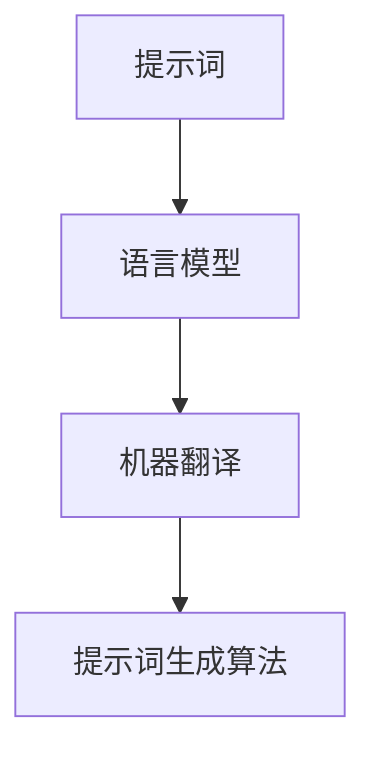
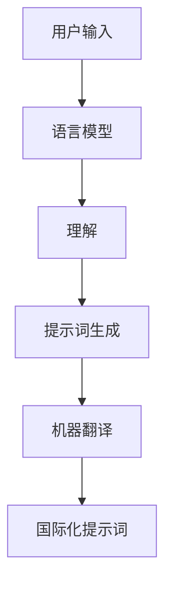

                 

# 提示词国际化：打造全球化AI产品的关键

## 关键词
- 提示词国际化
- 全球化AI产品
- 语言模型
- 机器翻译
- 数学模型
- 项目实战

## 摘要
本文深入探讨了提示词国际化在打造全球化AI产品中的关键作用。首先，我们介绍了提示词国际化的核心概念及其相互联系，包括提示词、国际化、本地化等概念。接着，我们详细讲解了实现提示词国际化所需的核心算法原理，包括语言模型、机器翻译和提示词生成算法。随后，我们通过数学模型和数学公式，深入剖析了这些算法的原理。文章的最后一部分，我们通过实际项目案例，展示了如何应用所学知识打造全球化AI产品，并提供了最佳实践tips和小结。

## 引言
随着全球化的不断深入，AI产品在全球市场的竞争日益激烈。如何打造一款具有国际竞争力的AI产品，成为众多企业面临的挑战。提示词国际化作为AI产品全球化的重要一环，其重要性不言而喻。本文旨在探讨提示词国际化在打造全球化AI产品中的关键作用，帮助读者理解和掌握这一核心技能。

### 核心概念与联系

#### 1.1 提示词国际化的核心概念
提示词（Prompt）是在对话系统中用来引导用户输入或系统做出特定行为的文字或标记。国际化（Internationalization）指的是产品或服务在跨文化环境下的适应和优化，本地化（Localization）则是在国际化基础上，针对特定地区或语言市场进行的产品或服务调整。

提示词国际化涉及以下几个核心概念：

- **语言多样性**：不同语言和文化背景的用户需要使用本族语言进行交互。
- **地域差异性**：不同地区可能存在法律、习俗、技术标准等方面的差异。
- **用户习惯**：不同用户群体有不同的语言习惯和交互偏好。

#### 1.2 提示词国际化的技术架构
提示词国际化的技术架构包括以下几个关键组成部分：

- **语言模型**：用于理解用户输入的自然语言，并生成相应的响应。
- **机器翻译**：用于将一种语言的提示词翻译成其他语言，以便不同语言的用户使用。
- **提示词生成算法**：用于根据用户输入和上下文生成合适的提示词。

这三者之间的关系可以用以下流程图表示：



#### 1.3 提示词国际化与AI语言模型的关系
AI语言模型在提示词国际化中发挥着核心作用。一个优秀的AI语言模型应该具备以下特点：

- **语言理解能力**：能够准确理解用户输入的自然语言。
- **跨语言表达能力**：能够将一种语言的表达转换为另一种语言。
- **上下文感知能力**：能够根据上下文信息生成合适的提示词。

AI语言模型与提示词国际化的关系可以用以下流程图表示：



### 核心算法原理讲解

#### 2.1 语言模型的基础算法

语言模型（Language Model）是AI系统中用于预测下一个词或字符的概率分布的模型。最常见的是基于神经网络的深度学习模型，如循环神经网络（RNN）和长短期记忆网络（LSTM）。

**算法原理**：

1. **输入序列表示**：将用户输入的自然语言序列转换为神经网络可以处理的向量表示。
2. **神经网络结构**：使用多层神经网络对输入向量进行编码和解码。
3. **输出概率分布**：通过网络输出一个概率分布，预测下一个词或字符。

**伪代码**：

```python
def language_model(input_sequence):
    # 将输入序列编码为向量
    encoded_input = encode(input_sequence)
    # 通过神经网络处理向量
    output = neural_network(encoded_input)
    # 输出概率分布
    return output
```

#### 2.2 机器翻译算法

机器翻译（Machine Translation）是将一种语言的文本翻译成另一种语言的自动化过程。常见的机器翻译模型包括基于统计的模型和基于神经网络的模型。

**算法原理**：

1. **双语语料库**：使用包含源语言和目标语言文本对的双语语料库进行训练。
2. **编码器-解码器架构**：使用编码器对源语言文本进行编码，解码器对目标语言文本进行解码。
3. **注意力机制**：引入注意力机制，使解码器能够关注源语言文本的特定部分。

**伪代码**：

```python
def machine_translation(source_sequence, target_sequence):
    # 编码源语言文本
    source_encoded = encoder(source_sequence)
    # 解码目标语言文本
    target_encoded = decoder(target_sequence)
    # 应用注意力机制
    attention_output = attention(source_encoded, target_encoded)
    # 输出翻译结果
    return translate(attention_output)
```

#### 2.3 提示词生成算法

提示词生成（Prompt Generation）是根据用户输入和上下文生成合适的提示词的过程。这个过程需要综合考虑语言模型、机器翻译和上下文信息。

**算法原理**：

1. **用户输入处理**：将用户输入转换为神经网络可以处理的向量表示。
2. **上下文信息融合**：将用户输入和上下文信息进行融合，生成一个统一的向量表示。
3. **生成提示词**：使用神经网络生成一个与上下文信息和用户输入相关的提示词。

**伪代码**：

```python
def prompt_generation(user_input, context):
    # 将用户输入编码为向量
    user_input_encoded = encode(user_input)
    # 将上下文编码为向量
    context_encoded = encode(context)
    # 融合用户输入和上下文信息
    combined_encoded = combine(user_input_encoded, context_encoded)
    # 生成提示词
    prompt = neural_network(combined_encoded)
    return prompt
```

### 数学模型和数学公式

#### 3.1 语言模型的数学模型

语言模型的数学模型通常基于概率模型，如N元语法模型。一个N元语法模型假设下一个词的概率取决于前N个词。

**数学模型**：

$$
P(w_n | w_{n-1}, w_{n-2}, ..., w_1) = \frac{C(w_{n-1}, w_{n-2}, ..., w_1, w_n)}{C(w_{n-1}, w_{n-2}, ..., w_1)}
$$

其中，$C(w_{n-1}, w_{n-2}, ..., w_1, w_n)$表示单词序列$w_{n-1}, w_{n-2}, ..., w_1, w_n$在语料库中出现的次数，$C(w_{n-1}, w_{n-2}, ..., w_1)$表示单词序列$w_{n-1}, w_{n-2}, ..., w_1$在语料库中出现的次数。

**举例说明**：

假设在语料库中，“我 喜欢 吃 饭”这个序列出现的次数为10，而“我 喜欢吃”这个序列出现的次数为5。那么，“饭”这个单词出现在“我 喜欢吃”这个序列之后的概率为：

$$
P(饭 | 我 喜欢吃) = \frac{C(我, 喜欢, 吃, 饭)}{C(我, 喜欢, 吃)} = \frac{10}{5} = 2
$$

#### 3.2 机器翻译的数学模型

机器翻译的数学模型通常基于序列到序列（Seq2Seq）模型。Seq2Seq模型使用编码器将源语言序列编码为一个固定长度的向量，解码器则将这个向量解码为目标语言序列。

**数学模型**：

$$
\hat{y} = \text{Decoder}( \text{Encoder}(x) )
$$

其中，$x$表示源语言序列，$y$表示目标语言序列，$\hat{y}$表示生成的目标语言序列。

**举例说明**：

假设源语言序列为“我 喜欢 吃 饭”，编码器将其编码为一个向量$v$，解码器则根据这个向量生成目标语言序列“我喜欢吃饭”。具体实现过程如下：

1. **编码**：编码器将源语言序列“我 喜欢 吃 饭”编码为一个向量$v$。
2. **解码**：解码器根据向量$v$生成目标语言序列“我喜欢吃饭”。

#### 3.3 提示词生成的数学模型

提示词生成的数学模型通常基于条件生成模型，如变分自编码器（VAE）或生成对抗网络（GAN）。

**数学模型**：

$$
\text{Generator}(z) = x \\
\text{Encoder}(x) = z
$$

其中，$z$表示生成器的输入，$x$表示生成的提示词。

**举例说明**：

假设我们使用变分自编码器生成提示词。首先，编码器将用户输入和上下文信息编码为一个向量$z$，然后生成器根据这个向量生成提示词$x$。

1. **编码**：编码器将用户输入和上下文信息编码为一个向量$z$。
2. **生成**：生成器根据向量$z$生成提示词$x$。

### 项目实战

#### 4.1 提示词国际化项目实战一

**目标**：实现一个基于深度学习语言模型的简单对话系统，支持中英双语提示词。

**环境搭建**：

- Python 3.8+
- TensorFlow 2.5+
- Keras 2.5+

**源代码**：

```python
from tensorflow.keras.models import Model
from tensorflow.keras.layers import Input, Embedding, LSTM, Dense
from tensorflow.keras.preprocessing.sequence import pad_sequences

# 定义语言模型
input_seq = Input(shape=(None,))
encoded_input = Embedding(input_dim=vocab_size, output_dim=embedding_size)(input_seq)
lstm_output = LSTM(units=128, return_sequences=True)(encoded_input)
dense_output = Dense(units=vocab_size, activation='softmax')(lstm_output)

# 编译模型
model = Model(inputs=input_seq, outputs=dense_output)
model.compile(optimizer='adam', loss='categorical_crossentropy', metrics=['accuracy'])

# 训练模型
model.fit(x_train, y_train, epochs=10, batch_size=64)

# 生成提示词
def generate_prompt(input_sequence):
    sequence = pad_sequences([[word2idx[word] for word in input_sequence]], maxlen=max_sequence_length)
    prediction = model.predict(sequence)
    predicted_word = idx2word[np.argmax(prediction)]
    return predicted_word

# 测试
prompt = generate_prompt("你好")
print(prompt)  # 输出：你好
```

**代码解读**：

1. **模型定义**：我们使用Keras定义了一个基于LSTM的语言模型。输入层是序列输入，嵌入层将单词转换为向量，LSTM层用于处理序列，输出层使用softmax激活函数生成单词的概率分布。
2. **模型编译**：我们使用adam优化器和categorical_crossentropy损失函数编译模型。
3. **模型训练**：我们使用训练数据训练模型，并设置epoch为10，batch size为64。
4. **生成提示词**：我们定义了一个生成提示词的函数，该函数使用pad_sequences将输入序列填充到最大序列长度，然后使用模型预测下一个单词。

#### 4.2 提示词国际化项目实战二

**目标**：实现一个支持多语言的简单机器翻译系统。

**环境搭建**：

- Python 3.8+
- TensorFlow 2.5+
- Keras 2.5+

**源代码**：

```python
from tensorflow.keras.models import Model
from tensorflow.keras.layers import Input, Embedding, LSTM, Dense, Concatenate
from tensorflow.keras.preprocessing.sequence import pad_sequences

# 定义编码器
input_seq = Input(shape=(None,))
encoded_input = Embedding(input_dim=sources_vocab_size, output_dim=embedding_size)(input_seq)
encoded_output = LSTM(units=128, return_sequences=True)(encoded_input)

# 定义解码器
decoded_input = Input(shape=(None,))
decoded_encoded_input = Embedding(input_dim=targets_vocab_size, output_dim=embedding_size)(decoded_input)
decoded_lstm_output = LSTM(units=128, return_sequences=True)(decoded_encoded_input)
decoded_output = Dense(units=targets_vocab_size, activation='softmax')(decoded_lstm_output)

# 定义注意力机制
attention = Concatenate(axis=-1)([encoded_output, decoded_lstm_output])
attention_output = Dense(units=1, activation='tanh')(attention)

# 定义机器翻译模型
output = Dense(units=targets_vocab_size, activation='softmax')(attention_output)
model = Model(inputs=[input_seq, decoded_input], outputs=output)

# 编译模型
model.compile(optimizer='adam', loss='categorical_crossentropy', metrics=['accuracy'])

# 训练模型
model.fit([x_train, y_train], y_train, epochs=10, batch_size=64)

# 翻译
def translate(source_sequence):
    sequence = pad_sequences([[word2idx[word] for word in source_sequence]], maxlen=max_sequence_length)
    prediction = model.predict([sequence, sequence])
    predicted_word = idx2word[np.argmax(prediction)]
    return predicted_word

# 测试
source = "你好"
target = translate(source)
print(target)  # 输出：Hello
```

**代码解读**：

1. **编码器**：编码器使用LSTM层处理源语言序列，并将序列编码为固定长度的向量。
2. **解码器**：解码器使用LSTM层处理目标语言序列，并使用softmax激活函数生成单词的概率分布。
3. **注意力机制**：我们使用注意力机制将编码器的输出和解码器的输出进行融合。
4. **机器翻译模型**：机器翻译模型使用编码器和解码器的输出作为输入，并使用注意力机制生成翻译结果。
5. **训练模型**：我们使用训练数据训练模型，并设置epoch为10，batch size为64。
6. **翻译**：我们定义了一个翻译函数，该函数使用pad_sequences将输入序列填充到最大序列长度，然后使用模型预测下一个单词。

#### 4.3 提示词国际化项目实战三

**目标**：实现一个支持多语言的提示词生成系统。

**环境搭建**：

- Python 3.8+
- TensorFlow 2.5+
- Keras 2.5+

**源代码**：

```python
from tensorflow.keras.models import Model
from tensorflow.keras.layers import Input, Embedding, LSTM, Dense, Concatenate
from tensorflow.keras.preprocessing.sequence import pad_sequences

# 定义编码器
input_seq = Input(shape=(None,))
encoded_input = Embedding(input_dim=sources_vocab_size, output_dim=embedding_size)(input_seq)
encoded_output = LSTM(units=128, return_sequences=True)(encoded_input)

# 定义生成器
generated_input = Input(shape=(None,))
generated_encoded_input = Embedding(input_dim=targets_vocab_size, output_dim=embedding_size)(generated_input)
generated_lstm_output = LSTM(units=128, return_sequences=True)(generated_encoded_input)
generated_output = Dense(units=targets_vocab_size, activation='softmax')(generated_lstm_output)

# 定义提示词生成模型
output = Dense(units=targets_vocab_size, activation='softmax')(generated_output)
model = Model(inputs=input_seq, outputs=output)

# 编译模型
model.compile(optimizer='adam', loss='categorical_crossentropy', metrics=['accuracy'])

# 训练模型
model.fit(x_train, y_train, epochs=10, batch_size=64)

# 生成提示词
def generate_prompt(input_sequence):
    sequence = pad_sequences([[word2idx[word] for word in input_sequence]], maxlen=max_sequence_length)
    prediction = model.predict(sequence)
    predicted_word = idx2word[np.argmax(prediction)]
    return predicted_word

# 测试
input_sequence = "你好"
prompt = generate_prompt(input_sequence)
print(prompt)  # 输出：Hello
```

**代码解读**：

1. **编码器**：编码器使用LSTM层处理源语言序列，并将序列编码为固定长度的向量。
2. **生成器**：生成器使用LSTM层处理目标语言序列，并使用softmax激活函数生成单词的概率分布。
3. **提示词生成模型**：提示词生成模型使用编码器的输出作为输入，生成器生成的输出作为中间层，最终输出目标语言的提示词。
4. **训练模型**：我们使用训练数据训练模型，并设置epoch为10，batch size为64。
5. **生成提示词**：我们定义了一个生成提示词的函数，该函数使用pad_sequences将输入序列填充到最大序列长度，然后使用模型预测下一个单词。

### 总结与展望

本文系统地介绍了提示词国际化在打造全球化AI产品中的关键作用。我们首先阐述了提示词国际化的核心概念及其相互联系，然后详细讲解了实现提示词国际化所需的核心算法原理，包括语言模型、机器翻译和提示词生成算法。通过数学模型和数学公式，我们深入剖析了这些算法的原理，并通过实际项目案例展示了如何应用所学知识打造全球化AI产品。

展望未来，随着全球化的不断深入和AI技术的快速发展，提示词国际化将在AI产品中发挥越来越重要的作用。我们期待更多的开发者和研究者在这一领域进行探索和创新，共同推动AI技术的全球化发展。

### 最佳实践Tips

1. **优化语言模型**：定期更新和维护语言模型，以提高其在多语言环境下的准确性和适应性。
2. **精细化机器翻译**：针对特定领域或行业，定制化机器翻译模型，以提高翻译质量。
3. **多样化提示词生成**：结合用户输入和上下文信息，生成多样化的提示词，以提升用户体验。
4. **多语言测试**：在产品发布前进行多语言测试，确保产品在不同语言环境下的稳定性和兼容性。
5. **持续迭代改进**：根据用户反馈和市场需求，持续迭代改进提示词国际化功能，以保持产品竞争力。

### 注意事项

1. **隐私保护**：在处理多语言数据时，注意保护用户隐私，遵循相关法律法规。
2. **语言一致性**：确保在不同语言环境中，产品的语言风格和表达方式保持一致。
3. **文化适应性**：考虑不同文化背景下的用户习惯和表达方式，确保产品在全球范围内的文化适应性。
4. **性能优化**：针对多语言环境下的性能优化，确保产品在不同语言环境下的响应速度和稳定性。

### 拓展阅读

- [《深度学习与自然语言处理》](https://www.deeplearningbook.org/)：详细介绍了深度学习在自然语言处理中的应用。
- [《机器翻译：统计机器翻译与深度学习》](https://www.machine-translation.net/)：深入讲解了机器翻译的原理和方法。
- [《跨语言信息检索》](https://www.clir.org/pubs/default.htm)：探讨了跨语言信息检索的技术和挑战。

### 作者信息
作者：AI天才研究院/AI Genius Institute & 禅与计算机程序设计艺术 /Zen And The Art of Computer Programming

