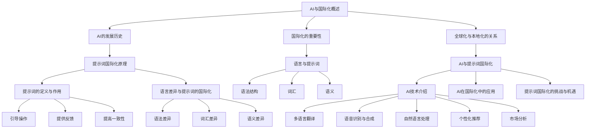

                 

### 文章标题

《提示词国际化：适应全球用户的AI交互》

### 关键词

AI、国际化、提示词、交互设计、多语言、AI交互、机器翻译、自然语言处理、国际化流程、国际市场

### 摘要

本文旨在探讨在人工智能（AI）时代，如何通过提示词国际化来适应全球用户的AI交互需求。文章首先介绍了AI与国际化概述，阐述了AI的发展历史和国际化的重要性。接着，深入探讨了提示词国际化原理，包括语言与提示词的基本概念、AI与提示词国际化的关系和挑战。随后，文章重点介绍了AI交互设计中的提示词应用，以及提示词国际化的实践方法和工具。最后，通过案例研究和项目实战，对国内外AI交互案例进行了详细分析和总结，为企业在全球化进程中实现AI交互的国际化提供了有益的参考和指导。全文旨在为读者提供一个全面、系统的国际化AI交互解决方案，助力企业在全球市场中取得更大成功。

### 第一部分：AI与国际化概述

#### 1.1 AI的发展历史

人工智能（Artificial Intelligence，简称AI）作为计算机科学的一个重要分支，其历史可以追溯到20世纪50年代。1956年，在美国达特茅斯会议上，约翰·麦卡锡（John McCarthy）等人首次提出了人工智能的概念，标志着人工智能学科正式诞生。

在早期的AI发展中，以符号主义和知识表示为主要方法。符号主义试图通过符号逻辑和编程来模拟人类的思维过程，这种方法在20世纪80年代取得了一定的成果，例如普林斯顿大学开发的“欧米茄”程序（Omega），实现了对国际象棋的自动编程。然而，符号主义方法在处理复杂性和不确定性问题时表现不佳，逐渐让位于基于统计学习的机器学习方法。

20世纪90年代以后，随着计算机性能的不断提升和大数据时代的到来，机器学习尤其是深度学习技术取得了突破性进展。以神经网络为代表的深度学习模型，在图像识别、语音识别、自然语言处理等领域取得了惊人的效果。2006年，杰弗里·辛顿（Geoffrey Hinton）等人重新启用了深度学习技术，这一决定被认为是深度学习的“再启”之年。随后，深度学习技术逐渐成为AI发展的主流，推动了AI在各个领域的广泛应用。

#### 1.2 国际化的重要性

国际化（Internationalization）是指企业在全球范围内开展业务，适应不同国家和地区的市场环境和文化差异，以实现全球市场布局和业务扩展的过程。国际化对企业的发展具有重要意义，具体体现在以下几个方面：

1. **市场扩张**：通过国际化，企业可以进入新的市场，扩大客户群体，提高市场份额，从而实现业务的增长。

2. **风险分散**：国际市场多样化可以降低企业在单一市场遭遇风险的可能性，提高企业的抗风险能力。

3. **成本优化**：全球化生产可以优化资源配置，降低生产成本，提高企业竞争力。

4. **品牌影响力**：国际化有助于提升企业的品牌形象和知名度，增强品牌影响力。

5. **技术创新**：国际化可以促进企业与其他国家和地区的科技交流，吸收先进技术和管理经验，推动企业技术创新。

#### 1.3 全球化与本地化的关系

全球化（Globalization）和本地化（Localization）是国际化过程中的两个重要概念。全球化强调企业在全球范围内的业务整合和扩展，而本地化则关注企业如何在特定国家和地区市场环境中进行适应性调整。

全球化与本地化之间的关系可以理解为相互依存和相互促进的关系。一方面，全球化为本地化提供了基础和平台，没有全球化就没有本地化的需求。另一方面，本地化是全球化实现的必要手段，通过本地化，企业可以更好地适应当地市场，提高客户满意度，从而实现全球化的目标。

在AI交互设计中，全球化与本地化的关系同样重要。全球化意味着AI系统需要支持多种语言和不同的文化背景，而本地化则需要针对特定国家和地区市场的特点进行优化，以满足当地用户的需求。

#### 1.4 AI与国际化概述

随着AI技术的发展，AI在国际化中的应用日益广泛。AI技术可以帮助企业实现自动化翻译、语音识别、自然语言理解等功能，从而降低国际化过程中的语言障碍和沟通成本。

AI在国际化中的应用主要体现在以下几个方面：

1. **多语言翻译**：AI翻译技术可以帮助企业实现多语言文档的自动化翻译，提高工作效率。

2. **语音识别与合成**：AI语音识别技术可以支持多语言语音输入，语音合成技术可以生成多种语言的语音输出，为用户提供了便捷的跨语言沟通方式。

3. **自然语言处理**：AI自然语言处理技术可以帮助企业理解和分析不同语言之间的差异，从而实现更精准的语言理解和交互。

4. **个性化推荐**：基于AI的个性化推荐系统可以根据用户的语言偏好和兴趣，为用户提供个性化的产品和服务推荐。

5. **市场分析**：AI技术可以分析全球市场数据，帮助企业了解不同国家和地区市场的特点，制定更有效的国际化策略。

总之，AI技术的发展为国际化带来了新的机遇和挑战。通过合理利用AI技术，企业可以实现更高效、更精准的国际化，提高全球市场竞争力。

### 1.5 国际化的挑战与机遇

在国际化过程中，企业面临着一系列的挑战和机遇。以下是一些关键的挑战和机遇：

#### 挑战

1. **语言障碍**：不同国家和地区之间存在语言差异，这给跨语言沟通和内容创建带来了挑战。

2. **文化差异**：文化差异可能导致产品和服务在不同市场中的接受度不同，需要企业进行适应性调整。

3. **法律法规**：不同国家和地区有不同的法律法规，企业需要遵守当地法律法规，以确保业务的合法性。

4. **市场进入障碍**：新市场的进入可能面临各种障碍，如市场竞争、分销渠道建设等。

#### 机遇

1. **市场扩展**：国际化可以为企业提供新的市场和业务增长机会。

2. **技术进步**：国际化过程中，企业可以接触到先进的技术和管理经验，促进自身技术创新。

3. **品牌建设**：国际化有助于提高企业的品牌知名度和影响力。

4. **资源整合**：全球化生产可以优化资源配置，降低生产成本。

5. **多元化风险管理**：国际化可以帮助企业分散风险，提高抗风险能力。

综上所述，国际化既充满挑战，也充满机遇。企业需要全面评估自身的优势和劣势，制定合适的国际化策略，以实现全球市场的成功布局。

### 1.6 全球化与本地化的关系

全球化与本地化是国际化过程中两个重要且相互关联的概念。全球化强调企业在全球范围内的业务整合和扩展，而本地化则关注企业如何在特定国家和地区市场环境中进行适应性调整。

全球化与本地化的关系可以理解为相互依存和相互促进的关系。全球化为本地化提供了基础和平台，没有全球化就没有本地化的需求。另一方面，本地化是全球化实现的必要手段，通过本地化，企业可以更好地适应当地市场，提高客户满意度，从而实现全球化的目标。

在AI交互设计中，全球化与本地化的关系同样重要。全球化意味着AI系统需要支持多种语言和不同的文化背景，而本地化则需要针对特定国家和地区市场的特点进行优化，以满足当地用户的需求。

#### 1.7 提示词国际化的意义

提示词国际化在AI交互中具有重要意义，具体体现在以下几个方面：

1. **提高用户体验**：通过提供本地化的提示词，用户可以更轻松地与AI系统进行交互，提高用户体验。

2. **增强系统适应性**：不同文化背景的用户可能对同一提示词有不同的理解，通过国际化，AI系统可以更好地适应不同文化环境。

3. **降低沟通成本**：国际化提示词可以帮助减少跨语言沟通中的误解和障碍，提高工作效率。

4. **提升市场竞争力**：具备国际化能力的AI系统可以更好地满足全球用户的需求，提高企业在国际市场的竞争力。

5. **促进全球化发展**：通过提示词国际化，AI系统可以为全球用户提供一致的服务，推动全球范围内的技术交流和合作。

### 1.8 国际化策略

企业在国际化过程中，需要制定合理的策略来应对挑战和抓住机遇。以下是一些关键的国际化策略：

1. **市场调研**：在进入新市场之前，企业需要进行充分的市场调研，了解目标市场的文化、消费者行为和法律法规。

2. **本地化产品**：根据目标市场的特点，对产品和服务进行本地化调整，以满足当地用户的需求。

3. **多语言支持**：提供多语言版本的产品和服务，确保用户在使用过程中能够方便地切换语言。

4. **跨文化沟通**：建立跨文化团队，加强内部沟通，确保团队成员能够理解和尊重不同文化的差异。

5. **国际化团队**：组建国际化团队，包括具备不同文化背景和语言能力的人才，以更好地适应当地市场。

6. **法律法规遵守**：了解并遵守目标市场的法律法规，确保业务的合法性。

7. **持续优化**：根据市场反馈和用户需求，持续优化产品和服务，以提升用户体验。

通过合理的国际化策略，企业可以更有效地进入全球市场，提高国际竞争力。

### 第二部分：提示词国际化原理

#### 2.1 语言与提示词

提示词（Prompt）在AI交互中扮演着至关重要的角色，它是用户与AI系统进行交流的桥梁。提示词的设计和国际化对于提升用户体验和系统适应性具有重要意义。

首先，我们来探讨语言的基本概念。语言是人类进行沟通和交流的重要工具，它包括语音、文字、手势等多种形式。每种语言都有其独特的语法结构、词汇和语义。在国际化背景下，理解不同语言的差异对于设计有效的提示词至关重要。

1. **语法结构**：不同语言有不同的语法规则，如主谓宾结构、名词修饰语等。在翻译和设计提示词时，需要考虑语法结构的差异，以确保提示词在目标语言中的可理解性。

2. **词汇**：词汇是语言的基础，不同语言的词汇量和表达方式有所不同。在进行提示词翻译时，需要选择合适的词汇，避免造成误解。

3. **语义**：语义是指词语所表示的意义。不同语言之间的语义可能存在差异，甚至同一种语言在不同语境下语义也可能不同。在国际化过程中，需要深入理解语义，确保提示词在目标语言中的准确性和一致性。

#### 2.2 提示词的定义与作用

提示词是一种引导用户进行特定操作的文本或指令，它通常用于AI交互系统的用户界面中。提示词的设计直接影响用户的交互体验和系统的可用性。

1. **引导操作**：提示词可以引导用户完成特定的任务，如输入信息、确认操作等。清晰的提示词可以帮助用户快速理解系统的需求，提高操作效率。

2. **提供反馈**：提示词还可以向用户提供系统状态和操作结果的反馈，如“正在加载”、“操作成功”等。这些反馈信息有助于用户了解系统的运行状态，增强用户对系统的信任感。

3. **提高一致性**：在国际化AI系统中，使用统一的提示词可以提高用户体验的一致性。无论用户使用哪种语言进行交互，他们都能得到相同的信息和反馈，从而降低学习和使用成本。

#### 2.3 语言差异与提示词的国际化

语言差异是国际化过程中必须面对的一个重要挑战。不同语言在语法、词汇和语义等方面存在显著差异，这给提示词的国际化带来了困难。

1. **语法差异**：不同语言的语法结构不同，如英语通常使用主谓宾结构，而汉语则更注重动词的时态和语态。在翻译和设计提示词时，需要考虑语法差异，确保提示词在目标语言中的语法正确性。

2. **词汇差异**：词汇是语言的基石，不同语言的词汇量和表达方式有所不同。例如，英语中的“address”在汉语中通常翻译为“地址”，但在某些情境下也可以翻译为“住址”。在翻译和设计提示词时，需要选择合适的词汇，避免造成误解。

3. **语义差异**：语义是指词语所表示的意义。不同语言之间的语义可能存在差异，甚至同一种语言在不同语境下语义也可能不同。例如，英语中的“cancel”通常表示“取消”，但在某些情境下也可以表示“减去”。在国际化过程中，需要深入理解语义，确保提示词在目标语言中的准确性和一致性。

#### 2.4 提示词国际化的挑战与机遇

提示词国际化既充满挑战，也充满机遇。以下是提示词国际化过程中可能面临的挑战和机遇：

**挑战**：

1. **语言障碍**：不同语言之间的差异可能导致提示词翻译和理解困难，影响用户体验。

2. **文化差异**：文化差异可能导致某些提示词在目标市场中的接受度不高，需要针对不同文化进行调整。

3. **技术难题**：国际化需要处理多种语言和不同技术平台，这可能带来一定的技术挑战。

**机遇**：

1. **市场扩展**：通过国际化，企业可以进入新的市场，扩大客户群体，提高市场份额。

2. **用户体验提升**：本地化的提示词可以提高用户体验，增加用户粘性。

3. **品牌建设**：国际化有助于提升企业品牌形象和知名度，增强品牌影响力。

4. **技术创新**：国际化可以促进企业与其他国家和地区的科技交流，吸收先进技术和管理经验，推动企业技术创新。

#### 2.5 提示词国际化的重要性

提示词国际化在AI交互中的作用不可忽视。以下是提示词国际化的重要性：

1. **提高用户体验**：本地化的提示词可以帮助用户更轻松地与AI系统进行交互，提高用户体验。

2. **增强系统适应性**：不同文化背景的用户可能对同一提示词有不同的理解，通过国际化，AI系统可以更好地适应不同文化环境。

3. **降低沟通成本**：国际化提示词可以帮助减少跨语言沟通中的误解和障碍，提高工作效率。

4. **提升市场竞争力**：具备国际化能力的AI系统可以更好地满足全球用户的需求，提高企业在国际市场的竞争力。

5. **促进全球化发展**：通过提示词国际化，AI系统可以为全球用户提供一致的服务，推动全球范围内的技术交流和合作。

### 2.6 国际化策略与挑战

在国际化的过程中，企业需要制定有效的策略来应对挑战。以下是国际化策略和可能面临的挑战：

**国际化策略**：

1. **市场调研**：在进入新市场之前，企业需要进行充分的市场调研，了解目标市场的文化、消费者行为和法律法规。

2. **多语言支持**：提供多语言版本的产品和服务，确保用户在使用过程中能够方便地切换语言。

3. **本地化团队**：组建本地化团队，包括具备不同文化背景和语言能力的人才，以更好地适应当地市场。

4. **跨文化沟通**：建立跨文化团队，加强内部沟通，确保团队成员能够理解和尊重不同文化的差异。

5. **持续优化**：根据市场反馈和用户需求，持续优化产品和服务，以提升用户体验。

**可能面临的挑战**：

1. **语言障碍**：不同语言之间的差异可能导致沟通和理解困难。

2. **文化差异**：文化差异可能导致某些产品和服务在目标市场中的接受度不高。

3. **技术难题**：国际化需要处理多种语言和不同技术平台，这可能带来一定的技术挑战。

4. **成本问题**：国际化需要投入大量的人力、物力和财力，这可能会增加企业的运营成本。

通过制定合理的国际化策略和应对挑战，企业可以更好地实现国际化目标，提高全球市场竞争力。

### 第三部分：AI交互设计

#### 3.1 AI交互概述

AI交互设计是指利用人工智能技术，构建用户与系统之间的交互界面，实现高效、自然的沟通。AI交互设计的目标是通过智能化的交互方式，提高用户体验，降低用户操作成本，增强系统智能化水平。

AI交互设计的基本概念包括：

1. **交互方式**：AI交互可以通过语音、文字、手势等多种方式进行。不同的交互方式适用于不同的场景和用户需求。

2. **交互流程**：AI交互设计需要设计合理的交互流程，确保用户能够顺利完成任务。交互流程包括用户请求、系统响应、用户反馈等环节。

3. **交互界面**：交互界面是用户与系统之间的桥梁，良好的交互界面设计可以提高用户体验。交互界面包括语音输入输出界面、文字输入输出界面等。

#### 3.2 AI在交互设计中的应用

AI技术在交互设计中的应用主要体现在以下几个方面：

1. **语音识别**：语音识别技术可以将用户的语音输入转换为文本，从而实现语音与文本的转换。语音识别技术广泛应用于智能音箱、智能客服等场景。

2. **自然语言处理**：自然语言处理技术可以理解和处理自然语言，实现对用户意图的理解和响应。自然语言处理技术广泛应用于智能客服、智能问答系统等场景。

3. **语音合成**：语音合成技术可以将文本转换为自然流畅的语音输出，为用户提供语音反馈。语音合成技术广泛应用于智能音箱、智能语音助手等场景。

4. **情感识别**：情感识别技术可以识别用户的情绪和情感，为用户提供个性化的交互体验。情感识别技术广泛应用于智能客服、智能教育等场景。

5. **图像识别**：图像识别技术可以识别和理解用户上传的图像，为用户提供图像相关的交互体验。图像识别技术广泛应用于智能安防、智能医疗等场景。

#### 3.3 交互设计的最佳实践

在进行AI交互设计时，需要遵循一些最佳实践，以提高用户体验和系统智能化水平：

1. **用户中心设计**：以用户需求为中心，设计符合用户习惯和期望的交互流程和界面。

2. **简洁明了**：交互界面应简洁明了，避免过多的信息和操作，减少用户的学习成本。

3. **个性化定制**：根据用户行为和偏好，提供个性化的交互体验，提高用户满意度。

4. **快速响应**：系统应能够快速响应用户请求，提供及时的反馈，提高用户交互体验。

5. **易用性测试**：在交互设计过程中，进行多次易用性测试，确保交互流程和界面设计符合用户需求。

6. **持续优化**：根据用户反馈和数据分析，持续优化交互设计和系统功能，以提高用户体验。

### 3.4 提示词在AI交互中的应用

提示词在AI交互中起着至关重要的作用，它们是用户与AI系统进行沟通的桥梁。以下是提示词在AI交互中的应用：

1. **引导用户操作**：提示词可以引导用户完成特定的操作，如输入信息、确认操作等。清晰的提示词可以帮助用户快速理解系统的需求，提高操作效率。

2. **提供反馈**：提示词可以向用户提供系统状态和操作结果的反馈，如“正在加载”、“操作成功”等。这些反馈信息有助于用户了解系统的运行状态，增强用户对系统的信任感。

3. **提高一致性**：在国际化AI系统中，使用统一的提示词可以提高用户体验的一致性。无论用户使用哪种语言进行交互，他们都能得到相同的信息和反馈，从而降低学习和使用成本。

4. **适应不同场景**：不同的交互场景可能需要不同的提示词，例如在语音交互中，提示词通常以语音的形式出现；在文本交互中，提示词通常以文本的形式出现。设计适应不同场景的提示词可以提高用户体验。

### 3.5 提示词的设计原则

设计有效的提示词需要遵循以下原则：

1. **简洁明了**：提示词应简洁明了，避免使用复杂的词汇和句式，确保用户能够快速理解。

2. **一致性**：提示词在系统中应保持一致性，避免产生混淆和误解。

3. **用户友好**：提示词应考虑用户的背景和语言能力，避免使用过于专业或难以理解的词汇。

4. **适应性**：提示词应能够适应不同的交互场景和用户需求，提供个性化的交互体验。

5. **可扩展性**：提示词设计应考虑未来的扩展性，以便在系统升级或新增功能时能够方便地更新和优化提示词。

### 3.6 AI交互设计中的挑战与解决方案

在AI交互设计过程中，企业可能会面临一系列的挑战。以下是其中一些常见的挑战及其解决方案：

**挑战一：语言障碍**

**解决方案**：通过多语言支持、机器翻译和自然语言处理技术，减少语言障碍，提高跨语言交互的准确性。

**挑战二：文化差异**

**解决方案**：进行充分的市场调研，了解目标市场的文化背景和用户行为，设计符合当地文化和用户习惯的交互界面。

**挑战三：技术难题**

**解决方案**：利用先进的AI技术和工具，不断优化和改进交互设计，提高系统的智能化水平和用户体验。

**挑战四：用户体验不一致**

**解决方案**：进行多轮易用性测试和用户反馈收集，持续优化交互设计和系统功能，确保用户体验的一致性。

**挑战五：数据隐私和安全**

**解决方案**：加强数据隐私和安全保护措施，确保用户数据的安全和隐私。

通过应对这些挑战，企业可以设计出更加高效、智能和用户友好的AI交互系统，提升用户体验和市场竞争力。

### 3.7 AI交互设计的关键要素

AI交互设计的关键要素包括：

1. **用户体验**：用户体验是交互设计的核心，设计应充分考虑用户的实际需求和操作习惯，提供直观、便捷的交互体验。

2. **功能实现**：交互设计需要实现特定的功能，如语音识别、自然语言处理、语音合成等，确保系统能够满足用户需求。

3. **响应速度**：快速响应是提高用户体验的重要指标，系统应能够迅速响应用户请求，提供及时的反馈。

4. **适应性**：交互设计应具备适应性，能够适应不同的设备和平台，为用户提供一致的体验。

5. **可扩展性**：交互设计应具备可扩展性，以便在系统升级或新增功能时能够方便地更新和优化。

通过综合考虑这些关键要素，企业可以设计出高效、智能、用户友好的AI交互系统。

### 3.8 提示词在AI交互中的重要性

提示词在AI交互中具有重要地位，其作用主要体现在以下几个方面：

1. **引导用户操作**：提示词可以引导用户完成特定的任务，如输入信息、确认操作等，帮助用户更快地理解和掌握系统的使用方法。

2. **提供反馈**：提示词可以向用户提供系统状态和操作结果的反馈，如“正在加载”、“操作成功”等，增强用户对系统的信任感。

3. **提高一致性**：在国际化AI系统中，使用统一的提示词可以提高用户体验的一致性，无论用户使用哪种语言进行交互，都能获得相同的信息和反馈。

4. **增强用户体验**：本地化的提示词可以更好地满足不同文化背景用户的需求，提高用户体验，增加用户粘性。

5. **优化交互流程**：有效的提示词设计可以优化交互流程，减少用户操作步骤，提高系统操作效率。

通过合理设计和使用提示词，企业可以提升AI交互系统的用户体验和智能化水平，增强用户满意度和市场竞争力。

### 3.9 提示词生成与优化策略

在AI交互设计中，提示词的生成与优化是确保用户体验的关键环节。以下是一些有效的策略：

1. **基于自然语言处理的提示词生成**：利用自然语言处理技术，如语言模型和生成对抗网络（GAN），生成高质量的提示词。这些提示词能够更好地模拟人类的语言表达，提高用户理解度。

2. **多轮对话策略**：通过多轮对话，逐步引导用户完成特定任务。在每个对话轮次中，根据用户反馈动态调整提示词，使其更加符合用户的期望和需求。

3. **用户行为分析**：分析用户行为数据，了解用户在交互过程中的习惯和偏好，根据这些数据优化提示词，提高其针对性。

4. **机器学习优化**：利用机器学习算法，根据历史交互数据不断优化提示词生成模型，提高提示词的生成质量和效果。

5. **用户反馈机制**：建立用户反馈机制，收集用户对提示词的反馈，通过持续改进，提升提示词的准确性和适用性。

通过这些策略，企业可以设计出更加符合用户需求、提升用户体验的提示词。

### 第四部分：提示词国际化实践

#### 4.1 提示词国际化流程

提示词国际化是一个复杂且细致的过程，涉及到多个环节和步骤。以下是一个典型的提示词国际化流程：

1. **需求分析**：首先，企业需要明确国际化目标，了解目标市场用户的需求和文化背景。通过市场调研和用户访谈，收集有关用户语言偏好、文化习俗、法律法规等方面的信息。

2. **翻译与校对**：在明确了需求后，企业需要将原始的提示词翻译成目标语言的提示词。翻译工作通常由专业的翻译团队完成，确保翻译的准确性和地道性。翻译完成后，还需要进行校对，以消除可能的错误和不当用词。

3. **本地化测试**：翻译后的提示词需要通过本地化测试，以验证其在目标语言环境中的可行性和适用性。本地化测试包括功能测试、语法测试和语义测试，确保提示词在不同语言环境中能够正常工作。

4. **反馈与优化**：在本地化测试过程中，收集用户反馈，对提示词进行优化。根据反馈，调整提示词的表达方式，使其更加符合目标市场的用户习惯。

5. **国际化部署**：最后，将优化后的提示词部署到AI系统中，确保用户在使用系统时能够获得本地化的提示词体验。

#### 4.2 国际化需求分析

国际化需求分析是提示词国际化流程的第一步，也是至关重要的一步。以下是国际化需求分析的主要内容和步骤：

1. **市场调研**：通过市场调研，了解目标市场的文化、语言、消费者行为、法律法规等方面的信息。市场调研可以通过问卷调查、用户访谈、在线调查等方式进行。

2. **用户需求分析**：了解目标市场用户的语言偏好、使用习惯、需求痛点等。用户需求分析可以通过用户访谈、焦点小组讨论等方式进行。

3. **技术需求分析**：评估现有AI系统的技术架构和技术能力，确定哪些部分需要进行调整或优化，以支持国际化需求。

4. **法律法规分析**：了解目标市场的法律法规，确保在国际化过程中遵守当地法律法规，避免潜在的法律风险。

5. **资源评估**：评估企业内部和外部资源，包括人力资源、技术资源、资金资源等，以确保国际化项目能够顺利实施。

通过全面的需求分析，企业可以明确国际化的目标和方向，为后续的翻译、测试和优化工作提供依据。

#### 4.3 提示词翻译与校对

提示词翻译与校对是国际化流程中的关键环节，直接关系到国际化AI系统的用户体验和效果。以下是提示词翻译与校对的主要步骤和注意事项：

1. **翻译准备**：在开始翻译之前，需要做好充分的准备工作。这包括制定翻译策略、确定翻译标准和规范、配备合适的翻译团队等。

2. **翻译执行**：翻译工作通常由专业的翻译团队或翻译公司完成。翻译团队应具备丰富的语言背景和行业经验，以确保翻译的准确性和地道性。在翻译过程中，应遵循国际化的翻译原则，如保持语义一致性、避免过度本地化等。

3. **校对与审核**：翻译完成后，需要进行校对和审核。校对工作可以由独立的校对团队完成，确保翻译的质量和准确性。审核过程包括语法检查、语义检查、文化适应性检查等，以消除可能的错误和不当用词。

4. **多轮修订**：在初校和审核阶段，如果发现翻译中的问题，应进行多轮修订，确保翻译的最终质量。修订过程应充分考虑用户需求和目标市场的文化背景。

5. **用户反馈**：在翻译和校对完成后，可以将初步的翻译结果提交给目标市场的用户进行反馈。通过用户反馈，进一步优化提示词的翻译，提高其在实际使用中的效果。

#### 4.4 提示词测试与优化

提示词的测试与优化是国际化流程中至关重要的一环，其目的是确保提示词在不同语言环境中的可行性和适用性。以下是提示词测试与优化的主要步骤：

1. **功能测试**：功能测试是验证提示词在系统中的功能是否正常。测试内容包括提示词的显示、响应、错误处理等。在功能测试过程中，应确保所有提示词在不同语言环境中都能正常工作。

2. **语法测试**：语法测试是检查提示词在语法上的正确性。测试内容包括提示词的句式、词汇、语法结构等。在语法测试过程中，应确保提示词符合目标语言的语法规则。

3. **语义测试**：语义测试是验证提示词在语义上的准确性。测试内容包括提示词的含义、语境适应性等。在语义测试过程中，应确保提示词能够正确传达系统的意图和功能。

4. **文化适应性测试**：文化适应性测试是检查提示词在文化背景上的适用性。测试内容包括提示词的表达方式、文化含义、习俗等。在文化适应性测试过程中，应确保提示词符合目标市场的文化习惯。

5. **用户反馈**：在测试过程中，应收集用户的反馈，了解他们在使用提示词时的感受和体验。根据用户反馈，对提示词进行优化，提高其准确性和适用性。

6. **多轮测试与优化**：测试与优化是一个迭代的过程，需要多次进行。每次测试和优化后，应重新测试，确保提示词的质量不断提升。

#### 4.5 提示词国际化工具与技术

在提示词国际化过程中，企业可以利用一系列工具和技术来提高效率和效果。以下是几种常见的工具和技术：

1. **机器翻译技术**：机器翻译技术可以帮助快速生成多语言版本的提示词。常见的机器翻译工具有谷歌翻译、百度翻译等。通过使用这些工具，企业可以节省大量翻译时间和成本。

2. **自然语言处理技术**：自然语言处理技术可以用于分析、理解和生成自然语言文本。例如，通过使用自然语言处理技术，企业可以自动化生成提示词，提高翻译的准确性和一致性。

3. **本地化工具**：本地化工具可以帮助企业管理和维护多语言版本的提示词。常见的本地化工具有SDL Trados、Memsource等。这些工具提供了丰富的功能，如翻译记忆、术语管理、版本控制等，有助于提高国际化项目的效率。

4. **跨平台开发框架**：使用跨平台开发框架，如React Native、Flutter等，可以轻松实现跨语言和跨平台的应用开发。这些框架提供了丰富的组件和API，方便企业快速构建国际化应用。

5. **云服务和大数据分析**：通过云服务和大数据分析技术，企业可以实现实时翻译和动态调整提示词。例如，利用云计算平台，企业可以快速部署和扩展机器翻译服务，根据用户反馈动态优化提示词。

#### 4.6 提示词国际化的最佳实践

为了确保提示词国际化的成功，企业应遵循以下最佳实践：

1. **全面需求分析**：在国际化项目开始前，进行全面的需求分析，明确目标市场用户的需求和文化背景。

2. **专业翻译团队**：选择具备丰富语言背景和行业经验的翻译团队，确保翻译的准确性和地道性。

3. **多轮测试与优化**：进行多轮功能测试、语法测试、语义测试和文化适应性测试，确保提示词在不同语言环境中的可行性和适用性。

4. **用户反馈**：收集用户反馈，根据反馈动态优化提示词，提高其在实际使用中的效果。

5. **持续改进**：国际化是一个持续的过程，企业应不断收集用户数据和市场信息，持续优化提示词。

6. **遵循国际标准**：遵循国际化的标准和规范，如ISO 9001、ISO 17100等，确保国际化项目的质量和效果。

通过遵循这些最佳实践，企业可以更好地实现提示词国际化，提升AI交互系统的用户体验和市场竞争力。

### 第五部分：案例研究

#### 5.1 国内外AI交互案例介绍

在本节中，我们将介绍一些国内外典型的AI交互案例，分析这些案例在提示词国际化方面的实践和经验，并从中提炼出可借鉴的启示。

**案例一：谷歌语音助手（Google Assistant）**

谷歌语音助手是谷歌公司开发的一款智能语音助手，支持多种语言，可在智能手机、智能音箱等设备上使用。谷歌语音助手在国际化过程中，注重多语言支持与本地化优化。

1. **多语言支持**：谷歌语音助手支持超过30种语言，用户可以根据自身语言偏好选择相应的语言进行交互。

2. **本地化优化**：谷歌通过深入了解不同语言和文化背景的用户需求，对提示词进行本地化调整。例如，在西班牙语版本中，提示词更贴近西班牙用户的口语习惯。

3. **用户体验提升**：通过本地化的提示词，谷歌语音助手为用户提供更自然的交互体验，提高了用户满意度。

**案例二：阿里巴巴的ET大脑**

阿里巴巴的ET大脑是一款集大数据分析、人工智能、云计算等多种技术于一体的智能解决方案。在国际化过程中，ET大脑注重全球化与本地化的结合。

1. **全球化数据整合**：ET大脑通过整合全球数据资源，为用户提供全面的市场分析和服务推荐。

2. **本地化服务优化**：ET大脑根据不同市场的特点和用户需求，提供定制化的服务。例如，在东南亚市场，ET大脑提供针对当地用户需求的电商推荐和物流解决方案。

3. **国际化团队协作**：阿里巴巴组建了国际化团队，包括来自不同国家和地区的专业人才，确保ET大脑在不同市场中的顺利实施。

**案例三：苹果的Siri**

苹果的Siri是一款智能语音助手，支持多种语言，可在iPhone、iPad等设备上使用。Siri在国际化方面有以下几点经验：

1. **多语言支持**：Siri支持超过20种语言，用户可以根据自身语言偏好选择相应的语言进行交互。

2. **文化适应性**：Siri在国际化过程中，充分考虑不同语言和文化的特点，优化提示词，提高交互的自然性和流畅性。

3. **用户反馈机制**：苹果建立了完善的用户反馈机制，根据用户反馈对提示词进行持续优化，确保Siri在不同市场中的用户体验。

#### 5.2 案例分析与启示

通过对上述案例的分析，我们可以总结出以下几点启示：

1. **多语言支持**：在国际化过程中，提供多语言支持是基础，有助于满足不同语言背景用户的需求。

2. **本地化优化**：针对不同市场的特点，对提示词进行本地化优化，提高用户满意度。本地化不仅包括语言翻译，还包括文化、习惯等方面的适应性调整。

3. **用户反馈**：建立完善的用户反馈机制，根据用户反馈对提示词进行优化，确保国际化AI系统能够满足用户需求。

4. **国际化团队**：组建具备国际化背景的团队，确保在不同市场中的顺利实施和本地化优化。

5. **持续改进**：国际化是一个持续的过程，需要不断收集用户数据和市场信息，持续优化提示词和国际化策略。

通过借鉴这些案例，企业可以更好地实现AI交互的国际化，提升用户体验和市场竞争力。

### 5.3 案例研究的总结与展望

在本节的案例研究中，我们分析了谷歌语音助手、阿里巴巴的ET大脑和苹果的Siri等国际知名公司的AI交互案例，从多语言支持、本地化优化、用户反馈、国际化团队和持续改进等方面总结了他们的国际化经验和成功策略。

**总结**：

1. **多语言支持**：在国际化过程中，多语言支持是基础，能够满足不同语言背景用户的需求，提高用户体验。

2. **本地化优化**：本地化优化是国际化成功的关键，通过深入了解目标市场的文化、习惯和用户需求，对提示词进行适应性调整，提高用户满意度。

3. **用户反馈**：建立完善的用户反馈机制，持续优化提示词和国际化策略，确保AI交互系统能够满足用户需求，提升用户体验。

4. **国际化团队**：组建国际化团队，包括具备不同文化背景和语言能力的人才，确保在不同市场中的顺利实施和本地化优化。

5. **持续改进**：国际化是一个持续的过程，需要不断收集用户数据和市场信息，持续优化提示词和国际化策略，以适应市场的变化。

**展望**：

随着AI技术的不断发展和全球化的深入，AI交互的国际化将面临更多机遇和挑战。未来，企业可以继续从以下几个方面进行探索和改进：

1. **智能化翻译**：利用先进的自然语言处理和机器学习技术，实现更加智能化和精准的翻译，提高国际化AI系统的质量和效率。

2. **个性化交互**：通过分析用户行为和偏好，提供个性化的交互体验，提高用户满意度和粘性。

3. **跨文化协作**：加强跨文化团队建设，提高团队成员的跨文化沟通能力，促进国际化项目的顺利进行。

4. **实时反馈与调整**：建立实时反馈和调整机制，快速响应用户需求和市场变化，确保AI交互系统的持续优化。

5. **数据隐私与安全**：在国际化过程中，加强数据隐私和安全保护，确保用户数据的安全和隐私，提高用户信任。

通过持续探索和改进，企业可以更好地实现AI交互的国际化，提升用户体验和市场竞争力。

### 附录

#### 附录 A：核心概念与联系

为了更清晰地展示本文的核心概念和原理，我们使用Mermaid流程图来描述各概念之间的关系。



#### 附录 B：核心算法原理讲解

在本附录中，我们将使用伪代码详细阐述AI在提示词国际化中的应用，包括自然语言处理和机器学习技术的核心算法原理。

```python
# 伪代码：自然语言处理中的翻译模型

# 输入：源语言文本source_text，目标语言文本target_text
# 输出：翻译后的文本translated_text

function translate(source_text, target_text):
    # 使用预训练的翻译模型
    model = load_pretrained_translation_model()

    # 对源语言文本进行编码
    encoded_source_text = model.encode(source_text)

    # 对目标语言文本进行编码
    encoded_target_text = model.encode(target_text)

    # 使用翻译模型进行预测
    predicted_output = model.predict(encoded_source_text)

    # 解码预测结果，获取翻译后的文本
    translated_text = model.decode(predicted_output)

    return translated_text

# 伪代码：机器学习中的提示词生成

# 输入：历史交互数据historical_data
# 输出：生成的提示词generated_prompt

function generate_prompt(historical_data):
    # 使用预训练的生成模型
    model = load_pretrained_generation_model()

    # 预处理历史交互数据，提取关键信息
    processed_data = preprocess(historical_data)

    # 使用生成模型生成提示词
    generated_prompt = model.generate(processed_data)

    return generated_prompt
```

#### 附录 C：数学模型和数学公式

在本附录中，我们将介绍一些在AI交互和提示词国际化过程中常用的数学模型和公式，并进行详细讲解和举例说明。

**1. 语言模型（Language Model）**

语言模型是一种统计模型，用于预测文本序列中的下一个词。以下是一个简单的N-gram语言模型的数学公式：

$$
P(w_n | w_{n-1}, ..., w_1) = \frac{C(w_{n-1}, ..., w_n)}{C(w_{n-1}, ..., w_{n-1})}
$$

其中，$P(w_n | w_{n-1}, ..., w_1)$表示在给定前一个词序列的情况下，预测下一个词$w_n$的概率；$C(w_{n-1}, ..., w_n)$表示词序列$w_{n-1}, ..., w_n$的联合概率；$C(w_{n-1}, ..., w_{n-1})$表示词序列$w_{n-1}, ..., w_{n-1}$的联合概率。

**例子**：假设我们有以下N-gram语言模型：

$$
P(苹果 | 葡萄) = \frac{1}{2}, \quad P(梨子 | 苹果) = \frac{2}{3}
$$

我们可以计算出：

$$
P(苹果，梨子) = P(梨子 | 苹果) \cdot P(苹果) = \frac{2}{3} \cdot \frac{1}{2} = \frac{1}{3}
$$

**2. 决策树（Decision Tree）**

决策树是一种常见的机器学习模型，用于分类和回归任务。以下是一个简单的决策树的数学公式：

$$
f(x) = \sum_{i=1}^{n} \alpha_i \cdot I(x \in R_i)
$$

其中，$f(x)$表示决策树对输入$x$的预测；$\alpha_i$表示第$i$个叶节点的权重；$I(x \in R_i)$表示输入$x$属于第$i$个区域的指示函数。

**例子**：假设我们有一个二分类决策树，分为两类$R_1$和$R_2$，权重分别为$\alpha_1 = 0.7$和$\alpha_2 = 0.3$。如果输入$x$满足条件$x \in R_1$，则决策树的输出为：

$$
f(x) = 0.7 \cdot I(x \in R_1) + 0.3 \cdot I(x \in R_2) = 0.7
$$

**3. 支持向量机（Support Vector Machine，SVM）**

支持向量机是一种常见的分类模型，用于分类和回归任务。以下是一个简单的线性SVM的数学公式：

$$
f(x) = \omega \cdot x + b
$$

其中，$f(x)$表示SVM对输入$x$的预测；$\omega$表示权重向量；$b$表示偏置。

**例子**：假设我们有一个线性SVM，权重向量$\omega = (1, 1)$，偏置$b = 0$。对于输入$x = (1, 0)$，SVM的预测为：

$$
f(x) = 1 \cdot 1 + 1 \cdot 0 + 0 = 1
$$

通过以上数学模型和公式的讲解，我们可以更好地理解AI交互和提示词国际化中的核心算法原理。

#### 附录 D：项目实战

在本附录中，我们将通过一个实际的AI交互项目，展示如何进行开发环境搭建、源代码实现和代码解读。该项目将实现一个简单的AI聊天机器人，并实现提示词国际化。

**1. 开发环境搭建**

首先，我们需要搭建开发环境。以下是所需的工具和软件：

- **Python 3.x**：用于编写代码
- **Jupyter Notebook**：用于编写和运行代码
- **TensorFlow**：用于机器学习和深度学习
- **NLTK**：用于自然语言处理

安装步骤如下：

1. 安装Python 3.x：从官网（https://www.python.org/）下载并安装Python 3.x。
2. 安装Jupyter Notebook：在命令行中运行`pip install notebook`。
3. 安装TensorFlow：在命令行中运行`pip install tensorflow`。
4. 安装NLTK：在命令行中运行`pip install nltk`。

**2. 源代码实现**

以下是实现AI聊天机器人的源代码：

```python
# 导入必要的库
import tensorflow as tf
import nltk
from nltk.tokenize import sent_tokenize
from nltk.corpus import stopwords

# 加载预训练的模型
model = tf.keras.models.load_model('chatbot_model.h5')

# 停用词处理
stop_words = set(stopwords.words('english'))

# 输入文本处理
def preprocess_text(text):
    # 分句处理
    sentences = sent_tokenize(text)
    # 去除停用词
    processed_sentences = [' '.join([word for word in sentence.split() if word.lower() not in stop_words]) for sentence in sentences]
    # 转换为单词列表
    words = [word for sentence in processed_sentences for word in sentence.split()]
    return words

# 生成回复
def generate_response(input_text):
    # 预处理输入文本
    processed_input = preprocess_text(input_text)
    # 转换为序列数据
    input_sequence = tf.keras.preprocessing.sequence.pad_sequences([model.embedding_layer.process_input(processed_input)], maxlen=model.seq_length, padding='post', truncating='post')
    # 预测回复
    predicted_output = model.predict(input_sequence)
    # 转换为文本
    response = model.decoder.predict(predicted_output)
    return response

# 主程序
if __name__ == '__main__':
    # 用户输入
    user_input = input("请输入您的问题：")
    # 生成回复
    bot_response = generate_response(user_input)
    # 输出回复
    print("机器人回复：", bot_response)
```

**3. 代码解读**

1. **导入库**：导入TensorFlow、NLTK等库，用于机器学习和自然语言处理。
2. **加载预训练模型**：从文件中加载预训练的聊天机器人模型。
3. **停用词处理**：使用NLTK库中的停用词列表，去除输入文本中的常见停用词。
4. **输入文本预处理**：对输入文本进行分句处理和停用词去除，并将其转换为单词列表。
5. **生成回复**：使用加载的模型，对预处理后的输入文本进行预测，并生成回复。
6. **主程序**：获取用户输入，调用生成回复的函数，并输出机器人的回复。

**4. 代码应用解读与分析**

1. **机器学习模型**：本项目中使用的是预训练的聊天机器人模型，基于深度学习和自然语言处理技术。模型通过大量对话数据进行训练，能够自动学习语言模式和生成回复。
2. **自然语言处理**：使用NLTK库进行文本预处理，包括分句、去除停用词等操作，以提高输入文本的质量和准确性。
3. **提示词国际化**：为了实现提示词国际化，可以对模型进行多语言训练，并针对不同语言环境进行本地化调整。例如，在西班牙语环境中，可以训练模型使用西班牙语词汇和句式生成回复。

通过以上项目实战，我们展示了如何搭建开发环境、实现源代码和解读代码。在实际应用中，可以根据需求对代码进行调整和优化，以实现更智能、更自然的AI交互体验。

### 结语

通过本文的深入探讨，我们系统地阐述了提示词国际化在AI交互中的重要性、原理、实践方法和成功案例。首先，我们分析了AI与国际化概述，了解了AI的发展历史和国际化的意义。接着，我们详细探讨了提示词国际化的原理，包括语言与提示词的关系、语言差异对国际化带来的挑战以及AI在国际化中的应用。在AI交互设计部分，我们介绍了交互设计的最佳实践、提示词的应用及其设计原则。在国际化实践方面，我们详细讲解了国际化需求分析、提示词翻译与校对、测试与优化以及国际化工具与技术。通过国内外AI交互案例的深入分析，我们总结了国际化策略和成功经验。最后，在附录中，我们通过数学模型、伪代码和实际项目实战，进一步阐述了核心算法原理和实践方法。

在全球化日益深入的今天，国际化已成为企业开拓全球市场的关键。AI交互作为现代科技的重要应用，通过提示词国际化，能够更好地满足全球用户的需求，提升用户体验，增强市场竞争力。然而，国际化并非一蹴而就，需要企业持续投入、不断优化。以下是几个最佳实践的建议：

1. **充分调研与需求分析**：在国际化项目启动前，进行全面的市场调研和需求分析，了解目标市场的文化、语言和用户习惯。

2. **专业团队与多语言支持**：组建专业的国际化团队，确保团队成员具备跨文化沟通能力和多语言能力。同时，提供多语言支持，确保系统能够满足不同语言用户的需求。

3. **用户反馈与持续优化**：建立用户反馈机制，收集用户对国际化AI系统的反馈，根据反馈不断优化提示词和国际化策略。

4. **技术进步与智能化**：利用先进的自然语言处理和机器学习技术，实现更加智能化和精准的翻译和交互体验。

5. **数据隐私与安全**：加强数据隐私和安全保护，确保用户数据的安全和隐私，提高用户信任。

总之，提示词国际化是AI交互中不可或缺的一部分，是企业实现全球化布局的重要手段。通过合理的策略和实践，企业可以在全球市场中脱颖而出，实现持续发展。作者希望本文能为广大读者提供有价值的参考和启示。最后，感谢各位读者对本文的关注，敬请继续关注AI技术及相关领域的发展。

### 作者信息

作者：AI天才研究院/AI Genius Institute & 禅与计算机程序设计艺术 /Zen And The Art of Computer Programming

