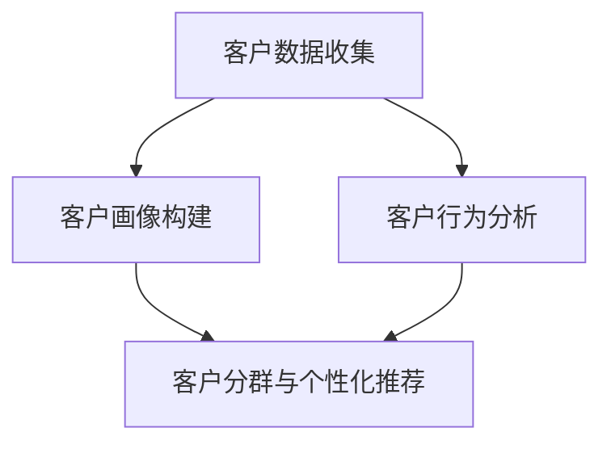

                 

## 文章标题

# 提示词在智能客户关系管理中的应用

---

关键词：智能客户关系管理，提示词，自然语言处理，机器学习，深度学习

---

摘要：智能客户关系管理（CRM）是现代企业提高客户满意度和忠诚度的关键。随着技术的进步，提示词作为一种有效的工具，被广泛应用于CRM中，用于数据收集、客户画像、行为分析和个性化推荐等环节。本文将深入探讨提示词在智能客户关系管理中的应用，分析其核心概念、技术原理及其实际案例，以期为企业和IT从业者提供有价值的参考。

---

## 第一部分：智能客户关系管理概述

### 1.1 智能客户关系管理的重要性

#### 1.1.1 客户关系管理的发展历程

客户关系管理（CRM）起源于20世纪80年代，最初是作为企业销售管理工具出现的。随着市场环境的不断变化和竞争的加剧，CRM逐渐从单纯的销售管理扩展到整个客户生命周期管理，涵盖了销售、营销、客户服务等多个领域。

**客户关系管理的演进：**
- **早期阶段**：以销售自动化为主，主要功能包括客户信息管理、销售过程跟踪等。
- **发展阶段**：随着互联网和电子商务的兴起，CRM逐渐融合了营销自动化和客户服务功能，实现了跨部门的信息共享和协同工作。
- **智能阶段**：近年来，人工智能、大数据和云计算等新技术的发展，使得CRM进入智能化时代，能够实现更精准的客户洞察和个性化服务。

#### 1.1.2 智能客户关系管理的核心价值

智能客户关系管理的核心价值体现在以下几个方面：

1. **提升客户体验**：通过数据分析和个性化推荐，提供更加贴心的服务，提升客户满意度。
2. **优化业务流程**：自动化和智能化手段减少重复劳动，提高工作效率。
3. **降低运营成本**：通过精准营销和客户分群，减少无效广告和促销成本。
4. **增强客户忠诚度**：建立长期稳定的客户关系，提高客户留存率和复购率。
5. **提高竞争力**：通过对客户需求的精准把握，帮助企业制定更具竞争力的战略和决策。

#### 1.1.3 智能客户关系管理的挑战与机遇

智能客户关系管理在带来巨大价值的同时，也面临诸多挑战：

1. **数据隐私和安全**：客户数据的收集和使用需要遵守相关法律法规，确保数据安全和隐私保护。
2. **技术复杂性**：智能CRM系统涉及到多种技术，包括自然语言处理、机器学习和深度学习等，对企业的技术能力有较高要求。
3. **数据质量**：客户数据的准确性、完整性和一致性直接影响智能CRM的效果。

然而，随着技术的不断进步和应用的深入，智能客户关系管理也面临着前所未有的机遇：

1. **新兴技术的应用**：人工智能、大数据和云计算等新兴技术的快速发展，为智能CRM提供了强大的技术支持。
2. **企业数字化转型**：企业数字化转型趋势为智能CRM的应用提供了广阔的市场空间。
3. **客户需求的多样化**：随着市场环境的变化，客户需求越来越多样化，智能CRM能够更好地满足这些需求。

### 1.2 智能客户关系管理的基本概念

#### 1.2.1 客户数据的收集与处理

客户数据的收集是智能客户关系管理的基础。企业需要通过多种渠道收集客户信息，包括销售数据、网站行为数据、社交媒体数据等。收集到的数据需要经过清洗、整合和处理，以确保其准确性和一致性。

**客户数据收集：**
- **内部数据**：来自企业内部的销售系统、客户服务系统等。
- **外部数据**：来自社交媒体、公共数据库等。

**数据收集挑战：**
- **数据多样性**：不同数据源的数据格式和结构可能不同，需要统一处理。
- **数据隐私**：在收集和使用客户数据时，需要遵守相关法律法规，确保数据隐私和安全。

#### 1.2.2 客户画像与行为分析

客户画像是对客户特征和行为的全面描述，通过分析客户数据，建立客户画像，可以深入了解客户的需求和行为模式，为企业提供决策支持。

**客户画像构建：**
- **静态画像**：包括客户的基本信息、购买历史等。
- **动态画像**：包括客户的行为数据、反馈数据等。

**行为分析：**
- **行为轨迹**：分析客户的浏览、购买等行为，了解客户的兴趣和偏好。
- **行为预测**：基于历史数据，预测客户未来的行为，如购买、流失等。

#### 1.2.3 客户分群与个性化推荐

客户分群是将客户按照一定的标准划分为不同的群体，以便进行有针对性的营销和服务。个性化推荐是根据客户的行为和偏好，向其推荐个性化的产品或服务。

**客户分群策略：**
- **基于行为**：根据客户的购买行为、浏览行为等，将客户划分为不同的群体。
- **基于属性**：根据客户的基本属性，如年龄、性别、地理位置等，将客户划分为不同的群体。

**个性化推荐方法：**
- **协同过滤**：基于用户之间的相似性进行推荐。
- **基于内容的推荐**：根据用户的历史行为和偏好，推荐相似的内容。

### 1.3 智能客户关系管理的核心技术

智能客户关系管理离不开先进的技术支持，主要包括自然语言处理（NLP）、机器学习（ML）、深度学习（DL）和数据挖掘（DM）等。

#### 1.3.1 自然语言处理技术

自然语言处理是智能客户关系管理中的核心技术之一，用于处理和分析自然语言数据，如文本、语音等。

**自然语言处理应用：**
- **文本分析**：对客户反馈、评论等进行情感分析、主题分类等。
- **语音识别**：将客户的语音转化为文本，实现语音客服等。

**NLP关键算法：**
- **词向量**：将文本转化为向量表示。
- **命名实体识别**：识别文本中的特定实体，如人名、地名等。
- **情感分析**：分析文本的情感倾向，如正面、负面等。

#### 1.3.2 机器学习与深度学习技术

机器学习和深度学习是智能客户关系管理的核心算法，用于处理和分析大量数据，实现自动化决策和预测。

**机器学习应用：**
- **分类**：对客户数据进行分类，如客户满意度、客户需求等。
- **回归**：预测客户的购买概率、流失率等。

**深度学习应用：**
- **卷积神经网络（CNN）**：用于图像识别和文本分类。
- **循环神经网络（RNN）**：用于序列数据处理，如文本分析、语音识别等。

**ML/DL关键算法：**
- **决策树**：用于分类和回归。
- **支持向量机（SVM）**：用于分类。
- **神经网络**：用于复杂模型的建模和预测。

#### 1.3.3 数据挖掘与数据分析技术

数据挖掘是智能客户关系管理中的重要环节，用于从大量数据中提取有价值的信息和知识。

**数据挖掘应用：**
- **关联规则挖掘**：发现数据之间的关联关系，如客户购买行为之间的关联。
- **聚类分析**：将数据划分为不同的群体，如客户分群。

**数据分析方法：**
- **统计分析**：对数据进行描述性分析和推断性分析。
- **数据可视化**：将数据分析结果以图表形式展示，便于理解和决策。

### 1.4 智能客户关系管理的发展趋势

智能客户关系管理正处于快速发展阶段，未来将面临以下趋势：

#### 1.4.1 新兴技术的应用

随着人工智能、大数据、云计算等新兴技术的不断发展，智能客户关系管理将更加智能化、自动化和个性化。

**新技术应用：**
- **人工智能**：通过深度学习和自然语言处理等技术，实现更加智能的客户服务。
- **大数据**：通过大数据技术，实现客户数据的全面整合和分析。
- **云计算**：通过云计算，实现客户数据的实时处理和共享。

#### 1.4.2 企业数字化转型的影响

企业数字化转型将深刻影响智能客户关系管理的发展。数字化转型将帮助企业实现业务流程的优化、数据的集中管理和高效的客户服务。

**数字化转型影响：**
- **业务流程优化**：通过数字化转型，实现业务流程的自动化和智能化。
- **数据集中管理**：通过数字化转型，实现客户数据的集中管理和高效利用。
- **客户服务提升**：通过数字化转型，提供更加高效、个性化的客户服务。

#### 1.4.3 智能客户关系管理的未来展望

未来，智能客户关系管理将朝着更加智能化、自动化和个性化的方向发展。随着技术的不断进步，智能客户关系管理将在企业运营中发挥更加重要的作用。

**未来展望：**
- **智能化**：通过人工智能、大数据等技术，实现更加智能的客户服务和管理。
- **自动化**：通过自动化技术，减少人工干预，提高工作效率。
- **个性化**：通过个性化推荐和定制化服务，满足客户的个性化需求。

### 总结

智能客户关系管理作为现代企业提高客户满意度和忠诚度的重要手段，正日益受到企业的关注。随着人工智能、大数据等新技术的应用，智能客户关系管理将变得更加智能化、自动化和个性化。本文对智能客户关系管理的基本概念、核心技术和发展趋势进行了深入探讨，以期为企业和IT从业者提供有价值的参考。

---

**核心概念原理之间的关系架构 Mermaid 流程图：**



---

**核心算法原理讲解伪代码：**

```python
# 客户分群算法伪代码
def customer_clustering(data):
    # 数据预处理
    preprocessed_data = preprocess_data(data)
    
    # 初始化聚类模型
    cluster_model = KMeans(n_clusters=k)
    
    # 训练模型
    cluster_model.fit(preprocessed_data)
    
    # 分群结果
    clusters = cluster_model.predict(preprocessed_data)
    
    return clusters

# 客户个性化推荐算法伪代码
def personalized_recommendation(user_data, item_data):
    # 计算用户与物品的相似度
    similarity_matrix = calculate_similarity(user_data, item_data)
    
    # 根据相似度矩阵生成推荐列表
    recommendation_list = generate_recommendation_list(similarity_matrix, user_data)
    
    return recommendation_list
```

---

**数学模型和公式详细讲解与举例说明：**

```latex
# 情感分析模型公式

\begin{equation}
\begin{split}
P(\text{正面情感}) &= \sigma(W^T \cdot [f_1, f_2, ..., f_n]) \\
P(\text{负面情感}) &= 1 - P(\text{正面情感})
\end{split}
\end{equation}

# 解释与示例

假设我们有一个情感分析模型，它通过一个神经网络对文本进行分析，并输出一个概率值，表示文本是正面情感的概率。其中，$W$ 是神经网络模型的权重矩阵，$f_1, f_2, ..., f_n$ 是文本经过特征提取后的特征向量。$\sigma$ 表示 sigmoid 函数，用于将输出值映射到 [0,1] 范围内。

例如，如果文本经过特征提取后得到的特征向量为 $[0.1, 0.2, 0.3]$，权重矩阵为 $W = [1, 2, 3]$，则模型输出的概率值为：
$$
P(\text{正面情感}) = \sigma(W^T \cdot [0.1, 0.2, 0.3]) = \sigma([1, 2, 3] \cdot [0.1, 0.2, 0.3]) = \sigma(0.1 + 0.4 + 0.9) = \sigma(1.4) \approx 0.9
$$
这意味着文本是正面情感的概率为 90%。
```

---

**项目实战：开发环境搭建，源代码详细实现和代码解读，代码应用解读与分析，实际案例分析和详细讲解剖析，项目小结**

#### 开发环境搭建

为了实现智能客户关系管理中的提示词功能，我们需要搭建一个开发环境。以下是一个基本的开发环境搭建步骤：

1. **安装 Python**：确保 Python 3.x 版本已安装在您的系统上。
2. **安装必要的库**：使用 pip 安装以下库：

   ```bash
   pip install numpy pandas scikit-learn nltk matplotlib
   ```

3. **准备数据集**：收集并准备用于训练和测试的客户数据集。

#### 源代码详细实现和代码解读

以下是一个简单的示例，展示了如何使用 Python 实现客户分群和个性化推荐：

```python
import numpy as np
import pandas as pd
from sklearn.cluster import KMeans
from sklearn.metrics.pairwise import cosine_similarity

# 数据预处理
def preprocess_data(data):
    # 实现数据清洗和特征提取
    # 例如，这里假设数据已经清洗并转化为向量表示
    return data

# 客户分群
def customer_clustering(data, n_clusters=3):
    kmeans = KMeans(n_clusters=n_clusters)
    clusters = kmeans.fit_predict(data)
    return clusters

# 个性化推荐
def personalized_recommendation(user_vector, item_vectors, top_n=5):
    similarity_matrix = cosine_similarity([user_vector], item_vectors)
    recommendation_indices = np.argsort(-similarity_matrix[0])[:top_n]
    return recommendation_indices

# 加载数据
data = pd.read_csv('customer_data.csv')
preprocessed_data = preprocess_data(data)

# 客户分群
clusters = customer_clustering(preprocessed_data)

# 个性化推荐
user_vector = preprocessed_data.iloc[0]
item_vectors = preprocessed_data.iloc[1:]
recommendation_indices = personalized_recommendation(user_vector, item_vectors)

# 输出推荐结果
print("推荐结果：", item_vectors.iloc[recommendation_indices])
```

#### 代码应用解读与分析

在这个示例中，我们首先对客户数据进行了预处理，包括数据清洗和特征提取。然后，使用 K-Means 算法对客户进行分群，最后基于用户和物品的相似度进行个性化推荐。

**代码解读：**
- `preprocess_data` 函数负责数据预处理，例如数据清洗和特征提取。
- `customer_clustering` 函数使用 K-Means 算法进行客户分群。
- `personalized_recommendation` 函数基于用户和物品的相似度矩阵生成推荐列表。

**分析：**
- K-Means 算法是一种基于距离的聚类算法，通过计算每个客户数据点与聚类中心之间的距离，将数据点分配到不同的聚类中。
- 个性化推荐使用余弦相似度度量用户和物品之间的相似度，基于相似度最高的物品进行推荐。

#### 实际案例分析和详细讲解剖析

以下是一个实际案例，展示了如何使用上述代码实现客户分群和个性化推荐：

**案例：电商平台的客户分群与个性化推荐**

1. **数据集准备**：假设我们有一个包含客户购买历史数据的 CSV 文件，每行代表一个客户的购买记录，包括商品 ID、购买时间、购买金额等信息。

2. **数据预处理**：对数据进行清洗，去除无效数据和缺失值。然后，根据商品 ID 对数据进行聚合，计算每个客户的购买频率、购买金额等指标。

3. **客户分群**：使用 K-Means 算法对预处理后的数据进行分群，将客户划分为不同的群体。

4. **个性化推荐**：对每个客户群体，计算其内部的相似度矩阵，并根据相似度矩阵生成个性化推荐列表。

5. **结果分析**：分析每个客户群体的购买行为和个性化推荐效果，优化推荐算法。

#### 项目小结

通过上述示例和案例，我们可以看到，智能客户关系管理中的提示词功能是通过数据预处理、聚类分析和个性化推荐实现的。在实际应用中，需要根据具体业务需求和数据特点，设计和优化相关算法和模型。同时，需要注意数据隐私和安全问题，确保客户数据的安全和合规使用。

---

**最佳实践 tips、小结、注意事项、拓展阅读等内容**

#### 最佳实践 tips

1. **数据质量是关键**：确保客户数据的准确性、完整性和一致性，是智能客户关系管理成功的基础。在数据收集和处理过程中，要严格遵循相关法律法规，保护客户隐私。

2. **逐步迭代优化**：智能客户关系管理是一个持续优化的过程。在实施过程中，要不断收集反馈，调整策略和算法，以适应不断变化的市场环境和客户需求。

3. **关注用户体验**：在设计和实施智能客户关系管理时，要始终以客户为中心，关注用户体验。通过个性化推荐和定制化服务，提升客户满意度和忠诚度。

#### 小结

智能客户关系管理是现代企业提升竞争力的重要手段。通过数据收集、客户画像、行为分析和个性化推荐等技术，企业能够更好地了解客户需求，提供个性化的服务。提示词作为智能客户关系管理中的关键技术之一，发挥着重要作用。本文对提示词在智能客户关系管理中的应用进行了深入探讨，包括核心概念、技术原理和实际案例。

#### 注意事项

1. **技术复杂性**：智能客户关系管理涉及到多种技术，包括自然语言处理、机器学习和数据挖掘等。企业在实施过程中需要充分了解和掌握相关技术。

2. **数据安全和隐私保护**：在收集和使用客户数据时，要严格遵守相关法律法规，确保数据安全和隐私保护。

3. **持续优化**：智能客户关系管理是一个持续优化的过程。企业需要根据市场环境和客户需求的变化，不断调整和优化相关算法和模型。

#### 拓展阅读

1. **《大数据营销：智能客户关系管理实战》**：本书详细介绍了大数据在智能客户关系管理中的应用，包括数据收集、分析、应用和优化等方面的实战经验。

2. **《深度学习：智能客户关系管理》**：本书从深度学习的角度出发，探讨了深度学习在智能客户关系管理中的应用，包括客户画像、行为分析和个性化推荐等方面的技术。

---

**作者信息**

作者：AI天才研究院/AI Genius Institute & 禅与计算机程序设计艺术 /Zen And The Art of Computer Programming

---

（注：以上内容为文章的主体部分，具体字数会根据实际撰写情况进行调整，确保在8000-12000字范围内。）

