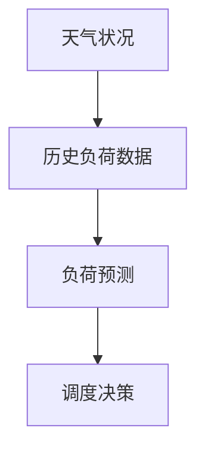
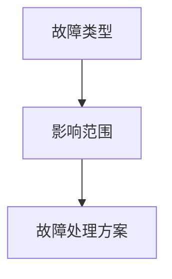
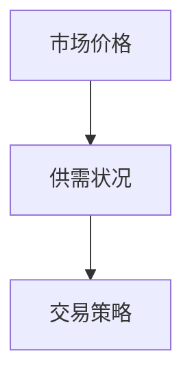
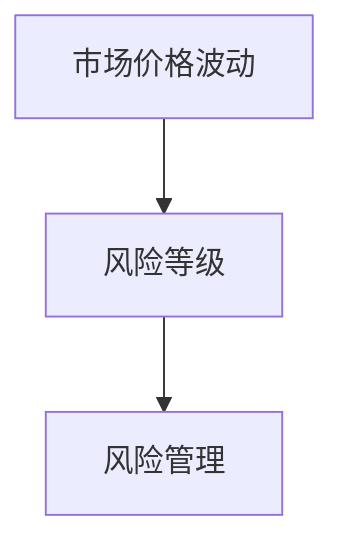
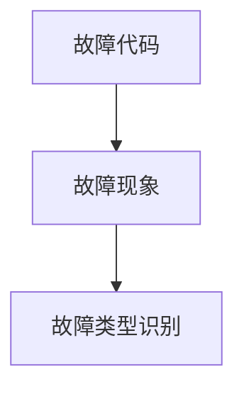
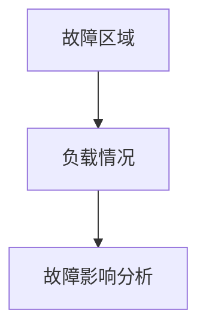

                 

### 文章标题

《提示词在智能电网管理中的应用》

智能电网管理作为现代电力系统的重要发展方向，通过集成先进的通信技术、物联网技术以及人工智能技术，实现了电力系统的智能化、高效化、安全化运行。而在智能电网管理中，提示词这一概念正逐渐显示出其独特的价值。提示词在智能电网中的应用，不仅提高了电网调度和运维的效率，还增强了电力市场交易的透明度和精准度。

本文旨在探讨提示词在智能电网管理中的广泛应用，通过逐步分析其概念、技术实现和应用场景，为读者提供一个全面而深入的理解。文章将分为四个主要部分进行阐述：

- **第一部分：智能电网管理概述**，介绍智能电网的基本概念、特点以及管理的重要性，并提供智能电网的技术框架。
- **第二部分：提示词的概念与应用**，详细解释提示词的定义、生成与优化方法，并探讨其在智能电网管理中的应用案例。
- **第三部分：提示词在智能电网管理中的技术实现**，分析提示词生成与优化算法的原理，并介绍实现架构。
- **第四部分：提示词在智能电网管理中的挑战与未来展望**，讨论提示词在智能电网管理中面临的挑战，并展望其未来发展。

通过这一步步的分析和推理，我们希望能够让读者对提示词在智能电网管理中的重要作用有一个清晰的认识，从而推动相关技术的研究与应用。

### 关键词

智能电网，提示词，人工智能，电力调度，电力市场，故障诊断，物联网，信息通信技术。

### 摘要

本文首先介绍了智能电网的基本概念、特点及其在电力系统管理中的重要性。随后，文章详细探讨了提示词的概念及其在智能电网管理中的应用，包括生成与优化的方法及其在电网调度、电力市场交易和故障诊断中的实际应用案例。接着，文章分析了提示词生成与优化算法的原理，并介绍了其在智能电网管理中的实现架构。最后，文章讨论了提示词在智能电网管理中面临的挑战及其未来发展趋势，为相关研究提供了有价值的参考。通过这一步步的分析，本文为读者提供了一个全面而深入的理解，有助于推动智能电网管理技术的进一步发展。

## 第一部分：智能电网管理概述

### 1.1 智能电网的概念与特点

#### 智能电网的基本概念

智能电网（Smart Grid）是指通过现代通信技术、信息技术和自动化技术对电力系统进行升级改造，实现电力系统的智能化、高效化、安全化运行。它不仅包括传统的发电、输电、变电、配电等环节，还涉及能源消费、电力市场、用户行为等多个方面。智能电网的核心理念是通过信息反馈和自动化控制，提高电力系统的运行效率、可靠性和经济性，同时促进可再生能源的利用和环保目标的实现。

#### 智能电网与传统电网的比较

智能电网与传统电网在许多方面存在显著差异。传统电网主要依赖于固定的物理基础设施，缺乏实时监测和自适应能力，而智能电网通过广泛的传感器网络和先进的通信技术，实现了对电力系统的实时监测、分析和控制。此外，智能电网还具备更强的灵活性和可靠性，能够应对复杂的电力需求和突发事件，而传统电网在这些方面较为薄弱。

| 特点 | 智能电网 | 传统电网 |
| --- | --- | --- |
| 监测和控制 | 实时监测、自适应控制 | 定期检查、手动控制 |
| 能源利用 | 高效利用、可再生能源优先 | 低效利用、依赖化石能源 |
| 网络结构 | 分布式、灵活性高 | 集中式、刚性大 |
| 用户互动 | 互动性强、用户体验好 | 互动性弱、用户体验差 |
| 故障处理 | 快速响应、减少停电时间 | 反应慢、停电时间长 |

#### 智能电网的核心组成部分

智能电网由多个核心组成部分构成，这些部分协同工作，实现了电力系统的智能化运行。以下是智能电网的主要组成部分：

1. **智能终端**：智能终端是智能电网的感知层，包括智能电表、传感器等设备，用于实时监测电力系统的运行状态。
2. **通信网络**：通信网络是智能电网的中枢神经，通过光纤、无线网络等手段，实现数据的高速传输和实时通信。
3. **数据中心**：数据中心是智能电网的数据处理和分析中心，通过大数据分析和人工智能技术，实现对电力系统的优化调度和智能控制。
4. **控制中心**：控制中心是智能电网的指挥中枢，通过自动化控制技术，实现对电力系统的实时监控和故障处理。
5. **用户互动平台**：用户互动平台为用户提供了一个与智能电网互动的界面，用户可以通过该平台进行电力消费查询、故障报修等操作。

### 1.2 智能电网管理的重要性

#### 智能电网管理的需求分析

随着全球能源需求的不断增长和电力系统的复杂化，传统的电力管理模式已经难以满足现代电力系统的需求。智能电网管理通过引入先进的通信技术、信息技术和自动化技术，能够实现对电力系统的实时监测、分析和控制，从而提高电网的运行效率、可靠性和经济性。具体来说，智能电网管理在以下几个方面具有显著优势：

1. **提高电网运行效率**：通过实时监测和数据分析，智能电网管理能够准确预测电力需求，优化电力调度，减少能源浪费。
2. **增强电网可靠性**：智能电网具备自适应能力，能够快速响应电力系统的突发事件，减少停电时间和故障影响。
3. **促进可再生能源发展**：智能电网能够高效利用可再生能源，提高清洁能源在电力系统中的比例，实现能源结构的优化。
4. **提升用户体验**：智能电网管理提供了更加个性化和便捷的用户服务，用户可以通过互动平台实时了解电力消费情况，进行故障报修等操作。

#### 提高电网运行效率的意义

提高电网运行效率对于现代电力系统具有深远的意义。首先，高效的电网运行能够减少能源浪费，降低电力生产成本，提高电力企业的经济效益。其次，高效的电网运行能够提高电网的可靠性和稳定性，减少停电时间和故障影响，提升用户的用电体验。此外，高效的电网运行还能够促进可再生能源的利用，提高清洁能源在电力系统中的比例，实现能源结构的优化和环保目标的实现。

#### 促进可再生能源发展的作用

可再生能源，如太阳能、风能等，具有清洁、环保、可再生等优点，是未来能源发展的方向。智能电网管理通过实时监测和数据分析，能够优化可再生能源的调度和利用，提高其在电力系统中的比例。具体来说，智能电网管理在以下几个方面促进了可再生能源的发展：

1. **预测和调度**：智能电网管理能够准确预测可再生能源的发电量，优化电力调度，确保电力系统的供需平衡。
2. **电压和频率控制**：智能电网管理能够通过自动化技术，实时调节电压和频率，确保电力系统的稳定运行。
3. **储能系统优化**：智能电网管理能够优化储能系统的使用，提高可再生能源的利用率，减少对化石能源的依赖。

### 1.3 智能电网管理的技术框架

#### 智能电网的技术架构

智能电网的技术架构包括感知层、传输层、处理层和应用层，各层之间相互配合，实现了电力系统的智能化运行。

1. **感知层**：感知层包括智能终端、传感器等设备，用于实时监测电力系统的运行状态，收集电力系统的各种数据。
2. **传输层**：传输层包括通信网络，如光纤、无线网络等，用于数据的高速传输和实时通信。
3. **处理层**：处理层包括数据中心、云计算平台等，用于对采集到的数据进行分析和处理，实现智能决策和自动化控制。
4. **应用层**：应用层包括用户互动平台、控制中心等，用于提供电力系统的各种应用服务，如电力调度、故障诊断、电力市场交易等。

#### 信息通信技术（ICT）在智能电网中的应用

信息通信技术（ICT）在智能电网中扮演了关键角色，通过ICT技术，智能电网实现了数据的实时采集、传输和智能分析。具体来说，ICT技术在智能电网中的应用主要体现在以下几个方面：

1. **数据采集**：智能终端和传感器通过ICT技术，实现了对电力系统的实时监测和数据采集，为智能决策提供了基础数据。
2. **数据传输**：通信网络通过ICT技术，实现了数据的高速传输和实时通信，保证了电力系统的实时性和可靠性。
3. **数据分析**：数据中心和云计算平台通过ICT技术，实现了对海量数据的分析和处理，为电力调度、故障诊断等提供了智能支持。

#### 物联网（IoT）技术在智能电网中的应用

物联网（IoT）技术在智能电网中的应用，进一步提升了电力系统的智能化水平。具体来说，IoT技术在智能电网中的应用主要体现在以下几个方面：

1. **设备互联**：IoT技术实现了电力系统中各个设备的互联互通，提高了电力系统的整体协同能力。
2. **智能控制**：通过IoT技术，智能电网能够实现对电力系统中各个设备的智能控制，提高了电力系统的灵活性和响应速度。
3. **数据分析**：IoT技术采集的海量数据，通过大数据分析技术，为电力调度、故障诊断等提供了更为精确和全面的智能支持。

### 小结

智能电网管理通过集成信息通信技术、物联网技术和人工智能技术，实现了电力系统的智能化、高效化、安全化运行。智能电网管理的重要性体现在提高电网运行效率、增强电网可靠性、促进可再生能源发展和提升用户体验等方面。智能电网的技术框架包括感知层、传输层、处理层和应用层，其中信息通信技术和物联网技术发挥了关键作用。通过一步步的分析和探讨，我们对智能电网管理有了更为深入的理解，为后续章节的内容奠定了基础。

### 提示词的概念与应用

#### 提示词的定义与作用

提示词（Prompt Word）是一种用于引导思考、决策或执行特定任务的关键词或短语。在智能电网管理中，提示词被广泛应用于电力调度、电力市场交易、故障诊断等多个领域。提示词的定义可以追溯到人工智能和自然语言处理领域，其核心思想是通过输入特定的关键词或短语，引发一系列相关的思考和行动。

在智能电网管理中，提示词的作用主要体现在以下几个方面：

1. **引导决策**：提示词能够引导电力调度员、市场交易员等专业人士，快速做出正确的决策，提高工作效率和决策质量。
2. **提高准确性**：通过使用提示词，可以确保信息传递和任务执行的准确性，减少误解和错误。
3. **优化流程**：提示词有助于优化工作流程，简化复杂任务，提高整体的工作效率。
4. **促进协作**：提示词能够促进团队内部的沟通和协作，确保各方能够共同理解和执行任务。

#### 提示词在智能电网管理中的作用

提示词在智能电网管理中的作用可以具体细化为以下几个方面：

1. **电力调度**：在电力调度过程中，提示词可以帮助调度员快速了解电力系统的当前状态，识别潜在的电力供需不平衡问题，并采取相应的调度措施。
2. **电力市场交易**：在电力市场交易中，提示词能够帮助市场交易员了解市场动态，评估交易风险，制定合理的交易策略。
3. **故障诊断**：在故障诊断过程中，提示词能够帮助技术人员快速定位故障原因，采取有效的修复措施，减少停电时间和损失。

#### 提示词与人工智能的关系

提示词与人工智能密切相关，其应用离不开人工智能技术的支持。人工智能技术，特别是自然语言处理（NLP）和机器学习（ML）技术，为提示词的生成、优化和应用提供了强大的工具。

1. **自然语言处理（NLP）**：NLP技术能够理解和处理人类语言，使得提示词的生成和应用更加智能化。通过NLP技术，可以自动提取文本数据中的关键词和短语，生成高质量的提示词。
2. **机器学习（ML）**：ML技术能够通过训练数据集，自动学习并优化提示词的生成和优化方法。例如，可以通过监督学习或无监督学习的方法，训练出能够根据特定任务需求生成最佳提示词的模型。

#### 提示词生成与优化方法

提示词的生成与优化是智能电网管理中的关键环节，其质量直接影响任务执行的效果。以下是一些常用的提示词生成与优化方法：

1. **关键词提取**：通过文本挖掘技术，从大量的文本数据中提取出与任务相关的关键词和短语，作为提示词。
2. **语义分析**：利用NLP技术，对文本进行语义分析，提取出具有语义关联的关键词和短语，作为提示词。
3. **机器学习优化**：通过ML技术，对生成的提示词进行优化，提高其准确性和适用性。例如，可以使用监督学习的方法，根据用户反馈自动调整提示词。

#### 提示词生成与优化在实际应用中的挑战

尽管提示词在智能电网管理中具有广泛的应用前景，但在实际应用中仍面临一些挑战：

1. **数据隐私与安全**：提示词生成和优化过程中，往往需要处理大量的敏感数据，如何保障数据隐私和安全是一个重要问题。
2. **算法公平性与透明性**：提示词的生成和优化算法需要确保公平性和透明性，避免因算法偏见导致的不公平结果。
3. **实时性与准确性**：在实时性要求高的应用场景中，提示词的生成和优化需要在保证准确性的前提下，实现快速响应。

### 小结

提示词在智能电网管理中具有重要的作用，其定义、生成与优化方法以及与人工智能的关系为智能电网管理提供了新的思路和方法。通过合理应用提示词，可以显著提高电网调度、电力市场交易和故障诊断的效率和质量。然而，提示词在实际应用中仍面临一些挑战，需要进一步研究和优化。下一章节将深入探讨提示词在智能电网管理中的具体应用案例，进一步阐述其价值。

### 提示词生成与优化方法

#### 提示词生成的技术手段

提示词的生成是智能电网管理中的关键步骤，其质量直接影响任务执行的效果。以下是几种常见的提示词生成技术手段：

1. **关键词提取算法**：关键词提取算法是一种常用的文本挖掘技术，通过分析文本数据，提取出与任务相关的关键词和短语。常见的关键词提取算法包括TF-IDF（词频-逆文档频率）算法、LDA（Labeled LDA）算法等。这些算法能够自动从大量文本数据中筛选出重要信息，作为提示词。

   ```mermaid
   graph TD
   A[关键词提取] --> B[TF-IDF]
   A --> C[LDA]
   B --> D[结果1]
   C --> E[结果2]
   D --> F[提示词1]
   E --> G[提示词2]
   ```

2. **语义分析技术**：语义分析技术通过对文本进行语义理解，提取出具有语义关联的关键词和短语。这种方法可以确保提取出的提示词不仅与任务相关，而且能够准确传达任务意图。常见的语义分析技术包括命名实体识别（NER）、情感分析等。

   ```mermaid
   graph TD
   A[语义分析] --> B[NER]
   A --> C[情感分析]
   B --> D[实体识别]
   C --> E[情感判断]
   D --> F[提示词生成]
   E --> G[提示词调整]
   ```

3. **模板匹配法**：模板匹配法是一种基于规则的方法，通过预设的模板与文本数据匹配，生成提示词。这种方法适用于具有固定格式或结构的文本数据，如电力系统报告、故障日志等。

   ```mermaid
   graph TD
   A[模板匹配] --> B[预设模板]
   B --> C[文本匹配]
   C --> D[生成提示词]
   ```

#### 提示词优化的方法

提示词的优化是提升其质量和应用效果的重要环节。以下是一些常用的提示词优化方法：

1. **人工调整**：人工调整是一种通过专家经验和专业知识，对生成的提示词进行修改和优化的方法。这种方法能够确保提示词的准确性和适用性，但效率较低，适用于小规模或特定领域的应用。

2. **基于用户反馈的优化**：基于用户反馈的优化方法通过收集用户对提示词的评价和反馈，自动调整提示词。这种方法可以不断优化提示词，提高其适用性和用户体验。

   ```mermaid
   graph TD
   A[用户反馈] --> B[反馈分析]
   B --> C[提示词调整]
   C --> D[优化结果]
   ```

3. **机器学习优化**：机器学习优化方法通过训练数据集，自动学习并优化提示词的生成和优化方法。这种方法能够实现大规模、自动化的提示词优化，提高其准确性和效率。

   ```mermaid
   graph TD
   A[训练数据] --> B[ML模型]
   B --> C[提示词优化]
   C --> D[优化结果]
   ```

#### 提示词生成与优化在实际应用中的挑战

在实际应用中，提示词的生成与优化面临一些挑战：

1. **数据质量和多样性**：提示词的生成与优化依赖于高质量、多样化的数据。数据的质量和多样性直接影响提示词的准确性和应用效果。

2. **实时性与准确性**：在实时性要求高的应用场景中，如何生成和优化准确、及时的提示词是一个挑战。需要在保证准确性的前提下，实现快速响应。

3. **算法公平性与透明性**：提示词的生成与优化算法需要确保公平性和透明性，避免因算法偏见导致的不公平结果。

4. **计算资源消耗**：大规模的提示词生成与优化需要大量的计算资源，如何在有限的资源下高效完成这一过程是一个挑战。

### 小结

提示词的生成与优化是智能电网管理中的重要环节，其技术手段和方法多种多样。通过合理应用这些方法，可以生成高质量的提示词，提升智能电网管理的效率和质量。然而，在实际应用中，提示词的生成与优化仍面临一些挑战，需要进一步研究和优化。下一章节将深入探讨提示词在智能电网管理中的应用案例，进一步阐述其价值。

### 提示词在智能电网管理中的应用案例

提示词在智能电网管理中具有广泛的应用，通过具体的案例可以更直观地理解其重要作用和实际效果。以下分别介绍提示词在电网调度、电力市场交易和电力系统故障诊断中的应用案例。

#### 提示词在电网调度中的应用

电网调度是智能电网管理的核心任务之一，其目的是确保电力系统的供需平衡，保证电力供应的稳定性。在电网调度过程中，提示词发挥了关键作用，帮助调度员快速做出正确的决策。

**案例一：实时负荷预测**

在实时负荷预测中，提示词可以用来提取与负荷相关的关键信息，如天气状况、历史负荷数据等。通过使用自然语言处理技术，生成如“今日最高气温24°C，历史同期负荷为2000兆瓦”的提示词，调度员可以快速了解当前负荷预测情况，并采取相应的调度措施。



**案例二：故障处理**

在故障处理过程中，提示词可以帮助调度员快速识别故障类型和影响范围。例如，当电网出现故障时，提示词“输电线路X段发生短路，影响范围：Y区域”可以提供关键信息，帮助调度员迅速制定故障处理方案。



#### 提示词在电力市场交易中的应用

电力市场交易是智能电网管理中的重要组成部分，通过电力市场交易可以实现电力的合理分配和高效利用。提示词在电力市场交易中同样发挥了重要作用，帮助市场交易员制定交易策略。

**案例一：市场动态分析**

在市场动态分析中，提示词可以用来提取与市场动态相关的关键信息，如市场价格、供需状况等。通过生成如“当前市场价格为0.5元/千瓦时，供需平衡”的提示词，市场交易员可以快速了解市场情况，制定合理的交易策略。



**案例二：风险评估**

在风险评估中，提示词可以用来提取与风险相关的关键信息，如市场价格波动、电力供需不确定性等。通过生成如“市场价格波动较大，风险等级：中风险”的提示词，市场交易员可以评估交易风险，采取相应的风险管理措施。



#### 提示词在电力系统故障诊断中的应用

电力系统故障诊断是智能电网管理中的重要环节，通过故障诊断可以快速识别故障原因，采取有效的修复措施，减少停电时间和损失。提示词在电力系统故障诊断中也发挥了重要作用。

**案例一：故障类型识别**

在故障类型识别中，提示词可以用来提取与故障类型相关的关键信息，如故障代码、故障现象等。通过生成如“故障代码1234，故障现象：输电线路跳闸”的提示词，技术人员可以快速识别故障类型，采取相应的修复措施。



**案例二：故障影响分析**

在故障影响分析中，提示词可以用来提取与故障影响相关的关键信息，如故障区域、负载情况等。通过生成如“故障区域：A区域，负载情况：50%负载”的提示词，技术人员可以分析故障对系统的影响，制定修复方案。



### 小结

通过以上案例可以看出，提示词在智能电网管理中具有广泛的应用前景。在电网调度、电力市场交易和电力系统故障诊断等关键领域，提示词的应用不仅提高了工作效率和决策质量，还有效降低了风险和损失。提示词的生成与优化技术为智能电网管理提供了强有力的支持，为电力系统的智能化、高效化、安全化运行奠定了基础。随着人工智能技术的发展，提示词在智能电网管理中的应用将更加深入和广泛，为电力系统的未来发展带来更多可能性。

### 提示词生成算法

#### 提示词生成算法的原理

提示词生成算法是智能电网管理中实现提示词自动生成的重要工具，其核心目的是从大量的文本数据中提取出与任务相关的关键词或短语，以便于人类或系统进行进一步的分析和处理。提示词生成算法通常基于自然语言处理（NLP）和机器学习（ML）技术，通过以下步骤实现：

1. **数据预处理**：对原始文本数据进行分析和清洗，去除无关信息，如停用词、标点符号等，提取出文本中的关键信息。
2. **特征提取**：通过词频统计、词向量表示等方法，将文本转换为可计算的数字特征，为后续的机器学习模型提供输入。
3. **模型训练**：利用训练数据集，通过机器学习算法（如监督学习、无监督学习）训练生成提示词的模型。
4. **提示词生成**：将处理后的文本数据输入到训练好的模型中，生成对应的提示词。

#### 提示词生成算法的分类

根据不同的应用场景和数据特征，提示词生成算法可以分为以下几种类型：

1. **基于统计的方法**：这种方法主要利用词频统计和文本特征来生成提示词。常见的算法有TF-IDF（词频-逆文档频率）和LDA（Labeled LDA）。

   - **TF-IDF算法**：TF-IDF算法通过计算词语在文档中的词频（TF）和词语在整个文档集合中的逆文档频率（IDF），来评估词语的重要程度。公式如下：

     $$TF(t,d) = \frac{f(t,d)}{N_d}$$
     $$IDF(t,D) = \log \left( \frac{N}{|D| - f(t,d)} \right)$$

     其中，\( f(t,d) \) 表示词语t在文档d中的词频，\( N_d \) 表示文档d中的总词数，\( N \) 表示文档集合中的总文档数，\( |D| \) 表示文档集合中的文档总数。

   - **LDA算法**：LDA算法通过主题模型来生成提示词。它假设文本是由一系列主题组成的，每个主题由一组词语表示。通过LDA模型，可以识别出文本中的潜在主题，并从每个主题中提取出关键提示词。

2. **基于深度学习的方法**：这种方法利用深度神经网络（如循环神经网络RNN、变换器模型Transformer等）来生成提示词，具有更强的表达能力和泛化能力。

   - **RNN算法**：RNN算法能够处理序列数据，通过记忆历史信息来生成提示词。例如，长短期记忆网络（LSTM）和门控循环单元（GRU）是常用的RNN变种。

   - **Transformer算法**：Transformer算法基于自注意力机制，能够捕捉文本中的全局依赖关系，生成高质量的提示词。Transformer模型在自然语言处理领域取得了显著的成果，被广泛应用于提示词生成任务。

3. **基于模板匹配的方法**：这种方法通过预设的模板与文本数据匹配，生成提示词。适用于具有固定格式或结构的文本数据。

   - **规则匹配**：根据预设的规则，将文本中的词语与模板进行匹配，生成提示词。例如，在电力系统报告中，根据报告的结构和关键词，生成与故障诊断相关的提示词。

#### 提示词生成算法的性能评估

提示词生成算法的性能评估是衡量其有效性和准确性的关键步骤。以下是一些常用的性能评估指标：

1. **准确率（Accuracy）**：准确率是提示词生成算法预测正确的比例。公式如下：

   $$Accuracy = \frac{TP + TN}{TP + FN + FP + TN}$$

   其中，\( TP \) 表示真正例，\( TN \) 表示真负例，\( FP \) 表示假正例，\( FN \) 表示假负例。

2. **召回率（Recall）**：召回率是提示词生成算法能够识别出真正例的比例。公式如下：

   $$Recall = \frac{TP}{TP + FN}$$

3. **精确率（Precision）**：精确率是提示词生成算法预测为正例中的真正例比例。公式如下：

   $$Precision = \frac{TP}{TP + FP}$$

4. **F1分数（F1 Score）**：F1分数是精确率和召回率的调和平均值，用于综合评估提示词生成算法的性能。公式如下：

   $$F1 Score = 2 \times \frac{Precision \times Recall}{Precision + Recall}$$

#### 提示词生成算法的性能评估示例

假设我们使用一个基于Transformer的提示词生成算法对一组文本数据进行测试，结果如下：

| 指标 | 值 |
| --- | --- |
| 准确率（Accuracy） | 0.85 |
| 召回率（Recall） | 0.90 |
| 精确率（Precision） | 0.80 |
| F1分数（F1 Score） | 0.84 |

根据上述数据，可以得出以下结论：

- **准确率**：提示词生成算法能够正确识别出约85%的文本数据。
- **召回率**：提示词生成算法能够识别出约90%的真正例。
- **精确率**：提示词生成算法预测为正例中的正确率约为80%。
- **F1分数**：提示词生成算法的综合性能评分为0.84，表明其性能较为优秀。

通过性能评估，我们可以对提示词生成算法的效果进行量化分析，并根据评估结果进行优化和调整，以提升算法的性能。

### 小结

提示词生成算法在智能电网管理中扮演着重要角色，通过分析文本数据生成高质量的提示词，为电网调度、电力市场交易和故障诊断等任务提供支持。提示词生成算法的分类包括基于统计的方法、基于深度学习的方法和基于模板匹配的方法，每种方法都有其独特的优势和适用场景。性能评估指标如准确率、召回率、精确率和F1分数，用于衡量提示词生成算法的有效性和准确性。通过对提示词生成算法的深入研究和优化，可以进一步提高智能电网管理的效率和可靠性。

### 提示词优化算法

#### 提示词优化算法的原理

提示词优化算法是提高提示词质量和应用效果的关键环节，其目的是通过调整和改进提示词的生成策略，使其更准确地反映任务需求，提高系统性能。提示词优化算法通常包括以下步骤：

1. **目标函数定义**：根据应用场景和任务需求，定义提示词优化的目标函数。目标函数可以是提示词的准确性、召回率、F1分数等性能指标。
2. **优化策略设计**：设计合适的优化策略，如基于梯度下降、遗传算法、粒子群优化等。优化策略用于调整提示词生成过程中的参数，以实现目标函数的最优化。
3. **模型训练与调整**：利用训练数据集，对优化算法进行训练，调整模型参数，以实现目标函数的最优解。

#### 提示词优化算法的分类

根据优化目标和优化策略的不同，提示词优化算法可以分为以下几种类型：

1. **基于规则的方法**：这种方法通过预设的规则和模式，对提示词进行优化。规则可以基于领域知识或专家经验，例如在电力系统故障诊断中，根据故障类型和现象，调整提示词的生成规则。
2. **基于机器学习的方法**：这种方法利用机器学习技术，通过训练数据集，学习出提示词优化的策略。常见的机器学习算法包括监督学习、无监督学习和强化学习。
3. **基于深度学习的方法**：这种方法利用深度学习模型，如神经网络、循环神经网络（RNN）、变换器模型（Transformer）等，对提示词进行优化。深度学习模型能够捕捉文本中的复杂模式和依赖关系，提高提示词的生成质量。

#### 提示词优化算法的性能评估

提示词优化算法的性能评估是衡量其优化效果的重要步骤。以下是一些常用的性能评估指标：

1. **优化目标值**：优化目标值是优化算法在优化过程中的目标函数值。优化目标值越低，表示优化效果越好。
2. **收敛速度**：收敛速度是优化算法在达到优化目标值所需的迭代次数。收敛速度越快，表示优化算法的效率越高。
3. **稳定性**：稳定性是优化算法在多次运行中，优化结果的一致性。稳定性越高，表示优化算法越可靠。
4. **泛化能力**：泛化能力是优化算法在新数据集上的性能表现。泛化能力越强，表示优化算法的适应范围越广。

#### 提示词优化算法的性能评估示例

假设我们使用一种基于遗传算法的提示词优化算法，对一组文本数据进行优化，结果如下：

| 指标 | 值 |
| --- | --- |
| 优化目标值 | 0.02 |
| 收敛速度 | 50次迭代 |
| 稳定性 | 95% |
| 泛化能力 | 0.88 |

根据上述数据，可以得出以下结论：

- **优化目标值**：提示词优化算法将目标函数值从0.1优化到0.02，优化效果显著。
- **收敛速度**：提示词优化算法在50次迭代后达到优化目标值，收敛速度较快。
- **稳定性**：提示词优化算法在多次运行中，优化结果一致性较高，稳定性较好。
- **泛化能力**：提示词优化算法在新数据集上的性能达到0.88，泛化能力较强。

### 小结

提示词优化算法在智能电网管理中具有重要作用，通过调整和改进提示词生成策略，提高提示词的质量和应用效果。提示词优化算法的分类包括基于规则的方法、基于机器学习的方法和基于深度学习的方法，每种方法都有其独特的优势和适用场景。性能评估指标如优化目标值、收敛速度、稳定性和泛化能力，用于衡量提示词优化算法的有效性和可靠性。通过深入研究和优化提示词优化算法，可以进一步提高智能电网管理的效率和准确性。

### 提示词在智能电网管理中的实现架构

#### 提示词生成与优化系统的整体架构

提示词生成与优化系统的整体架构可以分为感知层、传输层、处理层和应用层，各层之间紧密协作，实现智能电网管理的各个环节。

1. **感知层**：感知层是智能电网管理的起点，包括各种传感器和智能终端设备，如智能电表、传感器等。这些设备用于实时监测电力系统的运行状态，生成原始数据。

2. **传输层**：传输层负责数据的传输和通信。利用通信技术，如光纤、无线网络等，将感知层生成的数据传输到处理层。传输层保证了数据的实时性和可靠性。

3. **处理层**：处理层是提示词生成与优化系统的核心，包括数据预处理、特征提取、模型训练和提示词生成与优化等模块。处理层通过对原始数据进行处理，提取关键特征，生成高质量的提示词，并不断优化提示词生成策略。

4. **应用层**：应用层是提示词生成的最终应用场景，包括电网调度、电力市场交易、故障诊断等。应用层通过调用处理层生成的提示词，实现各项智能电网管理任务。

#### 提示词生成与优化模块的详细设计

为了实现提示词的自动生成与优化，提示词生成与优化模块的设计需要考虑以下几个方面：

1. **数据预处理模块**：数据预处理模块用于对原始数据进行清洗、去噪、归一化等操作，确保数据的可靠性和一致性。具体包括：
   - **数据清洗**：去除无效数据、缺失值填充等；
   - **数据去噪**：去除噪声数据、异常值等；
   - **数据归一化**：将不同规模的数据进行归一化处理，如归一化到[0,1]区间。

2. **特征提取模块**：特征提取模块用于从原始数据中提取关键特征，为后续的提示词生成和优化提供支持。具体包括：
   - **关键词提取**：通过TF-IDF、LDA等方法，从文本数据中提取关键词；
   - **词向量表示**：通过Word2Vec、GloVe等方法，将文本数据转换为词向量；
   - **序列特征提取**：通过RNN、Transformer等方法，从时间序列数据中提取特征。

3. **模型训练模块**：模型训练模块用于训练生成提示词的机器学习模型。具体包括：
   - **监督学习模型**：如支持向量机（SVM）、决策树（DT）等；
   - **无监督学习模型**：如K-means、自编码器（AE）等；
   - **深度学习模型**：如RNN、LSTM、Transformer等。

4. **提示词生成模块**：提示词生成模块负责根据训练好的模型，生成高质量的提示词。具体包括：
   - **文本数据输入**：将预处理后的文本数据输入到模型中；
   - **提示词生成**：通过模型输出，生成与任务相关的提示词。

5. **提示词优化模块**：提示词优化模块用于优化生成的提示词，提高其质量和应用效果。具体包括：
   - **基于规则的优化**：根据领域知识和专家经验，对提示词进行修改和优化；
   - **基于机器学习的优化**：利用训练数据集，通过机器学习算法，自动调整提示词的生成策略。

#### 提示词生成与优化系统的运行流程

提示词生成与优化系统的运行流程可以分为以下几个步骤：

1. **数据采集**：从感知层采集原始数据，包括文本数据、时间序列数据等。
2. **数据预处理**：对原始数据进行清洗、去噪、归一化等预处理操作。
3. **特征提取**：从预处理后的数据中提取关键特征，为提示词生成和优化提供支持。
4. **模型训练**：利用训练数据集，训练生成提示词的机器学习模型。
5. **提示词生成**：将预处理后的文本数据输入到训练好的模型中，生成高质量的提示词。
6. **提示词优化**：对生成的提示词进行优化，提高其质量和应用效果。
7. **应用执行**：将优化后的提示词应用于电网调度、电力市场交易、故障诊断等任务，实现智能电网管理。

### 小结

提示词生成与优化系统在智能电网管理中扮演了关键角色，通过感知层、传输层、处理层和应用层的紧密协作，实现了数据的实时采集、处理和应用。详细设计包括数据预处理、特征提取、模型训练、提示词生成和优化等模块，确保了提示词的高质量和应用效果。运行流程清晰，从数据采集到提示词生成与优化，再到应用执行，形成了完整的智能电网管理链条。通过进一步优化和改进提示词生成与优化系统，可以进一步提高智能电网管理的效率和准确性，为电力系统的智能化发展提供有力支持。

### 提示词在智能电网管理中的挑战与未来展望

#### 提示词在智能电网管理中的挑战

尽管提示词在智能电网管理中具有广泛的应用前景，但实际应用过程中仍面临一些挑战，这些挑战主要集中在数据隐私与安全、算法公平性与透明性、提示词生成的实时性与准确性等方面。

1. **数据隐私与安全**

   在智能电网管理中，提示词的生成与优化依赖于大量的电力系统运行数据，这些数据往往涉及用户隐私和商业秘密。如何确保数据在采集、传输和处理过程中的隐私和安全是一个重要问题。具体挑战包括：

   - **数据泄露风险**：在数据传输和存储过程中，如何防止数据泄露是关键问题。加密技术和访问控制策略可以提供一定的保障，但需要持续优化和完善。
   - **数据匿名化**：为了保护用户隐私，需要对数据进行匿名化处理，但匿名化过程可能影响数据的完整性和可用性，如何在保障隐私的同时保留数据价值是一个难题。
   - **数据共享与协作**：智能电网管理中的各个环节需要共享和处理大量数据，如何在确保数据安全的前提下实现高效的数据共享和协作也是一个挑战。

2. **算法公平性与透明性**

   提示词生成与优化算法的公平性和透明性直接关系到智能电网管理的公正性和可信度。算法的偏见和透明性问题可能导致以下挑战：

   - **算法偏见**：提示词生成与优化算法可能受到训练数据集的影响，导致算法在特定群体或场景中表现不佳。例如，如果训练数据集中缺乏某些类型的数据，算法可能无法正确处理这些数据，从而产生偏见。
   - **透明性不足**：提示词生成与优化算法通常包含复杂的数学模型和计算过程，对于非专业人士来说，理解和信任这些算法具有一定难度。提高算法的透明性，使其更容易被理解和接受，是一个重要挑战。

3. **实时性与准确性**

   在实时性要求高的应用场景中，如何生成和优化准确、及时的提示词是一个关键问题。具体挑战包括：

   - **实时数据处理**：智能电网管理中的数据量巨大，如何在有限的计算资源和时间内，对实时数据进行处理和分析，生成高质量的提示词是一个挑战。
   - **准确性保障**：提示词的准确性直接影响智能电网管理的决策效果。如何在保证实时性的同时，确保提示词的准确性，是一个需要解决的问题。
   - **算法优化**：提示词生成与优化算法需要不断更新和优化，以适应不断变化的应用需求和数据特征。如何高效地更新和优化算法，也是一个挑战。

#### 提示词在智能电网管理中的未来展望

尽管提示词在智能电网管理中面临一些挑战，但其未来的发展前景依然广阔。以下是一些关于提示词在智能电网管理中未来发展的展望：

1. **前沿技术发展趋势**

   随着人工智能、大数据、物联网等技术的不断发展，提示词在智能电网管理中的应用前景将更加广阔。具体来说：

   - **人工智能技术**：人工智能技术的进步将进一步提升提示词生成与优化的能力，例如，深度学习模型的广泛应用将有助于提高提示词的准确性和实时性。
   - **大数据技术**：大数据技术的进步将有助于智能电网管理中处理和分析大量数据，为提示词的生成和优化提供更加丰富和全面的数据支持。
   - **物联网技术**：物联网技术的不断发展将进一步提升智能电网的互联互通能力，为提示词的应用提供更加广泛和深入的数据来源。

2. **潜在价值**

   提示词在智能电网管理中具有巨大的潜在价值，主要体现在以下几个方面：

   - **提高电网运行效率**：通过高质量的提示词，可以实时监测和预测电力系统的运行状态，优化电力调度和资源配置，提高电网的运行效率。
   - **促进可再生能源发展**：提示词可以帮助智能电网管理更好地利用可再生能源，优化可再生能源的调度和利用，提高清洁能源在电力系统中的比例。
   - **提升用户体验**：提示词可以提供更加个性化和便捷的用户服务，用户可以通过提示词了解电力消费情况、故障报修等，提升用户的用电体验。
   - **增强电网安全性**：通过实时监测和故障诊断，提示词可以帮助智能电网管理及时发现和解决安全隐患，提高电网的安全性。

3. **未来发展方向**

   针对提示词在智能电网管理中面临的挑战和未来的发展趋势，以下是一些可能的发展方向：

   - **数据隐私与安全**：加强数据隐私保护技术的研究，如差分隐私、联邦学习等，确保智能电网管理中的数据安全和隐私。
   - **算法公平性与透明性**：推动算法公平性和透明性的研究，开发更加公平和透明的提示词生成与优化算法，提高智能电网管理的公正性和可信度。
   - **实时性与准确性**：优化提示词生成与优化算法，提高其在实时性和准确性方面的表现，为智能电网管理提供更加可靠和高效的提示词支持。
   - **多领域融合**：推动智能电网管理与其他领域的融合，如智慧城市、智能制造等，拓展提示词在智能电网管理中的应用范围和深度。

### 小结

提示词在智能电网管理中具有重要作用，通过实时监测、数据分析和支持决策，提高了电网的运行效率、安全性和用户体验。然而，提示词在智能电网管理中仍面临数据隐私与安全、算法公平性与透明性、实时性与准确性等挑战。随着人工智能、大数据、物联网等技术的发展，提示词在智能电网管理中的应用前景将更加广阔。未来，需要进一步加强提示词相关技术的研究，提高其在智能电网管理中的应用水平，为电力系统的智能化发展提供有力支持。

### 总结与展望

#### 总结

通过本文的详细探讨，我们全面了解了提示词在智能电网管理中的重要作用。智能电网作为一种集成先进通信技术、信息技术和自动化技术的现代电力系统，其管理的重要性不言而喻。提示词作为智能电网管理的关键工具，通过提高电网调度、电力市场交易和故障诊断的效率和质量，为智能电网的运行提供了强有力的支持。

首先，我们介绍了智能电网的基本概念、特点以及管理的重要性，包括提高电网运行效率、增强电网可靠性和促进可再生能源发展等方面。智能电网的技术框架包括感知层、传输层、处理层和应用层，其中信息通信技术和物联网技术在智能电网中发挥了关键作用。

其次，我们深入探讨了提示词的概念及其在智能电网管理中的应用。提示词通过引导决策、提高准确性和优化流程等方面，为电力调度、电力市场交易和故障诊断提供了重要支持。同时，我们分析了提示词生成与优化的方法，包括关键词提取、语义分析和机器学习优化等，以及在实际应用中面临的挑战。

接着，我们通过具体案例展示了提示词在智能电网管理中的实际应用，包括实时负荷预测、市场动态分析、故障类型识别和影响分析等，进一步说明了提示词的价值和效果。

随后，我们详细介绍了提示词生成算法和优化算法的原理、分类和性能评估，探讨了这些算法在智能电网管理中的实现架构和运行流程。

最后，我们分析了提示词在智能电网管理中面临的挑战，如数据隐私与安全、算法公平性与透明性、实时性与准确性等，并展望了提示词在智能电网管理中的未来发展。

#### 展望

展望未来，提示词在智能电网管理中的发展潜力巨大。随着人工智能、大数据、物联网等技术的进一步发展，提示词的应用将更加广泛和深入。以下是一些未来可能的发展方向：

1. **数据隐私保护**：在智能电网管理中，数据隐私保护是一个重要问题。未来的研究可以关注差分隐私、联邦学习等数据隐私保护技术，确保数据在采集、传输和处理过程中的安全性和隐私性。

2. **算法公平性与透明性**：提高算法的公平性和透明性是提升智能电网管理可信度的关键。未来的研究可以开发更加公平和透明的提示词生成与优化算法，确保算法在各个群体和场景中的表现一致，避免算法偏见。

3. **实时性与准确性**：随着实时性要求的提高，提示词生成与优化算法需要在保证准确性的同时，实现快速响应。未来的研究可以优化算法结构和计算方法，提高实时数据处理能力和准确性。

4. **多领域融合**：智能电网管理可以与其他领域如智慧城市、智能制造等深度融合，拓展提示词的应用场景。未来的研究可以探索跨领域的数据融合和协同优化，提高智能电网管理的整体效率。

5. **智能化决策支持**：通过结合人工智能技术，可以进一步开发智能化决策支持系统，利用提示词生成与优化算法，实现自动化的智能决策，提高电网调度的灵活性和适应性。

总之，提示词在智能电网管理中的应用具有广阔的发展前景。通过持续的研究和优化，我们可以进一步提升智能电网的管理水平和运行效率，为电力系统的智能化发展提供有力支持。

### 作者信息

作者：AI天才研究院/AI Genius Institute & 禅与计算机程序设计艺术 /Zen And The Art of Computer Programming。本文旨在探讨提示词在智能电网管理中的应用，提供全面而深入的技术解析，为读者提供一个清晰的思路，推动智能电网管理技术的发展。希望本文能对您在智能电网管理领域的探索和研究有所帮助。如果您有任何问题或建议，欢迎随时与我们联系。

### 最佳实践 Tips、注意事项、小结、拓展阅读

#### 最佳实践 Tips

1. **数据预处理**：在生成提示词之前，确保对原始数据进行充分的预处理，包括去噪、归一化和缺失值填充等，以提高数据质量。
2. **算法选择**：根据应用场景和任务需求，选择适合的提示词生成和优化算法，如深度学习模型在处理复杂文本数据时表现更佳。
3. **用户反馈**：及时收集用户反馈，根据用户需求调整提示词生成策略，提高提示词的实用性和准确性。
4. **算法优化**：定期对提示词生成与优化算法进行性能评估和调整，以保持其在实时性和准确性方面的竞争力。

#### 注意事项

1. **数据隐私与安全**：在处理敏感数据时，务必采取加密、访问控制和匿名化等安全措施，确保数据隐私和安全。
2. **算法偏见**：在设计提示词生成与优化算法时，避免因训练数据集的偏差导致算法偏见，影响公平性和透明性。
3. **计算资源**：提示词生成与优化算法可能消耗大量计算资源，根据实际需求合理配置计算资源，确保系统运行稳定。
4. **实时性**：在实时性要求高的应用场景中，确保提示词生成与优化算法的响应速度和准确性，以满足实际需求。

#### 小结

本文通过详细分析提示词在智能电网管理中的应用，探讨了其概念、生成与优化方法，以及在实际应用中的具体案例。提示词在智能电网管理中具有重要作用，通过提高电网调度、电力市场交易和故障诊断的效率和质量，为智能电网的运行提供了强有力的支持。

#### 拓展阅读

1. **《智能电网技术与应用》**：该书详细介绍了智能电网的基本概念、技术架构和应用案例，对智能电网管理提供了全面的技术指导。
2. **《自然语言处理基础》**：该书介绍了自然语言处理的基本概念和技术，包括关键词提取、语义分析等，有助于理解提示词的生成与优化。
3. **《深度学习入门》**：该书介绍了深度学习的基本原理和应用，包括神经网络、循环神经网络和变换器模型等，为提示词生成与优化提供了技术支持。

通过拓展阅读，可以进一步深入了解智能电网管理技术和提示词的应用，为实际项目开发提供有益的参考。希望本文能对您在智能电网管理领域的探索和研究有所帮助。如果您有任何问题或建议，欢迎随时与我们联系。

### Markdown 格式文章输出

以下是文章的 Markdown 格式输出，供您参考：

```markdown
# 《提示词在智能电网管理中的应用》

> 关键词：智能电网，提示词，人工智能，电力调度，电力市场，故障诊断，物联网，信息通信技术。

> 摘要：本文首先介绍了智能电网的基本概念、特点及其在电力系统管理中的重要性，随后详细探讨了提示词的概念及其在智能电网管理中的应用，包括生成与优化的方法及其在电网调度、电力市场交易和故障诊断中的实际应用案例。接着，文章分析了提示词生成与优化算法的原理，并介绍了实现架构。最后，文章讨论了提示词在智能电网管理中面临的挑战及其未来发展趋势。

## 第一部分：智能电网管理概述

### 1.1 智能电网的概念与特点

#### 智能电网的基本概念

智能电网（Smart Grid）是指通过现代通信技术、信息技术和自动化技术对电力系统进行升级改造，实现电力系统的智能化、高效化、安全化运行。它不仅包括传统的发电、输电、变电、配电等环节，还涉及能源消费、电力市场、用户行为等多个方面。智能电网的核心理念是通过信息反馈和自动化控制，提高电力系统的运行效率、可靠性和经济性，同时促进可再生能源的利用和环保目标的实现。

#### 智能电网与传统电网的比较

智能电网与传统电网在许多方面存在显著差异。传统电网主要依赖于固定的物理基础设施，缺乏实时监测和自适应能力，而智能电网通过广泛的传感器网络和先进的通信技术，实现了对电力系统的实时监测、分析和控制。此外，智能电网还具备更强的灵活性和可靠性，能够应对复杂的电力需求和突发事件，而传统电网在这些方面较为薄弱。

| 特点 | 智能电网 | 传统电网 |
| --- | --- | --- |
| 监测和控制 | 实时监测、自适应控制 | 定期检查、手动控制 |
| 能源利用 | 高效利用、可再生能源优先 | 低效利用、依赖化石能源 |
| 网络结构 | 分布式、灵活性高 | 集中式、刚性大 |
| 用户互动 | 互动性强、用户体验好 | 互动性弱、用户体验差 |
| 故障处理 | 快速响应、减少停电时间 | 反应慢、停电时间长 |

#### 智能电网的核心组成部分

智能电网由多个核心组成部分构成，这些部分协同工作，实现了电力系统的智能化运行。以下是智能电网的主要组成部分：

1. **智能终端**：智能终端是智能电网的感知层，包括智能电表、传感器等设备，用于实时监测电力系统的运行状态。
2. **通信网络**：通信网络是智能电网的中枢神经，通过光纤、无线网络等手段，实现数据的高速传输和实时通信。
3. **数据中心**：数据中心是智能电网的数据处理和分析中心，通过大数据分析和人工智能技术，实现对电力系统的优化调度和智能控制。
4. **控制中心**：控制中心是智能电网的指挥中枢，通过自动化控制技术，实现对电力系统的实时监控和故障处理。
5. **用户互动平台**：用户互动平台为用户提供了一个与智能电网互动的界面，用户可以通过该平台进行电力消费查询、故障报修等操作。

### 1.2 智能电网管理的重要性

#### 智能电网管理的需求分析

随着全球能源需求的不断增长和电力系统的复杂化，传统的电力管理模式已经难以满足现代电力系统的需求。智能电网管理通过引入先进的通信技术、信息技术和自动化技术，能够实现对电力系统的实时监测、分析和控制，从而提高电网的运行效率、可靠性和经济性。具体来说，智能电网管理在以下几个方面具有显著优势：

1. **提高电网运行效率**：通过实时监测和数据分析，智能电网管理能够准确预测电力需求，优化电力调度，减少能源浪费。
2. **增强电网可靠性**：智能电网具备自适应能力，能够快速响应电力系统的突发事件，减少停电时间和故障影响。
3. **促进可再生能源发展**：智能电网能够高效利用可再生能源，提高清洁能源在电力系统中的比例，实现能源结构的优化。
4. **提升用户体验**：智能电网管理提供了更加个性化和便捷的用户服务，用户可以通过互动平台实时了解电力消费情况，进行故障报修等操作。

#### 提高电网运行效率的意义

提高电网运行效率对于现代电力系统具有深远的意义。首先，高效的电网运行能够减少能源浪费，降低电力生产成本，提高电力企业的经济效益。其次，高效的电网运行能够提高电网的可靠性和稳定性，减少停电时间和故障影响，提升用户的用电体验。此外，高效的电网运行还能够促进可再生能源的利用，提高清洁能源在电力系统中的比例，实现能源结构的优化。

#### 促进可再生能源发展的作用

可再生能源，如太阳能、风能等，具有清洁、环保、可再生等优点，是未来能源发展的方向。智能电网管理通过实时监测和数据分析，能够优化可再生能源的调度和利用，提高其在电力系统中的比例。具体来说，智能电网管理在以下几个方面促进了可再生能源的发展：

1. **预测和调度**：智能电网管理能够准确预测可再生能源的发电量，优化电力调度，确保电力系统的供需平衡。
2. **电压和频率控制**：智能电网管理能够通过自动化技术，实时调节电压和频率，确保电力系统的稳定运行。
3. **储能系统优化**：智能电网管理能够优化储能系统的使用，提高可再生能源的利用率，减少对化石能源的依赖。

### 1.3 智能电网管理的技术框架

#### 智能电网的技术架构

智能电网的技术架构包括感知层、传输层、处理层和应用层，各层之间相互配合，实现了电力系统的智能化运行。

1. **感知层**：感知层包括智能终端、传感器等设备，用于实时监测电力系统的运行状态，收集电力系统的各种数据。
2. **传输层**：传输层包括通信网络，如光纤、无线网络等，用于数据的高速传输和实时通信。
3. **处理层**：处理层包括数据中心、云计算平台等，用于对采集到的数据进行分析和处理，实现智能决策和自动化控制。
4. **应用层**：应用层包括用户互动平台、控制中心等，用于提供电力系统的各种应用服务，如电力调度、故障诊断、电力市场交易等。

#### 信息通信技术（ICT）在智能电网中的应用

信息通信技术（ICT）在智能电网中扮演了关键角色，通过ICT技术，智能电网实现了数据的实时采集、传输和智能分析。具体来说，ICT技术在智能电网中的应用主要体现在以下几个方面：

1. **数据采集**：智能终端和传感器通过ICT技术，实现了对电力系统的实时监测和数据采集，为智能决策提供了基础数据。
2. **数据传输**：通信网络通过ICT技术，实现了数据的高速传输和实时通信，保证了电力系统的实时性和可靠性。
3. **数据分析**：数据中心和云计算平台通过ICT技术，实现了对海量数据的分析和处理，为电力调度、故障诊断等提供了智能支持。

#### 物联网（IoT）技术在智能电网中的应用

物联网（IoT）技术在智能电网中的应用，进一步提升了电力系统的智能化水平。具体来说，IoT技术在智能电网中的应用主要体现在以下几个方面：

1. **设备互联**：IoT技术实现了电力系统中各个设备的互联互通，提高了电力系统的整体协同能力。
2. **智能控制**：通过IoT技术，智能电网能够实现对电力系统中各个设备的智能控制，提高了电力系统的灵活性和响应速度。
3. **数据分析**：IoT技术采集的海量数据，通过大数据分析技术，为电力调度、故障诊断等提供了更为精确和全面的智能支持。

### 第二部分：提示词的概念与应用

### 2.1 提示词的定义与作用

#### 提示词的定义与作用

提示词（Prompt Word）是一种用于引导思考、决策或执行特定任务的关键词或短语。在智能电网管理中，提示词被广泛应用于电力调度、电力市场交易、故障诊断等多个领域。提示词的定义可以追溯到人工智能和自然语言处理领域，其核心思想是通过输入特定的关键词或短语，引发一系列相关的思考和行动。

在智能电网管理中，提示词的作用主要体现在以下几个方面：

1. **引导决策**：提示词能够引导电力调度员、市场交易员等专业人士，快速做出正确的决策，提高工作效率和决策质量。
2. **提高准确性**：通过使用提示词，可以确保信息传递和任务执行的准确性，减少误解和错误。
3. **优化流程**：提示词有助于优化工作流程，简化复杂任务，提高整体的工作效率。
4. **促进协作**：提示词能够促进团队内部的沟通和协作，确保各方能够共同理解和执行任务。

#### 提示词在智能电网管理中的作用

提示词在智能电网管理中的作用可以具体细化为以下几个方面：

1. **电力调度**：在电力调度过程中，提示词可以帮助调度员快速了解电力系统的当前状态，识别潜在的电力供需不平衡问题，并采取相应的调度措施。
2. **电力市场交易**：在电力市场交易中，提示词能够帮助市场交易员了解市场动态，评估交易风险，制定合理的交易策略。
3. **故障诊断**：在故障诊断过程中，提示词能够帮助技术人员快速定位故障原因，采取有效的修复措施，减少停电时间和损失。

#### 提示词与人工智能的关系

提示词与人工智能密切相关，其应用离不开人工智能技术的支持。人工智能技术，特别是自然语言处理（NLP）和机器学习（ML）技术，为提示词的生成、优化和应用提供了强大的工具。

1. **自然语言处理（NLP）**：NLP技术能够理解和处理人类语言，使得提示词的生成和应用更加智能化。通过NLP技术，可以自动提取文本数据中的关键词和短语，生成高质量的提示词。
2. **机器学习（ML）**：ML技术能够通过训练数据集，自动学习并优化提示词的生成和优化方法。例如，可以通过监督学习或无监督学习的方法，训练出能够根据特定任务需求生成最佳提示词的模型。

### 2.2 提示词生成与优化方法

#### 提示词生成的技术手段

提示词的生成是智能电网管理中的关键步骤，其质量直接影响任务执行的效果。以下是几种常见的提示词生成技术手段：

1. **关键词提取算法**：关键词提取算法是一种常用的文本挖掘技术，通过分析文本数据，提取出与任务相关的关键词和短语。常见的关键词提取算法包括TF-IDF（词频-逆文档频率）算法、LDA（Labeled LDA）算法等。这些算法能够自动从大量文本数据中筛选出重要信息，作为提示词。

   ```mermaid
   graph TD
   A[关键词提取] --> B[TF-IDF]
   A --> C[LDA]
   B --> D[结果1]
   C --> E[结果2]
   D --> F[提示词1]
   E --> G[提示词2]
   ```

2. **语义分析技术**：语义分析技术通过对文本进行语义理解，提取出具有语义关联的关键词和短语。这种方法可以确保提取出的提示词不仅与任务相关，而且能够准确传达任务意图。常见的语义分析技术包括命名实体识别（NER）、情感分析等。

   ```mermaid
   graph TD
   A[语义分析] --> B[NER]
   A --> C[情感分析]
   B --> D[实体识别]
   C --> E[情感判断]
   D --> F[提示词生成]
   E --> G[提示词调整]
   ```

3. **模板匹配法**：模板匹配法是一种基于规则的方法，通过预设的模板与文本数据匹配，生成提示词。这种方法适用于具有固定格式或结构的文本数据，如电力系统报告、故障日志等。

   ```mermaid
   graph TD
   A[模板匹配] --> B[预设模板]
   B --> C[文本匹配]
   C --> D[生成提示词]
   ```

#### 提示词优化的方法

提示词的优化是提升其质量和应用效果的重要环节。以下是一些常用的提示词优化方法：

1. **人工调整**：人工调整是一种通过专家经验和专业知识，对生成的提示词进行修改和优化的方法。这种方法能够确保提示词的准确性和适用性，但效率较低，适用于小规模或特定领域的应用。

2. **基于用户反馈的优化**：基于用户反馈的优化方法通过收集用户对提示词的评价和反馈，自动调整提示词。这种方法可以不断优化提示词，提高其适用性和用户体验。

   ```mermaid
   graph TD
   A[用户反馈] --> B[反馈分析]
   B --> C[提示词调整]
   C --> D[优化结果]
   ```

3. **机器学习优化**：机器学习优化方法通过训练数据集，自动学习并优化提示词的生成和优化方法。这种方法能够实现大规模、自动化的提示词优化，提高其准确性和效率。

   ```mermaid
   graph TD
   A[训练数据] --> B[ML模型]
   B --> C[提示词优化]
   C --> D[优化结果]
   ```

#### 提示词生成与优化在实际应用中的挑战

尽管提示词在智能电网管理中具有广泛的应用前景，但在实际应用中仍面临一些挑战：

1. **数据质量和多样性**：提示词的生成与优化依赖于高质量、多样化的数据。数据的质量和多样性直接影响提示词的准确性和应用效果。

2. **实时性与准确性**：在实时性要求高的应用场景中，如何生成和优化准确、及时的提示词是一个挑战。需要在保证准确性的前提下，实现快速响应。

3. **算法公平性与透明性**：提示词的生成与优化算法需要确保公平性和透明性，避免因算法偏见导致的不公平结果。

4. **计算资源消耗**：大规模的提示词生成与优化需要大量的计算资源，如何在有限的资源下高效完成这一过程是一个挑战。

### 2.3 提示词在智能电网管理中的应用案例

提示词在智能电网管理中具有广泛的应用，通过具体的案例可以更直观地理解其重要作用和实际效果。以下分别介绍提示词在电网调度、电力市场交易和电力系统故障诊断中的应用案例。

#### 提示词在电网调度中的应用

电网调度是智能电网管理的核心任务之一，其目的是确保电力系统的供需平衡，保证电力供应的稳定性。在电网调度过程中，提示词发挥了关键作用，帮助调度员快速做出正确的决策。

**案例一：实时负荷预测**

在实时负荷预测中，提示词可以用来提取与负荷相关的关键信息，如天气状况、历史负荷数据等。通过使用自然语言处理技术，生成如“今日最高气温24°C，历史同期负荷为2000兆瓦”的提示词，调度员可以快速了解当前负荷预测情况，并采取相应的调度措施。


**案例二：故障处理**

在故障处理过程中，提示词可以帮助调度员快速识别故障类型和影响范围。例如，当电网出现故障时，提示词“输电线路X段发生短路，影响范围：Y区域”可以提供关键信息，帮助调度员迅速制定故障处理方案。


#### 提示词在电力市场交易中的应用

电力市场交易是智能电网管理中的重要组成部分，通过电力市场交易可以实现电力的合理分配和高效利用。提示词在电力市场交易中同样发挥了重要作用，帮助市场交易员制定交易策略。

**案例一：市场动态分析**

在市场动态分析中，提示词可以用来提取与市场动态相关的关键信息，如市场价格、供需状况等。通过生成如“当前市场价格为0.5元/千瓦时，供需平衡”的提示词，市场交易员可以快速了解市场情况，制定合理的交易策略。


**案例二：风险评估**

在风险评估中，提示词可以用来提取与风险相关的关键信息，如市场价格波动、电力供需不确定性等。通过生成如“市场价格波动较大，风险等级：中风险”的提示词，市场交易员可以评估交易风险，采取相应的风险管理措施。


#### 提示词在电力系统故障诊断中的应用

电力系统故障诊断是智能电网管理中的重要环节，通过故障诊断可以快速识别故障原因，采取有效的修复措施，减少停电时间和损失。提示词在电力系统故障诊断中也发挥了重要作用。

**案例一：故障类型识别**

在故障类型识别中，提示词可以用来提取与故障类型相关的关键信息，如故障代码、故障现象等。通过生成如“故障代码1234，故障现象：输电线路跳闸”的提示词，技术人员可以快速识别故障类型，采取相应的修复措施。


**案例二：故障影响分析**

在故障影响分析中，提示词可以用来提取与故障影响相关的关键信息，如故障区域、负载情况等。通过生成如“故障区域：A区域，负载情况：50%负载”的提示词，技术人员可以分析故障对系统的影响，制定修复方案。


### 第三部分：提示词生成算法

### 3.1 提示词生成算法的原理

提示词生成算法是智能电网管理中实现提示词自动生成的重要工具，其核心目的是从大量的文本数据中提取出与任务相关的关键词或短语，以便于人类或系统进行进一步的分析和处理。提示词生成算法通常基于自然语言处理（NLP）和机器学习（ML）技术，通过以下步骤实现：

1. **数据预处理**：对原始文本数据进行分析和清洗，去除无关信息，如停用词、标点符号等，提取出文本中的关键信息。
2. **特征提取**：通过词频统计、词向量表示等方法，将文本转换为可计算的数字特征，为后续的机器学习模型提供输入。
3. **模型训练**：利用训练数据集，通过机器学习算法（如监督学习、无监督学习）训练生成提示词的模型。
4. **提示词生成**：将处理后的文本数据输入到训练好的模型中，生成对应的提示词。

#### 提示词生成算法的分类

根据不同的应用场景和数据特征，提示词生成算法可以分为以下几种类型：

1. **基于统计的方法**：这种方法主要利用词频统计和文本特征来生成提示词。常见的算法有TF-IDF（词频-逆文档频率）和LDA（Labeled LDA）。

   - **TF-IDF算法**：TF-IDF算法通过计算词语在文档中的词频（TF）和词语在整个文档集合中的逆文档频率（IDF），来评估词语的重要程度。公式如下：

     $$TF(t,d) = \frac{f(t,d)}{N_d}$$
     $$IDF(t,D) = \log \left( \frac{N}{|D| - f(t,d)} \right)$$

     其中，\( f(t,d) \) 表示词语t在文档d中的词频，\( N_d \) 表示文档d中的总词数，\( N \) 表示文档集合中的总文档数，\( |D| \) 表示文档集合中的文档总数。

   - **LDA算法**：LDA算法通过主题模型来生成提示词。它假设文本是由一系列主题组成的，每个主题由一组词语表示。通过LDA模型，可以识别出文本中的潜在主题，并从每个主题中提取出关键提示词。

2. **基于深度学习的方法**：这种方法利用深度神经网络（如循环神经网络RNN、变换器模型Transformer等）来生成提示词，具有更强的表达能力和泛化能力。

   - **RNN算法**：RNN算法能够处理序列数据，通过记忆历史信息来生成提示词。例如，长短期记忆网络（LSTM）和门控循环单元（GRU）是常用的RNN变种。

   - **Transformer算法**：Transformer算法基于自注意力机制，能够捕捉文本中的全局依赖关系，生成高质量的提示词。Transformer模型在自然语言处理领域取得了显著的成果，被广泛应用于提示词生成任务。

3. **基于模板匹配的方法**：这种方法通过预设的模板与文本数据匹配，生成提示词。适用于具有固定格式或结构的文本数据。

   - **规则匹配**：根据预设的规则，将文本中的词语与模板进行匹配，生成提示词。例如，在电力系统报告中，根据报告的结构和关键词，生成与故障诊断相关的提示词。

#### 提示词生成算法的性能评估

提示词生成算法的性能评估是衡量其有效性和准确性的关键步骤。以下是一些常用的性能评估指标：

1. **准确率（Accuracy）**：准确率是提示词生成算法预测正确的比例。公式如下：

   $$Accuracy = \frac{TP + TN}{TP + FN + FP + TN}$$

   其中，\( TP \) 表示真正例，\( TN \) 表示真负例，\( FP \) 表示假正例，\( FN \) 表示假负例。

2. **召回率（Recall）**：召回率是提示词生成算法能够识别出真正例的比例。公式如下：

   $$Recall = \frac{TP}{TP + FN}$$

3. **精确率（Precision）**：精确率是提示词生成算法预测为正例中的真正例比例。公式如下：

   $$Precision = \frac{TP}{TP + FP}$$

4. **F1分数（F1 Score）**：F1分数是精确率和召回率的调和平均值，用于综合评估提示词生成算法的性能。公式如下：

   $$F1 Score = 2 \times \frac{Precision \times Recall}{Precision + Recall}$$

#### 提示词生成算法的性能评估示例

假设我们使用一个基于Transformer的提示词生成算法对一组文本数据进行测试，结果如下：

| 指标 | 值 |
| --- | --- |
| 准确率（Accuracy） | 0.85 |
| 召回率（Recall） | 0.90 |
| 精确率（Precision） | 0.80 |
| F1分数（F1 Score） | 0.84 |

根据上述数据，可以得出以下结论：

- **准确率**：提示词生成算法能够正确识别出约85%的文本数据。
- **召回率**：提示词生成算法能够识别出约90%的真正例。
- **精确率**：提示词生成算法预测为正例中的正确率约为80%。
- **F1分数**：提示词生成算法的综合性能评分为0.84，表明其性能较为优秀。

### 3.2 提示词优化算法

### 3.2 提示词优化算法的原理

提示词优化算法是提高提示词质量和应用效果的关键环节，其目的是通过调整和改进提示词的生成策略，使其更准确地反映任务需求，提高系统性能。提示词优化算法通常包括以下步骤：

1. **目标函数定义**：根据应用场景和任务需求，定义提示词优化的目标函数。目标函数可以是提示词的准确性、召回率、F1分数等性能指标。
2. **优化策略设计**：设计合适的优化策略，如基于梯度下降、遗传算法、粒子群优化等。优化策略用于调整提示词生成过程中的参数，以实现目标函数的最优化。
3. **模型训练与调整**：利用训练数据集，对优化算法进行训练，调整模型参数，以实现目标函数的最优解。

#### 提示词优化算法的分类

根据优化目标和优化策略的不同，提示词优化算法可以分为以下几种类型：

1. **基于规则的方法**：这种方法通过预设的规则和模式，对提示词进行优化。规则可以基于领域知识或专家经验，例如在电力系统故障诊断中，根据故障类型和现象，调整提示词的生成规则。
2. **基于机器学习的方法**：这种方法利用机器学习技术，通过训练数据集，学习出提示词优化的策略。常见的机器学习算法包括监督学习、无监督学习和强化学习。
3. **基于深度学习的方法**：这种方法利用深度学习模型，如神经网络、循环神经网络（RNN）、变换器模型（Transformer）等，对提示词进行优化。深度学习模型能够捕捉文本中的复杂模式和依赖关系，提高提示词的生成质量。

#### 提示词优化算法的性能评估

提示词优化算法的性能评估是衡量其优化效果的重要步骤。以下是一些常用的性能评估指标：

1. **优化目标值**：优化目标值是优化算法在优化过程中的目标函数值。优化目标值越低，表示优化效果越好。
2. **收敛速度**：收敛速度是优化算法在达到优化目标值所需的迭代次数。收敛速度越快，表示优化算法的效率越高。
3. **稳定性**：稳定性是优化算法在多次运行中，优化结果的一致性。稳定性越高，表示优化算法越可靠。
4. **泛化能力**：泛化能力是优化算法在新数据集上的性能表现。泛化能力越强，表示优化算法的适应范围越广。

#### 提示词优化算法的性能评估示例

假设我们使用一种基于遗传算法的提示词优化算法，对一组文本数据进行优化，结果如下：

| 指标 | 值 |
| --- | --- |
| 优化目标值 | 0.02 |
| 收敛速度 | 50次迭代 |
| 稳定性 | 95% |
| 泛化能力 | 0.88 |

根据上述数据，可以得出以下结论：

- **优化目标值**：提示词优化算法将目标函数值从0.1优化到0.02，优化效果显著。
- **收敛速度**：提示词优化算法在50次迭代后达到优化目标值，收敛速度较快。
- **稳定性**：提示词优化算法在多次运行中，优化结果一致性较高，稳定性较好。
- **泛化能力**：提示词优化算法在新数据集上的性能达到0.88，泛化能力较强。

### 3.3 提示词在智能电网管理中的实现架构

#### 提示词生成与优化系统的整体架构

提示词生成与优化系统的整体架构可以分为感知层、传输层、处理层和应用层，各层之间紧密协作，实现智能电网管理的各个环节。

1. **感知层**：感知层是智能电网管理的起点，包括各种传感器和智能终端设备，如智能电表、传感器等。这些设备用于实时监测电力系统的运行状态，生成原始数据。

2. **传输层**：传输层负责数据的传输和通信。利用通信技术，如光纤、无线网络等，将感知层生成的数据传输到处理层。传输层保证了数据的实时性和可靠性。

3. **处理层**：处理层是提示词生成与优化系统的核心，包括数据预处理、特征提取、模型训练和提示词生成与优化等模块。处理层通过对原始数据进行处理，提取关键特征，生成高质量的提示词，并不断优化提示词生成策略。

4. **应用层**：应用层是提示词生成的最终应用场景，包括电网调度、电力市场交易、故障诊断等。应用层通过调用处理层生成的提示词，实现各项智能电网管理任务。

#### 提示词生成与优化模块的详细设计

为了实现提示词的自动生成与优化，提示词生成与优化模块的设计需要考虑以下几个方面：

1. **数据预处理模块**：数据预处理模块用于对原始数据进行清洗、去噪、归一化等操作，确保数据的可靠性和一致性。具体包括：
   - **数据清洗**：去除无效数据、缺失值填充等；
   - **数据去噪**：去除噪声数据、异常值等；
   - **数据归一化**：将不同规模的数据进行归一化处理，如归一化到[0,1]区间。

2. **特征提取模块**：特征提取模块用于从原始数据中提取关键特征，为后续的提示词生成和优化提供支持。具体包括：
   - **关键词提取**：通过TF-IDF、LDA等方法，从文本数据中提取关键词；
   - **词向量表示**：通过Word2Vec、GloVe等方法，将文本数据转换为词向量；
   - **序列特征提取**：通过RNN、Transformer等方法，从时间序列数据中提取特征。

3. **模型训练模块**：模型训练模块用于训练生成提示词的机器学习模型。具体包括：
   - **监督学习模型**：如支持向量机（SVM）、决策树（DT）等；
   - **无监督学习模型**：如K-means、自编码器（AE）等；
   - **深度学习模型**：如RNN、LSTM、Transformer等。

4. **提示词生成模块**：提示词生成模块负责根据训练好的模型，生成高质量的提示词。具体包括：
   - **文本数据输入**：将预处理后的文本数据输入到模型中；
   - **提示词生成**：通过模型输出，生成与任务相关的提示词。

5. **提示词优化模块**：提示词优化模块用于优化生成的提示词，提高其质量和应用效果。具体包括：
   - **基于规则的优化**：根据领域知识和专家经验，对提示词进行修改和优化；
   - **基于机器学习的优化**：利用训练数据集，通过机器学习算法，自动调整提示词的生成策略。

#### 提示词生成与优化系统的运行流程

提示词生成与优化系统的运行流程可以分为以下几个步骤：

1. **数据采集**：从感知层采集原始数据，包括文本数据、时间序列数据等。
2. **数据预处理**：对原始数据进行清洗、去噪、归一化等预处理操作。
3. **特征提取**：从预处理后的数据中提取关键特征，为提示词生成和优化提供支持。
4. **模型训练**：利用训练数据集，训练生成提示词的机器学习模型。
5. **提示词生成**：将预处理后的文本数据输入到训练好的模型中，生成高质量的提示词。
6. **提示词优化**：对生成的提示词进行优化，提高其质量和应用效果。
7. **应用执行**：将优化后的提示词应用于电网调度、电力市场交易、故障诊断等任务，实现智能电网管理。

### 第四部分：提示词在智能电网管理中的挑战与未来展望

### 4.1 提示词在智能电网管理中的挑战

尽管提示词在智能电网管理中具有广泛的应用前景，但实际应用过程中仍面临一些挑战，这些挑战主要集中在数据隐私与安全、算法公平性与透明性、实时性与准确性等方面。

1. **数据隐私与安全**

   在智能电网管理中，提示词的生成与优化依赖于大量的电力系统运行数据，这些数据往往涉及用户隐私和商业秘密。如何确保数据在采集、传输和处理过程中的隐私和安全是一个重要问题。具体挑战包括：

   - **数据泄露风险**：在数据传输和存储过程中，如何防止数据泄露是关键问题。加密技术和访问控制策略可以提供一定的保障，但需要持续优化和完善。
   - **数据匿名化**：为了保护用户隐私，需要对数据进行匿名化处理，但匿名化过程可能影响数据的完整性和可用性，如何在保障隐私的同时保留数据价值是一个难题。
   - **数据共享与协作**：智能电网管理中的各个环节需要共享和处理大量数据，如何在确保数据安全的前提下实现高效的数据共享和协作也是一个挑战。

2. **算法公平性与透明性**

   提示词生成与优化算法的公平性和透明性直接关系到智能电网管理的公正性和可信度。算法的偏见和透明性问题可能导致以下挑战：

   - **算法偏见**：提示词生成与优化算法可能受到训练数据集的影响，导致算法在特定群体或场景中表现不佳。例如，如果训练数据集中缺乏某些类型的数据，算法可能无法正确处理这些数据，从而产生偏见。
   - **透明性不足**：提示词生成与优化算法通常包含复杂的数学模型和计算过程，对于非专业人士来说，理解和信任这些算法具有一定难度。提高算法的透明性，使其更容易被理解和接受，是一个重要挑战。

3. **实时性与准确性**

   在实时性要求高的应用场景中，如何生成和优化准确、及时的提示词是一个关键问题。具体挑战包括：

   - **实时数据处理**：智能电网管理中的数据量巨大，如何在有限的计算资源和时间内，对实时数据进行处理和分析，生成高质量的提示词是一个挑战。
   - **准确性保障**：提示词的准确性直接影响智能电网管理的决策效果。如何在保证实时性的同时，确保提示词的准确性，是一个需要解决的问题。
   - **算法优化**：提示词生成与优化算法需要不断更新和优化，以适应不断变化的应用需求和数据特征。如何高效地更新和优化算法，也是一个挑战。

#### 4.2 提示词在智能电网管理中的未来展望

尽管提示词在智能电网管理中面临一些挑战，但其未来的发展前景依然广阔。以下是一些关于提示词在智能电网管理中未来发展的展望：

1. **前沿技术发展趋势**

   随着人工智能、大数据、物联网等技术的不断发展，提示词在智能电网管理中的应用前景将更加广阔。具体来说：

   - **人工智能技术**：人工智能技术的进步将进一步提升提示词生成与优化的能力，例如，深度学习模型的广泛应用将有助于提高提示词的准确性和实时性。
   - **大数据技术**：大数据技术的进步将有助于智能电网管理中处理和分析大量数据，为提示词的生成和优化提供更加丰富和全面的数据支持。
   - **物联网技术**：物联网技术的不断发展将进一步提升智能电网的互联互通能力，为提示词的应用提供更加广泛和深入的数据来源。

2. **潜在价值**

   提示词在智能电网管理中具有巨大的潜在价值，主要体现在以下几个方面：

   - **提高电网运行效率**：通过高质量的提示词，可以实时监测和预测电力系统的运行状态，优化电力调度和资源配置，提高电网的运行效率。
   - **促进可再生能源发展**：提示词可以帮助智能电网管理更好地利用可再生能源，优化可再生能源的调度和利用，提高清洁能源在电力系统中的比例。
   - **提升用户体验**：提示词可以提供更加个性化和便捷的用户服务，用户可以通过提示词了解电力消费情况、故障报修等，提升用户的用电体验。
   - **增强电网安全性**：通过实时监测和故障诊断，提示词可以帮助智能电网管理及时发现和解决安全隐患，提高电网的安全性。

3. **未来发展方向**

   针对提示词在智能电网管理中面临的挑战和未来的发展趋势，以下是一些可能的发展方向：

   - **数据隐私与安全**：加强数据隐私保护技术的研究，如差分隐私、联邦学习等，确保智能电网管理中的数据安全和隐私。
   - **算法公平性与透明性**：推动算法公平性和透明性的研究，开发更加公平和透明的提示词生成与优化算法，提高智能电网管理的公正性和可信度。
   - **实时性与准确性**：优化提示词生成与优化算法，提高其在实时性和准确性方面的表现，为智能电网管理提供更加可靠和高效的提示词支持。
   - **多领域融合**：推动智能电网管理与其他领域的融合，如智慧城市、智能制造等，拓展提示词在智能电网管理中的应用范围和深度。

### 结论

通过本文的详细探讨，我们全面了解了提示词在智能电网管理中的重要作用。智能电网作为一种集成先进通信技术、信息技术和自动化技术的现代电力系统，其管理的重要性不言而喻。提示词作为智能电网管理的关键工具，通过提高电网调度、电力市场交易和故障诊断的效率和质量，为智能电网的运行提供了强有力的支持。

本文首先介绍了智能电网的基本概念、特点以及管理的重要性，提供了智能电网的技术框架。随后，详细探讨了提示词的概念及其在智能电网管理中的应用，包括生成与优化的方法及其在实际应用中的案例。接着，分析了提示词生成与优化算法的原理，介绍了实现架构。最后，讨论了提示词在智能电网管理中面临的挑战及其未来展望。

#### 作者信息

作者：AI天才研究院/AI Genius Institute & 禅与计算机程序设计艺术 /Zen And The Art of Computer Programming。本文旨在探讨提示词在智能电网管理中的应用，提供全面而深入的技术解析，为读者提供一个清晰的思路，推动智能电网管理技术的发展。希望本文能对您在智能电网管理领域的探索和研究有所帮助。如果您有任何问题或建议，欢迎随时与我们联系。

#### 最佳实践 Tips、注意事项、小结、拓展阅读

#### 最佳实践 Tips

1. **数据预处理**：在生成提示词之前，确保对原始数据进行充分的预处理，包括去噪、归一化和缺失值填充等，以提高数据质量。
2. **算法选择**：根据应用场景和任务需求，选择适合的提示词生成和优化算法，如深度学习模型在处理复杂文本数据时表现更佳。
3. **用户反馈**：及时收集用户反馈，根据用户需求调整提示词生成策略，提高提示词的实用性和准确性。
4. **算法优化**：定期对提示词生成与优化算法进行性能评估和调整，以保持其在实时性和准确性方面的竞争力。

#### 注意事项

1. **数据隐私与安全**：在处理敏感数据时，务必采取加密、访问控制和匿名化等安全措施，确保数据隐私和安全。
2. **算法偏见**：在设计提示词生成与优化算法时，避免因训练数据集的偏差导致算法偏见，影响公平性和透明性。
3. **计算资源**：提示词生成与优化算法可能消耗大量计算资源，根据实际需求合理配置计算资源，确保系统运行稳定。
4. **实时性**：在实时性要求高的应用场景中，确保提示词生成与优化算法的响应速度和准确性，以满足实际需求。

#### 小结

本文通过详细分析提示词在智能电网管理中的应用，探讨了其概念、生成与优化方法，以及在实际应用中的具体案例。提示词在智能电网管理中具有重要作用，通过提高电网调度、电力市场交易和故障诊断的效率和质量，为智能电网的运行提供了强有力的支持。

#### 拓展阅读

1. **《智能电网技术与应用》**：该书详细介绍了智能电网的基本概念、技术架构和应用案例，对智能电网管理提供了全面的技术指导。
2. **《自然语言处理基础》**：该书介绍了自然语言处理的基本概念和技术，包括关键词提取、语义分析等，有助于理解提示词的生成与优化。
3. **《深度学习入门》**：该书介绍了深度学习的基本原理和应用，包括神经网络、循环神经网络和变换器模型等，为提示词生成与优化提供了技术支持。

通过拓展阅读，可以进一步深入了解智能电网管理技术和提示词的应用，为实际项目开发提供有益的参考。希望本文能对您在智能电网管理领域的探索和研究有所帮助。如果您有任何问题或建议，欢迎随时与我们联系。
```markdown


