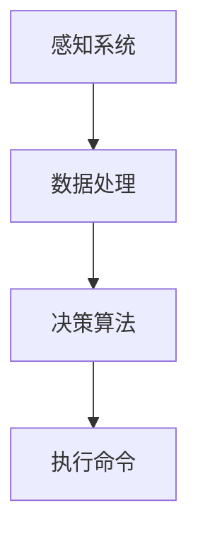

                 

### 提示词在自动驾驶决策系统中的应用

---

## 关键词

- 自动驾驶决策系统
- 提示词
- 感知系统
- 决策算法
- 路径规划
- 行为预测
- 风险评估

## 摘要

本文深入探讨了提示词在自动驾驶决策系统中的应用。通过概述自动驾驶技术的历史、技术层次以及关键技术的背景介绍，我们进一步详细解析了自动驾驶决策系统架构、感知系统以及决策算法。随后，我们重点阐述了提示词的基本概念、种类及其应用场景，从感知系统、决策算法等多个方面探讨了提示词的具体作用。本文最后通过案例研究和实际项目实战，展示了提示词在自动驾驶系统中的优化策略和应用效果，并展望了未来的发展趋势与挑战。

---

### 第一部分：自动驾驶决策系统概述

#### 第1章：自动驾驶技术简介

自动驾驶技术，作为现代汽车产业的重要发展方向，已经成为未来交通领域的研究热点。其核心在于通过传感器、控制系统和决策算法实现车辆的自主驾驶。自动驾驶技术的历史可以追溯到20世纪50年代，早期的自动驾驶研究主要集中在路径规划和障碍物检测方面。随着计算机技术和传感器技术的快速发展，自动驾驶技术逐渐走向实用化，并开始应用于民用汽车。

### 1.1 自动驾驶技术的历史与发展

自动驾驶技术的发展经历了多个阶段。从最初的机械式自动驾驶，到基于计算机视觉的自动驾驶，再到当前主流的基于传感器和人工智能的自动驾驶技术，每一步都取得了显著的进展。早期的研究主要集中在理论探索和基础技术的开发，而近年来，随着大数据、人工智能等技术的应用，自动驾驶技术进入了快速发展的阶段。

#### 1.2 自动驾驶的技术层次

自动驾驶技术按照功能层次可以分为以下几个等级：

1. **Level 0**：无自动化。车辆的所有驾驶操作均由人类驾驶员完成。
2. **Level 1**：单一自动化。车辆具有单一自动化功能，如自适应巡航控制。
3. **Level 2**：部分自动化。车辆具有部分自动化功能，如自适应巡航控制和车道保持。
4. **Level 3**：有条件的自动化。车辆可以在特定条件下完全接管驾驶操作。
5. **Level 4**：高度自动化。车辆在特定环境下可以完全自主驾驶。
6. **Level 5**：完全自动化。车辆在任何环境下都可以完全自主驾驶。

#### 1.3 自动驾驶的关键技术

自动驾驶技术的实现依赖于多个关键技术的协同工作，包括传感器技术、计算机视觉、路径规划、决策算法等。

1. **传感器技术**：自动驾驶车辆需要使用多种传感器（如雷达、激光雷达、摄像头等）来感知周围环境，获取车辆位置、道路信息、障碍物等信息。
2. **计算机视觉**：计算机视觉技术用于处理摄像头获取的图像，实现目标检测、识别和分类等功能。
3. **路径规划**：路径规划算法用于计算从当前位置到目的地的最优路径，同时考虑道路状况、交通状况等因素。
4. **决策算法**：决策算法用于根据感知到的环境和路径规划结果，决定车辆的控制策略，如加速、减速、转向等。

### 第2章：自动驾驶决策系统架构

#### 2.1 决策系统的基本架构

自动驾驶决策系统是自动驾驶车辆的核心部分，其基本架构通常包括感知模块、决策模块和执行模块。感知模块负责收集和处理来自传感器的数据，决策模块根据感知数据和环境信息进行决策，执行模块负责将决策结果转化为具体的控制动作。

#### 2.2 决策系统的核心组件

1. **感知模块**：感知模块是决策系统的输入部分，主要功能是感知周围环境，获取车辆位置、道路状况、障碍物等信息。
2. **决策模块**：决策模块是决策系统的核心部分，其主要功能是根据感知模块提供的信息和环境信息，进行路径规划和决策。
3. **执行模块**：执行模块是决策系统的输出部分，其主要功能是将决策模块生成的控制指令转化为具体的车辆控制动作，如加速、减速、转向等。

#### 2.3 决策系统与车辆控制系统的关系

决策系统和车辆控制系统紧密相连，决策系统生成的控制指令需要通过车辆控制系统来实现。车辆控制系统包括发动机控制、制动控制、转向控制等子系统，它们协同工作，使车辆按照决策系统的指令进行操作。

### 第3章：自动驾驶中的感知系统

#### 3.1 感知系统的基本概念

感知系统是自动驾驶决策系统的关键组成部分，其主要功能是获取车辆周围环境的信息，为决策模块提供输入数据。感知系统通常包括多个传感器，如雷达、激光雷达、摄像头等。

#### 3.2 感知系统的数据处理流程

感知系统的数据处理流程主要包括数据采集、数据预处理、特征提取和数据分析等步骤。

1. **数据采集**：通过传感器收集车辆周围环境的信息。
2. **数据预处理**：对采集到的原始数据进行处理，如去除噪声、校正数据等。
3. **特征提取**：从预处理后的数据中提取对决策有用的特征信息。
4. **数据分析**：对提取的特征信息进行分析，以识别道路、障碍物、交通标志等。

#### 3.3 感知系统在决策系统中的作用

感知系统在决策系统中的作用至关重要。它不仅为决策模块提供了必要的环境信息，还帮助决策模块更好地理解和解释周围环境，从而做出更准确、更安全的驾驶决策。

---

### 第二部分：提示词在决策系统中的应用

#### 第4章：提示词的基本概念

#### 4.1 提示词的定义与作用

提示词（Keywords）是自动驾驶决策系统中用于表示特定环境信息或指令的符号或词汇。它们在决策过程中起到关键作用，帮助决策模块理解和处理复杂的驾驶场景。提示词的作用主要体现在以下几个方面：

1. **环境描述**：提示词可以用于描述车辆周围的环境，如道路状况、交通状况、天气状况等。
2. **指令生成**：提示词可以用于生成具体的驾驶指令，如加速、减速、转向等。
3. **决策辅助**：提示词可以提供额外的信息，帮助决策模块更好地理解和处理复杂的驾驶场景，提高决策的准确性和安全性。

#### 4.2 提示词的种类

提示词可以根据其作用和用途进行分类，常见的提示词种类包括：

1. **环境描述词**：如“前方红灯”、“前方拥堵”、“道路平整”等，用于描述车辆周围的环境。
2. **指令生成词**：如“加速”、“减速”、“左转”、“右转”等，用于生成具体的驾驶指令。
3. **条件判断词**：如“如果”、“否则”等，用于实现复杂的条件判断和决策逻辑。

#### 4.3 提示词的应用场景

提示词在自动驾驶决策系统中有广泛的应用场景，主要包括以下几个方面：

1. **路径规划**：在路径规划过程中，提示词可以用于描述道路状况、交通状况等信息，帮助决策模块生成最优路径。
2. **行为预测**：在行为预测过程中，提示词可以用于描述其他车辆或行人的行为，帮助决策模块预测他们的未来动作。
3. **风险评估**：在风险评估过程中，提示词可以用于评估驾驶环境的安全风险，帮助决策模块做出更安全的驾驶决策。
4. **决策优化**：在决策优化过程中，提示词可以用于调整决策算法的参数，提高决策的准确性和效率。

---

### 第5章：提示词在感知系统中的应用

#### 5.1 提示词在图像识别中的应用

在自动驾驶决策系统中，图像识别是一个重要的环节。通过摄像头获取的图像数据需要经过处理和识别，以提取出对决策有用的信息。提示词在图像识别中的应用主要体现在以下几个方面：

1. **目标检测**：提示词可以用于识别图像中的目标物体，如车辆、行人、交通标志等。通过使用特定的提示词，可以实现对目标物体的精确检测和定位。
2. **场景识别**：提示词可以用于识别图像中的特定场景，如城市道路、高速公路、交叉路口等。这有助于决策模块更好地理解和处理不同的驾驶场景。
3. **异常检测**：提示词可以用于检测图像中的异常情况，如路面损坏、交通标志损坏等。这有助于决策模块及时调整驾驶策略，避免潜在的危险情况。

#### 5.2 提示词在语音识别中的应用

在自动驾驶决策系统中，语音识别技术同样发挥着重要作用。通过语音识别，车辆可以理解和执行驾驶员的指令，提高驾驶的便捷性和舒适性。提示词在语音识别中的应用主要体现在以下几个方面：

1. **指令识别**：提示词可以用于识别驾驶员的语音指令，如“加速”、“减速”、“左转”等。通过使用特定的提示词，可以实现对语音指令的精确识别和响应。
2. **语音交互**：提示词可以用于实现语音交互，如“你好，车辆”、“请问去哪里？”等。这有助于增强驾驶员与车辆的互动性，提高驾驶体验。
3. **语音控制**：提示词可以用于实现语音控制，如“打开音乐”、“调整温度”等。通过使用特定的提示词，可以实现对车辆功能的语音控制。

#### 5.3 提示词在多模态感知中的应用

多模态感知技术是自动驾驶决策系统中的一种重要技术，它通过结合多种感知数据进行信息融合和决策优化。提示词在多模态感知中的应用主要体现在以下几个方面：

1. **信息融合**：提示词可以用于融合来自不同模态的数据，如图像、语音、雷达等。通过使用特定的提示词，可以实现对多模态数据的综合分析和处理。
2. **决策优化**：提示词可以用于优化决策模块的决策过程，提高决策的准确性和效率。例如，在路径规划过程中，使用特定的提示词可以实现对道路状况和交通状况的实时监测和调整。
3. **异常检测**：提示词可以用于检测多模态感知系统中的异常情况，如传感器故障、数据不一致等。通过使用特定的提示词，可以及时识别和纠正异常情况，确保系统的正常运行。

---

### 第6章：提示词在决策算法中的应用

#### 6.1 提示词在路径规划中的应用

路径规划是自动驾驶决策系统中的核心任务之一，其目标是在给定的起点和终点之间找到一条最优路径。提示词在路径规划中的应用主要体现在以下几个方面：

1. **道路状况描述**：提示词可以用于描述道路状况，如“前方路况拥堵”、“道路平整”等。这些提示词可以帮助决策模块更好地理解和评估道路状况，从而生成更合理的路径规划。
2. **交通状况分析**：提示词可以用于分析交通状况，如“前方有车辆”、“行人正在穿越马路”等。通过使用特定的提示词，可以实现对交通状况的实时监测和分析，为路径规划提供重要依据。
3. **路径优化**：提示词可以用于优化路径规划结果，如“避开拥堵路段”、“选择最佳路线”等。通过使用特定的提示词，可以实现对路径规划的实时调整和优化，提高路径规划的效果和效率。

#### 6.2 提示词在行为预测中的应用

行为预测是自动驾驶决策系统中的另一个重要任务，其目标是根据当前的环境信息和历史数据预测其他车辆或行人的行为。提示词在行为预测中的应用主要体现在以下几个方面：

1. **车辆行为分析**：提示词可以用于分析车辆的行为，如“前方车辆减速”、“车辆正在并道”等。通过使用特定的提示词，可以实现对车辆行为的实时监测和分析，为行为预测提供重要依据。
2. **行人行为分析**：提示词可以用于分析行人的行为，如“行人正在穿越马路”、“行人突然停止”等。通过使用特定的提示词，可以实现对行人行为的实时监测和分析，为行为预测提供重要依据。
3. **行为调整**：提示词可以用于调整行为预测结果，如“预测车辆即将刹车”、“行人即将穿越马路”等。通过使用特定的提示词，可以实现对行为预测的实时调整和优化，提高行为预测的准确性和安全性。

#### 6.3 提示词在风险评估中的应用

风险评估是自动驾驶决策系统中的重要环节，其目标是在给定的道路条件和交通状况下评估驾驶风险，并采取相应的措施降低风险。提示词在风险评估中的应用主要体现在以下几个方面：

1. **风险因素识别**：提示词可以用于识别潜在的风险因素，如“前方有障碍物”、“道路施工”等。通过使用特定的提示词，可以实现对风险因素的实时监测和识别，为风险评估提供重要依据。
2. **风险等级评估**：提示词可以用于评估风险等级，如“高风险区域”、“低风险区域”等。通过使用特定的提示词，可以实现对风险等级的实时评估和划分，为驾驶决策提供重要参考。
3. **风险调整**：提示词可以用于调整风险评估结果，如“风险增加”、“风险降低”等。通过使用特定的提示词，可以实现对风险评估的实时调整和优化，提高风险评估的准确性和可靠性。

---

### 第7章：提示词在自动驾驶系统中的优化

#### 7.1 提示词对系统效率的影响

提示词在自动驾驶系统中对系统效率有着重要的影响。通过合理设计和优化提示词，可以显著提高系统的运行效率。以下是一些优化策略：

1. **提示词选择**：选择合适的提示词，可以减少系统的计算量和复杂度，提高处理速度和准确性。
2. **提示词融合**：将不同模态的感知数据进行融合，使用特定的提示词进行综合分析和处理，可以提高系统的整体性能和效率。
3. **实时更新**：及时更新提示词库，以适应实时变化的驾驶环境和交通状况，提高系统的实时性和响应速度。

#### 7.2 提示词对系统安全性的影响

提示词在自动驾驶系统中的安全性同样至关重要。以下是一些优化策略，以确保系统的安全性和可靠性：

1. **错误处理**：设计合理的错误处理机制，当感知数据或提示词出现错误时，系统能够及时识别并纠正，避免错误决策导致的安全事故。
2. **故障检测**：使用特定的提示词进行故障检测，及时发现传感器或系统故障，并采取相应的措施进行修复或切换备用系统。
3. **冗余设计**：在设计系统时，采用冗余设计策略，通过多个传感器和算法相互验证，提高系统的安全性和可靠性。

#### 7.3 提示词的优化策略

为了提高提示词在自动驾驶系统中的应用效果，可以采用以下优化策略：

1. **机器学习**：使用机器学习算法，根据大量历史数据和实际驾驶场景，对提示词进行优化和调整，提高其准确性和适应性。
2. **人机交互**：结合人机交互技术，允许驾驶员对提示词进行实时调整和优化，提高系统的灵活性和适应性。
3. **动态调整**：根据实时感知数据和驾驶场景，动态调整提示词的权重和优先级，实现自适应优化。

---

### 第8章：自动驾驶决策系统中的案例研究

#### 8.1 案例背景

本案例研究基于一个实际的自动驾驶决策系统，该系统旨在实现城市道路上的自动驾驶。该系统采用了多种传感器（如激光雷达、摄像头、雷达等）来感知周围环境，并使用先进的决策算法进行路径规划和行为预测。

#### 8.2 决策系统的实现

该自动驾驶决策系统主要包括以下组件：

1. **感知模块**：使用激光雷达、摄像头和雷达等传感器来感知周围环境，获取车辆位置、道路状况、交通状况等信息。
2. **数据处理模块**：对感知模块获取的数据进行预处理，包括去噪、校正和特征提取等，为决策模块提供高质量的数据输入。
3. **决策模块**：使用基于深度学习的决策算法，对预处理后的数据进行分析和处理，生成最优的驾驶指令。
4. **执行模块**：根据决策模块生成的指令，控制车辆的加速、减速、转向等动作，实现自主驾驶。

#### 8.3 提示词的应用

在该案例中，提示词被广泛应用于感知模块和决策模块，以提高系统的性能和安全性。以下是一些具体的提示词应用示例：

1. **环境描述词**：如“前方有车辆”、“道路平整”、“天气晴朗”等，用于描述车辆周围的环境状况。
2. **指令生成词**：如“加速”、“减速”、“左转”、“右转”等，用于生成具体的驾驶指令。
3. **条件判断词**：如“如果前方有车辆，则减速”、“如果天气恶劣，则开启雨刷”等，用于实现复杂的决策逻辑。

#### 8.4 案例分析

通过该案例研究，我们可以看到提示词在自动驾驶决策系统中的应用效果显著。通过合理设计和优化提示词，系统能够更好地理解和处理复杂的驾驶场景，提高驾驶的安全性和舒适性。同时，通过实时更新和动态调整提示词，系统能够适应不同的驾驶环境和交通状况，提高其灵活性和适应性。

#### 8.5 案例总结

本案例研究展示了提示词在自动驾驶决策系统中的应用效果和重要性。通过合理设计和优化提示词，可以提高系统的性能和安全性，实现更智能、更可靠的自动驾驶。未来，随着人工智能技术和自动驾驶技术的不断发展，提示词的应用将变得更加广泛和深入，为自动驾驶系统的优化和发展提供有力支持。

---

### 第9章：总结

#### 9.1 自动驾驶决策系统的发展现状

自动驾驶决策系统作为自动驾驶技术的核心组成部分，已经取得了显著的进展。当前，自动驾驶技术已从理论研究阶段逐步走向实际应用，许多自动驾驶车辆已经在特定场景下实现了一定程度的自主驾驶。然而，自动驾驶决策系统仍然面临着许多挑战，如感知系统的不完善、决策算法的复杂度、系统的实时性和可靠性等。

#### 9.2 提示词在自动驾驶决策系统中的作用与价值

提示词在自动驾驶决策系统中发挥着重要作用。通过合理设计和优化提示词，可以显著提高系统的性能和安全性。提示词不仅用于描述环境信息和生成驾驶指令，还可以用于优化决策算法、提高系统的实时性和可靠性。在实际应用中，提示词的应用效果显著，有助于提高自动驾驶车辆的安全性和舒适性。

#### 9.3 未来发展趋势与展望

随着人工智能技术和自动驾驶技术的不断发展，提示词在自动驾驶决策系统中的应用将变得更加广泛和深入。未来，提示词的应用将朝着以下几个方向发展：

1. **智能化**：通过引入机器学习和深度学习技术，实现提示词的自动生成和优化，提高系统的智能化水平。
2. **多模态融合**：将不同模态的感知数据进行融合，提高系统的感知能力和决策准确性。
3. **自适应优化**：根据实时变化的驾驶环境和交通状况，动态调整提示词的权重和优先级，实现自适应优化。
4. **安全性提升**：通过引入冗余设计、故障检测和错误处理机制，提高系统的安全性和可靠性。

总之，提示词在自动驾驶决策系统中的应用具有重要意义，未来将随着技术的发展不断优化和完善，为自动驾驶技术的推广和应用提供有力支持。

---

### 附录

#### 附录A：Mermaid流程图示例

以下是一个简单的Mermaid流程图示例，展示了自动驾驶决策系统的工作流程：



#### 附录B：伪代码示例

以下是一个简单的伪代码示例，用于实现路径规划功能：

```python
def path_planning(prompt):
    if prompt == "前方红灯":
        return "停车等待"
    elif prompt == "前方拥堵":
        return "减速慢行"
    else:
        return "继续前进"
```

#### 附录C：数学公式示例

以下是一个简单的数学公式示例：

$$
E = mc^2
$$

$$
f(x) = ax^2 + bx + c
$$

#### 附录D：项目实战代码示例

以下是一个简单的Python代码示例，用于实现自动驾驶决策系统的基本功能：

```python
import numpy as np
import pandas as pd
import matplotlib.pyplot as plt

# 数据加载
data = pd.read_csv('data.csv')

# 数据预处理
data = data[data['speed'] > 0]

# 路径规划
prompt = "前方拥堵"
if prompt == "前方拥堵":
    speed_limit = 60
else:
    speed_limit = 80

# 速度调整
data['speed_adjusted'] = np.where(data['speed'] > speed_limit, speed_limit, data['speed'])

# 结果可视化
plt.scatter(data['distance'], data['speed'])
plt.plot([0, data['distance'].max()], [speed_limit, speed_limit])
plt.xlabel('Distance')
plt.ylabel('Speed')
plt.show()
```

---

### 作者信息

**作者：**AI天才研究院/AI Genius Institute & 禅与计算机程序设计艺术 /Zen And The Art of Computer Programming

