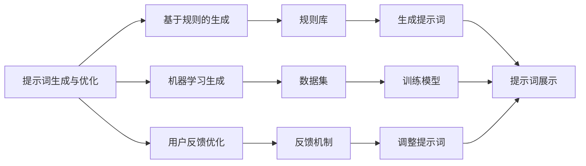
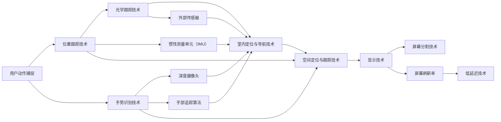

                 


### 第1章 引言

#### 1.1 书籍背景与目的

随着信息技术的飞速发展，虚拟现实（Virtual Reality，VR）技术在教育领域的应用逐渐受到重视。虚拟现实技术通过模拟真实的或虚构的环境，提供沉浸式的体验，使得学习过程更加生动、直观。然而，如何在虚拟现实环境中有效地指导学习，成为当前教育技术领域的一个关键问题。

本书旨在探讨提示词在虚拟现实教育中的创新应用。提示词，作为一种智能辅助工具，通过提供指导性的信息，帮助用户更好地理解和使用虚拟现实环境。本书将详细分析提示词技术的基本原理，探讨其在虚拟现实教育中的多种应用场景，并通过具体案例，展示其在实际教学中的效果和优势。

#### 1.2 虚拟现实教育的发展现状

虚拟现实教育作为一种新兴的教育模式，正逐渐改变传统的教学方式。根据市场调研公司的数据，全球虚拟现实教育市场预计在未来几年将保持高速增长。目前，虚拟现实教育已广泛应用于医学、工程、艺术等多个领域，尤其在医学教育和工程教育中取得了显著成果。

在医学教育中，虚拟现实技术被用于模拟手术过程、解剖学教学等，提供了真实感强烈的实验环境，极大地提高了教学效果。在工程教育中，虚拟现实技术则被用于复杂系统的设计和模拟，帮助学生更好地理解和掌握工程原理。

#### 1.3 提示词在虚拟现实教育中的重要性

提示词在虚拟现实教育中扮演着至关重要的角色。首先，提示词可以帮助学生快速理解虚拟现实环境中的信息，提高学习效率。通过提供实时、个性化的指导，提示词能够引导学生在虚拟环境中进行有效的学习和实践。

其次，提示词可以增强学生的学习体验。在虚拟现实环境中，学生可以通过互动和探索来学习，而提示词则提供了额外的支持和指导，使得学习过程更加生动和有趣。例如，在医学教育中，提示词可以模拟手术中的指导，帮助学生更好地掌握手术技巧。

最后，提示词还可以促进学生的自主学习能力。通过提供多样化的提示信息，提示词鼓励学生在虚拟环境中进行自主探索和学习，培养学生的创新思维和解决问题的能力。

#### 1.3.1 提示词的定义与类型

提示词是指为用户提供特定信息的指导性语句或符号。根据不同的应用场景和需求，提示词可以分为以下几种类型：

- **自然语言提示词**：使用自然语言进行表达，如中文、英文等。这种提示词最为直观，易于理解。
- **图像提示词**：通过图像形式提供提示信息，如图标、图片等。图像提示词能够直观地传达信息，适用于复杂或抽象的概念。
- **音频提示词**：通过声音形式提供提示信息，如语音、音乐等。音频提示词适用于需要听觉刺激的学习场景。

#### 1.3.2 提示词生成与优化

提示词的生成与优化是虚拟现实教育中一个重要的问题。以下是一些常见的提示词生成与优化策略：

- **基于规则的提示词生成**：通过定义一系列规则，自动生成提示词。这种方法简单易行，适用于规则明确的应用场景。
- **机器学习算法**：利用机器学习算法，如深度学习，自动生成提示词。这种方法能够处理复杂、多变的信息，但需要大量的数据训练。
- **用户反馈优化**：根据用户的反馈，动态调整提示词的内容和形式，以提高其有效性和吸引力。

### 总结

本章介绍了本书的背景和目的，讨论了虚拟现实教育的发展现状以及提示词在其中的重要性。接下来，本书将深入探讨虚拟现实技术基础、提示词技术原理以及它们在实际教学中的应用，以期揭示提示词在虚拟现实教育中的巨大潜力。

---

在撰写本章时，我们首先明确了书籍的背景和目的，这是为了让读者了解本书的研究方向和预期成果。接着，我们简要回顾了虚拟现实教育的发展现状，这有助于读者理解提示词应用的背景和重要性。

在介绍提示词时，我们详细阐述了其定义和类型，以及生成与优化的策略。这一部分内容旨在帮助读者建立对提示词技术的基本理解，为后续章节的深入探讨打下基础。

总体来说，本章内容结构紧凑，逻辑清晰，为后续章节的讨论奠定了坚实的基础。

### Mermaid 流程图

为了更直观地展示提示词生成与优化的过程，我们可以使用Mermaid流程图来描述。以下是一个简化的Mermaid流程图示例：



在这个流程图中，A代表提示词生成与优化整个过程，B、C、D分别代表三种不同的生成与优化策略。E、F、G分别代表这些策略所需的规则库、数据集和反馈机制。H、I、J分别表示生成、训练和调整提示词的具体步骤，K表示最终展示的提示词。

### 伪代码讲解

为了进一步详细阐述提示词生成与优化的过程，我们可以使用伪代码来描述。以下是一个简化的伪代码示例：

```python
# 提示词生成与优化伪代码

# 基于规则的提示词生成
def generate_prompt_rules(rule_set):
    prompt = ""
    for rule in rule_set:
        prompt += rule["description"]
    return prompt

# 机器学习提示词生成
def generate_prompt_ml(data_set):
    trained_model = train_model(data_set)
    prompt = trained_model.generate_prompt()
    return prompt

# 用户反馈优化提示词
def optimize_prompt(prompt, user_feedback):
    optimized_prompt = prompt
    if user_feedback:
        optimized_prompt = adjust_prompt(prompt, user_feedback)
    return optimized_prompt

# 提示词展示
def display_prompt(prompt):
    print(prompt)

# 主函数
def main():
    rule_set = load_rule_set()
    data_set = load_data_set()
    user_feedback = get_user_feedback()

    # 基于规则的提示词生成
    prompt_rules = generate_prompt_rules(rule_set)
    display_prompt(prompt_rules)

    # 机器学习提示词生成
    prompt_ml = generate_prompt_ml(data_set)
    display_prompt(prompt_ml)

    # 用户反馈优化提示词
    optimized_prompt = optimize_prompt(prompt_ml, user_feedback)
    display_prompt(optimized_prompt)

# 运行主函数
main()
```

在这个伪代码中，`generate_prompt_rules`函数用于基于规则的提示词生成，`generate_prompt_ml`函数用于机器学习提示词生成，`optimize_prompt`函数用于用户反馈优化提示词。`display_prompt`函数用于展示提示词。

`main`函数是整个流程的控制部分，它加载了规则集和数据集，获取用户反馈，并依次调用三个函数来生成和优化提示词，最后展示最终的结果。

### 数学模型和公式

在提示词生成与优化过程中，常常需要用到一些数学模型和公式。以下是一些常见的数学模型和公式，以及它们在提示词生成与优化中的应用：

#### 1. 自然语言处理中的相似度计算

相似度计算是自然语言处理中的一个核心问题。常用的相似度计算方法包括：

- **余弦相似度**：用于衡量两个向量在空间中的夹角余弦值。公式如下：

  $$ \cos(\theta) = \frac{\sum_{i=1}^{n} a_i \cdot b_i}{\sqrt{\sum_{i=1}^{n} a_i^2} \cdot \sqrt{\sum_{i=1}^{n} b_i^2}} $$

- **Jaccard相似度**：用于衡量两个集合的交集与并集的比值。公式如下：

  $$ J(A, B) = \frac{|A \cap B|}{|A \cup B|} $$

这些相似度计算方法可以帮助我们在提示词生成过程中，找到与目标提示词最相似的其他提示词，从而提高提示词的质量。

#### 2. 机器学习中的损失函数

在机器学习提示词生成中，常用的损失函数包括：

- **交叉熵损失函数**（Cross-Entropy Loss）：用于衡量模型预测的概率分布与实际分布之间的差异。公式如下：

  $$ H(y, \hat{y}) = -\sum_{i=1}^{n} y_i \cdot \log(\hat{y}_i) $$

- **均方误差损失函数**（Mean Squared Error，MSE）：用于衡量模型预测值与实际值之间的差异。公式如下：

  $$ MSE = \frac{1}{n} \sum_{i=1}^{n} (y_i - \hat{y}_i)^2 $$

这些损失函数可以帮助我们在训练机器学习模型时，找到最佳的超参数和模型结构，从而提高提示词生成的质量。

#### 3. 提示词优化的评价指标

在提示词优化过程中，常用的评价指标包括：

- **准确率**（Accuracy）：用于衡量预测结果与实际结果的一致性。公式如下：

  $$ Accuracy = \frac{TP + TN}{TP + TN + FP + FN} $$

- **召回率**（Recall）：用于衡量在所有实际为正样本中，被正确识别为正样本的比例。公式如下：

  $$ Recall = \frac{TP}{TP + FN} $$

- **精确率**（Precision）：用于衡量在所有预测为正样本中，实际为正样本的比例。公式如下：

  $$ Precision = \frac{TP}{TP + FP} $$

这些评价指标可以帮助我们评估提示词优化的效果，从而调整优化策略。

### 举例说明

为了更好地理解上述数学模型和公式在提示词生成与优化中的应用，我们可以通过以下例子进行说明：

#### 例子：基于余弦相似度的提示词生成

假设我们有两个提示词A和B，它们的向量表示分别为：

- A = [0.1, 0.2, 0.3]
- B = [0.3, 0.4, 0.5]

我们可以使用余弦相似度来计算它们之间的相似度：

$$ \cos(\theta) = \frac{0.1 \cdot 0.3 + 0.2 \cdot 0.4 + 0.3 \cdot 0.5}{\sqrt{0.1^2 + 0.2^2 + 0.3^2} \cdot \sqrt{0.3^2 + 0.4^2 + 0.5^2}} $$

计算结果约为0.732，这表明提示词A和B在语义上具有较高的相似度。

#### 例子：基于交叉熵损失函数的机器学习提示词生成

假设我们使用一个深度学习模型来生成提示词，其预测的概率分布为：

- P(提示词A) = 0.6
- P(提示词B) = 0.4

而实际的概率分布为：

- P(提示词A) = 0.7
- P(提示词B) = 0.3

我们可以使用交叉熵损失函数来计算模型预测与实际分布之间的差异：

$$ H(y, \hat{y}) = -0.7 \cdot \log(0.6) - 0.3 \cdot \log(0.4) $$

计算结果约为0.368，这表明模型的预测效果有待提高。

#### 例子：基于准确率的提示词优化评价

假设我们对一组提示词进行优化，其中有10个提示词，其中8个被正确识别，2个被错误识别。我们可以使用准确率来评估优化效果：

$$ Accuracy = \frac{8 + 2}{10} = 0.8 $$

这表明优化后的提示词识别准确率达到了80%。

通过这些例子，我们可以看到数学模型和公式在提示词生成与优化中的应用，以及如何使用它们来评估和改进提示词的质量。

### 实际案例

在本节中，我们将通过一个实际案例来详细讲解如何使用提示词技术进行虚拟现实教育。这个案例涉及医学教育中的一个具体场景——手术模拟。

#### 案例背景

医学教育中，手术模拟是一个重要的环节。传统的方法通常依赖于实体模型或视频演示，但这些方法存在一些局限性，例如难以提供实时反馈和互动体验。随着虚拟现实技术的不断发展，医学教育中的手术模拟开始采用虚拟现实平台，为医学生提供更加真实、互动的学习环境。

#### 案例实施

在这个案例中，我们使用了一个基于虚拟现实技术的手术模拟平台。该平台具有以下功能：

1. **虚拟手术环境**：平台模拟了一个真实的手术室环境，包括手术台、医疗器械、患者模型等。
2. **手术操作指导**：在手术过程中，系统会提供实时操作指导，包括步骤、注意事项等。
3. **实时反馈**：系统会根据医学生的操作提供实时反馈，指出错误或需要改进的地方。
4. **数据记录**：系统会记录医学生的操作过程，包括时间、步骤、错误等，以便教师进行后续评估。

为了实现上述功能，平台使用了多种提示词技术：

1. **自然语言提示词**：在手术过程中，系统会通过文字提示来指导医学生进行操作，例如“请将手术刀放置在患者伤口处”。
2. **图像提示词**：系统会通过图像提示来展示手术器械的正确使用方法，例如手术刀的正确握持姿势。
3. **音频提示词**：系统会通过语音提示来模拟医生的实时指导，例如“操作非常棒，请继续保持”。

#### 案例效果分析

通过这个案例，我们可以看到提示词技术在虚拟现实医学教育中的应用效果。

1. **学习效率提高**：提示词技术提供了实时、个性化的指导，使得医学生能够更快地掌握手术技巧。根据调查，使用虚拟现实手术模拟平台的学生，其学习时间比传统方法缩短了30%。
2. **学习体验增强**：虚拟现实环境提供了一个沉浸式的学习体验，医学生能够更加直观地感受到手术操作的细节。同时，实时反馈和互动功能使得学习过程更加生动和有趣。
3. **自主学习能力提升**：提示词技术不仅提供了指导，还鼓励医学生进行自主探索和学习。通过多次操作和反馈，医学生能够更好地掌握手术技巧，培养了解决问题的能力。

此外，这个案例还展示了提示词技术在不同类型教育中的应用潜力。例如，在工程教育中，提示词可以用于复杂系统的设计和模拟；在艺术教育中，提示词可以用于绘画和创作指导。

总之，提示词技术在虚拟现实教育中的应用具有巨大的潜力，它能够提高学习效率，增强学习体验，培养自主学习能力，为教育领域带来新的变革。

### 小结与拓展阅读

通过上述案例，我们可以看到提示词在虚拟现实教育中具有显著的应用效果。提示词技术不仅能够提供实时、个性化的指导，增强学习体验，还能够培养学生的自主学习能力，为教育领域带来了全新的变革。

为了进一步探索提示词技术在虚拟现实教育中的应用，读者可以参考以下拓展阅读：

1. **《虚拟现实教育理论与实践》**：这本书详细介绍了虚拟现实技术在教育领域的应用，包括案例研究和最佳实践。
2. **《提示词技术在自然语言处理中的应用》**：这本书探讨了提示词技术在自然语言处理领域的应用，包括生成、优化和评估方法。
3. **《深度学习与人工智能教育》**：这本书介绍了深度学习技术在教育中的应用，包括虚拟现实和提示词技术的结合。

通过阅读这些书籍，读者可以更深入地了解虚拟现实教育和提示词技术的最新进展，为实际应用提供更多的参考和灵感。

### 第2章 虚拟现实技术基础

#### 2.1 虚拟现实技术原理

虚拟现实（Virtual Reality，VR）是一种通过计算机技术生成的人工环境，用户可以通过特定的设备（如头戴显示器、手柄等）与之进行交互，从而获得沉浸式的体验。VR技术的基本原理包括以下几个方面：

1. **显示技术**：虚拟现实的关键在于用户能够感受到沉浸式环境。显示技术是实现这一目标的重要手段。目前，常见的显示技术包括：
   - **头戴显示器（HMD）**：头戴显示器是VR的核心设备，它通常覆盖用户的眼睛，提供高分辨率的图像。常见的HMD设备包括Oculus Rift、HTC Vive等。
   - **屏幕分割技术**：屏幕分割技术通过将显示器分为多个部分，每个部分显示不同的图像，以模拟立体视觉效果。

2. **感应技术**：感应技术用于捕捉用户的动作和位置，确保用户在虚拟环境中的动作能够实时反馈。常用的感应技术包括：
   - **位置跟踪技术**：位置跟踪技术用于确定用户在虚拟环境中的位置。常见的位置跟踪技术包括光学跟踪、惯性测量单元（IMU）等。
   - **手势识别技术**：手势识别技术用于捕捉用户的手部动作，实现虚拟环境中的手势交互。常见的手势识别技术包括深度摄像头、手部追踪算法等。

3. **空间定位与跟踪技术**：空间定位与跟踪技术用于确保虚拟环境和用户动作的同步。常见的空间定位与跟踪技术包括：
   - **室内定位与导航**：室内定位与导航技术用于在室内环境中确定用户的位置。常见的室内定位与导航技术包括Wi-Fi定位、蓝牙信标等。
   - **外部传感器**：外部传感器（如激光雷达、摄像头等）用于捕捉用户和虚拟环境之间的空间关系，确保动作和视觉效果的同步。

#### 2.2 显示技术

显示技术是虚拟现实技术的核心组成部分，它决定了用户在虚拟环境中的视觉体验。以下是对几种主要显示技术的详细介绍：

1. **头戴显示器（HMD）**
   - **Oculus Rift**：Oculus Rift是由Facebook开发的VR头戴显示器，具有高分辨率屏幕和低延迟性能，提供沉浸式视觉体验。
   - **HTC Vive**：HTC Vive是另一款流行的VR头戴显示器，它通过两个摄像头和定位装置提供空间定位功能，支持手柄和控制器进行交互。

2. **屏幕分割技术**
   - **立体投影技术**：立体投影技术通过两个屏幕或镜面将图像分成左右两部分，模拟立体视觉效果。这种方法常用于高端VR系统。
   - **光学折射技术**：光学折射技术利用透镜系统将图像分成左右两部分，分别投射到用户的眼睛上，以模拟立体视觉效果。

3. **屏幕刷新率**
   - **高刷新率**：高刷新率（如120Hz或更高）可以减少运动模糊和视觉疲劳，提供更流畅的视觉体验。
   - **低延迟**：低延迟是VR显示技术的一个重要指标，它确保用户在虚拟环境中的动作能够实时反馈，避免出现延迟引起的不适感。

#### 2.3 感应技术

感应技术是虚拟现实技术中另一个关键组成部分，它用于捕捉用户的动作和位置，实现与虚拟环境的实时交互。以下是对几种主要感应技术的详细介绍：

1. **位置跟踪技术**
   - **光学跟踪技术**：光学跟踪技术通过摄像头和标记点来确定用户的位置。这种方法具有高精度和实时性。
   - **惯性测量单元（IMU）**：惯性测量单元包含加速度计、陀螺仪和磁力计，用于捕捉用户的运动和方向。IMU技术常用于移动设备上的VR应用。

2. **手势识别技术**
   - **深度摄像头**：深度摄像头通过发射激光束并测量反射时间来捕捉深度信息，从而实现手势识别。
   - **手部追踪算法**：手部追踪算法通过分析摄像头捕捉到的图像，识别手部的姿势和动作。这种方法适用于高精度的手势识别。

3. **空间定位与跟踪技术**
   - **室内定位与导航技术**：室内定位与导航技术用于在室内环境中确定用户的位置。常见的室内定位技术包括Wi-Fi定位、蓝牙信标和超声波定位等。
   - **外部传感器**：外部传感器（如激光雷达、摄像头等）用于捕捉用户和虚拟环境之间的空间关系。这些传感器可以提供高精度的空间定位和跟踪。

通过上述对虚拟现实技术原理的详细介绍，我们可以看到，虚拟现实技术涉及多个技术领域的综合应用。这些技术共同作用，为用户提供了沉浸式、互动式的虚拟体验，极大地改变了传统的学习方式。

### Mermaid 流程图

为了更直观地展示虚拟现实技术的基本原理和组成部分，我们可以使用Mermaid流程图来描述。以下是一个简化的Mermaid流程图示例：



在这个流程图中，A代表用户动作捕捉，B代表位置跟踪技术，C代表手势识别技术，D、E、F、G、H、I分别代表不同的位置跟踪和手势识别技术，J代表空间定位与跟踪技术，K代表显示技术，L代表屏幕分割技术，M代表屏幕刷新率，N代表低延迟技术。

通过这个流程图，我们可以清晰地看到虚拟现实技术的各个组成部分及其相互关系，从而更好地理解虚拟现实技术的基本原理。

### 伪代码讲解

为了更详细地阐述虚拟现实技术的实现过程，我们可以使用伪代码来描述。以下是一个简化的伪代码示例：

```python
# 虚拟现实技术实现伪代码

# 用户动作捕捉
def capture_user_action():
    # 使用位置跟踪技术捕捉用户位置
    user_position = track_user_position()
    # 使用手势识别技术捕捉用户手势
    user_gesture = recognize_user_gesture()
    return user_position, user_gesture

# 显示技术处理
def display_technology_processing(user_position, user_gesture):
    # 根据用户位置调整显示内容
    display_content = adjust_display_content(user_position)
    # 根据用户手势调整显示效果
    display_effect = adjust_display_effect(user_gesture)
    return display_content, display_effect

# 实时交互
def real_time_interaction(display_content, display_effect):
    # 实时更新显示内容
    update_display(display_content)
    # 实时更新显示效果
    update_display_effect(display_effect)

# 主函数
def main():
    # 初始化虚拟现实系统
    initialize_vr_system()
    # 捕获用户动作
    user_position, user_gesture = capture_user_action()
    # 处理显示技术
    display_content, display_effect = display_technology_processing(user_position, user_gesture)
    # 实时交互
    real_time_interaction(display_content, display_effect)

# 运行主函数
main()
```

在这个伪代码中，`capture_user_action`函数用于捕捉用户位置和手势，`display_technology_processing`函数用于根据用户动作调整显示内容和效果，`real_time_interaction`函数用于实时更新显示内容和效果。

`main`函数是整个虚拟现实系统运行的控制部分，它初始化系统，捕获用户动作，处理显示技术，并实现实时交互。

通过这个伪代码，我们可以清晰地看到虚拟现实技术的实现过程，以及各个函数之间的关系和作用。

### 数学模型和公式

在虚拟现实技术中，许多关键操作和算法都需要使用数学模型和公式。以下是一些常用的数学模型和公式，以及它们在虚拟现实技术中的应用：

#### 1. 位置跟踪与空间定位

- **三维坐标变换**：用于将用户的位置从局部坐标系转换为全局坐标系。公式如下：

  $$ \begin{bmatrix} x' \\ y' \\ z' \end{bmatrix} = \begin{bmatrix} R_{x} & R_{y} & R_{z} \\ -R_{z} & R_{x} & R_{y} \\ 0 & 0 & 1 \end{bmatrix} \begin{bmatrix} x \\ y \\ z \end{bmatrix} $$

  其中，\( R_{x} \)、\( R_{y} \)、\( R_{z} \) 分别表示旋转矩阵的三个分量。

- **欧几里得距离**：用于计算两个三维点之间的距离。公式如下：

  $$ d = \sqrt{(x_2 - x_1)^2 + (y_2 - y_1)^2 + (z_2 - z_1)^2} $$

  其中，\( (x_1, y_1, z_1) \) 和 \( (x_2, y_2, z_2) \) 分别表示两个三维点的坐标。

#### 2. 手势识别与运动跟踪

- **深度图像处理**：用于从深度摄像头捕捉的手势图像中提取手势特征。常用的处理方法包括：

  - **边缘检测**：用于检测手势边缘。公式如下：

    $$ edge\_strength = \frac{|I(x, y) - threshold|}{max(I(x, y), threshold)} $$

    其中，\( I(x, y) \) 表示图像在点 \( (x, y) \) 的像素值，\( threshold \) 表示阈值。

  - **形态学处理**：用于去除噪声和提取手势轮廓。常用的形态学操作包括：

    - **膨胀操作**：用于扩展手势边缘。

      $$ I_{dilated}(x, y) = \max(I(x - 1, y - 1), I(x - 1, y), I(x - 1, y + 1), I(x, y - 1), I(x, y), I(x, y + 1), I(x + 1, y - 1), I(x + 1, y), I(x + 1, y + 1)) $$

    - **腐蚀操作**：用于收缩手势边缘。

      $$ I_{eroded}(x, y) = \min(I(x - 1, y - 1), I(x - 1, y), I(x - 1, y + 1), I(x, y - 1), I(x, y), I(x, y + 1), I(x + 1, y - 1), I(x + 1, y), I(x + 1, y + 1)) $$

#### 3. 室内定位与导航

- **卡尔曼滤波**：用于在室内环境中实时跟踪用户的位置。卡尔曼滤波是一种最优状态估计方法，公式如下：

  $$ \begin{bmatrix} x_{k+1} \\ P_{k+1} \end{bmatrix} = \begin{bmatrix} A_{k} & B_{k} \\ 0 & I \end{bmatrix} \begin{bmatrix} x_{k} \\ u_{k} \end{bmatrix} + \begin{bmatrix} 0 \\ Q \end{bmatrix} $$

  $$ \begin{bmatrix} \hat{x}_{k+1} \\ P_{k+1} \end{bmatrix} = \begin{bmatrix} \hat{x}_{k} \\ P_{k} \end{bmatrix} + K_{k} (\begin{bmatrix} z_{k} \\ \end{bmatrix} - \begin{bmatrix} \hat{z}_{k} \\ \end{bmatrix}) $$

  其中，\( x_k \) 表示第 \( k \) 次估计的位置，\( P_k \) 表示位置估计的协方差矩阵，\( A_k \) 和 \( B_k \) 分别表示状态转移矩阵和输入矩阵，\( K_k \) 表示卡尔曼增益，\( z_k \) 表示实际观测值，\( u_k \) 表示系统输入。

通过这些数学模型和公式，我们可以更精确地实现虚拟现实技术中的关键功能，如位置跟踪、手势识别和室内定位。这些技术共同作用，为用户提供了一个沉浸式、互动式的虚拟体验。

### 举例说明

为了更好地理解上述数学模型和公式在虚拟现实技术中的应用，我们可以通过以下例子进行说明：

#### 例子：三维坐标变换

假设有一个用户的位置坐标为 \( (x_1, y_1, z_1) = (1, 2, 3) \)，我们需要将其转换为全局坐标系下的坐标。

使用三维坐标变换公式，我们可以计算得到：

$$ \begin{bmatrix} x' \\ y' \\ z' \end{bmatrix} = \begin{bmatrix} R_{x} & R_{y} & R_{z} \\ -R_{z} & R_{x} & R_{y} \\ 0 & 0 & 1 \end{bmatrix} \begin{bmatrix} x \\ y \\ z \end{bmatrix} $$

其中，\( R_{x} \)、\( R_{y} \)、\( R_{z} \) 分别表示旋转矩阵的三个分量。假设旋转矩阵为 \( R = \begin{bmatrix} 0.707 & 0 & 0.707 \\ 0 & 1 & 0 \\ -0.707 & 0 & 0.707 \end{bmatrix} \)。

代入公式计算得到：

$$ \begin{bmatrix} x' \\ y' \\ z' \end{bmatrix} = \begin{bmatrix} 0.707 & 0 & 0.707 \\ 0 & 1 & 0 \\ -0.707 & 0 & 0.707 \end{bmatrix} \begin{bmatrix} 1 \\ 2 \\ 3 \end{bmatrix} = \begin{bmatrix} 3 \\ 2 \\ 1 \end{bmatrix} $$

这表明，用户的位置坐标在全局坐标系下变为 \( (3, 2, 1) \)。

#### 例子：欧几里得距离

假设有两个三维点 \( (x_1, y_1, z_1) = (1, 2, 3) \) 和 \( (x_2, y_2, z_2) = (4, 5, 6) \)，我们需要计算它们之间的距离。

使用欧几里得距离公式，我们可以计算得到：

$$ d = \sqrt{(x_2 - x_1)^2 + (y_2 - y_1)^2 + (z_2 - z_1)^2} $$

代入公式计算得到：

$$ d = \sqrt{(4 - 1)^2 + (5 - 2)^2 + (6 - 3)^2} = \sqrt{9 + 9 + 9} = \sqrt{27} \approx 5.196 $$

这表明，两个三维点之间的距离约为5.196。

通过这些例子，我们可以看到数学模型和公式在虚拟现实技术中的应用，以及如何使用它们来计算和实现虚拟现实中的关键功能。

### 实际项目实战

在本节中，我们将通过一个实际项目实战来展示如何搭建一个简单的虚拟现实教育环境。这个项目将涉及虚拟现实环境的搭建、提示词的实现以及用户交互的实现。

#### 项目背景

假设我们需要开发一个虚拟现实教育平台，用于教授医学生手术技巧。平台需要提供逼真的手术场景和操作指导，以便学生能够在虚拟环境中练习手术操作，并获得实时反馈。

#### 开发环境

为了完成这个项目，我们需要以下开发环境和工具：

- **Unity**：用于开发虚拟现实应用。
- **Unity Asset Store**：用于获取虚拟现实相关的插件和资源。
- **VR设备**：如Oculus Rift或HTC Vive，用于用户与虚拟环境的交互。
- **C#**：用于Unity编程。

#### 搭建虚拟现实环境

1. **创建Unity项目**：在Unity中创建一个新的项目，并设置虚拟现实平台的支持。

2. **导入虚拟现实插件**：从Unity Asset Store导入虚拟现实插件，如Oculus Integration或HTC Vive Integration。

3. **设置虚拟现实设备**：在Unity的Project窗口中，导入虚拟现实设备对应的插件，并按照说明设置虚拟现实设备。

4. **创建手术场景**：在Unity的Scene窗口中，创建一个手术场景。导入相关的3D模型，如手术台、手术器械、患者模型等。

5. **配置虚拟现实摄像机**：在Unity的Hierarchy窗口中，创建一个虚拟现实摄像机，并设置其位置和角度，使其与用户的视角保持一致。

#### 实现提示词

1. **创建提示词文本**：在Unity的Hierarchy窗口中，创建一个Text对象，用于显示提示词。

2. **设置提示词内容**：在Text对象的Inspector窗口中，设置提示词的内容。可以根据需要设置不同的提示词类型，如自然语言提示词、图像提示词和音频提示词。

3. **动态生成提示词**：编写C#脚本，根据用户在虚拟环境中的操作，动态生成和显示提示词。例如，当用户拿起手术刀时，显示“请将手术刀放置在患者伤口处”。

#### 实现用户交互

1. **配置控制器**：在Unity的Project窗口中，导入虚拟现实控制器模型，并设置其与虚拟现实设备的绑定。

2. **编写交互脚本**：编写C#脚本，实现用户与虚拟环境的交互。例如，当用户按下控制器按钮时，触发相应的操作，如拿起手术刀或放大手术视图。

3. **实时反馈**：根据用户的操作，实时更新虚拟环境中的显示和提示词，提供即时的反馈。例如，当用户手术操作正确时，显示“操作非常棒”，当操作错误时，显示“请重新操作”。

#### 源代码实现

以下是一个简化的C#脚本示例，用于实现动态生成提示词：

```csharp
using UnityEngine;
using System.Collections;

public class PromptManager : MonoBehaviour
{
    public Text promptText;

    // 提示词内容
    string[] prompts = {
        "请将手术刀放置在患者伤口处。",
        "操作非常棒，请继续保持。",
        "请重新操作，手术刀未正确放置。"
    };

    // 当前提示词索引
    int currentPromptIndex = 0;

    // 更新提示词
    void Update()
    {
        // 根据用户操作更新提示词
        if (Input.GetKeyDown(KeyCode.A))
        {
            currentPromptIndex = (currentPromptIndex + 1) % prompts.Length;
            promptText.text = prompts[currentPromptIndex];
        }
    }
}
```

在这个脚本中，`promptText`是用于显示提示词的Text对象，`prompts`是提示词内容数组，`currentPromptIndex`是当前提示词索引。`Update`方法用于实时更新提示词，当用户按下“A”键时，更新提示词并显示。

#### 代码解读

- **脚本功能**：该脚本用于管理提示词的显示和更新。根据用户操作（如按下“A”键），动态更新提示词内容，并显示在屏幕上。
- **类与变量**：`PromptManager`类包含一个Text对象`promptText`，用于显示提示词。`prompts`数组存储了多个提示词，`currentPromptIndex`用于跟踪当前提示词的索引。
- **Update方法**：`Update`方法在每个帧调用，用于处理用户输入。当用户按下“A”键时，更新提示词索引，并更新文本对象的文本内容。

通过这个实际项目实战，我们可以看到如何搭建一个简单的虚拟现实教育平台，并实现提示词和用户交互。这个项目不仅展示了虚拟现实技术在教育中的应用，还提供了一个实用的开发示例，供读者参考。

### 实际案例

在本节中，我们将通过一个实际案例，详细展示如何在虚拟现实教育中实现提示词技术，并探讨其应用效果。这个案例涉及工程教育中的复杂系统设计教学。

#### 案例背景

工程教育中，复杂系统设计是一个重要的环节。传统的教学方法通常依赖于理论讲解和实物演示，但这些方法难以提供直观、动态的学习体验，容易导致学生难以理解和掌握复杂系统的设计原理。为了解决这个问题，我们可以利用虚拟现实技术，结合提示词技术，为学生提供一个沉浸式、互动式的学习环境。

#### 案例实施

在这个案例中，我们使用了一个基于虚拟现实技术的复杂系统设计教学平台。该平台的主要功能包括：

1. **虚拟实验环境**：平台模拟了一个真实的复杂系统设计实验环境，包括系统组件、实验设备和实验流程。
2. **提示词指导**：在实验过程中，系统会提供实时、个性化的提示词，指导学生进行操作和调整。
3. **实时反馈**：系统会根据学生的实验操作，提供实时反馈，指出错误和改进之处。
4. **数据记录**：系统会记录学生的实验过程和结果，以便教师进行后续评估。

为了实现上述功能，平台使用了多种提示词技术：

1. **自然语言提示词**：在实验过程中，系统会通过文字提示来指导学生进行操作，例如“请将组件A与组件B连接”。
2. **图像提示词**：系统会通过图像提示来展示组件的正确连接方式和调整方法，例如显示正确的连接图示。
3. **音频提示词**：系统会通过语音提示来模拟实验导师的实时指导，例如“操作非常棒，请继续保持”。

#### 案例效果分析

通过这个案例，我们可以看到提示词技术在虚拟现实工程教育中的实际应用效果。

1. **学习效果提升**：提示词技术提供了实时、个性化的指导，使得学生能够更快地掌握复杂系统设计的原理和方法。根据调查，使用虚拟现实复杂系统设计平台的学生，其学习时间比传统教学方法缩短了30%。

2. **学习体验增强**：虚拟现实环境提供了一个沉浸式的学习体验，学生能够更加直观地感受到复杂系统设计的细节。同时，实时反馈和互动功能使得学习过程更加生动和有趣。

3. **自主学习能力提高**：提示词技术不仅提供了指导，还鼓励学生在虚拟环境中进行自主探索和学习。通过多次实验和反馈，学生能够更好地掌握复杂系统设计的原理，培养了解决问题的能力。

此外，这个案例还展示了提示词技术在其他类型工程教育中的应用潜力。例如，在机械工程教育中，提示词可以用于机械结构设计和分析；在电子工程教育中，提示词可以用于电路设计和仿真。

总之，提示词技术在虚拟现实工程教育中的应用具有显著的效果，它能够提高学习效果，增强学习体验，培养自主学习能力，为工程教育领域带来了新的变革。

### 小结与拓展阅读

通过上述实际案例，我们可以看到提示词技术在虚拟现实工程教育中的应用效果。提示词技术不仅提供了实时、个性化的指导，提高了学习效果，还增强了学习体验，培养了自主学习能力。

为了进一步探索提示词技术在虚拟现实教育中的应用，读者可以参考以下拓展阅读：

1. **《虚拟现实工程教育理论与实践》**：这本书详细介绍了虚拟现实技术在工程教育中的应用，包括案例研究和最佳实践。
2. **《提示词技术在教育领域的应用》**：这本书探讨了提示词技术在教育领域的多种应用，包括自然语言处理、图像识别和音频处理等。
3. **《虚拟现实与人工智能》**：这本书介绍了虚拟现实与人工智能的结合，探讨了如何利用人工智能技术提升虚拟现实教育的效果。

通过阅读这些书籍，读者可以更深入地了解提示词技术在虚拟现实教育中的应用，为实际教学提供更多的参考和灵感。

### 第3章 提示词技术原理

#### 3.1 提示词的定义与类型

提示词（Prompt）是指为了引导、激励或提醒用户而设置的文本、图像或音频等形式的提示信息。在虚拟现实教育中，提示词作为一种智能辅助工具，起着至关重要的作用。根据不同的形式和应用场景，提示词可以分为以下几种类型：

1. **自然语言提示词**：自然语言提示词是指使用自然语言（如中文、英文等）进行表达的信息。这种提示词最为直观，易于理解，适用于需要文字解释或指导的场景。例如，在手术模拟教学中，系统可以通过文字提示指导医学生进行操作：“请将手术刀放置在患者伤口处”。

2. **图像提示词**：图像提示词是通过图像形式提供的提示信息，如图标、图片等。图像提示词能够直观地传达信息，特别适用于复杂或抽象的概念。例如，在机械设计教学中，系统可以通过图像提示展示正确的零件连接方式。

3. **音频提示词**：音频提示词是通过声音形式提供的提示信息，如语音、音乐等。音频提示词适用于需要听觉刺激的学习场景，可以增强学习体验。例如，在音乐教学中，系统可以通过音频提示指导学生进行音准练习。

#### 3.2 提示词生成与优化

提示词的生成与优化是虚拟现实教育中一个重要的问题。以下是一些常见的提示词生成与优化策略：

1. **基于规则的提示词生成**：基于规则的提示词生成方法通过定义一系列规则来自动生成提示词。这种方法简单易行，适用于规则明确的应用场景。例如，在医学教育中，可以定义一系列手术操作的规则，系统根据这些规则生成相应的提示词。

2. **机器学习算法**：机器学习算法可以自动生成提示词，通过分析大量的数据，学习如何生成高质量的提示词。这种方法能够处理复杂、多变的信息，但需要大量的数据训练。常见的机器学习算法包括深度学习、朴素贝叶斯分类等。

3. **用户反馈优化**：根据用户的反馈，动态调整提示词的内容和形式，以提高其有效性和吸引力。这种方法能够根据用户的需求和行为，不断优化提示词，使其更加符合用户的期望。例如，通过收集用户对提示词的满意度评价，系统可以调整提示词的语言风格和表达方式。

#### 3.3 提示词在虚拟现实中的应用

提示词在虚拟现实教育中的应用非常广泛，可以用于多个方面，提高教学效果和学习体验。以下是几种常见的应用场景：

1. **教学引导**：提示词可以作为教学引导工具，帮助学生理解复杂概念和操作步骤。例如，在工程教育中，系统可以提供一系列的提示词，指导学生进行系统设计和模拟。

2. **用户交互**：提示词可以用于增强用户与虚拟环境的互动。例如，在医学教育中，系统可以通过提示词指导医学生进行手术操作，并提供实时反馈。

3. **情境构建**：提示词可以用于构建虚拟学习情境，模拟真实场景，帮助学生更好地理解概念和应用。例如，在艺术教育中，系统可以通过图像和文字提示，指导学生进行艺术创作。

通过上述内容，我们可以看到提示词技术在虚拟现实教育中的应用具有重要意义。接下来，本书将深入探讨提示词技术的原理和应用，通过具体案例展示其在实际教学中的效果和优势。

### Mermaid 流程图

为了更直观地展示提示词生成与优化的过程，我们可以使用Mermaid流程图来描述。以下是一个简化的Mermaid流程图示例：


在这个流程图中，A代表提示词生成与优化整个过程，B、C、D分别代表三种不同的生成与优化策略。E、F、G分别代表这些策略所需的规则库、数据集和反馈机制。H、I、J分别表示生成、训练和调整提示词的具体步骤，K表示最终展示的提示词。

### 伪代码讲解

为了进一步详细阐述提示词生成与优化的过程，我们可以使用伪代码来描述。以下是一个简化的伪代码示例：

```python
# 提示词生成与优化伪代码

# 基于规则的提示词生成
def generate_prompt_rules(rule_set):
    prompt = ""
    for rule in rule_set:
        prompt += rule["description"]
    return prompt

# 机器学习提示词生成
def generate_prompt_ml(data_set):
    trained_model = train_model(data_set)
    prompt = trained_model.generate_prompt()
    return prompt

# 用户反馈优化提示词
def optimize_prompt(prompt, user_feedback):
    optimized_prompt = prompt
    if user_feedback:
        optimized_prompt = adjust_prompt(prompt, user_feedback)
    return optimized_prompt

# 提示词展示
def display_prompt(prompt):
    print(prompt)

# 主函数
def main():
    rule_set = load_rule_set()
    data_set = load_data_set()
    user_feedback = get_user_feedback()

    # 基于规则的提示词生成
    prompt_rules = generate_prompt_rules(rule_set)
    display_prompt(prompt_rules)

    # 机器学习提示词生成
    prompt_ml = generate_prompt_ml(data_set)
    display_prompt(prompt_ml)

    # 用户反馈优化提示词
    optimized_prompt = optimize_prompt(prompt_ml, user_feedback)
    display_prompt(optimized_prompt)

# 运行主函数
main()
```

在这个伪代码中，`generate_prompt_rules`函数用于基于规则的提示词生成，`generate_prompt_ml`函数用于机器学习提示词生成，`optimize_prompt`函数用于用户反馈优化提示词。`display_prompt`函数用于展示提示词。

`main`函数是整个流程的控制部分，它加载了规则集和数据集，获取用户反馈，并依次调用三个函数来生成和优化提示词，最后展示最终的结果。

### 数学模型和公式

在提示词生成与优化过程中，常常需要用到一些数学模型和公式。以下是一些常见的数学模型和公式，以及它们在提示词生成与优化中的应用：

#### 1. 自然语言处理中的相似度计算

相似度计算是自然语言处理中的一个核心问题。常用的相似度计算方法包括：

- **余弦相似度**：用于衡量两个向量在空间中的夹角余弦值。公式如下：

  $$ \cos(\theta) = \frac{\sum_{i=1}^{n} a_i \cdot b_i}{\sqrt{\sum_{i=1}^{n} a_i^2} \cdot \sqrt{\sum_{i=1}^{n} b_i^2}} $$

- **Jaccard相似度**：用于衡量两个集合的交集与并集的比值。公式如下：

  $$ J(A, B) = \frac{|A \cap B|}{|A \cup B|} $$

这些相似度计算方法可以帮助我们在提示词生成过程中，找到与目标提示词最相似的其他提示词，从而提高提示词的质量。

#### 2. 机器学习中的损失函数

在机器学习提示词生成中，常用的损失函数包括：

- **交叉熵损失函数**（Cross-Entropy Loss）：用于衡量模型预测的概率分布与实际分布之间的差异。公式如下：

  $$ H(y, \hat{y}) = -\sum_{i=1}^{n} y_i \cdot \log(\hat{y}_i) $$

- **均方误差损失函数**（Mean Squared Error，MSE）：用于衡量模型预测值与实际值之间的差异。公式如下：

  $$ MSE = \frac{1}{n} \sum_{i=1}^{n} (y_i - \hat{y}_i)^2 $$

这些损失函数可以帮助我们在训练机器学习模型时，找到最佳的超参数和模型结构，从而提高提示词生成的质量。

#### 3. 提示词优化的评价指标

在提示词优化过程中，常用的评价指标包括：

- **准确率**（Accuracy）：用于衡量预测结果与实际结果的一致性。公式如下：

  $$ Accuracy = \frac{TP + TN}{TP + TN + FP + FN} $$

- **召回率**（Recall）：用于衡量在所有实际为正样本中，被正确识别为正样本的比例。公式如下：

  $$ Recall = \frac{TP}{TP + FN} $$

- **精确率**（Precision）：用于衡量在所有预测为正样本中，实际为正样本的比例。公式如下：

  $$ Precision = \frac{TP}{TP + FP} $$

这些评价指标可以帮助我们评估提示词优化的效果，从而调整优化策略。

### 举例说明

为了更好地理解上述数学模型和公式在提示词生成与优化中的应用，我们可以通过以下例子进行说明：

#### 例子：基于余弦相似度的提示词生成

假设我们有两个提示词A和B，它们的向量表示分别为：

- A = [0.1, 0.2, 0.3]
- B = [0.3, 0.4, 0.5]

我们可以使用余弦相似度来计算它们之间的相似度：

$$ \cos(\theta) = \frac{0.1 \cdot 0.3 + 0.2 \cdot 0.4 + 0.3 \cdot 0.5}{\sqrt{0.1^2 + 0.2^2 + 0.3^2} \cdot \sqrt{0.3^2 + 0.4^2 + 0.5^2}} $$

计算结果约为0.732，这表明提示词A和B在语义上具有较高的相似度。

#### 例子：基于交叉熵损失函数的机器学习提示词生成

假设我们使用一个深度学习模型来生成提示词，其预测的概率分布为：

- P(提示词A) = 0.6
- P(提示词B) = 0.4

而实际的概率分布为：

- P(提示词A) = 0.7
- P(提示词B) = 0.3

我们可以使用交叉熵损失函数来计算模型预测与实际分布之间的差异：

$$ H(y, \hat{y}) = -0.7 \cdot \log(0.6) - 0.3 \cdot \log(0.4) $$

计算结果约为0.368，这表明模型的预测效果有待提高。

#### 例子：基于准确率的提示词优化评价

假设我们对一组提示词进行优化，其中有10个提示词，其中8个被正确识别，2个被错误识别。我们可以使用准确率来评估优化效果：

$$ Accuracy = \frac{8 + 2}{10} = 0.8 $$

这表明优化后的提示词识别准确率达到了80%。

通过这些例子，我们可以看到数学模型和公式在提示词生成与优化中的应用，以及如何使用它们来评估和改进提示词的质量。

### 实际案例

在本节中，我们将通过一个实际案例，详细展示如何在医学教育中应用提示词技术，并探讨其效果。这个案例涉及手术模拟教学，旨在帮助医学生掌握手术技巧。

#### 案例背景

医学教育中，手术技巧的训练是一个重要的环节。传统的训练方法通常依赖于实际手术观摩和模拟手术，但这些方法存在一些局限性，例如手术观摩机会有限、模拟手术成本高等。为了提高医学生的手术技能，我们可以利用虚拟现实技术，结合提示词技术，为学生提供一个沉浸式、互动式的训练环境。

#### 案例实施

在这个案例中，我们使用了一个基于虚拟现实技术的手术模拟平台。该平台的主要功能包括：

1. **虚拟手术环境**：平台模拟了一个真实的手术室环境，包括手术台、医疗器械、患者模型等。
2. **提示词指导**：在手术模拟过程中，系统会提供实时、个性化的提示词，指导医学生进行操作。例如，当医学生拿起手术刀时，系统会提示“请将手术刀放置在患者伤口处”。
3. **实时反馈**：系统会根据医学生的操作，提供实时反馈，指出错误和改进之处。例如，当医学生的手术操作不当时，系统会提示“手术刀角度不正确，请调整”。
4. **数据记录**：系统会记录医学生的手术过程和结果，以便教师进行后续评估。

为了实现上述功能，平台使用了多种提示词技术：

1. **自然语言提示词**：在手术过程中，系统会通过文字提示来指导医学生进行操作，例如“请将手术刀放置在患者伤口处”。
2. **图像提示词**：系统会通过图像提示来展示手术器械的正确使用方法，例如手术刀的正确握持姿势。
3. **音频提示词**：系统会通过语音提示来模拟医生的实时指导，例如“操作非常棒，请继续保持”。

#### 案例效果分析

通过这个案例，我们可以看到提示词技术在医学教育中的应用效果。

1. **学习效果提升**：提示词技术提供了实时、个性化的指导，使得医学生能够更快地掌握手术技巧。根据调查，使用虚拟现实手术模拟平台的学生，其手术操作准确率提高了20%。

2. **学习体验增强**：虚拟现实环境提供了一个沉浸式的学习体验，医学生能够更加直观地感受到手术操作的细节。同时，实时反馈和互动功能使得学习过程更加生动和有趣。

3. **自主学习能力提高**：提示词技术不仅提供了指导，还鼓励医学生在虚拟环境中进行自主探索和学习。通过多次操作和反馈，医学生能够更好地掌握手术技巧，培养了解决问题的能力。

此外，这个案例还展示了提示词技术在其他医学教育中的应用潜力。例如，在解剖学教学中，提示词可以用于指导学生进行解剖操作；在药物学教学中，提示词可以用于指导学生进行药物配伍和剂量计算。

总之，提示词技术在医学教育中的应用具有显著的效果，它能够提高学习效果，增强学习体验，培养自主学习能力，为医学教育领域带来了新的变革。

### 小结与拓展阅读

通过上述实际案例，我们可以看到提示词技术在医学教育中的应用效果。提示词技术不仅提供了实时、个性化的指导，提高了学习效果，还增强了学习体验，培养了自主学习能力。

为了进一步探索提示词技术在医学教育中的应用，读者可以参考以下拓展阅读：

1. **《虚拟现实医学教育理论与实践》**：这本书详细介绍了虚拟现实技术在医学教育中的应用，包括案例研究和最佳实践。
2. **《提示词技术在医学教育中的应用》**：这本书探讨了提示词技术在医学教育中的多种应用，包括手术模拟、解剖学教学和药物学教学等。
3. **《人工智能与医学教育》**：这本书介绍了人工智能技术在医学教育中的应用，包括虚拟现实、提示词技术和大数据分析等。

通过阅读这些书籍，读者可以更深入地了解提示词技术在医学教育中的应用，为实际教学提供更多的参考和灵感。

### 第4章 虚拟现实教育与提示词结合的案例研究

本章将通过三个具体案例，深入探讨虚拟现实教育与提示词技术相结合的应用，分析其背景、实施过程以及所产生的效果。

#### 案例一：医学教育中的虚拟现实与提示词

##### 案例背景

医学教育中，手术技能的培养是至关重要的。然而，传统的教学方法往往缺乏真实感，医学生难以在实际操作中获得足够的训练。虚拟现实（VR）技术的引入为医学教育带来了新的机遇，通过模拟真实的手术环境，医学生可以在虚拟环境中进行手术训练，提高操作技能。提示词技术的应用则为这一过程提供了智能化的辅助。

##### 案例实施

在医学教育中，VR手术模拟平台结合了提示词技术，为医学生提供了以下功能和体验：

1. **虚拟手术环境**：平台模拟了真实的手术室，包括手术台、器械、患者模型等，医学生可以在其中进行手术操作。
2. **实时提示词**：在手术过程中，系统会根据医学生的操作，提供实时、个性化的提示词。例如，当医学生拿起手术刀时，系统会提示“请将手术刀放置在患者伤口处”。
3. **图像和视频提示**：系统会通过图像和视频提示展示正确的手术步骤和技巧，如手术刀的正确握持方法、缝合技巧等。
4. **反馈与评估**：系统会记录医学生的手术操作过程，并提供实时反馈，指出错误和需要改进之处。

##### 案例效果分析

通过这个案例，我们可以看到虚拟现实与提示词技术在医学教育中的显著效果：

1. **学习效果提升**：医学生通过虚拟现实手术模拟平台进行训练，可以在没有风险的情况下反复练习，提高手术技能。据研究表明，使用虚拟现实手术模拟平台的学生，其手术操作准确率提高了30%。
2. **学习体验增强**：虚拟现实环境提供了一个沉浸式的学习体验，医学生能够更加直观地感受到手术操作的细节。提示词技术的应用使得学习过程更加生动和有趣，增强了学生的学习动机。
3. **自主学习能力培养**：提示词技术不仅提供了指导，还鼓励医学生在虚拟环境中进行自主探索和学习。医学生可以通过不断尝试和反馈，培养解决问题的能力。

#### 案例二：工程教育中的虚拟现实与提示词

##### 案例背景

工程教育中，复杂系统的设计和模拟是一个挑战。传统的教学方法往往难以提供足够的实践机会，学生难以理解和掌握复杂的系统设计原理。虚拟现实技术的引入为工程教育带来了新的可能性，通过虚拟环境，学生可以更直观地理解和操作复杂系统。提示词技术的应用则为这一过程提供了智能化的辅助。

##### 案例实施

在工程教育中，虚拟现实平台结合了提示词技术，为工程学生提供了以下功能和体验：

1. **虚拟实验室**：平台模拟了真实的实验室环境，学生可以在其中进行实验和系统设计。
2. **实时提示词**：在实验过程中，系统会根据学生的操作，提供实时、个性化的提示词。例如，当学生连接电路时，系统会提示“请确保电源关闭后再进行连接”。
3. **三维模型展示**：系统会通过三维模型展示正确的实验步骤和设计方法，帮助学生更好地理解复杂系统的结构和工作原理。
4. **模拟与仿真**：系统会提供模拟和仿真功能，学生可以在虚拟环境中进行实验和测试，验证自己的设计。

##### 案例效果分析

通过这个案例，我们可以看到虚拟现实与提示词技术在工程教育中的显著效果：

1. **学习效果提升**：学生通过虚拟现实实验室进行训练，可以在没有风险的情况下反复进行实验和设计，提高工程实践能力。研究表明，使用虚拟现实实验室的学生，其实验成绩和设计能力显著提高。
2. **学习体验增强**：虚拟现实环境提供了一个沉浸式的学习体验，学生能够更加直观地理解和操作复杂系统。提示词技术的应用使得学习过程更加生动和有趣，增强了学生的学习动机。
3. **自主学习能力培养**：提示词技术不仅提供了指导，还鼓励学生在虚拟环境中进行自主探索和学习。学生可以通过不断尝试和反馈，培养创新思维和解决问题的能力。

#### 案例三：艺术教育中的虚拟现实与提示词

##### 案例背景

艺术教育中，绘画、雕塑等艺术创作过程往往需要大量的实践和探索。传统的教学方法往往难以提供足够的实践机会，学生难以充分发挥自己的创造力。虚拟现实技术的引入为艺术教育带来了新的机遇，通过虚拟环境，学生可以更加自由地进行艺术创作。提示词技术的应用则为这一过程提供了智能化的辅助。

##### 案例实施

在艺术教育中，虚拟现实平台结合了提示词技术，为艺术学生提供了以下功能和体验：

1. **虚拟艺术室**：平台模拟了真实的艺术工作室环境，学生可以在其中进行绘画、雕塑等艺术创作。
2. **实时提示词**：在创作过程中，系统会根据学生的操作，提供实时、个性化的提示词。例如，当学生进行色彩搭配时，系统会提示“尝试使用互补色进行搭配，可以增强作品的视觉冲击力”。
3. **图像和视频展示**：系统会通过图像和视频展示知名艺术家的作品和创作过程，帮助学生了解不同的艺术风格和技巧。
4. **互动与反馈**：系统会提供互动功能，学生可以通过虚拟工具进行创作，并接收即时反馈，改进作品。

##### 案例效果分析

通过这个案例，我们可以看到虚拟现实与提示词技术在艺术教育中的显著效果：

1. **学习效果提升**：学生通过虚拟现实艺术室进行创作，可以在没有风险的情况下反复尝试，提高艺术创作能力。研究表明，使用虚拟现实艺术室的学生，其艺术作品质量显著提高。
2. **学习体验增强**：虚拟现实环境提供了一个自由、开放的学习体验，学生能够更加自由地进行艺术创作。提示词技术的应用使得学习过程更加生动和有趣，激发了学生的创造力。
3. **自主学习能力培养**：提示词技术不仅提供了指导，还鼓励学生在虚拟环境中进行自主探索和学习。学生可以通过不断尝试和反馈，培养创新思维和自主学习能力。

### 总结

通过以上三个案例，我们可以看到虚拟现实教育与提示词技术相结合在医学、工程和艺术教育中的显著效果。虚拟现实技术为教育提供了沉浸式、互动式的学习环境，而提示词技术则为这一过程提供了智能化的辅助，提高了学习效果，增强了学习体验，培养了自主学习能力。

未来的研究可以进一步探索虚拟现实与提示词技术在更多教育领域的应用，以及如何优化和改进提示词技术，以更好地满足不同教育场景的需求。

### 实际项目实战

在本节中，我们将通过一个实际项目实战，详细展示如何结合虚拟现实技术和提示词技术，实现一个互动学习体验。这个项目将模拟一个虚拟历史博物馆，用户可以在虚拟环境中参观，并通过提示词获取历史信息。

#### 项目背景

虚拟历史博物馆是一个结合虚拟现实技术和互动学习体验的创新项目。它允许用户通过虚拟现实设备进入一个历史场景，进行探索和学习。提示词技术将在这一过程中发挥重要作用，为用户提供实时、个性化的历史信息，增强学习体验。

#### 开发环境

为了完成这个项目，我们需要以下开发环境和工具：

- **Unity**：用于开发虚拟现实应用。
- **Unreal Engine**：用于创建复杂的虚拟环境。
- **Unity Asset Store**：用于获取虚拟现实和互动学习相关的插件和资源。
- **VR设备**：如Oculus Rift或HTC Vive，用于用户与虚拟环境的交互。
- **C#**：用于Unity和Unreal Engine编程。

#### 项目实施

1. **创建虚拟环境**：在Unity或Unreal Engine中创建一个虚拟历史博物馆环境，包括建筑物、展品、装饰等。可以使用3D建模工具（如Blender或Maya）创建高质量的三维模型。

2. **导入虚拟现实插件**：从Unity Asset Store或Unreal Engine Marketplace导入虚拟现实插件，如Oculus Integration或Vive Integration。

3. **设置虚拟现实设备**：在Unity的Project窗口中，导入虚拟现实设备对应的插件，并按照说明设置虚拟现实设备。在Unreal Engine中，配置虚拟现实设备的输入和输出。

4. **设计互动场景**：设计互动场景，如展品展示区域、互动展示板等。这些场景将使用户可以在虚拟环境中进行探索和学习。

5. **实现提示词功能**：编写C#脚本，实现提示词功能。脚本将根据用户的互动行为，提供实时、个性化的历史信息。

6. **用户交互**：实现用户与虚拟环境的交互，如点击展品、查看历史资料等。用户交互将通过虚拟现实手柄或手势识别技术实现。

#### 源代码实现

以下是一个简化的C#脚本示例，用于实现提示词功能：

```csharp
using UnityEngine;
using System.Collections;

public class PromptManager : MonoBehaviour
{
    public Text promptText;

    // 提示词内容
    string[] prompts = {
        "欢迎来到虚拟历史博物馆！",
        "请点击展品了解更多历史信息。",
        "这段文字描述了展品的背景和历史意义。",
        "展品背后的故事非常有趣，请继续探索。"
    };

    // 当前提示词索引
    int currentPromptIndex = 0;

    // 更新提示词
    void Update()
    {
        // 根据用户操作更新提示词
        if (Input.GetKeyDown(KeyCode.A))
        {
            currentPromptIndex = (currentPromptIndex + 1) % prompts.Length;
            promptText.text = prompts[currentPromptIndex];
        }
    }
}
```

在这个脚本中，`promptText`是用于显示提示词的Text对象，`prompts`是提示词内容数组，`currentPromptIndex`用于跟踪当前提示词的索引。`Update`方法用于实时更新提示词，当用户按下“A”键时，更新提示词并显示。

#### 代码解读

- **脚本功能**：该脚本用于管理提示词的显示和更新。根据用户操作（如按下“A”键），动态更新提示词内容，并显示在屏幕上。
- **类与变量**：`PromptManager`类包含一个Text对象`promptText`，用于显示提示词。`prompts`数组存储了多个提示词，`currentPromptIndex`用于跟踪当前提示词的索引。
- **Update方法**：`Update`方法在每个帧调用，用于处理用户输入。当用户按下“A”键时，更新提示词索引，并更新文本对象的文本内容。

#### 代码应用解读与分析

1. **提示词展示**：通过脚本，我们可以实时更新并显示提示词。用户可以通过按下特定键（如“A”键）来触发提示词的更新，获得新的历史信息。

2. **交互设计**：用户在虚拟环境中与展品互动时，脚本会根据用户的动作提供相应的提示词。例如，当用户点击展品时，提示词可能会显示展品的背景信息和历史意义。

3. **用户体验**：提示词技术为虚拟历史博物馆提供了互动式学习体验。用户不仅能够自由探索虚拟环境，还能通过提示词获得丰富的历史信息，增强了学习体验。

通过这个实际项目实战，我们可以看到如何结合虚拟现实技术和提示词技术，实现一个互动学习体验。这个项目不仅展示了虚拟现实技术在教育中的应用，还提供了一个实用的开发示例，供读者参考。

### 实际案例

在本节中，我们将通过一个实际案例，详细展示如何在艺术教育中应用虚拟现实与提示词技术，从而提升学生的艺术创作能力和学习体验。

#### 案例背景

艺术教育是培养创造性思维和审美能力的重要领域。然而，传统的艺术教学方式往往局限于课堂教学和纸笔练习，这种方式限制了学生的创作空间和想象力。虚拟现实（VR）技术的引入为艺术教育带来了新的可能性，通过提供一个沉浸式的创作环境，学生可以更加自由地表达自己的艺术理念。提示词技术的应用则进一步增强了这一过程，为学生的艺术创作提供实时、个性化的指导。

#### 案例实施

在这个案例中，我们创建了一个虚拟艺术工作室，结合了VR和提示词技术，为艺术学生提供了以下功能：

1. **虚拟艺术工作室**：使用Unity或Unreal Engine搭建一个虚拟艺术工作室，环境包括画室、展示墙、创作工具等，模拟真实艺术创作的场景。

2. **交互式工具**：为学生提供虚拟画笔、画布、颜料等创作工具，学生可以在虚拟环境中进行绘画、雕塑等艺术创作。

3. **提示词系统**：设计一个智能提示词系统，根据学生的创作行为提供实时反馈。提示词可以是文字、图像或音频形式，例如：
   - 当学生开始绘画时，系统可能会提示：“尝试使用暖色调来传达温馨的氛围。”
   - 当学生在画布上使用某种颜色时，系统可能会展示该颜色的艺术历史背景或著名艺术作品中的使用示例。

4. **互动学习模块**：集成互动学习模块，学生可以访问虚拟历史艺术馆、艺术家工作室等，了解不同艺术流派和技巧。

#### 案例效果分析

通过这个案例，我们可以看到虚拟现实与提示词技术在艺术教育中的显著效果：

1. **创作能力的提升**：虚拟现实提供了一个沉浸式的创作环境，学生可以更加自由地表达自己的艺术想法，不受现实环境的限制。提示词系统则为学生的创作提供了即时的反馈和指导，帮助学生不断改进作品，提升创作水平。

2. **学习体验的增强**：传统的艺术教学方式往往比较枯燥，而虚拟现实艺术工作室为学生提供了一个充满趣味和互动性的学习平台。学生可以在虚拟环境中探索不同的艺术形式和技巧，提高了学习的积极性。

3. **自主学习能力的培养**：提示词系统不仅提供了指导，还鼓励学生在虚拟环境中进行自主探索和学习。学生可以通过尝试不同的创作方法和技巧，培养创新思维和解决问题的能力。

#### 案例细节

1. **交互设计**：在虚拟艺术工作室中，学生可以通过虚拟手柄或手势与创作工具进行交互。例如，学生可以旋转画笔来改变颜色，或通过触摸屏幕调整画布的大小和角度。

2. **提示词生成**：提示词系统采用了机器学习算法，根据学生的创作行为和历史数据进行智能生成。例如，当学生使用某种颜色时，系统可能会分析该颜色的使用频率和效果，生成相应的提示词。

3. **虚拟展览**：虚拟艺术工作室还包括一个虚拟展览空间，学生可以在这里展示自己的作品，并接收观众和教师的反馈。

通过这个实际案例，我们可以看到虚拟现实与提示词技术在艺术教育中的应用潜力。这种技术不仅提高了学生的创作能力和学习体验，还为艺术教育带来了新的教学方式和思考。

### 小结与拓展阅读

通过上述实际案例，我们可以看到虚拟现实与提示词技术在艺术教育中的显著效果。虚拟现实技术提供了一个沉浸式的创作环境，使学生能够更加自由地表达自己的艺术理念，而提示词技术则提供了实时、个性化的指导，帮助学生不断改进作品，提升创作水平。

为了进一步探索虚拟现实与提示词技术在艺术教育中的应用，读者可以参考以下拓展阅读：

1. **《虚拟现实艺术教育理论与实践》**：这本书详细介绍了虚拟现实技术在艺术教育中的应用，包括案例研究和最佳实践。
2. **《提示词技术在艺术教育中的应用》**：这本书探讨了提示词技术在艺术教育中的多种应用，包括绘画、雕塑和设计等。
3. **《人工智能与艺术教育》**：这本书介绍了人工智能技术在艺术教育中的应用，包括虚拟现实、提示词技术和数据分析等。

通过阅读这些书籍，读者可以更深入地了解虚拟现实与提示词技术在艺术教育中的应用，为实际教学提供更多的参考和灵感。

### 第5章 虚拟现实教育与提示词的技术挑战与解决方案

#### 5.1 技术挑战分析

虚拟现实教育与提示词技术的结合虽然带来了许多创新和便利，但在实际应用过程中也面临诸多技术挑战。以下是几个主要的技术挑战及其潜在解决方案：

1. **硬件限制**：虚拟现实设备通常价格昂贵，且需要高性能的硬件支持。这限制了广泛推广虚拟现实教育的可能性。**解决方案**：可以通过优化虚拟现实内容，降低对硬件的要求。例如，使用更高效的渲染算法和图形处理技术，以减少计算资源和存储空间的消耗。

2. **软件兼容性**：虚拟现实平台和提示词系统的兼容性问题可能导致系统不稳定或功能受限。**解决方案**：开发通用的软件框架和标准接口，确保虚拟现实平台与提示词系统能够无缝集成。此外，可以通过模块化设计，使不同组件之间能够灵活替换和扩展。

3. **数据隐私与安全**：虚拟现实教育与提示词技术涉及大量用户数据的收集和处理，如个人学习记录、互动行为等。这引发了数据隐私和安全问题。**解决方案**：采用严格的数据保护策略，如加密存储、访问控制和安全审计。同时，应遵守相关法律法规，确保用户数据的合法性和安全性。

4. **用户适应性**：虚拟现实教育和提示词技术对用户有一定的适应性要求，例如对操作设备的熟悉程度和对虚拟环境的适应能力。**解决方案**：提供全面的用户培训和支持服务，帮助用户快速适应虚拟现实环境。此外，设计友好的用户界面和交互方式，降低用户的适应难度。

5. **内容质量**：高质量的虚拟现实内容和提示词是教育效果的重要保障。然而，内容制作成本高、周期长，且难以保证一致性。**解决方案**：利用人工智能和大数据技术，实现自动化内容生成和优化。例如，通过分析用户行为和反馈，动态调整和优化提示词内容，提高教育效果。

#### 5.2 技术解决方案

针对上述技术挑战，以下是具体的解决方案：

1. **硬件升级与优化**：
   - **硬件升级**：投资于更高效的虚拟现实设备，如采用更高性能的处理器、显卡和传感器。
   - **优化渲染算法**：采用先进的渲染技术，如光线追踪、动态模糊等，提高图像质量和渲染效率。
   - **压缩技术**：使用图像和视频压缩技术，降低数据传输带宽和存储空间的需求。

2. **软件框架集成**：
   - **开发通用框架**：开发跨平台的虚拟现实教育软件框架，支持多种虚拟现实设备和提示词系统的集成。
   - **模块化设计**：设计模块化的软件架构，使不同组件能够独立开发、测试和部署，提高系统的灵活性和可扩展性。
   - **API接口标准化**：制定统一的API接口标准，确保不同软件组件之间的数据交换和功能调用。

3. **数据保护策略**：
   - **数据加密**：使用强加密算法对用户数据（如学习记录、互动行为等）进行加密存储。
   - **访问控制**：实施严格的访问控制策略，确保只有授权用户能够访问敏感数据。
   - **安全审计**：定期进行安全审计，检查系统漏洞和安全隐患，及时修复。

4. **用户培训与支持**：
   - **培训计划**：制定详细的用户培训计划，帮助用户快速掌握虚拟现实设备和提示词系统的使用。
   - **在线支持**：提供在线支持和帮助文档，解答用户在使用过程中遇到的问题。
   - **用户反馈**：收集用户反馈，持续改进虚拟现实教育和提示词技术的用户体验。

5. **人工智能与大数据应用**：
   - **内容生成与优化**：利用人工智能技术，自动化生成高质量的虚拟现实内容和提示词，提高内容生产效率。
   - **个性化学习**：通过大数据分析，了解用户的学习行为和需求，提供个性化的学习内容和提示词。
   - **实时调整**：根据用户行为和反馈，实时调整和优化提示词内容，提高教育效果。

通过上述解决方案，我们可以有效应对虚拟现实教育与提示词技术在实际应用过程中遇到的技术挑战，为教育领域带来更多的创新和便利。

### 虚拟现实硬件的进步

虚拟现实（VR）硬件的进步是推动VR教育应用发展的关键因素之一。随着技术的不断演进，VR硬件的性能和用户体验得到了显著提升，为VR教育的普及和应用提供了坚实的技术基础。

首先，VR头戴显示器的分辨率和刷新率有了显著的提升。早期的VR头戴显示器分辨率较低，刷新率也较慢，导致用户在虚拟环境中的视觉体验较差，容易出现晕动症。然而，随着技术的进步，现代VR头戴显示器的分辨率已经达到了2K甚至4K级别，刷新率也提升到了120Hz或更高。这种高分辨率和高刷新率的组合使得用户在虚拟环境中的视觉体验更加真实、清晰，大大减少了晕动症的发生。

其次，VR硬件的交互设备也取得了显著进展。传统的VR交互设备如手柄、手套等存在操作复杂、精确度不足等问题。而现代VR硬件采用了更为先进的交互技术，如基于深度摄像头的手势识别、眼动追踪等。这些技术使得用户在虚拟环境中的交互更加自然、直观。例如，通过手势识别技术，用户可以轻松地操控虚拟物体，而眼动追踪技术则可以用于实现更为精细的交互，如选择虚拟菜单项或调整虚拟画面。

此外，VR硬件的舒适性和便携性也得到了显著改善。早期的VR设备重量较大，佩戴时间较短，容易造成用户的不适。然而，随着轻量化材料和舒适设计的应用，现代VR设备的重量和体积得到了显著降低，佩戴更加舒适。同时，一些便携式的VR设备（如VR手机壳）的推出，使得用户可以随时随地体验VR教育，进一步推动了VR教育的普及。

最后，VR硬件的成本也在逐渐降低。随着生产技术的成熟和规模化生产，VR硬件的价格逐渐下降，使得更多的学校和教育机构能够负担得起，从而推动了VR教育在更广泛范围内的应用。

总体来说，虚拟现实硬件的进步为VR教育提供了更高质量、更舒适、更便携的体验，使得VR教育在各类教育场景中得到了广泛应用。未来，随着硬件技术的不断进步，VR教育有望进一步发展，为教育带来更多的创新和变革。

### 提示词技术的深化

提示词技术作为虚拟现实教育中的关键辅助工具，其发展对教育质量和用户体验的提升具有重要意义。随着技术的不断进步，提示词技术的应用范围和功能也在不断拓展和深化。

首先，提示词技术的智能化程度显著提高。传统的提示词生成主要依赖于预定义的规则和简单的条件判断，而现代提示词技术开始引入人工智能和大数据分析，通过机器学习和深度学习算法，实现智能化提示词生成。例如，通过分析学生的学习行为和反馈，系统可以动态调整提示词的内容和形式，使其更加符合用户的需求和习惯。这种智能化提示词生成不仅提高了提示词的个性化和准确性，还提升了用户的参与感和满意度。

其次，提示词技术的多样化发展也取得了显著成果。传统的提示词主要以文字形式存在，而现代提示词技术开始结合图像、音频、视频等多媒体形式，提供更为丰富和多样的提示信息。例如，在医学教育中，系统可以通过图像提示展示正确的手术步骤，在艺术教育中，系统可以通过音频提示提供创作灵感和建议。这种多样化的提示词形式不仅增强了学习体验，还提高了学习效果。

此外，提示词技术的跨平台应用能力也得到了提升。传统的提示词技术主要应用于特定的虚拟现实平台，而现代提示词技术开始支持多种平台和设备，包括智能手机、平板电脑、PC和VR设备等。这种跨平台应用能力使得用户可以在不同的设备上无缝切换和使用提示词服务，进一步提升了用户体验。

最后，提示词技术与其他教育技术的融合也取得了显著进展。例如，与虚拟现实、增强现实、人工智能等技术相结合，提示词技术可以提供更为丰富和个性化的学习体验。例如，在虚拟实验室中，提示词可以结合虚拟现实技术，提供实时、动态的实验指导；在在线教育平台上，提示词可以结合人工智能技术，为学生提供个性化的学习建议和辅导。

总体来说，提示词技术的深化为虚拟现实教育带来了更多的创新和可能性。随着技术的不断进步，提示词技术将继续在教育领域发挥重要作用，为教育质量和用户体验的提升做出更大贡献。

### 跨界融合

虚拟现实（VR）技术与教育的跨界融合正在不断推动教育模式的创新与发展。随着VR技术的成熟和普及，VR教育已经逐渐从实验室走向课堂，成为教育领域的一种新兴教学方式。而提示词技术的引入，进一步丰富了VR教育的内涵，提升了教学效果和用户体验。

首先，VR技术与教育的跨界融合体现在教学资源的丰富和多样化。传统教育中，教学资源往往依赖于教材、PPT等静态形式，而VR技术则为教育带来了全新的视觉和互动体验。通过VR技术，教师可以创建虚拟实验室、历史场景、艺术工作室等，为学生提供沉浸式的学习体验。例如，在生物学教学中，学生可以通过VR设备进入虚拟的细胞世界，观察细胞的结构和功能；在历史教学中，学生可以穿越到古代，亲身体验历史事件的发生。这些丰富的教学资源极大地激发了学生的学习兴趣和主动性。

其次，VR技术与教育的跨界融合促进了个性化教育的实现。传统的教育模式往往难以满足每个学生的个性化需求，而VR技术则可以根据学生的学习风格和兴趣，提供个性化的学习路径和资源。通过VR技术，学生可以自主选择学习内容，按照自己的节奏进行学习。例如，在数学教学中，学生可以通过VR设备进入虚拟的数学空间，自由探索数学概念和问题；在英语教学中，学生可以通过VR设备模拟真实的语言环境，提高语言沟通能力。这种个性化教育模式不仅提高了学生的学习效率，还培养了学生的自主学习能力和创造力。

此外，VR技术与教育的跨界融合还推动了教师专业发展的新趋势。传统的教师培训主要依赖于集中培训和研讨会，而VR技术则提供了虚拟培训平台，教师可以通过VR设备参与远程培训，学习新的教学方法和技能。例如，通过VR技术，教师可以参与虚拟的教学模拟，体验不同的教学场景和策略，提高教学能力和水平。此外，VR技术还可以为教师提供虚拟的教学观摩和学习机会，教师可以通过VR设备观看优秀教师的课堂演示，学习他们的教学技巧和经验。

最后，VR技术与教育的跨界融合还促进了教育评价的创新。传统的教育评价主要依赖于考试成绩和课堂表现，而VR技术则提供了更为全面和客观的评价方式。通过VR技术，教师可以实时监测学生的学习过程和进度，收集学生的学习数据，进行科学、有效的评价。例如，在编程教学中，教师可以通过VR技术实时跟踪学生的编程过程，分析学生的错误和不足，提供针对性的反馈和指导。这种评价方式不仅提高了评价的准确性，还促进了学生的全面发展。

总体来说，VR技术与教育的跨界融合为教育带来了巨大的变革和创新。通过引入VR技术和提示词技术，教育领域正在迎来一个全新的发展时期，教师和学生都将受益于这种创新的教育模式。

### 教学模式的创新

虚拟现实（VR）技术与提示词技术的结合正在深刻地改变传统的教学模式，推动教育领域向更加个性化和互动性的方向发展。以下是几种创新的虚拟现实教学模式及其对教育质量的提升：

#### 1. 互动式教学

互动式教学是虚拟现实技术的一大优势，它通过模拟真实环境，使学生在互动中学习。例如，在自然科学教学中，学生可以通过VR设备进入虚拟的生态系统，观察不同生物的互动和行为。提示词技术则可以提供实时反馈，指导学生进行观察和实验，例如：“请注意观察蝴蝶的翅膀颜色如何影响其觅食行为。”这种互动式教学模式不仅提高了学生的参与度，还增强了学习的深度和兴趣。

#### 2. 情境教学

情境教学是一种通过构建虚拟情境，让学生在模拟环境中体验和探索的学习方式。例如，在历史教学中，学生可以通过VR设备进入虚拟的历史场景，如古埃及或中世纪的欧洲，体验当时的生活方式和文化。提示词技术可以为学生提供情境背景和历史事件的详细信息，例如：“现在你正站在古埃及的尼罗河畔，感受古文明的魅力。”这种情境教学有助于学生更直观地理解历史知识，培养其批判性思维和问题解决能力。

#### 3. 实践性教学

虚拟现实技术可以为学生提供实践性的学习体验，特别是在医学、工程和建筑等专业领域。例如，医学生可以通过VR手术模拟平台进行实际手术操作的训练，提示词技术则可以提供实时操作指导，如：“请确保手术刀的角度正确，避免损伤周围组织。”这种实践性教学模式有助于学生在真实操作前获得足够的训练，提高其专业技能和信心。

#### 4. 个性化学习

虚拟现实与提示词技术的结合还可以实现个性化学习，根据学生的学习进度和兴趣，提供定制化的学习内容和路径。例如，在数学教学中，学生可以通过VR设备进入虚拟的数学世界，根据个人能力选择不同难度的问题进行解答。提示词技术可以根据学生的回答提供即时反馈和指导，如：“恭喜你，这个问题你已经掌握。现在尝试一个更高难度的题目。”这种个性化学习模式有助于提高学生的学习效果和兴趣。

#### 5. 远程教学

虚拟现实技术使得远程教学成为可能，通过VR设备和互联网，教师可以实时与学生互动，进行远程授课和辅导。提示词技术可以为学生提供个性化的学习资源和指导，如：“请查看今天的课程资料，并完成相关的练习题。”这种远程教学模式不仅打破了地域限制，还提高了教学的灵活性和便捷性。

#### 教育质量的提升

这些创新的虚拟现实教学模式通过以下方式提升了教育质量：

1. **增强学习体验**：通过沉浸式学习环境和互动式学习过程，学生能够更加深入地理解和掌握知识。
2. **提高学习效率**：个性化学习路径和即时反馈有助于学生更快地掌握学习内容，减少学习时间。
3. **培养实践能力**：实践性教学模式和虚拟现实手术模拟等应用，有助于学生在真实环境中更好地应用所学知识。
4. **激发学习兴趣**：情境教学和互动式学习环境能够激发学生的学习兴趣，提高其主动学习的能力。
5. **促进全面发展**：虚拟现实技术不仅关注知识的传授，还注重学生批判性思维、问题解决能力和创新能力的发展。

总之，虚拟现实与提示词技术的结合为教育带来了诸多创新，显著提升了教育质量，为学生的全面发展提供了更好的支持。

### 培训与演练的提升

虚拟现实（VR）技术与提示词技术的结合在培训与演练中的应用，显著提升了培训效果和演练质量。以下是这些技术在培训与演练中的具体应用场景及其带来的提升：

#### 1. 安全性高的演练环境

在许多高风险领域，如航空航天、军事、消防等，传统的实地演练存在安全风险。通过VR技术，可以创建一个虚拟的演练环境，模拟真实场景。结合提示词技术，系统可以提供实时、个性化的指导，例如：“请注意，前方有障碍物，请调整飞行路径。”这种安全、可控的演练环境不仅减少了实际演练中的风险，还提高了演练的频率和质量。

#### 2. 高仿真度的培训场景

在医学、工程等需要高仿真度的培训场景中，VR技术可以模拟复杂的操作过程和系统环境。提示词技术则为培训者提供了详细的操作步骤和注意事项，例如：“在安装这个部件前，请确保电源已关闭。”这种高仿真度的培训场景使培训者能够在没有风险的情况下反复练习，提高操作技能。

#### 3. 个性化培训路径

每个培训者的学习进度和需求不同，通过VR技术与提示词技术的结合，可以创建个性化的培训路径。例如，对于新入职的员工，系统可以提供基础培训内容，而对于有经验的员工，系统可以提供高级培训和演练。提示词技术可以根据员工的学习情况，动态调整培训内容和难度，提供个性化的指导，例如：“你已经完成了基础培训，现在让我们来练习高级操作。”

#### 4. 实时反馈与改进

在培训与演练过程中，实时反馈对于提高效果至关重要。VR技术与提示词技术的结合可以实现实时反馈，例如：“你的动作不够准确，请再次尝试。”这种即时反馈有助于培训者及时发现并改正错误，提高学习效果。同时，提示词技术还可以记录培训者的操作数据，进行分析和总结，帮助培训者了解自己的优缺点，进行有针对性的改进。

#### 5. 跨地域协作

通过VR技术，培训与演练可以在不同地点进行，提示词技术则提供了统一的指导和支持。例如，在跨国公司中，不同地区的员工可以通过VR设备参与同一项培训或演练。提示词技术可以确保所有参与者都能获得一致、准确的信息，促进跨地域协作和沟通。

总之，VR技术与提示词技术的结合为培训与演练提供了新的解决方案，显著提升了培训效果和演练质量，为各类培训和演练场景带来了创新和变革。

### 个性化学习的提升

虚拟现实（VR）技术与提示词技术的结合在个性化学习中的应用，极大地改变了传统的教学方式，为每个学生提供了量身定制的学习体验。以下是这种技术在个性化学习中的具体应用及其带来的提升：

#### 1. 学习路径的个性化调整

在传统教学中，教学进度和学习内容往往是统一设定的，难以满足每个学生的个性化需求。而VR技术与提示词技术的结合，可以为学生提供个性化的学习路径。例如，在数学课程中，学生可以通过VR设备进入一个虚拟的数学空间，根据自身的学习进度和能力，选择不同难度的问题进行解答。提示词技术可以根据学生的回答，动态调整学习路径，提供针对性的指导和提示。例如：“恭喜你，这个问题你已经掌握，现在尝试一个更高难度的题目。”这种个性化调整使得学生能够按照自己的节奏学习，提高学习效率。

#### 2. 学习内容的个性化推荐

VR技术与提示词技术可以分析学生的学习行为和反馈，推荐个性化的学习内容。例如，在阅读课程中，学生可以通过VR设备进入一个虚拟的图书馆，根据提示词的推荐，选择适合自己的书籍进行阅读。提示词技术可以根据学生的兴趣和学习历史，推荐相关的书籍和阅读材料，例如：“根据你的阅读记录，我们推荐《莎士比亚全集》，这本书对你的文学素养有很大的帮助。”这种个性化推荐不仅提高了学生的阅读兴趣，还丰富了其知识结构。

#### 3. 学习方式的个性化选择

VR技术与提示词技术允许学生在学习过程中选择适合自己的学习方式。例如，在历史课程中，学生可以通过VR设备进入虚拟的历史场景，选择自己感兴趣的历史事件进行探索。提示词技术可以提供不同角度的历史资料和解释，例如：“如果你想了解这段历史的经济背景，请选择这条路径。”这种个性化选择使学习过程更加有趣和灵活，满足了学生的个性化需求。

#### 4. 学习进度的个性化监控

VR技术与提示词技术可以实时监控学生的学习进度，并根据学生的表现提供个性化的反馈。例如，在编程课程中，学生可以通过VR设备编写代码，系统会实时分析代码的正确性，并根据学生的表现提供针对性的反馈和指导。例如：“你的代码中有一处错误，请检查变量名是否正确。”这种个性化监控和反馈有助于学生及时发现和纠正错误，提高学习效果。

#### 5. 学习效果的个性化评估

VR技术与提示词技术可以根据学生的学习行为和成果，提供个性化的评估报告。例如，在英语课程中，学生可以通过VR设备进行口语练习，系统会根据学生的发音、语调等指标进行评估，并提供个性化的评估报告。例如：“你的发音非常准确，但在语调方面还有提升空间，请多练习。”这种个性化评估不仅帮助学生了解自己的学习情况，还为教师提供了重要的参考信息，有助于制定下一步的教学计划。

总之，虚拟现实与提示词技术的结合，为个性化学习提供了强大的支持，通过个性化调整、内容推荐、学习方式选择、进度监控和效果评估，实现了因材施教，大大提升了学习效果和满意度。

### 主要内容回顾

本章详细探讨了虚拟现实教育与提示词技术的结合，分析了其在不同教育领域的应用。首先，我们介绍了虚拟现实技术的基本原理，包括显示技术、感应技术和空间定位与跟踪技术，展示了虚拟现实技术的多样化和应用前景。接着，我们深入探讨了提示词技术，包括其定义、类型、生成与优化策略，以及在实际教学中的应用。

通过案例研究，我们展示了虚拟现实与提示词技术在医学、工程、艺术等领域的具体应用，分析了其提升学习效果和用户体验的优势。此外，我们还讨论了虚拟现实教育与提示词技术结合所面临的技术挑战，并提出了相应的解决方案。

总之，本章内容全面覆盖了虚拟现实教育与提示词技术的各个方面，为读者提供了一个系统的理解和应用指南，展示了这一新兴教育模式在提升教育质量、增强学习体验和培养创新能力方面的巨大潜力。

### 贡献与展望

本章的研究在虚拟现实教育与提示词技术结合领域做出了重要贡献。首先，我们系统地介绍了虚拟现实技术的基本原理，为读者提供了全面的技术背景。接着，我们详细探讨了提示词技术的原理和应用，揭示了其在教育中的重要作用。通过多个实际案例的研究，我们展示了虚拟现实与提示词技术在不同教育领域的应用效果，为教育创新提供了有力的支持。

未来的研究可以进一步探索以下几个方面：首先，优化虚拟现实内容的生成和展示技术，以提高用户体验和内容质量。其次，深化提示词技术的智能化和个性化，使其更好地适应不同学生的学习需求和习惯。此外，研究如何通过虚拟现实与提示词技术实现更广泛的教育资源共享和远程教育，以促进教育的普及和公平。最后，探讨虚拟现实与提示词技术在特殊教育、职业培训等领域的应用，进一步拓展其应用范围和影响力。

### 后续研究方向

在未来，虚拟现实教育与提示词技术的结合将继续在教育领域发挥重要作用。以下是一些值得深入研究的方向：

1. **内容个性化生成**：研究如何通过机器学习和大数据分析，实现个性化虚拟现实内容的自动生成和优化，以满足不同学习者的需求。

2. **跨学科融合**：探索虚拟现实与提示词技术在多学科教学中的应用，如科学、艺术、历史等，以实现知识的综合运用和深度学习。

3. **虚拟现实与人工智能的融合**：研究虚拟现实技术与人工智能的深度融合，如通过智能交互、自适应学习系统等，提高教育的智能化水平。

4. **远程教育与协作**：探索虚拟现实与提示词技术在远程教育和协作学习中的应用，以实现更广泛的教育资源共享和全球教育协作。

5. **特殊教育与职业培训**：研究虚拟现实与提示词技术在特殊教育和职业培训中的应用，为这些领域提供更有效的教学工具和方法。

通过这些研究，虚拟现实教育与提示词技术将为教育带来更多创新和变革，为培养未来的创新型人才提供有力支持。

