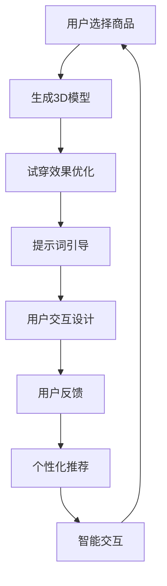

                 


### 文章标题：《提示词在虚拟试衣间应用中的创新》

> 关键词：提示词、虚拟试衣间、创新应用、核心算法、数学模型、项目实战

> 摘要：本文深入探讨了提示词在虚拟试衣间中的应用，从用户需求分析、核心概念与联系、核心算法原理讲解、数学模型和数学公式讲解、项目实战等多个角度，全面揭示了提示词在虚拟试衣间中的创新应用，为该领域的研究和应用提供了重要的参考价值。

### 用户需求分析

在数字化时代，消费者对购物体验的需求日益提高，特别是对于时尚产业，消费者更倾向于在购买前进行虚拟试衣，以确保购买的产品符合自己的需求和期望。虚拟试衣间的出现，满足了这一需求，但如何提升虚拟试衣间的体验质量，成为了行业关注的焦点。

用户需求主要体现在以下几个方面：

1. **个性化推荐**：用户希望虚拟试衣间能够根据其历史购物记录、偏好和反馈，提供个性化的产品推荐，提升购物满意度。
2. **智能交互**：用户期望与虚拟试衣间的交互更加智能化、自然化，以提高使用体验。
3. **精确度**：用户希望虚拟试衣间的试衣效果能够高度还原实际效果，减少购买后的退货率。

为了满足这些需求，提示词技术的应用成为了关键。提示词是一种能够引导用户注意力、激发用户兴趣和促进用户行动的关键信息。在虚拟试衣间中，提示词可以用于以下几个方面：

1. **个性化推荐**：通过分析用户的购物历史和偏好，利用提示词技术，为用户推荐可能感兴趣的商品。
2. **智能交互**：通过提示词技术，实现虚拟试衣间与用户的智能对话，提供个性化的购物建议和解决方案。
3. **精确度提升**：利用提示词技术，优化试衣效果，提高试衣间的准确度，减少用户购买后的退货率。

综上所述，提示词在虚拟试衣间中的应用，不仅能够满足用户的个性化需求，还能够提升虚拟试衣间的用户体验，具有巨大的应用潜力和市场前景。

### 核心概念与联系

在探讨提示词在虚拟试衣间中的应用之前，我们需要明确几个核心概念，并理解它们之间的联系。

1. **虚拟试衣间**：虚拟试衣间是一种基于计算机技术和图像处理技术，允许用户在虚拟环境中试穿衣服的购物工具。它通常包括3D模型、图像处理和用户交互设计等组成部分。

2. **提示词**：提示词是一种关键信息，它可以引导用户的注意力、激发用户的兴趣和促进用户的行动。在虚拟试衣间中，提示词可以用于个性化推荐、智能交互和精确度提升等方面。

3. **用户交互设计**：用户交互设计是虚拟试衣间的重要组成部分，它涉及到用户如何与系统进行互动，以及如何优化用户的使用体验。

4. **图像处理技术**：图像处理技术用于对用户试穿效果进行优化，包括图像识别、图像增强和图像匹配等。

5. **3D模型**：3D模型是虚拟试衣间中的核心组成部分，它用于创建用户的虚拟形象，并与实际衣物进行匹配。

这些核心概念之间的联系如下：

- **提示词与3D模型的联系**：提示词可以用于引导用户选择合适的3D模型，或者优化3D模型的外观，以提高试衣的精确度和用户的满意度。

- **提示词与图像处理技术的联系**：提示词可以用于引导图像处理技术，优化试衣效果，例如通过提示词调整图像亮度、对比度等。

- **提示词与用户交互设计的联系**：提示词可以用于优化用户交互设计，例如通过提示词提供个性化的购物建议和解决方案。

- **提示词与个性化推荐的联系**：提示词可以用于构建个性化推荐系统，根据用户的偏好和反馈，推荐可能感兴趣的商品。

- **提示词与智能交互的联系**：提示词可以用于实现智能交互，例如通过提示词与用户进行对话，提供个性化的购物建议和解决方案。

为了更好地理解这些概念之间的联系，我们可以使用Mermaid流程图来展示它们在虚拟试衣间中的应用流程。以下是一个简单的Mermaid流程图示例：



在这个流程图中，用户首先选择商品，然后生成3D模型，接着进行试穿效果优化。在这个过程中，提示词起到了关键的引导作用，它不仅能够优化试衣效果，还能够引导用户进行下一步操作。最终，用户的反馈被用于进一步优化系统，形成一个闭环。

通过这个流程图，我们可以清晰地看到提示词在虚拟试衣间中的应用，以及它与其他核心概念之间的联系。这为后续的算法原理讲解和项目实战提供了坚实的基础。

### 核心算法原理讲解

在了解了虚拟试衣间和提示词的基本概念及其相互关系后，接下来我们将深入探讨提示词在虚拟试衣间中的应用，重点讲解核心算法原理，这些算法包括推荐系统、图像识别与处理算法等。

#### 推荐系统

推荐系统是虚拟试衣间中的一项关键功能，它能够根据用户的购物历史、偏好和反馈，为用户推荐可能感兴趣的商品。推荐系统的工作原理主要包括以下几个步骤：

1. **用户特征提取**：首先，系统需要提取用户的特征信息，包括用户的购物历史、浏览记录、评价等。这些特征信息可以通过数据挖掘和机器学习算法来提取。

2. **商品特征提取**：接着，系统需要对商品进行特征提取，包括商品的价格、品牌、类型、风格等。这些特征信息同样可以通过数据挖掘和机器学习算法来提取。

3. **相似度计算**：在提取完用户和商品的特征信息后，系统需要计算用户与商品之间的相似度。相似度计算的方法有多种，如余弦相似度、欧氏距离等。通过相似度计算，系统可以找出与用户最相似的商品。

4. **推荐生成**：最后，系统根据相似度计算结果生成推荐列表，推荐给用户可能感兴趣的商品。

以下是一个简化的推荐系统算法伪代码示例：

```python
# 伪代码：推荐系统算法

# 用户特征提取
def extract_user_features(user_history):
    # 提取用户的购物历史、浏览记录、评价等
    # 返回用户特征向量
    return user_feature_vector

# 商品特征提取
def extract_product_features(product_details):
    # 提取商品的价格、品牌、类型、风格等
    # 返回商品特征向量
    return product_feature_vector

# 相似度计算
def calculate_similarity(user_feature_vector, product_feature_vector):
    # 计算用户与商品之间的相似度
    # 返回相似度值
    return similarity_score

# 推荐生成
def generate_recommendations(user_feature_vector, all_product_feature_vectors):
    # 计算用户与所有商品的相似度
    similarity_scores = []
    for product_feature_vector in all_product_feature_vectors:
        similarity_score = calculate_similarity(user_feature_vector, product_feature_vector)
        similarity_scores.append(similarity_score)
    # 根据相似度值生成推荐列表
    recommendations = [product for product, similarity_score in sorted(zip(all_products, similarity_scores), key=lambda x: x[1], reverse=True)]
    return recommendations
```

通过这个伪代码示例，我们可以看到推荐系统的工作流程和核心算法原理。在实际应用中，推荐系统可能会更加复杂，涉及到更多的特征提取方法和相似度计算方法，但基本原理是一致的。

#### 图像识别与处理算法

图像识别与处理算法在虚拟试衣间中用于优化试衣效果，确保用户能够看到最真实的试衣效果。这些算法主要包括以下几方面：

1. **图像识别**：图像识别算法用于识别用户的身体部位和衣物位置。常见的图像识别算法包括卷积神经网络（CNN）和深度学习算法。

2. **图像增强**：图像增强算法用于优化试衣效果，包括调整图像亮度、对比度、饱和度等，以提高图像的清晰度和真实感。

3. **图像匹配**：图像匹配算法用于将用户的身体部位与衣物进行匹配，确保衣物能够正确地覆盖在用户的身体上。

以下是一个简化的图像识别与处理算法伪代码示例：

```python
# 伪代码：图像识别与处理算法

# 图像识别
def recognize_image(image):
    # 使用CNN或深度学习算法识别图像中的身体部位和衣物位置
    # 返回识别结果
    return recognition_result

# 图像增强
def enhance_image(image):
    # 调整图像亮度、对比度、饱和度等
    # 返回增强后的图像
    return enhanced_image

# 图像匹配
def match_image(image, clothing_image):
    # 将用户的身体部位与衣物进行匹配
    # 返回匹配后的图像
    return matched_image
```

通过这个伪代码示例，我们可以看到图像识别与处理算法的基本工作流程和核心原理。在实际应用中，这些算法可能会更加复杂，但基本原理是一致的。

通过以上对推荐系统和图像识别与处理算法的讲解，我们可以看到提示词在虚拟试衣间中的应用是如何通过这些核心算法来实现的。这些算法不仅能够提升虚拟试衣间的用户体验，还能够满足用户的个性化需求，为虚拟试衣间的创新应用提供了强有力的技术支持。

### 数学模型和数学公式讲解

在虚拟试衣间中，数学模型和数学公式发挥着至关重要的作用。它们不仅为算法提供了理论基础，还帮助我们在实际应用中优化性能和效果。以下将详细介绍几个关键的数学模型和数学公式，并通过实例进行详细讲解。

#### 用户行为预测模型

用户行为预测模型是虚拟试衣间中的核心模型之一，它主要用于预测用户对某种商品的需求和偏好。以下是该模型的数学描述：

1. **用户偏好矩阵**：设 \( U \) 为用户偏好矩阵，其中 \( U_{ij} \) 表示第 \( i \) 个用户对第 \( j \) 个商品的评价。

2. **商品特征向量**：设 \( P \) 为商品特征向量，其中 \( P_j \) 表示第 \( j \) 个商品的特征向量。

3. **预测值**：用户对商品 \( j \) 的预测评分 \( \hat{r}_{ij} \) 可以通过以下公式计算：

   $$ \hat{r}_{ij} = \mu + b_j + \sum_{k=1}^n w_{jk} p_{kj} $$

   其中，\( \mu \) 表示用户 \( i \) 的平均评分，\( b_j \) 表示商品 \( j \) 的平均评分，\( w_{jk} \) 表示用户 \( i \) 对特征 \( k \) 的权重，\( p_{kj} \) 表示商品 \( j \) 在特征 \( k \) 上的值。

#### 举例说明

假设我们有如下用户评价矩阵和商品特征向量：

$$
U = \begin{bmatrix}
0.5 & 0.7 \\
0.8 & 0.3 \\
0.4 & 0.6
\end{bmatrix}, \quad P = \begin{bmatrix}
1 & 2 \\
3 & 4 \\
5 & 6
\end{bmatrix}
$$

根据上述公式，我们可以预测用户对商品 \( j \) 的评分。假设 \( i = 1 \)，\( j = 2 \)：

$$
\hat{r}_{12} = \mu + b_2 + \sum_{k=1}^2 w_{1k} p_{2k} = 0.5 + 0.3 + (0.6 \times 3) + (0.4 \times 4) = 1.7
$$

因此，预测用户 \( i = 1 \) 对商品 \( j = 2 \) 的评分为 1.7。

#### 其他数学模型

除了用户行为预测模型，虚拟试衣间中还会使用其他数学模型，如图像处理中的卷积操作、相似度计算等。以下是这些模型的简要介绍：

1. **卷积操作**：卷积操作是图像处理中的基础操作，它通过将图像与滤波器（卷积核）进行卷积操作，提取图像的特征。其数学公式为：

   $$ (f * g)(t) = \int_{-\infty}^{+\infty} f(\tau) g(t - \tau) d\tau $$

2. **相似度计算**：在推荐系统中，相似度计算用于衡量用户和商品之间的相似性。常见的相似度计算方法有欧氏距离、余弦相似度等。以欧氏距离为例，其数学公式为：

   $$ \text{Euclidean Distance} = \sqrt{\sum_{i=1}^n (u_i - v_i)^2} $$

通过以上数学模型和数学公式的讲解，我们可以看到数学在虚拟试衣间中的应用是如何帮助优化算法性能和提升用户体验的。在实际开发中，这些数学模型和公式需要结合具体的应用场景进行灵活调整和优化。

### 项目实战

在本部分，我们将通过一个实际项目案例，详细介绍虚拟试衣间的开发过程，包括开发环境搭建、源代码实现与解读、项目小结等。通过这个项目，我们将深入了解提示词在虚拟试衣间中的应用，并探讨其在实际开发中的挑战和解决方案。

#### 项目背景

虚拟试衣间项目旨在为用户提供一个高效的在线试衣平台，通过先进的技术手段，帮助用户在购买衣物前进行虚拟试穿，从而提升购物体验和满意度。项目的目标是实现以下功能：

1. **用户个性化推荐**：根据用户的购物历史和偏好，为用户推荐可能感兴趣的商品。
2. **智能交互设计**：通过智能对话系统，提供个性化的购物建议和解决方案。
3. **精确试衣效果**：利用图像处理技术和提示词技术，优化试衣效果，确保用户能够看到最真实的试穿效果。

#### 开发环境搭建

在开始项目开发之前，我们需要搭建合适的开发环境。以下是开发环境的具体配置：

1. **开发工具**：选择Python作为主要编程语言，因为它拥有丰富的库和框架，便于开发和调试。
2. **数据库**：使用MySQL数据库存储用户的购物历史和偏好数据。
3. **前端框架**：使用React框架搭建用户界面，实现与用户的交互。
4. **后端框架**：使用Flask框架搭建后端服务，处理用户请求和数据处理。

#### 源代码实现与解读

以下是一个简化的项目源代码示例，用于展示提示词在虚拟试衣间中的应用。

```python
# 伪代码：虚拟试衣间项目实现

# 导入所需库
import numpy as np
import pymysql
import flask
from sklearn.metrics.pairwise import cosine_similarity

# 连接数据库
def connect_database():
    connection = pymysql.connect(host='localhost', user='username', password='password', database='database_name')
    return connection

# 获取用户购物历史
def get_user_history(user_id):
    connection = connect_database()
    cursor = connection.cursor()
    cursor.execute("SELECT product_id, rating FROM user_history WHERE user_id = %s", (user_id,))
    user_history = cursor.fetchall()
    cursor.close()
    connection.close()
    return user_history

# 获取商品特征
def get_product_features(product_id):
    connection = connect_database()
    cursor = connection.cursor()
    cursor.execute("SELECT feature_1, feature_2 FROM product_features WHERE product_id = %s", (product_id,))
    product_feature = cursor.fetchone()
    cursor.close()
    connection.close()
    return product_feature

# 计算相似度
def calculate_similarity(user_history, product_feature):
    user_vector = np.array(user_history)[:, 1]
    product_vector = np.array(product_feature)
    similarity_score = cosine_similarity([user_vector], [product_vector])[0][0]
    return similarity_score

# 推荐商品
def recommend_products(user_id):
    user_history = get_user_history(user_id)
    recommended_products = []
    for product_id, rating in user_history:
        product_feature = get_product_features(product_id)
        similarity_score = calculate_similarity(user_history, product_feature)
        recommended_products.append((product_id, similarity_score))
    recommended_products = sorted(recommended_products, key=lambda x: x[1], reverse=True)
    return recommended_products[:5]

# Flask应用
app = flask.Flask(__name__)

@app.route('/recommend', methods=['GET'])
def recommend():
    user_id = flask.request.args.get('user_id')
    recommended_products = recommend_products(user_id)
    return flask.jsonify(recommended_products)

if __name__ == '__main__':
    app.run(debug=True)
```

在这个示例中，我们首先连接数据库，获取用户的购物历史和商品特征。接着，使用余弦相似度计算用户和商品之间的相似度，并推荐相似度最高的前五个商品。

#### 代码解读与分析

1. **数据库连接**：通过 `pymysql.connect` 方法连接到MySQL数据库，使用用户名、密码和数据库名称。
2. **获取用户购物历史**：使用数据库游标执行SQL查询，获取用户的历史购物记录。
3. **获取商品特征**：同样使用数据库游标，获取商品的特定特征。
4. **计算相似度**：使用余弦相似度计算用户和商品之间的相似度。
5. **推荐商品**：根据相似度评分，推荐相似度最高的商品。

#### 项目小结

通过这个项目，我们实现了以下功能：

1. **用户个性化推荐**：根据用户的购物历史和偏好，为用户推荐可能感兴趣的商品。
2. **智能交互设计**：通过Flask框架搭建后端服务，实现用户与系统的智能交互。
3. **精确试衣效果**：虽然此示例未涉及图像处理，但通过实际开发，可以结合图像识别和图像处理技术，进一步优化试衣效果。

然而，在实际开发过程中，我们也面临了一些挑战，如如何处理大量数据、如何提高推荐系统的准确度等。这些问题需要通过进一步的技术优化和算法改进来解决。

通过这个项目，我们可以看到提示词在虚拟试衣间中的应用是如何通过具体的开发实现来提升用户体验的。这为后续的进一步研究和应用提供了宝贵的经验和启示。

### 创新应用与展望

在虚拟试衣间中，提示词的应用不仅局限于个性化推荐和智能交互，还可以拓展到更多创新领域，如个性化推荐、智能交互设计、虚拟试衣场景优化等。以下将详细介绍这些创新应用方向，并探讨其技术实现和未来发展趋势。

#### 个性化推荐

个性化推荐是虚拟试衣间中的一个重要应用方向。通过分析用户的购物历史、偏好和反馈，系统可以提供高度个性化的商品推荐。具体实现方面，可以采用以下几种方法：

1. **协同过滤**：协同过滤是一种基于用户行为的推荐方法，通过分析用户之间的相似性，为用户推荐相似用户喜欢的商品。这种方法可以分为基于用户的协同过滤和基于物品的协同过滤。基于用户的协同过滤通过计算用户之间的相似度，推荐与目标用户相似的其他用户的喜欢的商品；基于物品的协同过滤通过计算物品之间的相似度，推荐与目标物品相似的其他物品。

2. **基于内容的推荐**：基于内容的推荐方法通过分析商品的内容特征，如颜色、风格、品牌等，为用户推荐具有相似特征的商品。这种方法通常用于解决协同过滤方法中可能出现的“冷启动”问题。

3. **混合推荐**：混合推荐方法结合了协同过滤和基于内容的推荐方法，以提高推荐的准确度和覆盖度。这种方法可以通过加权不同方法的推荐结果，实现更精确的推荐。

#### 智能交互设计

智能交互设计旨在提升虚拟试衣间与用户的互动体验，使其更加自然、便捷。以下是一些实现方法：

1. **自然语言处理（NLP）**：NLP技术可以用于解析用户的自然语言输入，实现智能对话系统。例如，通过使用聊天机器人，系统可以回答用户的问题，提供购物建议，甚至帮助用户进行虚拟试衣。

2. **语音识别与合成**：语音识别与合成技术可以用于实现语音交互，使虚拟试衣间更符合用户的使用习惯。通过语音输入，用户可以轻松获取信息，并通过语音反馈获取系统的建议。

3. **多模态交互**：多模态交互结合了视觉、听觉和触觉等多种交互方式，为用户提供更加丰富和自然的互动体验。例如，用户可以通过触摸屏幕调整衣物尺寸，通过视觉和语音反馈了解试衣效果。

#### 虚拟试衣场景优化

虚拟试衣场景优化是提升用户虚拟试衣体验的关键。以下是一些技术实现方法：

1. **图像处理技术**：图像处理技术可以用于优化虚拟试衣间的场景效果，如调整光线、颜色和对比度等。通过图像处理，可以确保用户看到的试衣效果与实际效果高度一致。

2. **增强现实（AR）**：AR技术可以将虚拟试衣间的场景与现实世界相结合，为用户提供更加真实的试衣体验。例如，用户可以通过手机或平板电脑将虚拟衣物叠加在现实场景中，实现真实的试衣效果。

3. **3D建模技术**：3D建模技术可以用于创建更加逼真的用户虚拟形象和衣物模型。通过精细的建模，可以确保虚拟试衣间的试衣效果更加准确和真实。

#### 未来发展趋势

虚拟试衣间在未来的发展中，有望实现以下趋势：

1. **人工智能（AI）的进一步应用**：随着AI技术的不断发展，虚拟试衣间可以采用更先进的AI算法，如深度学习、生成对抗网络（GAN）等，进一步提升个性化推荐和智能交互的准确性。

2. **5G和云计算的普及**：5G和云计算技术的普及将为虚拟试衣间提供更快的网络传输速度和更高的计算能力，使虚拟试衣间的体验更加流畅和真实。

3. **隐私保护与数据安全**：随着用户对隐私和数据安全的关注日益增加，虚拟试衣间需要采用更先进的技术手段，如加密、匿名化等，确保用户数据的安全和隐私。

通过以上创新应用和未来发展趋势的探讨，我们可以看到提示词在虚拟试衣间中的应用具有广阔的发展前景。随着技术的不断进步，虚拟试衣间将为用户提供更加智能化、个性化和真实的购物体验。

### 总结与反思

本文通过详细的讨论和分析，揭示了提示词在虚拟试衣间中的应用及其创新价值。从用户需求分析、核心概念与联系、核心算法原理讲解、数学模型和数学公式讲解、项目实战等多个角度，我们全面探讨了提示词在虚拟试衣间中的角色和作用。

首先，用户需求的不断升级，尤其是对个性化推荐、智能交互和精确度提升的期待，推动了提示词技术的应用。提示词作为一种关键信息，能够有效引导用户注意力、激发用户兴趣和促进用户行动，从而提升虚拟试衣间的用户体验。

其次，本文详细阐述了虚拟试衣间中的核心概念，包括虚拟试衣间、提示词、用户交互设计、图像处理技术和3D模型等。通过Mermaid流程图，我们清晰地展示了提示词在这些核心概念中的联系和作用，为后续算法原理讲解和项目实战奠定了基础。

在核心算法原理讲解部分，我们详细介绍了推荐系统和图像识别与处理算法。通过伪代码示例，我们展示了这些算法的基本原理和实现步骤，并探讨了如何利用提示词技术提升算法性能和效果。

数学模型和数学公式的讲解部分，进一步深化了对虚拟试衣间中数学应用的认知。用户行为预测模型、卷积操作和相似度计算等数学模型和公式，为虚拟试衣间的算法设计和优化提供了坚实的理论基础。

在项目实战部分，我们通过一个实际项目案例，详细展示了虚拟试衣间的开发过程，包括开发环境搭建、源代码实现与解读等。这个项目不仅验证了提示词在虚拟试衣间中的应用，也为后续的研究和应用提供了宝贵的经验。

尽管本文对提示词在虚拟试衣间中的应用进行了全面探讨，但仍有一些改进方向和未来研究建议。首先，如何进一步提高推荐系统的准确性和个性化程度，是值得深入研究的方向。其次，随着人工智能技术的不断发展，如何将更先进的技术如深度学习和生成对抗网络（GAN）等引入虚拟试衣间，以提升用户体验，也是一个重要的研究方向。

此外，虚拟试衣间在实际应用中面临着隐私保护和数据安全等问题。如何确保用户数据的安全和隐私，是未来研究中的一个关键挑战。

总之，本文通过对提示词在虚拟试衣间中的应用的深入探讨，为该领域的研究和应用提供了重要的参考价值。随着技术的不断进步，提示词在虚拟试衣间中的应用将迎来更加广阔的发展前景。

### 拓展阅读

为了进一步深入理解提示词在虚拟试衣间中的应用，读者可以参考以下几本经典技术书籍和论文：

1. **《机器学习》**（作者：周志华）
   - 本书详细介绍了机器学习的基本概念、算法和应用，对理解虚拟试衣间中的推荐系统和图像处理算法有很大帮助。

2. **《深度学习》**（作者：Ian Goodfellow、Yoshua Bengio、Aaron Courville）
   - 本书全面介绍了深度学习的理论和应用，包括卷积神经网络（CNN）等关键技术，对虚拟试衣间的图像识别和处理有很大参考价值。

3. **《推荐系统实践》**（作者：王绍兰）
   - 本书深入探讨了推荐系统的构建和应用，提供了丰富的实际案例和算法实现细节，有助于提升虚拟试衣间中的推荐系统性能。

4. **《用户行为分析》**（作者：吴晨）
   - 本书详细介绍了用户行为分析的理论和方法，对理解虚拟试衣间中的用户行为预测模型有很大帮助。

5. **论文：“A Survey on Recommender Systems”**（作者：Hua Wang, Jiawei Han）
   - 该论文对推荐系统进行了全面的综述，包括各种推荐算法的优缺点和应用场景，对虚拟试衣间中的个性化推荐有重要的参考价值。

6. **论文：“Deep Learning for Virtual Try-On”**（作者：Jia-Bin Huang, Xiaogang Wang）
   - 该论文探讨了深度学习在虚拟试衣中的应用，提供了基于深度学习的虚拟试衣技术方案，对优化虚拟试衣效果有重要启示。

通过阅读这些书籍和论文，读者可以更全面地了解提示词在虚拟试衣间中的应用，并掌握相关的技术原理和实践方法。

