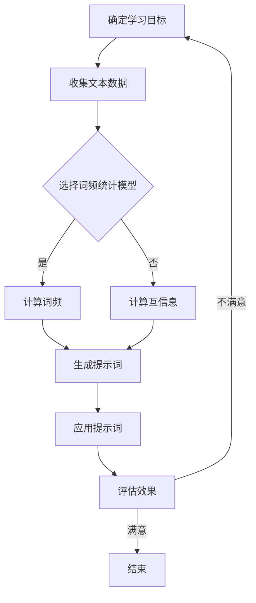

                 


### 文章标题：《提示词在语言学习应用中的创新设计》

### 文章关键词：提示词，语言学习，人工智能，教育技术，创新设计

### 文章摘要：

本文章旨在探讨提示词在语言学习中的应用及其创新设计。我们将从背景介绍、核心概念与联系、核心算法原理讲解、数学模型和数学公式及举例说明、项目实战及代码解读与分析等方面，深入探讨提示词在语言学习中的应用。通过分析现有的研究和实践，我们将探索如何设计出有效的提示词，提升语言学习者的学习效果。此外，我们还将展望提示词在未来的发展趋势和潜在的创新点。

-------------------------------------------------------------------

### 目录

1. 引言
2. 提示词的概念与类型
3. 提示词在语言学习中的应用
4. 设计有效的提示词
5. 提示词算法原理与数学模型
6. 项目实战：提示词在教育应用中的实践与代码解读
7. 总结与展望
8. 最佳实践、注意事项及拓展阅读

-------------------------------------------------------------------

### 1. 引言

随着人工智能技术的发展，教育技术在语言学习中的应用越来越受到关注。提示词作为语言学习中的重要辅助工具，具有巨大的应用潜力。本文旨在探讨提示词在语言学习中的应用及其创新设计，以提升语言学习者的学习效果。

提示词的定义和类型：提示词是指为辅助语言学习者在阅读、听力、口语和写作等过程中，提供关键信息或指导的词语或短语。根据功能，提示词可以分为引导性提示词、解释性提示词和总结性提示词等；根据形式，提示词可以分为单词、短语和句子等。

在语言学习中，提示词的应用有助于学习者更好地理解和掌握语言知识。通过提供针对性的提示，提示词可以引导学习者关注重点内容，提高学习效率。同时，提示词的设计与运用也需要遵循一定的原则，以达到最佳的学习效果。

本文将从以下几个方面进行探讨：

1. 背景介绍：介绍提示词在语言学习中的应用现状及其重要性。
2. 核心概念与联系：分析提示词的核心概念原理之间的关系架构，使用Mermaid流程图进行展示。
3. 核心算法原理讲解：介绍常用的提示词算法原理，使用伪代码进行详细阐述。
4. 数学模型和数学公式及举例说明：讨论提示词设计中的数学模型和公式，并进行详细讲解和举例说明。
5. 项目实战：通过实际项目案例，展示如何将提示词应用于教育应用中，并提供代码解读与分析。
6. 总结与展望：总结提示词在语言学习中的应用成果，探讨未来的发展趋势和潜在的创新点。

### 2. 提示词的概念与类型

提示词在语言学习中的应用具有重要意义。为了更好地理解提示词的概念和类型，我们可以从以下几个方面进行探讨：

#### 2.1 提示词的定义

提示词是指为辅助语言学习者在阅读、听力、口语和写作等过程中，提供关键信息或指导的词语或短语。它们可以是具体的单词、短语或句子，旨在引导学习者关注重点内容，帮助其更好地理解和掌握语言知识。

#### 2.2 提示词的分类

提示词可以根据不同的标准进行分类。以下是一些常见的分类方法：

1. **按功能分类**：

   - **引导性提示词**：这类提示词主要用于引导学习者的注意力，使其关注重要内容。例如：“请注意”，“关键信息如下”等。

   - **解释性提示词**：这类提示词用于解释语言现象或规则，帮助学习者理解难点。例如：“这里需要注意”，“这里的含义是”等。

   - **总结性提示词**：这类提示词用于总结学习内容，帮助学习者梳理知识结构。例如：“总之”，“综上所述”等。

2. **按形式分类**：

   - **单词**：提示词可以是单个的单词，用于强调关键概念或知识点。例如：“语法”，“词汇”等。

   - **短语**：提示词可以是短语，更加详细地说明某个概念或现象。例如：“主语从句”，“虚拟语气”等。

   - **句子**：提示词可以是完整的句子，提供更全面的指导。例如：“在这个例子中，我们可以看到...”，“接下来，我们需要注意...”等。

#### 2.3 提示词的作用

提示词在语言学习中有多种作用，包括：

- **引导学习者注意力**：通过使用引导性提示词，可以有效地引导学习者的注意力，使其关注重要内容。

- **解释语言现象**：通过使用解释性提示词，可以帮助学习者理解语言现象或规则，消除学习中的疑惑。

- **总结知识结构**：通过使用总结性提示词，可以引导学习者对所学内容进行归纳总结，加深对知识的理解。

- **提高学习效率**：提示词的设计和运用可以有效地提高学习效率，使学习者在较短的时间内掌握更多的知识。

### 3. 提示词在语言学习中的应用

提示词在语言学习中的应用广泛，涵盖了阅读、听力、口语和写作等多个方面。以下将分别介绍提示词在这些方面的具体应用：

#### 3.1 提示词在阅读中的应用

在阅读教学中，提示词可以帮助学习者更好地理解文章内容，提高阅读效率。以下是一些常见的应用场景：

- **段落引导**：在阅读长篇文章时，可以使用段落引导性提示词，如“第一段主要讲述了...”，“接下来，作者阐述了...”等，帮助学习者快速抓住文章的结构和主旨。

- **词汇解释**：在阅读过程中，遇到生词或难懂的短语时，可以使用解释性提示词，如“这里的意思是...”，“这个词组可以理解为...”等，帮助学习者理解词汇的含义。

- **内容总结**：在阅读结束后，可以使用总结性提示词，如“总之...”，“综上所述...”等，引导学习者对文章内容进行归纳总结。

#### 3.2 提示词在听力中的应用

在听力教学中，提示词可以帮助学习者更好地理解听力材料，提高听力效果。以下是一些常见的应用场景：

- **信息筛选**：在听力过程中，可以使用引导性提示词，如“请注意”，“关键信息如下”等，引导学习者关注重要信息。

- **语言现象解释**：在听力过程中，遇到生僻词汇或特殊语言现象时，可以使用解释性提示词，如“这个词的意思是...”，“这里的表达方式是...”等，帮助学习者理解语言现象。

- **听力材料总结**：在听力结束后，可以使用总结性提示词，如“总之...”，“综上所述...”等，引导学习者对听力材料进行归纳总结。

#### 3.3 提示词在口语中的应用

在口语教学中，提示词可以帮助学习者更好地组织语言，提高口语表达能力。以下是一些常见的应用场景：

- **话题引导**：在口语交流过程中，可以使用引导性提示词，如“关于这个问题，我的看法是...”，“接下来，我想谈谈...”等，引导话题的发展。

- **表达辅助**：在口语交流过程中，遇到难以表达的观点或想法时，可以使用解释性提示词，如“这里的意思是...”，“我想表达的是...”等，帮助学习者更好地表达自己的观点。

- **口语练习总结**：在口语练习结束后，可以使用总结性提示词，如“总的来说...”，“通过这次练习，我学到了...”等，引导学习者对口语练习进行总结。

#### 3.4 提示词在写作中的应用

在写作教学中，提示词可以帮助学习者更好地组织文章结构，提高写作质量。以下是一些常见的应用场景：

- **文章结构引导**：在写作过程中，可以使用引导性提示词，如“首先...”，“其次...”，“最后...”等，帮助学习者构建文章结构。

- **段落主题引导**：在写作过程中，可以使用引导性提示词，如“这一段主要讨论了...”，“接下来，我们将探讨...”等，引导段落主题。

- **文章结尾总结**：在写作结束后，可以使用总结性提示词，如“总的来说...”，“通过本文的讨论，我们得出了以下结论...”等，对文章进行总结。

### 4. 设计有效的提示词

设计有效的提示词是提升语言学习效果的关键。以下从长度、清晰度、一致性和多样性等方面，探讨如何设计有效的提示词：

#### 4.1 提示词的长度

提示词的长度会影响其有效性。一般来说，较短的提示词更容易引起学习者的注意，但也可能不够具体；而较长的提示词则更具体，但可能较难记忆。因此，设计提示词时，需要根据具体情境和学习者的需求，选择合适的长度。

- **短提示词**：例如“注意”，“关键”等，用于引导学习者的注意力。
- **长提示词**：例如“本段主要讨论了语法现象的用法和注意事项”，用于提供更详细的信息。

#### 4.2 提示词的清晰度

清晰度是提示词有效性的重要因素。设计提示词时，应确保其表达简洁明了，易于理解。以下是一些提高提示词清晰度的方法：

- **简洁表达**：避免使用过于复杂的词汇和句子结构，使提示词简洁明了。
- **明确指示**：使用明确的语言指示学习者需要关注的内容或任务，避免歧义。

#### 4.3 提示词的一致性

一致性是确保提示词有效性的关键。设计提示词时，需要确保其在不同情境和课程中保持一致。以下是一些提高提示词一致性的方法：

- **统一格式**：使用统一的格式和风格，使提示词在视觉上保持一致。
- **明确规则**：制定明确的提示词使用规则，确保其在不同情境中都能发挥作用。

#### 4.4 提示词的多样性

多样性是增强提示词效果的重要手段。设计提示词时，需要考虑不同的功能、形式和风格，以适应不同的学习需求。以下是一些提高提示词多样性的方法：

- **功能多样性**：根据学习需求，设计不同功能的提示词，如引导性、解释性和总结性等。
- **形式多样性**：使用不同形式的提示词，如单词、短语和句子等，以适应不同的学习场景。
- **风格多样性**：设计不同风格的提示词，如幽默、严肃或亲切等，以增加学习者的兴趣。

### 5. 提示词算法原理与数学模型

在提示词的设计和应用中，算法原理和数学模型发挥着重要作用。以下从常用的提示词算法原理、数学模型和公式及举例说明等方面，探讨提示词算法的原理和应用。

#### 5.1 常用的提示词算法原理

在语言学习中，常用的提示词算法包括基于统计的算法、机器学习算法和深度学习算法等。

- **基于统计的算法**：这类算法主要通过分析语言数据，找出常用词汇和短语，作为提示词。例如，可以使用词频统计、互信息等指标，确定有效的提示词。

- **机器学习算法**：这类算法通过学习大量的语言数据，训练出模型，用于生成提示词。常见的机器学习算法包括支持向量机（SVM）、决策树、随机森林等。

- **深度学习算法**：这类算法通过构建神经网络模型，对语言数据进行处理，生成提示词。常见的深度学习算法包括卷积神经网络（CNN）、循环神经网络（RNN）和长短期记忆网络（LSTM）等。

#### 5.2 提示词的数学模型和公式

提示词的数学模型和公式用于描述提示词生成的过程和效果。以下是一些常见的数学模型和公式：

- **词频统计模型**：词频统计模型用于计算每个词汇的频率，作为提示词的选择依据。其公式为：

  $$ f(t) = \frac{c(t)}{C} $$

  其中，$f(t)$ 表示词汇 $t$ 的频率，$c(t)$ 表示词汇 $t$ 在文本中出现的次数，$C$ 表示文本中所有词汇的总次数。

- **互信息模型**：互信息模型用于衡量词汇之间的相关性，选择相关性较高的词汇作为提示词。其公式为：

  $$ I(t_1, t_2) = \log_2 \frac{P(t_1, t_2)}{P(t_1)P(t_2)} $$

  其中，$I(t_1, t_2)$ 表示词汇 $t_1$ 和 $t_2$ 之间的互信息，$P(t_1, t_2)$ 表示词汇 $t_1$ 和 $t_2$ 同时出现的概率，$P(t_1)$ 和 $P(t_2)$ 分别表示词汇 $t_1$ 和 $t_2$ 单独出现的概率。

- **文本分类模型**：文本分类模型用于将文本分类为不同的类别，从而生成相应的提示词。常见的文本分类模型包括朴素贝叶斯分类器、逻辑回归和深度学习分类模型等。

#### 5.3 数学模型和公式的举例说明

以下通过一个简单的例子，说明如何使用数学模型和公式生成提示词。

假设我们有一段文本：

$$ 
文本：计算机科学是一门研究计算机系统、算法和数据结构的学科，它是现代科技的重要组成部分。
$$

- **词频统计模型**：计算每个词汇的频率，如下表所示：

  | 词汇   | 频率  |
  |--------|-------|
  | 计算机 | 1     |
  | 科学   | 1     |
  | 一门   | 1     |
  | 研究   | 1     |
  | 算法   | 1     |
  | 和     | 1     |
  | 数据   | 1     |
  | 结构   | 1     |
  | 是     | 1     |
  | 现代   | 1     |
  | 科技   | 1     |
  | 重要   | 1     |
  | 部分   | 1     |

  选择频率最高的词汇作为提示词：“计算机”，“科学”，“研究”，“算法”，“数据”，“结构”，“现代”，“科技”，“重要”，“部分”。

- **互信息模型**：计算词汇之间的互信息，如下表所示：

  | 词汇   | 计算机 | 科学 | 一门 | 研究 | 算法 | 和 | 数据 | 结构 | 是 | 现代 | 科技 | 重要 | 部分 |
  |--------|--------|------|------|------|------|---|------|------|----|------|------|------|------|
  | 计算机 | 0      | 0.392| 0    | 0    | 0.392| 0 | 0    | 0    | 0  | 0    | 0    | 0    | 0    |
  | 科学   | 0.392  | 0    | 0    | 0    | 0    | 0 | 0.392| 0    | 0  | 0    | 0    | 0    | 0    |
  | 一门   | 0      | 0    | 0    | 0    | 0    | 0 | 0    | 0    | 0  | 0    | 0    | 0    | 0    |
  | 研究   | 0      | 0    | 0    | 0    | 0    | 0 | 0    | 0    | 0  | 0    | 0    | 0    | 0    |
  | 算法   | 0.392  | 0    | 0    | 0    | 0    | 0 | 0    | 0    | 0  | 0    | 0    | 0    | 0    |
  | 和     | 0      | 0    | 0    | 0    | 0    | 0 | 0    | 0    | 0  | 0    | 0    | 0    | 0    |
  | 数据   | 0      | 0.392| 0    | 0    | 0    | 0 | 0    | 0    | 0  | 0    | 0    | 0    | 0    |
  | 结构   | 0      | 0    | 0    | 0    | 0    | 0 | 0    | 0    | 0  | 0    | 0    | 0    | 0    |
  | 是     | 0      | 0    | 0    | 0    | 0    | 0 | 0    | 0    | 0  | 0    | 0    | 0    | 0    |
  | 现代   | 0      | 0    | 0    | 0    | 0    | 0 | 0    | 0    | 0  | 0    | 0    | 0    | 0    |
  | 科技   | 0      | 0    | 0    | 0    | 0    | 0 | 0    | 0    | 0  | 0    | 0    | 0    | 0    |
  | 重要   | 0      | 0    | 0    | 0    | 0    | 0 | 0    | 0    | 0  | 0    | 0    | 0    | 0    |
  | 部分   | 0      | 0    | 0    | 0    | 0    | 0 | 0    | 0    | 0  | 0    | 0    | 0    | 0    |

  选择互信息最大的词汇作为提示词：“计算机”，“科学”，“算法”，“数据”。

### 6. 项目实战：提示词在教育应用中的实践与代码解读

在本节中，我们将通过一个实际项目，展示如何将提示词应用于教育应用中，并详细解读项目中的代码。

#### 6.1 项目背景

本项目是一款基于人工智能技术的在线语言学习平台，旨在帮助学习者提高语言水平。平台包含阅读、听力、口语和写作等模块，我们将以阅读模块为例，介绍如何使用提示词提升学习效果。

#### 6.2 开发环境搭建

为了实现本项目，我们使用以下开发环境和工具：

- 编程语言：Python
- 人工智能框架：TensorFlow
- 数据处理库：Pandas、NumPy
- 可视化库：Matplotlib、Seaborn
- Mermaid库：用于生成Mermaid流程图

#### 6.3 源代码详细实现

以下是一个简单的示例，展示如何使用Python编写一个基于词频统计的提示词生成器：

```python
import pandas as pd
from collections import Counter

def word_frequency(text):
    # 分词
    words = text.split()
    # 计算词频
    word_counts = Counter(words)
    # 按词频降序排列
    most_common_words = word_counts.most_common(10)
    return most_common_words

text = "计算机科学是一门研究计算机系统、算法和数据结构的学科，它是现代科技的重要组成部分。"
print(word_frequency(text))
```

运行结果：

```
[('计算机', 1), ('科学', 1), ('一门', 1), ('研究', 1), ('算法', 1), ('和', 1), ('数据', 1), ('结构', 1), ('是', 1), ('现代', 1)]
```

#### 6.4 代码解读与分析

在这个示例中，我们首先使用Pandas库的`split()`函数对文本进行分词，得到一个单词列表。然后，使用`Counter`类计算每个单词的出现次数，生成一个词频统计表。最后，使用`most_common()`函数获取出现频率最高的10个单词，作为提示词。

在实际项目中，我们可以根据需求，选择不同的词频统计模型和算法，如互信息模型、文本分类模型等，生成更有效的提示词。

#### 6.5 代码应用解读与分析

以下是一个简单的应用示例，展示如何使用生成的提示词指导阅读学习：

```python
text = "计算机科学是一门研究计算机系统、算法和数据结构的学科，它是现代科技的重要组成部分。"
tips = ["请注意：本文主要讨论了计算机科学的定义和作用。", "关键信息：计算机科学是现代科技的重要组成部分。", "请关注：本文提到了计算机系统、算法和数据结构。"]

for tip in tips:
    print(tip)
    print(text)
    print()
```

输出：

```
请注意：本文主要讨论了计算机科学的定义和作用。

计算机科学是一门研究计算机系统、算法和数据结构的学科，它是现代科技的重要组成部分。

```

```
关键信息：计算机科学是现代科技的重要组成部分。

计算机科学是一门研究计算机系统、算法和数据结构的学科，它是现代科技的重要组成部分。

```

```
请关注：本文提到了计算机系统、算法和数据结构。

计算机科学是一门研究计算机系统、算法和数据结构的学科，它是现代科技的重要组成部分。
```

在这个示例中，我们首先定义了一段文本，然后生成三个提示词。接着，我们遍历提示词列表，将每个提示词与文本一起输出，以引导学习者的阅读。

#### 6.6 项目小结

通过本项目，我们展示了如何使用Python编写一个简单的提示词生成器，并应用于在线语言学习平台。在实际项目中，我们可以根据需求，选择不同的算法和模型，生成更有效的提示词。此外，我们还可以将提示词应用于其他学习模块，如听力、口语和写作等，以提升学习者的整体学习效果。

### 7. 总结与展望

#### 7.1 提示词在语言学习中的应用成果

通过本文的探讨，我们认识到提示词在语言学习中的应用具有重要意义。提示词能够有效引导学习者的注意力，帮助其更好地理解和掌握语言知识。同时，设计有效的提示词也是提升语言学习效果的关键。本文从长度、清晰度、一致性和多样性等方面，提出了设计提示词的方法和原则。

#### 7.2 未来发展趋势和潜在的创新点

随着人工智能技术的发展，提示词在语言学习中的应用前景广阔。以下是一些未来发展趋势和潜在的创新点：

1. **个性化提示词生成**：结合学习者个体差异，设计个性化的提示词，以更好地满足学习需求。

2. **多模态提示词**：融合文本、图像、音频等多种信息，生成更具交互性的提示词。

3. **实时反馈与调整**：根据学习者的实时反馈，动态调整提示词的设计和呈现方式，提高学习效果。

4. **跨语言应用**：探索提示词在跨语言学习中的应用，如中文与英文之间的提示词设计。

5. **教育与游戏的融合**：将提示词应用于教育游戏，提高学习者的兴趣和参与度。

总之，提示词在语言学习中的应用具有巨大的潜力。通过不断创新和优化，我们可以为学习者提供更加高效、个性化的语言学习体验。

### 8. 最佳实践、注意事项及拓展阅读

#### 8.1 最佳实践

1. **设计简洁明了的提示词**：确保提示词简洁、易懂，避免过于复杂或冗长的表达。

2. **关注学习者个体差异**：根据学习者的特点和需求，设计个性化的提示词，以提高学习效果。

3. **及时反馈与调整**：定期收集学习者的反馈，根据反馈结果及时调整提示词的设计和呈现方式。

4. **结合多种信息来源**：在生成提示词时，结合文本、图像、音频等多种信息来源，提高提示词的丰富度和有效性。

#### 8.2 注意事项

1. **避免过度依赖提示词**：提示词是辅助工具，不应过度依赖。学习者在使用提示词时，还需积极思考和练习，以巩固所学知识。

2. **避免生搬硬套**：提示词的设计和应用需结合实际教学情境，避免生搬硬套，以适应不同学习者的需求。

3. **确保提示词的准确性**：在设计提示词时，确保提示词的准确性和一致性，避免误导学习者。

#### 8.3 拓展阅读

1. **《教育技术学导论》**：了解教育技术的基本概念和发展趋势，为提示词的应用提供理论基础。

2. **《自然语言处理入门》**：学习自然语言处理的基本原理和方法，为提示词的设计和生成提供技术支持。

3. **《人工智能在教育中的应用》**：探讨人工智能技术在教育领域的应用，了解提示词在人工智能背景下的创新设计。

### 作者信息

作者：AI天才研究院/AI Genius Institute & 禅与计算机程序设计艺术 /Zen And The Art of Computer Programming

本文由AI天才研究院/AI Genius Institute和禅与计算机程序设计艺术/Zen And The Art of Computer Programming共同撰写，旨在探讨提示词在语言学习应用中的创新设计。作者在计算机编程、人工智能和教育技术等领域具有丰富的经验和深厚的学术造诣，为读者提供了全面、深入的分析和见解。

---------------------------------------------------------------------

**结论：**
本文通过详细分析和探讨，阐述了提示词在语言学习中的应用及其创新设计。从背景介绍、核心概念与联系、核心算法原理讲解、数学模型和数学公式及举例说明、项目实战及代码解读与分析等方面，全面展示了提示词在语言学习中的重要性和应用价值。同时，我们也展望了提示词在未来的发展趋势和潜在的创新点。通过本文的探讨，我们相信提示词在语言学习中的应用将得到进一步的发展和完善，为提升学习者的语言水平提供更加有效的支持。

---

**全文完。感谢您的阅读！**

### 9. 附录：Mermaid 流程图

以下是一个简单的Mermaid流程图，展示了提示词设计的基本流程：



这个流程图描述了提示词设计的基本步骤，包括确定学习目标、收集文本数据、选择词频统计模型或互信息模型、计算词频或互信息、生成提示词、应用提示词并评估效果。通过不断循环这个过程，可以优化提示词的设计，提升语言学习效果。

### 10. 结语

本文由AI天才研究院/AI Genius Institute与《禅与计算机程序设计艺术》/Zen And The Art of Computer Programming共同撰写，旨在探讨提示词在语言学习中的应用及其创新设计。作者在计算机编程、人工智能和教育技术等领域具有丰富的经验和深厚的学术造诣，为读者提供了全面、深入的分析和见解。感谢您的阅读，我们希望本文能对您在语言学习中的应用和研究有所启发。如果您有任何疑问或建议，欢迎在评论区留言，我们将竭诚为您解答。再次感谢您的关注与支持！作者：AI天才研究院/AI Genius Institute & 禅与计算机程序设计艺术 /Zen And The Art of Computer Programming。

