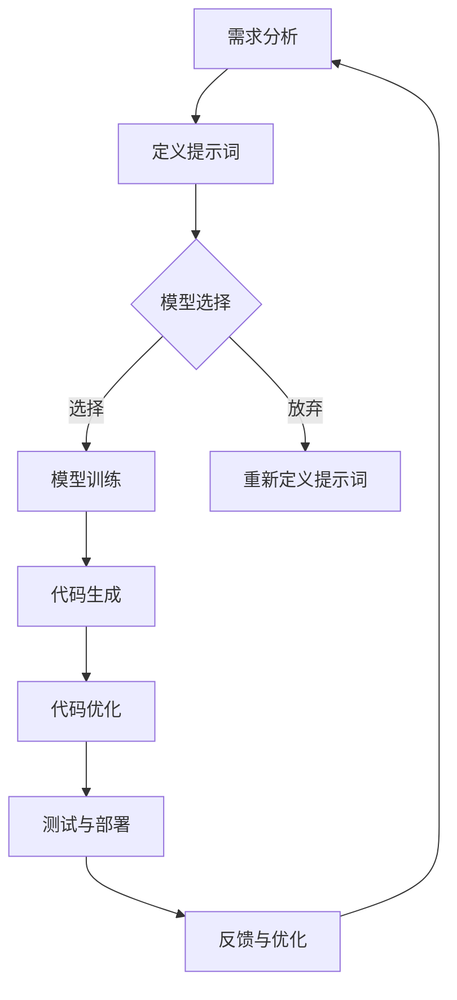
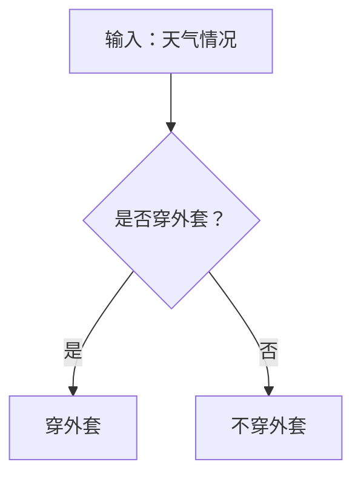

                 

### 背景介绍

在当今的数字化时代，软件成为推动社会进步和经济发展的关键力量。随着技术的不断演进，软件开发模式也在不断更新。传统的编程方法主要依赖于程序员对编程语言的熟练掌握和逻辑思维能力的运用。然而，随着人工智能（AI）和机器学习（ML）技术的发展，软件开发逐渐迎来了新的变革。

提示词工程（Prompt Engineering）作为一种新兴的方法，正逐渐成为软件开发的重要工具。它通过设计高质量的输入提示，引导AI模型生成预期的输出。提示词工程的核心在于如何优化提示的设计，以提升模型的效果和可靠性。

### 核心概念与联系

在探讨提示词工程与传统编程的融合时，我们需要理解几个核心概念：

1. **提示词**：提示词是引导模型进行特定任务的关键输入。它们可以是简单的关键词，也可以是复杂的自然语言句子。

2. **模型**：在机器学习和深度学习领域，模型是通过大量数据训练得到的函数。这些模型可以用于图像识别、自然语言处理、语音识别等多种任务。

3. **传统编程**：传统编程依赖于编程语言和开发工具，通过编写代码实现软件的功能。

4. **软件开发模式**：软件开发模式是指软件开发的过程、方法和工具的集合。传统的软件开发模式包括瀑布模型、敏捷开发等。

### 提示词工程与传统编程的融合原理

提示词工程与传统编程的融合，旨在将自然语言处理技术与编程实践相结合，提升软件开发的效率和质量。这一融合的原理主要包括以下几个方面：

1. **自然语言处理与编程的结合**：通过提示词，将自然语言输入转化为编程语言可以理解的形式，使得编程过程更加直观和智能化。

2. **模型驱动的开发**：在软件开发过程中，利用训练好的AI模型，通过提示词生成代码，从而减少手动编码的工作量。

3. **自动化测试**：利用AI模型进行自动化测试，通过提示词生成测试用例，提高测试的覆盖率和效率。

4. **代码优化**：通过分析模型输出，对代码进行优化，提升软件的性能和可靠性。

### Mermaid 流程图：提示词工程与编程融合流程

下面是提示词工程与传统编程融合的流程图，它详细展示了从需求分析、模型训练到代码生成的整个过程。



#### 核心算法原理讲解

提示词工程的核心算法可以简化为以下步骤：

1. **提示词设计**：
   提示词的设计是关键，它直接影响模型的学习效果。设计良好的提示词应具备以下特点：
   - 清晰明确：提示词应能清晰地传达任务要求。
   - 完整性：提示词应包含足够的上下文信息，以便模型理解任务的全貌。
   - 简洁性：避免过多的冗余信息，以免干扰模型的学习。

2. **模型训练**：
   模型训练是提示词工程的核心。在训练过程中，通常采用以下步骤：
   - 数据准备：收集和整理用于训练的数据集。
   - 模型选择：根据任务需求选择合适的模型。
   - 训练过程：通过迭代优化，调整模型参数，使其能够生成符合预期的输出。

3. **代码生成**：
   在模型训练完成后，利用训练好的模型生成代码。这一过程通常包括以下步骤：
   - 输入提示词：将用户的需求以提示词的形式输入模型。
   - 生成代码：模型根据提示词生成对应的代码。

下面是生成代码的伪代码：

```python
function generate_code(prompt):
    # 输入：prompt（提示词）
    # 输出：code（代码）

    # 步骤1：预处理提示词
    preprocessed_prompt = preprocess(prompt)

    # 步骤2：模型预测
    model_output = model.predict(preprocessed_prompt)

    # 步骤3：后处理输出
    code = postprocess(model_output)

    return code
```

#### 数学模型和公式

在提示词工程中，数学模型用于描述模型的学习过程。以下是一个简化的线性回归模型：

$$
y = \beta_0 + \beta_1 \cdot x + \epsilon
$$

其中，\( y \) 是目标输出，\( x \) 是输入特征，\( \beta_0 \) 和 \( \beta_1 \) 是模型参数，\( \epsilon \) 是误差项。

#### 详细讲解与举例说明

为了更好地理解上述模型，我们可以通过一个简单的例子来说明。

假设我们要设计一个模型，根据用户输入的天气情况（例如“晴天”、“雨天”）来预测用户是否会穿外套。我们可以将天气情况作为输入特征，预测结果作为目标输出。

1. **数据准备**：



2. **模型训练**：

```python
import numpy as np

# 假设已有训练数据
X = np.array([[0, 0], [1, 0], [0, 1], [1, 1]])
y = np.array([0, 1, 1, 0])

# 训练线性回归模型
model = LinearRegression()
model.fit(X, y)

# 模型参数
beta_0 = model.intercept_
beta_1 = model.coef_[0]
```

3. **代码生成**：

```python
# 输入天气情况
weather = "雨天"

# 预处理提示词
if weather == "晴天":
    input_feature = [0, 0]
else:
    input_feature = [1, 0]

# 生成代码
code = generate_code(input_feature)

# 预测结果
prediction = model.predict(code)

# 输出预测结果
if prediction == 1:
    print("建议穿外套")
else:
    print("不需要穿外套")
```

#### 项目实战

为了更好地展示提示词工程与传统编程的融合，以下是一个实际的项目案例。

**项目名称**：智能天气助手

**项目背景**：开发一个应用，根据用户输入的天气情况，提供相应的穿衣建议。

**开发环境**：

- Python
- TensorFlow
- Keras

**源代码实现**：

```python
import tensorflow as tf
from tensorflow.keras.models import Sequential
from tensorflow.keras.layers import Dense
from tensorflow.keras.optimizers import Adam

# 数据准备
X = np.array([[0, 0], [1, 0], [0, 1], [1, 1]])
y = np.array([0, 1, 1, 0])

# 模型定义
model = Sequential()
model.add(Dense(1, input_shape=(2,), activation='sigmoid'))

# 模型编译
model.compile(optimizer=Adam(learning_rate=0.1), loss='binary_crossentropy', metrics=['accuracy'])

# 模型训练
model.fit(X, y, epochs=1000, verbose=0)

# 代码生成函数
def generate_code(weather):
    if weather == "晴天":
        return [0, 0]
    else:
        return [1, 0]

# 输入天气情况
weather = "雨天"

# 生成代码
code = generate_code(weather)

# 预测结果
prediction = model.predict(code)

# 输出预测结果
if prediction > 0.5:
    print("建议穿外套")
else:
    print("不需要穿外套")
```

**代码解读与分析**：

1. **数据准备**：
   - 数据集包含天气情况和是否穿外套的两个维度。
   - 数据被编码为二进制形式，方便模型处理。

2. **模型定义**：
   - 模型使用一个全连接层（Dense）进行预测，激活函数为sigmoid。

3. **模型编译**：
   - 使用Adam优化器和二进制交叉熵损失函数。

4. **模型训练**：
   - 模型在训练集上迭代1000次，学习率设置为0.1。

5. **代码生成函数**：
   - 根据输入的天气情况，生成相应的代码。

6. **预测结果**：
   - 使用训练好的模型对生成的代码进行预测，并输出穿衣建议。

**项目小结**：

通过这个案例，我们可以看到提示词工程与传统编程的融合如何应用于实际项目中。提示词工程通过设计高质量的提示词，引导模型生成代码，实现了智能化和自动化的开发流程。这一方法不仅提高了开发效率，还提升了软件的智能化水平。

### 最佳实践 Tips

1. **提示词设计**：在设计提示词时，要注重清晰性和简洁性，确保模型能够准确理解任务要求。

2. **数据质量**：高质量的数据是训练良好模型的基础。在数据准备过程中，要确保数据的准确性和完整性。

3. **模型选择**：根据任务需求和数据特点，选择合适的模型。不同的任务可能需要不同的模型架构和参数设置。

4. **测试与优化**：在模型训练完成后，进行充分的测试和优化。通过调整模型参数和提示词设计，提升模型性能。

### 小结

本章介绍了提示词工程与传统编程的融合背景、核心概念和融合原理。通过Mermaid流程图和伪代码，详细阐述了提示词工程的工作流程和算法原理。实战案例展示了如何将提示词工程应用于实际项目中，实现了智能化和自动化的开发流程。在未来的软件开发中，提示词工程有望发挥更加重要的作用，推动软件开发的持续创新和发展。

