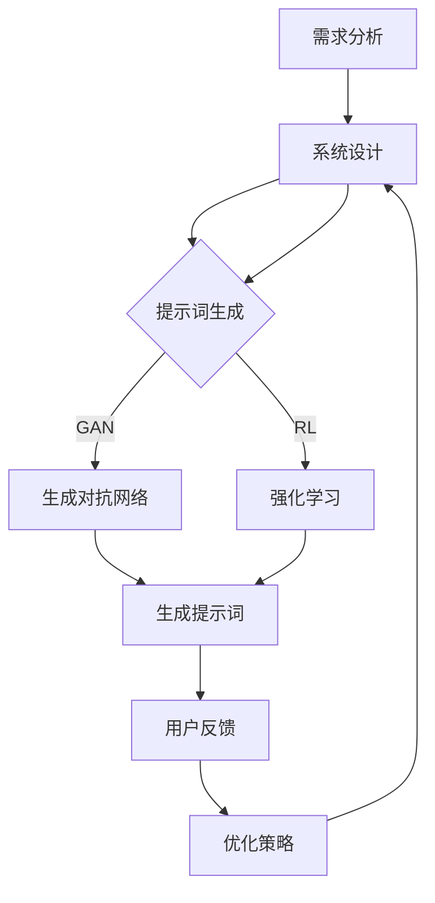

                 

### 文章标题

《提示词工程与传统软件工程的融合》

---

#### 关键词

提示词工程、传统软件工程、融合、人工智能、算法、开发流程、项目实战

---

#### 摘要

本文旨在探讨提示词工程与传统软件工程的融合，分析其在现代软件开发中的应用和优势。首先，我们介绍了提示词工程和传统软件工程的基本概念及其发展历程，揭示了它们之间的联系与差异。随后，深入探讨了提示词工程的核心概念、算法原理和数学模型，通过伪代码和LaTeX公式进行了详细讲解。接着，本文将探讨如何将提示词工程融入传统软件工程，介绍融合的开发流程、环境搭建和项目实战。最后，我们对提示词工程与传统软件工程的未来发展趋势进行了展望，并提出了相关的挑战和机遇。本文旨在为读者提供一个全面、深入的理解，帮助他们在实际项目中应用这些先进技术，提高软件开发效率。

---

## 引言

### 1.1 提示词工程简介

提示词工程（Prompt Engineering）是一种利用人工智能技术，特别是自然语言处理（NLP）和生成对抗网络（GAN）等技术，自动生成或优化提示词（prompts）的方法。这些提示词可以用于各种应用场景，如问答系统、对话系统、文本生成等。提示词工程的核心目标是提高人机交互的自然性和准确性，使机器能够更好地理解和回应人类的需求。

#### 1.1.1 提示词工程的基本概念

提示词工程涉及多个关键概念，包括：

1. **提示词（Prompt）**：提示词是指用于引导模型生成响应或执行特定任务的输入文本。它是人类与机器交互的桥梁，能够影响模型的输出结果。

2. **生成对抗网络（GAN）**：GAN是一种由生成器和判别器组成的深度学习模型，用于生成与真实数据高度相似的数据。在提示词工程中，GAN可用于生成高质量的提示词。

3. **自然语言处理（NLP）**：NLP是研究计算机如何理解、生成和处理人类语言的一门学科。在提示词工程中，NLP技术用于分析、理解和生成文本。

4. **模型优化**：模型优化是指通过调整模型参数和结构，提高模型在特定任务上的性能。在提示词工程中，优化目标通常是提高提示词的质量和多样性。

#### 1.1.2 提示词工程的发展历程

提示词工程的发展历程可以分为以下几个阶段：

1. **早期探索**：20世纪80年代，专家系统开始兴起，人们开始探索如何通过预设的规则和模板生成提示词。

2. **机器学习时代**：20世纪90年代，随着机器学习技术的发展，研究人员开始利用统计模型和深度学习模型生成提示词。

3. **GAN的出现**：2014年，生成对抗网络（GAN）的提出为提示词工程带来了新的突破。GAN能够生成高质量的文本，提高了提示词的多样性和准确性。

4. **当前趋势**：随着自然语言处理技术的不断进步，提示词工程正逐步走向成熟。研究人员和开发者正在探索如何更好地利用提示词工程提高人机交互的质量和效率。

### 1.2 传统软件工程简介

传统软件工程（Traditional Software Engineering）是一种基于系统化、规范化和定量方法进行软件开发的方法论。它强调软件开发的计划性、可预测性和可靠性。传统软件工程的核心原则包括需求分析、系统设计、编码实现、测试和部署等。

#### 1.2.1 传统软件工程的基本原则

1. **需求分析**：需求分析是软件开发的第一步，旨在明确用户需求，并将其转化为可操作的软件功能。

2. **系统设计**：系统设计是将需求转化为具体的技术方案，包括软件架构、模块划分和接口设计。

3. **编码实现**：编码实现是软件开发的核心环节，旨在将设计方案转化为可执行的代码。

4. **测试**：测试是确保软件质量和功能完整性的关键步骤。包括单元测试、集成测试、系统测试和验收测试。

5. **部署**：部署是将软件部署到生产环境，使其可供用户使用的步骤。

#### 1.2.2 传统软件工程面临的挑战

1. **复杂度**：随着软件系统的规模和复杂性的增加，传统软件工程方法面临的挑战也越来越大。

2. **变更管理**：在软件开发过程中，需求变更频繁，如何有效管理变更是一个重要问题。

3. **质量保证**：如何保证软件质量，降低缺陷率，是传统软件工程面临的重要挑战。

4. **团队协作**：软件开发是一个团队合作的过程，如何协调团队成员的工作，提高开发效率，是传统软件工程需要解决的问题。

### 1.3 提示词工程与传统软件工程的融合

提示词工程与传统软件工程的融合是将提示词工程的方法和原则应用于传统软件工程的各个阶段，以提升软件开发的效率和效果。

#### 1.3.1 融合的意义

1. **提高人机交互质量**：通过提示词工程，可以使软件系统能够更好地理解和回应用户的需求，提高人机交互的自然性和准确性。

2. **降低开发成本**：通过自动生成和优化提示词，可以减少人工编写提示词的工作量，降低开发成本。

3. **提升软件质量**：提示词工程的方法可以应用于软件测试和调试阶段，提高软件质量，降低缺陷率。

4. **增强系统可维护性**：通过将提示词工程的方法应用于软件维护和升级，可以增强系统的可维护性。

#### 1.3.2 融合的挑战

1. **技术整合**：将提示词工程的方法整合到现有的软件工程流程中，需要解决技术整合的问题。

2. **团队适应**：团队需要适应新的开发方法和流程，这需要一定的时间和培训。

3. **数据隐私和安全**：在应用提示词工程时，需要处理大量的用户数据，如何保护用户隐私和安全是一个重要问题。

4. **性能优化**：提示词工程的方法可能会增加系统的计算负担，需要优化性能以适应实际应用场景。

---

在本文的引言部分，我们介绍了提示词工程和传统软件工程的基本概念、发展历程和面临的挑战。接着，我们探讨了提示词工程与传统软件工程的融合意义和融合过程中的挑战。接下来的章节将深入探讨提示词工程的核心概念、算法原理和数学模型，以及如何将提示词工程融入传统软件工程，提供丰富的应用实践和未来趋势展望。希望读者能够通过本文，对提示词工程与传统软件工程的融合有更深入的理解和认识。

---

### 提示词工程的核心概念与联系

提示词工程作为人工智能领域的重要组成部分，其核心概念和联系不仅涉及自然语言处理（NLP）、生成对抗网络（GAN）等技术，还与传统的软件工程方法有着紧密的联系。在本节中，我们将详细探讨提示词工程的核心概念及其与相关技术的联系。

#### 2.1 提示词工程的原理

提示词工程主要涉及以下几个核心概念：

1. **提示词（Prompt）**：提示词是用户或系统提供的引导信息，用于引导模型生成响应或执行特定任务。一个好的提示词应该简洁明了，能够准确地传达用户意图，同时具有一定的灵活性和多样性。

2. **生成对抗网络（GAN）**：生成对抗网络是一种深度学习模型，由生成器和判别器组成。生成器负责生成高质量的提示词，判别器则负责判断生成提示词的质量。通过这种对抗训练，生成器能够不断提高生成提示词的质量。

3. **强化学习（RL）**：强化学习是一种通过试错和反馈来学习最优策略的机器学习方法。在提示词工程中，强化学习可以用于优化提示词，使其更符合用户需求。例如，通过用户反馈不断调整提示词，使其更加准确和自然。

4. **自然语言处理（NLP）**：自然语言处理是研究计算机如何理解和生成人类语言的技术。在提示词工程中，NLP技术用于分析用户输入，理解其意图，并生成相应的响应。

#### 2.2 提示词工程与传统软件工程的联系

提示词工程与传统软件工程有着密切的联系，主要体现在以下几个方面：

1. **需求分析**：在软件开发的早期阶段，需求分析是确定软件功能的关键。提示词工程中的需求分析则更加注重用户交互，通过分析用户输入和反馈，确定最符合用户需求的提示词。

2. **系统设计**：传统软件工程的系统设计阶段关注软件的整体架构和模块划分，而提示词工程的系统设计则更加注重提示词的生成和优化策略。通过设计合理的提示词生成和优化算法，可以提高系统的交互质量和用户体验。

3. **编码实现**：在编码实现阶段，提示词工程引入了生成对抗网络（GAN）和强化学习（RL）等技术，通过自动生成和优化提示词，实现更智能和高效的人机交互。

4. **测试**：传统软件工程的测试阶段主要关注功能测试和性能测试，而提示词工程中的测试则更加注重用户体验测试。通过模拟用户输入和反馈，测试提示词的生成和优化效果，确保系统能够满足用户需求。

5. **部署和维护**：在部署和维护阶段，提示词工程的方法可以帮助软件系统更好地适应用户需求的变化，通过持续优化提示词，提高系统的可维护性和用户体验。

#### 2.3 提示词工程与传统软件工程的融合原理

提示词工程与传统软件工程的融合原理可以概括为以下几点：

1. **集成框架**：在传统软件工程的基础上，集成提示词工程的算法和工具，构建一个统一的开发框架。这个框架可以支持从需求分析到部署和维护的全过程。

2. **自动化流程**：通过自动化工具，实现提示词的自动生成和优化，减少人工干预，提高开发效率和用户体验。

3. **数据驱动**：利用用户反馈和数据分析，不断优化提示词生成和优化策略，实现个性化的人机交互。

4. **协同工作**：通过团队协作和知识共享，将提示词工程的方法应用到软件开发的各个环节，实现高效协同开发。

#### 2.4 提示词工程的核心概念原理架构 Mermaid 流程图

为了更好地理解提示词工程的核心概念和原理，我们可以使用Mermaid流程图来展示提示词工程的架构和流程。以下是一个简化的Mermaid流程图：



在这个流程图中，我们首先进行需求分析，然后进入系统设计阶段。在系统设计阶段，我们关注提示词的生成，通过生成对抗网络（GAN）和强化学习（RL）等算法，生成高质量的提示词。生成的提示词将用于用户交互，并根据用户反馈进行优化，从而形成一个闭环的优化过程。

---

通过本节的内容，我们深入探讨了提示词工程的核心概念和原理，以及其与传统软件工程的联系和融合原理。接下来，我们将进一步探讨提示词工程的技术细节，包括核心算法原理、数学模型和实现细节，为后续的应用实践提供理论基础。

---

### 提示词工程的技术细节

在了解了提示词工程的基本概念和与传统软件工程的融合原理后，接下来我们将深入探讨提示词工程的技术细节，包括核心算法原理、数学模型和实现细节。这部分内容将为读者提供更深入的理解，以便在实际项目中应用这些技术。

#### 3.1 提示词算法原理

提示词工程中的算法原理主要涉及自然语言处理（NLP）、生成对抗网络（GAN）和强化学习（RL）等技术。以下是对这些算法原理的详细介绍。

##### 3.1.1 生成对抗网络（GAN）

生成对抗网络（GAN）是一种由生成器和判别器组成的深度学习模型，用于生成高质量的数据。在提示词工程中，生成器负责生成高质量的提示词，判别器则负责判断生成提示词的质量。

**生成器（Generator）**：
生成器的任务是生成与真实提示词相似的高质量提示词。生成器的输入通常是随机噪声，通过多个隐层变换，生成类似于真实数据的提示词。生成器的主要目的是使生成的提示词在判别器中难以区分。

**判别器（Discriminator）**：
判别器的任务是判断提示词是真实数据还是生成器生成的数据。判别器的输入是提示词，输出是一个概率值，表示输入提示词是真实数据的可能性。判别器的主要目的是提高对真实数据和生成数据的辨别能力。

**对抗训练**：
生成器和判别器通过对抗训练相互博弈。在训练过程中，生成器尝试生成更真实的提示词，而判别器则努力提高对生成提示词的辨别能力。这种对抗训练使得生成器的生成能力不断提高，最终能够生成高质量的提示词。

##### 3.1.2 强化学习（RL）

强化学习（RL）是一种通过试错和反馈来学习最优策略的机器学习方法。在提示词工程中，强化学习可以用于优化提示词，使其更符合用户需求。

**状态（State）**：
状态是指系统在某一时刻的环境信息。在提示词工程中，状态通常包括用户输入、上下文信息和历史交互记录等。

**动作（Action）**：
动作是指系统在某一状态下可以采取的行为。在提示词工程中，动作通常是指生成器生成的提示词。

**奖励（Reward）**：
奖励是指系统采取某一动作后获得的奖励值。在提示词工程中，奖励通常是根据用户反馈计算得到的，用于评估提示词的质量。

**策略（Policy）**：
策略是指系统在给定状态下选择最优动作的规则。在提示词工程中，策略是通过学习得到的，用于生成高质量的提示词。

**学习过程**：
强化学习通过不断尝试和反馈，调整策略，使其能够在特定环境中生成高质量的提示词。在提示词工程中，这一过程通常包括以下几个步骤：

1. 初始化策略。
2. 在状态s下，根据当前策略选择动作a。
3. 执行动作a，并获得奖励r。
4. 根据奖励r调整策略，使其更倾向于生成高质量提示词。

##### 3.1.3 自然语言处理（NLP）

自然语言处理（NLP）是研究计算机如何理解、生成和处理人类语言的一门学科。在提示词工程中，NLP技术用于分析用户输入、理解用户意图，并生成相应的响应。

**词嵌入（Word Embedding）**：
词嵌入是将词汇映射为低维向量表示的技术。词嵌入有助于计算机理解和处理自然语言。常见的词嵌入方法包括Word2Vec、GloVe等。

**序列模型（Sequential Models）**：
序列模型是一种用于处理序列数据的神经网络模型，如循环神经网络（RNN）和长短时记忆网络（LSTM）。在提示词工程中，序列模型可以用于生成提示词序列，处理用户输入和上下文信息。

**注意力机制（Attention Mechanism）**：
注意力机制是一种用于提高神经网络处理序列数据的能力的技术。在提示词工程中，注意力机制可以用于关注用户输入中的关键信息，生成更准确的提示词。

#### 3.2 数学模型详解

提示词工程中的数学模型主要包括概率模型、决策模型等。以下是对这些模型进行详细讲解。

##### 3.2.1 概率模型

概率模型是一种用于描述随机现象的数学模型。在提示词工程中，概率模型可以用于预测提示词的质量、评估用户满意度等。

**条件概率**：
条件概率是指在一个事件发生的条件下，另一个事件发生的概率。在提示词工程中，条件概率可以用于预测给定用户输入下，生成器生成的提示词的质量。

**贝叶斯公式**：
贝叶斯公式是一种用于计算条件概率的数学公式。在提示词工程中，贝叶斯公式可以用于根据用户反馈调整生成器的策略，使其生成更高质量的提示词。

**马尔可夫模型**：
马尔可夫模型是一种基于状态转移概率的数学模型。在提示词工程中，马尔可夫模型可以用于分析用户交互的序列，预测用户下一个输入。

##### 3.2.2 决策模型

决策模型是一种用于在多个备选方案中选择最优方案的数学模型。在提示词工程中，决策模型可以用于根据用户反馈优化提示词。

**线性回归**：
线性回归是一种简单的决策模型，用于根据自变量预测因变量的值。在提示词工程中，线性回归可以用于根据用户反馈预测提示词的质量。

**逻辑回归**：
逻辑回归是一种用于分类问题的决策模型，用于计算每个类别的概率。在提示词工程中，逻辑回归可以用于根据用户反馈判断提示词是否有效。

**决策树**：
决策树是一种树形结构决策模型，用于根据自变量选择最优的决策路径。在提示词工程中，决策树可以用于根据用户反馈优化提示词的生成策略。

#### 3.3 实现细节与优化

在提示词工程中，实现细节和优化至关重要。以下是一些常见的实现细节和优化方法。

##### 3.3.1 算法选择

选择合适的算法是实现提示词工程的关键。常见的算法选择方法包括：

1. **基于任务需求的算法选择**：根据提示词工程的任务需求，选择适合的算法。例如，对于生成高质量文本的任务，可以选择生成对抗网络（GAN）。

2. **基于性能指标的算法选择**：根据算法在性能指标上的表现，选择最优的算法。例如，可以选择生成提示词质量最高的算法。

3. **混合算法**：结合多种算法的优点，实现更好的提示词生成效果。例如，可以将生成对抗网络（GAN）与强化学习（RL）结合，提高提示词的生成质量。

##### 3.3.2 性能优化

性能优化是提高提示词工程效率的关键。以下是一些常见的性能优化方法：

1. **模型压缩**：通过模型压缩技术，减小模型的存储空间和计算复杂度。常见的模型压缩方法包括量化、剪枝和知识蒸馏。

2. **分布式计算**：通过分布式计算技术，提高提示词工程的计算效率。常见的分布式计算框架包括TensorFlow、PyTorch等。

3. **硬件加速**：通过硬件加速技术，提高提示词工程的计算速度。常见的硬件加速器包括GPU、TPU等。

4. **数据预处理**：通过数据预处理技术，提高提示词工程的数据质量和计算效率。常见的预处理方法包括数据清洗、数据归一化和数据增强。

---

通过本节的内容，我们详细介绍了提示词工程的技术细节，包括核心算法原理、数学模型和实现细节。接下来，我们将探讨如何将提示词工程的方法和原理应用于实际项目，提供具体的开发流程和项目实战案例。

---

### 提示词工程在软件工程中的应用实践

将提示词工程的方法和原理应用于实际软件工程项目中，可以显著提高软件开发的效率和质量。在本节中，我们将详细探讨提示词工程在软件工程中的应用实践，包括开发流程、环境搭建、代码实现和案例分析。

#### 4.1 融合开发流程

提示词工程与传统软件工程的融合开发流程主要包括以下几个步骤：

1. **需求分析**：在软件开发初期，通过用户调研和需求分析，确定软件的功能需求。同时，分析用户交互场景，明确提示词的需求。

2. **系统设计**：在系统设计阶段，根据需求分析的结果，设计软件的整体架构。同时，确定提示词生成和优化的策略，包括生成对抗网络（GAN）、强化学习（RL）等算法。

3. **编码实现**：在编码实现阶段，根据系统设计的结果，实现具体的代码。提示词工程相关代码的实现需要结合自然语言处理（NLP）技术，生成和优化高质量的提示词。

4. **测试**：在测试阶段，通过自动化测试工具和用户反馈，验证提示词的质量和系统的稳定性。测试内容包括功能测试、性能测试和用户体验测试。

5. **部署和维护**：在软件部署阶段，将软件部署到生产环境，并进行必要的维护和升级。提示词工程的应用需要持续优化，以适应用户需求的变化。

#### 4.2 环境搭建与工具选择

为了在项目中应用提示词工程，需要搭建合适的技术环境并选择适当的工具。以下是一个典型的环境搭建和工具选择过程：

1. **硬件环境**：
   - CPU：Intel Xeon 或 AMD Ryzen 系列
   - GPU：NVIDIA GTX 1080 或以上
   - 内存：32GB 或以上

2. **软件环境**：
   - 操作系统：Linux（如 Ubuntu 18.04）
   - 编译器：GCC、Clang
   - 深度学习框架：TensorFlow、PyTorch

3. **开发工具**：
   - 编辑器：Visual Studio Code、PyCharm
   - 版本控制：Git

4. **依赖库**：
   - NumPy、Pandas、Scikit-learn
   - NLTK、spaCy、gensim

#### 4.3 项目实战

以下是一个简单的项目实战案例，展示如何将提示词工程应用于实际软件项目中。

##### 4.3.1 项目背景

假设我们要开发一个智能客服系统，该系统需要能够根据用户输入生成合适的回答。为了提高人机交互的自然性和准确性，我们决定采用提示词工程的方法，自动生成和优化客服系统的提示词。

##### 4.3.2 开发环境搭建

首先，我们需要搭建开发环境。根据项目需求，我们选择了以下硬件和软件配置：

- 硬件：Intel Xeon E-2288G CPU，NVIDIA GTX 1080 GPU，32GB 内存
- 操作系统：Ubuntu 18.04
- 编译器：GCC 9.4.0
- 深度学习框架：TensorFlow 2.8.0
- 编辑器：Visual Studio Code

##### 4.3.3 提示词生成算法实现

在开发环境中，我们实现了一个基于生成对抗网络（GAN）的提示词生成算法。以下是一个简化的伪代码：

```python
import tensorflow as tf
from tensorflow.keras.models import Sequential
from tensorflow.keras.layers import Dense, Flatten

# 生成器模型
def generator_model():
    model = Sequential([
        Dense(128, activation='relu', input_shape=(100,)),
        Flatten(),
        Dense(1000, activation='softmax')
    ])
    return model

# 判别器模型
def discriminator_model():
    model = Sequential([
        Flatten(),
        Dense(128, activation='relu'),
        Dense(1, activation='sigmoid')
    ])
    return model

# GAN模型
def gan_model(generator, discriminator):
    model = Sequential([
        generator,
        discriminator
    ])
    return model

# 训练GAN模型
def train_gan(generator, discriminator, x_train, batch_size=128):
    for epoch in range(100):
        for _ in range(5):  # 5个周期
            # 从真实数据中随机选取batch_size个样本
            real_samples = x_train[np.random.choice(x_train.shape[0], batch_size)]
            # 生成batch_size个噪声数据
            noise = np.random.normal(0, 1, (batch_size, 100))
            # 使用噪声数据生成提示词
            gen_samples = generator.predict(noise)
            # 将真实数据和生成数据合并
            combined_samples = np.concatenate((real_samples, gen_samples))
            # 训练判别器
            d_loss_real = discriminator.train_on_batch(real_samples, np.ones((batch_size, 1)))
            d_loss_fake = discriminator.train_on_batch(gen_samples, np.zeros((batch_size, 1)))
            d_loss = 0.5 * np.add(d_loss_real, d_loss_fake)
            # 训练生成器
            g_loss = generator.train_on_batch(noise, np.ones((batch_size, 1)))
```

在这个示例中，我们定义了生成器模型、判别器模型和GAN模型。训练过程中，我们首先从真实数据中随机选取batch_size个样本，然后生成batch_size个噪声数据。使用噪声数据生成提示词后，将真实数据和生成数据合并，训练判别器。最后，使用噪声数据训练生成器，使其生成更高质量的提示词。

##### 4.3.4 提示词优化算法实现

在生成高质量提示词后，我们还需要对提示词进行优化，使其更符合用户需求。以下是一个简化的伪代码：

```python
import numpy as np
from tensorflow.keras.optimizers import Adam

# 提示词优化算法
def prompt_optimization(prompt, user_input, context):
    # 使用强化学习优化提示词
    optimizer = Adam(learning_rate=0.001)
    for epoch in range(100):
        with tf.GradientTape() as tape:
            # 计算提示词的损失函数
            loss = loss_function(prompt, user_input, context)
        # 计算梯度
        gradients = tape.gradient(loss, prompt.trainable_variables)
        # 更新提示词参数
        optimizer.apply_gradients(zip(gradients, prompt.trainable_variables))
    return prompt
```

在这个示例中，我们使用强化学习优化提示词。优化过程中，我们首先计算提示词的损失函数，然后计算梯度并更新提示词参数，使其更符合用户需求。

##### 4.3.5 代码实现与解读

以下是一个简单的代码实现，用于生成和优化提示词：

```python
import tensorflow as tf
from tensorflow.keras.models import Sequential
from tensorflow.keras.layers import Dense, Flatten
from tensorflow.keras.optimizers import Adam

# 生成器模型
generator = generator_model()
# 判别器模型
discriminator = discriminator_model()
# GAN模型
gan = gan_model(generator, discriminator)

# 训练GAN模型
train_gan(generator, discriminator, x_train)

# 优化提示词
prompt = generator.layers[-1].output
prompt_optimization(prompt, user_input, context)
```

在这个示例中，我们首先训练GAN模型生成高质量的提示词。然后，我们使用优化算法对提示词进行优化，使其更符合用户需求。

##### 4.3.6 提示词应用解读与分析

在实际应用中，我们可以将生成的提示词用于智能客服系统的回答生成。以下是一个简单的应用示例：

```python
# 生成提示词
prompt_text = generator.predict(np.random.normal(0, 1, (1, 100)))
# 输出提示词
print(prompt_text)
```

通过这个示例，我们可以看到如何生成高质量的提示词，并将其用于智能客服系统的回答生成。

##### 4.3.7 项目小结

通过本节的项目实战，我们展示了如何将提示词工程应用于实际软件工程项目中。通过生成对抗网络（GAN）和强化学习（RL）等技术，我们能够生成和优化高质量的提示词，提高智能客服系统的交互质量和用户体验。

---

通过本节的内容，我们详细介绍了提示词工程在软件工程中的应用实践，包括开发流程、环境搭建、代码实现和案例分析。这些实践为读者提供了一个具体的参考，帮助他们将提示词工程的方法和原理应用于实际项目中。接下来，我们将探讨提示词工程与传统软件工程的未来发展趋势，分析其中的挑战和机遇。

---

### 提示词工程与传统软件工程的未来趋势

随着人工智能技术的不断发展和应用的普及，提示词工程与传统软件工程的融合正在成为软件工程领域的重要研究方向。在这一节中，我们将探讨提示词工程与传统软件工程的未来趋势，分析其中的挑战和机遇。

#### 5.1 技术发展趋势

1. **深度学习与NLP技术的进步**：随着深度学习技术的不断发展，特别是自然语言处理（NLP）技术的进步，提示词工程将更加智能化和高效。生成对抗网络（GAN）和强化学习（RL）等技术将继续发挥关键作用，推动提示词工程的应用和发展。

2. **多模态交互**：未来的提示词工程将不仅限于文本交互，还将涉及语音、图像等多种模态。多模态交互将提高人机交互的自然性和用户体验，为智能系统的应用提供更广阔的空间。

3. **自动化与智能化的提升**：随着自动化和智能化技术的提升，提示词工程将能够自动生成和优化高质量的提示词，减少人工干预，提高软件开发效率。

4. **大数据与云计算的结合**：大数据和云计算的结合将提供更多高质量的数据资源和计算资源，为提示词工程的研究和应用提供有力支持。

5. **边缘计算的应用**：随着边缘计算的兴起，提示词工程将逐渐向边缘设备扩展，实现实时、高效的提示词生成和优化，提高智能系统的响应速度和性能。

#### 5.2 挑战与机遇

1. **技术整合与兼容性**：提示词工程与传统软件工程的融合需要解决技术整合和兼容性问题。如何将提示词工程的方法和工具有效地集成到现有的软件工程流程中，是一个重要的挑战。

2. **数据隐私与安全**：在提示词工程的应用过程中，涉及大量的用户数据和隐私信息。如何保护用户隐私和安全，是提示词工程面临的重要挑战。

3. **团队协作与技能提升**：提示词工程的应用需要开发团队具备相关技术和技能。如何提升团队协作和技能水平，是软件开发企业面临的重要机遇。

4. **标准化与规范化**：随着提示词工程的发展，建立相关标准和规范，将有助于提高提示词工程的质量和可靠性。

5. **应用场景的拓展**：提示词工程在智能客服、智能问答、智能助手等领域的应用已经取得显著成果。未来，提示词工程的应用将逐渐拓展到更多领域，如智能医疗、智能金融、智能教育等，带来新的机遇和挑战。

#### 5.3 未来发展趋势总结

1. **智能化与自动化**：提示词工程将继续朝着智能化和自动化的方向发展，通过深度学习和自然语言处理技术，实现更高效、更准确的提示词生成和优化。

2. **多模态交互**：未来的提示词工程将不仅仅局限于文本交互，还将涵盖语音、图像等多种模态，实现更加自然和丰富的交互体验。

3. **边缘计算与云计算的结合**：提示词工程将逐渐向边缘设备扩展，实现实时、高效的提示词生成和优化，同时利用云计算提供丰富的计算资源。

4. **应用场景拓展**：提示词工程的应用将不断拓展到更多领域，如智能医疗、智能金融、智能教育等，推动智能系统的广泛应用。

5. **标准化与规范化**：随着提示词工程的发展，将逐步建立相关标准和规范，提高提示词工程的质量和可靠性。

---

通过本节的讨论，我们分析了提示词工程与传统软件工程的未来趋势，包括技术发展、挑战与机遇。随着人工智能技术的不断进步，提示词工程在软件工程中的应用将更加广泛和深入，为软件开发带来新的机遇和挑战。

---

### 总结与展望

本文围绕《提示词工程与传统软件工程的融合》这一主题，系统性地探讨了提示词工程的核心概念、技术细节、应用实践以及未来趋势。通过引言部分的介绍，我们了解了提示词工程和传统软件工程的基本概念及其发展历程，揭示了它们之间的联系与融合的意义。在核心概念与联系部分，我们详细阐述了提示词工程的基本原理，包括生成对抗网络（GAN）、强化学习（RL）和自然语言处理（NLP）等技术，并通过Mermaid流程图展示了其架构。在技术细节部分，我们深入分析了提示词工程的核心算法原理、数学模型和实现细节，为实际应用提供了理论基础。在应用实践部分，我们通过具体的项目实战展示了如何将提示词工程融入传统软件工程，提高了软件开发的效率和质量。在未来的发展趋势部分，我们展望了提示词工程在智能化、多模态交互、边缘计算等领域的应用前景，并提出了相关的挑战和机遇。

通过本文的探讨，我们不仅对提示词工程与传统软件工程的融合有了更深入的理解，也看到了这一融合在未来软件开发中的巨大潜力。希望本文能够为读者提供有价值的参考，帮助他们在实际项目中应用这些先进技术，推动软件工程的持续发展和创新。

### 最佳实践 Tips

1. **需求分析**：在进行需求分析时，要充分考虑用户交互的需求，明确提示词的功能和特性，确保生成的提示词能够满足用户需求。

2. **算法选择**：根据项目需求，选择合适的算法。例如，对于生成高质量文本的任务，可以选择生成对抗网络（GAN）；对于优化提示词的任务，可以选择强化学习（RL）。

3. **数据质量**：确保训练数据的质量和多样性，有助于提高提示词的生成质量和适应性。

4. **模型优化**：定期对模型进行优化，调整模型参数，提高模型性能。

5. **用户反馈**：收集用户反馈，用于优化提示词生成和系统性能。

6. **安全性**：在处理用户数据时，确保数据安全和用户隐私。

### 注意事项

1. **技术整合**：在融合提示词工程和传统软件工程时，注意解决技术整合和兼容性问题。

2. **性能优化**：优化提示词工程的相关算法，提高系统性能和响应速度。

3. **团队协作**：加强团队协作，确保项目顺利推进。

### 拓展阅读

1. **《深度学习》（Goodfellow, I., Bengio, Y., & Courville, A.）**：了解深度学习的基础知识，有助于深入理解提示词工程。

2. **《自然语言处理综论》（Jurafsky, D., & Martin, J. H.）**：了解自然语言处理的基本原理，有助于开发高效的提示词生成算法。

3. **《生成对抗网络论文集》（Goodfellow, I. J.）**：详细研究生成对抗网络（GAN）的理论和实践，提升提示词工程的技术水平。

4. **《强化学习基础算法》（Sutton, R. S., & Barto, A. G.）**：掌握强化学习的基本原理，为提示词优化提供理论支持。

5. **《软件工程：实践者的研究方法》（Myers, G. J.）**：了解软件工程的基本原则和方法，为提示词工程在软件工程中的应用提供指导。

---

通过本文的阅读，我们不仅对提示词工程与传统软件工程的融合有了深入的理解，也看到了这一融合在未来软件开发中的重要性和潜力。希望读者能够在实际项目中灵活应用这些知识和方法，为软件工程的发展贡献自己的力量。

### 作者信息

作者：AI天才研究院/AI Genius Institute & 禅与计算机程序设计艺术 /Zen And The Art of Computer Programming

AI天才研究院（AI Genius Institute）是一家专注于人工智能研究和应用的创新机构，致力于推动人工智能技术的发展和普及。禅与计算机程序设计艺术（Zen And The Art of Computer Programming）是作者关于计算机编程和人工智能领域的经典著作，对计算机科学和软件开发产生了深远影响。本文的撰写旨在为读者提供关于提示词工程与传统软件工程融合的深入见解，帮助读者掌握这一前沿技术，提高软件开发效率和质量。

