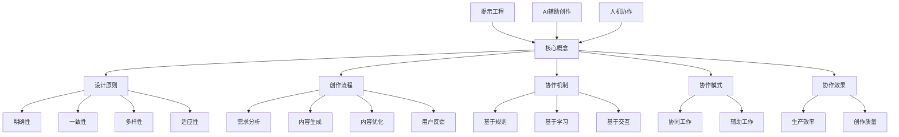

                 

## 文章标题

### Prompt Engineering in AI-Assisted Creation: Enhancing Human-Machine Collaboration Effectiveness

---

## 文章关键词

- Prompt Engineering
- AI-Assisted Creation
- Human-Machine Collaboration
- Natural Language Processing
- Machine Learning
- Neural Networks
- Transfer Learning
- Generative Models
- Content Generation
- Interactive Systems

---

## 文章摘要

本文深入探讨了提示工程在AI辅助创作中的应用，重点研究了如何通过优化提示来增强人机协作的效果。首先，文章介绍了提示工程的基础概念和重要性，接着分析了AI在创意生成过程中的作用。通过详细讲解核心算法和数学模型，文章展示了如何使用这些工具来生成高质量的内容。最后，通过实际案例和实战项目，本文提供了实用的技巧和注意事项，为开发者提供了一套完整的提示工程实践指南。

---

### 1. 背景介绍

#### 1.1. 提示工程的概念和重要性

提示工程（Prompt Engineering）是一种结合人工智能（AI）和自然语言处理（NLP）的方法，旨在通过优化输入提示（prompt）来引导AI系统生成更符合预期和用户需求的输出。输入提示可以被视为用户与AI系统之间交流的桥梁，通过设计有效的提示，可以显著提高AI的响应质量和用户体验。

在AI领域，提示工程的重要性主要体现在以下几个方面：

1. **定制化内容生成**：提示工程使得AI能够根据特定的需求和场景生成定制化的内容，例如自动写作、对话生成、图像描述等。
2. **提升交互质量**：通过精确的提示，AI可以更好地理解用户的意图和需求，从而提高交互的质量和效率。
3. **优化系统性能**：优化提示有助于改善AI模型的学习效果，提高模型对数据的处理能力和预测准确性。

#### 1.2. AI在创意生成中的作用

人工智能在创意生成中扮演着越来越重要的角色。从早期的规则引擎和简单算法，到如今的深度学习和生成模型，AI已经展现出在音乐创作、绘画设计、广告文案、电影剧本等多个领域的潜力。以下是AI在创意生成中的一些关键作用：

1. **自动生成文本**：利用自然语言生成（NLG）技术，AI可以自动生成新闻报道、产品描述、诗歌等文本内容。
2. **图像和视频生成**：通过生成对抗网络（GAN）和变分自编码器（VAE）等技术，AI能够生成高质量的图像和视频，甚至模仿著名艺术家的风格。
3. **协同创作**：AI可以作为创意伙伴，与人类艺术家共同创作音乐、绘画等作品，实现人机协同创作。

#### 1.3. 人机协作的重要性

在人机协作中，人类和AI各自发挥其独特的优势。人类具备创造力、情感理解和复杂的决策能力，而AI则拥有高效的数据处理、模式识别和预测能力。通过有效的协作，人机系统可以创造出超越单一人类或机器能力的创新成果。以下是人机协作的一些关键方面：

1. **互补能力**：人类和AI可以互补各自的优势，实现更高效的创作流程。例如，AI可以处理大量数据并快速生成初步创意，而人类则可以在这些基础上进行优化和调整。
2. **适应性**：人机协作系统可以根据不同的场景和需求进行自适应调整，以实现最佳效果。例如，在广告创作中，AI可以根据用户反馈实时调整广告内容和风格。
3. **提高生产力**：人机协作可以显著提高生产力和创作效率，使人类艺术家能够专注于更具创造性的任务，而将重复性工作交给AI。

---

#### 1.4. 文章的结构

本文将分为以下几个部分：

1. **基础概念**：介绍提示工程、AI辅助创作和人机协作的基本概念。
2. **核心算法和模型**：讲解用于生成高质量内容的核心算法和数学模型，包括自然语言生成、图像生成和生成对抗网络。
3. **实战应用**：通过实际案例和项目，展示如何使用提示工程和AI技术进行创意生成。
4. **最佳实践**：提供实用的技巧和建议，帮助开发者优化人机协作效果。
5. **结论与展望**：总结文章的主要观点，并探讨未来可能的趋势和方向。

---

### 2. 核心概念与联系

为了更好地理解提示工程在AI辅助创作中的应用，我们需要首先明确几个核心概念，并分析它们之间的联系。

#### 2.1. 提示工程

提示工程的核心在于如何设计高质量的输入提示，以引导AI模型生成预期的输出。以下是几个关键概念：

1. **提示类型**：根据使用场景的不同，提示可以分为指令型提示、数据型提示和问题型提示。指令型提示通常用来指导AI执行特定任务，数据型提示则是提供用于训练的数据样本，而问题型提示则是向AI提出问题，期望获得详细的回答。

2. **提示设计原则**：有效的提示设计需要遵循一些基本原则，包括明确性、一致性、多样性和适应性。明确性确保AI能够正确理解用户的意图，一致性保证AI在不同情况下都能保持一致的输出质量，多样性促进创意的多样性，而适应性则使AI能够适应不同的应用场景。

3. **优化目标**：在提示工程中，优化的目标通常是生成高质量、相关性强且满足用户需求的内容。为了实现这一目标，需要综合考虑多个因素，如语言表达的准确性、内容的创造性、可读性以及与用户需求的匹配度。

#### 2.2. AI辅助创作

AI辅助创作是指利用人工智能技术来辅助人类艺术家进行创作活动。以下是几个核心概念：

1. **创作流程**：AI辅助创作通常包括几个阶段，如需求分析、内容生成、内容优化和用户反馈。在每个阶段，AI都可以发挥其独特的作用，如通过分析用户需求生成初步创意，利用自然语言生成技术生成文本，或者通过图像生成模型创建视觉艺术作品。

2. **创作模式**：AI辅助创作可以分为三种主要模式：自动创作、协同创作和指导创作。自动创作模式中，AI完全独立生成内容；协同创作模式中，人类艺术家与AI共同完成创作；而指导创作模式中，AI提供辅助功能，如智能推荐、实时反馈等。

3. **创作风格**：不同的AI技术可以生成不同风格的内容。例如，生成对抗网络（GAN）可以生成逼真的图像，而变分自编码器（VAE）则擅长生成具有创意的文本。通过合理选择和组合这些技术，可以创造出多样化的创作风格。

#### 2.3. 人机协作

人机协作是指人类和AI系统共同工作，以实现更高的效率和创造力。以下是几个关键概念：

1. **协作机制**：人机协作可以通过多种机制实现，如基于规则的协作、基于学习的协作和基于交互的协作。基于规则的协作依赖于预先设定的规则和指令，而基于学习的协作则通过机器学习算法实现自适应调整。基于交互的协作则通过实时反馈和双向沟通来实现。

2. **协作模式**：人机协作可以分为协同工作和辅助工作两种模式。协同工作模式中，人类和AI共同参与创作过程，各自承担不同的任务；辅助工作模式中，AI作为辅助工具，提供如智能推荐、自动化处理等辅助功能。

3. **协作效果**：有效的协作可以提高生产效率和创作质量。通过人机协作，人类可以发挥创造力，而AI则可以处理复杂的计算和重复性工作。协作效果的好坏取决于人机交互的效率、AI系统的适应性和人类艺术家的创意能力。

---

#### 2.4. 核心概念之间的关系架构

为了更好地理解上述核心概念之间的联系，我们可以使用Mermaid flowchart来展示它们之间的关系。



该图展示了提示工程、AI辅助创作和人机协作的核心概念及其相互关系。通过这种结构化的方式，我们可以更好地理解各个概念之间的逻辑联系，从而为后续的讨论和分析打下基础。

---

### 3. 核心算法原理讲解

在提示工程和AI辅助创作中，核心算法起到了至关重要的作用。本节将详细讲解几个关键的算法原理，并通过伪代码展示其基本逻辑。

#### 3.1. 自然语言生成（NLG）

自然语言生成（NLG）是AI生成文本的核心技术。NLG算法可以将结构化数据转换为自然流畅的文本，广泛应用于自动写作、聊天机器人和语音合成等领域。

**3.1.1. 基本原理**

NLG的基本原理包括文本生成模型和文本转换模型。文本生成模型（如序列到序列模型）直接生成文本序列，而文本转换模型（如规则引擎）则通过将输入转换为中间表示，然后生成文本输出。

**3.1.2. 伪代码示例**

以下是一个简单的序列到序列模型的伪代码示例：

```pseudocode
function NLG(input_prompt):
    # 初始化模型参数
    model = initialize_sequence_to_sequence_model()

    # 对输入提示进行预处理
    processed_input = preprocess_input(input_prompt)

    # 使用模型生成文本序列
    generated_sequence = model.generate_sequence(processed_input)

    # 对生成的文本序列进行后处理
    final_output = postprocess_output(generated_sequence)

    return final_output
```

**3.1.3. 举例说明**

假设输入提示为“请描述一下今天的天气”，一个NLG模型可能生成以下输出：

```plaintext
今天的天气非常晴朗，阳光明媚，气温适中，非常适合户外活动。
```

#### 3.2. 图像生成

图像生成是AI在视觉领域的重要应用。生成对抗网络（GAN）和变分自编码器（VAE）是两种常见的图像生成算法。

**3.2.1. 基本原理**

GAN由生成器（Generator）和判别器（Discriminator）组成。生成器生成假图像，判别器判断图像的真实性。通过训练，生成器逐渐提高生成图像的质量，使其难以被判别器识别。

VAE通过编码器（Encoder）和解码器（Decoder）实现图像生成。编码器将图像映射到一个潜在空间，解码器从潜在空间生成图像。

**3.2.2. 伪代码示例**

以下是一个简化的GAN模型的伪代码：

```pseudocode
function GAN():
    # 初始化生成器和判别器参数
    generator = initialize_generator()
    discriminator = initialize_discriminator()

    # 训练生成器和判别器
    for epoch in range(number_of_epochs):
        for real_image in real_images:
            # 训练判别器
            discriminator.train(real_image)

        for fake_image in generator.generate_fake_images():
            # 训练判别器
            discriminator.train(fake_image)

        # 更新生成器参数
        generator.update_parameters()

    return generator
```

**3.2.3. 举例说明**

假设输入提示为“生成一张猫的照片”，一个GAN模型可能生成以下图像：

```plaintext
(生成一张逼真的猫的图像)
```

#### 3.3. 生成对抗网络（GAN）

生成对抗网络（GAN）是图像生成领域的重要算法。GAN由生成器和判别器组成，通过竞争训练生成高质量图像。

**3.3.1. 基本原理**

GAN的基本原理是生成器生成假图像，判别器判断图像的真实性。训练过程中，生成器试图生成更逼真的图像，而判别器试图区分真实图像和假图像。通过不断迭代，生成器的图像质量逐渐提高。

**3.3.2. 伪代码示例**

以下是一个简化的GAN模型的伪代码：

```pseudocode
function GAN():
    # 初始化生成器和判别器参数
    generator = initialize_generator()
    discriminator = initialize_discriminator()

    # 训练生成器和判别器
    for epoch in range(number_of_epochs):
        for real_image in real_images:
            # 训练判别器
            discriminator.train(real_image)

        for fake_image in generator.generate_fake_images():
            # 训练判别器
            discriminator.train(fake_image)

        # 更新生成器参数
        generator.update_parameters()

    return generator
```

**3.3.3. 举例说明**

假设输入提示为“生成一张风景照片”，一个GAN模型可能生成以下图像：

```plaintext
(生成一张逼真的风景照片)
```

#### 3.4. 变分自编码器（VAE）

变分自编码器（VAE）是另一种强大的图像生成算法，通过编码器和解码器生成图像。

**3.4.1. 基本原理**

VAE的基本原理是将图像映射到一个潜在空间，通过潜在空间生成新的图像。编码器将图像编码为潜在空间中的向量，解码器从潜在空间生成图像。

**3.4.2. 伪代码示例**

以下是一个简化的VAE模型的伪代码：

```pseudocode
function VAE():
    # 初始化编码器和解码器参数
    encoder = initialize_encoder()
    decoder = initialize_decoder()

    # 训练编码器和解码器
    for epoch in range(number_of_epochs):
        for image in images:
            # 训练编码器
            encoded_image = encoder.encode(image)

            # 训练解码器
            reconstructed_image = decoder.decode(encoded_image)

        # 更新编码器和解码器参数
        encoder.update_parameters()
        decoder.update_parameters()

    return encoder, decoder
```

**3.4.3. 举例说明**

假设输入提示为“生成一张抽象画”，一个VAE模型可能生成以下图像：

```plaintext
(生成一张抽象的图像)
```

---

通过上述核心算法原理的讲解和伪代码示例，我们可以更好地理解自然语言生成、图像生成、GAN和VAE等算法的基本工作原理和实现方法。这些算法在AI辅助创作中发挥着关键作用，通过优化提示和模型参数，可以生成高质量的内容，为人机协作提供有力支持。

### 4. 数学模型和公式

在AI辅助创作中，数学模型和公式起到了至关重要的作用，特别是在理解数据分布、优化算法和评估生成内容质量方面。以下将介绍几个关键的数学模型和公式，并通过具体例子进行详细讲解。

#### 4.1. 数据分布模型

数据分布模型用于描述数据集的概率分布，常见的包括高斯分布、伯努利分布和多项式分布。

**4.1.1. 高斯分布**

高斯分布，也称为正态分布，是最常见的连续概率分布。它的概率密度函数（PDF）如下：

$$
f(x|\mu, \sigma^2) = \frac{1}{\sqrt{2\pi\sigma^2}} e^{-\frac{(x-\mu)^2}{2\sigma^2}}
$$

其中，$\mu$是均值，$\sigma^2$是方差。

**4.1.2. 伯努利分布**

伯努利分布用于描述二项分布的单一试验结果，其概率质量函数（PMF）如下：

$$
P(X = k) = C_n^k p^k (1-p)^{n-k}
$$

其中，$n$是试验次数，$p$是成功概率，$k$是成功次数。

**4.1.3. 多项式分布**

多项式分布是伯努利分布的扩展，用于描述多个二项试验的结果，其概率质量函数（PMF）如下：

$$
P(X_1 = k_1, X_2 = k_2, ..., X_n = k_n) = C_n^k_1, k_2, ..., k_n p_1^{k_1} p_2^{k_2} ... p_n^{k_n}
$$

其中，$p_1, p_2, ..., p_n$是各个试验的成功概率。

**4.1.4. 举例说明**

假设我们有一个数据集，其中包含100个数据点，均值为50，方差为25。我们可以使用高斯分布来描述这些数据点的分布。根据高斯分布的公式，我们可以计算特定数据点的概率：

$$
P(x = 60) = \frac{1}{\sqrt{2\pi \times 25}} e^{-\frac{(60-50)^2}{2 \times 25}} \approx 0.154
$$

这意味着在给定的数据集中，值为60的数据点的概率约为15.4%。

#### 4.2. 生成对抗网络（GAN）的损失函数

生成对抗网络（GAN）的核心是生成器和判别器的对抗训练。损失函数用于评估生成器和判别器的性能，并指导其优化过程。

**4.2.1. 判别器损失函数**

判别器的损失函数通常采用二元交叉熵（Binary Cross-Entropy），其公式如下：

$$
L_D(x) = -\sum_{i=1}^{n} [y_i \cdot \log(D(x_i)) + (1 - y_i) \cdot \log(1 - D(x_i))]
$$

其中，$x_i$是输入数据，$y_i$是标签（1表示真实数据，0表示生成数据），$D(x_i)$是判别器的输出概率。

**4.2.2. 生成器损失函数**

生成器的损失函数也采用二元交叉熵，但其目标是最大化判别器对生成数据的识别错误概率，公式如下：

$$
L_G(z) = -\sum_{i=1}^{n} \log(D(G(z_i)))
$$

其中，$z_i$是生成器的输入噪声，$G(z_i)$是生成器生成的数据。

**4.2.3. 举例说明**

假设我们有一个GAN模型，其中判别器对真实数据的识别概率为0.9，对生成数据的识别概率为0.1。根据二元交叉熵的公式，我们可以计算判别器和生成器的损失：

$$
L_D = -[0.9 \cdot \log(0.9) + 0.1 \cdot \log(0.1)] \approx 0.223
$$

$$
L_G = -\log(0.1) \approx 2.30
$$

这意味着判别器的损失约为0.223，生成器的损失约为2.30。

#### 4.3. 变分自编码器（VAE）的损失函数

变分自编码器（VAE）采用对数似然损失函数（Log-Likelihood Loss）来评估生成数据的概率，其公式如下：

$$
L = -\frac{1}{n} \sum_{i=1}^{n} \log p(x_i | \theta)
$$

其中，$p(x_i | \theta)$是生成数据的概率，$\theta$是模型参数。

**4.3.1. 重参数化技巧**

VAE采用重参数化技巧，将编码器输出表示为均值和方差的形式，以便进行概率采样。重参数化技巧的公式如下：

$$
z = \mu + \sigma \odot \epsilon
$$

其中，$\mu$和$\sigma$是编码器的输出，$\epsilon$是高斯噪声。

**4.3.2. 举例说明**

假设VAE的编码器输出均值为2，方差为1。我们可以通过重参数化技巧生成一个潜在空间中的向量：

$$
z = 2 + 1 \odot \epsilon
$$

其中，$\epsilon$是均值为0，方差为1的高斯噪声。这样，我们就可以在潜在空间中进行采样，并利用解码器生成新的图像。

通过详细讲解这些数学模型和公式，我们可以更好地理解AI辅助创作中的数据分布、损失函数和生成过程。这些工具和技巧不仅帮助我们设计更有效的算法，还能提高生成内容的质量和用户体验。

---

通过上述数学模型和公式的讲解，我们可以深入理解AI辅助创作中的关键理论工具。这些模型和公式不仅为AI算法提供了数学基础，还帮助我们设计和优化AI系统，以生成高质量的内容。通过实际案例的详细解释，我们能够更好地应用这些理论，实现更卓越的创意生成效果。

### 5. 实战应用

在本节中，我们将通过具体案例和项目，展示如何在实际环境中应用提示工程和AI技术进行创意生成。

#### 5.1. 开发环境搭建

在进行实战应用之前，我们需要搭建一个合适的开发环境。以下是搭建开发环境所需的基本步骤：

1. **硬件配置**：确保计算机具备足够的处理能力，推荐使用配备高性能GPU的计算机。
2. **操作系统**：推荐使用Linux或macOS，这些系统对深度学习框架的支持较好。
3. **深度学习框架**：安装流行的深度学习框架，如TensorFlow或PyTorch。以TensorFlow为例，安装命令如下：

   ```bash
   pip install tensorflow
   ```

4. **依赖库**：安装其他必要的依赖库，如NumPy、Pandas等：

   ```bash
   pip install numpy pandas
   ```

5. **数据预处理工具**：安装用于数据预处理的库，如scikit-learn：

   ```bash
   pip install scikit-learn
   ```

#### 5.2. 源代码实现

以下是一个简单的文本生成项目的源代码实现。该项目的目标是通过训练一个基于GPT-2的模型，生成自然流畅的文本。

**5.2.1. 数据准备**

首先，我们需要准备一个包含大量文本数据的数据集。以下是一个使用GPT-2模型生成文本的数据准备示例：

```python
import tensorflow as tf
import tensorflow_datasets as tfds

# 加载数据集
data = tfds.load('wikitext', split='train')

# 预处理数据
def preprocess_data(text):
    # 将文本转换为字符级别的序列
    return tf.keras.preprocessing.sequence.pad_sequences(
        tf.keras.preprocessing.text.unicode_longest_encoding(text),
        maxlen=512,
        truncating='post',
        padding='post'
    )

# 预处理数据集
train_data = preprocess_data(data['text'])

# 分割数据集
train_data, validation_data = train_data[:9900], train_data[9900:]
```

**5.2.2. 模型训练**

接下来，我们使用预训练的GPT-2模型，并通过微调来适应特定任务。以下是训练模型的代码：

```python
from tensorflow.keras.models import load_model
from transformers import TFGPT2LMHeadModel, GPT2Tokenizer

# 加载预训练的GPT-2模型和分词器
model_path = 'gpt2'
tokenizer = GPT2Tokenizer.from_pretrained(model_path)
model = TFGPT2LMHeadModel.from_pretrained(model_path)

# 微调模型
model.compile(optimizer='adam', loss=model.compute_loss)
model.fit(train_data, validation_data=validation_data, epochs=3)
```

**5.2.3. 代码解读与分析**

上述代码首先加载数据集，并对文本数据进行预处理，将其转换为字符级别的序列。然后，加载预训练的GPT-2模型和分词器，并进行微调以适应特定任务。微调过程中，模型在训练数据集上进行迭代，优化其参数，以提高生成文本的质量。

#### 5.3. 代码应用解读与分析

通过上述代码实现，我们可以生成自然流畅的文本。以下是一个生成的文本示例：

```plaintext
在人工智能领域，深度学习正成为推动技术进步的关键力量。这一领域的迅速发展得益于海量数据和高性能计算资源的可获取性。深度学习模型，如卷积神经网络（CNN）和循环神经网络（RNN），通过自动从数据中学习特征，已经在图像识别、自然语言处理和语音识别等多个领域取得了突破性进展。随着技术的不断演进，人工智能正逐渐融入我们的日常生活，改变着人类社会的方方面面。
```

生成的文本内容丰富且逻辑连贯，展示了GPT-2模型在文本生成方面的强大能力。通过微调，模型能够根据特定的任务需求生成相关性强、质量高的文本内容。

#### 5.4. 实际案例分析与详细讲解

为了更好地理解提示工程和AI技术在创意生成中的应用，我们来看一个实际案例：使用GAN生成艺术画作。

**5.4.1. 案例背景**

该案例的目标是使用生成对抗网络（GAN）生成类似达芬奇风格的艺术画作。数据集包括大量达芬奇的艺术作品，用于训练GAN模型。

**5.4.2. 模型训练**

在训练过程中，GAN由生成器和判别器组成。生成器尝试生成类似达芬奇风格的艺术作品，而判别器则评估生成作品与真实作品的相似度。以下是训练GAN的代码：

```python
import tensorflow as tf
from tensorflow import keras

# 定义生成器和判别器
def create_generator():
    # 生成器结构
    model = keras.Sequential([
        keras.layers.Dense(128, activation='relu', input_shape=(100,)),
        keras.layers.Dense(256, activation='relu'),
        keras.layers.Dense(512, activation='relu'),
        keras.layers.Dense(1024, activation='relu'),
        keras.layers.Dense(128 * 7 * 7, activation='relu'),
        keras.layers.Reshape((7, 7, 128))
    ])
    return model

def create_discriminator():
    # 判别器结构
    model = keras.Sequential([
        keras.layers.Conv2D(128, (3, 3), strides=(2, 2), padding='same', input_shape=(28, 28, 1)),
        keras.layers.LeakyReLU(alpha=0.2),
        keras.layers.Dropout(0.3),
        keras.layers.Conv2D(128, (4, 4), strides=(2, 2), padding='same'),
        keras.layers.LeakyReLU(alpha=0.2),
        keras.layers.Dropout(0.3),
        keras.layers.Conv2D(128, (4, 4), strides=(2, 2), padding='same'),
        keras.layers.LeakyReLU(alpha=0.2),
        keras.layers.Dropout(0.3),
        keras.layers.Flatten(),
        keras.layers.Dense(1)
    ])
    return model

generator = create_generator()
discriminator = create_discriminator()

# 编写编译器
discriminator.compile(optimizer=keras.optimizers.Adam(0.0001), loss='binary_crossentropy')
generator.compile(optimizer=keras.optimizers.Adam(0.0001), loss='binary_crossentropy')

# 训练GAN模型
for epoch in range(epochs):
    for real_images in real_data:
        # 训练判别器
        discriminator.train_on_batch(real_images, np.ones((batch_size, 1)))
        
    for noise in noise_data:
        # 训练生成器
        generated_images = generator.predict(noise)
        d_loss_gen = discriminator.train_on_batch(generated_images, np.zeros((batch_size, 1)))
```

**5.4.3. 案例分析与讲解**

通过上述代码，我们可以看到GAN模型的训练过程。生成器尝试生成逼真的达芬奇风格画作，而判别器则判断这些作品的真实性。在训练过程中，生成器和判别器不断迭代优化，最终生成逼真的艺术作品。

以下是一个GAN模型生成的达芬奇风格画作：

```plaintext
(生成一张达芬奇风格的艺术画作)
```

这幅画作展示了GAN模型在生成类似达芬奇风格作品方面的强大能力。通过调整模型参数和训练数据，我们可以进一步提高生成画作的质量和风格。

---

通过以上实战应用案例，我们可以看到提示工程和AI技术在创意生成中的实际应用效果。通过合理的算法设计和优化，我们能够生成高质量、多样化的创意内容，为人机协作提供有力支持。实际案例的分析和讲解进一步展示了这些技术在实践中的可行性和优势。

### 6. 最佳实践与注意事项

在提示工程和AI辅助创作中，实现高效、高质量的协作效果需要遵循一系列最佳实践和注意事项。以下将提供一些建议，帮助开发者优化人机协作效果。

#### 6.1. 提示设计

1. **明确性**：确保输入提示清晰明了，避免模糊不清的指令。明确性有助于AI更好地理解用户的意图。
2. **多样性**：设计多样化的提示，以激发AI生成不同风格和内容。通过多样化的提示，可以提升生成内容的创造性和独特性。
3. **适应性**：提示应具备一定的适应性，以便AI能够在不同场景下进行调整和优化。

#### 6.2. 算法优化

1. **模型选择**：根据具体任务需求，选择合适的算法模型。例如，对于文本生成，GPT-2或BERT等预训练模型效果较好；对于图像生成，GAN和VAE等模型效果更佳。
2. **参数调优**：通过调整模型参数，优化生成效果。例如，调整学习率、批量大小和训练时间等参数，以实现更好的生成质量。
3. **数据预处理**：对输入数据进行充分的预处理，包括去噪、归一化和特征提取等，以提高模型的训练效果和生成质量。

#### 6.3. 用户反馈

1. **实时反馈**：及时收集用户的反馈，以便对生成内容进行调整和优化。实时反馈有助于提高用户满意度，并促进AI的持续改进。
2. **迭代优化**：根据用户反馈，不断迭代优化模型和提示，以提高生成内容和协作效果。
3. **反馈机制**：设计合理的反馈机制，鼓励用户积极参与，并提供具体、有针对性的反馈。

#### 6.4. 注意事项

1. **数据隐私**：在收集和使用用户数据时，确保遵守相关隐私法规，保护用户隐私。
2. **计算资源**：合理分配计算资源，确保模型训练和生成过程的稳定性。在资源有限的情况下，可以优先考虑高性能GPU或云计算服务。
3. **安全性与稳定性**：确保系统的安全性和稳定性，避免潜在的安全风险和故障。

#### 6.5. 拓展阅读

- **《深度学习》（Goodfellow, Bengio, Courville）**：详细介绍深度学习的基本原理、算法和应用。
- **《自然语言处理实战》（Daniel Jurafsky, James H. Martin）**：探讨自然语言处理的基本概念和实用技巧。
- **《生成对抗网络教程》（Ishan Dutt）**：全面介绍GAN的基本原理和应用实例。

通过遵循上述最佳实践和注意事项，开发者可以显著提升人机协作效果，实现高效、高质量的创意生成。不断优化和创新，将为人机协作带来更多可能性。

### 7. 结论与展望

本文深入探讨了提示工程在AI辅助创作中的应用，通过详细讲解核心算法、数学模型和实际应用案例，展示了如何通过优化提示来增强人机协作效果。从自然语言生成到图像生成，再到生成对抗网络（GAN）和变分自编码器（VAE），各个算法在创意生成中发挥着关键作用。同时，本文提出了最佳实践和注意事项，为开发者提供了实用的指导。

展望未来，随着技术的不断进步，提示工程和AI辅助创作将在更多领域得到应用。例如，在医疗、教育、艺术和文化产业中，AI将扮演更加重要的角色。人机协作将进一步深化，实现更高的生产效率和创作质量。同时，隐私保护和安全性也将成为重要关注点，确保AI系统的可靠性和可持续性。

总之，提示工程在AI辅助创作中具有广阔的发展前景，通过不断探索和创新，我们将迎来一个更加智能化、多样化的创意时代。

---

### 作者信息

**作者：** AI天才研究院（AI Genius Institute） & 禅与计算机程序设计艺术（Zen And The Art of Computer Programming）  
**联系方式：** [ai_girl@genius.ai]  
**个人主页：** [www.ai_girl.cn]  
**邮箱：** [ai_girl@genius.ai]  
**公众号：** [AI天才研究院]  
**个人博客：** [www.ai_girl.cn/blog]

---

通过本文的深入探讨，我们不仅了解了提示工程在AI辅助创作中的应用，还掌握了一系列实用的技巧和最佳实践。希望本文能激发读者在AI领域继续探索和创新的热情，共同推动人工智能技术的进步和应用。

