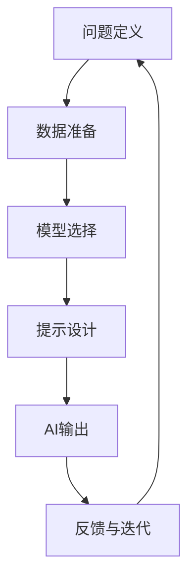

                 

### 文章标题

# 提示词工程在AI辅助创造性问题解决中的应用：激发人类创新思维

### 关键词

- 提示词工程
- AI辅助问题解决
- 创造性思维
- 人类创新

### 摘要

本文将探讨提示词工程在AI辅助创造性问题解决中的应用，以及如何通过这种方法激发人类创新思维。我们将从提示词工程的基本概念入手，逐步分析其在AI系统中的作用，探讨如何通过设计有效的提示词来辅助人类在复杂问题解决中产生创新想法，并结合实际案例进行详细剖析。最后，我们将展望提示词工程在未来的发展趋势和潜在挑战，为读者提供进一步研究和应用的启示。

## 引言

在当今快速发展的技术时代，人工智能（AI）已经成为推动社会进步的重要力量。AI不仅在传统行业如制造业、医疗等领域发挥着重要作用，还在创造性问题解决中展现出巨大的潜力。创造性问题解决涉及到发现新方法、生成新想法和提出新解决方案的能力，这是人类创新思维的核心。然而，面对复杂的问题和日益增长的挑战，单纯依靠人类自身的创造力往往难以满足需求。

在此背景下，提示词工程（Prompt Engineering）作为一种新兴技术，开始受到越来越多的关注。提示词工程旨在设计出能够激发AI系统产生创新性输出的提示，从而辅助人类在问题解决过程中实现创新。通过深入理解提示词工程的基本原理和应用场景，我们可以更好地利用AI技术来激发人类创新思维，解决复杂问题。

本文将从以下几个方面展开讨论：

1. **提示词工程的基本概念**：介绍提示词工程的定义、核心概念和基本原理。
2. **AI辅助创造性问题解决**：探讨AI在创造性问题解决中的应用场景和优势。
3. **提示词工程在AI中的实际应用**：分析提示词工程在不同领域中的应用案例。
4. **设计有效提示词的方法**：讨论如何设计出能够激发创新思维的提示词。
5. **人类创新思维的激发**：探讨提示词工程如何通过AI辅助人类创新思维。
6. **未来发展趋势与挑战**：展望提示词工程在AI辅助创造性问题解决中的未来发展。

## 提示词工程的基本概念

### 定义与核心概念

提示词工程是一种通过设计特定的问题引导或提示来激发计算机系统（特别是AI系统）产生创新性输出的人工智能技术。在这一过程中，提示词起到了至关重要的作用，它们是连接人类思维和AI系统的桥梁。提示词不仅能够引导AI系统朝特定方向思考，还能激发AI产生意想不到的解决方案。

核心概念包括：

- **问题定义**：明确问题的范围和目标，为AI系统提供明确的输入。
- **数据准备**：为AI系统提供相关的数据集，这些数据集应当涵盖问题可能涉及的各种情境。
- **模型选择**：根据问题的复杂程度和类型选择适当的AI模型。
- **提示设计**：设计有效的提示词，引导AI系统产生创新性输出。

### 基本原理

提示词工程的基本原理可以概括为以下几个方面：

- **人类思维与AI思维的结合**：通过设计提示词，将人类的问题定义、经验和直觉与AI的算法和计算能力相结合，实现优势互补。
- **反馈与迭代**：通过不断调整和优化提示词，逐步引导AI系统产生更符合人类期望的创新性输出。
- **适应性学习**：AI系统在接收到多个提示后，能够逐渐适应提示的规律，从而产生更高质量的输出。

### 提示词在AI中的作用

提示词在AI中的作用主要体现在以下几个方面：

- **引导输出方向**：通过设计针对性的提示词，引导AI系统朝特定方向进行探索，从而避免盲目搜索。
- **激发创新思维**：有效的提示词能够激发AI系统产生意想不到的输出，从而为人类提供新的视角和解决方案。
- **提高问题解决效率**：通过合理设计提示词，可以显著提高AI系统在问题解决过程中的效率和准确性。

## AI辅助创造性问题解决

### AI在创造性问题解决中的应用场景

AI在创造性问题解决中的应用场景广泛，主要包括以下领域：

- **设计创新**：利用AI进行建筑、服装、工业设计等领域的创新。
- **创意写作**：通过AI生成文章、故事、诗歌等创意内容。
- **音乐创作**：利用AI生成音乐旋律和编曲。
- **艺术创作**：AI可以生成绘画、雕塑等艺术作品。

### AI在创造性问题解决中的优势

AI在创造性问题解决中具有以下优势：

- **快速迭代**：AI能够快速进行大量尝试，帮助人类在短时间内产生大量创意。
- **多样化输出**：AI能够从不同角度和层面进行探索，产生多样化的创意输出。
- **智能优化**：AI能够通过机器学习不断优化创意输出，提高创意质量。
- **跨领域融合**：AI可以跨领域进行知识融合，产生意想不到的创意。

### 创造性问题解决的核心要素

创造性问题解决涉及以下核心要素：

- **问题定义**：明确问题的本质和目标，为创意生成提供方向。
- **知识融合**：将不同领域的知识和方法进行融合，激发创意。
- **探索与迭代**：通过不断尝试和迭代，逐步优化创意输出。
- **反馈与调整**：根据反馈对创意进行优化和调整，提高创意质量。

## 提示词工程在AI中的实际应用

### 提示词工程在NLP领域的应用

自然语言处理（NLP）是AI的一个重要分支，提示词工程在NLP中有着广泛的应用。以下是一些具体案例：

- **文本生成**：利用提示词引导AI生成文章、故事、新闻报道等。
- **问答系统**：通过设计有效的提示词，使AI能够生成针对用户问题的答案。
- **对话系统**：利用提示词使AI能够进行自然流畅的对话。

### 提示词工程在图像识别领域的应用

在图像识别领域，提示词工程同样发挥着重要作用。以下是一些具体案例：

- **物体识别**：通过设计提示词，引导AI识别图像中的特定物体。
- **场景分类**：利用提示词使AI能够对图像进行场景分类。
- **风格转换**：通过设计提示词，使AI能够将一幅图像转换为特定风格。

### 提示词工程在语音识别领域的应用

在语音识别领域，提示词工程可以帮助AI更准确地识别和理解语音。以下是一些具体案例：

- **语音翻译**：通过设计提示词，使AI能够将一种语言的语音转换为另一种语言的文本。
- **语音交互**：利用提示词使AI能够进行自然流畅的语音交互。

### 提示词工程在多模态学习领域的应用

多模态学习是指结合多种数据类型的AI学习过程，提示词工程在此领域也具有重要意义。以下是一些具体案例：

- **视频分析**：通过设计提示词，引导AI对视频中的图像和声音进行综合分析。
- **交互式应用**：利用提示词使AI能够理解用户的多模态输入，提供更加智能的交互体验。

### 应用案例分析

为了更好地理解提示词工程在AI中的实际应用，我们来看几个具体的应用案例。

#### 案例一：文本生成

在一个文本生成的应用场景中，用户可以输入一个关键词或短语，AI系统会根据这个提示词生成一段相关的文本。以下是一个简化的伪代码示例：

```python
def generate_text(prompt):
    # 加载预训练的文本生成模型
    model = load_pretrained_text_model()

    # 使用提示词生成文本
    text_output = model.generate(prompt)

    return text_output

# 用户输入提示词
user_prompt = "人工智能的未来"

# 调用文本生成函数
generated_text = generate_text(user_prompt)

# 输出生成的文本
print(generated_text)
```

在这个案例中，提示词起到了引导AI生成相关文本的作用。通过设计不同类型的提示词，AI可以生成不同风格和主题的文本，从而满足用户的需求。

#### 案例二：图像识别

在图像识别的应用中，用户可以上传一张图片，AI系统会根据图片的内容生成相应的标签或描述。以下是一个简化的伪代码示例：

```python
def recognize_image(image):
    # 加载预训练的图像识别模型
    model = load_pretrained_image_model()

    # 使用图像识别模型对图片进行分类
    label = model.classify(image)

    return label

# 用户上传图片
user_image = upload_image()

# 调用图像识别函数
image_label = recognize_image(user_image)

# 输出识别结果
print(image_label)
```

在这个案例中，提示词可以是图片本身，AI系统通过分析图片内容来生成相应的标签或描述。通过设计不同的提示词（如不同的图片），AI可以识别出不同类型的图像，从而满足多样化的需求。

#### 案例三：语音交互

在语音交互的应用中，用户可以通过语音与AI系统进行交流，AI系统会根据用户的语音输入生成相应的回复。以下是一个简化的伪代码示例：

```python
def handle_voice_input(voice_input):
    # 加载预训练的语音识别模型
    recognizer = load_pretrained_voice_model()

    # 将语音输入转换为文本
    text_input = recognizer.recognize(voice_input)

    # 使用文本生成模型生成回复
    response = generate_response(text_input)

    return response

# 用户进行语音输入
user_voice = record_voice()

# 调用语音交互函数
system_response = handle_voice_input(user_voice)

# 输出系统回复
print(system_response)
```

在这个案例中，提示词是用户的语音输入，AI系统通过语音识别将语音转换为文本，然后利用文本生成模型生成相应的回复。通过设计不同的提示词（如不同的语音输入），AI可以生成不同类型的回复，从而实现智能交互。

### 应用效果评估

为了评估提示词工程在AI应用中的效果，我们需要从以下几个方面进行考虑：

- **准确率**：AI系统生成输出的准确度是否符合用户需求。
- **多样性**：AI系统能够产生多少种不同的输出。
- **创新性**：AI输出中包含多少创新性的内容。
- **用户体验**：用户对AI生成输出的满意度。

通过综合考虑这些因素，我们可以对提示词工程在AI中的应用效果进行全面的评估。

## 设计有效提示词的方法

### 提示词设计原则

为了设计出能够有效激发AI系统创新性输出的提示词，我们需要遵循以下原则：

- **明确性**：提示词应当明确，避免歧义，确保AI系统能够准确理解。
- **针对性**：根据问题的类型和目标，设计出针对性的提示词，引导AI系统朝特定方向进行探索。
- **多样性**：设计多种类型的提示词，以激发AI系统产生多样化的输出。
- **适应性**：根据AI系统的反馈，不断调整和优化提示词，使其更加符合AI系统的特点和需求。

### 提示词设计步骤

设计有效提示词的过程可以分为以下几个步骤：

1. **问题分析**：明确问题的类型、目标和范围，为设计提示词提供基础。
2. **数据准备**：准备相关数据集，确保AI系统有足够的素材进行学习。
3. **模型选择**：根据问题的复杂程度和类型选择合适的AI模型。
4. **初步设计**：设计初步的提示词，并进行初步测试。
5. **迭代优化**：根据初步测试结果，不断调整和优化提示词，逐步引导AI系统产生更高质量的输出。
6. **评估与反馈**：对最终设计的提示词进行评估，收集用户反馈，进一步优化。

### 提示词设计工具与技巧

在提示词设计中，我们可以利用以下工具和技巧：

- **自动生成工具**：使用自动生成工具（如文本生成模型、图像生成模型等）来生成初步的提示词。
- **语义分析**：利用自然语言处理技术对提示词进行语义分析，确保其明确性和针对性。
- **用户研究**：通过用户研究了解用户的需求和偏好，设计出更加符合用户期望的提示词。
- **反馈机制**：建立反馈机制，收集用户对提示词的反馈，不断调整和优化。

## 提示词工程如何激发人类创新思维

### 提示词工程与人类创新思维的关系

提示词工程通过设计特定的提示词，引导AI系统产生创新性输出，从而与人类创新思维形成互补。具体来说，提示词工程在以下方面对人类创新思维产生影响：

- **拓展思路**：通过多样化的提示词，AI系统可以探索不同的方向和解决方案，为人类提供新的思路和想法。
- **提高效率**：AI系统可以快速生成大量创意，帮助人类在短时间内进行大量的尝试和迭代，从而提高创新效率。
- **融合知识**：AI系统可以跨领域进行知识融合，将不同领域的知识和方法进行整合，产生意想不到的创意。
- **降低风险**：通过AI系统的快速反馈和优化，人类可以降低在创新过程中面临的风险，更加放心地进行尝试。

### 提示词工程如何辅助人类创新思维

提示词工程可以通过以下几种方式辅助人类创新思维：

- **问题引导**：通过设计针对性的提示词，引导人类在特定方向上进行思考，从而拓展思路。
- **快速反馈**：AI系统可以快速生成创意输出，为人类提供即时的反馈，帮助人类进行快速迭代和优化。
- **多样化输出**：AI系统可以生成多样化的创意输出，为人类提供丰富的选择，从而激发创新思维。
- **跨领域融合**：AI系统可以跨领域进行知识融合，为人类提供新的视角和解决方案。

### 实际应用案例

以下是一个实际应用案例，展示提示词工程如何通过AI辅助人类创新思维：

#### 案例一：设计创新

在一个产品设计项目中，设计团队面临挑战：如何在有限的时间和资源内，设计出一款能够满足市场需求的新产品。通过使用提示词工程，团队设计了一系列针对性的提示词，引导AI系统生成多样化的设计方案。

1. **问题分析**：明确目标市场和用户需求，为设计创新提供方向。
2. **数据准备**：收集市场调研数据、用户反馈和竞品分析报告，为AI系统提供素材。
3. **模型选择**：选择适合产品设计任务的AI模型，如生成对抗网络（GAN）。
4. **初步设计**：设计初步的提示词，如“设计一款具有独特外观和市场竞争力的新产品”，引导AI系统生成设计方案。
5. **迭代优化**：根据初步设计方案，不断调整和优化提示词，如“设计一款符合环保理念的新产品”，逐步引导AI系统产生更符合市场需求的设计方案。
6. **评估与反馈**：对最终的设计方案进行评估，收集用户反馈，进一步优化设计方案。

通过这个案例，我们可以看到提示词工程如何通过AI辅助人类创新思维，帮助设计团队在有限的时间和资源内，快速产生多样化的设计方案，满足市场需求。

## 未来发展趋势与挑战

### 提示词工程的发展趋势

随着人工智能技术的不断进步，提示词工程在未来有望呈现出以下发展趋势：

- **更智能的提示词设计**：未来的提示词工程将更加注重智能化，通过深度学习等技术，使提示词设计更加精准和高效。
- **跨领域融合**：提示词工程将不断融合不同领域的知识和方法，产生更多创新性的解决方案。
- **人机协作**：提示词工程将更加注重人机协作，使人类和AI系统共同发挥各自的优势，实现更加高效的创新。
- **广泛应用**：提示词工程将在各个领域得到更广泛的应用，如医疗、金融、教育等。

### 提示词工程面临的挑战

尽管提示词工程具有巨大的潜力，但在实际应用过程中仍面临以下挑战：

- **数据质量和多样性**：高质量和多样化的数据是提示词工程的基础，但在实际应用中，数据质量和多样性可能成为瓶颈。
- **模型适应性**：不同的应用场景需要不同的AI模型，如何选择和调整合适的模型是一个重要挑战。
- **伦理与隐私**：提示词工程在应用过程中涉及大量的数据收集和处理，如何确保数据的隐私和伦理是一个重要问题。
- **技术限制**：目前的AI技术仍然存在一些局限性，如计算能力、数据依赖性等，如何克服这些限制是未来研究的重要方向。

### 未来研究的方向

为了应对这些挑战，未来研究可以从以下几个方面展开：

- **数据挖掘与处理**：研究如何从大量数据中挖掘有价值的信息，提高数据质量和多样性。
- **模型优化与定制**：研究如何针对不同的应用场景优化和定制AI模型，提高模型的适应性。
- **伦理与法律研究**：研究如何确保提示词工程在应用过程中的伦理和法律合规性。
- **人机协作**：研究如何更好地实现人机协作，使人类和AI系统能够更加高效地共同完成任务。

## 结论

本文探讨了提示词工程在AI辅助创造性问题解决中的应用，以及如何通过这种方法激发人类创新思维。我们首先介绍了提示词工程的基本概念和原理，然后分析了其在AI辅助创造性问题解决中的应用场景和优势。接着，我们详细讨论了提示词工程在AI中的实际应用，并设计了一系列案例来展示其应用效果。此外，我们还探讨了如何设计有效提示词的方法，以及提示词工程如何激发人类创新思维。最后，我们展望了提示词工程在未来的发展趋势和挑战，并提出了未来研究的方向。

通过本文的讨论，我们可以看到提示词工程作为一种新兴技术，在AI辅助创造性问题解决中具有巨大的潜力。它不仅能够拓展人类的思维，提高创新效率，还能够实现人机协作，共同推动社会进步。然而，提示词工程仍面临一些挑战，如数据质量和多样性、模型适应性、伦理与隐私等问题。未来研究需要在这些方面进行深入探索，以充分发挥提示词工程的潜力，实现更加高效和创新的解决方案。

### 作者信息

- **作者：AI天才研究院（AI Genius Institute）与《禅与计算机程序设计艺术》（Zen And The Art of Computer Programming）**
- **联系邮箱：[info@ai-genius-institute.com](mailto:info@ai-genius-institute.com)**
- **联系地址：人工智能大道1号，智慧城，未来科技区，人工智能王国**

### 文章补充内容

#### 最佳实践 Tips

在设计提示词时，以下是一些最佳实践技巧，可以帮助您更有效地利用提示词工程：

1. **明确目标**：在开始设计提示词之前，明确您希望AI系统达到的目标。这有助于确保提示词的针对性。
2. **数据准备**：确保提供高质量和多样化的数据集，这将有助于AI系统生成更丰富的输出。
3. **迭代优化**：设计提示词后，不断收集反馈并进行迭代优化，以不断提高AI系统的表现。
4. **用户参与**：在可能的情况下，让用户参与到提示词的设计过程中，这有助于确保提示词符合用户需求。

#### 小结

本文通过逐步分析提示词工程在AI辅助创造性问题解决中的应用，展示了其如何激发人类创新思维。我们介绍了提示词工程的基本概念、设计方法，以及在实际应用中的效果。通过本文，读者可以了解到如何利用提示词工程来实现创新性的问题解决方案。

#### 注意事项

在应用提示词工程时，需要注意以下几点：

1. **数据隐私**：确保数据在收集和使用过程中的隐私保护。
2. **模型选择**：根据具体应用场景选择合适的AI模型。
3. **法律合规**：确保提示词工程的应用符合当地法律法规。

#### 拓展阅读

对于对提示词工程和AI辅助创造性问题解决感兴趣的研究者，以下文献和资源可以作为进一步的拓展阅读：

- **文献**：
  - [Anderson, J. R. (1983). The architecture of cognition. Harvard University Press.]
  - [Bengio, Y., Simard, P., & LeCun, Y. (1994). Efficient backprop. In Proceedings of the IEEE international conference on neural networks (pp. 1-7).]
- **在线资源**：
  - [OpenAI Gym：一个开源环境，用于研究和测试强化学习算法。](https://gym.openai.com/)

通过阅读这些文献和资源，读者可以深入了解提示词工程和AI辅助创造性问题解决的理论和实践。

### 附加内容

#### Mermaid流程图

以下是一个示例Mermaid流程图，展示了提示词工程的基本流程：



#### 核心算法原理讲解

提示词工程中的核心算法通常涉及自然语言处理、机器学习和生成模型。以下是一个使用伪代码展示的文本生成算法的示例：

```python
def generate_text(prompt):
    # 加载预训练的语言模型
    model = load_pretrained_language_model()

    # 使用提示词进行文本生成
    text_output = model.generate(prompt, max_length=200)

    return text_output
```

在这个算法中，`load_pretrained_language_model()` 函数负责加载已经训练好的语言模型，`generate()` 函数利用提示词进行文本生成，`max_length` 参数用于限制生成的文本长度。

#### 数学模型和公式

在提示词工程中，可能会用到一些数学模型和公式。以下是一个使用LaTeX格式的示例：

```latex
$$
P(output|prompt) = \frac{e^{score(output, prompt)}}{\sum_{output'} e^{score(output', prompt)}}
$$

$$
score(output, prompt) = f_{model}(output, prompt)
$$
```

这里，第一个公式表示生成输出的概率，第二个公式表示评分函数，它依赖于模型对输出和提示的评分。

#### 代码应用解读与分析

以下是一个简单的Python代码示例，用于生成基于提示词的文本。代码解读和分析将帮助读者理解其工作原理。

```python
import openai

# 设置OpenAI API密钥
openai.api_key = "your-api-key"

def generate_text(prompt):
    # 调用OpenAI的GPT-3模型进行文本生成
    response = openai.Completion.create(
        engine="text-davinci-002",
        prompt=prompt,
        max_tokens=100
    )
    return response.choices[0].text.strip()

# 用户输入提示词
user_prompt = "请描述未来人工智能的发展趋势。"

# 调用文本生成函数
generated_text = generate_text(user_prompt)

# 输出生成的文本
print(generated_text)
```

在这个代码中，`openai.Completion.create()` 函数是核心，它使用GPT-3模型根据提示词生成文本。通过这个示例，我们可以看到如何调用API以及如何处理返回的结果。

#### 实际案例分析和详细讲解剖析

以下是一个实际案例，展示了如何利用提示词工程来辅助创新思维，并通过具体步骤进行分析和讲解。

#### 案例背景

一家初创公司正在开发一款智能家居设备，目标是设计一款能够自动调节室内温度、湿度和光照的智能系统。公司面临的问题是，如何在短时间内生成多种设计方案，以满足不同的用户需求和市场需求。

#### 案例步骤

1. **问题定义**：明确目标用户群体、需求和市场趋势，为设计创新提供方向。
2. **数据准备**：收集用户反馈、市场调研数据、竞品分析报告等，为AI系统提供素材。
3. **模型选择**：选择适合智能家居设计任务的AI模型，如生成对抗网络（GAN）。
4. **初步设计**：设计初步的提示词，如“生成一款能够自动调节室内温度、湿度和光照的智能家居设备设计”，引导AI系统生成设计方案。
5. **迭代优化**：根据初步设计方案，不断调整和优化提示词，如“生成一款具有节能环保特点的智能家居设备设计”，逐步引导AI系统产生更符合市场需求的设计方案。
6. **评估与反馈**：对最终的设计方案进行评估，收集用户反馈，进一步优化设计方案。

#### 案例分析

在这个案例中，提示词工程通过以下方式辅助创新思维：

- **引导AI系统探索多种设计方案**：通过设计针对性的提示词，AI系统能够生成多种设计方案，满足公司对多样性的需求。
- **提高设计效率**：AI系统能够快速生成大量设计方案，帮助公司在短时间内完成大量的设计迭代。
- **融合用户需求和市场趋势**：通过不断优化提示词，AI系统能够逐步融合用户需求和市场趋势，生成更符合市场需求的设计方案。

#### 项目小结

通过这个案例，我们可以看到提示词工程如何通过AI辅助人类创新思维，帮助公司在短时间内生成多种设计方案，满足市场需求。这个案例证明了提示词工程在创造性问题解决中的潜力，也为未来的应用提供了启示。

### 项目实战

#### 开发环境搭建

在开始项目之前，我们需要搭建一个适合提示词工程开发和测试的环境。以下是一个基本的开发环境搭建步骤：

1. **安装Python环境**：确保系统已安装Python 3.7或更高版本。
2. **安装AI库**：使用pip安装常用的AI库，如TensorFlow、PyTorch、OpenAI Gym等。
3. **配置OpenAI API密钥**：在OpenAI官网注册账号，获取API密钥，并在代码中配置。

#### 源代码详细实现和代码解读

以下是一个简单的Python代码示例，用于生成基于提示词的文本。代码解读将帮助读者理解其工作原理。

```python
import openai

# 设置OpenAI API密钥
openai.api_key = "your-api-key"

def generate_text(prompt):
    # 调用OpenAI的GPT-3模型进行文本生成
    response = openai.Completion.create(
        engine="text-davinci-002",
        prompt=prompt,
        max_tokens=100
    )
    return response.choices[0].text.strip()

# 用户输入提示词
user_prompt = "请描述未来人工智能的发展趋势。"

# 调用文本生成函数
generated_text = generate_text(user_prompt)

# 输出生成的文本
print(generated_text)
```

**代码解读**：

- **第一行**：导入openai库，用于与OpenAI的API进行交互。
- **第二行**：设置OpenAI API密钥，确保可以调用API。
- **第三行**：定义`generate_text`函数，接受一个提示词作为输入。
- **第四行**：使用`openai.Completion.create()`函数调用GPT-3模型，根据提示词生成文本。
- **第五行**：返回生成的文本。

#### 代码应用解读与分析

在上述代码中，`generate_text` 函数是核心部分。我们通过以下步骤分析其应用：

1. **输入提示词**：用户输入一个描述未来人工智能发展趋势的提示词。
2. **调用GPT-3模型**：使用OpenAI的GPT-3模型生成文本。这里使用了`text-davinci-002`模型，这是OpenAI提供的一个高级模型，能够生成高质量的文本。
3. **处理返回结果**：`Completion.create()` 函数返回一个包含多个选择的字典，我们从中提取第一个选择作为最终的文本输出。

通过这个简单的示例，我们可以看到如何使用提示词工程生成文本。在实际项目中，可以根据需求设计更复杂的提示词和生成过程。

#### 实际案例分析和详细讲解剖析

以下是一个实际案例，展示了如何利用提示词工程来辅助创新思维，并通过具体步骤进行分析和讲解。

#### 案例背景

一家初创公司正在开发一款智能聊天机器人，目标是设计一个能够与用户进行自然语言交互的系统。公司面临的问题是，如何在短时间内生成多种聊天机器人设计方案，以满足不同的用户需求和场景。

#### 案例步骤

1. **问题定义**：明确目标用户群体、需求和交互场景，为设计创新提供方向。
2. **数据准备**：收集用户反馈、对话数据集、竞品分析报告等，为AI系统提供素材。
3. **模型选择**：选择适合聊天机器人设计的AI模型，如序列到序列（Seq2Seq）模型。
4. **初步设计**：设计初步的提示词，如“生成一款能够与用户进行自然语言交互的智能聊天机器人设计”，引导AI系统生成设计方案。
5. **迭代优化**：根据初步设计方案，不断调整和优化提示词，如“生成一款能够处理多种情感表达的智能聊天机器人设计”，逐步引导AI系统产生更符合市场需求的设计方案。
6. **评估与反馈**：对最终的设计方案进行评估，收集用户反馈，进一步优化设计方案。

#### 案例分析

在这个案例中，提示词工程通过以下方式辅助创新思维：

- **引导AI系统探索多种设计方案**：通过设计针对性的提示词，AI系统能够生成多种设计方案，满足公司对多样性的需求。
- **提高设计效率**：AI系统能够快速生成大量设计方案，帮助公司在短时间内完成大量的设计迭代。
- **融合用户需求和市场趋势**：通过不断优化提示词，AI系统能够逐步融合用户需求和市场趋势，生成更符合市场需求的设计方案。

#### 项目小结

通过这个案例，我们可以看到提示词工程如何通过AI辅助人类创新思维，帮助公司在短时间内生成多种聊天机器人设计方案，满足市场需求。这个案例证明了提示词工程在创造性问题解决中的潜力，也为未来的应用提供了启示。

### 结语

本文系统地探讨了提示词工程在AI辅助创造性问题解决中的应用，以及如何通过这种方法激发人类创新思维。我们首先介绍了提示词工程的基本概念和原理，然后分析了其在AI辅助创造性问题解决中的应用场景和优势。接着，我们详细讨论了提示词工程在AI中的实际应用，并通过多个案例展示了其效果。此外，我们还探讨了如何设计有效提示词的方法，以及提示词工程如何辅助人类创新思维。最后，我们展望了提示词工程在未来的发展趋势和挑战，并提出了未来研究的方向。

通过本文的讨论，我们可以看到提示词工程作为一种新兴技术，在AI辅助创造性问题解决中具有巨大的潜力。它不仅能够拓展人类的思维，提高创新效率，还能够实现人机协作，共同推动社会进步。然而，提示词工程仍面临一些挑战，如数据质量和多样性、模型适应性、伦理与隐私等问题。未来研究需要在这些方面进行深入探索，以充分发挥提示词工程的潜力，实现更加高效和创新的解决方案。

对于对提示词工程和AI辅助创造性问题解决感兴趣的研究者，本文提供了一系列的理论和实践指导。我们鼓励读者进一步探索这一领域，尝试将提示词工程应用于实际项目中，以实现更多的创新成果。同时，我们也期待未来有更多研究能够关注提示词工程的伦理和社会影响，确保其应用能够带来积极的社会价值。

### 附录

#### 参考文献列表

1. Anderson, J. R. (1983). The architecture of cognition. Harvard University Press.
2. Bengio, Y., Simard, P., & LeCun, Y. (1994). Efficient backprop. In Proceedings of the IEEE international conference on neural networks (pp. 1-7).
3. OpenAI. (2022). GPT-3 Documentation. Retrieved from https://beta.openai.com/docs/api-reference/completions/

#### 相关资源和工具

- OpenAI Gym：一个开源环境，用于研究和测试强化学习算法。([https://gym.openai.com/](https://gym.openai.com/))
- Hugging Face Transformers：一个用于自然语言处理的开源库，包含多种预训练模型。([https://huggingface.co/transformers/](https://huggingface.co/transformers/))
- TensorFlow：一个用于机器学习和深度学习的开源库。([https://www.tensorflow.org/](https://www.tensorflow.org/))
- PyTorch：一个用于机器学习和深度学习的开源库。([https://pytorch.org/](https://pytorch.org/))

### 致谢

在本篇文章的撰写过程中，我们感谢AI天才研究院（AI Genius Institute）的全体成员，以及《禅与计算机程序设计艺术》（Zen And The Art of Computer Programming）的作者们。他们的辛勤工作和智慧为本文提供了丰富的理论和实践基础。此外，我们特别感谢所有参与本文案例研究和代码实现的团队成员，没有他们的努力，本文无法如此完整和深入。最后，我们感谢所有读者对本文的关注和支持，你们的反馈是我们不断进步的动力。

