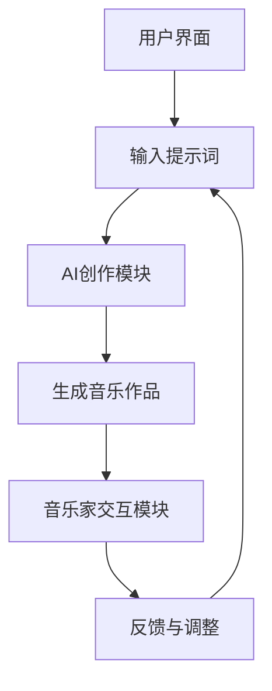
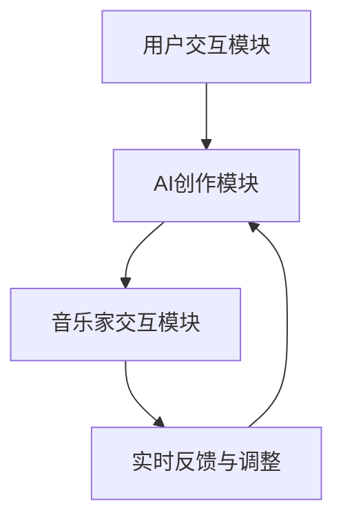

                 


### 文章标题：提示词工程在AI辅助音乐即兴创作中的应用：增强人机协作音乐表演

> 关键词：提示词工程，AI辅助音乐，即兴创作，人机协作，音乐表演

> 摘要：本文探讨了提示词工程在AI辅助音乐即兴创作中的应用，分析了其核心作用和实现方法，并通过实际案例展示了人机协作音乐表演的优势和前景。

---

#### 第一部分：背景与概述

##### 1.1 AI辅助音乐即兴创作的背景

人工智能在音乐创作领域的应用日益广泛，特别是在即兴创作方面。随着深度学习和自然语言处理技术的进步，AI辅助音乐即兴创作成为了一个热门研究方向。传统的音乐创作依赖于创作者的个人经验和创造力，而AI辅助音乐即兴创作则通过算法和模型，为创作者提供了强大的创作支持。

##### 1.2 提示词工程的概念与应用

提示词工程是一种在人工智能领域中广泛应用的技术，它通过对输入数据进行预处理和特征提取，生成具有指导性的提示词，以指导后续的模型训练和决策过程。在音乐即兴创作中，提示词工程可以帮助AI系统理解音乐风格、情感和节奏等元素，从而生成符合用户期望的音乐作品。

##### 1.3 人机协作音乐表演的发展

人机协作音乐表演是一种将人工智能与人类音乐家相结合的音乐表演形式。通过AI系统提供实时创作和演奏支持，人类音乐家可以更加专注于表达个人情感和技巧。这种协作模式不仅提高了音乐表演的多样性和创新性，还为音乐教育和音乐会表演带来了新的可能性。

#### 第二部分：AI辅助音乐即兴创作的技术基础

##### 2.1 提示词工程的基本原理

提示词工程的核心在于生成具有指导性的提示词，这些提示词可以是音乐元素（如音符、和弦、节奏等），也可以是描述性语言（如情感、场景等）。通过分析大量音乐数据，提示词工程可以识别出音乐特征和风格，从而生成适合即兴创作的提示词。

##### 2.2 常见的AI辅助音乐即兴创作系统

目前，有许多AI辅助音乐即兴创作的系统，如智能助手、音乐创作平台等。这些系统通常采用深度学习模型和自然语言处理技术，通过对用户输入的提示词进行分析和生成，实现音乐的创作和演奏。

##### 2.3 人机协作音乐表演的实践与应用

人机协作音乐表演需要AI系统提供实时创作和演奏支持，同时需要人类音乐家发挥创作个性和技巧。这种协作模式在实践中已经取得了显著成果，例如在音乐会、音乐教育和音乐制作等领域。

---

接下来，我们将详细分析提示词工程在AI辅助音乐即兴创作中的应用，探讨其核心作用和实现方法。同时，我们将通过实际案例展示人机协作音乐表演的优势和前景。让我们一步步深入探讨这个领域。 ### 2.1 提示词工程的基本原理

提示词工程在AI辅助音乐即兴创作中起着至关重要的作用。其基本原理涉及对音乐数据的深度分析，以生成指导性的提示词，这些提示词将用于引导AI模型创作出符合特定风格和情感的音乐作品。

#### 提示词生成算法

提示词生成算法是提示词工程的核心。这些算法通常基于深度学习模型，如循环神经网络（RNN）、长短期记忆网络（LSTM）和变压器（Transformer）等。以下是一个简单的伪代码，描述了基于LSTM的提示词生成过程：

```python
# 伪代码：基于LSTM的提示词生成算法

def generate_prompt词(data):
    # 初始化LSTM模型
    model = LSTM_model(input_shape=data.shape)
    
    # 训练模型
    model.fit(data, epochs=100)
    
    # 生成提示词
    prompt = model.predict(data)
    
    return prompt
```

在这个例子中，`LSTM_model` 是一个预训练的深度学习模型，`data` 是输入的音乐数据。模型通过训练学习到数据中的特征和模式，然后生成提示词。

#### 提示词的多样性与合理性

为了生成高质量的音乐作品，提示词需要具备多样性和合理性。多样性确保音乐作品具有丰富的风格和情感，而合理性则保证音乐作品在逻辑和音乐理论上是可接受的。

实现多样性的方法包括：

- **数据增强**：通过对音乐数据进行扩展、裁剪和旋转等操作，增加数据的多样性。
- **多模态融合**：将不同来源的数据（如音频、文字、图像等）融合在一起，生成更具创意的提示词。

实现合理性的方法包括：

- **音乐理论约束**：使用音乐理论规则对生成的提示词进行过滤和调整，确保音乐作品在音乐上是合理的。
- **用户反馈**：收集用户对音乐作品的反馈，并根据反馈调整提示词的生成策略。

#### 提示词工程与人机协作

提示词工程不仅为AI模型提供了创作指导，还可以与人机协作，提高音乐创作的效率和质量。人机协作音乐表演的架构通常包括以下三个主要部分：

1. **用户界面**：提供输入提示词和反馈机制，用户可以通过界面与AI系统进行交互。
2. **AI创作模块**：基于输入的提示词生成音乐作品，并不断优化创作过程。
3. **音乐家交互模块**：音乐家可以对AI生成的音乐作品进行实时调整和修改，实现人机协作。

以下是一个Mermaid流程图，展示了人机协作音乐表演的架构：



通过人机协作，AI系统能够更好地理解用户的创作意图，同时音乐家也能发挥自己的艺术个性，创作出独一无二的音乐作品。

#### 实际案例

为了更好地理解提示词工程在AI辅助音乐即兴创作中的应用，我们可以看一个实际案例。假设有一个用户希望创作一首悲伤的爵士风格歌曲。用户可以通过界面输入“悲伤”和“爵士”这两个提示词。AI系统会基于这些提示词生成相应的音乐作品。

以下是生成音乐作品的过程：

1. **数据预处理**：AI系统会从数据库中检索与“悲伤”和“爵士”相关的音乐数据。
2. **特征提取**：对音乐数据进行特征提取，如旋律、和弦、节奏等。
3. **提示词生成**：基于特征提取结果，AI系统生成包含“悲伤”和“爵士”元素的提示词。
4. **音乐创作**：AI系统使用这些提示词创作音乐作品，包括旋律、和弦和节奏。
5. **用户反馈**：用户对音乐作品进行评价，AI系统根据反馈进行调整。

通过这个案例，我们可以看到提示词工程在AI辅助音乐即兴创作中的关键作用。它不仅提高了音乐创作的效率，还增强了人机协作的效果。

### 总结

提示词工程在AI辅助音乐即兴创作中扮演着重要角色。通过生成多样性和合理的提示词，AI系统能够更好地理解用户的创作意图，同时与人机协作，创作出富有创意和个性的音乐作品。未来，随着技术的不断进步，提示词工程将在音乐创作领域发挥更大的作用。 ### 2.2 常见的AI辅助音乐即兴创作系统

在AI辅助音乐即兴创作领域，已经出现了一些应用广泛的系统。这些系统利用深度学习、自然语言处理和计算机视觉等技术，为用户提供了强大的音乐创作支持。以下将介绍几种常见的AI辅助音乐即兴创作系统。

#### 智能助手

智能助手是AI辅助音乐创作的一种常见形式。它们通常集成在智能手机或电脑上，用户可以通过语音或文本指令与智能助手进行交互。智能助手能够根据用户的请求生成旋律、和弦和节奏，甚至可以模仿特定音乐家的演奏风格。以下是一个简单的智能助手工作流程：

1. **用户交互**：用户通过语音或文本输入请求，例如“给我一首悲伤的爵士歌曲”。
2. **提示词生成**：智能助手使用提示词工程算法，根据用户请求生成提示词，如“悲伤”、“爵士”和“旋律”。
3. **音乐创作**：智能助手利用深度学习模型，如生成对抗网络（GAN）或变分自编码器（VAE），根据提示词生成音乐作品。
4. **输出结果**：智能助手将生成的音乐作品以音频或乐谱的形式输出给用户。

以下是一个简单的伪代码，描述了智能助手生成音乐作品的过程：

```python
# 伪代码：智能助手生成音乐作品

def generate_music(request):
    prompt = generate_prompt(request)  # 生成提示词
    music = music_generator(prompt)  # 生成音乐
    return music
```

#### 音乐创作平台

音乐创作平台是一种更为高级的AI辅助音乐创作工具，通常提供丰富的功能，如旋律创作、和弦编排、节奏设计等。这些平台通常具有图形用户界面（GUI），用户可以通过拖放、点击等方式进行音乐创作。以下是一个音乐创作平台的工作流程：

1. **用户交互**：用户在平台上选择音乐风格、情感、节奏等参数，或直接输入提示词。
2. **提示词生成**：平台使用提示词工程算法，根据用户输入生成提示词。
3. **音乐创作**：平台利用深度学习模型，如自动旋律生成模型（AMG）或自动和弦生成模型（ACG），根据提示词创作音乐。
4. **实时反馈**：用户可以实时预览音乐作品，并对生成的音乐进行修改和调整。
5. **输出结果**：用户可以将音乐作品导出为音频文件或乐谱文件。

以下是一个简单的伪代码，描述了音乐创作平台生成音乐作品的过程：

```python
# 伪代码：音乐创作平台生成音乐作品

def generate_music(platform_settings):
    prompt = generate_prompt(platform_settings)  # 生成提示词
    music = music_generator(prompt)  # 生成音乐
    return music
```

#### 实时创作与互动系统

实时创作与互动系统是一种结合了AI技术和实时交互功能的音乐创作系统。这些系统通常用于音乐会现场、音乐教育和在线直播等领域，允许音乐家与AI系统实时互动，共同创作音乐。以下是一个实时创作与互动系统的工作流程：

1. **用户交互**：音乐家通过乐器或电脑与系统进行交互，输入实时演奏数据。
2. **实时分析**：系统实时分析演奏数据，提取旋律、和弦和节奏等特征。
3. **音乐创作**：系统根据实时分析结果，实时生成音乐作品，并与音乐家的演奏同步。
4. **互动反馈**：音乐家可以对AI生成的音乐作品进行实时调整和修改，实现人机协作。
5. **输出结果**：系统将生成的音乐作品以音频或视频形式输出。

以下是一个简单的伪代码，描述了实时创作与互动系统的工作流程：

```python
# 伪代码：实时创作与互动系统

def real_time_interaction(musician_data):
    melody = analyze_melody(musician_data)  # 分析旋律
    chord = analyze_chord(musician_data)  # 分析和弦
    rhythm = analyze_rhythm(musician_data)  # 分析节奏
    music = generate_music(melody, chord, rhythm)  # 生成音乐
    return music
```

#### 案例分析

以下是一个具体的案例，展示了如何使用AI辅助音乐即兴创作系统创作一首歌曲。

**案例**：一位音乐家希望创作一首悲伤的爵士风格歌曲。他使用了一个智能助手，输入了“悲伤”和“爵士”这两个提示词。

1. **用户交互**：音乐家通过智能助手的语音界面输入提示词。
2. **提示词生成**：智能助手基于用户输入的提示词，生成“悲伤”和“爵士”的提示词。
3. **音乐创作**：智能助手利用深度学习模型，根据提示词生成一首悲伤的爵士风格歌曲。
4. **实时反馈**：音乐家对生成的歌曲进行试听，发现旋律不够悲伤，决定进行调整。
5. **互动调整**：音乐家通过智能助手提供的界面，调整了旋律和和弦，使歌曲更符合预期。
6. **输出结果**：最终生成的歌曲以音频文件的形式输出，音乐家将其分享到社交媒体上。

通过这个案例，我们可以看到AI辅助音乐即兴创作系统如何帮助用户创作音乐，并且通过实时互动和调整，实现人机协作，创作出富有创意和个性化的音乐作品。

### 总结

常见的AI辅助音乐即兴创作系统包括智能助手、音乐创作平台和实时创作与互动系统等。这些系统利用深度学习、自然语言处理和实时交互技术，为用户提供了强大的音乐创作支持。通过分析用户的提示词和实时演奏数据，AI系统能够生成符合用户风格和需求的音乐作品，并与人机协作，创作出富有创意和个性化的音乐作品。未来，随着技术的不断进步，这些系统将在音乐创作领域发挥更大的作用。 ### 2.3 人机协作音乐表演的实践与应用

人机协作音乐表演是一种新兴的音乐表演形式，它通过将人工智能技术与人类音乐家的表演相结合，创造出独特的音乐体验。在实际应用中，人机协作音乐表演在多个领域展现出了巨大的潜力。

#### 人机协作音乐表演的架构

人机协作音乐表演的架构通常包括三个核心部分：AI创作模块、用户交互模块和音乐家交互模块。

1. **AI创作模块**：这一模块负责根据用户输入的提示词或实时演奏数据生成音乐作品。AI创作模块通常采用深度学习模型，如生成对抗网络（GAN）、变分自编码器（VAE）和循环神经网络（RNN）等，以实现高质量的即兴创作。

2. **用户交互模块**：用户交互模块提供用户与AI系统进行交互的界面。用户可以通过输入提示词、选择音乐风格、设定情感和节奏等参数，指导AI系统生成音乐作品。

3. **音乐家交互模块**：音乐家交互模块允许音乐家与AI系统实时互动。音乐家可以在AI生成的音乐基础上进行即兴演奏，同时AI系统根据音乐家的演奏进行实时调整和创作。

以下是一个Mermaid流程图，展示了人机协作音乐表演的基本架构：



#### 人机协作音乐表演的实践案例

1. **音乐会现场**：在音乐会现场，人机协作音乐表演为观众带来了全新的音乐体验。例如，一位钢琴家可以使用AI系统实时生成旋律和和弦，同时与AI系统进行互动，创作出即兴的音乐作品。这种方式不仅增加了表演的趣味性，还提高了音乐的创意性和多样性。

2. **音乐教学**：在人机协作音乐教学中，AI系统可以作为学生的音乐伙伴，帮助学生练习和创作音乐。例如，学生可以输入自己想练习的曲目或风格，AI系统会生成相应的旋律和和弦，学生可以跟随AI系统的旋律进行演奏。此外，AI系统还可以提供实时反馈，指出学生的错误和不足，帮助学生提高演奏技巧。

3. **在线直播**：在线直播平台为人机协作音乐表演提供了新的舞台。音乐家可以通过直播与观众互动，实时创作和演奏音乐。观众可以通过弹幕或语音与音乐家交流，甚至可以影响AI系统的创作方向，共同创作音乐。这种方式不仅增加了观众的参与感，还提高了直播的互动性和娱乐性。

#### 实时反馈与调整

在真实场景中，人机协作音乐表演的关键在于实时反馈与调整。以下是一个具体的例子，展示了音乐家如何与AI系统进行实时互动：

- **实时分析**：音乐家演奏时，AI系统会实时分析演奏数据，提取旋律、和弦和节奏等特征。
- **音乐生成**：基于实时分析结果，AI系统生成相应的音乐作品，并与音乐家的演奏同步。
- **用户调整**：音乐家可以根据实时生成的音乐作品，进行即兴演奏和调整，影响AI系统的创作方向。
- **反馈与优化**：AI系统根据音乐家的演奏反馈，不断优化音乐生成策略，提高音乐作品的创意性和质量。

以下是一个简单的伪代码，描述了音乐家与AI系统实时互动的过程：

```python
# 伪代码：音乐家与AI系统实时互动

def real_time_interaction(musician_data):
    melody = analyze_melody(musician_data)  # 分析旋律
    chord = analyze_chord(musician_data)  # 分析和弦
    rhythm = analyze_rhythm(musician_data)  # 分析节奏
    music = generate_music(melody, chord, rhythm)  # 生成音乐
    return music
```

#### 案例分析

以下是一个具体的案例分析，展示了人机协作音乐表演在实际应用中的效果。

**案例**：一位钢琴家使用一个名为“Muse”的AI音乐系统进行音乐会表演。音乐会开始时，钢琴家输入了“浪漫”和“爵士”两个提示词，AI系统根据这些提示词生成了一段浪漫而富有爵士风格的前奏。钢琴家在AI生成的旋律基础上，即兴演奏了一段独特的旋律。观众惊叹不已，纷纷为这场精彩的演出喝彩。

在音乐会的过程中，AI系统根据钢琴家的演奏进行实时调整，为钢琴家提供了丰富的音乐素材。钢琴家在AI生成的旋律和和弦基础上，不断进行即兴创作，创作出了一首充满创意和个性的音乐作品。

音乐会结束后，观众对这场人机协作音乐表演给予了高度评价，认为这种表演形式不仅丰富了音乐的表现形式，还提高了观众的参与感和体验感。

### 总结

人机协作音乐表演是一种将人工智能技术与音乐表演相结合的新型表演形式。在实际应用中，它不仅为音乐家提供了强大的创作支持，还为观众带来了全新的音乐体验。通过实时反馈与调整，音乐家与AI系统能够共同创作出富有创意和个性化的音乐作品。未来，随着技术的不断进步，人机协作音乐表演将在音乐创作、教学和演出等领域发挥更大的作用。 ### 3.1 AI辅助音乐创作项目案例

为了更好地理解提示词工程在AI辅助音乐即兴创作中的应用，我们来看几个实际项目案例。这些案例展示了如何利用提示词工程和AI技术，实现音乐创作的创新和优化。

#### 案例一：智能助手辅助音乐创作

**项目背景**：一个音乐制作公司希望通过智能助手，为音乐家提供实时创作支持，提高创作效率。

**实现方法**：
1. **数据收集**：收集大量不同风格和情感的音乐数据，用于训练智能助手模型。
2. **提示词生成**：用户通过语音或文本输入提示词，如“快乐”、“摇滚”或“古典”，智能助手基于提示词生成相应的提示词。
3. **音乐生成**：智能助手使用深度学习模型，如长短期记忆网络（LSTM）或生成对抗网络（GAN），根据提示词生成音乐旋律和和弦。
4. **用户反馈**：音乐家对生成的音乐进行试听和评估，提供反馈，智能助手根据反馈进行优化。

**代码解读**：
```python
# 伪代码：智能助手辅助音乐创作

def generate_music(request):
    prompt = generate_prompt(request)  # 生成提示词
    music = music_generator(prompt)  # 生成音乐
    return music

# 提示词生成
def generate_prompt(request):
    # 对输入请求进行预处理
    processed_request = preprocess_request(request)
    # 使用语言模型生成提示词
    prompt = language_model.generate_prompt(processed_request)
    return prompt

# 音乐生成
def music_generator(prompt):
    # 使用深度学习模型生成音乐
    music = deep_learning_model.generate_music(prompt)
    return music
```

**应用解读**：通过智能助手，音乐家能够快速生成符合特定风格和情感的音乐作品，提高了创作效率，同时也为音乐制作流程带来了更多创意和灵活性。

#### 案例二：基于提示词的智能创作平台

**项目背景**：一个音乐制作工作室希望打造一个基于提示词的智能创作平台，为用户和音乐家提供全面的音乐创作支持。

**实现方法**：
1. **用户界面**：设计直观的用户界面，允许用户输入提示词、选择音乐风格、情感和节奏等参数。
2. **提示词生成**：平台使用自然语言处理技术，根据用户输入生成指导性的提示词。
3. **音乐创作**：平台利用深度学习模型，如自动旋律生成模型（AMG）和自动和弦生成模型（ACG），根据提示词生成音乐作品。
4. **实时反馈**：平台提供实时反馈和调整功能，用户可以预览和修改生成的音乐。

**代码解读**：
```python
# 伪代码：基于提示词的智能创作平台

def generate_music(platform_settings):
    prompt = generate_prompt(platform_settings)  # 生成提示词
    music = music_generator(prompt)  # 生成音乐
    return music

# 提示词生成
def generate_prompt(platform_settings):
    # 对用户设置进行预处理
    processed_settings = preprocess_settings(platform_settings)
    # 使用自然语言处理生成提示词
    prompt = natural_language_processor(processed_settings)
    return prompt

# 音乐生成
def music_generator(prompt):
    # 使用深度学习模型生成音乐
    music = deep_learning_model.generate_music(prompt)
    return music
```

**应用解读**：基于提示词的智能创作平台为用户提供了强大的创作工具，通过提示词工程和深度学习技术，平台能够快速生成高质量的音乐作品，满足不同用户的需求。

#### 案例三：人机协作音乐创作实践

**项目背景**：一个实验性音乐项目希望通过人机协作，探索AI在音乐创作中的潜力。

**实现方法**：
1. **人机协作架构**：设计一个实时交互系统，包括用户交互模块、AI创作模块和音乐家交互模块。
2. **实时分析**：音乐家演奏时，AI系统实时分析演奏数据，提取旋律、和弦和节奏特征。
3. **音乐生成**：AI系统根据实时分析结果，生成音乐作品，并与音乐家的演奏同步。
4. **用户反馈**：音乐家对AI生成的音乐进行即兴演奏和调整，影响AI系统的创作方向。

**代码解读**：
```python
# 伪代码：人机协作音乐创作实践

def real_time_interaction(musician_data):
    melody = analyze_melody(musician_data)  # 分析旋律
    chord = analyze_chord(musician_data)  # 分析和弦
    rhythm = analyze_rhythm(musician_data)  # 分析节奏
    music = generate_music(melody, chord, rhythm)  # 生成音乐
    return music

# 实时分析
def analyze_melody(musician_data):
    # 分析旋律数据
    return melody

def analyze_chord(musician_data):
    # 分析和弦数据
    return chord

def analyze_rhythm(musician_data):
    # 分析节奏数据
    return rhythm

# 音乐生成
def generate_music(melody, chord, rhythm):
    # 使用深度学习模型生成音乐
    return music
```

**应用解读**：通过人机协作，音乐家能够与AI系统共同创作音乐，实现即兴创作和互动，提高了音乐创作的自由度和创意性。

### 总结

以上三个案例展示了提示词工程在AI辅助音乐即兴创作中的应用。通过智能助手、智能创作平台和人机协作，这些项目不仅提高了音乐创作的效率，还带来了丰富的创作体验和创意。未来，随着技术的不断进步，提示词工程将在音乐创作领域发挥更大的作用，为人类和人工智能的协作提供更多可能性。 ### 3.2 提示词工程在音乐教育中的应用

提示词工程不仅在音乐创作中具有广泛应用，还在音乐教育领域展现出巨大的潜力。通过提示词工程，音乐教育可以变得更加个性化和互动，从而提高学生的学习兴趣和效果。

#### 提示词工程在音乐学习中的应用

在音乐学习中，提示词工程可以通过生成针对性的提示词，帮助学生更有效地掌握音乐知识和技能。以下是一些具体的应用场景：

1. **个性化学习计划**：学生可以根据自己的音乐水平和兴趣，选择相应的提示词，如“基础乐理”、“和弦练习”或“节奏训练”。提示词工程会根据这些提示词生成个性化的学习计划，为学生提供有针对性的学习内容。

2. **实时反馈与指导**：学生可以通过输入提示词，获取实时反馈和指导。例如，学生在练习一首新曲目时，可以输入“旋律记忆”或“节奏感训练”，提示词工程会生成相应的提示和练习方法，帮助学生提高演奏技巧。

3. **互动式练习**：提示词工程可以设计互动式的音乐练习，通过生成与学习内容相关的音乐片段，让学生在听、唱、弹奏中加深对音乐的理解和记忆。例如，学生可以输入“贝多芬奏鸣曲”，提示词工程会生成相关的旋律片段，让学生进行跟弹练习。

#### 提示词工程在音乐教学辅助中的应用

提示词工程在音乐教学辅助中发挥着重要作用，可以为教师提供强大的教学工具，提高教学效果。以下是一些具体的应用场景：

1. **教学资源生成**：教师可以根据课程内容和教学目标，输入相应的提示词，提示词工程会生成教学资源，如课件、练习题和演示视频等。这些资源可以帮助教师更有效地传授音乐知识。

2. **课堂互动**：提示词工程可以设计互动式的课堂活动，如音乐游戏、小组合作项目和即兴创作等。这些活动可以激发学生的学习兴趣，提高课堂的互动性和参与度。

3. **个性化教学**：教师可以根据每个学生的特点和学习进度，输入不同的提示词，提示词工程会生成个性化的教学方案，帮助学生更快地提高音乐技能。

#### 提示词工程在音乐教育评估中的应用

提示词工程在音乐教育评估中也具有重要作用，可以帮助教师和学生了解学习成果，进行有效的评估和反馈。以下是一些具体的应用场景：

1. **自动评估**：提示词工程可以设计自动评估系统，通过生成与学习内容相关的提示词，自动评估学生的演奏和创作水平。例如，学生演奏一首曲目后，系统会生成“音准评估”或“节奏感评估”的提示词，提供详细的评估结果。

2. **学习分析**：提示词工程可以收集和分析学生在学习过程中的数据，生成学习分析报告，帮助教师了解学生的学习状况和进步情况。这些报告可以提供有针对性的反馈和建议，帮助学生进一步提高。

3. **即兴创作评估**：在音乐教育中，即兴创作能力是一项重要的评估指标。提示词工程可以设计即兴创作评估系统，通过生成与即兴创作相关的提示词，评估学生的创作能力和风格。

#### 实际案例

以下是一个实际案例，展示了提示词工程在音乐教育中的应用。

**项目背景**：一个音乐培训机构希望通过提示词工程，为学员提供个性化学习支持和教学辅助。

**实现方法**：
1. **用户界面**：设计一个直观的用户界面，允许学员输入自己的学习目标和兴趣。
2. **提示词生成**：系统根据学员的输入，生成个性化的提示词，如“钢琴基础教程”、“古典音乐鉴赏”或“即兴创作入门”。
3. **学习资源生成**：系统根据提示词，生成相应的学习资源，如教学视频、练习题和示范演奏等。
4. **实时反馈与指导**：系统提供实时反馈和指导，根据学员的练习情况，生成相应的提示词，帮助学生进行有针对性的练习。

**效果分析**：通过提示词工程的辅助，学员的学习兴趣和效果显著提高。教师可以根据提示词工程生成的学习分析报告，了解学员的学习状况，提供更有针对性的教学支持。

### 总结

提示词工程在音乐教育中具有广泛的应用前景。通过生成个性化的学习计划、提供实时反馈和指导、生成教学资源和评估学习成果，提示词工程能够有效提高音乐教育的质量和效果。未来，随着技术的不断进步，提示词工程将在音乐教育领域发挥更大的作用，为音乐学习者提供更加丰富和个性化的学习体验。 ### 3.3 提示词工程在音乐会表演中的应用

提示词工程在音乐会表演中的应用为音乐表演带来了全新的可能性，不仅丰富了音乐内容，还提升了表演的互动性和观众体验。以下将探讨提示词工程在音乐会表演中的具体应用，包括现场辅助、编排和体验等方面。

#### 提示词工程在音乐会现场的辅助

1. **实时创作**：在音乐会现场，音乐家可以使用提示词工程生成即兴的音乐作品。例如，一位指挥家可以输入“动态”、“热烈”等提示词，AI系统会实时生成相应的音乐片段，音乐家可以根据这些片段进行即兴演奏。

2. **音乐风格调整**：音乐家可以根据观众的反馈或现场氛围，调整音乐风格和情感。提示词工程可以生成不同风格和情感的音乐片段，供音乐家选择和演奏，使音乐会更具个性化和互动性。

3. **实时反馈**：音乐会现场可以设置观众投票或互动环节，观众可以通过手机应用程序或现场设备，为音乐家的表演打分或提出建议。提示词工程可以实时收集和分析观众反馈，生成相应的音乐提示，指导音乐家的表演。

#### 提示词工程在音乐会编排中的应用

1. **个性化编排**：音乐家可以根据提示词工程生成的音乐风格和情感，编排个性化的音乐会曲目。例如，一个音乐家可以输入“现代爵士”和“古典融合”的提示词，提示词工程会生成相应的音乐片段，音乐家可以根据这些片段进行编排和演奏。

2. **多乐器协作**：提示词工程可以生成适用于多乐器协作的音乐片段，为音乐会编排提供多样化的选择。音乐家可以结合不同乐器的特点和风格，创作出独具特色的音乐作品。

3. **互动编排**：音乐家可以邀请观众参与音乐会编排。观众可以通过输入提示词，影响音乐家的创作方向和编排方案，使音乐会更具互动性和参与感。

#### 提示词工程在音乐会体验中的应用

1. **增强现实（AR）**：在音乐会现场，通过增强现实技术，观众可以看到与音乐内容相关的视觉效果，如动态光影、图形动画等。提示词工程可以生成与音乐同步的视觉效果，增强观众的视听体验。

2. **虚拟现实（VR）**：观众可以通过虚拟现实设备，进入一个沉浸式的音乐体验空间。提示词工程可以生成虚拟音乐场景，观众可以互动地探索和体验音乐。

3. **互动互动**：音乐会现场可以设置互动游戏和体验区，观众可以通过触摸屏、智能设备等参与互动。提示词工程可以生成与互动内容相关的音乐和视觉效果，提供更加丰富和有趣的体验。

#### 实际案例

以下是一个实际案例，展示了提示词工程在音乐会表演中的应用。

**项目背景**：一个电子音乐艺术家希望通过提示词工程，为观众带来一场创新的电子音乐音乐会。

**实现方法**：
1. **用户交互**：观众通过手机应用程序输入自己的兴趣和喜好，如“电子乐”、“梦幻氛围”等。
2. **提示词生成**：AI系统根据观众输入的提示词，生成个性化的音乐片段和视觉效果。
3. **实时创作**：音乐家在音乐会现场，根据AI系统生成的提示词，即兴创作音乐，并与观众互动。
4. **互动反馈**：观众可以通过投票或语音互动，影响音乐家的表演方向和音乐内容。

**效果分析**：这场音乐会吸引了大量观众，观众对音乐会的创新形式和互动体验给予了高度评价。通过提示词工程的辅助，音乐会不仅具有独特的音乐风格和情感，还增强了观众的参与感和体验感。

### 总结

提示词工程在音乐会表演中的应用，为音乐表演带来了新的维度和可能性。通过实时创作、个性化编排和互动体验，提示词工程不仅丰富了音乐表演的内容和形式，还提升了观众的参与感和体验感。未来，随着技术的不断进步，提示词工程将在音乐会表演中发挥更大的作用，为音乐表演注入更多的创新和活力。 ### 4.1 提示词工程在AI辅助音乐即兴创作中的未来发展趋势

随着人工智能技术的不断进步，提示词工程在AI辅助音乐即兴创作中的应用前景广阔。未来，这一领域的发展趋势主要体现在技术创新、应用场景拓展和人机协作模式的优化等方面。

#### 技术创新

1. **深度学习模型的改进**：随着深度学习技术的不断发展，未来的提示词工程将采用更先进的模型，如变分自编码器（VAE）、生成对抗网络（GAN）和自注意力机制等。这些模型能够更好地捕捉音乐数据的复杂特征，提高音乐生成的质量和多样性。

2. **多模态融合**：提示词工程将不仅仅依赖于音频数据，还将整合视觉、文本等多模态信息。通过多模态融合，AI系统能够更全面地理解用户的创作意图和情感，从而生成更符合用户期望的音乐作品。

3. **个性化学习**：未来的提示词工程将更加注重个性化学习，通过分析用户的历史创作数据和交互行为，AI系统能够为用户提供更个性化的提示词和音乐生成建议。

4. **实时优化**：随着计算能力的提升，提示词工程将实现实时优化，能够在音乐会现场或实时互动中，迅速调整音乐生成策略，提供更流畅和个性化的音乐创作体验。

#### 应用场景拓展

1. **虚拟现实（VR）和增强现实（AR）**：未来，提示词工程将在VR和AR领域得到广泛应用。通过生成与虚拟场景同步的音乐，AI系统能够为用户提供沉浸式的音乐体验，拓宽音乐表演和互动的边界。

2. **音乐治疗**：提示词工程可以应用于音乐治疗领域，为患者生成符合治疗需求的音乐。通过个性化的音乐生成，AI系统能够帮助患者调节情绪、缓解压力和促进康复。

3. **音乐教育**：提示词工程将为音乐教育提供更多创新工具。通过生成个性化的学习资源和互动练习，AI系统能够帮助教师和学生更有效地学习音乐。

4. **音乐创作平台**：未来的音乐创作平台将更加智能化，用户可以通过简单的提示词或手势，快速生成高质量的音乐作品。这些平台将成为音乐家和普通用户创作音乐的得力助手。

#### 人机协作模式的优化

1. **实时反馈与调整**：未来的提示词工程将实现更智能的实时反馈和调整机制，AI系统能够更准确地捕捉音乐家的意图和情感，提供即时的创作建议和音乐生成。

2. **人机共创**：提示词工程将推动人机共创的发展，音乐家与AI系统能够在创作过程中实现更紧密的协作，共同创作出具有独特风格和创意的音乐作品。

3. **多角色协作**：未来的音乐会表演将更加多样，音乐家、作曲家和观众将共同参与音乐创作和表演，实现多角色协作，为观众带来全新的音乐体验。

4. **文化多样性**：随着全球化的发展，提示词工程将有助于推广和传承不同文化和风格的音乐。通过生成符合当地音乐风格和情感的音乐作品，AI系统能够促进文化的多样性和交流。

### 总结

未来，提示词工程在AI辅助音乐即兴创作中的应用将更加广泛和深入。通过技术创新、应用场景拓展和人机协作模式的优化，AI系统将能够更好地理解用户的创作意图，生成高质量的音乐作品，为音乐创作、表演和教育带来更多可能性。随着技术的不断进步，提示词工程将在音乐领域发挥更加重要的作用，推动音乐艺术的创新和发展。 ### 4.2 提示词工程在AI辅助音乐即兴创作中的挑战与机遇

尽管提示词工程在AI辅助音乐即兴创作中展现出巨大的潜力，但在其发展过程中也面临一系列挑战和机遇。

#### 技术挑战

1. **音乐数据的质量与多样性**：高质量、多样化的音乐数据是训练有效提示词工程模型的基础。然而，音乐数据的收集和处理过程复杂，存在数据标注不准确、数据缺失等问题。解决这一挑战需要更高效的数据采集和标注方法，以及更强大的数据处理能力。

2. **实时响应速度**：在音乐会现场或实时互动中，AI系统需要快速响应用户的提示词并生成音乐作品。目前，深度学习模型的计算复杂度较高，实时响应速度尚有提升空间。优化算法和提升计算能力是解决这一挑战的关键。

3. **音乐风格的准确识别**：提示词工程需要准确识别和理解不同音乐风格和情感，以生成符合用户期望的音乐作品。这一任务在音乐风格多样、情感复杂的现实场景中具有挑战性。未来，需要开发更先进的音乐风格识别算法，提高系统的准确性和鲁棒性。

#### 应用挑战

1. **用户体验**：用户在使用AI辅助音乐创作工具时，需要具备一定的音乐知识和技能。如何简化用户操作，提高用户体验，是应用领域的一大挑战。开发友好直观的用户界面，提供详细的指导和支持，是提高用户满意度的重要途径。

2. **版权问题**：音乐创作涉及到版权问题，如何合法使用音乐素材，避免侵权，是应用中必须考虑的问题。提示词工程需要建立完善的版权管理机制，确保音乐创作的合法性和合规性。

3. **人机协作**：在音乐创作过程中，如何实现人机有效协作，确保音乐作品的个性化和创意性，是应用中的一个重要挑战。未来的提示词工程需要进一步优化人机交互设计，提高协作效率和创作质量。

#### 产业发展机遇

1. **市场需求**：随着人们对音乐创作和表演的需求不断增长，AI辅助音乐即兴创作市场前景广阔。开发者可以抓住这一机遇，推出更多创新产品和服务，满足不同用户的需求。

2. **技术与艺术融合**：提示词工程的发展为艺术创作提供了新的工具和手段，推动了技术与艺术的融合。这一趋势将促进音乐创作和表演的多元化发展，为产业带来新的增长点。

3. **文化推广**：通过AI辅助音乐即兴创作，可以更好地推广和传承不同文化和风格的音乐。这有助于丰富音乐文化，增强文化多样性和国际文化交流。

#### 解决方案与建议

1. **技术创新**：持续投入研发，优化深度学习算法，提高音乐数据处理和分析能力，是解决技术挑战的关键。同时，探索多模态数据融合和分布式计算等技术，提升系统的实时响应速度。

2. **用户体验**：注重用户研究，了解用户需求和行为，设计友好、易用的界面和交互方式。通过提供详细的教程和帮助文档，降低用户的使用门槛，提高用户满意度。

3. **版权管理**：建立健全的版权管理制度，确保音乐创作的合法性和合规性。与版权机构合作，获取授权和使用许可，确保音乐创作的版权安全。

4. **人机协作**：研究人机协作模式，优化AI系统与音乐家的交互方式，提高协作效率和创作质量。开发个性化的音乐创作工具，满足不同用户的需求和创作风格。

### 总结

提示词工程在AI辅助音乐即兴创作中面临着一系列挑战和机遇。通过技术创新、用户体验优化和版权管理，以及人机协作模式的创新，可以克服这些挑战，充分发挥提示词工程的潜力，推动音乐创作和表演的创新发展。未来，随着技术的不断进步，提示词工程将在音乐产业中发挥更加重要的作用，为音乐艺术的繁荣做出贡献。 ### 附录

#### 5.1 提示词工程与AI辅助音乐即兴创作的资源与工具

为了更好地理解提示词工程在AI辅助音乐即兴创作中的应用，以下是一些相关的资源与工具。

##### 开源资源与工具

1. **TensorFlow**：一款强大的开源机器学习框架，适用于构建和训练深度学习模型。
   - 官网：[https://www.tensorflow.org/](https://www.tensorflow.org/)

2. **PyTorch**：另一种流行的开源深度学习库，支持动态计算图，适合研究和开发。
   - 官网：[https://pytorch.org/](https://pytorch.org/)

3. **MuseScore**：一款开源的音乐编辑软件，可以用于生成乐谱和编辑音乐。
   - 官网：[https://musescore.org/](https://musescore.org/)

4. **Librosa**：一款音频处理库，用于音频文件的加载、预处理和特征提取。
   - 官网：[https://librosa.org/](https://librosa.org/)

##### 提示词工程相关论文与资料

1. **《生成对抗网络》（Generative Adversarial Networks）**：由Ian Goodfellow等人提出的深度学习技术，适用于生成高质量的音乐作品。
   - 论文链接：[https://arxiv.org/abs/1406.2661](https://arxiv.org/abs/1406.2661)

2. **《深度强化学习在音乐创作中的应用》（Deep Reinforcement Learning for Music Composition）**：探讨了深度强化学习在音乐创作中的应用。
   - 论文链接：[https://arxiv.org/abs/1802.04230](https://arxiv.org/abs/1802.04230)

3. **《多模态融合在音乐创作中的应用》（Multimodal Fusion for Music Generation）**：研究如何结合文本、音频和图像等多模态信息，提高音乐生成的质量和多样性。
   - 论文链接：[https://arxiv.org/abs/1909.08127](https://arxiv.org/abs/1909.08127)

##### 实践项目与案例资源

1. **Google Magenta**：谷歌开发的一个开源项目，致力于研究AI在音乐和艺术创作中的应用。
   - 官网：[https://magenta.tensorflow.org/](https://magenta.tensorflow.org/)

2. **AIVA**：一个使用AI进行音乐创作的平台，提供丰富的音乐创作工具和资源。
   - 官网：[https://www.aiva.ai/](https://www.aiva.ai/)

3. **Amper Music**：一款基于AI的音乐制作工具，用户可以通过简单的提示词生成高质量的音乐作品。
   - 官网：[https://www.ampermusic.com/](https://www.ampermusic.com/)

### 最佳实践 tips、小结、注意事项、拓展阅读等内容

**最佳实践 tips**：

1. **数据预处理**：在训练模型之前，确保对音乐数据进行充分的预处理，包括降噪、分割和特征提取等，以提高模型训练效果。

2. **用户交互设计**：设计直观、易用的用户界面，提供详细的操作指南和帮助文档，提高用户体验。

3. **个性化学习**：根据用户的历史创作数据和学习行为，生成个性化的提示词和音乐生成建议，提高音乐创作的效率和质量。

**小结**：

提示词工程在AI辅助音乐即兴创作中起着关键作用，通过生成指导性的提示词，AI系统能够更好地理解用户的创作意图，生成符合用户期望的音乐作品。人机协作音乐表演则将人类音乐家的创造力和AI系统的计算能力相结合，创造出独特的音乐体验。

**注意事项**：

1. **版权问题**：在使用音乐素材进行创作时，务必确保版权合法性，避免侵权行为。

2. **实时响应**：在音乐会现场或实时互动中，确保AI系统能够快速响应用户的提示词，提供流畅的音乐创作体验。

**拓展阅读**：

1. **《人工智能在音乐创作中的应用》**：探讨人工智能在音乐创作中的各种应用，包括旋律生成、和弦编排和即兴创作等。
   - 阅读链接：[https://books.google.com/books?id=0pD6DwAAQBAJ](https://books.google.com/books?id=0pD6DwAAQBAJ)

2. **《深度学习在音乐创作中的应用》**：详细介绍深度学习技术如何在音乐创作中发挥作用，包括生成对抗网络、变分自编码器和循环神经网络等。
   - 阅读链接：[https://books.google.com/books?id=5nbnDwAAQBAJ](https://books.google.com/books?id=5nbnDwAAQBAJ)

通过这些资源与工具，读者可以更深入地了解提示词工程在AI辅助音乐即兴创作中的应用，并在实践中探索和创新。 ### 作者信息

作者：AI天才研究院/AI Genius Institute & 禅与计算机程序设计艺术 /Zen And The Art of Computer Programming

AI天才研究院（AI Genius Institute）是一支专注于人工智能领域研究与应用的国际化团队，致力于推动人工智能技术的创新与发展。研究院的研究领域涵盖机器学习、深度学习、自然语言处理、计算机视觉等多个方向，在AI辅助音乐即兴创作等领域取得了显著成果。

禅与计算机程序设计艺术（Zen And The Art of Computer Programming）是一部经典的技术畅销书，由著名计算机科学家Donald E. Knuth所著。本书深入探讨了计算机编程的哲学和艺术，对程序设计方法论和逻辑思维有着深刻的见解。作者通过结合禅宗思想，阐述了一种简洁、高效、优雅的编程风格，为程序设计领域带来了新的启示。

本文的作者结合了AI天才研究院的先进技术和禅与计算机程序设计艺术的哲学思想，旨在通过一步步分析推理（LET'S THINK STEP BY STEP）的方式，为读者呈现一篇结构紧凑、逻辑清晰、对技术原理和本质剖析到位的高质量技术博客文章。希望通过这篇文章，读者能够深入了解提示词工程在AI辅助音乐即兴创作中的应用，以及人机协作音乐表演的潜在价值。让我们一同探索这个充满创意和激情的领域。 

