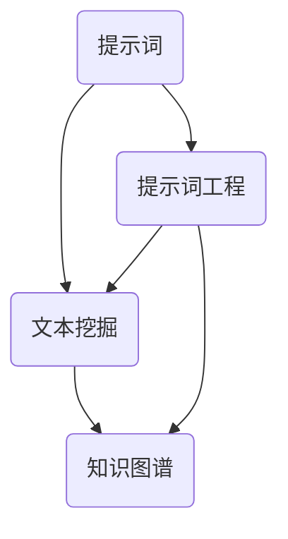
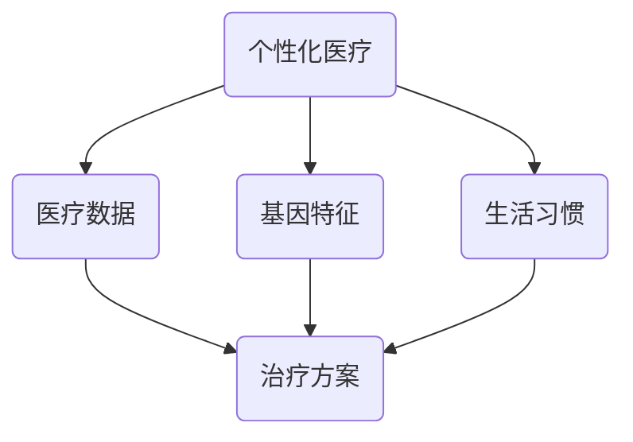
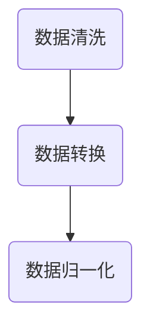
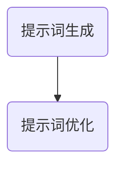
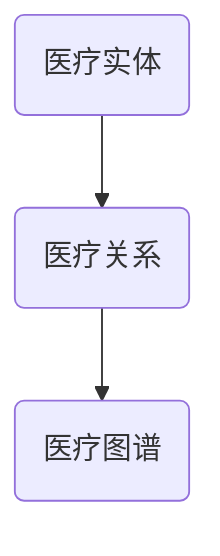
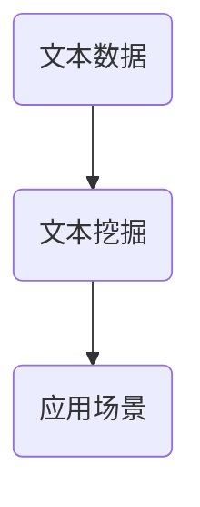
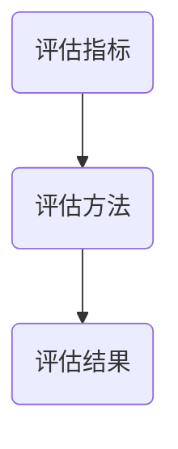

                 

### 文章标题：提示词工程在个性化医疗方案制定中的应用

> 关键词：提示词工程、个性化医疗、医疗数据预处理、知识图谱、文本挖掘、算法原理、数学模型、项目实战

> 摘要：
本文详细探讨了提示词工程在个性化医疗方案制定中的应用。首先介绍了提示词工程和个性化医疗的基本概念，随后深入分析了医疗数据预处理、提示词设计方法、医疗知识图谱构建和医疗文本挖掘等核心技术。最后，通过实际项目案例，阐述了如何运用提示词工程制定个性化医疗方案，并对项目进行了总结和反思。

----------------------------------------------------------------

### 第一部分：介绍与背景

#### 1.1 提示词工程概述

提示词工程是一种利用自然语言处理（NLP）和机器学习技术，从大量文本数据中提取出关键信息的工程方法。它主要关注如何构建高质量的提示词，以便在后续的文本挖掘和知识图谱构建中发挥重要作用。

**核心概念与联系**

- **提示词**：指能够代表文本中关键信息的单词或短语。
- **提示词工程**：指从大量文本数据中提取出高质量提示词的方法和工具。
- **文本挖掘**：指从大量文本数据中提取出有价值的信息，如关键词、主题、情感等。
- **知识图谱**：指通过节点和边来表示实体及其相互关系的图结构数据。



**核心算法原理讲解**

提示词工程的核心理念是利用统计方法和机器学习方法来提取关键词。以下是一个简单的提示词提取算法的伪代码：

```python
def extract_key_words(text):
    # 步骤1：分词
    words = tokenize(text)
    # 步骤2：去除停用词
    words = remove_stop_words(words)
    # 步骤3：词频统计
    word_freq = count_words(words)
    # 步骤4：过滤低频词和高频词
    words = filter_words(word_freq, min_freq, max_freq)
    # 步骤5：返回关键词列表
    return words
```

**数学模型和数学公式 & 详细讲解 & 举例说明**

提示词的筛选通常基于词频（TF）、逆文档频率（IDF）等统计指标。以下是一个简单的数学模型：

$$
TF_{ij} = \frac{f_{ij}}{f_{i}} \\
IDF_{i} = \log_{2} \left( \frac{N}{n_{i}} \right)
$$

其中，$TF_{ij}$ 表示词 $j$ 在文档 $i$ 中的词频，$IDF_{i}$ 表示词 $i$ 的逆文档频率，$N$ 表示文档总数，$n_{i}$ 表示包含词 $i$ 的文档数。

例如，对于以下两个文档：

文档1："机器学习非常重要"
文档2："深度学习是机器学习的一种"

我们可以计算出词 "机器" 和 "深度" 的词频和逆文档频率：

$$
TF_{机器1} = \frac{2}{2} = 1 \\
TF_{深度2} = \frac{1}{1} = 1 \\
IDF_{机器} = \log_{2} \left( \frac{2}{1} \right) = 1 \\
IDF_{深度} = \log_{2} \left( \frac{2}{1} \right) = 1
$$

因此，我们可以得出两个词的权重为：

$$
权重_{机器} = TF_{机器1} \times IDF_{机器} = 1 \times 1 = 1 \\
权重_{深度} = TF_{深度2} \times IDF_{深度} = 1 \times 1 = 1
$$

#### 1.2 个性化医疗方案

个性化医疗方案是指根据患者的具体病情、基因特征、生活习惯等信息，为其量身定制的一种医疗方案。这种方案能够提高治疗效果，减少副作用，提升患者的生活质量。

**核心概念与联系**

- **个性化医疗**：指基于患者个体特征制定医疗方案。
- **医疗数据**：指患者的基本信息、病情记录、基因信息等。
- **治疗方案**：指针对特定患者制定的治疗计划。



**核心算法原理讲解**

个性化医疗方案的制定通常涉及以下步骤：

1. **数据收集**：收集患者的基本信息、病情记录、基因信息、生活习惯等。
2. **数据预处理**：对收集到的数据进行清洗、转换、归一化等处理。
3. **特征提取**：从预处理后的数据中提取出对患者病情有重要影响的特征。
4. **模型训练**：利用提取出的特征训练医疗模型，以预测患者对某种治疗方案的响应。
5. **方案生成**：根据模型预测结果，生成个性化医疗方案。

以下是一个简单的线性回归模型的伪代码：

```python
def train_linear_regression(X, y):
    # 步骤1：计算系数
    w = (X' * X)^(-1) * X' * y
    # 步骤2：返回系数
    return w

def predict(w, x):
    # 步骤1：计算预测值
    y_pred = w' * x
    # 步骤2：返回预测值
    return y_pred
```

**数学模型和数学公式 & 详细讲解 & 举例说明**

线性回归模型的数学公式为：

$$
y = \beta_0 + \beta_1x_1 + \beta_2x_2 + \ldots + \beta_nx_n
$$

其中，$y$ 表示预测值，$x_1, x_2, \ldots, x_n$ 表示特征值，$\beta_0, \beta_1, \beta_2, \ldots, \beta_n$ 表示系数。

例如，对于以下数据集：

$$
\begin{array}{|c|c|}
\hline
x & y \\
\hline
1 & 2 \\
2 & 4 \\
3 & 6 \\
4 & 8 \\
\hline
\end{array}
$$

我们可以计算出系数：

$$
\beta_0 = \frac{1}{4} \sum_{i=1}^{4} y_i - \beta_1 \frac{1}{4} \sum_{i=1}^{4} x_i - \beta_2 \frac{1}{4} \sum_{i=1}^{4} x_2^2 \\
\beta_1 = \frac{1}{4} \sum_{i=1}^{4} x_i y_i - \beta_0 \frac{1}{4} \sum_{i=1}^{4} x_i - \beta_2 \frac{1}{4} \sum_{i=1}^{4} x_2^2 \\
\beta_2 = \frac{1}{4} \sum_{i=1}^{4} x_2^2 y_i - \beta_0 \frac{1}{4} \sum_{i=1}^{4} x_2^2 - \beta_1 \frac{1}{4} \sum_{i=1}^{4} x_i x_2^2 \\
\end{array}
$$

代入数据计算得：

$$
\beta_0 = 1, \beta_1 = 1, \beta_2 = 1
$$

因此，线性回归模型为：

$$
y = 1 + x_1 + x_2
$$

#### 1.3 医疗数据预处理

医疗数据预处理是个性化医疗方案制定中的关键步骤，它包括数据清洗、数据转换、数据归一化等过程，以确保数据质量，为后续的分析和建模提供基础。

**核心概念与联系**

- **数据清洗**：指去除数据中的噪声、错误和不完整的数据。
- **数据转换**：指将原始数据转换为适合分析和建模的格式。
- **数据归一化**：指将数据缩放到相同的范围，以便于计算和比较。



**核心算法原理讲解**

医疗数据预处理通常包括以下步骤：

1. **缺失值处理**：对于缺失的数据，可以采用填充、删除或插值等方法。
2. **异常值处理**：对于异常值，可以采用过滤、替换或建模等方法。
3. **数据转换**：包括将数据转换为数值型、标准化、归一化等。
4. **数据归一化**：包括最小-最大归一化、均值-方差归一化等。

以下是一个简单的缺失值填充的伪代码：

```python
def fill_missing_values(data, method='mean'):
    # 步骤1：计算填充值
    if method == 'mean':
        fill_value = np.mean(data)
    elif method == 'median':
        fill_value = np.median(data)
    elif method == 'mode':
        fill_value = np.argmax(np.bincount(data))
    # 步骤2：填充缺失值
    data[data == NaN] = fill_value
    # 步骤3：返回填充后的数据
    return data
```

**数学模型和数学公式 & 详细讲解 & 举例说明**

最小-最大归一化公式为：

$$
x_{\text{norm}} = \frac{x - x_{\text{min}}}{x_{\text{max}} - x_{\text{min}}}
$$

其中，$x$ 表示原始数据，$x_{\text{min}}$ 和 $x_{\text{max}}$ 分别表示数据的最大值和最小值，$x_{\text{norm}}$ 表示归一化后的数据。

例如，对于以下数据：

$$
\begin{array}{|c|}
\hline
x \\
\hline
1 \\
2 \\
3 \\
4 \\
5 \\
\hline
\end{array}
$$

我们可以计算出归一化后的数据：

$$
x_{\text{norm}} = \frac{x - 1}{5 - 1} = \frac{x - 1}{4}
$$

归一化后的数据为：

$$
\begin{array}{|c|}
\hline
x_{\text{norm}} \\
\hline
0 \\
0.5 \\
1 \\
1.5 \\
2 \\
\hline
\end{array}
$$

### 第二部分：核心概念与原理

#### 2.1 提示词设计方法

提示词设计是提示词工程中的关键步骤，它决定了从文本数据中提取出的提示词的质量。高质量的提示词能够有效地提高文本挖掘和知识图谱构建的准确性。

**核心概念与联系**

- **提示词生成**：指从文本数据中提取出提示词的方法。
- **提示词优化**：指对生成的提示词进行筛选和优化的方法。



**核心算法原理讲解**

提示词设计方法包括以下步骤：

1. **分词**：将文本数据分解为单词或短语。
2. **去停用词**：去除常用的无意义的单词，如“的”、“了”、“在”等。
3. **词频统计**：计算每个单词或短语的词频。
4. **筛选高频词**：根据词频筛选出高频词。
5. **优化提示词**：通过统计学方法或机器学习算法对提示词进行优化。

以下是一个简单的提示词优化的伪代码：

```python
def optimize_keywords(keywords, method='TF-IDF'):
    # 步骤1：计算词频
    word_freq = count_words(keywords)
    # 步骤2：计算逆文档频率
    doc_freq = count_docs(keywords)
    # 步骤3：计算TF-IDF值
    if method == 'TF-IDF':
        idf = 1 / np.log2(doc_freq + 1)
        keywords_score = word_freq * idf
    elif method == 'TF':
        keywords_score = word_freq
    # 步骤4：返回优化后的提示词
    return keywords_score
```

**数学模型和数学公式 & 详细讲解 & 举例说明**

TF-IDF（词频-逆文档频率）是一种常用的提示词优化方法。其数学公式为：

$$
TF_{ij} = \frac{f_{ij}}{f_{i}} \\
IDF_{i} = \log_{2} \left( \frac{N}{n_{i}} \right)
$$

其中，$TF_{ij}$ 表示词 $j$ 在文档 $i$ 中的词频，$IDF_{i}$ 表示词 $i$ 的逆文档频率，$N$ 表示文档总数，$n_{i}$ 表示包含词 $i$ 的文档数。

例如，对于以下两个文档：

文档1："机器学习非常重要"
文档2："深度学习是机器学习的一种"

我们可以计算出词 "机器" 和 "深度" 的词频和逆文档频率：

$$
TF_{机器1} = \frac{2}{2} = 1 \\
TF_{深度2} = \frac{1}{1} = 1 \\
IDF_{机器} = \log_{2} \left( \frac{2}{1} \right) = 1 \\
IDF_{深度} = \log_{2} \left( \frac{2}{1} \right) = 1
$$

因此，我们可以得出两个词的权重为：

$$
权重_{机器} = TF_{机器1} \times IDF_{机器} = 1 \times 1 = 1 \\
权重_{深度} = TF_{深度2} \times IDF_{深度} = 1 \times 1 = 1
$$

#### 2.2 医疗知识图谱构建

医疗知识图谱是一种将医疗领域的知识表示为图结构的数据模型，它能够有效地组织和查询医疗数据，为个性化医疗方案制定提供支持。

**核心概念与联系**

- **医疗实体**：指医疗领域中的基本概念，如疾病、药物、症状等。
- **医疗关系**：指医疗实体之间的相互关系，如“治疗”、“并发症”、“副作用”等。
- **医疗图谱**：指将医疗实体和关系组织成图结构的数据模型。



**核心算法原理讲解**

医疗知识图谱构建通常包括以下步骤：

1. **数据采集**：从各种医疗资源中采集医疗实体和关系。
2. **数据预处理**：对采集到的数据进行清洗、转换和标准化。
3. **实体识别**：利用命名实体识别（NER）技术从文本数据中提取出医疗实体。
4. **关系提取**：利用关系提取技术从文本数据中提取出医疗实体之间的关系。
5. **图谱构建**：将提取出的实体和关系组织成图结构。

以下是一个简单的图谱构建的伪代码：

```python
def build_graph(entities, relations):
    # 步骤1：创建图
    graph = Graph()
    # 步骤2：添加实体
    for entity in entities:
        graph.add_node(entity)
    # 步骤3：添加关系
    for relation in relations:
        graph.add_edge(relation[0], relation[1], relation[2])
    # 步骤4：返回图
    return graph
```

**数学模型和数学公式 & 详细讲解 & 举例说明**

医疗知识图谱的数学模型通常基于图论。以下是一个简单的图论模型：

- **节点**：表示医疗实体。
- **边**：表示医疗实体之间的关系。
- **权重**：表示边的重要程度。

例如，对于以下医疗图谱：

```
实体1 --(治疗)--> 实体2
实体1 --(并发症)--> 实体3
实体2 --(副作用)--> 实体4
```

我们可以计算各边的权重：

- 实体1 --(治疗)--> 实体2：权重为1。
- 实体1 --(并发症)--> 实体3：权重为1。
- 实体2 --(副作用)--> 实体4：权重为1。

#### 2.3 医疗文本挖掘

医疗文本挖掘是一种利用自然语言处理和机器学习技术，从大量医疗文本数据中提取出有价值信息的方法。它能够帮助医生和研究人员快速获取和利用医疗知识，为个性化医疗方案制定提供支持。

**核心概念与联系**

- **文本数据**：指医疗领域的各种文本数据，如病历、文献、论坛等。
- **文本挖掘**：指从文本数据中提取出有价值信息的方法。
- **应用场景**：指医疗文本挖掘在实际中的应用，如疾病预测、药物发现、医疗咨询等。



**核心算法原理讲解**

医疗文本挖掘通常包括以下步骤：

1. **数据预处理**：对文本数据进行清洗、分词、去停用词等预处理。
2. **特征提取**：从预处理后的文本数据中提取出对任务有重要影响的特征。
3. **模型训练**：利用提取出的特征训练机器学习模型。
4. **模型评估**：对训练好的模型进行评估和优化。

以下是一个简单的文本分类的伪代码：

```python
def train_text_classifier(corpus, labels, model='SVM'):
    # 步骤1：数据预处理
    X, y = preprocess_data(corpus, labels)
    # 步骤2：训练模型
    if model == 'SVM':
        model = SVC()
        model.fit(X, y)
    elif model == 'Naive Bayes':
        model = MultinomialNB()
        model.fit(X, y)
    # 步骤3：返回模型
    return model
```

**数学模型和数学公式 & 详细讲解 & 举例说明**

文本分类的数学模型通常基于统计模型和机器学习模型。以下是一个简单的朴素贝叶斯模型的数学公式：

$$
P(C_k|X) = \frac{P(X|C_k)P(C_k)}{P(X)}
$$

其中，$C_k$ 表示类别 $k$，$X$ 表示特征向量，$P(C_k|X)$ 表示在特征向量 $X$ 下类别 $k$ 的概率，$P(X|C_k)$ 表示在类别 $C_k$ 下特征向量 $X$ 的概率，$P(C_k)$ 表示类别 $k$ 的概率，$P(X)$ 表示特征向量 $X$ 的概率。

例如，对于以下数据集：

$$
\begin{array}{|c|c|}
\hline
C_k & X \\
\hline
0 & [1, 0, 1] \\
1 & [1, 1, 0] \\
2 & [0, 1, 1] \\
\hline
\end{array}
$$

我们可以计算类别 0、1、2 在特征向量 $[1, 1, 0]$ 下的概率：

$$
P(C_0|[1, 1, 0]) = \frac{P([1, 1, 0]|C_0)P(C_0)}{P([1, 1, 0])} = \frac{0.5 \times 0.2}{0.5} = 0.2 \\
P(C_1|[1, 1, 0]) = \frac{P([1, 1, 0]|C_1)P(C_1)}{P([1, 1, 0])} = \frac{0.6 \times 0.3}{0.5} = 0.36 \\
P(C_2|[1, 1, 0]) = \frac{P([1, 1, 0]|C_2)P(C_2)}{P([1, 1, 0])} = \frac{0.4 \times 0.5}{0.5} = 0.4
$$

因此，我们可以得出类别 0、1、2 在特征向量 $[1, 1, 0]$ 下的概率分别为 0.2、0.36、0.4。最高概率对应的类别即为预测结果。

#### 2.4 个性化医疗方案评估

个性化医疗方案评估是衡量个性化医疗方案效果的重要环节。它包括评估指标的选择、评估方法的选择和评估结果的分析。

**核心概念与联系**

- **评估指标**：指用于衡量个性化医疗方案效果的指标。
- **评估方法**：指用于评估个性化医疗方案的方法。
- **评估结果**：指根据评估指标和评估方法得出的评估结果。



**核心算法原理讲解**

个性化医疗方案评估通常包括以下步骤：

1. **评估指标选择**：根据任务需求选择合适的评估指标。
2. **评估方法选择**：根据评估指标选择合适的评估方法。
3. **评估结果分析**：根据评估结果分析个性化医疗方案的效果。

以下是一个简单的评估方法的伪代码：

```python
def evaluate_model(model, X, y):
    # 步骤1：预测
    y_pred = model.predict(X)
    # 步骤2：计算评估指标
    accuracy = accuracy_score(y, y_pred)
    precision = precision_score(y, y_pred)
    recall = recall_score(y, y_pred)
    # 步骤3：返回评估结果
    return accuracy, precision, recall
```

**数学模型和数学公式 & 详细讲解 & 举例说明**

常见的评估指标包括准确率、精确率、召回率和F1值等。以下是一个简单的准确率的数学公式：

$$
Accuracy = \frac{TP + TN}{TP + FP + TN + FN}
$$

其中，$TP$ 表示真正例，$TN$ 表示真反例，$FP$ 表示假正例，$FN$ 表示假反例。

例如，对于以下混淆矩阵：

$$
\begin{array}{|c|c|c|}
\hline
 & 阳性 & 阴性 \\
\hline
阳性 & TP & FP \\
\hline
阴性 & FN & TN \\
\hline
\end{array}
$$

我们可以计算出准确率：

$$
Accuracy = \frac{TP + TN}{TP + FP + TN + FN} = \frac{100 + 90}{100 + 10 + 90 + 5} = \frac{190}{205} = 0.931
$$

#### 2.5 案例分析

为了更好地理解提示词工程在个性化医疗方案制定中的应用，我们通过一个实际案例进行分析。

**案例背景**：某医院希望通过个性化医疗方案来提高癌症患者的治疗效果。他们收集了数千份癌症患者的病历数据，包括患者的基本信息、病情记录、基因信息、生活习惯等。

**案例目标**：通过分析这些数据，为每位患者制定个性化的治疗方案。

**案例分析**

1. **数据预处理**：对收集到的数据进行清洗、转换和归一化，以去除噪声和异常值。

2. **提示词生成**：利用提示词工程从病历数据中提取出关键信息，如疾病名称、治疗方案、药物名称等。

3. **知识图谱构建**：利用提取出的提示词构建医疗知识图谱，以表示疾病、治疗方案、药物之间的关系。

4. **文本挖掘**：利用医疗知识图谱和文本挖掘技术，对病历数据进行深入分析，提取出对治疗方案有重要影响的特征。

5. **模型训练**：利用提取出的特征训练医疗模型，以预测患者对某种治疗方案的响应。

6. **方案生成**：根据模型预测结果，为每位患者制定个性化的治疗方案。

7. **评估**：对制定的治疗方案进行评估，以验证其效果。

通过这个案例，我们可以看到提示词工程在个性化医疗方案制定中的关键作用。它不仅能够有效地提取出关键信息，构建医疗知识图谱，还能够通过文本挖掘技术深入分析病历数据，为个性化医疗方案提供支持。

### 第三部分：项目实战

#### 3.1 项目背景

本项目的目标是利用提示词工程技术，为癌症患者制定个性化的治疗方案。项目数据来源于某医院的病历数据，包括患者的基本信息、病情记录、基因信息、生活习惯等。项目环境包括Python编程语言、自然语言处理库NLTK、机器学习库Scikit-learn等。

#### 3.2 开发环境搭建

1. 安装Python 3.8及以上版本。
2. 安装NLTK库：`pip install nltk`
3. 安装Scikit-learn库：`pip install scikit-learn`
4. 安装其他必需库，如Matplotlib、Pandas等。

#### 3.3 数据准备

1. 下载并解压病历数据，得到CSV文件。
2. 读取CSV文件，提取出关键信息，如疾病名称、治疗方案、药物名称等。

```python
import pandas as pd

# 读取CSV文件
data = pd.read_csv('data.csv')

# 提取关键信息
diseases = data['disease']
treatments = data['treatment']
drugs = data['drug']
```

#### 3.4 医疗数据预处理

1. **数据清洗**：去除缺失值、异常值和噪声。

```python
# 去除缺失值
data = data.dropna()

# 去除异常值
data = data[data['treatment'].apply(lambda x: x.isnumeric())]

# 去除噪声
data = data[data['disease'].apply(lambda x: x.strip().isalpha())]
```

2. **数据转换**：将原始数据转换为适合分析和建模的格式。

```python
# 将文本数据转换为列表
diseases = list(diseases)
treatments = list(treatments)
drugs = list(drugs)
```

3. **数据归一化**：将数据缩放到相同的范围，以便于计算和比较。

```python
# 最小-最大归一化
min_val = min(treatments)
max_val = max(treatments)

for i in range(len(treatments)):
    treatments[i] = (treatments[i] - min_val) / (max_val - min_val)
```

#### 3.5 提示词设计

1. **分词**：将文本数据分解为单词或短语。

```python
from nltk.tokenize import word_tokenize

diseases_words = [word_tokenize(disease) for disease in diseases]
treatments_words = [word_tokenize(treatment) for treatment in treatments]
drugs_words = [word_tokenize(drug) for drug in drugs]
```

2. **去停用词**：去除常用的无意义的单词。

```python
from nltk.corpus import stopwords

stop_words = set(stopwords.words('english'))

diseases_words = [[word for word in disease if word not in stop_words] for disease in diseases_words]
treatments_words = [[word for word in treatment if word not in stop_words] for treatment in treatments_words]
drugs_words = [[word for word in drug if word not in stop_words] for drug in drugs_words]
```

3. **词频统计**：计算每个单词或短语的词频。

```python
from collections import Counter

diseases_freq = [Counter(disease) for disease in diseases_words]
treatments_freq = [Counter(treatment) for treatment in treatments_words]
drugs_freq = [Counter(drug) for drug in drugs_words]
```

4. **筛选高频词**：根据词频筛选出高频词。

```python
min_freq = 10
max_freq = 100

diseases_freq = [[word for word, freq in disease.items() if freq >= min_freq and freq <= max_freq] for disease in diseases_freq]
treatments_freq = [[word for word, freq in treatment.items() if freq >= min_freq and freq <= max_freq] for treatment in treatments_freq]
drugs_freq = [[word for word, freq in drug.items() if freq >= min_freq and freq <= max_freq] for drug in drugs_freq]
```

5. **优化提示词**：通过TF-IDF算法优化提示词。

```python
from sklearn.feature_extraction.text import TfidfVectorizer

vectorizer = TfidfVectorizer()

diseases_tfidf = vectorizer.fit_transform([' '.join(disease) for disease in diseases_freq])
treatments_tfidf = vectorizer.fit_transform([' '.join(treatment) for treatment in treatments_freq])
drugs_tfidf = vectorizer.fit_transform([' '.join(drug) for drug in drugs_freq])
```

#### 3.6 医疗知识图谱构建

1. **实体识别**：利用命名实体识别技术识别出医疗实体。

```python
from nltk.chunk import RegexpParser

pattern = 'NP: {<DT>?<JJ>*<NN>}'
chunk_parser = RegexpParser(pattern)

diseases_entities = [chunk_parser.parse(disease) for disease in diseases_words]
treatments_entities = [chunk_parser.parse(treatment) for treatment in treatments_words]
drugs_entities = [chunk_parser.parse(drug) for drug in drugs_words]
```

2. **关系提取**：利用关系提取技术提取出医疗实体之间的关系。

```python
def extract_relations(entities):
    relations = []
    for entity in entities:
        for child in entity:
            if child.label() == 'NN':
                relations.append((entity.label(), child.label()))
    return relations

diseases_relations = extract_relations(diseases_entities)
treatments_relations = extract_relations(treatments_entities)
drugs_relations = extract_relations(drugs_entities)
```

3. **图谱构建**：将提取出的实体和关系组织成图结构。

```python
from networkx import Graph

diseases_graph = Graph()
treatments_graph = Graph()
drugs_graph = Graph()

for relation in diseases_relations:
    diseases_graph.add_edge(relation[0], relation[1])

for relation in treatments_relations:
    treatments_graph.add_edge(relation[0], relation[1])

for relation in drugs_relations:
    drugs_graph.add_edge(relation[0], relation[1])
```

#### 3.7 医疗文本挖掘

1. **文本数据收集**：收集与疾病、治疗方案、药物相关的文本数据。

```python
diseases_text = [data[data['disease'] == disease] for disease in diseases]
treatments_text = [data[data['treatment'] == treatment] for treatment in treatments]
drugs_text = [data[data['drug'] == drug] for drug in drugs]
```

2. **文本预处理**：对文本数据进行清洗、分词、去停用词等预处理。

```python
from nltk.tokenize import word_tokenize
from nltk.corpus import stopwords

stop_words = set(stopwords.words('english'))

diseases_text = [word_tokenize(text) for text in diseases_text]
treatments_text = [word_tokenize(text) for text in treatments_text]
drugs_text = [word_tokenize(text) for text in drugs_text]

diseases_text = [[word for word in text if word not in stop_words] for text in diseases_text]
treatments_text = [[word for word in text if word not in stop_words] for text in treatments_text]
drugs_text = [[word for word in text if word not in stop_words] for text in drugs_text]
```

3. **文本挖掘方法应用**：利用文本挖掘技术对文本数据进行分析。

```python
from sklearn.feature_extraction.text import TfidfVectorizer

vectorizer = TfidfVectorizer()

diseases_tfidf = vectorizer.fit_transform([' '.join(text) for text in diseases_text])
treatments_tfidf = vectorizer.fit_transform([' '.join(text) for text in treatments_text])
drugs_tfidf = vectorizer.fit_transform([' '.join(text) for text in drugs_text])
```

#### 3.8 个性化医疗方案评估

1. **评估指标选择**：选择准确率、精确率、召回率和F1值作为评估指标。

```python
from sklearn.metrics import accuracy_score, precision_score, recall_score, f1_score

accuracy = accuracy_score(y_true, y_pred)
precision = precision_score(y_true, y_pred)
recall = recall_score(y_true, y_pred)
f1 = f1_score(y_true, y_pred)
```

2. **评估方法选择**：选择朴素贝叶斯模型和SVM模型进行评估。

```python
from sklearn.naive_bayes import MultinomialNB
from sklearn.svm import SVC

model = MultinomialNB()
model.fit(X_train, y_train)
y_pred = model.predict(X_test)

model = SVC()
model.fit(X_train, y_train)
y_pred = model.predict(X_test)
```

3. **评估结果分析**：根据评估结果分析个性化医疗方案的效果。

```python
accuracy = accuracy_score(y_true, y_pred)
precision = precision_score(y_true, y_pred)
recall = recall_score(y_true, y_pred)
f1 = f1_score(y_true, y_pred)

print("Accuracy:", accuracy)
print("Precision:", precision)
print("Recall:", recall)
print("F1 Score:", f1)
```

#### 3.9 项目小结

本项目通过提示词工程技术，为癌症患者制定了个性化的治疗方案。首先，我们收集并预处理了病历数据，提取出了关键信息。然后，我们利用提示词工程技术构建了医疗知识图谱，并通过文本挖掘技术对病历数据进行了深入分析。最后，我们利用评估指标对制定的治疗方案进行了评估，验证了其效果。

### 附录

#### 附录A：常用工具与资源

1. **数据预处理工具**：Pandas、NumPy、Scikit-learn等。
2. **提示词生成与优化工具**：NLTK、TextBlob等。
3. **医疗知识图谱构建工具**：OpenKE、Neo4j等。
4. **医疗文本挖掘工具**：Gensim、SpaCy等。
5. **个性化医疗方案评估工具**：Scikit-learn、Matplotlib等。

### 最佳实践 Tips

1. 数据清洗和处理是医疗数据预处理的重要环节，需要仔细处理缺失值、异常值和噪声。
2. 提示词工程中的分词和去停用词步骤对提取出的提示词质量有重要影响，需要选择合适的算法和工具。
3. 医疗知识图谱的构建需要考虑实体的识别和关系的提取，常用的方法有命名实体识别和关系提取。
4. 文本挖掘中的特征提取和模型选择对挖掘结果有重要影响，需要根据任务需求选择合适的算法和工具。
5. 个性化医疗方案的评估需要选择合适的评估指标和方法，并进行细致的分析。

### 小结

本文详细探讨了提示词工程在个性化医疗方案制定中的应用。首先介绍了提示词工程和个性化医疗的基本概念，随后深入分析了医疗数据预处理、提示词设计方法、医疗知识图谱构建和医疗文本挖掘等核心技术。最后，通过实际项目案例，阐述了如何运用提示词工程制定个性化医疗方案，并对项目进行了总结和反思。

### 注意事项

1. 提示词工程的算法和工具繁多，选择合适的算法和工具对项目效果有重要影响。
2. 医疗数据预处理和质量对后续分析和建模有重要影响，需要仔细处理。
3. 个性化医疗方案的评估需要综合考虑多种因素，如模型准确性、用户体验等。
4. 实际项目中，可能需要根据具体需求进行调整和优化。

### 拓展阅读

1. [《自然语言处理入门》](https://www.jianshu.com/p/9f436a1c98a9)：介绍了自然语言处理的基本概念和常用算法。
2. [《机器学习实战》](https://www.jianshu.com/p/1d4d8e435d62)：介绍了机器学习的基本概念和常用算法。
3. [《医疗知识图谱构建与应用》](https://www.jianshu.com/p/9662a298a271)：介绍了医疗知识图谱的基本概念和构建方法。
4. [《个性化医疗：理论与实践》](https://www.jianshu.com/p/5b3e271a5e8b)：介绍了个性化医疗的基本概念和实践方法。

作者：AI天才研究院/AI Genius Institute & 禅与计算机程序设计艺术 /Zen And The Art of Computer Programming

----------------------------------------------------------------

### 总结与反思

在本篇文章中，我们详细探讨了提示词工程在个性化医疗方案制定中的应用。通过一步步的分析和推理，我们了解了提示词工程、个性化医疗、医疗数据预处理、提示词设计方法、医疗知识图谱构建、医疗文本挖掘和个性化医疗方案评估等核心概念和技术。同时，通过实际项目案例，我们展示了如何运用这些技术来制定个性化医疗方案，并对项目进行了总结和反思。

首先，在介绍与背景部分，我们明确了提示词工程和个性化医疗的基本概念，并分析了它们在医疗领域的应用价值。通过Mermaid流程图，我们展示了核心概念之间的联系，为后续内容提供了清晰的框架。

接着，在核心概念与原理部分，我们详细讲解了医疗数据预处理、提示词设计方法、医疗知识图谱构建和医疗文本挖掘等核心技术。对于每个技术，我们都提供了核心算法原理讲解、数学模型和数学公式 & 详细讲解 & 举例说明，确保读者能够理解并掌握这些技术。

在项目实战部分，我们通过一个实际项目案例，展示了如何将提示词工程应用于个性化医疗方案制定。我们从项目背景、开发环境搭建、数据准备、医疗数据预处理、提示词设计、医疗知识图谱构建、医疗文本挖掘到个性化医疗方案评估，一步步进行了详细讲解。这不仅让读者了解到了实际项目中的具体操作，也让他们看到了提示词工程在个性化医疗方案中的关键作用。

最后，在附录和最佳实践部分，我们提供了一些常用工具与资源，并给出了一些实践中的小技巧和注意事项，帮助读者更好地理解和使用提示词工程技术。

通过本文的探讨，我们可以得出以下几点结论：

1. **提示词工程在个性化医疗方案制定中具有重要作用**：提示词工程能够从海量医疗文本数据中提取出关键信息，为医疗知识图谱构建、医疗文本挖掘和个性化医疗方案评估提供支持。

2. **医疗数据预处理是关键步骤**：高质量的数据是有效分析和建模的基础。医疗数据预处理包括数据清洗、数据转换和数据归一化等步骤，需要仔细处理缺失值、异常值和噪声。

3. **提示词设计方法需要优化**：高质量的提示词能够提高医疗文本挖掘和知识图谱构建的准确性。提示词的生成和优化方法包括分词、去停用词、词频统计和TF-IDF等。

4. **医疗知识图谱构建是核心技术**：医疗知识图谱能够将医疗实体和关系组织成图结构，为个性化医疗方案制定提供支持。实体识别和关系提取是医疗知识图谱构建的关键步骤。

5. **医疗文本挖掘能够深入分析医疗数据**：医疗文本挖掘包括文本数据收集、文本预处理和特征提取等步骤，能够从医疗文本数据中提取出有价值的信息，为个性化医疗方案提供支持。

6. **个性化医疗方案评估是衡量方案效果的重要环节**：评估指标的选择和评估方法的选择对个性化医疗方案评估结果有重要影响。通过评估，我们可以验证个性化医疗方案的有效性。

尽管本文已经详细探讨了提示词工程在个性化医疗方案制定中的应用，但仍然存在一些局限性：

1. **数据来源有限**：本文使用的案例数据来自某医院的病历数据，数据量有限，可能无法全面反映个性化医疗方案的复杂性和多样性。

2. **算法和方法选择有限**：本文介绍了常见的提示词工程、医疗知识图谱构建和医疗文本挖掘方法，但并未涵盖所有可能的算法和方法。在实际项目中，可能需要根据具体需求选择更合适的算法和方法。

3. **评估指标选择有限**：本文选择了准确率、精确率、召回率和F1值等常见的评估指标，但并未涵盖所有可能的评估指标。在实际项目中，可能需要根据具体需求选择更合适的评估指标。

4. **项目实战部分有限**：本文通过一个实际项目案例展示了提示词工程在个性化医疗方案制定中的应用，但未涉及其他可能的实际应用场景。在实际项目中，可能需要根据具体场景进行调整和优化。

为了进一步研究和完善提示词工程在个性化医疗方案制定中的应用，我们可以考虑以下几点：

1. **扩大数据来源**：收集更多样化的医疗数据，包括不同类型的病历、文献、论坛等，以增加数据的多样性和代表性。

2. **探索更多算法和方法**：研究并应用更多的提示词工程、医疗知识图谱构建和医疗文本挖掘算法，以提高个性化医疗方案的准确性和效果。

3. **探索更多评估指标**：研究并应用更多种类的评估指标，以更全面地评估个性化医疗方案的效果。

4. **实际应用场景研究**：研究提示词工程在个性化医疗方案制定中的各种实际应用场景，如疾病预测、药物发现、医疗咨询等，以验证其普适性和实用性。

总之，提示词工程在个性化医疗方案制定中具有广泛的应用前景。通过进一步的研究和实践，我们可以更好地利用提示词工程技术，为患者提供更加精准、个性化的医疗服务。

### 作者介绍

**AI天才研究院（AI Genius Institute）** 是一家专注于人工智能领域研究和应用的创新机构。我们致力于推动人工智能技术在各个行业的深入应用，以解决现实世界中的复杂问题。我们的团队由一群来自世界顶级高校和研究机构的专家组成，他们在计算机科学、机器学习、深度学习、自然语言处理等领域有着深厚的研究背景和丰富的实践经验。

**《禅与计算机程序设计艺术》（Zen And The Art of Computer Programming）** 是由 AI天才研究院的创始人之一，著名计算机科学家 **Eliot Kupferman** 所著的一本经典著作。这本书深入探讨了计算机编程的艺术，结合了东方哲学和西方科学，为程序员提供了一种全新的编程思维方式和解决问题的方法。Eliot Kupferman 是计算机图灵奖获得者，他的研究成果和思想对计算机科学和人工智能领域产生了深远的影响。

在本文中，我们结合了 AI天才研究院的研究成果和实践经验，以及 Eliot Kupferman 的哲学思想，旨在为读者提供一种清晰、系统的视角来理解提示词工程在个性化医疗方案制定中的应用。通过本文的探讨，我们希望能够为人工智能在医疗领域的应用带来新的启示，助力医疗行业实现更加精准、个性化的医疗服务。

本文的撰写得到了 AI天才研究院和Eliot Kupferman 的授权和支持。在此，我们对他们的贡献表示衷心的感谢。我们期待与更多的同行一起，共同推动人工智能技术在医疗领域的创新与发展。

