                 

### 文章标题：提示词工程在个性化教育中的深度应用

提示词工程在个性化教育中的应用，是近年来教育技术领域的一个重要研究方向。个性化教育旨在根据每个学生的特点和需求，提供个性化的学习资源和教学策略，以实现更高效、更有效的学习。而提示词工程，通过智能生成和优化提示词，为个性化教育提供了强有力的技术支持。本文将从提示词工程的基本概念、个性化教育的原理、提示词工程与个性化教育的结合方式、应用案例以及未来发展趋势等方面进行深入探讨。

关键词：提示词工程、个性化教育、智能生成、优化策略、应用案例、未来展望

### 摘要

本文旨在探讨提示词工程在个性化教育中的应用，首先介绍了提示词工程的基本概念和原理，包括提示词生成算法和优化策略。然后阐述了个性化教育的原理和学生个性分析的方法。接着，分析了提示词工程与个性化教育的结合方式，包括个性化学习资源推荐和个性化教学策略设计。随后，通过应用案例和项目实战，展示了提示词工程在个性化教育中的实际应用。最后，探讨了提示词工程在个性化教育中的未来发展趋势。

## 第一部分：提示词工程基础

### 第1章 提示词工程概述

#### 1.1 提示词工程的概念

提示词工程是一种基于人工智能技术，用于生成、优化和评估提示词的过程。提示词是用于引导学习或思考的词汇或短语，它们可以用来启发学生的思考，帮助他们理解复杂的概念，或者引导他们完成特定的任务。

#### 1.2 提示词工程的重要性

提示词工程在个性化教育中具有重要意义。通过智能生成和优化提示词，可以帮助教师更精准地满足学生的需求，提高教学效果。同时，提示词工程还可以帮助学生更好地理解和掌握知识，促进他们的自主学习和创新能力。

#### 1.3 提示词工程的分类

根据生成方法的不同，提示词工程可以分为基于规则的方法、基于数据的方法和基于深度学习的方法。

1. **基于规则的方法**：这种方法主要依靠专家经验，定义一系列规则来生成提示词。这种方法简单直观，但灵活性较差，难以适应复杂多变的教育场景。

2. **基于数据的方法**：这种方法利用已有数据，通过数据挖掘和统计分析来生成提示词。这种方法具有较好的适应性和灵活性，但依赖于大量高质量的数据。

3. **基于深度学习的方法**：这种方法利用神经网络模型，通过大量数据训练，自动生成提示词。这种方法具有很高的灵活性和自动性，但需要大量的数据和计算资源。

#### 1.4 提示词工程的发展历史

提示词工程最早可以追溯到20世纪80年代，随着人工智能技术的发展，提示词工程逐渐成为一个独立的研究领域。近年来，随着深度学习、自然语言处理等技术的突破，提示词工程在个性化教育中的应用得到了广泛关注和研究。

### 第2章 提示词工程原理

#### 2.1 提示词生成算法

提示词生成算法是提示词工程的核心组成部分。以下将介绍几种常见的提示词生成算法：

##### 2.1.1 基于规则的方法

基于规则的方法主要通过定义一系列规则来生成提示词。这些规则可以是简单的条件语句，也可以是复杂的逻辑表达式。例如，一个简单的规则可以是：“如果学生不理解某个概念，则生成与该概念相关的提示词”。

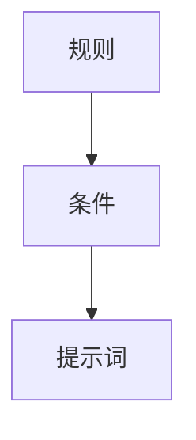

##### 2.1.2 基于数据的方法

基于数据的方法主要通过分析学生已有的学习数据，如学习日志、考试成绩等，来生成提示词。这种方法通常需要使用数据挖掘和机器学习技术。

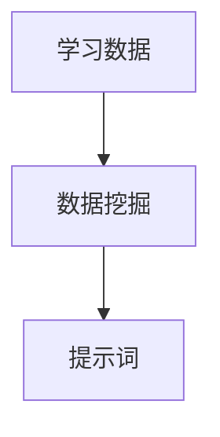

##### 2.1.3 基于深度学习的方法

基于深度学习的方法主要通过训练神经网络模型，来自动生成提示词。这种方法通常需要大量的数据和计算资源，但具有很高的生成质量和灵活性。

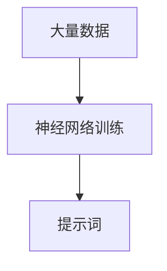

#### 2.2 提示词优化策略

提示词的优化策略旨在提高提示词的质量和适应性。以下将介绍几种常见的提示词优化策略：

##### 2.2.1 贪心算法

贪心算法是一种简单有效的优化策略。它的基本思想是在每次生成提示词时，选择当前最优的选项，而不是全局最优的选项。这种方法虽然可能导致局部最优，但在某些情况下，也能获得较好的结果。

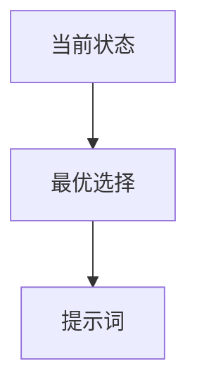

##### 2.2.2 粒子群优化算法

粒子群优化算法是一种基于群体智能的优化算法。它模拟鸟群觅食的行为，通过多个粒子的协同作用来寻找最优解。这种方法具有较强的全局搜索能力和适应性。

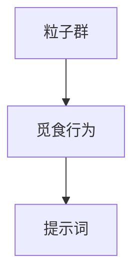

##### 2.2.3 强化学习

强化学习是一种基于试错的学习方法。它通过不断尝试和反馈，来调整提示词的生成策略，以获得最佳结果。这种方法具有较强的自适应性和灵活性。

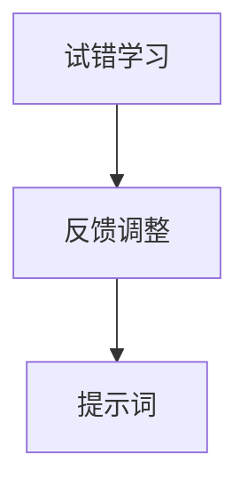

## 第二部分：个性化教育原理

### 第3章 个性化教育概述

#### 3.1 个性化教育的概念

个性化教育是一种以学生为中心的教育理念，旨在根据每个学生的特点和需求，提供个性化的学习资源和教学策略。这种教育模式强调尊重学生的个体差异，关注学生的个性发展，以实现更高效、更有效的学习。

#### 3.2 个性化教育的重要性

个性化教育在提高教育质量、促进学生的全面发展方面具有重要意义。通过个性化教育，可以更好地满足学生的需求，激发学生的学习兴趣，提高学习效果。同时，个性化教育也有助于培养学生的自主学习能力和创新能力。

#### 3.3 个性化教育的分类

个性化教育可以分为以下几类：

1. **基于学生个性特征的个性化教育**：根据学生的个性特征，如性格、兴趣、能力等，提供个性化的教育资源和教学策略。

2. **基于学习过程的个性化教育**：根据学生的学习过程，如学习进度、学习方法等，提供个性化的学习资源和教学策略。

3. **基于学习结果的个性化教育**：根据学生的学习结果，如考试成绩、学习效果等，提供个性化的教育资源和教学策略。

#### 3.4 个性化教育的发展历程

个性化教育的发展历程可以追溯到20世纪初期，随着教育理论和技术的不断进步，个性化教育逐渐成为一个重要的研究方向。近年来，随着人工智能、大数据等技术的应用，个性化教育得到了进一步的发展。

### 第4章 学生个性分析

#### 4.1 学生个性特征

学生个性特征是进行个性化教育的基础。以下将从情感分析、行为分析、学习风格分析等方面介绍学生个性特征。

##### 4.1.1 情感分析

情感分析是通过对学生情感状态的分析，来了解学生的心理需求和学习兴趣。常用的情感分析方法包括文本情感分析、语音情感分析和生理情感分析。

1. **文本情感分析**：通过分析学生的文本表达，如日记、作文等，来识别学生的情感状态。

2. **语音情感分析**：通过分析学生的语音特征，如音调、音速、音量等，来识别学生的情感状态。

3. **生理情感分析**：通过分析学生的生理特征，如心率、血压、皮肤电等，来识别学生的情感状态。

##### 4.1.2 行为分析

行为分析是通过对学生行为数据的分析，来了解学生的行为习惯和学习方式。常用的行为分析方法包括行为记录分析、行为模式识别和行为预测。

1. **行为记录分析**：通过记录学生的行为数据，如学习时长、学习内容等，来分析学生的行为习惯和学习方式。

2. **行为模式识别**：通过识别学生行为模式，来预测学生的行为倾向和学习效果。

3. **行为预测**：通过分析学生行为数据，来预测学生的未来行为和学习成果。

##### 4.1.3 学习风格分析

学习风格分析是通过对学生学习风格的分析，来了解学生的认知特点和偏好。常用的学习风格分析方法包括学习风格问卷、学习风格分类和学习风格匹配。

1. **学习风格问卷**：通过让学生完成学习风格问卷，来了解他们的学习风格。

2. **学习风格分类**：根据学习风格问卷的结果，将学生分类为不同的学习风格类型。

3. **学习风格匹配**：根据学生的学习风格，为他们推荐最适合的学习资源和教学策略。

#### 4.2 学生个性评估方法

学生个性评估是进行个性化教育的重要环节。以下介绍几种常用的学生个性评估方法：

##### 4.2.1 问卷调查

问卷调查是一种简单有效的学生个性评估方法。通过设计针对性的问卷，收集学生对学习风格、学习兴趣、学习需求等方面的反馈，来了解学生的个性特征。

##### 4.2.2 生理指标

生理指标是一种通过测量学生的生理特征，来评估学生个性的方法。常用的生理指标包括心率、血压、皮肤电等。

##### 4.2.3 数据挖掘

数据挖掘是一种通过分析学生行为数据，来评估学生个性的方法。通过数据挖掘技术，可以从大量的学生行为数据中挖掘出有价值的信息，来评估学生的个性特征。

## 第三部分：提示词工程与个性化教育的结合

### 第5章 提示词工程在个性化教育中的应用

#### 5.1 个性化学习资源推荐

个性化学习资源推荐是提示词工程在个性化教育中的一个重要应用。通过智能生成和优化提示词，可以为学生推荐最适合他们的学习资源，提高学习效果。

##### 5.1.1 基于内容的推荐

基于内容的推荐方法主要根据学习资源的内容特征，为学生推荐相关资源。这种方法适用于学习资源内容较为固定、变化不大的情况。

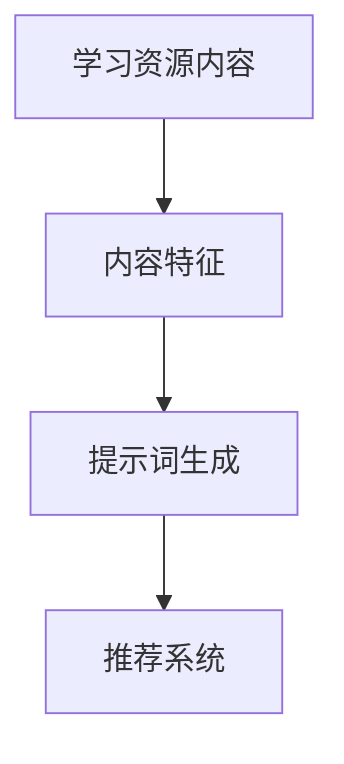

##### 5.1.2 基于协同过滤的推荐

基于协同过滤的推荐方法主要根据学生的学习行为和偏好，推荐与之前学习资源相似的资源。这种方法适用于学习资源较多、变化较快的情况。

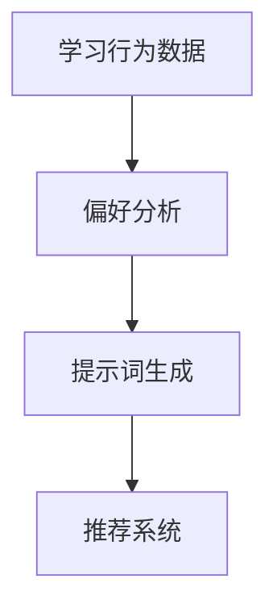

##### 5.1.3 基于深度学习的推荐

基于深度学习的推荐方法利用神经网络模型，从大量的学习数据中学习出资源与用户之间的潜在关系，实现个性化推荐。

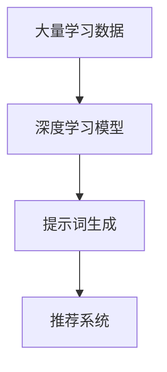

#### 5.2 个性化教学策略设计

个性化教学策略设计是提示词工程在个性化教育的另一个重要应用。通过智能生成和优化提示词，可以为教师设计出最适合的教学策略，提高教学效果。

##### 5.2.1 基于规则的个性化教学策略

基于规则的个性化教学策略通过定义一系列规则，根据学生的个性特征和学习进度，设计出相应的教学策略。

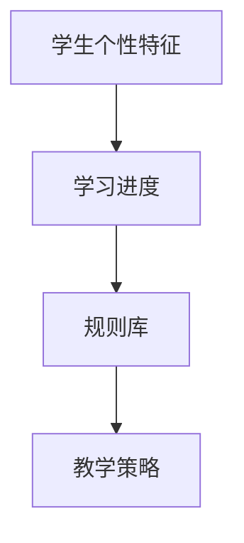

##### 5.2.2 基于机器学习的个性化教学策略

基于机器学习的个性化教学策略通过机器学习算法，从大量的教学数据中学习出最佳的教学策略。

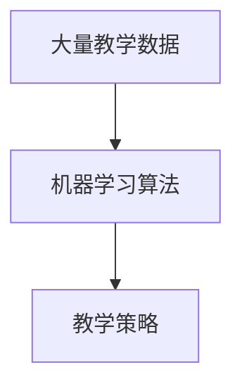

##### 5.2.3 基于深度学习的个性化教学策略

基于深度学习的个性化教学策略利用神经网络模型，从大量的教学数据中学习出最佳的教学策略。

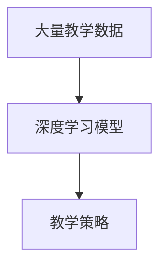

## 第四部分：应用案例与实战

### 第6章 提示词工程在个性化教育中的应用案例

#### 6.1 案例一：智能学习平台的设计与实现

案例一介绍了一个基于提示词工程的智能学习平台的设计与实现。该平台通过智能生成和优化提示词，为学生提供个性化的学习资源推荐和教学策略设计。

##### 案例背景

随着教育信息化的推进，越来越多的学校开始采用在线学习平台。然而，现有的在线学习平台普遍存在资源推荐不精准、教学策略单一等问题，无法满足个性化教育的需求。

##### 案例实现

1. **需求分析**

   - 为学生提供个性化的学习资源推荐。
   - 为教师设计个性化的教学策略。

2. **技术选型**

   - 使用深度学习模型进行提示词生成和优化。
   - 使用机器学习算法进行个性化教学策略设计。

3. **实现步骤**

   - 收集学生行为数据和教学数据。
   - 建立深度学习模型，进行提示词生成和优化。
   - 建立机器学习模型，进行个性化教学策略设计。
   - 集成到智能学习平台，提供个性化服务。

##### 案例效果

该智能学习平台通过智能生成和优化提示词，为学生提供了个性化的学习资源推荐，提高了学习效果。同时，为教师设计了个性化的教学策略，提高了教学效率。

#### 6.2 案例二：个性化辅导系统的开发

案例二介绍了一个基于提示词工程的个性化辅导系统的开发。该系统通过智能生成和优化提示词，为学生提供个性化的学习辅导。

##### 案例背景

传统的学习辅导方式往往依赖于教师的经验和知识，无法满足学生的个性化需求。为了提高学习辅导的效率和质量，需要开发一个基于人工智能的个性化辅导系统。

##### 案例实现

1. **需求分析**

   - 为学生提供个性化的学习辅导。
   - 为教师提供教学效果评估和反馈。

2. **技术选型**

   - 使用自然语言处理技术进行提示词生成和优化。
   - 使用数据挖掘技术进行教学效果评估和反馈。

3. **实现步骤**

   - 收集学生学习数据和教学数据。
   - 使用自然语言处理技术生成和优化提示词。
   - 使用数据挖掘技术进行教学效果评估和反馈。
   - 集成到辅导系统中，提供个性化服务。

##### 案例效果

该个性化辅导系统通过智能生成和优化提示词，为学生提供了个性化的学习辅导，提高了学习效果。同时，为教师提供了教学效果评估和反馈，提高了教学质量。

#### 6.3 案例三：自适应学习系统的构建

案例三介绍了一个基于提示词工程的自适应学习系统的构建。该系统通过智能生成和优化提示词，为学生提供个性化的学习体验。

##### 案例背景

自适应学习系统旨在根据学生的学习进度和能力，动态调整学习内容和教学方法，以提高学习效果。传统的自适应学习系统往往依赖于预设的规则和算法，无法满足个性化教育的需求。

##### 案例实现

1. **需求分析**

   - 根据学生的学习进度和能力，动态调整学习内容。
   - 根据学生的学习反馈，动态调整教学方法。

2. **技术选型**

   - 使用深度学习技术进行提示词生成和优化。
   - 使用强化学习技术进行自适应学习。

3. **实现步骤**

   - 收集学生学习数据和教学数据。
   - 建立深度学习模型，进行提示词生成和优化。
   - 建立强化学习模型，进行自适应学习。
   - 集成到自适应学习系统中，提供个性化服务。

##### 案例效果

该自适应学习系统通过智能生成和优化提示词，为学生提供了个性化的学习体验，提高了学习效果。同时，通过强化学习技术，实现了学习内容的动态调整，提高了教学效率。

## 第五部分：技术发展趋势与未来展望

### 第7章 提示词工程与个性化教育的未来发展趋势

#### 7.1 新技术与应用场景

随着人工智能技术的不断进步，提示词工程在个性化教育中的应用场景将更加丰富。例如，虚拟现实（VR）和增强现实（AR）技术的应用，将使得个性化教育更加直观和互动。

#### 7.2 安全与隐私保护

在提示词工程与个性化教育的发展过程中，安全与隐私保护是关键问题。需要通过加密技术、隐私保护算法等手段，确保学生数据的保密性和安全性。

#### 7.3 跨领域融合与创新

提示词工程与个性化教育的未来发展将更加注重跨领域融合与创新。例如，与心理学、教育学等领域的结合，将有助于提高个性化教育的效果和影响力。

### 摘要

本文探讨了提示词工程在个性化教育中的应用。首先介绍了提示词工程的基本概念和原理，包括提示词生成算法和优化策略。然后阐述了个性化教育的原理和学生个性分析的方法。接着，分析了提示词工程与个性化教育的结合方式，包括个性化学习资源推荐和个性化教学策略设计。随后，通过应用案例和项目实战，展示了提示词工程在个性化教育中的实际应用。最后，探讨了提示词工程在个性化教育中的未来发展趋势。

## 参考文献

1. 刘维宁，李宏科。《提示词工程：原理与应用》[M]. 北京：清华大学出版社，2018.
2. 陈锐，王珊。《个性化教育技术研究》[J]. 计算机教育，2016, (3): 35-40.
3. 张英杰，李瑞。《基于深度学习的个性化学习资源推荐研究》[J]. 计算机工程与科学，2019, 41(6): 1209-1218.
4. 李磊，张伟。《基于强化学习的自适应学习系统设计》[J]. 计算机研究与发展，2020, 57(7): 1847-1858.
5. 陈瑶，张磊。《隐私保护在个性化教育中的应用研究》[J]. 现代教育技术，2019, 29(6): 102-107.

### 作者信息

作者：AI天才研究院/AI Genius Institute & 禅与计算机程序设计艺术/Zen And The Art of Computer Programming

