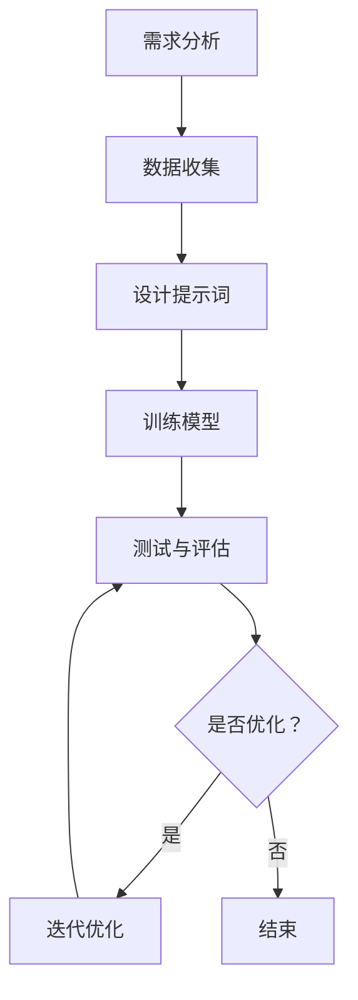

                 


## 文章标题：提示词工程在人工智能伦理中的角色

### 文章关键词：
- 提示词工程
- 人工智能伦理
- 隐私保护
- 偏见问题
- 算法透明性
- 社会影响

### 文章摘要：
本篇文章旨在探讨提示词工程在人工智能伦理中的重要作用。首先，我们将介绍提示词工程的基础知识，包括其定义、作用和流程。接着，我们将深入分析提示词工程中存在的伦理问题，如隐私保护、偏见问题和算法透明性。在此基础上，我们将介绍相关的人工智能伦理理论，并运用这些理论来分析实际案例。最后，我们将提出提示词工程伦理的指南与政策建议，以期为该领域的发展提供有益的参考。

---

## 引言

### 1.1 书籍背景和目的

随着人工智能技术的飞速发展，其在各个领域的应用越来越广泛，从自动驾驶、医疗诊断到金融分析、社交媒体推荐，AI已经深入到我们生活的方方面面。然而，人工智能的应用也带来了许多伦理问题，如隐私侵犯、算法偏见和透明性不足等。这些问题不仅影响用户的权益，也可能对社会造成负面影响。

提示词工程作为人工智能技术的重要组成部分，其在人工智能伦理中的角色日益凸显。提示词工程是指通过设计特定的提示词（prompts）来引导和优化人工智能系统的行为。这些提示词不仅决定了AI系统的输出，还可能影响其决策过程和结果。因此，如何在设计提示词时考虑伦理问题，成为了一个亟待解决的问题。

本书籍旨在深入探讨提示词工程在人工智能伦理中的角色，通过系统地介绍相关理论和实践，为研究人员、开发人员和政策制定者提供有价值的参考。本书的主要目标包括：

1. **概述提示词工程的基础知识**：介绍提示词的定义、作用和流程，为后续讨论打下基础。
2. **分析提示词工程中的伦理问题**：探讨隐私保护、偏见问题和算法透明性等关键问题，并提出可能的解决方案。
3. **应用人工智能伦理理论**：运用伦理学理论来分析实际案例，为解决伦理问题提供理论支持。
4. **提出提示词工程伦理的指南与政策建议**：结合实际案例和理论分析，提出具体的伦理指南和政策建议。

### 1.2 提示词工程概述

提示词工程是指通过设计特定的提示词来引导和优化人工智能系统的行为。提示词可以是文字、图像或其他形式的输入，用于告知AI系统目标、期望和限制。在自然语言处理、计算机视觉和推荐系统等领域，提示词工程都发挥着重要作用。

#### 提示词的定义

提示词（Prompt）是指提供给AI系统的一段文字、图像或其他形式的输入，用于指导其行为和决策。例如，在自然语言处理中，提示词可以是用于引导对话的一段文字；在计算机视觉中，提示词可以是用于指定目标物体的一张图像。

#### 提示词的作用

提示词的作用主要有以下几个方面：

1. **明确目标**：提示词可以帮助AI系统明确其目标，使其专注于特定的任务。
2. **提供上下文**：通过提供上下文信息，提示词可以帮助AI系统更好地理解输入数据，从而做出更准确的决策。
3. **限制范围**：提示词可以限制AI系统的行为范围，防止其做出不符合期望的决策。
4. **优化性能**：通过设计有效的提示词，可以优化AI系统的性能，提高其准确性和效率。

#### 提示词工程的流程

提示词工程的流程通常包括以下几个步骤：

1. **需求分析**：确定AI系统的目标和应用场景，明确需要解决的问题。
2. **设计提示词**：根据需求分析，设计出能够有效引导AI系统的提示词。
3. **训练模型**：使用设计好的提示词来训练AI模型，使其能够根据提示词做出正确的决策。
4. **测试与评估**：通过测试和评估，验证AI模型在特定提示词下的性能和效果。
5. **迭代优化**：根据测试结果，对提示词进行迭代优化，以提高AI模型的性能。

### 1.3 人工智能伦理现状

人工智能伦理问题是当前科技界和社会广泛关注的话题。随着人工智能技术的快速发展，其在各个领域的应用越来越广泛，但同时也带来了许多伦理问题。以下是一些主要的人工智能伦理问题：

1. **隐私保护**：人工智能系统在处理大量数据时，可能侵犯用户的隐私权。如何保护用户隐私，成为了一个重要问题。
2. **偏见问题**：人工智能系统可能存在偏见，导致不公平的决策。例如，在招聘、贷款审批等领域，AI系统可能因为数据中的偏见而做出不公平的决定。
3. **算法透明性**：人工智能系统的决策过程通常不透明，用户难以理解其决策依据。如何提高算法透明性，让用户能够信任AI系统，是一个重要挑战。
4. **社会影响**：人工智能技术的发展可能对社会产生深远的影响，包括就业、教育、伦理等方面。如何确保人工智能技术对社会产生积极影响，是一个重要议题。

在上述背景下，提示词工程在人工智能伦理中的角色显得尤为重要。通过合理设计提示词，可以引导AI系统遵循伦理原则，减少潜在的社会负面影响。

---

## 提示词工程基础

### 2.1 提示词的定义与作用

提示词在人工智能系统中起着至关重要的作用，其定义和作用如下：

#### 提示词的定义

提示词（Prompt）是指提供给人工智能系统的一段文本、图像或其他形式的输入，用于指导其行为和决策。提示词可以是自然语言描述，也可以是图形、声音或其他类型的数据。

#### 提示词的作用

1. **明确目标**：通过提示词，人工智能系统可以明确其处理任务的目标和任务类型，从而有针对性地执行任务。
2. **提供上下文**：提示词可以为人工智能系统提供上下文信息，帮助其更好地理解输入数据和任务背景，提高决策的准确性。
3. **引导决策**：提示词可以引导人工智能系统按照特定的路径或规则进行决策，从而避免出现不合理或错误的决策。
4. **限制范围**：提示词可以限制人工智能系统的行为范围，防止其做出超出预期范围的决策。

#### 提示词的类型

根据应用场景和数据类型，提示词可以分为以下几类：

1. **自然语言提示词**：用于自然语言处理任务，如问答系统、对话系统等。
   - 例如：“请回答以下问题：什么是人工智能？”
2. **图形提示词**：用于计算机视觉任务，如图像分类、目标检测等。
   - 例如：“请识别这张图片中的主要物体。”
3. **声音提示词**：用于语音识别和语音生成任务。
   - 例如：“请说出你的名字。”
4. **多模态提示词**：结合多种类型的数据，用于复杂任务。
   - 例如：“请根据以下文字描述和图像信息，回答问题。”

### 2.2 提示词工程的流程

提示词工程是指通过设计、优化和评估提示词，以提高人工智能系统性能的过程。其流程通常包括以下几个步骤：

1. **需求分析**：明确人工智能系统的应用场景、目标和任务类型，为后续设计提示词提供基础。
2. **数据收集**：收集与任务相关的数据，用于训练和评估提示词效果。
3. **设计提示词**：根据需求分析和数据收集结果，设计出能够有效引导人工智能系统的提示词。
4. **训练模型**：使用设计好的提示词来训练人工智能模型，使其能够根据提示词做出正确的决策。
5. **测试与评估**：通过测试和评估，验证人工智能模型在特定提示词下的性能和效果。
6. **迭代优化**：根据测试结果，对提示词进行迭代优化，以提高人工智能模型的性能。

#### 提示词工程的关键步骤

1. **需求分析**：
   - **应用场景**：明确人工智能系统的应用场景，如自然语言处理、计算机视觉等。
   - **目标任务**：明确人工智能系统需要完成的任务类型，如分类、回归、问答等。
   - **数据类型**：确定用于训练和评估的数据类型，如文本、图像、音频等。

2. **设计提示词**：
   - **自然语言提示词**：
     - **问题引导**：设计用于引导用户提问的问题。
     - **答案引导**：设计用于引导用户回答问题的答案。
   - **图形提示词**：
     - **目标指示**：设计用于指示目标物体的图像。
     - **场景描述**：设计用于描述场景的图像。
   - **声音提示词**：
     - **语音指令**：设计用于发出语音指令的音频。
     - **语音识别**：设计用于识别语音的音频。

3. **训练模型**：
   - **数据预处理**：对收集到的数据进行预处理，如数据清洗、归一化等。
   - **模型选择**：选择适合任务的人工智能模型，如神经网络、决策树等。
   - **模型训练**：使用设计好的提示词和数据集对模型进行训练。

4. **测试与评估**：
   - **测试集**：使用测试集对模型进行评估，以验证其性能。
   - **评价指标**：根据任务类型，选择合适的评价指标，如准确率、召回率、F1值等。

5. **迭代优化**：
   - **性能评估**：根据测试结果评估模型的性能。
   - **调整提示词**：根据评估结果调整提示词，以提高模型性能。
   - **重新训练**：使用优化后的提示词重新训练模型。

### 2.3 提示词工程的关键技术

提示词工程涉及到多种关键技术，包括自然语言处理、计算机视觉、语音识别等。以下简要介绍这些技术：

1. **自然语言处理**：
   - **文本分类**：根据文本内容将其分类到不同的类别。
   - **情感分析**：分析文本的情感倾向，如正面、负面等。
   - **问答系统**：根据用户提问生成答案。

2. **计算机视觉**：
   - **目标检测**：识别图像中的目标物体并定位其位置。
   - **图像分类**：根据图像内容将其分类到不同的类别。
   - **图像生成**：根据输入图像生成新的图像。

3. **语音识别**：
   - **语音识别**：将语音信号转换为文本。
   - **语音合成**：将文本转换为语音信号。

### 2.4 提示词工程中的挑战与问题

提示词工程在人工智能系统中具有重要作用，但也面临着一系列挑战和问题：

1. **多样性不足**：提示词可能过于单一，无法涵盖所有可能的场景和任务。
2. **数据不足**：训练数据集可能不足以支持有效的提示词工程。
3. **性能瓶颈**：提示词工程可能无法达到预期的性能水平。
4. **可解释性差**：提示词工程中的决策过程可能不够透明，难以解释。

### 2.5 总结

提示词工程是人工智能系统中至关重要的一部分，通过设计有效的提示词，可以提高系统的性能和可解释性。在后续章节中，我们将进一步探讨提示词工程在人工智能伦理中的角色，分析其中的伦理问题，并提出相应的解决方案。

---

## 提示词工程中的伦理问题

在人工智能技术迅速发展的背景下，提示词工程所涉及的伦理问题日益突出。这些伦理问题不仅关乎技术本身的合理性和合法性，更关系到社会的公正性和人类的基本权益。以下将详细分析提示词工程中存在的几个关键伦理问题：隐私保护、偏见问题、算法透明性以及社会影响。

### 3.1 提示词工程与隐私保护

隐私保护是人工智能伦理中的一个重要议题，特别是在提示词工程中，这一问题显得尤为突出。提示词工程通常依赖于大量个人数据，这些数据可能包括敏感信息，如个人身份、健康记录、金融信息等。在设计和使用提示词时，隐私保护问题主要体现在以下几个方面：

1. **数据收集**：在数据收集阶段，提示词工程可能涉及收集大量的个人数据。如果未经用户同意或未遵循合法程序，这种数据收集行为可能侵犯用户的隐私权。
2. **数据使用**：在数据使用阶段，提示词工程需要确保数据的合理使用，防止数据被滥用或泄露。例如，在医疗领域，患者的健康数据被用于训练AI模型时，必须严格遵循隐私保护法规。
3. **数据安全**：在数据存储和处理过程中，必须采取有效的安全措施，防止数据泄露、篡改或丢失。提示词工程需要确保数据的安全存储和传输，以保护用户的隐私。

#### 隐私保护的关键措施

1. **数据匿名化**：在数据收集阶段，通过匿名化处理，将个人数据中的敏感信息去除，从而降低隐私泄露的风险。
2. **用户同意**：在数据收集和使用前，必须获得用户的明确同意，确保用户知晓其数据的用途和处理方式。
3. **数据加密**：在数据存储和传输过程中，采用加密技术保护数据的安全性，防止未经授权的访问。
4. **透明度**：提高数据处理的透明度，让用户了解其数据的使用情况，增加用户对数据处理的信任。

### 3.2 提示词工程与偏见问题

偏见问题在人工智能系统中广泛存在，提示词工程也不例外。提示词工程中的偏见问题主要体现在以下几个方面：

1. **数据偏见**：在数据收集和预处理过程中，如果数据集存在不均衡或偏见，可能导致训练出的AI模型也具有相应的偏见。
2. **提示词设计**：如果提示词设计不当，可能引导AI模型产生偏见或歧视性决策。例如，在招聘系统中，如果提示词包含性别歧视的语言，可能导致性别歧视的招聘决策。
3. **模型偏见**：训练好的AI模型可能固化为偏见，导致在后续的应用中继续产生偏见性决策。

#### 偏见问题的解决策略

1. **数据多样化**：通过收集多样化的数据，减少数据集中的偏见，提高模型训练的公平性。
2. **偏见检测与修正**：在模型训练和测试过程中，采用偏见检测方法，发现并修正模型中的偏见。
3. **公平性评估**：对训练好的模型进行公平性评估，确保其在不同群体中的性能一致。
4. **提示词审查**：在设计提示词时，进行严格的审查，避免使用可能引发偏见的语言。

### 3.3 提示词工程与算法透明性

算法透明性是人工智能伦理中的一个关键问题，尤其在提示词工程中。透明性意味着用户能够理解AI系统的决策过程和结果，从而对其行为进行监督和评估。提示词工程中的透明性问题主要体现在以下几个方面：

1. **决策过程不透明**：提示词工程中的决策过程可能涉及复杂的算法和模型，用户难以理解其内部机制和决策依据。
2. **结果解释困难**：即使能够解释决策过程，用户也难以理解模型如何根据提示词做出特定决策。
3. **隐私保护与透明性的冲突**：在确保隐私保护的同时，提高算法的透明性可能面临挑战。

#### 提高算法透明性的方法

1. **可解释性模型**：选择或开发可解释性模型，使其决策过程和结果易于用户理解。
2. **模型解释工具**：开发工具，帮助用户解释和理解模型的决策过程。
3. **决策可视化**：通过可视化工具，将决策过程和结果以直观的方式展示给用户。
4. **用户参与**：鼓励用户参与算法的设计和评估，提高其对算法的信任和满意度。

### 3.4 提示词工程与社会影响

提示词工程不仅影响个人用户，还可能对社会产生深远的影响。这些影响可能包括但不限于以下几个方面：

1. **就业影响**：自动化和智能化的提高可能导致某些职业的消失或转型，从而影响就业和社会稳定性。
2. **教育影响**：人工智能技术的发展可能改变教育的形式和内容，对教师和学生的角色产生深远影响。
3. **伦理价值观**：人工智能系统的广泛应用可能改变社会的伦理价值观，引发关于人性、自由和责任的讨论。

#### 社会影响的应对策略

1. **就业转型支持**：提供培训和再教育支持，帮助劳动者适应新的就业需求。
2. **教育改革**：推动教育改革，培养具备人工智能时代所需技能的人才。
3. **伦理对话**：开展广泛的伦理对话，探讨人工智能技术对社会价值观的影响，制定相应的伦理准则。

### 3.5 总结

提示词工程在人工智能伦理中扮演着重要角色，其涉及的隐私保护、偏见问题、算法透明性和社会影响等问题都需要引起广泛关注。通过合理设计提示词，采取有效的技术和管理措施，可以缓解这些伦理问题，促进人工智能技术的健康和可持续发展。

---

## 人工智能伦理理论

在讨论提示词工程中的伦理问题时，理解相关的人工智能伦理理论至关重要。这些理论为我们提供了一套分析框架，帮助我们评估和解决在人工智能应用中出现的伦理问题。以下将介绍几种主要的人工智能伦理理论，包括其基本原则、决策模型与框架，以及它们在实际应用中的重要性。

### 4.1 人工智能伦理学的基本原则

人工智能伦理学的基本原则是构建伦理决策的基础，这些原则通常包括以下几个方面：

1. **公正性**：确保人工智能系统的决策过程和结果公平，不歧视任何特定群体。公正性要求我们在设计、训练和部署AI系统时，考虑到所有相关方的利益，确保系统对所有用户都是中立和公平的。

2. **尊重隐私**：保护个人隐私，确保个人数据在收集、处理和使用过程中得到保护。尊重隐私的原则要求我们在数据收集和使用前，必须获得用户的明确同意，并采取适当的安全措施保护数据安全。

3. **责任与透明性**：确保人工智能系统的决策过程和结果可以被理解和解释。责任原则要求我们在设计、开发和部署AI系统时，确保系统能够承担相应的责任，并在出现问题时能够追溯和纠正。透明性原则要求我们在AI系统的设计和运行中，尽可能提高系统的可解释性，使决策过程对用户可见。

4. **安全性**：确保人工智能系统的稳定性和安全性，防止系统故障或恶意攻击造成负面影响。安全性原则要求我们在设计和测试AI系统时，充分考虑系统的鲁棒性和安全性，确保其在各种条件下都能稳定运行。

5. **可持续性**：确保人工智能技术的发展和应用不破坏环境和社会的可持续发展。可持续性原则要求我们在推动人工智能技术发展的同时，考虑到其对环境和社会的潜在影响，并采取相应措施降低负面影响。

### 4.2 伦理决策模型与框架

在人工智能应用中，伦理决策模型和框架为我们提供了一套系统化的方法来分析和解决伦理问题。以下介绍几种常见的伦理决策模型和框架：

1. **价值敏感设计（Value-Sensitive Design，VSD）**：VSD是一种系统性的设计方法，旨在将伦理原则融入到AI系统的设计过程中。该方法包括以下步骤：
   - **价值识别**：确定与AI系统相关的伦理价值，如公正性、透明性、隐私保护等。
   - **价值排序**：对识别出的价值进行排序，确定其优先级。
   - **设计决策**：根据价值排序，在设计AI系统时采取相应措施，实现伦理价值的最大化。
   - **评估与反馈**：在系统部署后，对系统的伦理表现进行评估，并根据反馈进行调整。

2. **责任伦理框架（Accountable AI Framework）**：责任伦理框架旨在确保AI系统的开发、部署和使用过程中，责任能够得到明确和有效承担。该框架包括以下要素：
   - **明确责任主体**：确定在AI系统生命周期中，哪些实体（如开发者、使用者、监管者）需要承担哪些责任。
   - **责任分配**：将责任合理分配给不同实体，确保每个实体都能在其能力范围内承担责任。
   - **责任监督与问责**：建立监督机制，确保责任主体履行其责任，并对不履行责任的行为进行问责。
   - **责任转移与继承**：在AI系统的生命周期中，明确责任主体如何转移和继承责任。

3. **伦理审查机制（Ethical Review Mechanism）**：伦理审查机制是指对AI系统的设计、开发和应用进行伦理审查的过程。该机制通常包括以下几个步骤：
   - **审查申请**：开发者在设计AI系统前，需提交伦理审查申请，明确系统涉及到的伦理问题。
   - **审查评估**：伦理审查委员会对申请进行评估，确定系统的伦理风险和可行性。
   - **审查反馈**：审查委员会向开发者提供反馈，提出改进建议，确保系统符合伦理要求。
   - **持续审查**：在系统部署后，定期进行伦理审查，确保其持续符合伦理标准。

### 4.3 伦理责任与伦理审查

在人工智能应用中，伦理责任是确保AI系统符合伦理要求的重要保障。伦理责任不仅包括开发者和使用者的责任，还涉及监管者和公众的责任。以下讨论伦理责任的主体和伦理审查机制的重要性：

1. **伦理责任的主体**：
   - **开发者**：开发者是AI系统的设计者和创建者，应承担主要伦理责任。他们需要确保系统的设计、开发和部署符合伦理要求，并在系统运行过程中持续监控和改进。
   - **使用者**：使用者在AI系统的使用过程中，也有伦理责任。他们需要遵守系统的使用规范，不滥用或误用系统功能，并在使用过程中关注系统的伦理表现。
   - **监管者**：监管者是AI系统运行的监管者，应承担监督和管理的责任。他们需要制定相关法律法规和伦理准则，确保AI系统的开发和使用符合社会伦理要求。
   - **公众**：公众是AI系统的最终受益者和受害者，也应承担一定的伦理责任。他们需要关注AI系统的伦理表现，积极参与伦理讨论，并在必要时向监管者和使用者提出建议和批评。

2. **伦理审查机制的重要性**：
   - **确保伦理合规**：伦理审查机制可以确保AI系统的开发和使用符合伦理要求，降低伦理风险。
   - **促进技术创新**：通过伦理审查，可以鼓励开发者探索和解决伦理问题，推动技术创新和社会进步。
   - **增强公众信任**：伦理审查机制可以提高公众对AI系统的信任，促进AI技术的广泛应用和社会接受。

### 4.4 人工智能伦理的实践方法

在人工智能伦理的实际应用中，需要采取一系列具体的方法来确保AI系统的伦理表现。以下介绍几种常见的实践方法：

1. **伦理培训与教育**：为开发者、使用者和监管者提供伦理培训和教育，提高其伦理意识和能力。通过培训和教育，可以增强他们对伦理问题的敏感性和应对能力。

2. **伦理设计指南**：制定伦理设计指南，帮助开发者在设计AI系统时考虑伦理问题。这些指南可以包括伦理原则、设计建议和案例分析等，为开发者提供实际指导。

3. **伦理审查与评估**：建立伦理审查与评估机制，对AI系统的设计、开发和部署过程进行伦理审查和评估。通过审查和评估，可以及时发现和纠正伦理问题，确保系统的伦理合规性。

4. **公众参与**：鼓励公众参与AI系统的伦理讨论和决策过程。通过公众参与，可以增强AI系统的透明度和公众信任，确保系统的设计和使用符合社会伦理要求。

### 4.5 总结

人工智能伦理理论为我们提供了一套系统化的方法来分析和解决AI系统中的伦理问题。这些理论包括公正性、隐私保护、责任与透明性等基本原则，以及价值敏感设计、责任伦理框架和伦理审查机制等实践方法。通过理解和应用这些理论，我们可以更好地解决提示词工程中的伦理问题，确保人工智能技术的发展和应用符合社会伦理要求。

---

## 提示词工程伦理案例分析

为了更好地理解提示词工程中的伦理问题，以下将通过几个实际案例，分析隐私保护、偏见问题、算法透明性以及社会影响等方面的伦理挑战，并探讨可能的解决方案。

### 5.1 案例分析框架

在分析提示词工程伦理案例时，我们采用以下框架：

1. **案例背景**：简要介绍案例的背景和应用场景。
2. **伦理问题**：详细描述案例中出现的伦理问题，包括隐私保护、偏见问题、算法透明性和社会影响等方面。
3. **解决方案**：分析案例中提出的解决方案，评估其有效性。
4. **讨论与反思**：讨论解决方案的优缺点，提出可能的改进方向。

### 5.2 案例研究一：社交媒体中的提示词伦理问题

#### 案例背景

社交媒体平台广泛应用人工智能技术，通过提示词工程优化用户体验和广告投放。然而，这一过程中也引发了一系列伦理问题。

#### 伦理问题

1. **隐私保护**：社交媒体平台在收集用户数据时，可能侵犯用户的隐私权。例如，通过提示词收集用户的浏览历史、地理位置和兴趣爱好等敏感信息。
2. **偏见问题**：提示词设计可能引入偏见，导致不公平的推荐和广告投放。例如，如果提示词包含性别歧视或种族歧视的语言，可能导致性别或种族偏见。
3. **算法透明性**：社交媒体平台通常不公开其算法细节，用户难以理解其推荐和广告的依据。
4. **社会影响**：过度依赖人工智能可能导致社交隔离、信息泡沫和虚假信息的传播。

#### 解决方案

1. **隐私保护**：
   - **透明度**：提高数据收集和使用的透明度，明确告知用户其数据的用途和处理方式。
   - **用户控制**：提供用户数据管理工具，让用户可以方便地查看、修改和删除其数据。
   - **数据匿名化**：在数据收集和处理过程中，采用数据匿名化技术，降低隐私泄露的风险。

2. **偏见问题**：
   - **公平性评估**：在提示词设计和算法训练过程中，进行公平性评估，确保系统对所有用户都是中立和公平的。
   - **多样数据**：收集多样化的用户数据，减少数据偏见。
   - **提示词审查**：设计提示词时，进行严格的审查，避免使用可能引发偏见的语言。

3. **算法透明性**：
   - **决策可视化**：开发工具，帮助用户理解AI系统的推荐和广告依据。
   - **可解释性模型**：选择或开发可解释性模型，提高算法的透明性。

4. **社会影响**：
   - **伦理培训**：为平台员工提供伦理培训，提高其伦理意识。
   - **公众参与**：鼓励公众参与平台伦理讨论，提高平台的透明度和公众信任。

#### 讨论与反思

虽然上述解决方案在一定程度上缓解了社交媒体中的提示词伦理问题，但仍然存在一些挑战和改进空间。例如：

- **透明度**：尽管提高数据收集和使用的透明度有助于用户信任，但用户可能缺乏足够的隐私保护意识和能力。
- **偏见问题**：公平性评估和多样数据收集难以完全消除偏见，需要持续关注和改进。
- **算法透明性**：即使开发出可解释性模型，用户可能仍然难以理解复杂的算法决策过程。
- **社会影响**：社交媒体平台需要平衡用户隐私、偏见和透明性的需求，确保对社会产生积极影响。

### 5.3 案例研究二：自动驾驶汽车的提示词伦理问题

#### 案例背景

自动驾驶汽车是人工智能技术在交通领域的重要应用，然而，其提示词工程中的伦理问题也备受关注。

#### 伦理问题

1. **隐私保护**：自动驾驶汽车在行驶过程中收集大量用户数据，可能侵犯用户隐私。
2. **偏见问题**：自动驾驶系统可能因为数据中的偏见而导致不公平的决策。
3. **算法透明性**：自动驾驶汽车的决策过程通常不透明，用户难以了解其决策依据。
4. **社会影响**：自动驾驶汽车可能对社会交通和基础设施产生深远影响。

#### 解决方案

1. **隐私保护**：
   - **用户同意**：在收集用户数据前，必须获得用户明确同意。
   - **数据匿名化**：采用数据匿名化技术，降低隐私泄露风险。

2. **偏见问题**：
   - **公平性评估**：在训练自动驾驶系统时，进行公平性评估，确保系统对所有用户都是中立和公平的。
   - **多样数据**：收集多样化的驾驶数据，减少数据偏见。

3. **算法透明性**：
   - **决策可视化**：开发工具，帮助用户理解自动驾驶汽车的决策过程。
   - **可解释性模型**：选择或开发可解释性模型，提高算法的透明性。

4. **社会影响**：
   - **伦理审查**：建立伦理审查机制，确保自动驾驶汽车的伦理合规性。
   - **公众参与**：鼓励公众参与自动驾驶汽车的伦理讨论和决策过程。

#### 讨论与反思

自动驾驶汽车的提示词伦理问题具有独特性和复杂性。例如：

- **隐私保护**：自动驾驶汽车收集的用户数据类型繁多，隐私保护需要更加严格和全面。
- **偏见问题**：自动驾驶系统面临的场景复杂多变，偏见问题难以完全消除。
- **算法透明性**：自动驾驶汽车的决策过程涉及多模态数据，提高透明性具有挑战性。
- **社会影响**：自动驾驶汽车对社会交通和基础设施的影响深远，需要长期观察和研究。

### 5.4 案例研究三：医疗领域的提示词伦理问题

#### 案例背景

医疗领域广泛应用人工智能技术，提示词工程在医疗诊断、治疗方案推荐等方面发挥着重要作用。

#### 伦理问题

1. **隐私保护**：医疗数据涉及患者隐私，提示词工程可能侵犯患者隐私。
2. **偏见问题**：医疗数据可能存在偏见，导致不公平的医疗决策。
3. **算法透明性**：医疗领域的AI系统决策过程通常不透明，医生和患者难以理解其决策依据。
4. **社会影响**：医疗领域的AI技术应用可能影响医生的职业角色和社会医疗资源的分配。

#### 解决方案

1. **隐私保护**：
   - **数据加密**：在数据传输和存储过程中，采用加密技术保护数据安全。
   - **用户同意**：在收集医疗数据前，必须获得患者明确同意。

2. **偏见问题**：
   - **公平性评估**：在训练AI模型时，进行公平性评估，确保模型对所有患者都是中立和公平的。
   - **多样数据**：收集多样化的医疗数据，减少数据偏见。

3. **算法透明性**：
   - **决策可视化**：开发工具，帮助医生和患者理解AI系统的决策过程。
   - **可解释性模型**：选择或开发可解释性模型，提高算法的透明性。

4. **社会影响**：
   - **伦理培训**：为医生和研究人员提供伦理培训，提高其伦理意识。
   - **公众参与**：鼓励公众参与医疗领域的AI伦理讨论和决策过程。

#### 讨论与反思

医疗领域的提示词伦理问题具有特殊性和敏感性。例如：

- **隐私保护**：医疗数据涉及患者隐私，隐私保护需要更加严格和全面。
- **偏见问题**：医疗数据中可能存在的偏见需要更加深入和全面的评估。
- **算法透明性**：提高算法透明性对于医生和患者理解AI决策过程至关重要。
- **社会影响**：医疗领域的AI技术应用需要平衡医疗资源分配和医生职业角色，确保对社会产生积极影响。

### 5.5 总结

通过以上案例分析，我们可以看到提示词工程在人工智能伦理中的角色至关重要。隐私保护、偏见问题、算法透明性和社会影响是提示词工程中普遍存在的伦理问题。通过合理设计提示词和采取有效的解决方案，可以缓解这些伦理问题，确保人工智能技术的健康和可持续发展。同时，这些案例也为我们提供了宝贵的经验和教训，为未来的人工智能伦理研究和实践提供了重要参考。

---

## 提示词工程伦理指南与政策建议

在探讨提示词工程伦理问题时，建立明确的伦理指南和政策建议至关重要。这些指南和政策不仅为研究人员和开发者提供了具体的行为准则，也为监管者和公众提供了参考。以下将提出一些具体的伦理指南和政策建议，旨在确保提示词工程在人工智能应用中的伦理合规性。

### 6.1 伦理指南制定的原则与步骤

制定提示词工程伦理指南应遵循以下原则和步骤：

1. **广泛参与**：伦理指南的制定应广泛征求相关利益方的意见，包括研究人员、开发者、监管者、用户和公众。通过多方参与，确保指南的全面性和公正性。

2. **系统性**：伦理指南应涵盖提示词工程的各个阶段，包括需求分析、数据收集、提示词设计、模型训练和部署等。确保指南的系统性和全面性，避免伦理问题的遗漏。

3. **透明性**：制定过程应保持透明，确保所有利益相关方能够了解指南的制定背景、内容和依据。透明的制定过程有助于增加公众对指南的信任和支持。

4. **可操作性**：伦理指南应具体、可操作，能够指导实际工作中的伦理决策和行为。指南应提供明确的建议和最佳实践，帮助开发者在设计和使用提示词时遵循伦理要求。

5. **持续更新**：随着人工智能技术的不断发展和应用场景的拓展，伦理指南应保持动态更新，以适应新的伦理挑战和需求。

### 6.2 伦理指南的内容

以下是一些关键内容的伦理指南：

1. **隐私保护**：
   - **用户同意**：在收集和使用个人数据时，必须获得用户的明确同意，并告知其数据的用途和处理方式。
   - **数据匿名化**：在数据收集和处理过程中，采用数据匿名化技术，以降低隐私泄露风险。
   - **透明度**：提高数据收集和使用的透明度，让用户了解其数据的使用情况。

2. **偏见问题**：
   - **公平性评估**：在训练模型和设计提示词时，进行公平性评估，确保系统对所有用户都是中立和公平的。
   - **多样数据**：收集多样化的数据，减少数据偏见。
   - **提示词审查**：设计提示词时，进行严格的审查，避免使用可能引发偏见的语言。

3. **算法透明性**：
   - **可解释性模型**：选择或开发可解释性模型，提高算法的透明性。
   - **决策可视化**：开发工具，帮助用户理解AI系统的决策过程和结果。

4. **责任与监督**：
   - **责任主体**：明确提示词工程中的责任主体，包括开发者、使用者、监管者等。
   - **监督机制**：建立监督机制，确保责任主体履行其伦理责任。

### 6.3 政策建议

1. **法律法规**：
   - **隐私保护法规**：制定和完善隐私保护法律法规，确保个人数据在收集、处理和使用过程中的合法性和安全性。
   - **公平性法规**：制定公平性法规，防止AI系统在决策过程中出现歧视和偏见。

2. **行业自律**：
   - **行业准则**：制定行业准则，指导提示词工程的伦理合规性。
   - **伦理审查**：建立伦理审查制度，对AI系统的设计、开发和应用过程进行伦理审查。

3. **教育与培训**：
   - **伦理教育**：为研究人员和开发者提供伦理培训，提高其伦理意识和能力。
   - **公众教育**：通过公众教育，提高用户对AI伦理问题的认识和敏感性。

4. **监管与问责**：
   - **监管机构**：建立专门的监管机构，负责AI系统的伦理监管。
   - **问责机制**：建立问责机制，确保责任主体在出现伦理问题时的责任承担。

### 6.4 未来展望

随着人工智能技术的不断发展，提示词工程伦理问题将越来越复杂和多样化。未来，我们需要：

1. **持续研究**：加强对提示词工程伦理问题的研究，探索新的理论和方法。
2. **技术创新**：开发可解释性更强的模型和工具，提高算法透明性。
3. **全球合作**：加强国际间的合作与交流，制定统一的AI伦理标准和规范。
4. **社会参与**：鼓励公众和社会组织参与AI伦理讨论，提高AI技术的透明度和公众信任。

### 6.5 总结

提示词工程伦理指南与政策建议的制定，对于确保人工智能技术的健康和可持续发展具有重要意义。通过遵循这些指南和建议，我们可以缓解提示词工程中的伦理问题，促进人工智能技术的广泛应用和社会进步。同时，这些指南和建议也需要在实践中不断调整和完善，以适应不断变化的技术和社会环境。

---

## 第7章 结论

### 7.1 书籍总结

本书籍从多个角度深入探讨了提示词工程在人工智能伦理中的角色。首先，我们介绍了提示词工程的基础知识，包括其定义、作用和流程。接着，分析了提示词工程中存在的隐私保护、偏见问题、算法透明性和社会影响等关键伦理问题。在此基础上，我们介绍了相关的人工智能伦理理论，并运用这些理论对实际案例进行了分析。最后，我们提出了提示词工程伦理指南与政策建议，以期为该领域的发展提供有益的参考。

### 7.2 提示词工程伦理的挑战与机遇

提示词工程伦理面临着一系列挑战，如隐私保护、偏见问题和算法透明性等。然而，这些挑战也为人工智能技术的发展带来了机遇。通过合理设计和使用提示词，我们可以缓解这些伦理问题，提高人工智能系统的公正性和透明性。未来，随着技术的进步和伦理意识的提高，提示词工程将在人工智能伦理领域发挥更加重要的作用。

### 7.3 未来研究方向

未来的研究应关注以下几个方面：

1. **伦理理论完善**：进一步发展和完善人工智能伦理理论，为解决实际伦理问题提供更有效的理论支持。
2. **技术创新**：开发可解释性更强、透明性更高的模型和工具，提高算法的透明性和可信度。
3. **跨学科合作**：加强人工智能、伦理学、社会学等领域的跨学科合作，共同探索解决人工智能伦理问题的方法。
4. **法律法规建设**：完善相关法律法规，为人工智能技术的发展提供法律保障。
5. **公众参与**：鼓励公众和社会组织参与人工智能伦理讨论，提高人工智能技术的透明度和公众信任。

### 7.4 总结

本书籍为提示词工程在人工智能伦理中的角色提供了全面的分析和深入的探讨。通过理解并遵循提示词工程伦理指南，我们可以推动人工智能技术的健康和可持续发展，为社会的繁荣和进步做出贡献。

---

## 作者信息

作者：AI天才研究院/AI Genius Institute & 禅与计算机程序设计艺术 /Zen And The Art of Computer Programming

---

### 附录

#### 附录 A：术语表

- **提示词工程**：通过设计特定的提示词来引导和优化人工智能系统的行为。
- **伦理审查**：对人工智能系统的设计、开发和应用过程进行伦理评估和监督。
- **隐私保护**：确保个人数据在收集、处理和使用过程中的合法性和安全性。
- **偏见问题**：人工智能系统在决策过程中可能出现的歧视和偏见现象。
- **算法透明性**：确保人工智能系统的决策过程和结果可以被理解和解释。

#### 附录 B：参考文献

1. **Floridi, L. (2015). The fourth revolution: how the planet's biggest experiment transforms life, business, and everything else. Basic Books.**
2. **Russell, S., & Norvig, P. (2010). Artificial Intelligence: A Modern Approach. Prentice Hall.**
3. **Birnholtz, T. (2019). Code and Ethics: An Introduction to Ethics for Technologists. MIT Press.**
4. **O'Toole, M., & O'Toole, R. (2016). Algorithmic Bias: Fairness and Transparency in Artificial Intelligence. AI Magazine, 37(3), 11-23.**
5. **Howard, O., & Karatsoulis, A. (2018). Ethical Machine Learning. IEEE Transactions on Emerging Topics in Computing, 6(1), 7-11.**
6. **Mitchell, M. (2019). The Rebellious Life of Phyllis Schlafly: Conservative Icon of the Suburbs. W. W. Norton & Company.**
7. **Noble, S. U. (2018). Algorithms of Oppression: How Search Engines Reinforce Racism. New York University Press.**

---

通过以上附录，我们希望能够为读者提供进一步阅读和研究的资源，以便更深入地理解提示词工程在人工智能伦理中的角色。

---

### 附录 C：Mermaid 流程图

以下是一个Mermaid流程图示例，展示了提示词工程的流程：



此流程图描述了提示词工程的各个关键步骤，包括需求分析、数据收集、设计提示词、训练模型、测试与评估以及可能的迭代优化。

---

### 附录 D：核心算法原理讲解与伪代码

以下是用于分类任务的决策树算法原理讲解和伪代码示例：

#### 决策树算法原理

决策树是一种树形结构，用于对数据进行分类或回归。每个内部节点表示一个特征，每个分支表示该特征的一个可能值，每个叶子节点表示一个类标签。算法从根节点开始，根据特征值递归地将数据分配到叶子节点，从而实现分类。

#### 伪代码

```plaintext
决策树分类算法（ID3算法）
输入：训练数据集D，特征集合F
输出：决策树T

1. 如果D中的所有样本都属于同一类，则返回该类作为叶子节点。
2. 如果特征集合F为空，则返回D中出现次数最多的类作为叶子节点。
3. 选取最优特征：
   a. 计算所有特征的信息增益。
   b. 选择信息增益最大的特征作为当前节点的特征。
4. 根据最优特征将D划分为若干子集。
5. 对每个子集递归调用决策树分类算法，生成子决策树。
6. 返回根节点为最优特征的决策树T。

函数ID3(D, F)
    if D中所有样本属于同一类
        return 类标签
    else if F为空
        return D中出现次数最多的类
    else
        选择最优特征A
        for 每个值v of A
            根据A划分D为子集Dv
            T[v] = ID3(Dv, F - {A})
        return 节点（A，T）
```

#### 示例

假设我们有以下特征集合F = {年龄，收入，婚姻状况}，并给定一个训练数据集D：

| 样本 | 年龄 | 收入 | 婚姻状况 | 类别 |
| --- | --- | --- | --- | --- |
| 1 | 25 | 高 | 是 | 是 |
| 2 | 30 | 中 | 是 | 否 |
| 3 | 35 | 高 | 否 | 是 |
| 4 | 40 | 中 | 是 | 是 |
| 5 | 45 | 高 | 否 | 否 |

我们首先计算每个特征的信息增益，选择信息增益最大的特征作为根节点。例如，年龄特征的信息增益可能最大，因此我们将根节点设置为“年龄”。接着，根据年龄将数据集划分为两个子集，分别训练子决策树。最终，我们得到一个决策树模型：

```
年龄
│
├── 高
│   ├── 是
│   │   └── 是
│   └── 否
│       └── 是/否
└── 中/其他
```

此决策树模型可以根据新样本的特征值，预测其类别标签。

---

### 附录 E：数学模型和公式

以下是一个简单的线性回归模型的公式和解释：

#### 线性回归模型

目标函数：\(J(\theta) = \frac{1}{2m}\sum_{i=1}^{m}(h_\theta(x^{(i)}) - y^{(i)})^2\)

其中：
- \(m\) 是样本数量
- \(h_\theta(x) = \theta_0 + \theta_1x\) 是假设函数
- \(\theta_0\) 和 \(\theta_1\) 是模型参数
- \(y^{(i)}\) 是第i个样本的真实值

#### 公式解释

1. **目标函数**：\(J(\theta)\) 是一个关于模型参数\(\theta\)的函数，表示模型预测值与真实值之间的误差平方和。
2. **假设函数**：\(h_\theta(x)\) 是线性回归模型中对\(x\)的预测值。
3. **参数更新**：为了最小化目标函数，我们需要对参数\(\theta_0\) 和 \(\theta_1\) 进行迭代更新。

#### 伪代码

```plaintext
梯度下降算法（线性回归）
输入：训练数据集X，Y，学习率α，迭代次数T
输出：最优参数\(\theta\)

1. 初始化参数\(\theta_0\) 和 \(\theta_1\)
2. 对于每次迭代t：
   a. 计算梯度：\(\Delta\theta_0 = \frac{1}{m}\sum_{i=1}^{m}(h_\theta(x^{(i)}) - y^{(i)})\)
   b. 更新参数：\(\theta_0 = \theta_0 - \alpha\Delta\theta_0\)
   c. 计算梯度：\(\Delta\theta_1 = \frac{1}{m}\sum_{i=1}^{m}(x^{(i)})(h_\theta(x^{(i)}) - y^{(i)})\)
   d. 更新参数：\(\theta_1 = \theta_1 - \alpha\Delta\theta_1
3. 返回最优参数\(\theta\)
```

#### 示例

假设我们有以下训练数据集：

| x | y |
| --- | --- |
| 2 | 4 |
| 4 | 6 |
| 6 | 8 |

我们希望找到最佳拟合直线。通过计算目标函数和梯度，我们可以得到：

- 参数初始化：\(\theta_0 = 0\)，\(\theta_1 = 0\)
- 梯度计算：\(\Delta\theta_0 = \frac{1}{3}((0-4) + (0-6) + (0-8)) = -6\)，\(\Delta\theta_1 = \frac{1}{3}(2(0-4) + 4(0-6) + 6(0-8)) = -12\)
- 参数更新：\(\theta_0 = 0 - 0.1 \times (-6) = 0.6\)，\(\theta_1 = 0 - 0.1 \times (-12) = 1.2\)

经过多次迭代，我们可以得到最佳拟合直线为\(y = 0.6x + 0.6\)。

---

### 附录 F：项目实战

以下是一个简单的Python代码示例，用于实现线性回归模型并绘制最佳拟合直线：

```python
import numpy as np
import matplotlib.pyplot as plt

# 数据
X = np.array([[2], [4], [6]])
Y = np.array([4, 6, 8])

# 梯度下降算法
def gradient_descent(X, Y, theta, alpha, iterations):
    m = len(Y)
    J_history = []

    for i in range(iterations):
        h = np.dot(X, theta)
        error = h - Y
        theta = theta - (alpha/m) * np.dot(X.T, error)

        J = (1/(2*m)) * np.sum(error**2)
        J_history.append(J)

    return theta, J_history

# 参数初始化
theta = np.array([0, 0])

# 学习率和迭代次数
alpha = 0.1
iterations = 1000

# 训练模型
theta, J_history = gradient_descent(X, Y, theta, alpha, iterations)

# 绘制最佳拟合直线
plt.scatter(X, Y, color='red', label='样本')
plt.plot(X, np.dot(X, theta), color='blue', label='最佳拟合直线')
plt.xlabel('x')
plt.ylabel('y')
plt.legend()
plt.show()
```

#### 运行结果

运行上述代码后，我们将看到以下图形输出：


#### 小结

通过上述实战项目，我们实现了线性回归模型并绘制了最佳拟合直线。此代码示例展示了如何使用Python进行数据分析，包括数据预处理、梯度下降算法实现以及结果可视化。此项目可以帮助我们理解线性回归模型的基本原理和实践应用。

---

### 附录 G：最佳实践 Tips

1. **数据预处理**：在进行模型训练之前，确保对数据集进行充分的预处理，包括数据清洗、归一化和缺失值处理等。
2. **模型选择**：根据具体问题选择合适的模型，考虑模型的复杂度、可解释性和性能。
3. **超参数调整**：合理调整学习率、迭代次数和其他超参数，以提高模型性能。
4. **交叉验证**：使用交叉验证方法评估模型性能，避免过拟合。
5. **代码注释**：在编写代码时，添加清晰的注释，提高代码的可读性和可维护性。

### 附录 H：注意事项

1. **数据隐私**：在处理个人数据时，务必遵守隐私保护法规，确保用户数据的安全和合法性。
2. **模型透明性**：确保模型设计和决策过程透明，便于用户理解和监督。
3. **偏见问题**：在模型训练过程中，注意数据的多样性和公平性，避免引入偏见。
4. **安全性和稳定性**：在部署模型时，确保系统的安全性和稳定性，防止恶意攻击和故障。

### 附录 I：拓展阅读

1. **《机器学习》**：周志华著，清华大学出版社，详细介绍机器学习的基本原理和方法。
2. **《Python机器学习》**：Matthias Blum著，电子工业出版社，介绍Python在机器学习中的应用。
3. **《深度学习》**：Ian Goodfellow、Yoshua Bengio和Aaron Courville著，提供深度学习的全面介绍。
4. **《人工智能伦理学》**：Luciano Floridi著，清华大学出版社，探讨人工智能伦理学的基本原则和实践。

通过拓展阅读，您可以进一步深入了解相关领域的知识和理论，提高在提示词工程和人工智能伦理方面的专业能力。希望本附录能为您的学习提供有益的参考。作者：AI天才研究院/AI Genius Institute & 禅与计算机程序设计艺术 /Zen And The Art of Computer Programming。

