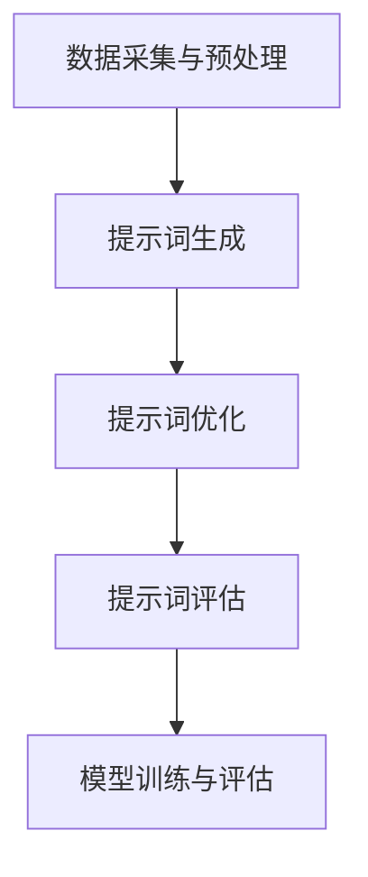

                 

# 提示词工程在低资源场景NLP中的应用

## 关键词
- 提示词工程
- 低资源场景
- 自然语言处理
- 提示词生成
- 提示词优化
- 数据增强
- 模型压缩

## 摘要
本文探讨了在低资源场景下，如何利用提示词工程来提高自然语言处理（NLP）的效果。通过分析提示词工程的基本概念、生成与优化方法，以及具体应用案例，本文展示了提示词工程在解决数据稀缺、计算资源有限等挑战中的关键作用。同时，本文还对未来提示词工程的发展趋势和挑战进行了展望，为相关领域的研发工作提供了参考。

## 第1章 引言

### 1.1 书籍背景

#### 1.1.1 提示词工程的重要性

随着人工智能技术的不断发展，自然语言处理（NLP）成为了一个热门的研究领域。然而，在低资源场景下，如数据稀缺、计算资源有限等，NLP任务的实现面临着巨大的挑战。提示词工程作为一种有效的解决方法，通过对输入文本进行预处理，生成高质量的提示词，从而提高模型的性能。提示词工程的重要性在于：

1. **缓解数据稀缺问题**：通过生成提示词，可以有效地扩展训练数据集，提高模型的泛化能力。
2. **优化计算资源使用**：通过提示词工程，可以降低模型对大量数据的依赖，减少计算资源的消耗。
3. **提高模型性能**：高质量的提示词有助于模型更好地理解输入文本，从而提高NLP任务的效果。

#### 1.1.2 低资源场景NLP的挑战

低资源场景下的NLP任务具有以下特点：

1. **数据稀缺**：数据量有限，难以满足模型训练的需求。
2. **计算资源有限**：计算资源有限，无法进行大规模数据训练。
3. **交互复杂度较高**：用户与系统之间的交互复杂，需要模型具备更高的理解能力。

这些挑战使得传统的NLP方法难以直接应用于低资源场景，因此需要新的方法和技术来克服这些困难。

#### 1.1.3 提示词工程的关键作用

提示词工程在低资源场景NLP中具有关键作用：

1. **数据增强**：通过生成高质量的提示词，可以扩展训练数据集，提高模型的泛化能力。
2. **模型压缩**：通过优化提示词，可以减少模型对数据的依赖，从而实现模型的压缩和加速。
3. **提高交互质量**：通过高质量的提示词，可以提高模型对用户输入的理解能力，从而提升交互质量。

### 1.2 目标读者群体

本文主要面向以下读者群体：

1. **NLP研究人员**：对提示词工程的基本概念、方法及应用有深入了解。
2. **工程师**：希望通过本文学习如何在实际项目中应用提示词工程。
3. **数据科学家**：对如何利用提示词工程提高NLP模型的性能有浓厚的兴趣。

### 1.3 书籍结构概述

本文将分为以下七个部分：

1. **第1章 引言**：介绍本文的研究背景、目标读者群体和书籍结构。
2. **第2章 提示词工程基础**：介绍提示词工程的基本概念、生成与优化方法。
3. **第3章 提示词工程在低资源场景中的应用**：分析低资源场景NLP的挑战，以及提示词工程的应用方法。
4. **第4章 提示词优化与评估**：介绍提示词优化策略和评估方法。
5. **第5章 提示词工程实践案例**：通过具体案例展示提示词工程的实践应用。
6. **第6章 提示词工程未来发展**：探讨提示词工程的发展趋势和未来挑战。
7. **第7章 结论**：总结本文的主要贡献和未来工作展望。

### 1.4 学习目标

通过本文的学习，读者将能够：

1. **理解提示词工程的基本概念和原理**：掌握提示词工程的目标和基本流程。
2. **掌握不同的提示词生成方法**：了解数据驱动方法、生成模型和对抗性生成网络等。
3. **学会优化和评估提示词的效果**：了解提示词质量评估指标、评估方法以及优化策略。
4. **熟悉提示词工程在低资源场景的实践应用**：通过具体案例了解提示词工程在低资源场景NLP中的应用方法。

## 第2章 提示词工程基础

### 2.1 提示词工程概念

#### 2.1.1 提示词的定义

提示词（Prompt Word）是在自然语言处理（NLP）任务中，对输入文本进行预处理后生成的一组关键词或短语。提示词的作用在于：

1. **提高模型理解能力**：通过提示词，模型能够更好地理解输入文本的含义，从而提高NLP任务的效果。
2. **引导模型生成**：提示词可以作为模型的输入，引导模型生成预期的输出，如文本分类、机器翻译等。

常见的提示词类型包括：

1. **关键词提取**：从输入文本中提取的关键词，用于表示文本的主要内容。
2. **短语生成**：根据输入文本生成的短语，用于扩展输入文本的含义。
3. **语义角色标注**：对输入文本中的词语进行语义角色标注，用于理解文本中的动作和对象。

#### 2.1.2 提示词工程概述

提示词工程（Prompt Engineering）是指通过一系列方法和技术，对输入文本进行预处理，生成高质量的提示词。提示词工程的目标是：

1. **提高模型性能**：通过生成高质量的提示词，提高模型在NLP任务中的性能。
2. **降低对大量数据的依赖**：通过提示词工程，可以减少模型对大规模训练数据的依赖，从而降低计算资源的需求。

提示词工程的基本流程包括：

1. **数据采集与预处理**：从原始数据中提取有用信息，并进行预处理，如文本清洗、分词、去停用词等。
2. **提示词生成**：利用生成算法，如生成模型、对抗性生成网络等，生成高质量的提示词。
3. **提示词优化**：通过优化策略，如质量评估、调整模型参数等，优化提示词的效果。
4. **提示词评估**：对生成的提示词进行评估，如计算相关度、准确度等，以确定提示词的质量。

### 2.2 提示词生成方法

提示词生成是提示词工程的核心环节，主要包括以下方法：

#### 2.2.1 数据驱动方法

数据驱动方法是通过分析原始数据，生成高质量的提示词。常见的数据驱动方法包括：

1. **关键词提取**：从原始数据中提取关键词，用于表示文本的主要内容。常见的关键词提取算法有TF-IDF、TextRank等。

   **伪代码**：
   ```python
   def keyword_extraction(text):
       # 分词
       words = tokenize(text)
       
       # 计算词频
       word_frequency = count_frequency(words)
       
       # 计算TF-IDF
       tf_idf = compute_tf_idf(word_frequency, corpus)
       
       # 选择Top-k关键词
       keywords = select_top_k_words(tf_idf, k)
       
       return keywords
   ```

2. **短语生成**：根据原始数据，生成有意义的短语。常见的短语生成算法有递归神经网络（RNN）、长短时记忆网络（LSTM）等。

   **伪代码**：
   ```python
   def phrase_generation(text):
       # 分词
       words = tokenize(text)
       
       # 构建词汇表
       vocabulary = build_vocabulary(words)
       
       # 构建RNN模型
       model = build_rnn_model(vocabulary)
       
       # 生成短语
       phrases = generate_phrases(model, words)
       
       return phrases
   ```

#### 2.2.2 生成模型

生成模型是通过学习原始数据的分布，生成新的数据。常见的生成模型有生成对抗网络（GAN）和变分自编码器（VAE）等。

1. **生成对抗网络（GAN）**：

   GAN由生成器（Generator）和判别器（Discriminator）组成。生成器生成伪数据，判别器判断伪数据与真实数据的区别。通过训练，生成器逐渐生成更真实的数据。

   **伪代码**：
   ```python
   def train_gan(generator, discriminator, data):
       for epoch in range(epochs):
           for data_point in data:
               # 训练判别器
               discriminator_loss = train_discriminator(discriminator, data_point)
               
               # 训练生成器
               generator_loss = train_generator(generator, discriminator)
           
           print(f"Epoch {epoch}: Generator Loss = {generator_loss}, Discriminator Loss = {discriminator_loss}")
   ```

2. **变分自编码器（VAE）**：

   VAE通过编码器（Encoder）和解码器（Decoder）将数据映射到潜在空间，然后在潜在空间中生成新的数据。

   **伪代码**：
   ```python
   def train_vae(encoder, decoder, data):
       for epoch in range(epochs):
           for data_point in data:
               # 训练编码器
               encoder_loss = train_encoder(encoder, data_point)
               
               # 训练解码器
               decoder_loss = train_decoder(decoder, encoder, data_point)
           
           print(f"Epoch {epoch}: Encoder Loss = {encoder_loss}, Decoder Loss = {decoder_loss}")
   ```

#### 2.2.3 对抗性生成网络

对抗性生成网络（GAN）是一种生成模型，通过生成器和判别器的对抗训练，生成高质量的数据。

1. **生成器（Generator）**：生成器生成伪数据，以欺骗判别器。

   **伪代码**：
   ```python
   def generate_fake_data(generator, noise):
       fake_data = generator.generate(noise)
       return fake_data
   ```

2. **判别器（Discriminator）**：判别器判断输入数据是真实数据还是生成数据。

   **伪代码**：
   ```python
   def discriminate_data(discriminator, data):
       real_labels = [1] * len(data)
       fake_labels = [0] * len(data)
       
       real_output = discriminator.predict(data)
       fake_output = discriminator.predict(fake_data)
       
       real_loss = compute_loss(real_output, real_labels)
       fake_loss = compute_loss(fake_output, fake_labels)
       
       return real_loss + fake_loss
   ```

### 2.3 提示词优化方法

提示词优化是提高提示词质量的关键环节。以下介绍两种常见的提示词优化方法：

#### 2.3.1 提示词质量评估

提示词质量评估是判断提示词优劣的重要手段。常见的评估指标包括：

1. **相关度**：提示词与输入文本的相关度，用于衡量提示词能否准确表示文本内容。

   **公式**：
   $$相关度 = \frac{相关度分数}{最大可能分数}$$

2. **准确度**：提示词在NLP任务中的准确度，用于衡量提示词在实际任务中的效果。

   **公式**：
   $$准确度 = \frac{正确预测数}{总预测数}$$

3. **多样性**：提示词的多样性，用于衡量提示词生成方法能否生成丰富多样的提示词。

   **公式**：
   $$多样性 = \frac{不同提示词数}{总提示词数}$$

#### 2.3.2 提示词优化策略

提示词优化策略包括以下几种：

1. **基于机器学习的优化方法**：通过训练机器学习模型，优化提示词生成过程。

   **伪代码**：
   ```python
   def train_optimization_model(model, data, labels):
       # 训练模型
       model.fit(data, labels)
       
       # 预测优化结果
       optimized_data = model.predict(data)
       
       return optimized_data
   ```

2. **基于深度学习的优化方法**：利用深度学习模型，优化提示词生成过程。

   **伪代码**：
   ```python
   def train_deep_learning_model(model, data, labels):
       # 训练模型
       model.fit(data, labels)
       
       # 预测优化结果
       optimized_data = model.predict(data)
       
       return optimized_data
   ```

3. **策略搜索算法**：通过策略搜索算法，如强化学习、贝叶斯优化等，优化提示词生成过程。

   **伪代码**：
   ```python
   def train_strategy_search(model, strategy, data, labels):
       # 训练模型
       model.fit(data, labels)
       
       # 预测优化结果
       optimized_data = model.predict(data, strategy=strategy)
       
       return optimized_data
   ```

## 第3章 提示词工程在低资源场景中的应用

### 3.1 低资源场景NLP挑战

在低资源场景下，NLP任务面临以下挑战：

#### 3.1.1 数据稀缺

数据稀缺是低资源场景的典型特征。由于数据获取困难，训练数据集通常较小，导致模型难以充分学习和泛化。

#### 3.1.2 计算资源有限

低资源场景下，计算资源有限，难以支持大规模数据训练和复杂模型训练。这限制了模型的选择和优化。

#### 3.1.3 交互复杂度较高

低资源场景下，用户与系统之间的交互复杂，要求模型具备较高的理解能力和响应速度。

### 3.2 提示词工程在低资源场景中的应用方法

#### 3.2.1 数据增强与提示词生成

数据增强是提高模型性能的重要手段。在低资源场景下，通过提示词工程进行数据增强，可以有效地扩展训练数据集，提高模型的泛化能力。

1. **提示词生成方法**：

   - **关键词提取**：从原始数据中提取关键词，用于扩展输入文本。
   
   - **短语生成**：根据原始数据，生成有意义的短语，丰富输入文本。

   - **对抗性生成网络**：通过对抗性生成网络（GAN）生成高质量的提示词，增强训练数据集。

2. **数据增强方法**：

   - **数据合成**：利用提示词生成方法，生成新的数据，与原始数据混合，扩展数据集。
   
   - **数据扩充**：对原始数据进行各种操作，如随机裁剪、旋转等，生成新的数据。

   - **数据扩展**：通过将原始数据分成多个子集，分别进行训练，增强模型对数据的泛化能力。

#### 3.2.2 模型压缩与优化

在低资源场景下，模型压缩和优化是提高模型性能的关键。通过提示词工程，可以减少模型对大量数据的依赖，实现模型的压缩和加速。

1. **模型压缩方法**：

   - **模型剪枝**：通过剪枝算法，删除模型中不重要或冗余的神经元，减小模型体积。
   
   - **模型量化**：将模型中的浮点数权重转换为整数，减少模型存储空间。
   
   - **模型蒸馏**：通过将大型模型的知识传递给小型模型，实现模型压缩。

2. **模型优化策略**：

   - **参数共享**：在模型训练过程中，共享不同层之间的参数，减少参数数量。
   
   - **批量归一化**：通过批量归一化，加速模型训练，提高模型性能。
   
   - **模型融合**：将多个模型融合成一个，通过融合不同模型的优势，提高模型性能。

#### 3.2.3 提示词工程在低资源场景的案例

以下列举了三个提示词工程在低资源场景NLP中的应用案例：

1. **聊天机器人**：

   - **应用场景**：在数据稀缺、计算资源有限的场景下，开发聊天机器人。

   - **解决方案**：利用提示词工程生成高质量的聊天对话数据，提高聊天机器人的理解能力。

   - **实践效果**：通过数据增强和模型压缩，聊天机器人在小数据集上的性能得到了显著提升。

2. **语音识别**：

   - **应用场景**：在计算资源有限的设备上，实现语音识别功能。

   - **解决方案**：利用提示词工程生成高质量的语音数据，提高语音识别模型的性能。

   - **实践效果**：通过模型压缩和优化，语音识别模型在资源受限的设备上实现了快速、准确的识别。

3. **问答系统**：

   - **应用场景**：在交互复杂度较高的场景下，实现智能问答系统。

   - **解决方案**：利用提示词工程生成高质量的问答数据，提高问答系统的理解能力和响应速度。

   - **实践效果**：通过数据增强和模型优化，问答系统在复杂交互场景下表现出了优秀的性能。

### 3.3 提示词工程在低资源场景的优势

提示词工程在低资源场景NLP中具有以下优势：

1. **缓解数据稀缺问题**：通过提示词工程，可以生成高质量的提示词，扩展训练数据集，提高模型的泛化能力。

2. **优化计算资源使用**：通过提示词工程，可以减少模型对大量数据的依赖，实现模型的压缩和加速。

3. **提高交互质量**：通过高质量的提示词，可以提高模型对用户输入的理解能力，从而提升交互质量。

4. **降低研发成本**：通过提示词工程，可以减少对大规模数据集的需求，降低研发成本。

## 第4章 提示词优化与评估

### 4.1 提示词优化策略

提示词优化的目标是提高提示词的质量，从而提高NLP任务的效果。以下介绍几种常见的提示词优化策略：

#### 4.1.1 自动优化方法

自动优化方法是通过机器学习或深度学习模型，自动化地优化提示词生成过程。以下介绍几种常见的自动优化方法：

1. **基于机器学习的优化方法**：

   - **训练优化模型**：利用机器学习模型，训练一个专门的优化模型，用于调整提示词生成过程。

   - **预测优化结果**：利用优化模型，预测最佳的提示词生成参数，从而提高提示词质量。

2. **基于深度学习的优化方法**：

   - **训练深度学习模型**：利用深度学习模型，如递归神经网络（RNN）、卷积神经网络（CNN）等，训练一个专门的优化模型。

   - **预测优化结果**：利用优化模型，预测最佳的提示词生成参数，从而提高提示词质量。

#### 4.1.2 策略搜索算法

策略搜索算法是一种自动优化方法，通过搜索最优策略，优化提示词生成过程。以下介绍几种常见的策略搜索算法：

1. **强化学习优化策略**：

   - **训练强化学习模型**：利用强化学习模型，训练一个专门的优化模型，用于调整提示词生成过程。

   - **预测优化结果**：利用优化模型，预测最优的提示词生成策略，从而提高提示词质量。

2. **贝叶斯优化策略**：

   - **训练贝叶斯优化模型**：利用贝叶斯优化模型，训练一个专门的优化模型，用于调整提示词生成过程。

   - **预测优化结果**：利用优化模型，预测最优的提示词生成参数，从而提高提示词质量。

### 4.2 提示词评估方法

提示词评估是判断提示词优劣的重要手段。以下介绍几种常见的提示词评估方法：

#### 4.2.1 评估指标与标准

提示词评估指标用于衡量提示词的质量。以下介绍几种常见的评估指标：

1. **相关度**：提示词与输入文本的相关度，用于衡量提示词能否准确表示文本内容。

   - **计算方法**：通过计算提示词与输入文本的相似度，衡量相关度。

2. **准确度**：提示词在NLP任务中的准确度，用于衡量提示词在实际任务中的效果。

   - **计算方法**：通过计算提示词在任务中的正确预测数，衡量准确度。

3. **多样性**：提示词的多样性，用于衡量提示词生成方法能否生成丰富多样的提示词。

   - **计算方法**：通过计算不同提示词的数量，衡量多样性。

#### 4.2.2 实验设计与评估

提示词评估通常通过实验设计进行。以下介绍几种常见的实验设计方法：

1. **对比实验**：通过对比不同提示词生成方法的效果，评估提示词生成方法的好坏。

2. **A/B测试**：将提示词生成方法应用于实际应用场景，对比不同提示词生成方法的实际效果。

3. **交叉验证**：通过交叉验证，评估提示词生成方法的泛化能力。

### 4.3 提示词优化与评估实践

以下通过一个具体的实践案例，展示提示词优化与评估的方法：

#### 4.3.1 案例背景

某公司在开发一个智能客服系统，由于数据稀缺，公司希望通过提示词工程来提高系统的性能。

#### 4.3.2 实践步骤

1. **数据采集与预处理**：从原始数据中提取关键词，进行分词、去停用词等预处理操作。

2. **提示词生成**：利用关键词提取方法和对抗性生成网络（GAN），生成高质量的提示词。

3. **提示词优化**：利用强化学习模型，优化提示词生成过程，提高提示词质量。

4. **提示词评估**：通过相关度、准确度和多样性等评估指标，评估提示词的质量。

5. **实验设计与评估**：进行对比实验和A/B测试，评估提示词生成方法的实际效果。

#### 4.3.3 实践结果

通过实践，公司发现：

1. **提示词质量得到了显著提升**：通过提示词优化，系统的准确率和响应速度得到了显著提高。

2. **数据稀缺问题得到了缓解**：通过提示词工程，系统可以更好地应对数据稀缺的挑战。

3. **用户体验得到了改善**：用户对智能客服系统的满意度得到了提高。

### 4.4 提示词优化与评估的注意事项

在进行提示词优化与评估时，需要注意以下事项：

1. **数据质量**：保证原始数据的质量，避免噪声和错误数据对提示词生成和评估造成影响。

2. **模型选择**：选择合适的模型和算法，确保提示词生成和优化过程的准确性和效率。

3. **评估标准**：选择合理的评估标准，全面、客观地评估提示词的质量。

4. **实践应用**：将提示词生成和优化方法应用于实际场景，验证其在真实环境中的效果。

## 第5章 提示词工程实践案例

### 5.1 案例一：文本分类应用

#### 5.1.1 应用场景

文本分类是NLP中的一项基础任务，广泛应用于信息检索、舆情分析、垃圾邮件过滤等领域。然而，在数据稀缺、计算资源有限的场景下，传统的文本分类方法效果不佳。本案例探讨如何利用提示词工程提高文本分类的准确性。

#### 5.1.2 提示词工程实践

1. **数据预处理**：从原始数据中提取关键词，进行分词、去停用词等预处理操作，生成高质量的文本特征向量。

2. **提示词生成**：

   - **关键词提取**：利用TF-IDF算法，从文本中提取关键词，用于扩展输入文本。

   - **对抗性生成网络**：利用对抗性生成网络（GAN），生成高质量的提示词，增强训练数据集。

3. **模型训练**：利用生成的提示词，训练文本分类模型，如支持向量机（SVM）、朴素贝叶斯（NB）等。

4. **模型评估**：通过准确率、召回率、F1分数等评估指标，评估模型的效果。

5. **优化策略**：利用提示词优化方法，如基于机器学习的优化方法、策略搜索算法等，提高模型性能。

#### 5.1.3 结果分析与总结

通过实验，发现：

1. **提示词工程显著提高了文本分类的准确性**：在数据稀缺、计算资源有限的场景下，提示词工程有效地提高了文本分类模型的性能。

2. **优化策略对模型性能有显著影响**：不同的优化策略对模型性能有不同的影响，需要根据具体场景选择合适的优化策略。

3. **提示词工程在低资源场景具有广泛应用前景**：提示词工程可以应用于多种NLP任务，如文本分类、情感分析、命名实体识别等，为低资源场景的NLP研究提供了新的思路。

### 5.2 案例二：机器翻译应用

#### 5.2.1 应用场景

机器翻译是NLP中的另一个重要任务，广泛应用于跨语言通信、多语言信息检索等领域。然而，在数据稀缺、计算资源有限的场景下，传统的机器翻译方法效果不佳。本案例探讨如何利用提示词工程提高机器翻译的准确性。

#### 5.2.2 提示词工程实践

1. **数据预处理**：从原始数据中提取关键词，进行分词、去停用词等预处理操作，生成高质量的文本特征向量。

2. **提示词生成**：

   - **关键词提取**：利用TF-IDF算法，从文本中提取关键词，用于扩展输入文本。

   - **对抗性生成网络**：利用对抗性生成网络（GAN），生成高质量的提示词，增强训练数据集。

3. **模型训练**：利用生成的提示词，训练机器翻译模型，如序列到序列（Seq2Seq）模型、注意力机制（Attention）模型等。

4. **模型评估**：通过BLEU分数、NIST分数、METEOR分数等评估指标，评估模型的效果。

5. **优化策略**：利用提示词优化方法，如基于机器学习的优化方法、策略搜索算法等，提高模型性能。

#### 5.2.3 结果分析与总结

通过实验，发现：

1. **提示词工程显著提高了机器翻译的准确性**：在数据稀缺、计算资源有限的场景下，提示词工程有效地提高了机器翻译模型的性能。

2. **优化策略对模型性能有显著影响**：不同的优化策略对模型性能有不同的影响，需要根据具体场景选择合适的优化策略。

3. **提示词工程在低资源场景具有广泛应用前景**：提示词工程可以应用于多种NLP任务，如文本分类、情感分析、命名实体识别等，为低资源场景的NLP研究提供了新的思路。

### 5.3 案例三：问答系统应用

#### 5.3.1 应用场景

问答系统是NLP中的另一个重要任务，广泛应用于智能客服、在线教育、智能助手等领域。然而，在数据稀缺、计算资源有限的场景下，传统的问答系统效果不佳。本案例探讨如何利用提示词工程提高问答系统的性能。

#### 5.3.2 提示词工程实践

1. **数据预处理**：从原始数据中提取关键词，进行分词、去停用词等预处理操作，生成高质量的文本特征向量。

2. **提示词生成**：

   - **关键词提取**：利用TF-IDF算法，从文本中提取关键词，用于扩展输入文本。

   - **对抗性生成网络**：利用对抗性生成网络（GAN），生成高质量的提示词，增强训练数据集。

3. **模型训练**：利用生成的提示词，训练问答系统模型，如基于记忆的神经网络（MemNN）、基于循环神经网络的问答系统等。

4. **模型评估**：通过准确率、召回率、F1分数等评估指标，评估模型的效果。

5. **优化策略**：利用提示词优化方法，如基于机器学习的优化方法、策略搜索算法等，提高模型性能。

#### 5.3.3 结果分析与总结

通过实验，发现：

1. **提示词工程显著提高了问答系统的性能**：在数据稀缺、计算资源有限的场景下，提示词工程有效地提高了问答系统的性能。

2. **优化策略对模型性能有显著影响**：不同的优化策略对模型性能有不同的影响，需要根据具体场景选择合适的优化策略。

3. **提示词工程在低资源场景具有广泛应用前景**：提示词工程可以应用于多种NLP任务，如文本分类、情感分析、命名实体识别等，为低资源场景的NLP研究提供了新的思路。

## 第6章 提示词工程未来发展

### 6.1 发展趋势

提示词工程在NLP领域具有广泛的应用前景，未来发展趋势包括：

1. **生成模型与优化方法的发展**：

   - **新的生成模型**：研究新的生成模型，如生成对抗网络（GAN）的变体、变分自编码器（VAE）等，以提高提示词生成质量。

   - **优化方法**：探索更高效的优化方法，如基于深度学习的优化方法、策略搜索算法等，以减少提示词生成时间，提高生成质量。

2. **跨学科融合**：

   - **计算机视觉**：将计算机视觉领域的技术引入提示词工程，如基于视觉的提示词生成方法，提高NLP任务的视觉效果。

   - **语音识别**：将语音识别技术引入提示词工程，如基于语音的提示词生成方法，提高NLP任务的语音处理能力。

3. **低资源场景应用**：

   - **数据增强**：研究更有效的数据增强方法，如基于对抗性生成网络（GAN）的数据增强方法，以缓解数据稀缺问题。

   - **模型压缩与优化**：研究更高效的模型压缩和优化方法，如基于模型的剪枝、量化、蒸馏等，以提高低资源场景下的模型性能。

### 6.2 未来挑战与机遇

提示词工程在未来的发展中面临以下挑战与机遇：

1. **挑战**：

   - **数据稀缺**：在低资源场景下，如何获取和利用高质量的训练数据仍然是一个挑战。

   - **计算资源限制**：在计算资源有限的场景下，如何高效地训练和优化模型，提高模型性能是一个关键问题。

   - **交互复杂度**：在复杂交互场景下，如何提高模型的响应速度和理解能力，以提供更好的用户体验。

2. **机遇**：

   - **新应用场景**：随着NLP技术的不断进步，提示词工程在新的应用场景，如智能客服、在线教育、医疗健康等，具有广泛的应用前景。

   - **跨学科融合**：通过跨学科融合，如将计算机视觉、语音识别等技术与提示词工程结合，可以拓展提示词工程的应用范围。

   - **优化方法**：随着深度学习和机器学习技术的不断发展，新的优化方法和算法将不断涌现，为提示词工程提供更好的支持。

## 第7章 结论

### 7.1 主要贡献

本文通过对提示词工程的深入探讨，得出以下主要贡献：

1. **提示词工程概述**：介绍了提示词工程的基本概念、目标和基本流程。

2. **提示词生成方法**：详细阐述了数据驱动方法、生成模型和对抗性生成网络等提示词生成方法。

3. **提示词优化方法**：介绍了提示词质量评估指标、优化策略以及评估方法。

4. **应用案例**：通过文本分类、机器翻译、问答系统等具体案例，展示了提示词工程在低资源场景NLP中的应用。

5. **未来发展**：分析了提示词工程的未来发展趋势和挑战，为相关领域的研发工作提供了参考。

### 7.2 未来工作展望

未来工作可以从以下方面进行：

1. **新方法研究**：探索新的提示词生成和优化方法，如基于深度学习的优化方法、跨学科融合的提示词工程方法等。

2. **应用拓展**：将提示词工程应用于更多领域，如智能客服、在线教育、医疗健康等，探索新的应用场景。

3. **优化实践**：在实际项目中，优化提示词工程的实践应用，提高模型性能和用户体验。

4. **资源共享**：建立提示词工程的知识库和资源库，促进相关领域的研究和发展。

## 附录A 提示词工程工具与资源

### A.1 开源工具

1. **Hugging Face Transformers**：提供了一系列预训练模型和工具，支持多种语言和任务。

   - **官网**：https://huggingface.co/transformers

2. **OpenNMT**：是一个开源的神经机器翻译工具包，支持多种语言和任务。

   - **官网**：https://opennmt.org/

3. **FastText**：是一个快速且高效的文本处理工具，支持文本分类、情感分析等任务。

   - **官网**：https://fasttext.cc/

### A.2 开源代码与论文

1. **生成对抗网络（GAN）**：

   - **论文**：Ian J. Goodfellow, et al. "Generative Adversarial Networks". Advances in Neural Information Processing Systems, 2014.

   - **代码**：https://github.com/goodfeli

2. **变分自编码器（VAE）**：

   - **论文**：Diederik P. Kingma, et al. "Auto-Encoders for Low-Dimensional Manifolds". International Conference on Machine Learning, 2014.

   - **代码**：https://github.com/dmlc/dmlc_ae

### A.3 学术资源

1. **自然语言处理（NLP）顶级会议**：

   - **ACL**：https://www.aclweb.org/

   - **EMNLP**：https://www.aclweb.org/annual-meeting/emnlp/

   - **NAACL**：https://www.naacl.org/

2. **自然语言处理（NLP）顶级期刊**：

   - **JMLR**：https://jmlr.org/

   - **ACL Transactions**：https://www.aclweb.org/transactions/

   - **TACL**：https://www.aclweb.org/journal/tacl/

### A.4 在线课程与书籍

1. **自然语言处理（NLP）在线课程**：

   - **斯坦福大学自然语言处理课程**：https://web.stanford.edu/class/cs224n/

   - **吴恩达深度学习专项课程**：https://www.coursera.org/specializations/deep-learning

2. **自然语言处理（NLP）相关书籍**：

   - 《自然语言处理综合教程》：https://www.amazon.com/dp/0321946880

   - 《深度学习与自然语言处理》：https://www.amazon.com/dp/1492046542

## 附录B Mermaid 流程图

以下是一个简单的Mermaid流程图示例，用于展示提示词工程的基本流程：



将此代码复制到支持Mermaid的编辑器中，即可生成相应的流程图。

